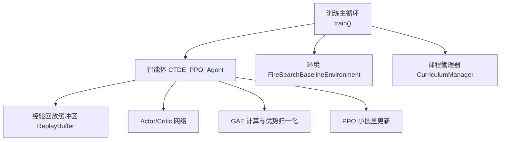
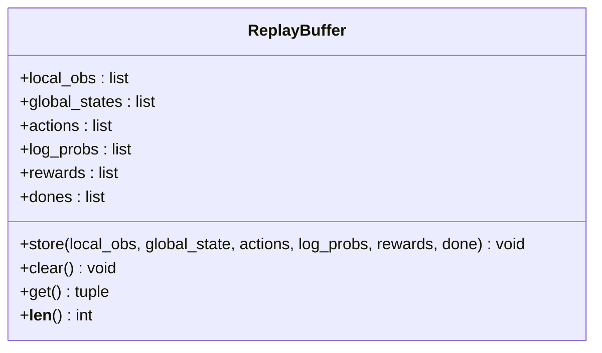
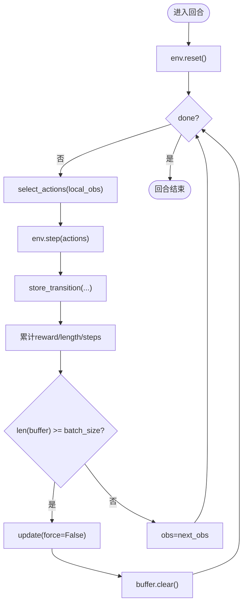
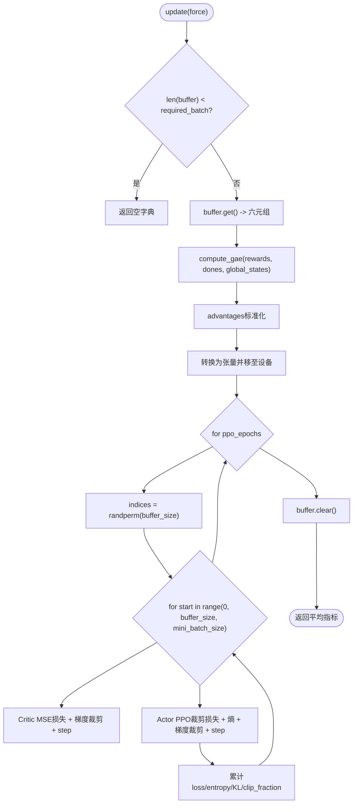
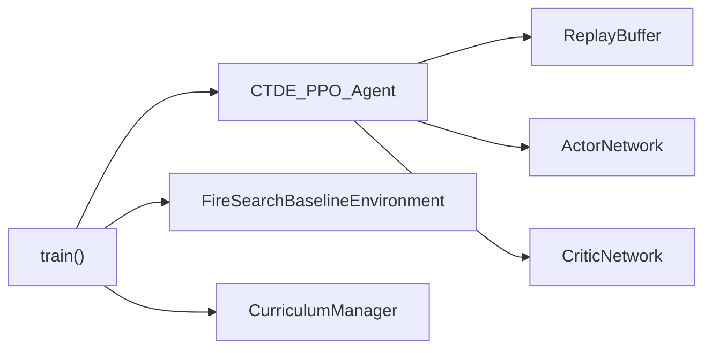

# 经验回放缓冲区管理

<cite>
**本文引用的文件**   
- [ctde_ppo_baseline_train.py](file://environment_variables/environment_variables/ctde_ppo_baseline_train.py)
</cite>

## 目录
1. [简介](#简介)
2. [项目结构](#项目结构)
3. [核心组件](#核心组件)
4. [架构总览](#架构总览)
5. [详细组件分析](#详细组件分析)
6. [依赖关系分析](#依赖关系分析)
7. [性能考量](#性能考量)
8. [故障排查指南](#故障排查指南)
9. [结论](#结论)
10. [附录](#附录)

## 简介
本技术文档聚焦于经验回放缓冲区（ReplayBuffer）在CTDE-PPO训练流程中的数据结构设计、数据收集与存储、批量采样与更新机制、清理与重置策略、容量限制与溢出处理，以及分布式场景下的数据同步与一致性保证。同时提供缓冲区利用率、采样效率等关键指标的统计与分析方法，帮助读者深入理解并优化该实现。

## 项目结构
本项目为CTDE-PPO基线训练脚本，包含环境交互、智能体、课程学习管理器与经验回放缓冲区的完整实现。经验回放缓冲区作为PPO算法的数据中间层，负责缓存多智能体与环境交互产生的轨迹片段，并在满足条件时触发模型更新。



图表来源
- [ctde_ppo_baseline_train.py:1278-1600](file://environment_variables/environment_variables/ctde_ppo_baseline_train.py#L1278-L1600)
- [ctde_ppo_baseline_train.py:537-567](file://environment_variables/environment_variables/ctde_ppo_baseline_train.py#L537-L567)
- [ctde_ppo_baseline_train.py:759-991](file://environment_variables/environment_variables/ctde_ppo_baseline_train.py#L759-L991)

章节来源
- [ctde_ppo_baseline_train.py:1278-1600](file://environment_variables/environment_variables/ctde_ppo_baseline_train.py#L1278-L1600)

## 核心组件
- 经验回放缓冲区 ReplayBuffer：以列表形式按时间步顺序存储本地观测、全局状态、动作、对数概率、奖励与终止标记。
- 智能体 CTDE_PPO_Agent：封装Actor/Critic网络、优化器、GAE计算、PPO更新逻辑，并持有ReplayBuffer实例。
- 训练主循环 train()：驱动环境交互、记录指标、触发更新、保存模型与日志。

章节来源
- [ctde_ppo_baseline_train.py:537-567](file://environment_variables/environment_variables/ctde_ppo_baseline_train.py#L537-L567)
- [ctde_ppo_baseline_train.py:759-991](file://environment_variables/environment_variables/ctde_ppo_baseline_train.py#L759-L991)
- [ctde_ppo_baseline_train.py:1278-1600](file://environment_variables/environment_variables/ctde_ppo_baseline_train.py#L1278-L1600)

## 架构总览
下图展示了从环境交互到缓冲区存储再到PPO更新的端到端数据流。

```mermaid
sequenceDiagram
participant Env as "环境"
participant Agent as "智能体"
participant Buffer as "ReplayBuffer"
participant Actor as "Actor网络"
participant Critic as "Critic网络"
Env->>Agent : reset()
loop 每步
Agent->>Env : step(actions)
Env-->>Agent : next_obs, rewards, done, info
Agent->>Buffer : store_transition(local_obs, global_state, actions, log_probs, rewards, done)
alt 缓冲区达到batch_size
Agent->>Agent : compute_gae(rewards_list, dones, global_states)
Agent->>Critic : 预测值(用于returns)
Agent->>Actor : 采样新log_probs与熵
Agent->>Agent : PPO小批量更新(advantages归一化)
Agent->>Buffer : clear()
end
end
```

图表来源
- [ctde_ppo_baseline_train.py:1487-1505](file://environment_variables/environment_variables/ctde_ppo_baseline_train.py#L1487-L1505)
- [ctde_ppo_baseline_train.py:864-866](file://environment_variables/environment_variables/ctde_ppo_baseline_train.py#L864-L866)
- [ctde_ppo_baseline_train.py:867-887](file://environment_variables/environment_variables/ctde_ppo_baseline_train.py#L867-L887)
- [ctde_ppo_baseline_train.py:889-991](file://environment_variables/environment_variables/ctde_ppo_baseline_train.py#L889-L991)

## 详细组件分析

### ReplayBuffer 数据结构与管理策略
- 字段说明
  - local_obs：每个时间步的本地观测列表，形状为[时间步, 多智能体, 观测维度]。
  - global_states：每个时间步的全局状态列表，形状为[时间步, 全局状态维度]。
  - actions：每个时间步的动作列表，形状为[时间步, 多智能体]。
  - log_probs：每个时间步的对数概率列表，形状为[时间步, 多智能体]。
  - rewards：每个时间步的团队奖励列表，形状为[时间步, 多智能体]。
  - dones：每个时间步的终止标记列表，形状为[时间步]。
- 存储策略
  - 使用append追加，保持时间顺序；未设置固定容量上限，内存增长由外部控制。
- 访问接口
  - get()返回六元组，供上层进行GAE计算与PPO更新。
  - clear()清空所有字段，释放内存。
  - __len__()基于rewards长度，便于判断是否满足更新阈值。



图表来源
- [ctde_ppo_baseline_train.py:537-567](file://environment_variables/environment_variables/ctde_ppo_baseline_train.py#L537-L567)

章节来源
- [ctde_ppo_baseline_train.py:537-567](file://environment_variables/environment_variables/ctde_ppo_baseline_train.py#L537-L567)

### 数据收集流程（环境交互到缓冲区存储）
- 主循环中每步执行：
  - 从环境获取next_obs、rewards、done、info。
  - 调用agent.store_transition将当前步的local_obs、global_state、actions、log_probs、rewards、done写入缓冲区。
  - 累计episode_reward、episode_length、total_steps。
- 触发更新的条件：
  - 当缓冲区长度≥配置batch_size时，触发一次PPO更新。
  - 课程难度变化或阶段切换时，若缓冲区长度≥min_update_batch_size则强制更新，否则直接清空缓冲区。



图表来源
- [ctde_ppo_baseline_train.py:1487-1505](file://environment_variables/environment_variables/ctde_ppo_baseline_train.py#L1487-L1505)
- [ctde_ppo_baseline_train.py:864-866](file://environment_variables/environment_variables/ctde_ppo_baseline_train.py#L864-L866)
- [ctde_ppo_baseline_train.py:889-991](file://environment_variables/environment_variables/ctde_ppo_baseline_train.py#L889-L991)

章节来源
- [ctde_ppo_baseline_train.py:1487-1505](file://environment_variables/environment_variables/ctde_ppo_baseline_train.py#L1487-L1505)

### 批量采样机制与内存优化
- 参数定义
  - batch_size：触发PPO更新的总样本量阈值。
  - mini_batch_size：PPO内部小批量大小，默认max(512, batch_size // 8)。
  - min_update_batch_size：最小可更新阈值，默认max(512, batch_size // 4)，用于课程难度变化时的强制更新。
- 采样与更新流程
  - 每次更新前计算GAE与returns，并对advantages进行标准化（减均值除标准差）。
  - 在每个ppo_epochs轮次内，随机打乱索引并按mini_batch_size切片迭代。
  - 先更新Critic（MSE损失），再更新Actor（PPO裁剪目标+熵正则）。
  - 更新完成后清空缓冲区，避免重复使用旧数据。
- 内存优化要点
  - 通过mini_batch_size控制单次GPU显存占用，避免一次性加载全部样本。
  - 使用torch.randperm生成索引，避免复制大数组。
  - 在课程难度变化且缓冲区不足时直接clear，防止无效数据累积。



图表来源
- [ctde_ppo_baseline_train.py:889-991](file://environment_variables/environment_variables/ctde_ppo_baseline_train.py#L889-L991)

章节来源
- [ctde_ppo_baseline_train.py:800-804](file://environment_variables/environment_variables/ctde_ppo_baseline_train.py#L800-L804)
- [ctde_ppo_baseline_train.py:889-991](file://environment_variables/environment_variables/ctde_ppo_baseline_train.py#L889-L991)

### 数据清理与重置（多episode训练内存管理）
- 正常路径：每次update后调用buffer.clear()，确保下一批数据从零开始积累。
- 课程难度变化路径：
  - 若缓冲区长度≥min_update_batch_size，则force=True进行一次更新后再继续。
  - 若缓冲区长度不足，则直接clear，丢弃尚未形成有效批次的历史数据，避免污染后续更新。
- 回合结束后的清理：
  - 主循环在episode结束后检查是否需要更新；若未达batch_size则不清理，等待下一个episode继续累积。

章节来源
- [ctde_ppo_baseline_train.py:1568-1587](file://environment_variables/environment_variables/ctde_ppo_baseline_train.py#L1568-L1587)
- [ctde_ppo_baseline_train.py:1678-1680](file://environment_variables/environment_variables/ctde_ppo_baseline_train.py#L1678-L1680)

### 缓冲区大小限制与溢出处理策略
- 当前实现未内置固定容量上限，缓冲区长度随episode累积直至触发更新。
- 溢出风险缓解：
  - 通过batch_size与min_update_batch_size双重阈值控制更新时机。
  - 课程难度变化时，若缓冲区不足则clear，避免长期滞留低质量数据。
- 建议扩展（可选）：
  - 引入环形缓冲区或最大长度截断策略，结合时间衰减权重，提升长episode场景下的稳定性。

章节来源
- [ctde_ppo_baseline_train.py:1504-1505](file://environment_variables/environment_variables/ctde_ppo_baseline_train.py#L1504-L1505)
- [ctde_ppo_baseline_train.py:1568-1587](file://environment_variables/environment_variables/ctde_ppo_baseline_train.py#L1568-L1587)

### 分布式训练场景下的数据同步与一致性保证
- 当前实现为单机单进程模式，无显式分布式通信或共享缓冲区。
- 若要扩展到分布式：
  - 采用集中式参数服务器或AllReduce聚合梯度，缓冲区可在各worker本地维护，定期同步模型参数。
  - 为保证一致性，需确保actor/critic在更新期间不被并发读取，或使用锁/版本戳。
  - 对于全局状态global_states，需在多智能体间保持一致视图，必要时增加广播/同步步骤。

章节来源
- [ctde_ppo_baseline_train.py:759-814](file://environment_variables/environment_variables/ctde_ppo_baseline_train.py#L759-L814)

### 性能监控指标与统计方法
- 缓冲区利用率
  - 定义：实际使用的样本数 / batch_size。
  - 统计：在update前后记录len(buffer)/batch_size，输出至training_log["buffer_utilization"]。
- 采样效率
  - 定义：单位时间内采样的步数（steps/sec）。
  - 统计：记录每步时间与total_steps增量，计算滑动窗口均值。
- 更新频率
  - 定义：每episode或每N步触发update的次数。
  - 统计：记录training_log["ppo_updates"]序列，观察分布与趋势。
- KL与裁剪比例
  - approx_kl与clip_fraction已在update中计算并记录，可用于评估策略更新稳定性。
- 建议新增指标
  - 缓冲区命中率：mini_batch_size内的样本来自最近episode的比例。
  - 数据新鲜度：最新样本的时间步距离当前步的平均差值。

章节来源
- [ctde_ppo_baseline_train.py:980-991](file://environment_variables/environment_variables/ctde_ppo_baseline_train.py#L980-L991)
- [ctde_ppo_baseline_train.py:1393-1436](file://environment_variables/environment_variables/ctde_ppo_baseline_train.py#L1393-L1436)

## 依赖关系分析
- ReplayBuffer被CTDE_PPO_Agent持有，并在update中消费其数据。
- CTDE_PPO_Agent依赖ActorNetwork与CriticNetwork进行策略与价值估计。
- 训练主循环train()协调环境、智能体与课程管理器，决定何时更新与保存。



图表来源
- [ctde_ppo_baseline_train.py:759-814](file://environment_variables/environment_variables/ctde_ppo_baseline_train.py#L759-L814)
- [ctde_ppo_baseline_train.py:1278-1600](file://environment_variables/environment_variables/ctde_ppo_baseline_train.py#L1278-L1600)

章节来源
- [ctde_ppo_baseline_train.py:759-814](file://environment_variables/environment_variables/ctde_ppo_baseline_train.py#L759-L814)
- [ctde_ppo_baseline_train.py:1278-1600](file://environment_variables/environment_variables/ctde_ppo_baseline_train.py#L1278-L1600)

## 性能考量
- 内存占用
  - 主要来源于local_obs、global_states、actions、log_probs、rewards、dones的列表累积。建议在episode较长时适当降低batch_size或提高更新频率。
- GPU显存
  - mini_batch_size直接影响单次前向/反向传播的显存峰值。可根据硬件调整，确保不超过显存上限。
- CPU/GPU传输
  - 频繁to(device)与cpu().numpy()可能带来开销。可考虑在CPU侧预构建张量或在GPU侧直接操作，减少拷贝。
- 数值稳定性
  - advantages标准化时加入epsilon防除零；KL自适应学习率策略有助于稳定更新。

章节来源
- [ctde_ppo_baseline_train.py:800-804](file://environment_variables/environment_variables/ctde_ppo_baseline_train.py#L800-L804)
- [ctde_ppo_baseline_train.py:889-991](file://environment_variables/environment_variables/ctde_ppo_baseline_train.py#L889-L991)

## 故障排查指南
- 缓冲区未触发更新
  - 现象：长时间无update日志。
  - 排查：确认batch_size是否过大；检查episode长度与done信号是否正确；查看training_log["ppo_updates"]是否为0。
- 内存泄漏或OOM
  - 现象：训练过程中内存持续增长或崩溃。
  - 排查：确认update后是否调用clear()；检查课程难度变化分支是否及时clear；适当减小batch_size或mini_batch_size。
- KL异常或策略崩溃
  - 现象：approx_kl过大或clip_fraction接近1。
  - 排查：启用KL自适应学习率；降低entropy_coef或value_coef；检查advantages标准化是否生效。
- 课程难度切换导致数据污染
  - 现象：切换阶段后性能波动。
  - 排查：确认min_update_batch_size阈值；必要时在切换前强制更新并clear。

章节来源
- [ctde_ppo_baseline_train.py:1568-1587](file://environment_variables/environment_variables/ctde_ppo_baseline_train.py#L1568-L1587)
- [ctde_ppo_baseline_train.py:980-991](file://environment_variables/environment_variables/ctde_ppo_baseline_train.py#L980-L991)

## 结论
本实现采用简洁高效的列表型ReplayBuffer配合PPO小批量更新，具备清晰的存储、采样与清理流程。通过batch_size与mini_batch_size的参数化控制，能够在内存与性能之间取得平衡。针对分布式场景与更严格的容量限制，可在现有基础上引入环形缓冲区与共享参数服务器，进一步提升可扩展性与稳定性。

## 附录
- 关键配置项参考
  - batch_size：默认4096，最小规范化为32。
  - ppo_epochs：默认4。
  - mini_batch_size：默认max(512, batch_size // 8)。
  - min_update_batch_size：默认max(512, batch_size // 4)。

章节来源
- [ctde_ppo_baseline_train.py:128-132](file://environment_variables/environment_variables/ctde_ppo_baseline_train.py#L128-L132)
- [ctde_ppo_baseline_train.py:221-225](file://environment_variables/environment_variables/ctde_ppo_baseline_train.py#L221-L225)
- [ctde_ppo_baseline_train.py:800-804](file://environment_variables/environment_variables/ctde_ppo_baseline_train.py#L800-L804)