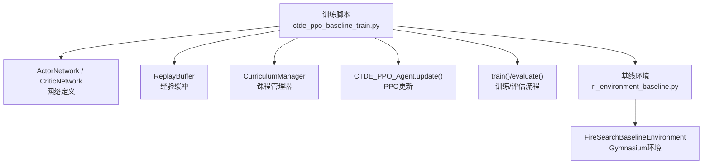
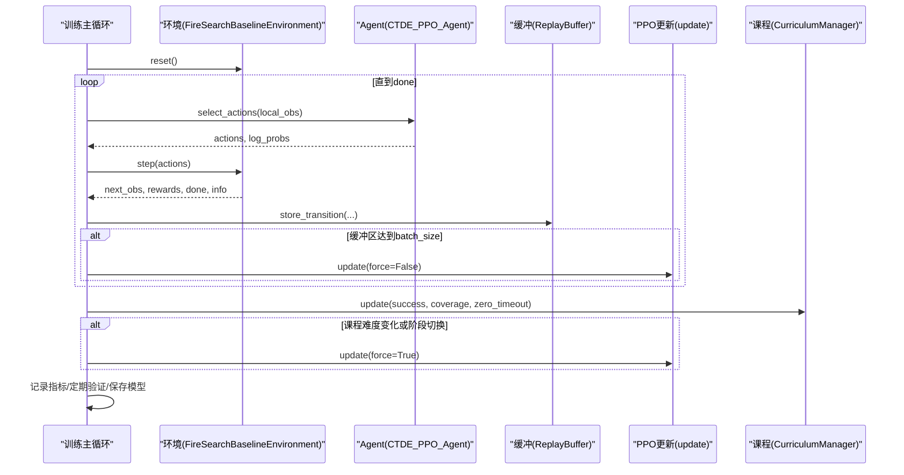
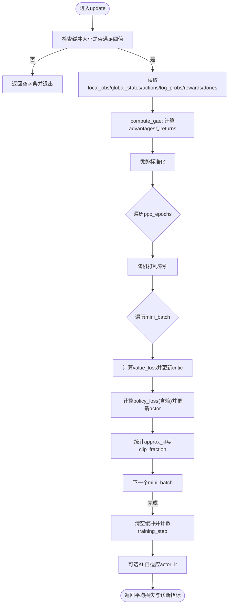
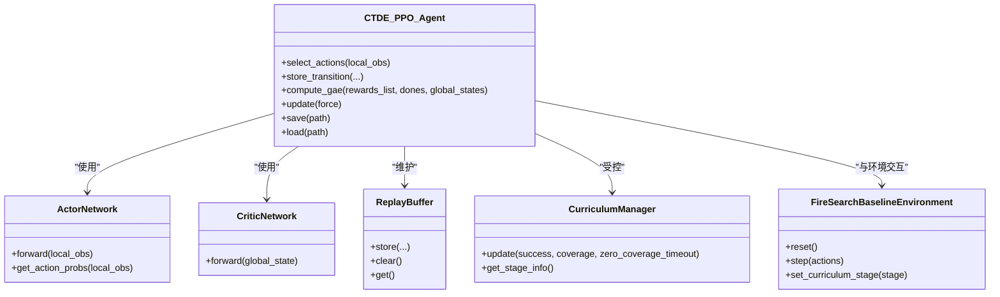

# 训练循环优化与批处理

<cite>
**本文引用的文件**   
- [ctde_ppo_baseline_train.py](file://environment_variables/environment_variables/ctde_ppo_baseline_train.py)
- [rl_environment_baseline.py](file://environment_variables/environment_variables/rl_environment_baseline.py)
</cite>

## 目录
1. [简介](#简介)
2. [项目结构](#项目结构)
3. [核心组件](#核心组件)
4. [架构总览](#架构总览)
5. [详细组件分析](#详细组件分析)
6. [依赖关系分析](#依赖关系分析)
7. [性能考量](#性能考量)
8. [故障排查指南](#故障排查指南)
9. [结论](#结论)
10. [附录](#附录)

## 简介
本技术文档聚焦于CTDE-PPO基线训练脚本的训练主循环、前向传播、优势计算、损失计算与参数更新流程，系统阐述批处理策略（batch_size、mini_batch划分、随机打乱）、梯度裁剪与数值稳定性保障、GPU/CPU设备自动检测与内存管理、并行训练与多进程扩展可能性、训练监控指标、早停与模型保存策略，以及调试与日志分析方法。内容严格基于仓库中的实现进行解读，并辅以可视化图示帮助理解。

## 项目结构
本项目包含一个完整的CTDE-PPO训练入口与基线环境：
- 训练主循环与算法实现位于训练脚本中，包含网络定义、回放缓冲、PPO更新、课程学习、评估与保存等逻辑。
- 基线环境提供多无人机火场边界搜索任务接口，支持多种观测与奖励配置。

图表来源
- [ctde_ppo_baseline_train.py:460-535](file://environment_variables/environment_variables/ctde_ppo_baseline_train.py#L460-L535)
- [ctde_ppo_baseline_train.py:537-567](file://environment_variables/environment_variables/ctde_ppo_baseline_train.py#L537-L567)
- [ctde_ppo_baseline_train.py:569-752](file://environment_variables/environment_variables/ctde_ppo_baseline_train.py#L569-L752)
- [ctde_ppo_baseline_train.py:759-1014](file://environment_variables/environment_variables/ctde_ppo_baseline_train.py#L759-L1014)
- [ctde_ppo_baseline_train.py:1278-1814](file://environment_variables/environment_variables/ctde_ppo_baseline_train.py#L1278-L1814)
- [rl_environment_baseline.py:21-158](file://environment_variables/environment_variables/rl_environment_baseline.py#L21-L158)

章节来源
- [ctde_ppo_baseline_train.py:1-158](file://environment_variables/environment_variables/ctde_ppo_baseline_train.py#L1-L158)
- [rl_environment_baseline.py:1-158](file://environment_variables/environment_variables/rl_environment_baseline.py#L1-L158)

## 核心组件
- ActorNetwork：离散动作策略网络，输出动作对数概率分布。
- CriticNetwork：全局状态价值网络，输出标量价值估计。
- ReplayBuffer：按时间步收集(local_obs, global_state, actions, log_probs, rewards, done)。
- CTDE_PPO_Agent：封装选择动作、存储转移、GAE优势计算、PPO多轮小批量更新、KL自适应学习率、设备管理与模型存取。
- CurriculumManager：三阶段课程学习，控制初始位置百分位、目标成功率与近界生成概率退火。
- FireSearchBaselineEnvironment：多无人机火场边界搜索环境，提供局部观测与全局状态，支持多种观测/奖励配置。

章节来源
- [ctde_ppo_baseline_train.py:460-535](file://environment_variables/environment_variables/ctde_ppo_baseline_train.py#L460-L535)
- [ctde_ppo_baseline_train.py:537-567](file://environment_variables/environment_variables/ctde_ppo_baseline_train.py#L537-L567)
- [ctde_ppo_baseline_train.py:569-752](file://environment_variables/environment_variables/ctde_ppo_baseline_train.py#L569-L752)
- [ctde_ppo_baseline_train.py:759-1014](file://environment_variables/environment_variables/ctde_ppo_baseline_train.py#L759-L1014)
- [rl_environment_baseline.py:21-158](file://environment_variables/environment_variables/rl_environment_baseline.py#L21-L158)

## 架构总览
下图展示训练主循环与控制流，包括环境交互、经验收集、PPO更新、课程学习与评估保存。

图表来源
- [ctde_ppo_baseline_train.py:1278-1814](file://environment_variables/environment_variables/ctde_ppo_baseline_train.py#L1278-L1814)
- [ctde_ppo_baseline_train.py:759-1014](file://environment_variables/environment_variables/ctde_ppo_baseline_train.py#L759-L1014)
- [ctde_ppo_baseline_train.py:569-752](file://environment_variables/environment_variables/ctde_ppo_baseline_train.py#L569-L752)

## 详细组件分析

### PPO训练主循环与参数更新流程
- 前向传播：
  - 策略网络根据局部观测输出动作分布，采样动作并记录log_prob。
  - 价值网络根据全局状态输出价值估计。
- 优势计算：
  - 使用GAE方法，结合回报与价值估计，得到优势序列并进行标准化。
- 损失计算：
  - 价值损失为MSE；策略损失采用带裁剪的代理目标，并加入熵正则项。
- 参数更新：
  - 在每个mini_batch上分别执行critic与actor的零梯度、反向传播、梯度裁剪与优化器步进。
  - 统计近似KL与裁剪比例用于诊断与可能的学习率调整。

图表来源
- [ctde_ppo_baseline_train.py:889-991](file://environment_variables/environment_variables/ctde_ppo_baseline_train.py#L889-L991)
- [ctde_ppo_baseline_train.py:867-887](file://environment_variables/environment_variables/ctde_ppo_baseline_train.py#L867-L887)

章节来源
- [ctde_ppo_baseline_train.py:867-991](file://environment_variables/environment_variables/ctde_ppo_baseline_train.py#L867-L991)

### ppo_epochs超参数的影响
- 样本利用率：
  - ppo_epochs越大，同一批数据被重复使用的次数越多，样本利用率提升，但可能带来过拟合风险。
- 训练稳定性：
  - 较大的epochs会放大策略更新的累积效应，若配合较大的clip_epsilon或较小的max_grad_norm，可能导致KL发散或震荡。
- 实践建议：
  - 在固定batch_size下，增加ppo_epochs可视为降低有效mini_batch规模，需相应调整学习率与KL自适应参数以维持稳定。

章节来源
- [ctde_ppo_baseline_train.py:912-967](file://environment_variables/environment_variables/ctde_ppo_baseline_train.py#L912-L967)
- [ctde_ppo_baseline_train.py:828-847](file://environment_variables/environment_variables/ctde_ppo_baseline_train.py#L828-L847)

### 批处理策略：batch_size、mini_batch与随机打乱
- batch_size设置：
  - 当缓冲长度达到batch_size时触发一次完整更新；该阈值决定每轮更新的数据规模。
- mini_batch划分：
  - 内部将批次划分为多个mini_batch进行多次优化步进，默认mini_batch_size为batch_size//8且不低于512，有助于提高梯度估计方差控制与收敛平滑性。
- 随机打乱的重要性：
  - 每个epoch内对索引进行随机打乱，避免顺序相关性与局部模式导致的偏差，提升泛化与稳定性。

章节来源
- [ctde_ppo_baseline_train.py:800-804](file://environment_variables/environment_variables/ctde_ppo_baseline_train.py#L800-L804)
- [ctde_ppo_baseline_train.py:912-916](file://environment_variables/environment_variables/ctde_ppo_baseline_train.py#L912-L916)
- [ctde_ppo_baseline_train.py:1504-1505](file://environment_variables/environment_variables/ctde_ppo_baseline_train.py#L1504-L1505)

### 梯度裁剪max_grad_norm与数值稳定性
- 作用：
  - 在actor与critic的反向传播后对参数梯度范数进行裁剪，防止梯度爆炸，保证训练稳定。
- 数值稳定性保障：
  - 优势标准化引入小常数分母，避免除零；KL自适应通过指数衰减因子限制学习率上下界；裁剪比例用于监控策略偏离程度。

章节来源
- [ctde_ppo_baseline_train.py:925-926](file://environment_variables/environment_variables/ctde_ppo_baseline_train.py#L925-L926)
- [ctde_ppo_baseline_train.py:955-956](file://environment_variables/environment_variables/ctde_ppo_baseline_train.py#L955-L956)
- [ctde_ppo_baseline_train.py:898](file://environment_variables/environment_variables/ctde_ppo_baseline_train.py#L898)
- [ctde_ppo_baseline_train.py:828-847](file://environment_variables/environment_variables/ctde_ppo_baseline_train.py#L828-L847)

### GPU/CPU设备自动检测与内存管理
- 设备自动检测：
  - 初始化时若device="auto"，则优先选择CUDA，否则回退到CPU。
- 内存管理：
  - 训练结束后释放显存缓存；评估前后恢复随机数生成器状态以保证结果可复现。
- 最佳实践：
  - 在多进程或多变体对比训练中，及时清理显存，避免OOM。

章节来源
- [ctde_ppo_baseline_train.py:805-808](file://environment_variables/environment_variables/ctde_ppo_baseline_train.py#L805-L808)
- [ctde_ppo_baseline_train.py:1978-1979](file://environment_variables/environment_variables/ctde_ppo_baseline_train.py#L1978-L1979)
- [ctde_ppo_baseline_train.py:1170-1183](file://environment_variables/environment_variables/ctde_ppo_baseline_train.py#L1170-L1183)

### 并行训练与多进程优化的可能性
- 当前实现：
  - 单进程训练，无内置多进程环境并行或分布式优化。
- 可扩展方向：
  - 多进程环境并行：为每个进程创建独立的环境实例与Agent，汇总经验或异步更新共享策略。
  - 分布式优化：使用多机多卡，结合梯度同步或异步参数服务器架构。
  - 注意：需确保随机种子与设备分配的一致性，避免非确定性带来的评估波动。

章节来源
- [ctde_ppo_baseline_train.py:1924-2080](file://environment_variables/environment_variables/ctde_ppo_baseline_train.py#L1924-L2080)

### 训练性能监控指标
- 吞吐量：
  - 可通过累计total_steps与训练时长估算步级吞吐；日志中包含“总步数”和“用时”。
- 内存使用：
  - 显存占用可通过外部工具监控；代码在对比训练结束时调用显存清理。
- GPU利用率：
  - 建议使用nvidia-smi或可视化工具监控；训练脚本未直接采集该指标。
- 关键训练指标：
  - 奖励、覆盖率、成功率、任务得分、超时率、KL值、裁剪比例、学习率轨迹等均在训练日志中记录。

章节来源
- [ctde_ppo_baseline_train.py:1787-1814](file://environment_variables/environment_variables/ctde_ppo_baseline_train.py#L1787-L1814)
- [ctde_ppo_baseline_train.py:1393-1450](file://environment_variables/environment_variables/ctde_ppo_baseline_train.py#L1393-L1450)

### 早停机制与模型保存策略
- 早停：
  - 未实现传统意义上的早停；但支持最大训练更新预算(max_train_updates)提前终止。
- 模型保存：
  - 周期性保存checkpoint；根据滚动任务得分保存最佳训练模型；在阶段3且终末专注激活后，依据验证模型分数保存最佳验证模型；最终保存最终模型。

章节来源
- [ctde_ppo_baseline_train.py:1673-1676](file://environment_variables/environment_variables/ctde_ppo_baseline_train.py#L1673-L1676)
- [ctde_ppo_baseline_train.py:1659-1671](file://environment_variables/environment_variables/ctde_ppo_baseline_train.py#L1659-L1671)
- [ctde_ppo_baseline_train.py:1628-1643](file://environment_variables/environment_variables/ctde_ppo_baseline_train.py#L1628-L1643)
- [ctde_ppo_baseline_train.py:1681-1683](file://environment_variables/environment_variables/ctde_ppo_baseline_train.py#L1681-L1683)

### 调试工具与日志分析方法
- 控制台日志重定向：
  - 训练开始即建立控制台输出与文件的tee，便于离线分析与回溯。
- 训练日志：
  - JSON与NPZ格式保存训练与验证日志，包含回合、指标、KL、学习率、课程阶段等信息。
- 质量指标：
  - 训练结束后计算收敛效率、奖励稳定性与KL稳定性等综合指标，辅助判断训练健康度。
- 图表生成：
  - 训练后可调用脚本生成训练曲线与泛化评估图，便于直观诊断。

章节来源
- [ctde_ppo_baseline_train.py:78-96](file://environment_variables/environment_variables/ctde_ppo_baseline_train.py#L78-L96)
- [ctde_ppo_baseline_train.py:1685-1698](file://environment_variables/environment_variables/ctde_ppo_baseline_train.py#L1685-L1698)
- [ctde_ppo_baseline_train.py:1048-1116](file://environment_variables/environment_variables/ctde_ppo_baseline_train.py#L1048-L1116)

## 依赖关系分析
- 训练脚本依赖基线环境提供的观察与奖励接口，并通过课程管理器动态调整环境难度。
- Agent内部依赖Actor/Critic网络与优化器，使用PyTorch张量进行高效计算。
- 评估函数在训练后进行跨数据集与阶段的性能验证，并输出结构化摘要。

图表来源
- [ctde_ppo_baseline_train.py:460-535](file://environment_variables/environment_variables/ctde_ppo_baseline_train.py#L460-L535)
- [ctde_ppo_baseline_train.py:537-567](file://environment_variables/environment_variables/ctde_ppo_baseline_train.py#L537-L567)
- [ctde_ppo_baseline_train.py:569-752](file://environment_variables/environment_variables/ctde_ppo_baseline_train.py#L569-L752)
- [ctde_ppo_baseline_train.py:759-1014](file://environment_variables/environment_variables/ctde_ppo_baseline_train.py#L759-L1014)
- [rl_environment_baseline.py:21-158](file://environment_variables/environment_variables/rl_environment_baseline.py#L21-L158)

章节来源
- [ctde_ppo_baseline_train.py:460-1014](file://environment_variables/environment_variables/ctde_ppo_baseline_train.py#L460-L1014)
- [rl_environment_baseline.py:21-158](file://environment_variables/environment_variables/rl_environment_baseline.py#L21-L158)

## 性能考量
- 批大小与mini_batch：
  - 增大batch_size可提升GPU并行度，但需关注显存占用；mini_batch过小会增加迭代次数与开销，过大则可能降低收敛稳定性。
- ppo_epochs：
  - 合理设置以避免过度利用同一批数据导致策略退化；结合KL自适应与梯度裁剪共同维持稳定。
- 设备与内存：
  - 在GPU上训练时，尽量保持张量在同一设备上以减少拷贝；必要时显存清理避免溢出。
- 监控与调参：
  - 关注KL值与裁剪比例，若KL持续高于目标或裁剪比例过高，应降低学习率或减少ppo_epochs。

[本节为通用指导，不直接分析具体文件]

## 故障排查指南
- 训练停滞或发散：
  - 检查KL值是否超过目标过多；适当降低actor学习率或减小ppo_epochs；确认梯度裁剪是否生效。
- 内存不足：
  - 减小batch_size或mini_batch；在对比训练结束后显存清理；关闭不必要的图表生成。
- 评估结果不稳定：
  - 确认评估前后随机数状态已恢复；固定场景键与阶段配置一致。
- 日志缺失：
  - 检查控制台tee是否成功写入；确认输出目录权限与路径存在。

章节来源
- [ctde_ppo_baseline_train.py:828-847](file://environment_variables/environment_variables/ctde_ppo_baseline_train.py#L828-L847)
- [ctde_ppo_baseline_train.py:1978-1979](file://environment_variables/environment_variables/ctde_ppo_baseline_train.py#L1978-L1979)
- [ctde_ppo_baseline_train.py:1170-1183](file://environment_variables/environment_variables/ctde_ppo_baseline_train.py#L1170-L1183)
- [ctde_ppo_baseline_train.py:78-96](file://environment_variables/environment_variables/ctde_ppo_baseline_train.py#L78-L96)

## 结论
本实现提供了稳健的CTDE-PPO训练框架，具备完善的批处理策略、KL自适应学习率、梯度裁剪与课程学习机制。通过合理的batch_size、mini_batch与ppo_epochs配置，可在样本利用率与训练稳定性之间取得平衡。训练过程配套丰富的日志与质量指标，便于诊断与优化。未来可在多进程并行与分布式优化方面进一步扩展，以提升吞吐与可扩展性。

[本节为总结，不直接分析具体文件]

## 附录
- 关键配置项参考：
  - ppo_epochs、batch_size、mini_batch_size、max_grad_norm、clip_epsilon、entropy_coef、value_coef、gamma、gae_lambda、target_kl、kl_ema_beta、kl_lr_alpha等。
- 输出产物：
  - 训练日志JSON/NPZ、验证日志、质量指标JSON、模型权重、控制台日志、图表目录。

章节来源
- [ctde_ppo_baseline_train.py:98-158](file://environment_variables/environment_variables/ctde_ppo_baseline_train.py#L98-L158)
- [ctde_ppo_baseline_train.py:1685-1814](file://environment_variables/environment_variables/ctde_ppo_baseline_train.py#L1685-L1814)