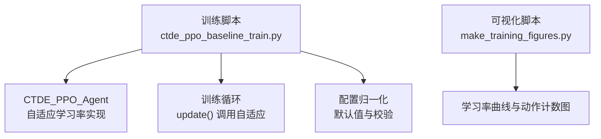
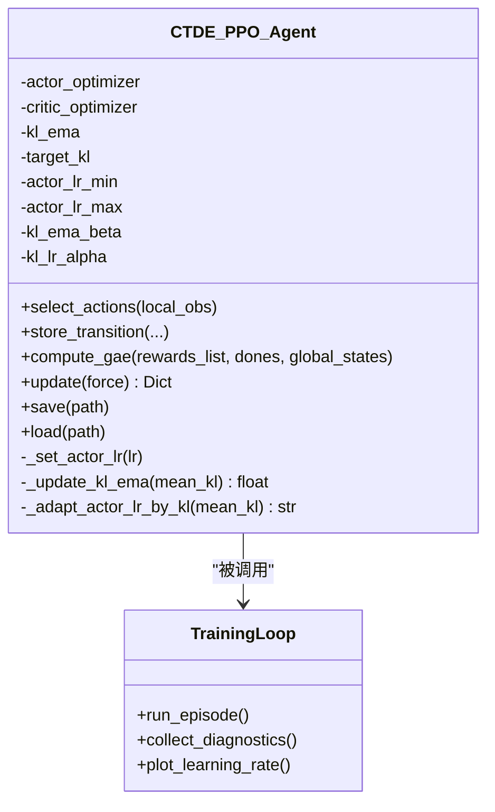

# 自适应学习率机制

<cite>
**本文引用的文件**   
- [ctde_ppo_baseline_train.py](file://environment_variables/environment_variables/ctde_ppo_baseline_train.py)
- [make_training_figures.py](file://environment_variables/environment_variables/outputs/make_training_figures.py)
</cite>

## 目录
1. [引言](#引言)
2. [项目结构](#项目结构)
3. [核心组件](#核心组件)
4. [架构总览](#架构总览)
5. [详细组件分析](#详细组件分析)
6. [依赖关系分析](#依赖关系分析)
7. [性能与数值稳定性](#性能与数值稳定性)
8. [故障排查指南](#故障排查指南)
9. [结论](#结论)
10. [附录：参数与实践指南](#附录参数与实践指南)

## 引言
本技术文档聚焦于仓库中的“基于KL散度的自适应学习率”机制，系统阐述其算法原理、实现细节与使用建议。该机制在PPO训练过程中，依据近端策略更新产生的近似KL散度，动态调整Actor的学习率，以维持策略更新的步长稳定，避免过大或过小导致的震荡或停滞。同时提供固定学习率模式与KL自适应模式的切换逻辑，并给出上下界约束、EMA平滑、比例控制器等关键模块的说明与调参实践。

## 项目结构
与自适应学习率相关的核心代码集中在训练脚本中，包含配置归一化、Agent类（含自适应逻辑）、训练循环与可视化输出。



图表来源
- [ctde_ppo_baseline_train.py:759-847](file://environment_variables/environment_variables/ctde_ppo_baseline_train.py#L759-L847)
- [ctde_ppo_baseline_train.py:889-991](file://environment_variables/environment_variables/ctde_ppo_baseline_train.py#L889-L991)
- [make_training_figures.py:852-903](file://environment_variables/environment_variables/outputs/make_training_figures.py#L852-L903)

章节来源
- [ctde_ppo_baseline_train.py:98-158](file://environment_variables/environment_variables/ctde_ppo_baseline_train.py#L98-L158)
- [ctde_ppo_baseline_train.py:161-281](file://environment_variables/environment_variables/ctde_ppo_baseline_train.py#L161-L281)
- [ctde_ppo_baseline_train.py:759-847](file://environment_variables/environment_variables/ctde_ppo_baseline_train.py#L759-L847)
- [ctde_ppo_baseline_train.py:889-991](file://environment_variables/environment_variables/ctde_ppo_baseline_train.py#L889-L991)
- [make_training_figures.py:852-903](file://environment_variables/environment_variables/outputs/make_training_figures.py#L852-L903)

## 核心组件
- CTDE_PPO_Agent：封装Actor/Critic网络、优化器、PPO更新流程以及自适应学习率控制。
- 自适应学习率控制器：基于近似KL散度与指数移动平均(EMA)，通过比例控制器计算学习率缩放因子，并在上下界内裁剪后应用。
- 配置归一化：对默认配置进行类型转换、范围裁剪与合法性校验，确保学习率相关参数的安全可用。
- 可视化：绘制Actor学习率随回合的变化曲线及自适应动作统计（up/down/keep/fixed）。

章节来源
- [ctde_ppo_baseline_train.py:759-847](file://environment_variables/environment_variables/ctde_ppo_baseline_train.py#L759-L847)
- [ctde_ppo_baseline_train.py:889-991](file://environment_variables/environment_variables/ctde_ppo_baseline_train.py#L889-L991)
- [ctde_ppo_baseline_train.py:98-158](file://environment_variables/environment_variables/ctde_ppo_baseline_train.py#L98-L158)
- [ctde_ppo_baseline_train.py:161-281](file://environment_variables/environment_variables/ctde_ppo_baseline_train.py#L161-L281)
- [make_training_figures.py:852-903](file://environment_variables/environment_variables/outputs/make_training_figures.py#L852-L903)

## 架构总览
下图展示了自适应学习率在PPO训练中的位置与数据流：训练循环收集近似KL散度，随后根据模式选择是否触发自适应；自适应路径通过EMA平滑与比例控制器得到新的学习率，再经上下界裁剪应用到优化器。

```mermaid
sequenceDiagram
participant Train as "训练循环"
participant Agent as "CTDE_PPO_Agent"
participant KL as "近似KL散度"
participant EMA as "EMA平滑"
participant Ctrl as "比例控制器"
param Opt as "Actor优化器"
Train->>Agent : update(force=False)
Agent->>Agent : PPO多轮小批量更新
Agent-->>Train : approx_kl, clip_fraction, actor_lr
Train->>Agent : 传入 mean_kl
alt lr_adapt_mode == "kl"
Agent->>EMA : _update_kl_ema(mean_kl)
EMA-->>Agent : kl_ema
Agent->>Ctrl : 计算 lr_factor = exp(-alpha*(kl_ema/target_kl - 1))
Ctrl-->>Agent : new_lr = clip(current_lr * lr_factor, min, max)
Agent->>Opt : 设置新学习率
Agent-->>Train : kl_lr_action ∈ {up, down, keep}
else lr_adapt_mode == "fixed"
Agent->>EMA : _update_kl_ema(mean_kl)
Agent-->>Train : kl_lr_action = "fixed"
end
```

图表来源
- [ctde_ppo_baseline_train.py:889-991](file://environment_variables/environment_variables/ctde_ppo_baseline_train.py#L889-L991)
- [ctde_ppo_baseline_train.py:827-847](file://environment_variables/environment_variables/ctde_ppo_baseline_train.py#L827-L847)

## 详细组件分析

### 近似KL散度计算
- 在PPO更新阶段，计算新旧策略概率比 ratio = exp(new_log_probs - old_log_probs)。
- 近似KL采用二阶展开形式：approx_kl = ((ratio - 1) - log_ratio).mean()，用于衡量策略更新的幅度。
- 同时记录clip_fraction，反映被截断的比例，辅助判断更新稳定性。

章节来源
- [ctde_ppo_baseline_train.py:943-960](file://environment_variables/environment_variables/ctde_ppo_baseline_train.py#L943-L960)

### 指数移动平均(EMA)平滑
- 维护一个历史KL估计 kl_ema，按公式 kl_ema = beta * kl_ema + (1 - beta) * mean_kl 更新。
- 作用：降低单步KL噪声，使自适应更稳健。
- 初始化：首次遇到时直接赋值为当前mean_kl。

章节来源
- [ctde_ppo_baseline_train.py:827-834](file://environment_variables/environment_variables/ctde_ppo_baseline_train.py#L827-L834)

### 比例控制器与学习率更新
- 目标：当KL高于目标时减小学习率，低于目标时增大学习率，保持策略更新步长在期望范围内。
- 缩放因子：lr_factor = exp(-alpha * (kl_ema / target_kl - 1))。
  - 当 kl_ema > target_kl 时，指数项为负，lr_factor < 1，学习率下降。
  - 当 kl_ema < target_kl 时，指数项为正，lr_factor > 1，学习率上升。
- 裁剪与应用：new_lr = clip(current_lr * lr_factor, actor_lr_min, actor_lr_max)，并通过优化器组设置。
- 返回动作：比较new_lr与current_lr，返回“up”、“down”或“keep”。

章节来源
- [ctde_ppo_baseline_train.py:835-847](file://environment_variables/environment_variables/ctde_ppo_baseline_train.py#L835-L847)
- [ctde_ppo_baseline_train.py:822-826](file://environment_variables/environment_variables/ctde_ppo_baseline_train.py#L822-L826)

### 固定学习率与KL自适应模式切换
- 配置项 lr_adapt_mode 支持 "fixed" 与 "kl" 两种模式。
- 在训练循环末尾：
  - 若为 "kl"：调用自适应函数，可能改变学习率。
  - 若为 "fixed"：仅更新EMA但不改变学习率，返回 "fixed"。
- 适用场景：
  - fixed：适合快速基线验证、调试或需要严格可复现的场景。
  - kl：适合复杂任务、易发散或不稳定的训练过程，自动抑制过大更新。

章节来源
- [ctde_ppo_baseline_train.py:973-978](file://environment_variables/environment_variables/ctde_ppo_baseline_train.py#L973-L978)
- [ctde_ppo_baseline_train.py:231-234](file://environment_variables/environment_variables/ctde_ppo_baseline_train.py#L231-L234)
- [ctde_ppo_baseline_train.py:784-787](file://environment_variables/environment_variables/ctde_ppo_baseline_train.py#L784-L787)

### 学习率上下界约束与数值稳定性
- 上下界：actor_lr_min 与 actor_lr_max 强制限制学习率范围，防止过小导致停滞或过大导致发散。
- 数值稳定：
  - 使用 torch.exp(log_ratio) 计算比率，log_ratio 由差值获得，避免直接概率相除带来的不稳定。
  - 使用 clip_epsilon 限制比率范围，保护损失函数稳定。
  - KL计算采用二阶近似，避免极端情况下的数值溢出。
  - EMA系数beta被裁剪到[0, 0.999]，保证收敛性。
  - 所有学习率相关参数在配置归一化中进行范围校验与最小值保护。

章节来源
- [ctde_ppo_baseline_train.py:943-951](file://environment_variables/environment_variables/ctde_ppo_baseline_train.py#L943-L951)
- [ctde_ppo_baseline_train.py:822-826](file://environment_variables/environment_variables/ctde_ppo_baseline_train.py#L822-L826)
- [ctde_ppo_baseline_train.py:235-239](file://environment_variables/environment_variables/ctde_ppo_baseline_train.py#L235-L239)

### 衰减策略
- 当前实现未引入显式的时间衰减（如step decay或cosine），自适应通过KL反馈动态调节。
- 可通过外部调度器或训练循环在必要时叠加时间衰减，但需与KL自适应协调以避免冲突。

章节来源
- [ctde_ppo_baseline_train.py:835-847](file://environment_variables/environment_variables/ctde_ppo_baseline_train.py#L835-L847)

### 可视化与诊断
- 学习率曲线：按回合绘制Actor学习率变化（对数坐标），便于观察自适应行为。
- 自适应动作计数：统计up/down/keep/fixed次数，帮助理解自适应活跃程度。
- 典型用法：将多个运行日志汇总，对比不同种子或配置下的学习率轨迹。

章节来源
- [make_training_figures.py:852-903](file://environment_variables/environment_variables/outputs/make_training_figures.py#L852-L903)

## 依赖关系分析
- CTDE_PPO_Agent内部依赖：
  - Actor/Critic网络与Adam优化器。
  - PPO更新流程产生近似KL散度与截断比例。
  - 自适应控制器读取KL与EMA状态，输出新学习率。
- 外部依赖：
  - 配置归一化负责参数合法性与默认值填充。
  - 可视化脚本读取训练日志生成学习率曲线与动作统计。



图表来源
- [ctde_ppo_baseline_train.py:759-847](file://environment_variables/environment_variables/ctde_ppo_baseline_train.py#L759-L847)
- [ctde_ppo_baseline_train.py:889-991](file://environment_variables/environment_variables/ctde_ppo_baseline_train.py#L889-L991)

章节来源
- [ctde_ppo_baseline_train.py:759-847](file://environment_variables/environment_variables/ctde_ppo_baseline_train.py#L759-L847)
- [ctde_ppo_baseline_train.py:889-991](file://environment_variables/environment_variables/ctde_ppo_baseline_train.py#L889-L991)

## 性能与数值稳定性
- 性能特性：
  - 自适应开销极低，仅在每轮更新后进行一次标量计算与一次优化器学习率设置。
  - EMA平滑减少高频波动，提升整体稳定性。
- 数值稳定性：
  - 比率计算采用exp(log_ratio)，避免直接除法。
  - 截断epsilon保护损失函数，防止极端策略更新。
  - KL二阶近似在合理范围内有效，避免大偏差时的数值问题。
  - 参数裁剪与最小值保护确保不会进入不可恢复区域。

章节来源
- [ctde_ppo_baseline_train.py:943-960](file://environment_variables/environment_variables/ctde_ppo_baseline_train.py#L943-L960)
- [ctde_ppo_baseline_train.py:822-847](file://environment_variables/environment_variables/ctde_ppo_baseline_train.py#L822-L847)
- [ctde_ppo_baseline_train.py:235-239](file://environment_variables/environment_variables/ctde_ppo_baseline_train.py#L235-L239)

## 故障排查指南
- 学习率始终不变：
  - 检查 lr_adapt_mode 是否为 "kl"。
  - 确认 kl_lr_action 是否频繁为 "keep"，可能是 alpha 过小或KL接近目标。
- 学习率频繁剧烈波动：
  - 增大 kl_ema_beta 以增强平滑。
  - 减小 kl_lr_alpha 以降低敏感度。
  - 扩大 actor_lr_min/max 范围，避免边界效应。
- KL持续偏高且学习率降至下限：
  - 检查 clip_epsilon 是否过小导致过多截断。
  - 适当提高 target_kl 或降低 kl_lr_alpha。
  - 检查梯度裁剪 max_grad_norm 是否过严。
- 学习率过低导致训练停滞：
  - 提高 actor_lr_min。
  - 降低 kl_lr_alpha 或提高 target_kl。
  - 检查EMA是否过度平滑导致响应迟缓。

章节来源
- [ctde_ppo_baseline_train.py:835-847](file://environment_variables/environment_variables/ctde_ppo_baseline_train.py#L835-L847)
- [ctde_ppo_baseline_train.py:943-960](file://environment_variables/environment_variables/ctde_ppo_baseline_train.py#L943-L960)
- [ctde_ppo_baseline_train.py:235-239](file://environment_variables/environment_variables/ctde_ppo_baseline_train.py#L235-L239)

## 结论
基于KL散度的自适应学习率机制通过EMA平滑与比例控制器，实现了策略更新步长的动态调节，有助于提升训练稳定性和收敛速度。固定模式适用于基线与调试，KL模式更适合复杂或不稳定的训练环境。合理的上下界约束与数值稳定措施确保了机制的鲁棒性。配合可视化与诊断指标，可有效指导参数调优与问题定位。

## 附录：参数与实践指南

### 关键参数定义与默认值
- lr_adapt_mode：固定或KL自适应模式，默认 "fixed"。
- target_kl：目标KL散度，默认 0.010。
- actor_lr_min / actor_lr_max：学习率上下界，默认 2e-5 / 4e-4。
- kl_ema_beta：EMA平滑系数，默认 0.9。
- kl_lr_alpha：比例控制器灵敏度，默认 0.1。
- clip_epsilon：PPO比率截断范围，默认 0.2。
- actor_lr / critic_lr：初始学习率，默认 2e-4 / 5e-4。

章节来源
- [ctde_ppo_baseline_train.py:98-158](file://environment_variables/environment_variables/ctde_ppo_baseline_train.py#L98-L158)
- [ctde_ppo_baseline_train.py:235-239](file://environment_variables/environment_variables/ctde_ppo_baseline_train.py#L235-L239)

### 参数调优实践
- KL阈值 target_kl：
  - 简单任务：可从 0.01~0.03 起步。
  - 复杂任务：适当提高至 0.02~0.05，容忍更大更新。
- 比例控制器灵敏度 kl_lr_alpha：
  - 较小（0.05~0.1）：温和调节，适合初期探索。
  - 较大（0.1~0.2）：敏感调节，适合后期精细控制。
- EMA平滑系数 kl_ema_beta：
  - 0.85~0.95：平衡响应速度与稳定性。
  - 过高（>0.95）：响应迟缓，过低（<0.85）：噪声较大。
- 学习率上下界：
  - 确保 actor_lr_min 足够小以避免停滞，actor_lr_max 足够大以避免过早饱和。
  - 常见范围：min=1e-5~1e-4，max=1e-4~1e-3。
- 与PPO超参协同：
  - clip_epsilon 影响KL分布，建议 0.1~0.3。
  - max_grad_norm 控制梯度规模，建议 0.3~1.0。

### 学习率变化曲线分析与调试技巧
- 观察曲线形态：
  - 平稳下降：KL偏高，自适应在抑制更新。
  - 振荡上升：KL偏低，自适应在放大更新。
  - 长时间水平：KL接近目标，自适应处于稳态。
- 结合动作计数：
  - up/down/keep 比例反映自适应活跃度。
  - fixed 模式应全部为 "fixed"。
- 关联KL与截断比例：
  - KL高且clip_fraction高：策略更新过于激进，需降低alpha或提高target_kl。
  - KL低且clip_fraction低：策略更新保守，可适当提高alpha或降低target_kl。

章节来源
- [make_training_figures.py:852-903](file://environment_variables/environment_variables/outputs/make_training_figures.py#L852-L903)
- [ctde_ppo_baseline_train.py:943-960](file://environment_variables/environment_variables/ctde_ppo_baseline_train.py#L943-L960)