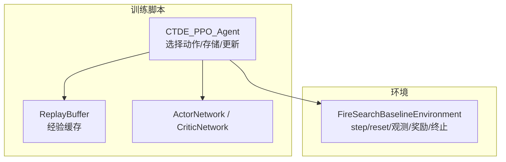
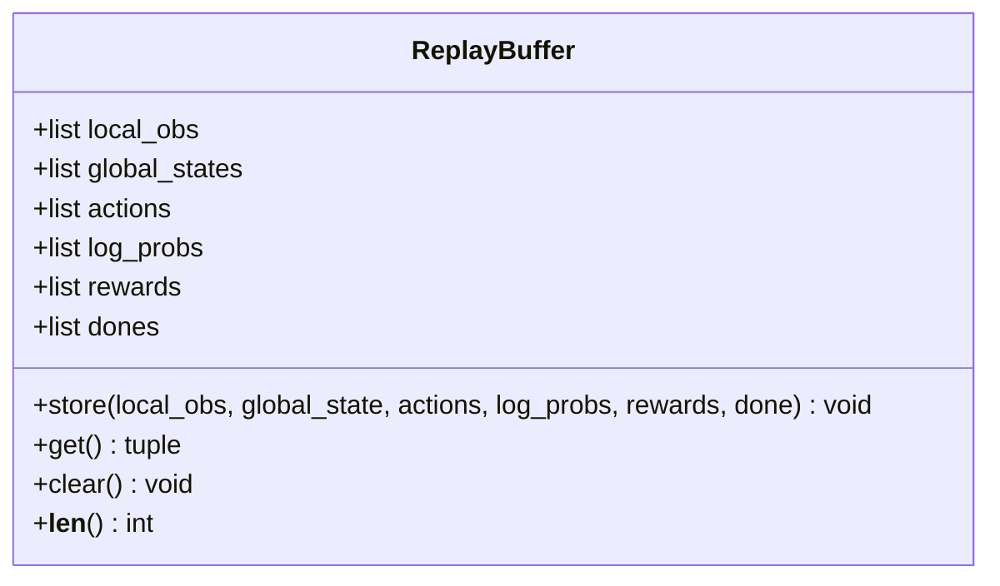
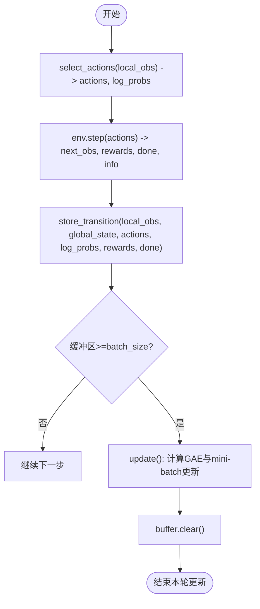
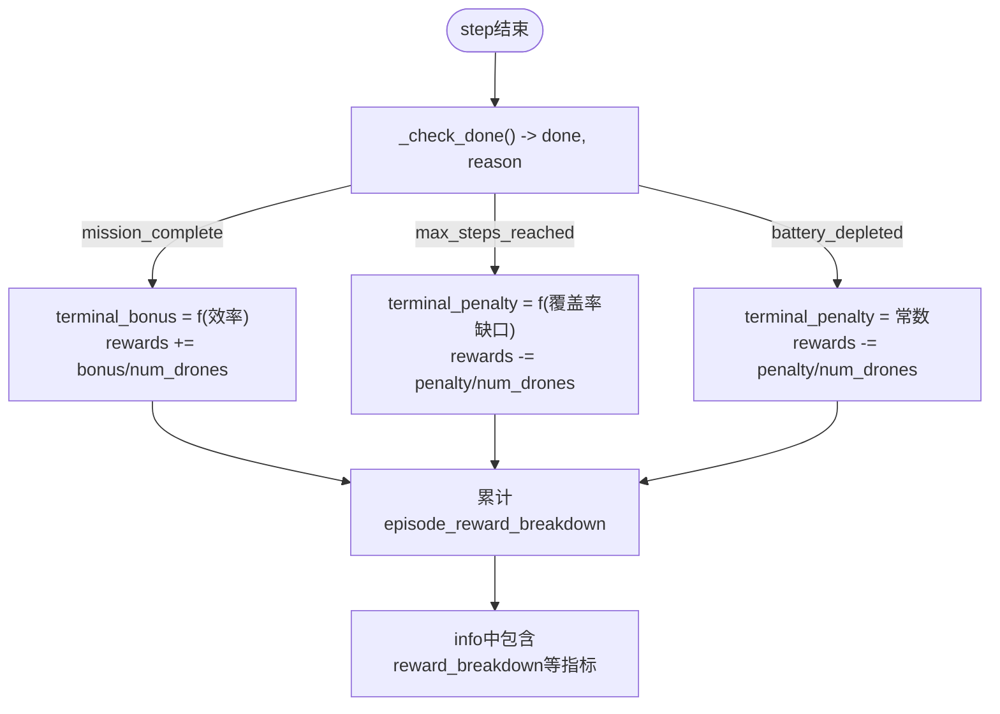
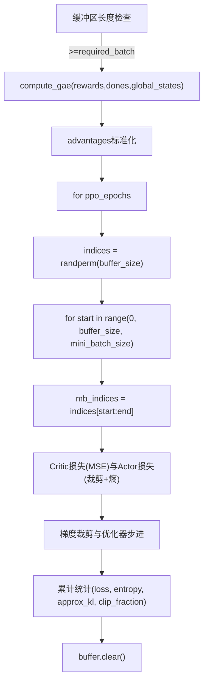
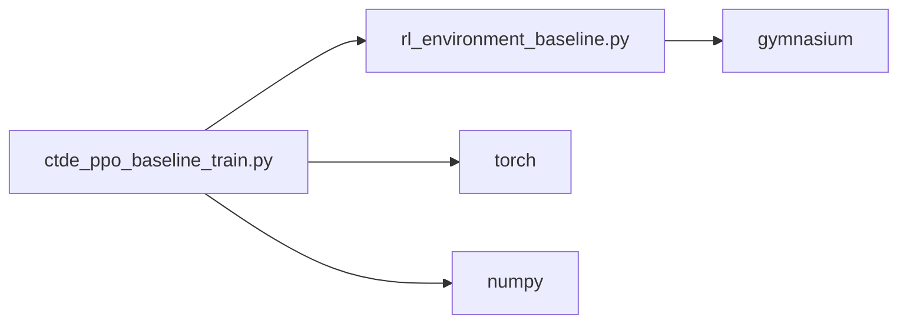

# 数据收集管理

<cite>
**本文引用的文件**   
- [ctde_ppo_baseline_train.py](file://environment_variables/environment_variables/ctde_ppo_baseline_train.py)
- [rl_environment_baseline.py](file://environment_variables/environment_variables/rl_environment_baseline.py)
</cite>

## 目录
1. [简介](#简介)
2. [项目结构](#项目结构)
3. [核心组件](#核心组件)
4. [架构总览](#架构总览)
5. [详细组件分析](#详细组件分析)
6. [依赖关系分析](#依赖关系分析)
7. [性能与内存优化](#性能与内存优化)
8. [故障排查指南](#故障排查指南)
9. [结论](#结论)

## 简介
本技术文档聚焦于多智能体并行训练中的数据收集与管理，围绕 ReplayBuffer 类的实现、经验数据的存储结构与内存管理机制展开。同时深入解析本地观测 local_obs、全局状态 global_states、动作 actions 和对数概率 log_probs 的同步收集流程；说明奖励 rewards 和终止信号 dones 的处理逻辑，包括多无人机协同任务的奖励分解；解释 batch_size 与 mini_batch_size 的设置与划分策略；并提供数据收集的优化技巧与内存管理最佳实践，涵盖数据清理与格式转换的实现细节。

## 项目结构
本项目采用“环境 + 算法”的双模块组织方式：
- 环境模块（rl_environment_baseline.py）：提供多无人机火灾边界搜索任务，输出结构化观测、全局状态、奖励与终止信息。
- 训练模块（ctde_ppo_baseline_train.py）：实现 CTDE-PPO 算法，包含 Actor/Critic 网络、ReplayBuffer、GAE 计算、PPO 更新循环与批处理策略。



图表来源
- [ctde_ppo_baseline_train.py:537-566](file://environment_variables/environment_variables/ctde_ppo_baseline_train.py#L537-L566)
- [ctde_ppo_baseline_train.py:849-991](file://environment_variables/environment_variables/ctde_ppo_baseline_train.py#L849-L991)
- [rl_environment_baseline.py:842-992](file://environment_variables/environment_variables/rl_environment_baseline.py#L842-L992)

章节来源
- [ctde_ppo_baseline_train.py:537-566](file://environment_variables/environment_variables/ctde_ppo_baseline_train.py#L537-L566)
- [ctde_ppo_baseline_train.py:849-991](file://environment_variables/environment_variables/ctde_ppo_baseline_train.py#L849-L991)
- [rl_environment_baseline.py:842-992](file://environment_variables/environment_variables/rl_environment_baseline.py#L842-L992)

## 核心组件
- ReplayBuffer：以列表形式按时间步累积经验元组（local_obs, global_state, actions, log_probs, rewards, done），提供 store/get/clear/len 接口。
- CTDE_PPO_Agent：封装 Actor/Critic 网络与 PPO 更新流程，负责从环境中采样、将经验存入缓冲区、计算 GAE 并执行 mini-batch 更新。
- FireSearchBaselineEnvironment：提供 step/reset 接口，返回结构化观测（local_obs 为每架无人机的向量，global_state 为团队级向量）、每智能体的 rewards 以及 done 标志与 info。

章节来源
- [ctde_ppo_baseline_train.py:537-566](file://environment_variables/environment_variables/ctde_ppo_baseline_train.py#L537-L566)
- [ctde_ppo_baseline_train.py:849-991](file://environment_variables/environment_variables/ctde_ppo_baseline_train.py#L849-L991)
- [rl_environment_baseline.py:842-992](file://environment_variables/environment_variables/rl_environment_baseline.py#L842-L992)

## 架构总览
下图展示了数据收集与训练更新的端到端时序：Agent 在环境中交互，收集经验到 ReplayBuffer，达到批次阈值后触发 PPO 更新，使用 mini-batch 进行多轮迭代。

```mermaid
sequenceDiagram
participant Agent as "CTDE_PPO_Agent"
participant Env as "FireSearchBaselineEnvironment"
participant Buffer as "ReplayBuffer"
participant Actor as "ActorNetwork"
participant Critic as "CriticNetwork"
Agent->>Env : reset()
loop 每个时间步
Agent->>Actor : select_actions(local_obs)
Agent-->>Agent : 得到 actions, log_probs
Agent->>Env : step(actions)
Env-->>Agent : next_obs, rewards, done, info
Agent->>Buffer : store_transition(local_obs, global_state, actions, log_probs, rewards, done)
end
alt 缓冲区满足批次大小
Agent->>Buffer : get()
Agent->>Critic : compute_gae(rewards_list, dones, global_states)
Agent->>Actor : 多轮 mini-batch 更新
Agent->>Buffer : clear()
end
```

图表来源
- [ctde_ppo_baseline_train.py:849-991](file://environment_variables/environment_variables/ctde_ppo_baseline_train.py#L849-L991)
- [ctde_ppo_baseline_train.py:537-566](file://environment_variables/environment_variables/ctde_ppo_baseline_train.py#L537-L566)
- [rl_environment_baseline.py:842-992](file://environment_variables/environment_variables/rl_environment_baseline.py#L842-L992)

## 详细组件分析

### ReplayBuffer 类：经验数据存储与内存管理
- 数据结构
  - 使用六个同长列表分别保存 local_obs、global_states、actions、log_probs、rewards、dones。
  - 列表追加操作 O(1)，整体空间复杂度 O(T×N)，其中 T 为时间步数，N 为智能体数量。
- 关键方法
  - store：将单步经验追加到对应列表。
  - get：一次性返回所有列表，供后续批量处理。
  - clear：清空所有列表，释放内存引用。
  - __len__：基于 rewards 长度统计当前缓冲大小。
- 内存管理要点
  - 列表动态扩容可能带来额外内存占用；建议在 update 完成后调用 clear 及时释放。
  - 若 local_obs/global_states 为 numpy 数组或张量，建议统一转换为连续内存布局以减少拷贝开销。



图表来源
- [ctde_ppo_baseline_train.py:537-566](file://environment_variables/environment_variables/ctde_ppo_baseline_train.py#L537-L566)

章节来源
- [ctde_ppo_baseline_train.py:537-566](file://environment_variables/environment_variables/ctde_ppo_baseline_train.py#L537-L566)

### 多智能体并行训练的数据收集策略
- 同步收集字段
  - local_obs：每架无人机的局部观测向量，维度由环境配置决定。
  - global_states：团队级全局状态向量，用于 Critic 评估。
  - actions：离散动作索引列表，长度为智能体数量。
  - log_probs：对应动作的对数概率，用于 PPO 比率裁剪。
  - rewards：每智能体的即时奖励列表。
  - dones：当前步是否终止的标志。
- 收集流程
  - Agent.select_actions 对 local_obs 推理得到 actions 与 log_probs。
  - env.step 返回 next_obs、rewards、done、info。
  - Agent.store_transition 将上述六项写入 ReplayBuffer。
- 并行性说明
  - 当前实现中，Agent 在同一时间步内对多个智能体并行选择动作，但与环境交互仍为单进程顺序 step；真正的多进程并行需扩展为多环境实例并在主进程聚合经验。



图表来源
- [ctde_ppo_baseline_train.py:849-991](file://environment_variables/environment_variables/ctde_ppo_baseline_train.py#L849-L991)
- [ctde_ppo_baseline_train.py:537-566](file://environment_variables/environment_variables/ctde_ppo_baseline_train.py#L537-L566)
- [rl_environment_baseline.py:842-992](file://environment_variables/environment_variables/rl_environment_baseline.py#L842-L992)

章节来源
- [ctde_ppo_baseline_train.py:849-991](file://environment_variables/environment_variables/ctde_ppo_baseline_train.py#L849-L991)
- [rl_environment_baseline.py:842-992](file://environment_variables/environment_variables/rl_environment_baseline.py#L842-L992)

### 奖励与终止信号处理及奖励分解
- 终止条件
  - mission_complete：根据课程阶段目标覆盖率提前结束。
  - max_steps_reached：超过最大步数。
  - battery_depleted：任一无人机电池耗尽。
- 终端奖励调整
  - mission_complete：根据效率（完成步数占比）给予正奖励，并按智能体数量均分。
  - max_steps_reached：根据覆盖率缺口施加惩罚，零覆盖时额外惩罚。
  - battery_depleted：固定惩罚，按智能体数量均分。
- 奖励分解键
  - r_discover、r_coverage_gain、r_area_gain、r_boundary、r_front、r_severity、r_explore、r_search、r_penalty、r_terminal。
- 多无人机协同
  - 终端奖励按 num_drones 均分，体现团队协作收益/惩罚的公平分配。



图表来源
- [rl_environment_baseline.py:948-964](file://environment_variables/environment_variables/rl_environment_baseline.py#L948-L964)
- [rl_environment_baseline.py:824-840](file://environment_variables/environment_variables/rl_environment_baseline.py#L824-L840)

章节来源
- [rl_environment_baseline.py:948-964](file://environment_variables/environment_variables/rl_environment_baseline.py#L948-L964)
- [rl_environment_baseline.py:824-840](file://environment_variables/environment_variables/rl_environment_baseline.py#L824-L840)

### 批处理设置与 mini-batch 划分策略
- 参数定义
  - batch_size：触发一次 PPO 更新所需的最小经验步数。
  - mini_batch_size：默认取 batch_size // 8，且不低于 512。
  - min_update_batch_size：强制更新时的最小阈值，默认取 batch_size // 4，且不低于 512。
- 更新流程
  - 当缓冲区长度 >= required_batch（force=False 时为 batch_size；force=True 时为 min_update_batch_size）时进入 update。
  - 计算 advantages 与 returns（GAE），并对 advantages 做标准化。
  - 在每个 ppo_epochs 轮次内，随机打乱样本索引，按 mini_batch_size 滑动窗口切分，逐批更新 Critic 与 Actor。
- 数值稳定性
  - advantages 标准化使用均值与标准差，避免梯度爆炸。
  - 梯度裁剪通过 clip_grad_norm_ 控制。



图表来源
- [ctde_ppo_baseline_train.py:889-991](file://environment_variables/environment_variables/ctde_ppo_baseline_train.py#L889-L991)

章节来源
- [ctde_ppo_baseline_train.py:889-991](file://environment_variables/environment_variables/ctde_ppo_baseline_train.py#L889-L991)

## 依赖关系分析
- 模块耦合
  - ctde_ppo_baseline_train.py 导入 rl_environment_baseline.py 的环境类，形成“训练脚本依赖环境”的单向依赖。
  - Agent 内部依赖 Actor/Critic 网络与 ReplayBuffer，三者解耦清晰。
- 外部依赖
  - torch、numpy、gymnasium 等库用于张量运算、数值计算与环境接口。
- 潜在循环依赖
  - 当前未见循环导入；训练脚本与环境脚本相互独立，便于测试与替换。



图表来源
- [ctde_ppo_baseline_train.py:1-30](file://environment_variables/environment_variables/ctde_ppo_baseline_train.py#L1-L30)
- [rl_environment_baseline.py:1-20](file://environment_variables/environment_variables/rl_environment_baseline.py#L1-L20)

章节来源
- [ctde_ppo_baseline_train.py:1-30](file://environment_variables/environment_variables/ctde_ppo_baseline_train.py#L1-L30)
- [rl_environment_variables/rl_environment_baseline.py:1-20](file://environment_variables/environment_variables/rl_environment_baseline.py#L1-L20)

## 性能与内存优化
- 数据收集优化
  - 减少 Python 对象创建：尽量将 local_obs/global_states 保持为 numpy 数组，避免频繁类型转换。
  - 预分配与复用：在可能的情况下，使用固定大小的数组或 deque 替代 list.append，降低扩容开销。
  - 异步收集：在多进程或多线程环境下，将环境交互与模型推理分离，提高吞吐。
- 内存管理最佳实践
  - 及时清理：每次 update 后调用 buffer.clear()，确保不再引用的列表被垃圾回收。
  - 设备迁移：将数据移动到 GPU 前进行必要的视图与 reshape，避免多次拷贝。
  - 数据类型：统一使用 float32/int32，减少内存占用与精度损失风险。
- 批处理优化
  - mini_batch_size 不宜过小，否则增加优化器步进次数；也不宜过大，以免超出显存。
  - 对 advantages 标准化有助于稳定训练，但需注意除零保护（已实现）。
- 数据格式转换
  - 在 update 中将列表转为 numpy 数组再转 Tensor，注意 view(-1, obs_dim) 展平多智能体维度的正确性。

[本节为通用指导，不直接分析具体文件]

## 故障排查指南
- 常见问题
  - 缓冲区未清空导致内存泄漏：确认 update 末尾是否调用 buffer.clear()。
  - 形状不匹配错误：检查 local_obs 展平后的维度与 Actor 输入一致；actions/log_probs 展平后与 adv 对齐。
  - 奖励异常：核查 terminal 奖励是否按 num_drones 均分；检查覆盖率与超时惩罚的计算。
- 定位方法
  - 打印 buffer.__len__ 与 required_batch 比较，确认触发更新的时机。
  - 记录 episode_reward_breakdown 中的各分项，定位奖励来源。
  - 监控 KL 与 clip_fraction，判断策略更新是否过于激进。

章节来源
- [ctde_ppo_baseline_train.py:889-991](file://environment_variables/environment_variables/ctde_ppo_baseline_train.py#L889-L991)
- [rl_environment_baseline.py:948-964](file://environment_variables/environment_variables/rl_environment_baseline.py#L948-L964)

## 结论
本仓库实现了面向多无人机协同任务的 CTDE-PPO 基线，数据收集与管理围绕 ReplayBuffer 展开，具备清晰的存储结构与更新流程。通过合理的 batch_size 与 mini_batch_size 划分、GAE 优势估计与标准化、以及终端奖励的协作式分配，系统在稳定性与可扩展性方面表现良好。进一步优化方向包括异步并行收集、更高效的内存管理与更细粒度的批处理调度。