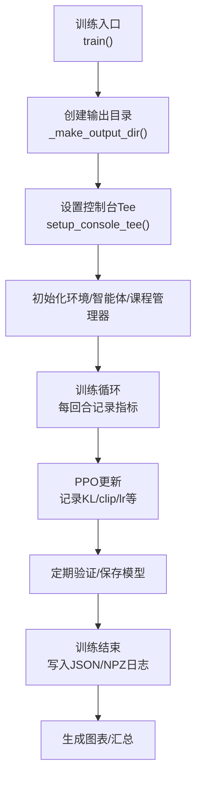
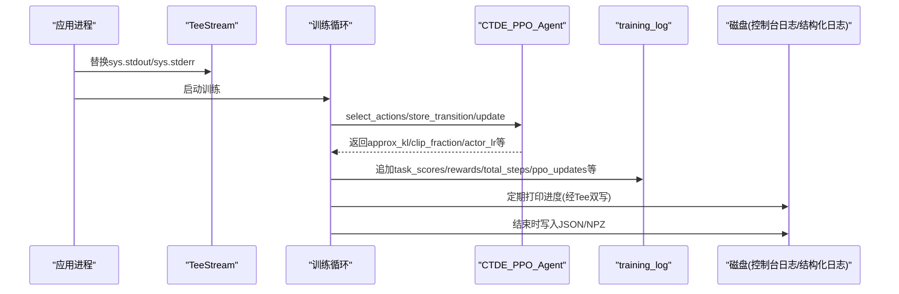
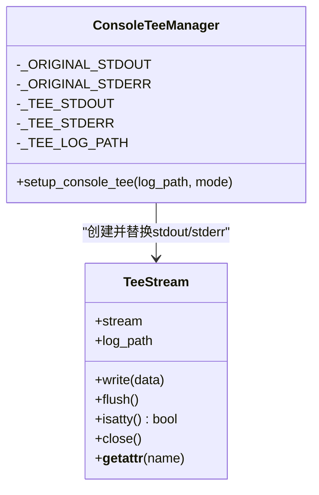
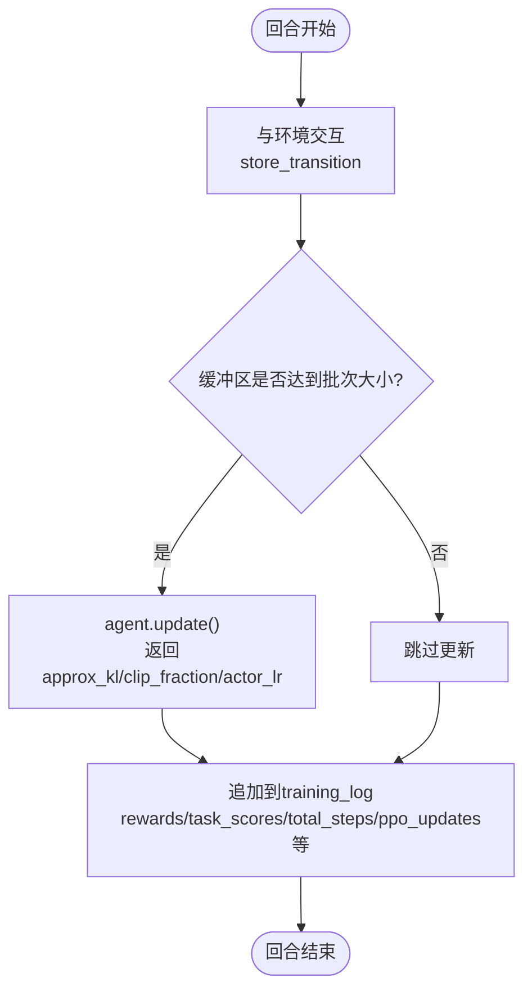
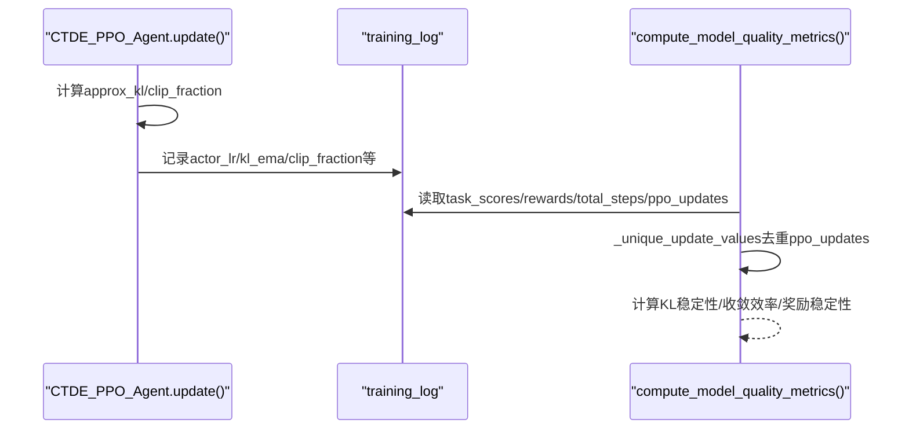
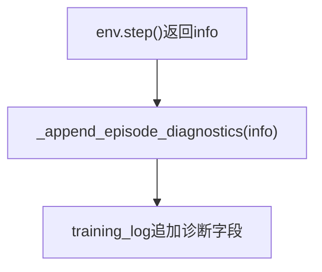
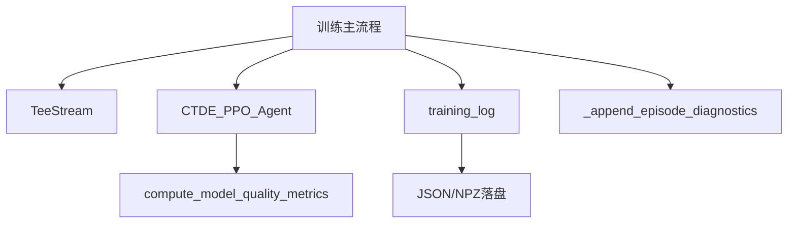

# 日志监控系统

<cite>
**本文引用的文件**
- [ctde_ppo_baseline_train.py](file://environment_variables/environment_variables/ctde_ppo_baseline_train.py)
- [test_console_log_text.py](file://environment_variables/environment_variables/test_console_log_text.py)
- [test_training_diagnostics_log.py](file://environment_variables/environment_variables/test_training_diagnostics_log.py)
- [train_console_log.txt](file://environment_variables/environment_variables/outputs/lr_comparison_20260611_093948/训练结果/Fixed_LR_CTDE_PPO_seed42/train_console_log.txt)
</cite>

## 目录
1. [简介](#简介)
2. [项目结构](#项目结构)
3. [核心组件](#核心组件)
4. [架构总览](#架构总览)
5. [详细组件分析](#详细组件分析)
6. [依赖关系分析](#依赖关系分析)
7. [性能考量](#性能考量)
8. [故障排查指南](#故障排查指南)
9. [结论](#结论)
10. [附录](#附录)

## 简介
本技术文档聚焦于日志监控子系统，围绕以下目标展开：
- 深入解释 TeeStream 类的实现与标准输出重定向、文件同步写入机制。
- 详细说明训练指标收集系统，包括任务分数 task_scores、累积奖励 rewards、总步数 total_steps 和 PPO 更新次数 ppo_updates 的记录方式。
- 分析性能监控功能，包括 KL 散度 approx_kl、裁剪比例 clip_fraction 和学习率 actor_lr 的跟踪与质量评估。
- 解释诊断信息的记录，包括平均距离到火场 avg_distance_to_fire、首次热区检测 first_heat_step 和首次边界检测 first_boundary_step。
- 说明日志文件的组织结构与管理策略，特别是控制台日志 train_console_log.txt 的输出格式和内容规范。

## 项目结构
该日志监控能力集中在训练脚本中，通过统一的输出目录组织各类日志与模型产物，关键路径如下：
- 输出根目录：由配置决定（默认 ./outputs），每次运行生成时间戳子目录。
- 结果目录：包含“训练结果”、“源码快照”等子目录。
- 控制台日志：位于“训练结果”目录下，文件名为 train_console_log.txt。
- 结构化日志：位于“训练结果/logs”下，包含 training_log.json、validation_log.json、model_quality_metrics.json 等。
- 模型权重：位于“训练结果/models”下，保存各阶段与最佳模型。

图示来源
- [ctde_ppo_baseline_train.py:1278-1315](file://environment_variables/environment_variables/ctde_ppo_baseline_train.py#L1278-L1315)
- [ctde_ppo_baseline_train.py:1685-1700](file://environment_variables/environment_variables/ctde_ppo_baseline_train.py#L1685-L1700)

章节来源
- [ctde_ppo_baseline_train.py:1278-1315](file://environment_variables/environment_variables/ctde_ppo_baseline_train.py#L1278-L1315)
- [ctde_ppo_baseline_train.py:1685-1700](file://environment_variables/environment_variables/ctde_ppo_baseline_train.py#L1685-L1700)

## 核心组件
- TeeStream 与 setup_console_tee：实现标准输出与错误输出的双写（控制台+文件），确保训练过程可回放。
- 训练日志字典 training_log：集中记录每回合指标、诊断信息、学习率与KL相关统计等。
- 质量指标计算 compute_model_quality_metrics：基于 training_log 聚合收敛效率、奖励稳定性与KL稳定性等。
- 诊断信息追加 _append_episode_diagnostics：将每回合的环境 info 中的诊断字段持久化。

章节来源
- [ctde_ppo_baseline_train.py:47-96](file://environment_variables/environment_variables/ctde_ppo_baseline_train.py#L47-L96)
- [ctde_ppo_baseline_train.py:358-433](file://environment_variables/environment_variables/ctde_ppo_baseline_train.py#L358-L433)
- [ctde_ppo_baseline_train.py:452-458](file://environment_variables/environment_variables/ctde_ppo_baseline_train.py#L452-L458)
- [ctde_ppo_baseline_train.py:1393-1436](file://environment_variables/environment_variables/ctde_ppo_baseline_train.py#L1393-L1436)

## 架构总览
下图展示了从标准输出重定向到训练指标收集、再到质量评估与文件落盘的完整流程。

图示来源
- [ctde_ppo_baseline_train.py:78-96](file://environment_variables/environment_variables/ctde_ppo_baseline_train.py#L78-L96)
- [ctde_ppo_baseline_train.py:889-991](file://environment_variables/environment_variables/ctde_ppo_baseline_train.py#L889-L991)
- [ctde_ppo_baseline_train.py:1520-1552](file://environment_variables/environment_variables/ctde_ppo_baseline_train.py#L1520-L1552)
- [ctde_ppo_baseline_train.py:1685-1700](file://environment_variables/environment_variables/ctde_ppo_baseline_train.py#L1685-L1700)

## 详细组件分析

### TeeStream 与标准输出重定向
- 设计要点
  - 包装原始 stdout/stderr，在 write/flush/close 时同时写入文件与原始流。
  - 使用 isatty 透传，保持终端交互行为一致。
  - setup_console_tee 负责创建日志目录、切换全局流并避免重复绑定同一文件。
- 关键行为
  - 所有 print/日志均被双写到控制台与文件，便于离线复盘。
  - 支持以追加或覆盖模式打开日志文件。

图示来源
- [ctde_ppo_baseline_train.py:47-96](file://environment_variables/environment_variables/ctde_ppo_baseline_train.py#L47-L96)

章节来源
- [ctde_ppo_baseline_train.py:47-96](file://environment_variables/environment_variables/ctde_ppo_baseline_train.py#L47-L96)

### 训练指标收集系统
- 记录位置
  - training_log 字典维护多列数组，按回合顺序追加。
- 关键字段
  - task_scores：每回合任务得分序列。
  - rewards：每回合累计奖励序列。
  - total_steps：累计步数序列（单调递增）。
  - ppo_updates：PPO 更新次数序列（与 agent.training_step 对齐）。
- 记录时机
  - 每回合结束后统一追加；PPO 更新后记录 KL、clip_fraction、actor_lr 等。

图示来源
- [ctde_ppo_baseline_train.py:1504-1552](file://environment_variables/environment_variables/ctde_ppo_baseline_train.py#L1504-L1552)
- [ctde_ppo_baseline_train.py:889-991](file://environment_variables/environment_variables/ctde_ppo_baseline_train.py#L889-L991)

章节来源
- [ctde_ppo_baseline_train.py:1393-1436](file://environment_variables/environment_variables/ctde_ppo_baseline_train.py#L1393-L1436)
- [ctde_ppo_baseline_train.py:1520-1552](file://environment_variables/environment_variables/ctde_ppo_baseline_train.py#L1520-L1552)
- [ctde_ppo_baseline_train.py:889-991](file://environment_variables/environment_variables/ctde_ppo_baseline_train.py#L889-L991)

### 性能监控功能（KL、裁剪比例、学习率）
- 采集点
  - PPO 更新过程中计算近似 KL（approx_kl）、裁剪比例（clip_fraction）以及当前 actor 学习率（actor_lr）。
- 存储与去重
  - 训练日志按回合记录上述指标；质量评估函数对 ppo_updates 进行去重，仅保留唯一更新序号对应的值，用于稳定统计。
- 质量指标
  - KL 稳定性：均值、方差、绝对误差、超限率、clip_fraction 与 actor_lr 的统计量。
  - 收敛效率：AUC（按 total_steps 积分）、到达阈值所需步骤/更新次数。
  - 奖励稳定性：尾部窗口标准差、滚动均值下降幅度等。

图示来源
- [ctde_ppo_baseline_train.py:889-991](file://environment_variables/environment_variables/ctde_ppo_baseline_train.py#L889-L991)
- [ctde_ppo_baseline_train.py:342-356](file://environment_variables/environment_variables/ctde_ppo_baseline_train.py#L342-L356)
- [ctde_ppo_baseline_train.py:358-433](file://environment_variables/environment_variables/ctde_ppo_baseline_train.py#L358-L433)
- [ctde_ppo_baseline_train.py:1540-1546](file://environment_variables/environment_variables/ctde_ppo_baseline_train.py#L1540-L1546)

章节来源
- [ctde_ppo_baseline_train.py:342-356](file://environment_variables/environment_variables/ctde_ppo_baseline_train.py#L342-L356)
- [ctde_ppo_baseline_train.py:358-433](file://environment_variables/environment_variables/ctde_ppo_baseline_train.py#L358-L433)
- [ctde_ppo_baseline_train.py:889-991](file://environment_variables/environment_variables/ctde_ppo_baseline_train.py#L889-L991)
- [ctde_ppo_baseline_train.py:1540-1546](file://environment_variables/environment_variables/ctde_ppo_baseline_train.py#L1540-L1546)

### 诊断信息记录
- 记录字段
  - avg_distance_to_fire：每回合平均距离到火场的度量。
  - first_heat_step：首次检测到热区的步数。
  - first_boundary_step：首次检测到边界的步数。
  - spawn_modes、reward_breakdown：辅助诊断信息。
- 记录方式
  - 每回合通过 _append_episode_diagnostics 将 info 中的诊断字段追加至 training_log 对应列表。

图示来源
- [ctde_ppo_baseline_train.py:452-458](file://environment_variables/environment_variables/ctde_ppo_baseline_train.py#L452-L458)
- [ctde_ppo_baseline_train.py:1529](file://environment_variables/environment_variables/ctde_ppo_baseline_train.py#L1529)

章节来源
- [ctde_ppo_baseline_train.py:452-458](file://environment_variables/environment_variables/ctde_ppo_baseline_train.py#L452-L458)
- [ctde_ppo_baseline_train.py:1529](file://environment_variables/environment_variables/ctde_ppo_baseline_train.py#L1529)

### 控制台日志 train_console_log.txt 的组织与规范
- 输出位置
  - 位于“训练结果”目录下，文件名固定为 train_console_log.txt。
- 内容范围
  - 数据集预检查（场景加载、边界点数、实际面积百分比等）。
  - 训练启动信息与参数摘要。
  - 训练过程中的阶段性打印（回合、阶段、奖励、覆盖率、成功率、任务得分、超时率、KL、clip_fraction、学习率等）。
  - 训练完成后的总结（总步数、PPO 更新次数、用时、最终阶段、各文件路径、质量摘要等）。
- 格式特征
  - 中文标签为主，便于阅读与检索。
  - 行内键值对以空格分隔，适合文本解析。
  - 重要节点以分隔线突出显示。

章节来源
- [ctde_ppo_baseline_train.py:1286-1287](file://environment_variables/environment_variables/ctde_ppo_baseline_train.py#L1286-L1287)
- [ctde_ppo_baseline_train.py:1589-1605](file://environment_variables/environment_variables/ctde_ppo_baseline_train.py#L1589-L1605)
- [ctde_ppo_baseline_train.py:1787-1812](file://environment_variables/environment_variables/ctde_ppo_baseline_train.py#L1787-L1812)
- [train_console_log.txt:1-200](file://environment_variables/environment_variables/outputs/lr_comparison_20260611_093948/训练结果/Fixed_LR_CTDE_PPO_seed42/train_console_log.txt#L1-L200)

## 依赖关系分析
- 模块耦合
  - 训练主流程依赖 TeeStream 进行输出重定向。
  - CTDE_PPO_Agent.update 提供 KL、clip_fraction、actor_lr 等关键监控信号。
  - compute_model_quality_metrics 依赖 training_log 的多个字段进行质量评估。
  - _append_episode_diagnostics 依赖环境返回的 info 诊断字段。
- 外部依赖
  - JSON/NPZ 序列化用于持久化日志。
  - 文件系统操作用于创建目录与写入文件。

图示来源
- [ctde_ppo_baseline_train.py:47-96](file://environment_variables/environment_variables/ctde_ppo_baseline_train.py#L47-L96)
- [ctde_ppo_baseline_train.py:358-433](file://environment_variables/environment_variables/ctde_ppo_baseline_train.py#L358-L433)
- [ctde_ppo_baseline_train.py:452-458](file://environment_variables/environment_variables/ctde_ppo_baseline_train.py#L452-L458)
- [ctde_ppo_baseline_train.py:1685-1700](file://environment_variables/environment_variables/ctde_ppo_baseline_train.py#L1685-L1700)

章节来源
- [ctde_ppo_baseline_train.py:47-96](file://environment_variables/environment_variables/ctde_ppo_baseline_train.py#L47-L96)
- [ctde_ppo_baseline_train.py:358-433](file://environment_variables/environment_variables/ctde_ppo_baseline_train.py#L358-L433)
- [ctde_ppo_baseline_train.py:452-458](file://environment_variables/environment_variables/ctde_ppo_baseline_train.py#L452-L458)
- [ctde_ppo_baseline_train.py:1685-1700](file://environment_variables/environment_variables/ctde_ppo_baseline_train.py#L1685-L1700)

## 性能考量
- I/O 开销
  - 控制台日志采用单缓冲写入，减少频繁 flush 带来的系统调用开销。
  - 结构化日志仅在训练结束时批量写入，降低训练期 I/O 压力。
- 内存占用
  - training_log 以列表形式累积指标，建议合理控制 total_episodes 与 log_interval，避免过长序列导致内存增长。
- 数值稳定性
  - KL 自适应学习率使用指数衰减因子与上下界裁剪，防止学习率发散。
  - 质量评估中对 ppo_updates 去重，避免重复更新导致的统计偏差。

[本节为通用指导，不直接分析具体文件]

## 故障排查指南
- 控制台日志无输出
  - 确认已调用 setup_console_tee 且输出目录存在。
  - 检查 sys.stdout/sys.stderr 是否被其他库覆盖。
- 指标缺失或不连续
  - 检查 PPO 更新条件是否满足 batch_size，必要时使用 force=True 强制更新。
  - 核对 training_log 字段是否在每回合末尾正确追加。
- KL 异常波动
  - 观察 kl_ema 与 target_kl 的关系，调整 kl_lr_alpha 或 kl_ema_beta。
  - 检查 clip_epsilon 是否过小导致裁剪比例过高。
- 诊断字段为空
  - 确认环境 step 返回的 info 中包含 avg_distance_to_fire、first_heat_step、first_boundary_step 等键。

章节来源
- [ctde_ppo_baseline_train.py:78-96](file://environment_variables/environment_variables/ctde_ppo_baseline_train.py#L78-L96)
- [ctde_ppo_baseline_train.py:1504-1552](file://environment_variables/environment_variables/ctde_ppo_baseline_train.py#L1504-L1552)
- [ctde_ppo_baseline_train.py:889-991](file://environment_variables/environment_variables/ctde_ppo_baseline_train.py#L889-L991)
- [ctde_ppo_baseline_train.py:452-458](file://environment_variables/environment_variables/ctde_ppo_baseline_train.py#L452-L458)

## 结论
本日志监控系统通过 TeeStream 实现了可靠的控制台与文件双写，结合训练循环中的指标收集与质量评估，形成了完整的观测闭环。KL 散度、裁剪比例与学习率的跟踪有助于理解优化动态，而诊断信息则为环境与策略行为提供了细粒度洞察。合理的日志组织与批量化落盘策略在保证可观测性的同时兼顾了性能。

[本节为总结性内容，不直接分析具体文件]

## 附录
- 单元测试参考
  - 控制台日志中文标签校验：验证课程阶段切换时的中文输出。
  - 诊断字段追加测试：验证 avg_distance_to_fire、first_heat_step、first_boundary_step 等字段的写入。

章节来源
- [test_console_log_text.py:1-28](file://environment_variables/environment_variables/test_console_log_text.py#L1-L28)
- [test_training_diagnostics_log.py:1-74](file://environment_variables/environment_variables/test_training_diagnostics_log.py#L1-L74)