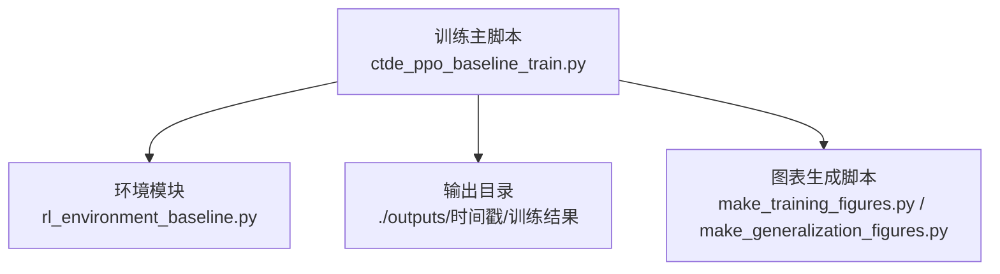
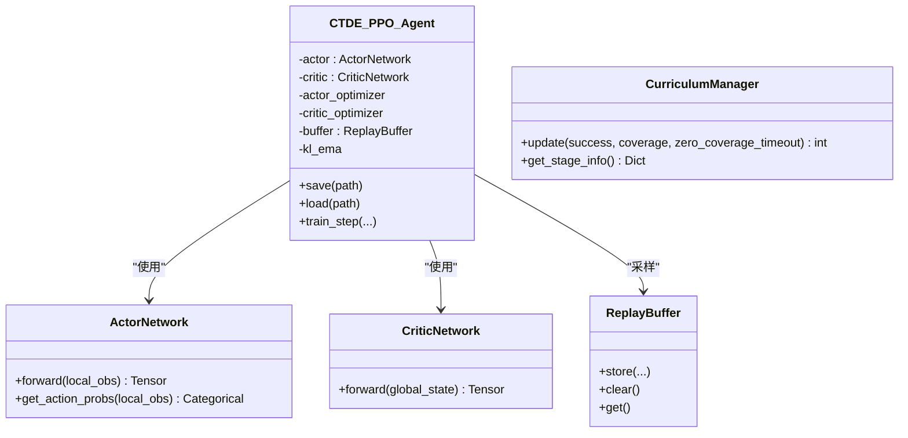
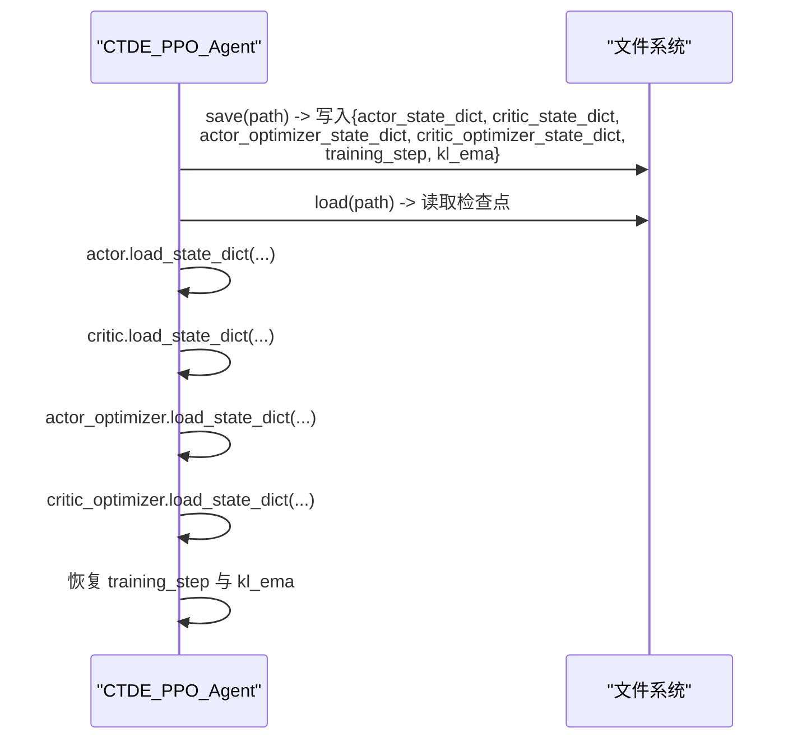
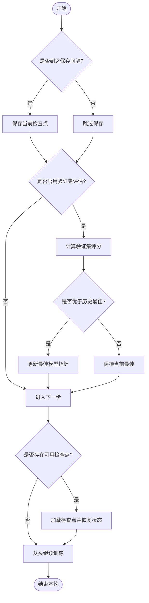
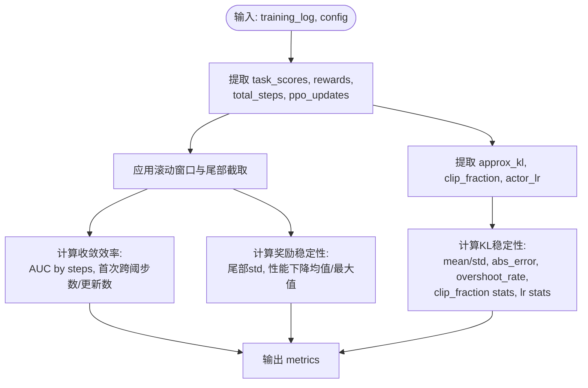
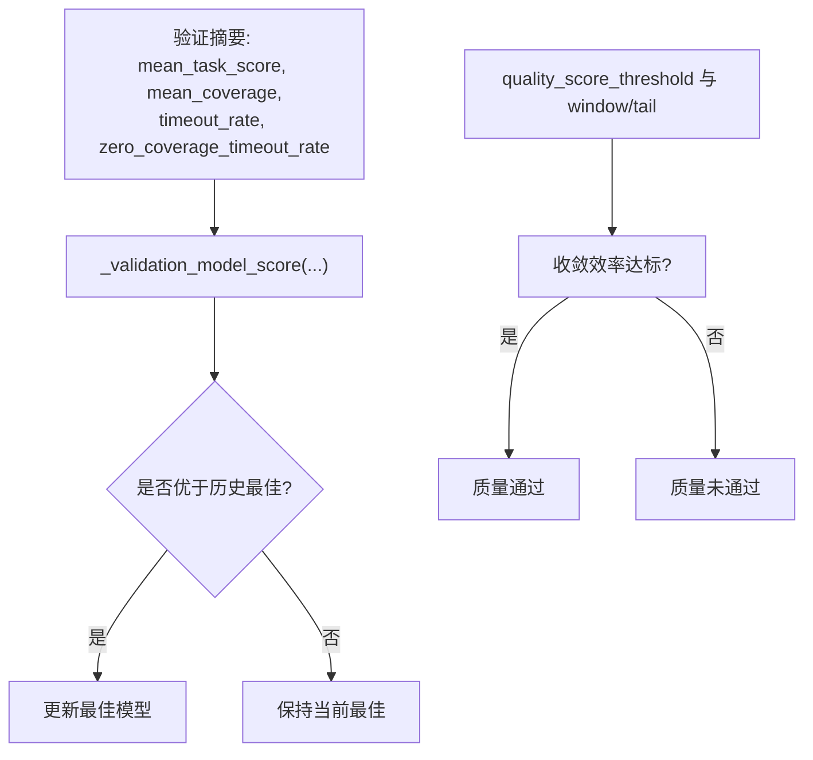
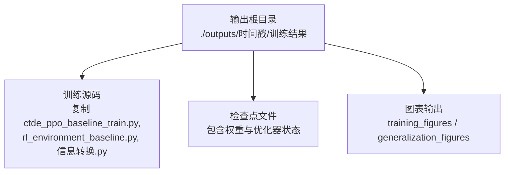
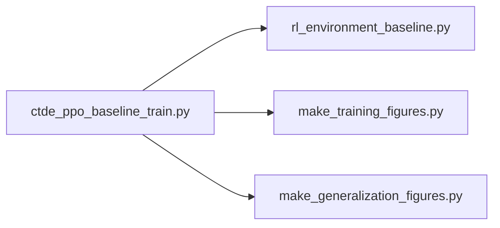

# 模型快照管理

<cite>
**本文引用的文件**   
- [ctde_ppo_baseline_train.py](file://environment_variables/environment_variables/ctde_ppo_baseline_train.py)
- [rl_environment_baseline.py](file://environment_variables/environment_variables/rl_environment_baseline.py)
</cite>

## 目录
1. [简介](#简介)
2. [项目结构](#项目结构)
3. [核心组件](#核心组件)
4. [架构总览](#架构总览)
5. [详细组件分析](#详细组件分析)
6. [依赖关系分析](#依赖关系分析)
7. [性能与稳定性考量](#性能与稳定性考量)
8. [故障排查指南](#故障排查指南)
9. [结论](#结论)
10. [附录](#附录)

## 简介
本技术文档围绕“模型快照管理”展开，聚焦于 ActorNetwork 与 CriticNetwork 的状态序列化、检查点策略（间隔保存、最佳模型选择、自动恢复）、模型质量评估指标（收敛效率、奖励稳定性、KL 稳定性）的计算方法、模型选择标准（验证集表现与质量阈值），以及模型文件的组织结构与最佳实践。内容基于仓库中的训练脚本与环境模块实现进行系统化梳理，旨在为模型版本控制、迁移学习与部署优化提供可操作的指导。

## 项目结构
本项目采用“训练主脚本 + 环境定义”的清晰分层：
- 训练主脚本负责：配置归一化、训练循环、指标计算、检查点保存与加载、结果输出与可视化调用。
- 环境模块提供任务交互接口与观测/奖励配置，供训练脚本使用。

图示来源
- [ctde_ppo_baseline_train.py:1016-1045](file://environment_variables/environment_variables/ctde_ppo_baseline_train.py#L1016-L1045)
- [ctde_ppo_baseline_train.py:1048-1100](file://environment_variables/environment_variables/ctde_ppo_baseline_train.py#L1048-L1100)

章节来源
- [ctde_ppo_baseline_train.py:1016-1045](file://environment_variables/environment_variables/ctde_ppo_baseline_train.py#L1016-L1045)
- [ctde_ppo_baseline_train.py:1048-1100](file://environment_variables/environment_variables/ctde_ppo_baseline_train.py#L1048-L1100)

## 核心组件
- ActorNetwork：策略网络，输出离散动作的对数几率，内部包含多层全连接与残差连接、层归一化。
- CriticNetwork：价值网络，估计全局状态的价值，同样采用多层全连接与层归一化。
- CTDE_PPO_Agent：封装 Actor/Critic、优化器、PPO 更新流程、学习率自适应（固定或 KL 驱动）、KL 指数移动平均等。
- CurriculumManager：课程学习管理器，动态调整初始面积百分位、阶段目标与近端概率等训练难度参数。
- ReplayBuffer：轨迹缓冲区，存储局部观测、全局状态、动作、对数概率、奖励与终止信号。

章节来源
- [ctde_ppo_baseline_train.py:460-535](file://environment_variables/environment_variables/ctde_ppo_baseline_train.py#L460-L535)
- [ctde_ppo_baseline_train.py:537-567](file://environment_variables/environment_variables/ctde_ppo_baseline_train.py#L537-L567)
- [ctde_ppo_baseline_train.py:569-758](file://environment_variables/environment_variables/ctde_ppo_baseline_train.py#L569-L758)
- [ctde_ppo_baseline_train.py:759-800](file://environment_variables/environment_variables/ctde_ppo_baseline_train.py#L759-L800)

## 架构总览
下图展示训练主流程中关键对象与数据流的关系，包括模型保存/加载、指标计算与输出目录组织。

图示来源
- [ctde_ppo_baseline_train.py:460-535](file://environment_variables/environment_variables/ctde_ppo_baseline_train.py#L460-L535)
- [ctde_ppo_baseline_train.py:537-567](file://environment_variables/environment_variables/ctde_ppo_baseline_train.py#L537-L567)
- [ctde_ppo_baseline_train.py:759-800](file://environment_variables/environment_variables/ctde_ppo_baseline_train.py#L759-L800)

## 详细组件分析

### 模型保存与加载机制（ActorNetwork 与 CriticNetwork 状态序列化）
- 保存：将 Actor 与 Critic 的网络权重、优化器状态、训练步数与 KL EMA 值打包为字典并持久化到磁盘。
- 加载：从指定路径读取检查点，按键名恢复网络权重与优化器状态，同时恢复训练步数与 KL EMA。

图示来源
- [ctde_ppo_baseline_train.py:993-1014](file://environment_variables/environment_variables/ctde_ppo_baseline_train.py#L993-L1014)

章节来源
- [ctde_ppo_baseline_train.py:993-1014](file://environment_variables/environment_variables/ctde_ppo_baseline_train.py#L993-L1014)

### 检查点策略：间隔保存、最佳模型选择与自动恢复
- 间隔保存：通过配置项 save_interval 控制每若干步保存一次检查点。
- 最佳模型选择：支持以验证集表现作为选择依据（save_best_by_validation），在验证周期内比较模型评分并保留最优。
- 自动恢复：训练启动时可尝试加载最近或指定的检查点，恢复训练步数与 KL EMA，确保中断后可继续训练。

图示来源
- [ctde_ppo_baseline_train.py:993-1014](file://environment_variables/environment_variables/ctde_ppo_baseline_train.py#L993-L1014)

章节来源
- [ctde_ppo_baseline_train.py:993-1014](file://environment_variables/environment_variables/ctde_ppo_baseline_train.py#L993-L1014)

### 模型质量评估指标计算方法
- 收敛效率 convergence_efficiency
  - 步骤级任务得分曲线下面积（AUC by steps）。
  - 首次达到质量阈值的步数与 PPO 更新次数（使用滚动均值窗口过滤噪声）。
- 奖励稳定性 reward_stability
  - 尾部奖励与任务得分的标准差（尾部分数由 quality_tail_fraction 决定）。
  - 滚动得分下降的平均与最大幅度，衡量后期波动性。
- KL 稳定性 kl_stability
  - 近似 KL 的均值与标准差。
  - 与目标 KL 的绝对误差均值与超调率（超过两倍目标 KL 的比例）。
  - Clip fraction 的均值与标准差，以及 Actor 学习率的统计信息。

图示来源
- [ctde_ppo_baseline_train.py:358-433](file://environment_variables/environment_variables/ctde_ppo_baseline_train.py#L358-L433)

章节来源
- [ctde_ppo_baseline_train.py:358-433](file://environment_variables/environment_variables/ctde_ppo_baseline_train.py#L358-L433)

### 模型选择标准：验证集表现与质量阈值
- 验证集评分函数综合任务得分、覆盖率、超时率与零覆盖超时率，形成单一指标用于最佳模型判定。
- 质量阈值 quality_score_threshold 用于判断收敛效率是否达标；配合 quality_window 与 quality_tail_fraction 提升鲁棒性。
- 可选质量目标 KL（quality_target_kl）用于 KL 稳定性评估，默认继承 target_kl。

图示来源
- [ctde_ppo_baseline_train.py:300-306](file://environment_variables/environment_variables/ctde_ppo_baseline_train.py#L300-L306)
- [ctde_ppo_baseline_train.py:358-433](file://environment_variables/environment_variables/ctde_ppo_baseline_train.py#L358-L433)

章节来源
- [ctde_ppo_baseline_train.py:300-306](file://environment_variables/environment_variables/ctde_ppo_baseline_train.py#L300-L306)
- [ctde_ppo_baseline_train.py:358-433](file://environment_variables/environment_variables/ctde_ppo_baseline_train.py#L358-L433)

### 模型文件组织结构：权重、配置与元数据
- 输出目录：根据时间戳创建独立运行目录，便于版本化管理与回溯。
- 源码快照：将训练脚本、环境脚本与数据转换脚本复制到“训练源码”子目录，保证复现一致性。
- 图表输出：训练与泛化图表分别生成至 figures/training_figures 与 figures/generalization_figures。
- 检查点文件：保存 Actor/Critic 权重与优化器状态、训练步数与 KL EMA，便于断点续训与回滚。

图示来源
- [ctde_ppo_baseline_train.py:1016-1045](file://environment_variables/environment_variables/ctde_ppo_baseline_train.py#L1016-L1045)
- [ctde_ppo_baseline_train.py:1048-1100](file://environment_variables/environment_variables/ctde_ppo_baseline_train.py#L1048-L1100)

章节来源
- [ctde_ppo_baseline_train.py:1016-1045](file://environment_variables/environment_variables/ctde_ppo_baseline_train.py#L1016-L1045)
- [ctde_ppo_baseline_train.py:1048-1100](file://environment_variables/environment_variables/ctde_ppo_baseline_train.py#L1048-L1100)

### 最佳实践：版本控制、迁移学习与部署优化
- 版本控制
  - 利用时间戳输出目录与源码快照，结合 Git 标签记录每次实验的配置与代码版本。
  - 将检查点与最终最佳模型归档，附带质量指标与验证摘要，便于审计与对比。
- 迁移学习
  - 使用 load 接口恢复 Actor/Critic 权重与优化器状态，可在不同场景或数据集上微调。
  - 建议冻结部分层或降低学习率，避免灾难性遗忘。
- 部署优化
  - 导出推理时仅需 Actor 权重，剔除优化器状态以减少体积。
  - 针对生产环境固定随机种子与设备映射，确保行为一致性与可重复性。

[本节为通用指导，不直接分析具体文件]

## 依赖关系分析
- 训练脚本依赖环境模块提供的观测与奖励配置，确保输入维度与奖励函数一致。
- 训练脚本内部耦合了模型类、优化器与 PPO 更新逻辑，并通过配置项控制训练行为。
- 输出目录与图表脚本为外部依赖，若缺失则跳过相应功能而不影响核心训练。

图示来源
- [ctde_ppo_baseline_train.py:1048-1100](file://environment_variables/environment_variables/ctde_ppo_baseline_train.py#L1048-L1100)

章节来源
- [ctde_ppo_baseline_train.py:1048-1100](file://environment_variables/environment_variables/ctde_ppo_baseline_train.py#L1048-L1100)

## 性能与稳定性考量
- 学习率自适应：支持固定与 KL 驱动两种模式，后者根据近似 KL 与目标 KL 的偏差动态调整 Actor 学习率，有助于稳定训练。
- 梯度裁剪：对 Actor 与 Critic 均进行梯度范数裁剪，防止数值不稳定。
- 批量与最小批大小：通过 batch_size 与 mini_batch_size 平衡吞吐与内存占用。
- 课程学习：CurriculumManager 逐步提高难度，提升样本利用率与收敛速度。

章节来源
- [ctde_ppo_baseline_train.py:759-800](file://environment_variables/environment_variables/ctde_ppo_baseline_train.py#L759-L800)
- [ctde_ppo_baseline_train.py:569-758](file://environment_variables/environment_variables/ctde_ppo_baseline_train.py#L569-L758)

## 故障排查指南
- 检查点加载失败
  - 确认路径存在且格式正确，确保 map_location 与当前设备一致。
  - 核对检查点键名是否与保存时一致（如 actor_state_dict、critic_state_dict 等）。
- 验证集评估缺失
  - 检查 validation_split、validation_interval 与 evaluation 相关配置是否正确。
  - 确认环境模块与数据索引可用，避免维度不匹配。
- 图表生成失败
  - 若图表脚本不存在，训练会跳过绘图步骤；请确保 outputs 目录下对应脚本存在。

章节来源
- [ctde_ppo_baseline_train.py:1016-1045](file://environment_variables/environment_variables/ctde_ppo_baseline_train.py#L1016-L1045)
- [ctde_ppo_baseline_train.py:1048-1100](file://environment_variables/environment_variables/ctde_ppo_baseline_train.py#L1048-L1100)

## 结论
本系统通过清晰的模型保存/加载接口、灵活的检查点策略与多维度的质量评估指标，构建了稳健的模型快照管理体系。结合课程学习与学习率自适应，系统在复杂任务中表现出良好的收敛性与稳定性。推荐在生产环境中采用时间戳目录与源码快照进行版本控制，并在部署时仅导出推理所需权重以提升效率。

## 附录
- 配置项参考
  - save_interval：检查点保存间隔（步数）。
  - validation_interval：验证集评估间隔（步数）。
  - save_best_by_validation：是否基于验证集表现保存最佳模型。
  - quality_score_threshold：质量阈值，用于收敛效率判定。
  - quality_window：滚动窗口大小，用于平滑指标序列。
  - quality_tail_fraction：尾部比例，用于稳定性评估。
  - quality_target_kl：质量评估的目标 KL，默认继承 target_kl。

章节来源
- [ctde_ppo_baseline_train.py:98-158](file://environment_variables/environment_variables/ctde_ppo_baseline_train.py#L98-L158)
- [ctde_ppo_baseline_train.py:161-281](file://environment_variables/environment_variables/ctde_ppo_baseline_train.py#L161-L281)