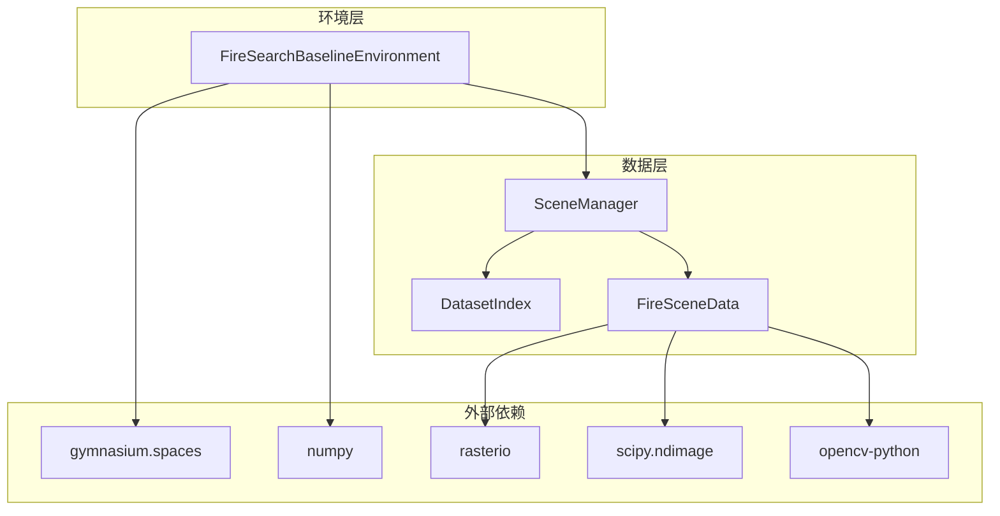
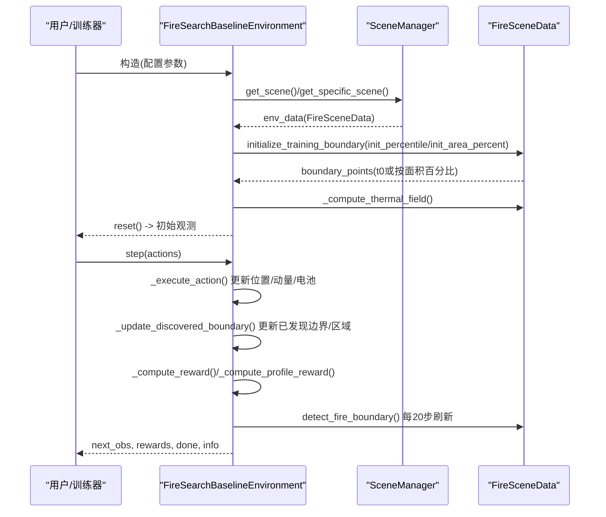
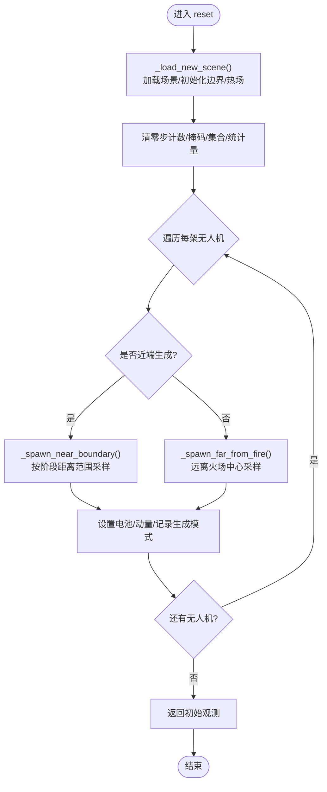
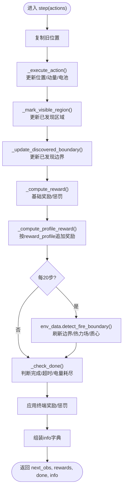
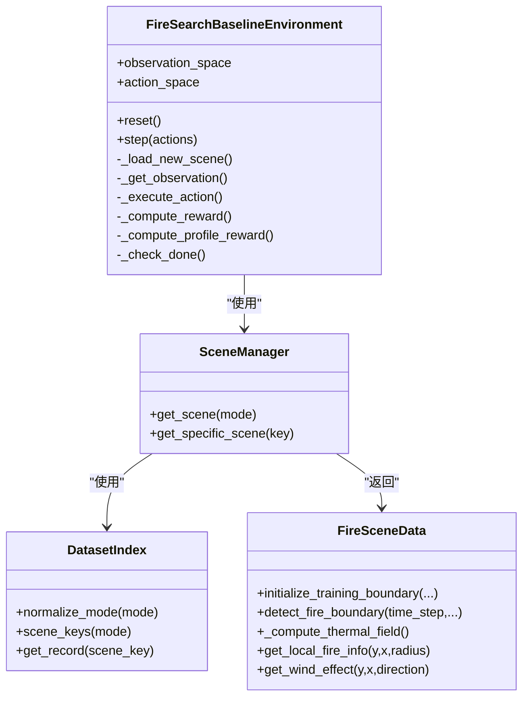

# 环境交互管理

<cite>
**本文引用的文件**   
- [rl_environment_baseline.py](file://environment_variables/environment_variables/rl_environment_baseline.py)
- [信息转换.py](file://environment_variables/environment_variables/信息转换.py)
- [test_fire_scene_data.py](file://environment_variables/environment_variables/test_fire_scene_data.py)
- [requirements.txt](file://environment_variables/requirements.txt)
</cite>

## 目录
1. [简介](#简介)
2. [项目结构](#项目结构)
3. [核心组件](#核心组件)
4. [架构总览](#架构总览)
5. [详细组件分析](#详细组件分析)
6. [依赖关系分析](#依赖关系分析)
7. [性能考量](#性能考量)
8. [故障排查指南](#故障排查指南)
9. [结论](#结论)
10. [附录](#附录)

## 简介
本技术文档围绕多无人机火灾边界搜索的强化学习环境，聚焦 FireSearchBaselineEnvironment 的初始化、重置与步进流程，系统阐述观测空间与动作空间设计，并给出最佳实践与常见问题解决方案。该环境采用“去中心化局部观测 + 集中式全局状态”的接口风格，适配 CTDE-PPO 等算法的训练需求。

## 项目结构
- 环境实现位于 environment_variables/environment_variables/rl_environment_baseline.py，提供 FireSearchBaselineEnvironment 类。
- 场景数据加载、归一化、热场计算与边界检测逻辑位于 environment_variables/environment_variables/信息转换.py，包含 SceneManager、DatasetIndex、FireSceneData 等关键模块。
- 测试用例 environment_variables/environment_variables/test_fire_scene_data.py 验证了环境维度、奖励分解键、参数覆盖等行为。
- 依赖声明在 environment_variables/requirements.txt。

图表来源
- [rl_environment_baseline.py:1-120](file://environment_variables/environment_variables/rl_environment_baseline.py#L1-L120)
- [信息转换.py:20-120](file://environment_variables/environment_variables/信息转换.py#L20-L120)

章节来源
- [rl_environment_baseline.py:1-120](file://environment_variables/environment_variables/rl_environment_baseline.py#L1-L120)
- [信息转换.py:20-120](file://environment_variables/environment_variables/信息转换.py#L20-L120)
- [requirements.txt:1-13](file://environment_variables/requirements.txt#L1-L13)

## 核心组件
- FireSearchBaselineEnvironment：多无人机火灾边界搜索环境，封装 gym.Env 接口，提供 reset() 与 step() 方法，定义 observation_space 与 action_space。
- SceneManager / DatasetIndex / FireSceneData：负责从 dataset_index.json 解析场景元数据、加载栅格与矢量数据、构建 t=0 训练边界、计算热场与风险地图、提供局部火情信息与风场影响等。

章节来源
- [rl_environment_baseline.py:21-158](file://environment_variables/environment_variables/rl_environment_baseline.py#L21-L158)
- [信息转换.py:219-323](file://environment_variables/environment_variables/信息转换.py#L219-L323)

## 架构总览
下图展示了环境初始化到单步交互的关键调用链路与数据流向。

图表来源
- [rl_environment_baseline.py:159-207](file://environment_variables/environment_variables/rl_environment_baseline.py#L159-L207)
- [rl_environment_baseline.py:331-361](file://environment_variables/environment_variables/rl_environment_baseline.py#L331-L361)
- [rl_environment_baseline.py:842-992](file://environment_variables/environment_variables/rl_environment_baseline.py#L842-L992)
- [信息转换.py:698-722](file://environment_variables/environment_variables/信息转换.py#L698-L722)
- [信息转换.py:759-800](file://environment_variables/environment_variables/信息转换.py#L759-L800)

## 详细组件分析

### 环境初始化与配置参数
- 构造函数接收以下关键参数（节选）：
  - data_dir：数据集根路径
  - num_drones：无人机数量
  - vision_radius：传感器半径（单元格）
  - max_steps：最大步数
  - use_metadata_uav_params：是否使用场景元数据中的 UAV 参数覆盖默认值
  - observation_profile：观测特征集（baseline/static_terrain/dynamic_front/risk_aware）
  - reward_profile：奖励策略（boundary_coverage/front_detection/severity_weighted/exploration_balanced）
  - curriculum_stage：课程阶段（1/2/3），影响生成策略与目标覆盖率
  - mode：模式（train/validation/generalization/stress/test/eval）
  - fixed_scene_key / scene_keys：固定场景或指定场景集合
  - init_percentile / init_area_percent：t=0 训练边界的面积百分比控制
  - stage2_target / stage3_target / stage3_near_prob：课程阶段目标与近端生成概率

- 初始化流程要点：
  - 根据 mode 与 scene_keys 选择场景集合，通过 SceneManager 获取当前场景对象 env_data。
  - 调用 env_data.initialize_training_boundary(...) 得到 t=0 的边界点序列，并设置 env_data.boundary_points。
  - 计算热场与风险相关字段，记录网格尺寸、边界点集合、火场质心等。
  - 若启用 use_metadata_uav_params，则用场景元数据中的 sensor_radius_cells 与 max_steps 覆盖默认值，并据此计算 max_battery。
  - 基于 observation_profile 确定 local_obs_dim 与 global_state_dim，并定义 observation_space；action_space 为 Discrete(5)。

章节来源
- [rl_environment_baseline.py:49-158](file://environment_variables/environment_variables/rl_environment_baseline.py#L49-L158)
- [rl_environment_baseline.py:159-207](file://environment_variables/environment_variables/rl_environment_baseline.py#L159-L207)
- [信息转换.py:698-722](file://environment_variables/environment_variables/信息转换.py#L698-L722)

### 环境重置机制 reset()
reset() 的职责包括：
- 场景加载：内部调用 _load_new_scene()，根据 fixed_scene_key 或 mode 随机选取场景，初始化训练边界与热场。
- 状态清零：重置步计数、访问掩码、已发现边界/前沿集合、最近移动轨迹窗口、首次热信号/边界时间戳、奖励分解字典等。
- 无人机初始位置分配：
  - 根据 curriculum_stage 与 mode 决定“近端生成”的概率；若命中，则在边界点附近按阶段距离范围采样，否则远离火场中心随机采样。
  - 保证与边界和已有无人机的最小间距约束，避免重叠。
- 状态初始化：为每架无人机设置满电电池、零动量，并返回初始观测。

图表来源
- [rl_environment_baseline.py:331-361](file://environment_variables/environment_variables/rl_environment_baseline.py#L331-L361)
- [rl_environment_baseline.py:362-436](file://environment_variables/environment_variables/rl_environment_baseline.py#L362-L436)

章节来源
- [rl_environment_baseline.py:331-361](file://environment_variables/environment_variables/rl_environment_baseline.py#L331-L361)
- [rl_environment_baseline.py:362-436](file://environment_variables/environment_variables/rl_environment_baseline.py#L362-L436)

### 步进函数 step() 执行流程
step(actions) 的核心流程如下：
- 动作执行：对每架无人机将离散动作映射为位移向量，裁剪至网格边界，更新位置与动量。
- 能耗与风场影响：根据移动方向与风场计算电池消耗；静止也有少量惩罚。
- 状态转移：
  - 标记新访问单元，更新已发现区域掩码与可见边界点集合。
  - 每20步调用 env_data.detect_fire_boundary(time_step) 刷新真实边界点、热力场与火场质心。
- 奖励计算：
  - 基础奖励：发现新边界点、探索新区域、重复/空闲/靠近同伴的惩罚、预边界热势增量引导。
  - 奖励剖面：根据 reward_profile 追加前沿探测、严重度加权、探索平衡等分量。
  - 终止条件：
    - 任务完成：达到课程阶段目标覆盖率（阶段1为固定阈值，阶段2/3为目标比例）。
    - 超时：达到 max_steps。
    - 电量耗尽：任意无人机电池<=0。
  - 终端奖励/惩罚：完成任务给予效率相关的正奖励；超时或电量耗尽施加惩罚，且无覆盖率时额外加重。
- 信息输出：info 中包含覆盖率、平均距火距离、完成原因、场景标识、观测/奖励剖面、首热/首边界步、阶段目标等。

图表来源
- [rl_environment_baseline.py:842-992](file://environment_variables/environment_variables/rl_environment_baseline.py#L842-L992)
- [rl_environment_baseline.py:808-841](file://environment_variables/environment_variables/rl_environment_baseline.py#L808-L841)

章节来源
- [rl_environment_baseline.py:842-992](file://environment_variables/environment_variables/rl_environment_baseline.py#L842-L992)
- [rl_environment_baseline.py:808-841](file://environment_variables/environment_variables/rl_environment_baseline.py#L808-L841)

### 观测空间 observation_space 的定义与数据结构
- 结构：spaces.Dict，包含两个键：
  - local_obs：长度为 num_drones 的 Tuple，每个元素为 Box(shape=(local_obs_dim,), dtype=float32)。
  - global_state：Box(shape=(global_state_dim,), dtype=float32)。
- local_obs_dim 由 observation_profile 决定：
  - baseline: 17
  - static_terrain: 24
  - dynamic_front: 23
  - risk_aware: 20
- global_state_dim 固定为 19。
- 各维含义（节选）：
  - 局部观测包含：无人机坐标归一化、电池占比、强度/DEM/坡度/风速归一化、风向正弦余弦、热梯度、动量、相机指向等；不同 profile 会拼接静态地形、动态前沿或风险感知特征。
  - 全局状态包含：覆盖率、平均/最低电池、团队质心与分散、平均距火距离、步长进度、访问密度、课程阶段、平均风速/高程、已发现边界比例、低电量指示、无人机数量、覆盖率梯度、未探索密度等。

章节来源
- [rl_environment_baseline.py:24-35](file://environment_variables/environment_variables/rl_environment_baseline.py#L24-L35)
- [rl_environment_baseline.py:108-131](file://environment_variables/environment_variables/rl_environment_baseline.py#L108-L131)
- [rl_environment_baseline.py:565-658](file://environment_variables/environment_variables/rl_environment_baseline.py#L565-L658)
- [test_fire_scene_data.py:158-189](file://environment_variables/environment_variables/test_fire_scene_data.py#L158-L189)

### 动作空间 action_space 的设计
- 类型：Discrete(5)，对应五个基本动作：
  - 0: 上移
  - 1: 下移
  - 2: 左移
  - 3: 右移
  - 4: 原地不动
- 约束：
  - 动作执行后位置被裁剪到网格边界内。
  - 原地动作有额外惩罚，鼓励探索与移动。
  - 与同伴过近会产生碰撞惩罚，避免聚集。

章节来源
- [rl_environment_baseline.py:89-90](file://environment_variables/environment_variables/rl_environment_baseline.py#L89-L90)
- [rl_environment_baseline.py:660-670](file://environment_variables/environment_variables/rl_environment_baseline.py#L660-L670)
- [rl_environment_baseline.py:737-754](file://environment_variables/environment_variables/rl_environment_baseline.py#L737-L754)

### 场景加载与热场/边界处理
- 场景加载：
  - SceneManager 依据 mode 与 scene_keys 选择场景，返回 FireSceneData 实例。
  - FireSceneData 读取 metadata、静态栅格、核心与扩展栅格、风场 ASC 或 weather_stream，推导归一化参数，构建 wind_speed/wind_direction 等字段。
- 训练边界初始化：
  - initialize_training_boundary 支持按面积百分比选择 t 时刻的边界，用于课程学习或难度控制。
- 热场计算：
  - 基于 intensity 与 fire_binary_map 进行鲁棒归一化、降采样高斯模糊、升采样回原分辨率，得到 thermal_potential 与导航场，供局部热信号判定与风险感知特征使用。

章节来源
- [信息转换.py:219-323](file://environment_variables/environment_variables/信息转换.py#L219-L323)
- [信息转换.py:639-682](file://environment_variables/environment_variables/信息转换.py#L639-L682)
- [信息转换.py:698-722](file://environment_variables/environment_variables/信息转换.py#L698-L722)
- [信息转换.py:759-800](file://environment_variables/environment_variables/信息转换.py#L759-L800)

## 依赖关系分析
- 环境与环境数据解耦：FireSearchBaselineEnvironment 仅依赖 SceneManager/FireSceneData 提供的接口，不直接操作磁盘 IO。
- 数据层强依赖 rasterio/scipy/opencv：栅格读取、形态学/滤波、图像缩放等操作集中在 FireSceneData。
- 强化学习框架：使用 gymnasium.spaces 定义观测与动作空间，便于与 PPO 等算法集成。

图表来源
- [rl_environment_baseline.py:1-120](file://environment_variables/environment_variables/rl_environment_baseline.py#L1-L120)
- [信息转换.py:20-120](file://environment_variables/environment_variables/信息转换.py#L20-L120)
- [信息转换.py:219-323](file://environment_variables/environment_variables/信息转换.py#L219-L323)

章节来源
- [rl_environment_baseline.py:1-120](file://environment_variables/environment_variables/rl_environment_baseline.py#L1-L120)
- [信息转换.py:20-120](file://environment_variables/environment_variables/信息转换.py#L20-L120)

## 性能考量
- 热场计算与边界检测：
  - 热场计算涉及降采样与高斯模糊，建议仅在必要时触发（如场景切换或定期刷新）。
  - 边界检测每20步执行一次，避免每步都重算导致开销过大。
- 内存与缓存：
  - 风险地图 severity_map 使用缓存，减少重复计算。
  - 已发现区域掩码与边界集合以位图/集合维护，提升查找与更新效率。
- 数值稳定性：
  - 所有归一化均做 clip 与除零保护，确保观测稳定。
- 并行与批处理：
  - 当前实现为单进程同步环境，适合与向量化环境包装器配合以提升吞吐。

[本节为通用指导，无需具体文件引用]

## 故障排查指南
- 场景缺失或无效：
  - 若 dataset_index.json 不存在或场景目录缺失，会抛出 FileNotFoundError/InvalidSceneError。请检查 data_dir 与 source_root 配置。
- 形状不匹配：
  - 栅格与静态地图 shape 不一致会报错。需确保所有栅格与静态地图分辨率一致。
- 风场缺失：
  - 若无 ASC 风场文件，会从 weather_stream 或 metadata 中推断；若仍失败，请补充风场文件或修正元数据。
- 观测维度异常：
  - 若 observation_profile 不在允许集合，构造时会抛错；可通过测试用例核对期望维度。
- 奖励分解键缺失：
  - 某些 reward_profile 会在 info["reward_breakdown"] 中写入特定键，测试覆盖了标准键集合，可据此定位问题。

章节来源
- [信息转换.py:32-44](file://environment_variables/environment_variables/信息转换.py#L32-L44)
- [信息转换.py:525-533](file://environment_variables/environment_variables/信息转换.py#L525-L533)
- [信息转换.py:473-491](file://environment_variables/environment_variables/信息转换.py#L473-L491)
- [test_fire_scene_data.py:191-220](file://environment_variables/environment_variables/test_fire_scene_data.py#L191-L220)

## 结论
FireSearchBaselineEnvironment 提供了清晰的多无人机火灾边界搜索 RL 接口，具备灵活的观测/奖励配置、稳健的场景与热场处理、以及完善的课程学习支持。通过合理的参数设置与调试手段，可在不同规模与难度的场景中稳定训练与评估。

[本节为总结性内容，无需具体文件引用]

## 附录

### 环境与数据依赖清单
- 核心依赖：numpy、rasterio、matplotlib、scipy、opencv-python
- 可选依赖（训练）：stable-baselines3、torch、tensorboard

章节来源
- [requirements.txt:1-13](file://environment_variables/requirements.txt#L1-L13)

### 常用配置示例（路径参考）
- 构造环境并固定场景：
  - 参考路径：[ctde_ppo_baseline_train.py 片段:1564-1589](file://environment_variables/environment_variables/outputs/lr_comparison_20260611_093948/训练结果/训练源码/ctde_ppo_baseline_train.py#L1564-L1589)
- 校验观测维度与奖励分解键：
  - 参考路径：[test_fire_scene_data.py:142-220](file://environment_variables/environment_variables/test_fire_scene_data.py#L142-L220)