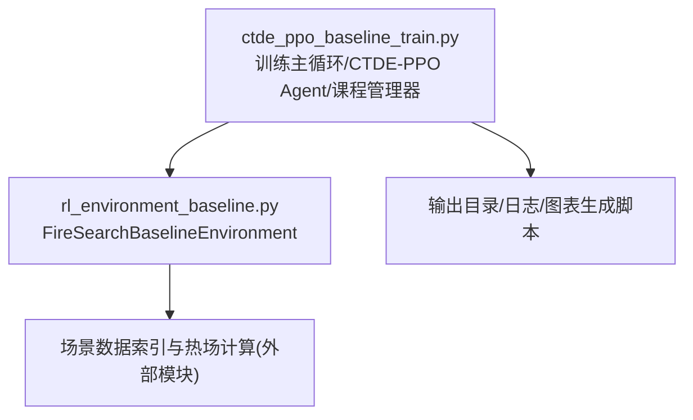
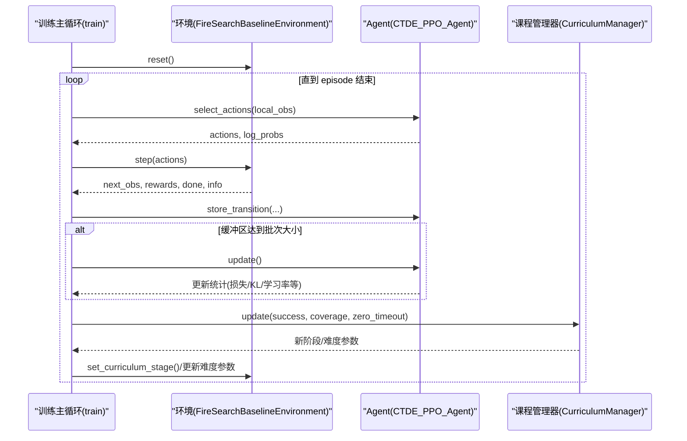
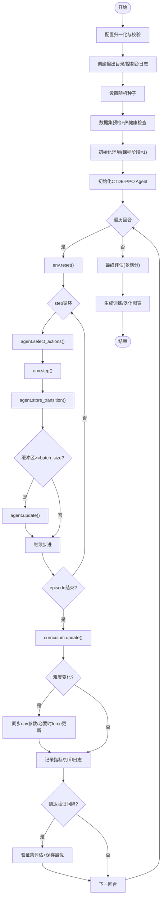
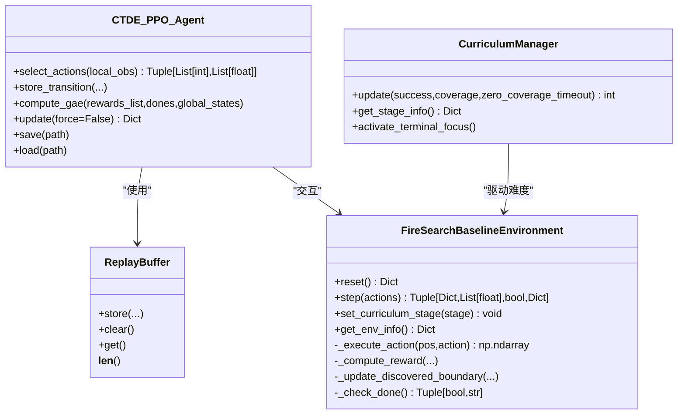
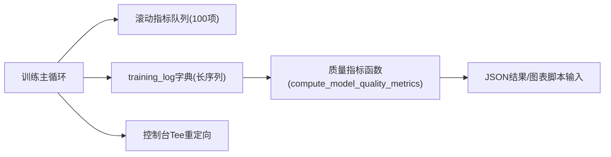
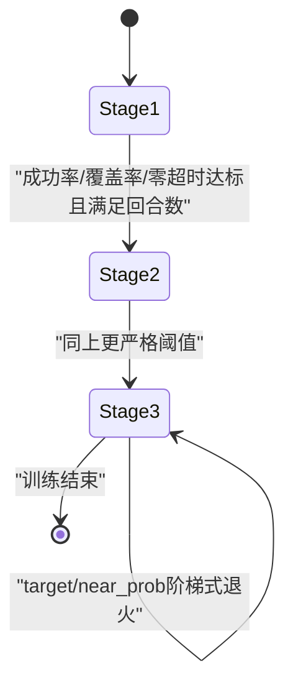
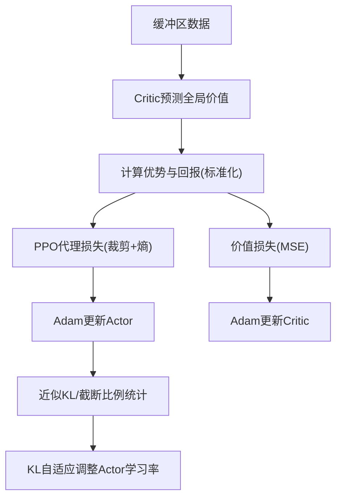
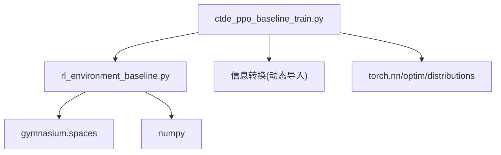

# 训练循环管理

<cite>
**本文引用的文件**   
- [ctde_ppo_baseline_train.py](file://environment_variables/environment_variables/ctde_ppo_baseline_train.py)
- [rl_environment_baseline.py](file://environment_variables/environment_variables/rl_environment_baseline.py)
</cite>

## 目录
1. [简介](#简介)
2. [项目结构](#项目结构)
3. [核心组件](#核心组件)
4. [架构总览](#架构总览)
5. [详细组件分析](#详细组件分析)
6. [依赖关系分析](#依赖关系分析)
7. [性能与内存优化](#性能与内存优化)
8. [故障排查指南](#故障排查指南)
9. [结论](#结论)
10. [附录](#附录)

## 简介
本技术文档围绕多智能体并行训练的“主训练循环管理系统”，系统性阐述以下方面：
- 主训练循环控制流程：环境交互、数据收集、模型更新与评估的完整周期。
- 多智能体协调机制：动作选择、奖励聚合、状态转移处理。
- 训练日志记录系统：指标采集、性能监控与结果存储。
- 实验配置管理与可复现性：随机种子控制、参数校验与输出组织。
- 进度可视化、早停策略与检查点管理最佳实践。
- 分布式训练支持与GPU内存优化方法。

## 项目结构
仓库中与训练循环相关的核心代码位于 environment_variables/environment_variables 目录下，主要包含：
- 训练脚本与算法实现：ctde_ppo_baseline_train.py
- 基线环境实现：rl_environment_baseline.py

图示来源
- [ctde_ppo_baseline_train.py:1278-1600](file://environment_variables/environment_variables/ctde_ppo_baseline_train.py#L1278-L1600)
- [rl_environment_baseline.py:21-158](file://environment_variables/environment_variables/rl_environment_baseline.py#L21-L158)

章节来源
- [ctde_ppo_baseline_train.py:1278-1600](file://environment_variables/environment_variables/ctde_ppo_baseline_train.py#L1278-L1600)
- [rl_environment_baseline.py:21-158](file://environment_variables/environment_variables/rl_environment_baseline.py#L21-L158)

## 核心组件
- FireSearchBaselineEnvironment：Gymnasium 风格的多无人机火边界搜索环境，提供局部观测与全局状态接口，支持多种观察/奖励配置与课程阶段切换。
- CTDE_PPO_Agent：基于 Actor-Critic 的 PPO 实现，支持 KL 自适应学习率、GAE 优势估计、批量/小批量更新与检查点保存/加载。
- CurriculumManager：三阶段课程学习管理器，动态调整初始区域百分位、目标覆盖率与近端生成概率，并在终末专注期强制最终难度。
- ReplayBuffer：轨迹缓冲区，按步累积 (local_obs, global_state, actions, log_probs, rewards, done)。
- 训练主循环 train()：负责配置归一化、数据集预检、热健康检查、日志与图表生成、验证与最终评估。

章节来源
- [rl_environment_baseline.py:21-158](file://environment_variables/environment_variables/rl_environment_baseline.py#L21-L158)
- [ctde_ppo_baseline_train.py:569-758](file://environment_variables/environment_variables/ctde_ppo_baseline_train.py#L569-L758)
- [ctde_ppo_baseline_train.py:759-1014](file://environment_variables/environment_variables/ctde_ppo_baseline_train.py#L759-L1014)
- [ctde_ppo_baseline_train.py:1278-1600](file://environment_variables/environment_variables/ctde_ppo_baseline_train.py#L1278-L1600)

## 架构总览
下图展示了训练主循环与环境、Agent、课程管理器之间的交互时序。

图示来源
- [ctde_ppo_baseline_train.py:1469-1600](file://environment_variables/environment_variables/ctde_ppo_baseline_train.py#L1469-L1600)
- [rl_environment_baseline.py:842-992](file://environment_variables/environment_variables/rl_environment_baseline.py#L842-L992)
- [ctde_ppo_baseline_train.py:569-758](file://environment_variables/environment_variables/ctde_ppo_baseline_train.py#L569-L758)

## 详细组件分析

### 主训练循环与控制流
- 配置归一化与校验：统一默认值、类型转换、范围裁剪与枚举合法性检查。
- 输出目录与日志：创建模型/日志目录，控制台输出重定向到文件；保存配置与源码快照。
- 数据集预检与热健康检查：统计各划分场景数量，诊断热场健康并断言阈值。
- 初始化环境与 Agent：根据配置构建环境（含课程阶段、观察/奖励配置）、实例化 Agent。
- 滚动指标与训练日志：维护滑动窗口统计，记录每回合关键指标。
- 课程学习驱动：依据成功率、覆盖率、零超时率等条件推进阶段与难度参数。
- 定期验证与保存：按间隔执行验证集评估，按验证分数保存最优模型。
- 训练后评估与可视化：在多个划分上评估，调用图表生成脚本产出训练与泛化曲线。

图示来源
- [ctde_ppo_baseline_train.py:1278-1600](file://environment_variables/environment_variables/ctde_ppo_baseline_train.py#L1278-L1600)

章节来源
- [ctde_ppo_baseline_train.py:1278-1600](file://environment_variables/environment_variables/ctde_ppo_baseline_train.py#L1278-L1600)

### 多智能体并行训练协调机制
- 动作选择：Actor 网络对每个智能体的局部观测输出离散动作分布，采样得到动作序列与对应 log_prob。
- 奖励聚合：环境返回每智能体单步奖励列表，训练侧使用团队平均奖励进行 GAE 计算。
- 状态转移：环境内部维护多智能体位置、电池、动量、可见区域、已发现边界集合等，并周期性更新火边界与热场。
- 终止条件：按课程阶段目标覆盖率或最大步数/电量耗尽判定，同时记录完成原因与零覆盖超时标志。

图示来源
- [rl_environment_baseline.py:842-992](file://environment_variables/environment_variables/rl_environment_baseline.py#L842-L992)
- [ctde_ppo_baseline_train.py:759-1014](file://environment_variables/environment_variables/ctde_ppo_baseline_train.py#L759-L1014)
- [ctde_ppo_baseline_train.py:569-758](file://environment_variables/environment_variables/ctde_ppo_baseline_train.py#L569-L758)

章节来源
- [rl_environment_baseline.py:842-992](file://environment_variables/environment_variables/rl_environment_baseline.py#L842-L992)
- [ctde_ppo_baseline_train.py:759-1014](file://environment_variables/environment_variables/ctde_ppo_baseline_train.py#L759-L1014)
- [ctde_ppo_baseline_train.py:569-758](file://environment_variables/environment_variables/ctde_ppo_baseline_train.py#L569-L758)

### 训练日志记录系统
- 控制台 Tee 输出：将 stdout/stderr 同时写入文件，便于离线回溯。
- 结构化日志字段：记录回合、奖励、任务得分、长度、覆盖率、成功/超时/零覆盖超时、KL、clip_fraction、学习率、课程阶段与难度参数等。
- 质量指标计算：基于任务得分与步骤序列计算收敛效率（AUC、首次达标步数/更新数），尾部稳定性（标准差、性能下降均值/最大值），KL 稳定性（均值、方差、超调率、截断比例）。
- 图表生成：通过子进程调用 make_training_figures.py 与 make_generalization_figures.py 生成训练与泛化曲线图。

图示来源
- [ctde_ppo_baseline_train.py:1385-1451](file://environment_variables/environment_variables/ctde_ppo_baseline_train.py#L1385-L1451)
- [ctde_ppo_baseline_train.py:358-433](file://environment_variables/environment_variables/ctde_ppo_baseline_train.py#L358-L433)
- [ctde_ppo_baseline_train.py:1048-1116](file://environment_variables/environment_variables/ctde_ppo_baseline_train.py#L1048-L1116)

章节来源
- [ctde_ppo_baseline_train.py:1385-1451](file://environment_variables/environment_variables/ctde_ppo_baseline_train.py#L1385-L1451)
- [ctde_ppo_baseline_train.py:358-433](file://environment_variables/environment_variables/ctde_ppo_baseline_train.py#L358-L433)
- [ctde_ppo_baseline_train.py:1048-1116](file://environment_variables/environment_variables/ctde_ppo_baseline_train.py#L1048-L1116)

### 实验配置管理与可复现性
- 配置归一化：合并默认配置与用户配置，字符串/列表规范化，数值范围裁剪与类型转换。
- 随机种子控制：设置 Python、NumPy、PyTorch CPU/CUDA 随机源，启用 cuDNN 确定性模式并关闭 benchmark。
- 输出组织：时间戳子目录、模型目录、日志目录、配置 JSON、源码快照复制。
- 数据集元信息：记录版本、划分计数、观察/奖励配置、传感器半径、最大步数等。

章节来源
- [ctde_ppo_baseline_train.py:161-281](file://environment_variables/environment_variables/ctde_ppo_baseline_train.py#L161-L281)
- [ctde_ppo_baseline_train.py:284-293](file://environment_variables/environment_variables/ctde_ppo_baseline_train.py#L284-L293)
- [ctde_ppo_baseline_train.py:1016-1046](file://environment_variables/environment_variables/ctde_ppo_baseline_train.py#L1016-L1046)
- [ctde_ppo_baseline_train.py:1128-1154](file://environment_variables/environment_variables/ctde_ppo_baseline_train.py#L1128-L1154)

### 课程学习与难度调度
- 三阶段课程：阶段1快速入门（低门槛），阶段2提升覆盖率目标，阶段3高目标与近端生成概率退火。
- 能力门控：基于成功率、覆盖率、零超时率与最小/最大回合数判断是否推进阶段。
- 终末专注：最后若干回合强制切换到最终 target 与 near_prob，确保收尾质量。
- 难度同步：当课程管理器输出新难度时，立即同步至环境并触发一次强制更新以稳定策略。

图示来源
- [ctde_ppo_baseline_train.py:569-758](file://environment_variables/environment_variables/ctde_ppo_baseline_train.py#L569-L758)
- [ctde_ppo_baseline_train.py:1469-1600](file://environment_variables/environment_variables/ctde_ppo_baseline_train.py#L1469-L1600)

章节来源
- [ctde_ppo_baseline_train.py:569-758](file://environment_variables/environment_variables/ctde_ppo_baseline_train.py#L569-L758)
- [ctde_ppo_baseline_train.py:1469-1600](file://environment_variables/environment_variables/ctde_ppo_baseline_train.py#L1469-L1600)

### 模型更新与学习率自适应
- GAE 优势估计：使用 Critic 预测全局状态价值，计算优势与回报并进行标准化。
- PPO 更新：小批量迭代，裁剪代理比率，熵正则，梯度裁剪，累计近似 KL 与截断比例。
- KL 自适应学习率：基于指数衰减因子与 EMA 跟踪的平均 KL 动态调整 Actor 学习率，限制上下界。
- 检查点：保存 Actor/Critic 权重与优化器状态、训练步数与 KL EMA，支持恢复。

图示来源
- [ctde_ppo_baseline_train.py:867-991](file://environment_variables/environment_variables/ctde_ppo_baseline_train.py#L867-L991)

章节来源
- [ctde_ppo_baseline_train.py:867-991](file://environment_variables/environment_variables/ctde_ppo_baseline_train.py#L867-L991)

### 评估与可视化
- 验证评估：按固定间隔在多场景上评估，汇总任务得分、覆盖率、超时率等，按综合评分保存最优模型。
- 最终评估：在 validation/generalization/stress 等多个划分上进行评估，记录 best_val 与 final 结果。
- 图表生成：调用外部脚本绘制训练曲线与泛化对比图，支持窗口大小与 DPI 配置。

章节来源
- [ctde_ppo_baseline_train.py:1170-1217](file://environment_variables/environment_variables/ctde_ppo_baseline_train.py#L1170-L1217)
- [ctde_ppo_baseline_train.py:1048-1116](file://environment_variables/environment_variables/ctde_ppo_baseline_train.py#L1048-L1116)

## 依赖关系分析
- 训练脚本依赖环境模块与数据索引模块（通过 importlib 动态导入）。
- 环境模块依赖 Gymnasium 空间定义与 NumPy 矩阵操作。
- Agent 模块依赖 PyTorch 神经网络与优化器。

图示来源
- [ctde_ppo_baseline_train.py:33-36](file://environment_variables/environment_variables/ctde_ppo_baseline_train.py#L33-L36)
- [rl_environment_baseline.py:12-18](file://environment_variables/environment_variables/rl_environment_baseline.py#L12-L18)

章节来源
- [ctde_ppo_baseline_train.py:33-36](file://environment_variables/environment_variables/ctde_ppo_baseline_train.py#L33-L36)
- [rl_environment_baseline.py:12-18](file://environment_variables/environment_variables/rl_environment_baseline.py#L12-L18)

## 性能与内存优化
- 批量与小批量更新：根据 batch_size 与 mini_batch_size 分片，减少单次显存占用。
- 梯度裁剪：actor/critic 均设置 max_grad_norm，避免梯度爆炸。
- 设备自动选择：auto 模式下优先 CUDA，否则回退 CPU。
- 确定性训练：开启 cuDNN deterministic 并关闭 benchmark，保证可复现性（可能牺牲部分速度）。
- 建议扩展：
  - 分布式训练：可使用 torch.distributed.launch 或 Ray RLlib 进行多进程/多机并行，共享经验池或采用异步更新策略。
  - GPU 内存优化：降低 batch_size 或 mini_batch_size，使用混合精度（AMP）与梯度累积；及时释放中间张量；避免在 Python 层持有大数组引用。
  - I/O 优化：使用多进程 DataLoader 或异步读取栅格数据，减少磁盘瓶颈。

章节来源
- [ctde_ppo_baseline_train.py:805-808](file://environment_variables/environment_variables/ctde_ppo_baseline_train.py#L805-L808)
- [ctde_ppo_baseline_train.py:284-293](file://environment_variables/environment_variables/ctde_ppo_baseline_train.py#L284-L293)
- [ctde_ppo_baseline_train.py:925-926](file://environment_variables/environment_variables/ctde_ppo_baseline_train.py#L925-L926)

## 故障排查指南
- 热健康检查失败：若热场健康指标超过阈值，训练会在启动前中断。请检查场景初始化参数与热场计算逻辑。
- 观察/奖励配置错误：未识别的 observation_profile 或 reward_profile 会抛出异常。请确认配置值在允许集合内。
- 学习率策略非法：lr_adapt_mode 仅支持 fixed 与 kl。
- 课程阶段推进不生效：检查成功率、覆盖率、零超时率是否达到门限，以及回合数是否满足最小/最大约束。
- 图表生成失败：确认 outputs 目录下的绘图脚本存在并可执行。

章节来源
- [ctde_ppo_baseline_train.py:1239-1247](file://environment_variables/environment_variables/ctde_ppo_baseline_train.py#L1239-L1247)
- [ctde_ppo_baseline_train.py:196-202](file://environment_variables/environment_variables/ctde_ppo_baseline_train.py#L196-L202)
- [ctde_ppo_baseline_train.py:232-234](file://environment_variables/environment_variables/ctde_ppo_baseline_train.py#L232-L234)
- [ctde_ppo_baseline_train.py:640-670](file://environment_variables/environment_variables/ctde_ppo_baseline_train.py#L640-L670)
- [ctde_ppo_baseline_train.py:1086-1114](file://environment_variables/environment_variables/ctde_ppo_baseline_train.py#L1086-L1114)

## 结论
该训练循环管理系统以 CTDE-PPO 为核心，结合三阶段课程学习与 KL 自适应学习率，实现了稳定的多智能体并行训练流程。通过完善的日志记录、质量指标与可视化输出，以及严格的配置校验与可复现性保障，为复杂火边界搜索任务提供了可靠的训练基础设施。建议在后续迭代中引入分布式训练与混合精度优化，进一步提升训练吞吐与可扩展性。

## 附录
- 关键函数路径参考：
  - 训练主循环：train()
  - 课程管理器：CurriculumManager.update()
  - Agent 更新：CTDE_PPO_Agent.update()
  - 环境步进：FireSearchBaselineEnvironment.step()
  - 质量指标：compute_model_quality_metrics()
  - 图表生成：_run_figure_scripts()

章节来源
- [ctde_ppo_baseline_train.py:1278-1600](file://environment_variables/environment_variables/ctde_ppo_baseline_train.py#L1278-L1600)
- [ctde_ppo_baseline_train.py:569-758](file://environment_variables/environment_variables/ctde_ppo_baseline_train.py#L569-L758)
- [ctde_ppo_baseline_train.py:867-991](file://environment_variables/environment_variables/ctde_ppo_baseline_train.py#L867-L991)
- [rl_environment_baseline.py:842-992](file://environment_variables/environment_variables/rl_environment_baseline.py#L842-L992)
- [ctde_ppo_baseline_train.py:358-433](file://environment_variables/environment_variables/ctde_ppo_baseline_train.py#L358-L433)
- [ctde_ppo_baseline_train.py:1048-1116](file://environment_variables/environment_variables/ctde_ppo_baseline_train.py#L1048-L1116)