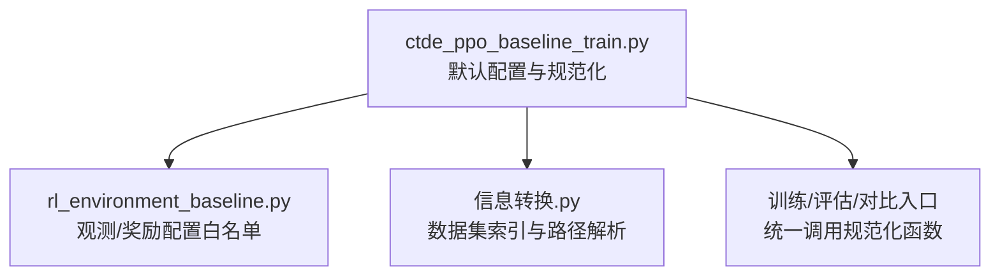
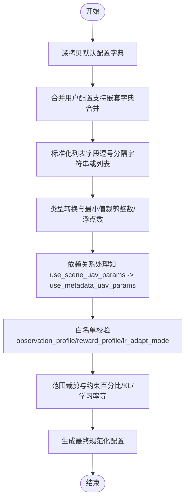
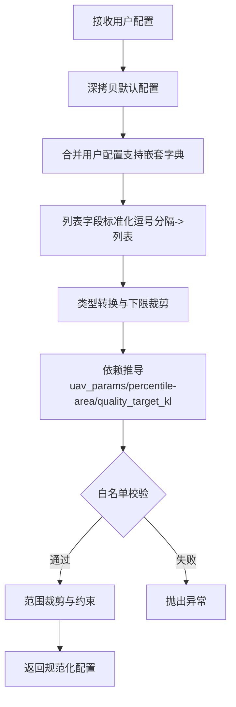
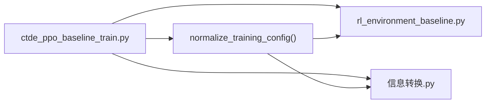

# 配置管理系统

<cite>
**本文引用的文件**   
- [ctde_ppo_baseline_train.py](file://environment_variables/environment_variables/ctde_ppo_baseline_train.py)
- [rl_environment_baseline.py](file://environment_variables/environment_variables/rl_environment_baseline.py)
- [信息转换.py](file://environment_variables/environment_variables/信息转换.py)
</cite>

## 目录
1. [简介](#简介)
2. [项目结构](#项目结构)
3. [核心组件](#核心组件)
4. [架构总览](#架构总览)
5. [详细组件分析](#详细组件分析)
6. [依赖关系分析](#依赖关系分析)
7. [性能与可扩展性](#性能与可扩展性)
8. [故障排查指南](#故障排查指南)
9. [结论](#结论)
10. [附录：最佳实践与版本兼容](#附录最佳实践与版本兼容)

## 简介
本技术文档聚焦于“配置管理系统”，围绕训练脚本中的默认配置字典与规范化函数展开，系统阐述以下要点：
- DEFAULT_TRAIN_CONFIG 的结构与默认参数设置（数据路径、训练参数、评估配置、输出设置等）
- normalize_training_config 的参数验证与规范化逻辑（类型检查、范围校验、依赖关系处理）
- 配置参数的层次组织（基础配置、算法参数、环境设置）
- 动态配置更新机制（运行时参数调整、继承规则）
- 配置管理最佳实践（配置文件格式、参数调优指南、版本兼容性）
- 常见配置错误的诊断与解决方案

## 项目结构
本项目中与配置管理直接相关的代码集中在训练脚本与环境定义中：
- 训练脚本定义了默认配置字典与规范化流程，并在训练、评估、对比实验等入口统一调用规范化函数
- 环境类提供观测与奖励配置的白名单，供规范化阶段进行合法性校验
- 数据集索引模块负责数据路径解析与场景键的归一化，间接影响配置的数据集相关字段

图表来源
- [ctde_ppo_baseline_train.py:98-281](file://environment_variables/environment_variables/ctde_ppo_baseline_train.py#L98-L281)
- [rl_environment_baseline.py:24-35](file://environment_variables/environment_variables/rl_environment_baseline.py#L24-L35)
- [信息转换.py:20-94](file://environment_variables/environment_variables/信息转换.py#L20-L94)

章节来源
- [ctde_ppo_baseline_train.py:98-281](file://environment_variables/environment_variables/ctde_ppo_baseline_train.py#L98-L281)
- [rl_environment_baseline.py:24-35](file://environment_variables/environment_variables/rl_environment_baseline.py#L24-L35)
- [信息转换.py:20-94](file://environment_variables/environment_variables/信息转换.py#L20-L94)

## 核心组件
- 默认配置字典：集中声明所有可配置项及其默认值，覆盖数据路径、训练循环、PPO超参、课程学习、评估与可视化、输出目录等
- 规范化函数：以深拷贝默认配置为基线，合并用户传入配置，执行类型转换、范围裁剪、依赖推导与白名单校验，最终返回一致可用的配置对象
- 环境白名单：在规范化阶段对 observation_profile 与 reward_profile 进行白名单校验，确保与环境的维度与实现一致
- 数据集索引：提供 split 模式别名与场景键解析，配合配置中的 train_split/eval_split/validation_split/final_eval_splits 等字段使用

章节来源
- [ctde_ppo_baseline_train.py:98-158](file://environment_variables/environment_variables/ctde_ppo_baseline_train.py#L98-L158)
- [ctde_ppo_baseline_train.py:160-281](file://environment_variables/environment_variables/ctde_ppo_baseline_train.py#L160-L281)
- [rl_environment_baseline.py:24-35](file://environment_variables/environment_variables/rl_environment_baseline.py#L24-L35)
- [信息转换.py:20-94](file://environment_variables/environment_variables/信息转换.py#L20-L94)

## 架构总览
下图展示了配置从“默认字典”到“规范化后配置”的流转过程，以及关键校验点与依赖关系。

图表来源
- [ctde_ppo_baseline_train.py:160-281](file://environment_variables/environment_variables/ctde_ppo_baseline_train.py#L160-L281)

章节来源
- [ctde_ppo_baseline_train.py:160-281](file://environment_variables/environment_variables/ctde_ppo_baseline_train.py#L160-L281)

## 详细组件分析

### 默认配置字典（DEFAULT_TRAIN_CONFIG）
该字典按功能域组织，便于理解与维护：
- 数据与场景
  - data_dir：数据集根目录
  - train_split/eval_split/validation_split/final_eval_splits：划分名称与别名映射由数据集索引模块提供
  - train_scene_keys/eval_scene_keys：场景键过滤（支持逗号分隔字符串或列表）
- 环境与任务
  - num_drones/vision_radius/max_steps：多智能体与感知/步长限制
  - use_metadata_uav_params/use_scene_uav_params：无人机元数据参数开关（二者联动）
  - observation_profile/reward_profile：观测与奖励策略（受环境白名单约束）
  - norm_params_source/init_percentile/init_area_percent：初始化与归一化参数（二者等价且互相推导）
- 训练与优化
  - total_episodes/max_train_updates：训练规模控制
  - actor_lr/critic_lr/lr_adapt_mode/target_kl/actor_lr_min/actor_lr_max/kl_ema_beta/kl_lr_alpha：自适应学习率与KL目标
  - gamma/gae_lambda/clip_epsilon/entropy_coef/value_coef/max_grad_norm/ppo_epochs/batch_size：PPO核心超参
- 课程学习与质量指标
  - stage2_success_target/stage3_success_target/stage3_near_prob：课程目标与近端概率退火
  - quality_score_threshold/quality_window/quality_tail_fraction/quality_target_kl：模型质量评估窗口与阈值
- 评估与输出
  - validation_interval/validation_episodes_per_scene/save_best_by_validation：验证与保存策略
  - eval_episodes_per_scene/eval_stages/eval_seed_stride/eval_after_train：评估批次与阶段
  - final_eval_episodes_per_scene/evaluate_best_val_after_train：最终评估与最佳模型再评估
  - plot_after_train/figure_window/figure_dpi：绘图与图像输出
  - output_root_dir/output_subdir：输出根目录与子目录
  - seed/comparison_seeds：随机种子与对比实验种子集合

章节来源
- [ctde_ppo_baseline_train.py:98-158](file://environment_variables/environment_variables/ctde_ppo_baseline_train.py#L98-L158)

### 规范化函数（normalize_training_config）
职责与流程：
- 输入：可选的用户配置字典；若为 None 则仅返回默认配置副本
- 合并策略：对嵌套字典采用深度合并，其余字段直接覆盖
- 列表标准化：train_scene_keys/eval_scene_keys/final_eval_splits 等支持逗号分隔字符串或列表，统一转为小写字符串列表
- 类型转换与下限裁剪：将数值型字段转换为 int/float，并施加最小值或范围裁剪（例如 batch_size>=32、ppo_epochs>=1、seed 取整等）
- 依赖关系处理：
  - use_scene_uav_params 与 use_metadata_uav_params 双向同步
  - init_percentile 与 init_area_percent 互为等价，任一被显式设置时另一自动对齐
  - quality_target_kl 未显式设置时回退为 target_kl
- 白名单校验：
  - observation_profile 必须在环境提供的 OBSERVATION_PROFILE_DIMS 键集合内
  - reward_profile 必须在环境提供的 REWARD_PROFILES 集合内
  - lr_adapt_mode 必须为 "fixed" 或 "kl"
- 范围约束：
  - init_percentile/init_area_percent 需在 [0, 100]
  - kl_ema_beta 裁剪至 [0, 0.999]
  - actor_lr_min/max 保证非负且 min<=max
  - target_kl 有下界保护
  - 各类成功率/比例参数裁剪至 [0, 1]
  - quality_tail_fraction 裁剪至 [0.05, 1.0]
- 输出：返回规范化后的完整配置字典

图表来源
- [ctde_ppo_baseline_train.py:160-281](file://environment_variables/environment_variables/ctde_ppo_baseline_train.py#L160-L281)
- [rl_environment_baseline.py:24-35](file://environment_variables/environment_variables/rl_environment_baseline.py#L24-L35)

章节来源
- [ctde_ppo_baseline_train.py:160-281](file://environment_variables/environment_variables/ctde_ppo_baseline_train.py#L160-L281)
- [rl_environment_baseline.py:24-35](file://environment_variables/environment_variables/rl_environment_baseline.py#L24-L35)

### 配置层次结构与组织方式
- 基础配置层：数据路径、随机种子、输出目录、日志与绘图选项
- 环境设置层：num_drones、vision_radius、max_steps、observation_profile、reward_profile、norm_params_source、init_percentile/init_area_percent
- 算法参数层：PPO 超参、学习率策略、KL 目标与自适应系数、梯度裁剪、批量大小与轮数
- 课程学习层：各阶段成功目标、near_prob 退火、能力门槛与强制推进条件
- 评估与输出层：验证间隔、评估场景与回合数、最终评估集合、最佳模型保存与再评估、绘图窗口与 DPI

章节来源
- [ctde_ppo_baseline_train.py:98-158](file://environment_variables/environment_variables/ctde_ppo_baseline_train.py#L98-L158)

### 动态配置更新机制
- 运行时参数调整：训练主流程在入口处统一调用规范化函数，确保每次运行均基于最新默认值与用户覆盖生成一致配置
- 继承规则：
  - 嵌套字典合并：用户配置中的子字典会覆盖默认配置对应子字典的同名字段，未覆盖字段保留默认
  - 字段级覆盖：非字典字段直接以用户值替换默认值
  - 依赖联动：部分字段存在隐式依赖，规范化阶段会自动推导与同步（如 uav_params 开关、percentile/area 等价、quality_target_kl 回退）

章节来源
- [ctde_ppo_baseline_train.py:160-281](file://environment_variables/environment_variables/ctde_ppo_baseline_train.py#L160-L281)

### 与环境和数据集的集成点
- 环境白名单：observation_profile 与 reward_profile 的取值由环境类维护，规范化阶段据此进行合法性校验
- 数据集索引：split 模式别名与场景键解析由数据集索引模块提供，配置中的 split 字段与其保持一致

章节来源
- [rl_environment_baseline.py:24-35](file://environment_variables/environment_variables/rl_environment_baseline.py#L24-L35)
- [信息转换.py:20-94](file://environment_variables/environment_variables/信息转换.py#L20-L94)

## 依赖关系分析
- 训练脚本依赖环境类提供的观测/奖励白名单，用于规范化阶段的白名单校验
- 训练脚本依赖数据集索引模块进行 split 模式归一化与场景键解析
- 训练脚本内部多处入口（训练、评估、对比实验）均调用规范化函数，形成统一的配置入口

图表来源
- [ctde_ppo_baseline_train.py:160-281](file://environment_variables/environment_variables/ctde_ppo_baseline_train.py#L160-L281)
- [rl_environment_baseline.py:24-35](file://environment_variables/environment_variables/rl_environment_baseline.py#L24-L35)
- [信息转换.py:20-94](file://environment_variables/environment_variables/信息转换.py#L20-L94)

章节来源
- [ctde_ppo_baseline_train.py:160-281](file://environment_variables/environment_variables/ctde_ppo_baseline_train.py#L160-L281)
- [rl_environment_baseline.py:24-35](file://environment_variables/environment_variables/rl_environment_baseline.py#L24-L35)
- [信息转换.py:20-94](file://environment_variables/environment_variables/信息转换.py#L20-L94)

## 性能与可扩展性
- 配置规范化为一次性预处理，时间复杂度与配置字段数量线性相关，开销极低
- 列表标准化与类型转换均为轻量操作，适合在启动阶段执行
- 建议将复杂计算（如大规模统计、重采样）移出规范化流程，避免拖慢启动速度

[本节为通用指导，不直接分析具体文件]

## 故障排查指南
- 白名单错误
  - 现象：observation_profile 或 reward_profile 不在允许集合中
  - 原因：传入值拼写错误或环境未实现该配置
  - 解决：参考环境类的白名单集合，修正为合法值
- 范围越界
  - 现象：init_percentile/init_area_percent 超出 [0, 100]
  - 原因：配置值非法
  - 解决：将值调整到合理范围
- 学习率策略非法
  - 现象：lr_adapt_mode 不为 "fixed" 或 "kl"
  - 原因：传入值不在允许集合
  - 解决：改为 "fixed" 或 "kl"
- 依赖冲突
  - 现象：use_scene_uav_params 与 use_metadata_uav_params 不一致
  - 原因：同时设置了两个关联字段但值不同
  - 解决：保持二者一致，或由规范化函数自动同步
- 数据集路径与索引
  - 现象：找不到 dataset_index.json 或场景目录缺失
  - 原因：data_dir 指向错误或索引文件不完整
  - 解决：确认 data_dir 正确，并确保 dataset_index.json 与场景文件齐全

章节来源
- [ctde_ppo_baseline_train.py:196-202](file://environment_variables/environment_variables/ctde_ppo_baseline_train.py#L196-L202)
- [ctde_ppo_baseline_train.py:215-220](file://environment_variables/environment_variables/ctde_ppo_baseline_train.py#L215-L220)
- [ctde_ppo_baseline_train.py:233-234](file://environment_variables/environment_variables/ctde_ppo_baseline_train.py#L233-L234)
- [信息转换.py:35-41](file://environment_variables/environment_variables/信息转换.py#L35-L41)
- [信息转换.py:80-94](file://environment_variables/environment_variables/信息转换.py#L80-L94)

## 结论
本配置管理系统通过“默认字典 + 规范化函数”的组合，实现了强类型、强约束、强一致性的配置治理。其优势包括：
- 明确的层次结构与默认值，降低上手成本
- 严格的白名单与范围校验，提升鲁棒性
- 灵活的依赖推导与继承规则，简化用户配置负担
- 统一的入口与输出，便于追踪与复现实验

[本节为总结性内容，不直接分析具体文件]

## 附录：最佳实践与版本兼容

- 配置文件格式
  - 推荐使用 JSON/YAML 存储用户覆盖配置，字段名与默认字典保持一致
  - 列表字段既可用数组，也可用逗号分隔字符串，规范化函数会统一处理
- 参数调优指南
  - 先固定 observation_profile 与 reward_profile，再逐步调整 PPO 超参与 KL 自适应参数
  - 使用 quality_window 与 quality_tail_fraction 监控收敛稳定性，结合 target_kl 控制策略更新幅度
  - 课程学习阶段的目标与 near_prob 退火需与任务难度匹配，避免过早推进导致不稳定
- 版本兼容性处理
  - 新增配置项时应保留默认值，并通过规范化函数进行向后兼容
  - 废弃字段可通过规范化阶段给出警告或迁移到新字段
  - 环境白名单扩展时，应在训练脚本中同步更新校验逻辑

[本节为通用指导，不直接分析具体文件]