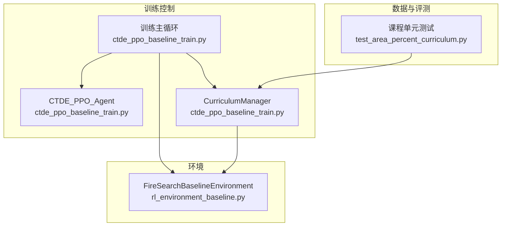
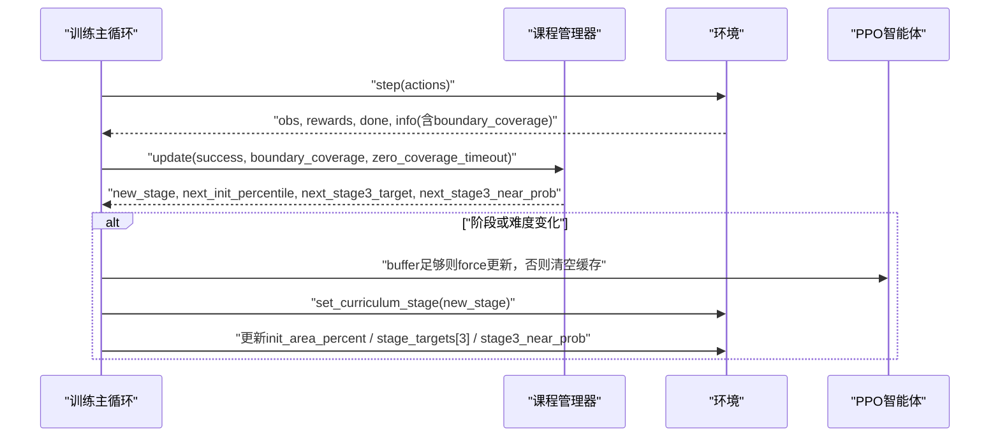
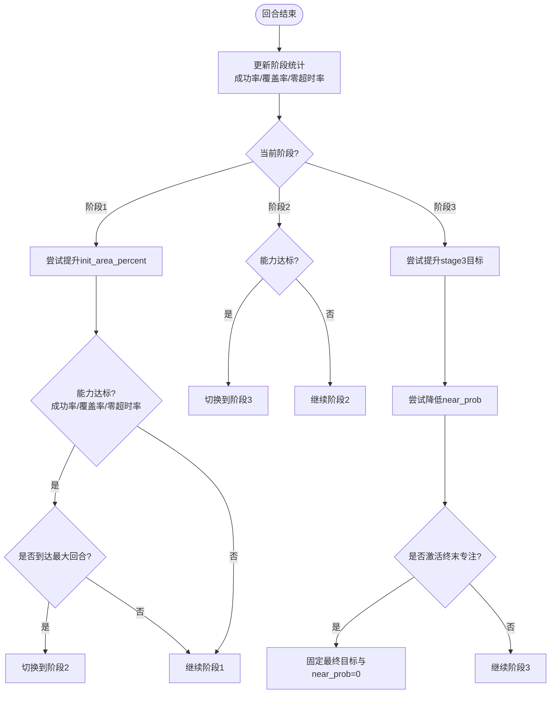
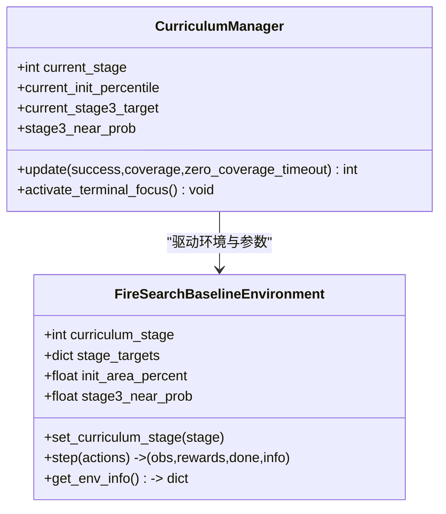
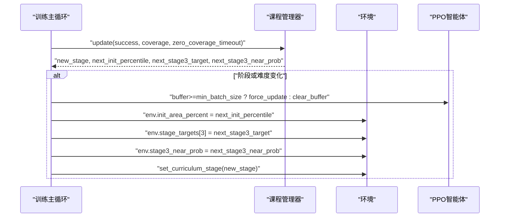
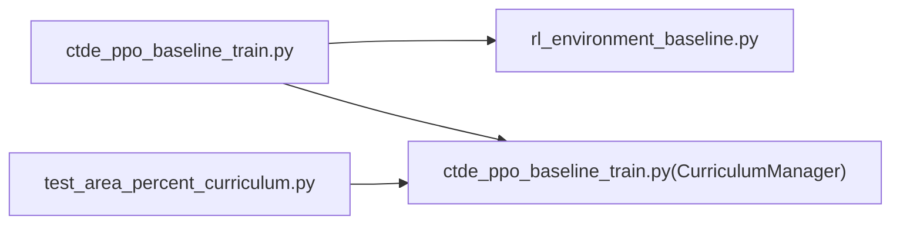

# 三阶段课程学习框架

<cite>
**本文引用的文件**   
- [ctde_ppo_baseline_train.py](file://environment_variables/environment_variables/ctde_ppo_baseline_train.py)
- [rl_environment_baseline.py](file://environment_variables/environment_variables/rl_environment_baseline.py)
- [test_area_percent_curriculum.py](file://environment_variables/environment_variables/test_area_percent_curriculum.py)
</cite>

## 更新摘要
**变更内容**   
- 新增'Scheme C'能力绑定步进退火系统的详细实现说明
- 更新课程管理器的目标难度阶梯、近概率退火和严格能力门限机制
- 增强终末专注机制的技术细节描述
- 完善各阶段训练目标和技能积累过程的数学基础分析

## 目录
1. [引言](#引言)
2. [项目结构](#项目结构)
3. [核心组件](#核心组件)
4. [架构总览](#架构总览)
5. [详细组件分析](#详细组件分析)
6. [依赖关系分析](#依赖关系分析)
7. [性能与稳定性考量](#性能与稳定性考量)
8. [故障排查指南](#故障排查指南)
9. [结论](#结论)
10. [附录：超参数配置与评估方法](#附录超参数配置与评估方法)

## 引言
本技术文档围绕"三阶段课程学习框架"展开，面向多无人机火场边界搜索任务。该框架通过渐进式难度提升策略，将训练过程划分为三个阶段：第一阶段基础探索、第二阶段边界发现、第三阶段精确搜索。每个阶段的目标、约束与奖励设计均不同，配合自动化的课程切换逻辑与可选的终末专注模式，实现从"快速收敛"到"稳定泛化"的训练路径。

**最新更新**：引入'Scheme C'能力绑定步进退火系统，包含目标难度阶梯、近概率退火和严格能力门限，以及终末专注机制，显著提升了训练的稳定性和泛化能力。

## 项目结构
本项目采用"环境 + 训练脚本 + 测试"的清晰分层：
- 环境层：定义多智能体观测/动作空间、场景加载、边界覆盖率计算、阶段相关终止条件与奖励分解。
- 训练层：CTDE-PPO 算法实现、回放缓冲、PPO 更新、日志记录、质量指标计算、课程管理器集成。
- 测试层：针对课程管理器的关键行为进行单元测试验证。



**图表来源**
- [ctde_ppo_baseline_train.py:568-752](file://environment_variables/environment_variables/ctde_ppo_baseline_train.py#L568-L752)
- [rl_environment_baseline.py:21-200](file://environment_variables/environment_variables/rl_environment_baseline.py#L21-L200)
- [test_area_percent_curriculum.py:130-169](file://environment_variables/environment_variables/test_area_percent_curriculum.py#L130-L169)

**章节来源**
- [ctde_ppo_baseline_train.py:98-158](file://environment_variables/environment_variables/ctde_ppo_baseline_train.py#L98-L158)
- [rl_environment_baseline.py:21-100](file://environment_variables/environment_variables/rl_environment_baseline.py#L21-L100)

## 核心组件
- 课程管理器（CurriculumManager）：维护当前阶段、各阶段统计量、能力门槛与退火阶梯，负责自动推进阶段与目标。
- 环境（FireSearchBaselineEnvironment）：根据当前课程阶段调整终止条件、目标覆盖率、近边界生成概率等；提供奖励分解与覆盖率度量。
- PPO 智能体（CTDE_PPO_Agent）：执行策略网络与价值网络的更新，支持 KL 自适应学习率。
- 训练主循环：每回合结束后调用课程管理器更新，动态调整环境难度并触发必要的模型更新或缓存清理。

**章节来源**
- [ctde_ppo_baseline_train.py:568-752](file://environment_variables/environment_variables/ctde_ppo_baseline_train.py#L568-L752)
- [rl_environment_baseline.py:994-1018](file://environment_variables/environment_variables/rl_environment_baseline.py#L994-L1018)
- [ctde_ppo_baseline_train.py:759-800](file://environment_variables/environment_variables/ctde_ppo_baseline_train.py#L759-L800)

## 架构总览
下图展示了训练主循环中课程管理与环境交互的关键时序：



**图表来源**
- [ctde_ppo_baseline_train.py:1554-1581](file://environment_variables/environment_variables/ctde_ppo_baseline_train.py#L1554-L1581)
- [rl_environment_baseline.py:994-1018](file://environment_variables/environment_variables/rl_environment_baseline.py#L994-L1018)

## 详细组件分析

### 课程管理器（CurriculumManager）

#### 'Scheme C'能力绑定步进退火系统

**更新** 引入了全新的'Scheme C'能力绑定步进退火系统，替代了旧的线性退火策略，提供了更精细的难度控制和更强的稳定性保证。

##### 核心特性

1. **目标难度阶梯（Target Difficulty Ladder）**
   - `STAGE3_TARGET_LADDER = [0.20, 0.35, 0.50, float(stage3_final_target)]`
   - 逐步提升目标覆盖率要求，确保模型在达到更高标准前具备相应能力

2. **近概率退火（Near Probability Annealing）**
   - `STAGE3_NEAR_LADDER = [0.25, 0.15, 0.05, 0.0]`
   - 严格控制近边界生成概率，从初始0.25逐步降至0.0

3. **严格能力门限（Strict Capability Gates）**
   ```python
   STAGE3_NEAR_GATES = [
       (0.30, 0.20, 0.25),   # 0.25 -> 0.15
       (0.40, 0.15, 0.35),   # 0.15 -> 0.05
       (0.50, 0.10, 0.45),   # 0.05 -> 0.00
   ]
   ```
   - 每级退火需要满足严格的成功率、零超时率和覆盖率要求

4. **终末专注机制（Terminal Focus Mechanism）**
   - `TERMINAL_FOCUS_EPISODES = 300`
   - 最后300回合强制使用最终评估条件，确保结果一致性

##### 状态与统计
- 当前阶段、每阶段回合数、成功率、平均覆盖率、零覆盖率超时率。
- 阶段阈值与最小/最大回合数，用于能力判定与强制推进。

##### 阶段推进逻辑

**第一阶段**：基于成功率、覆盖率与零覆盖率超时率的综合判定，达到门槛后进入第二阶段；同时存在"面积百分比"退火（init_area_percent），在满足最低回合与成功率时逐步提高初始区域比例。

**第二阶段**：以更高成功率与覆盖率门槛推进至第三阶段。

**第三阶段**：目标覆盖率阶梯上升（STAGE3_TARGET_LADDER），同时近边界生成概率（near_prob）按能力门限阶梯下降，且不得超前于目标进度。

##### 终末专注（Terminal Focus）
当接近训练尾声时，可激活终末专注，强制将目标设为最终值并将 near_prob 降至 0，确保最终评估条件严格一致。



**图表来源**
- [ctde_ppo_baseline_train.py:621-739](file://environment_variables/environment_variables/ctde_ppo_baseline_train.py#L621-L739)
- [ctde_ppo_baseline_train.py:753-757](file://environment_variables/environment_variables/ctde_ppo_baseline_train.py#L753-L757)

**章节来源**
- [ctde_ppo_baseline_train.py:568-752](file://environment_variables/environment_variables/ctde_ppo_baseline_train.py#L568-L752)
- [test_area_percent_curriculum.py:130-169](file://environment_variables/environment_variables/test_area_percent_curriculum.py#L130-L169)

### 环境（FireSearchBaselineEnvironment）
- 阶段相关终止条件
  - 阶段1：发现少量边界点即视为完成，鼓励快速探索与高探索奖励。
  - 阶段2：要求达到阶段2目标覆盖率。
  - 阶段3：要求达到阶段3目标覆盖率，且终端奖励更严格。
- 奖励设计要点
  - 边界覆盖率增益、预边界区域奖励、重复访问惩罚、终端奖励/惩罚（成功/超时/电量耗尽）。
  - 零覆盖率超时额外惩罚，抑制无效探索。
- 课程参数注入
  - set_curriculum_stage 切换阶段；init_area_percent、stage_targets[3]、stage3_near_prob 由训练主循环动态更新。



**图表来源**
- [rl_environment_baseline.py:994-1018](file://environment_variables/environment_variables/rl_environment_baseline.py#L994-L1018)
- [ctde_ppo_baseline_train.py:568-752](file://environment_variables/environment_variables/ctde_ppo_baseline_train.py#L568-L752)

**章节来源**
- [rl_environment_baseline.py:824-992](file://environment_variables/environment_variables/rl_environment_baseline.py#L824-L992)
- [rl_environment_baseline.py:994-1018](file://environment_variables/environment_variables/rl_environment_baseline.py#L994-L1018)

### 训练主循环与课程切换
- 每回合结束后：
  - 记录覆盖率、成功率、超时与零覆盖率超时等指标。
  - 调用课程管理器 update，得到新阶段与下一难度参数。
  - 若阶段或难度发生变化：
    - 若缓冲区足够，立即进行一次强制更新，避免旧难度样本污染；否则清空缓冲区。
    - 同步更新环境的 init_area_percent、stage_targets[3]、stage3_near_prob。
    - 调用 set_curriculum_stage 切换阶段。
- 终末专注：
  - 当接近训练尾声且尚未激活时，激活终末专注，锁定最终目标与 near_prob=0，保证评估一致性。



**图表来源**
- [ctde_ppo_baseline_train.py:1554-1581](file://environment_variables/environment_variables/ctde_ppo_baseline_train.py#L1554-L1581)

**章节来源**
- [ctde_ppo_baseline_train.py:1523-1581](file://environment_variables/environment_variables/ctde_ppo_baseline_train.py#L1523-L1581)

## 依赖关系分析
- 训练脚本依赖环境模块与环境数据模块（信息转换），并通过课程管理器协调难度演进。
- 课程管理器对环境的参数具有强耦合性（init_area_percent、stage_targets、stage3_near_prob），但通过接口更新，保持松耦合。
- 单元测试覆盖课程管理器的关键行为，保障目标推进与 near_prob 退火的正确性。



**图表来源**
- [ctde_ppo_baseline_train.py:568-752](file://environment_variables/environment_variables/ctde_ppo_baseline_train.py#L568-L752)
- [rl_environment_baseline.py:21-200](file://environment_variables/environment_variables/rl_environment_baseline.py#L21-L200)
- [test_area_percent_curriculum.py:130-169](file://environment_variables/environment_variables/test_area_percent_curriculum.py#L130-L169)

**章节来源**
- [ctde_ppo_baseline_train.py:98-158](file://environment_variables/environment_variables/ctde_ppo_baseline_train.py#L98-L158)
- [rl_environment_baseline.py:21-100](file://environment_variables/environment_variables/rl_environment_baseline.py#L21-L100)

## 性能与稳定性考量
- 课程切换时的模型更新策略：
  - 若缓冲区足够，立即进行一次强制更新，减少旧难度样本对新难度的影响。
  - 若缓冲区不足，直接清空，避免小批量不稳定更新。
- KL 自适应学习率：
  - 使用近似 KL 与 EMA 平滑，结合上下界限制，防止策略退化或过拟合。
- 零覆盖率超时惩罚：
  - 显著抑制无效探索，促进有效边界发现。
- 终末专注：
  - 在训练末尾锁定最终目标与 near_prob=0，确保评估条件一致，有利于结果可比性与泛化评估。

**章节来源**
- [ctde_ppo_baseline_train.py:1567-1581](file://environment_variables/environment_variables/ctde_ppo_baseline_train.py#L1567-L1581)
- [ctde_ppo_baseline_train.py:1474-1484](file://environment_variables/environment_variables/ctde_ppo_baseline_train.py#L1474-L1484)

## 故障排查指南
- 课程不推进
  - 检查成功率、覆盖率与零覆盖率超时率是否达到阶段门槛。
  - 确认阶段回合数是否在最小/最大范围内。
- near_prob 未下降
  - 确认第三阶段目标进度是否允许 near_prob 退火（不得超前于目标）。
  - 检查能力门限（成功率、零超时率、覆盖率）是否满足。
- 终端奖励异常
  - 检查阶段相关终止条件与终端奖励系数设置。
- 评估不一致
  - 确认是否已激活终末专注，确保最终目标与 near_prob 固定。

**章节来源**
- [ctde_ppo_baseline_train.py:621-739](file://environment_variables/environment_variables/ctde_ppo_baseline_train.py#L621-L739)
- [rl_environment_baseline.py:824-992](file://environment_variables/environment_variables/rl_environment_baseline.py#L824-L992)

## 结论
三阶段课程学习框架通过"能力绑定"的渐进式难度提升，实现了从基础探索到边界发现再到精确搜索的稳定训练路径。课程管理器依据成功率、覆盖率与零覆盖率超时率等多维指标自动推进阶段，并在第三阶段实施目标覆盖率与近边界生成概率的协同退火。**最新引入的'Scheme C'能力绑定步进退火系统通过严格的能力门限和阶梯式退火机制，显著提升了训练的稳定性与泛化能力**。终末专注机制确保最终评估条件一致，提升了结果的可靠性与泛化能力。

## 附录：超参数配置与评估方法

### 超参数配置指南（节选）
- 课程相关
  - stage2_success_target：第二阶段成功率门槛（默认约 0.15）。
  - stage3_success_target：第三阶段成功率门槛（默认约 0.60）。
  - stage3_near_prob：第三阶段初始近边界生成概率（默认约 0.25）。
  - eval_stages：评估阶段列表（默认 [3]）。
  - **新增**：STAGE3_NEAR_LADDER：近概率退火阶梯 [0.25, 0.15, 0.05, 0.0]
  - **新增**：STAGE3_NEAR_GATES：能力门限配置 [(0.30, 0.20, 0.25), (0.40, 0.15, 0.35), (0.50, 0.10, 0.45)]
  - **新增**：TERMINAL_FOCUS_EPISODES：终末专注回合数（默认 300）
- 训练相关
  - actor_lr、critic_lr、kl_ema_beta、target_kl、clip_epsilon、entropy_coef、value_coef、ppo_epochs、batch_size、max_grad_norm。
  - total_episodes、save_interval、log_interval、seed。
- 评估相关
  - validation_split、validation_interval、validation_episodes_per_scene、eval_after_train、final_eval_splits、final_eval_episodes_per_scene。

**章节来源**
- [ctde_ppo_baseline_train.py:98-158](file://environment_variables/environment_variables/ctde_ppo_baseline_train.py#L98-L158)
- [ctde_ppo_baseline_train.py:245-270](file://environment_variables/environment_variables/ctde_ppo_baseline_train.py#L245-L270)

### 训练效果评估方法
- 单回合任务得分
  - 综合覆盖率、成功与否与效率（步长归一化）加权计算。
- 滚动窗口与尾部稳定性
  - 使用滚动均值与尾部方差衡量稳定性，检测性能跌落。
- KL 稳定性
  - 统计近似 KL、裁剪比例、学习率分布，评估策略更新稳定性。
- 收敛效率
  - 计算按步数的任务得分曲线下面积（AUC），以及首次跨越阈值的步数/更新次数。
- 模型质量评分
  - 基于任务得分、覆盖率、超时率与零覆盖率超时率的组合评分，用于选择最佳验证模型。

**章节来源**
- [ctde_ppo_baseline_train.py:295-306](file://environment_variables/environment_variables/ctde_ppo_baseline_train.py#L295-306)
- [ctde_ppo_baseline_train.py:358-433](file://environment_variables/environment_variables/ctde_ppo_baseline_train.py#L358-433)