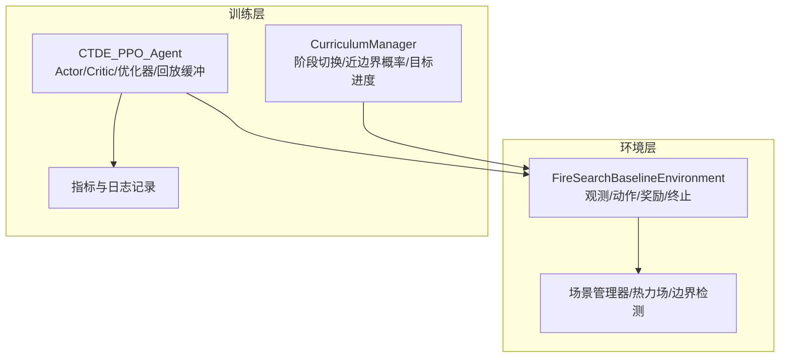
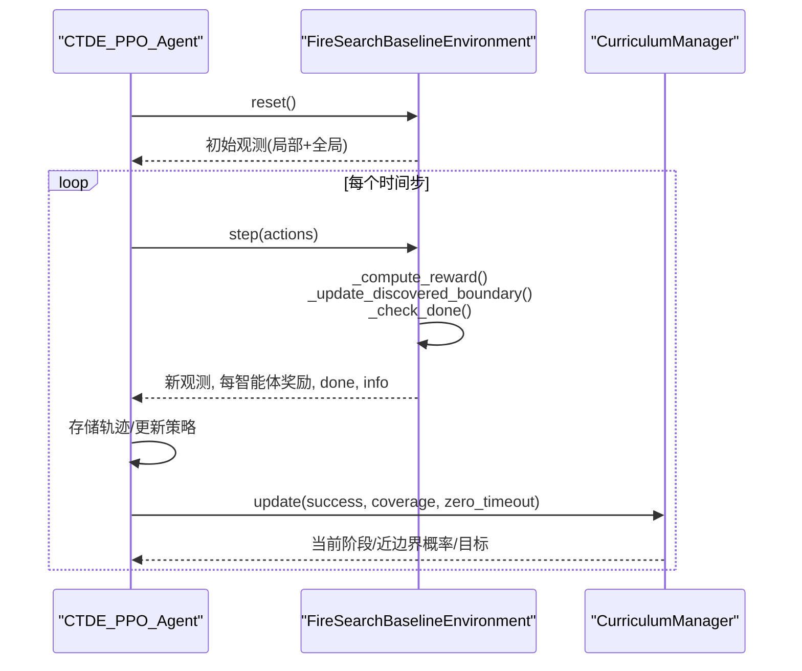
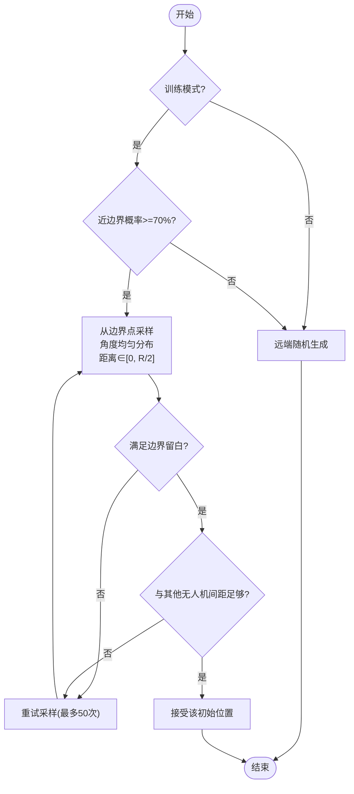
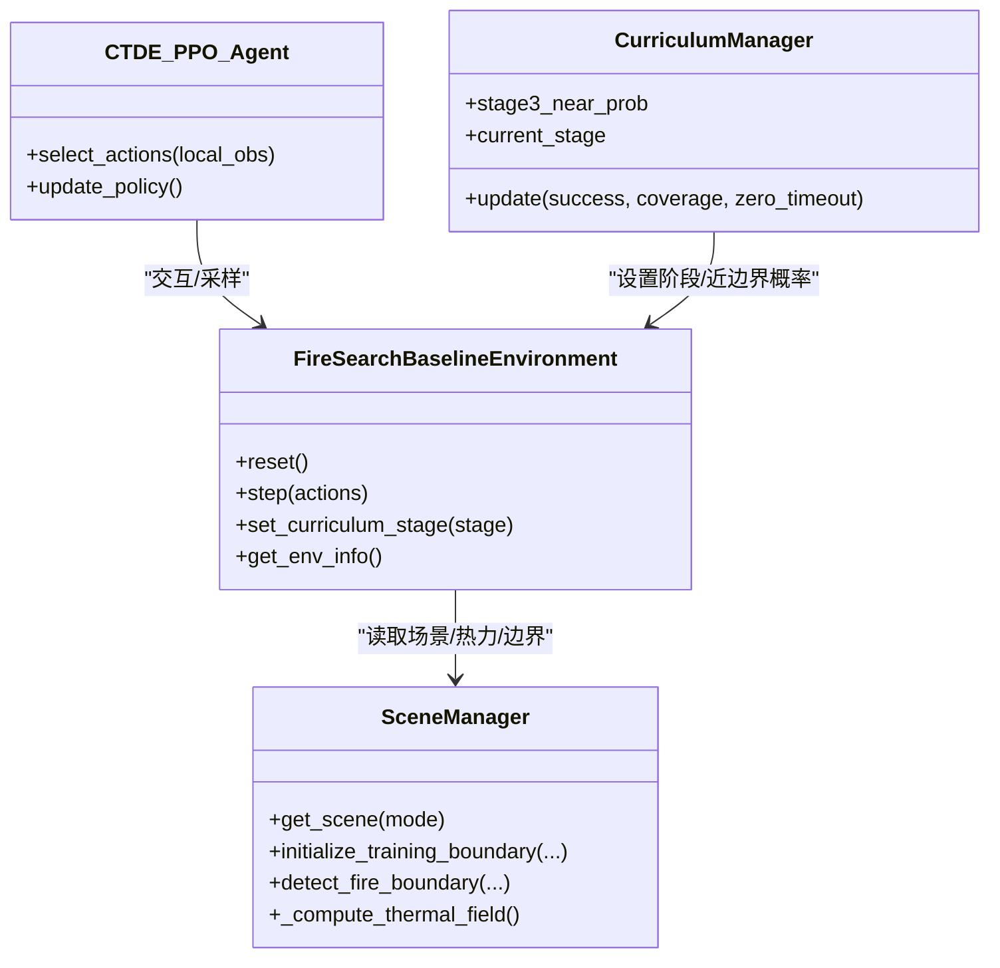

# 第一阶段：基础探索训练

<cite>
**本文引用的文件**   
- [rl_environment_baseline.py](file://environment_variables/environment_variables/rl_environment_baseline.py)
- [committed_train.py](file://committed_train.py)
</cite>

## 目录
1. [引言](#引言)
2. [项目结构](#项目结构)
3. [核心组件](#核心组件)
4. [架构总览](#架构总览)
5. [详细组件分析](#详细组件分析)
6. [依赖关系分析](#依赖关系分析)
7. [性能与稳定性考量](#性能与稳定性考量)
8. [故障排查指南](#故障排查指南)
9. [结论](#结论)
10. [附录：超参数调优与评估方法](#附录超参数调优与评估方法)

## 引言
本技术文档聚焦“第一阶段：基础探索训练”，围绕以下目标展开：
- 高探索奖励机制的设计原理，含阶段一探索奖励上限控制（stage1_explore_reward_cap=25.0）与累积奖励跟踪逻辑；
- 宽松约束策略的实现细节：近边界生成概率70%、距离范围0到视野半径的一半、重复惩罚机制；
- 快速收敛策略的数学基础：较高的边界发现奖励（5.0）、较低的步数惩罚（-0.02）、空闲动作惩罚（-0.10）；
- 热势增量引导搜索的工作原理：热势差值计算与奖励缩放因子；
- 第一阶段超参数调优指南与训练效果评估方法。

## 项目结构
本项目采用“环境实现 + 训练脚本”的清晰分层：
- 环境层：FireSearchBaselineEnvironment 提供多无人机火场边界搜索任务接口，包含观测、动作、奖励、终止条件等；
- 训练层：CTDE-PPO 基线训练脚本负责数据收集、网络更新、课程管理与指标统计。

图表来源
- [rl_environment_baseline.py:21-158](file://environment_variables/environment_variables/rl_environment_baseline.py#L21-L158)
- [committed_train.py:705-767](file://committed_train.py#L705-L767)

章节来源
- [rl_environment_baseline.py:21-158](file://environment_variables/environment_variables/rl_environment_baseline.py#L21-L158)
- [committed_train.py:705-767](file://committed_train.py#L705-L767)

## 核心组件
- FireSearchBaselineEnvironment：定义离散动作空间（前进/后退/左/右/空闲），构造局部观测与全局状态，计算每步奖励并判定终止条件；
- CTDE_PPO_Agent：维护 Actor/Critic 网络、优化器、KL自适应学习率、PPO 更新流程；
- CurriculumManager：管理三阶段课程，动态调整近边界生成概率与阶段目标覆盖率。

章节来源
- [rl_environment_baseline.py:21-158](file://environment_variables/environment_variables/rl_environment_baseline.py#L21-L158)
- [committed_train.py:705-767](file://committed_train.py#L705-L767)
- [committed_train.py:563-703](file://committed_train.py#L563-L703)

## 架构总览
下图展示第一阶段训练的关键调用链路与数据流：Agent 采样动作 → 环境执行 step → 计算奖励（含探索、边界发现、热势增量引导等）→ 返回观测与终止信号 → Agent 更新策略。

图表来源
- [rl_environment_baseline.py:842-992](file://environment_variables/environment_variables/rl_environment_baseline.py#L842-L992)
- [committed_train.py:795-800](file://committed_train.py#L795-L800)
- [committed_train.py:604-651](file://committed_train.py#L604-L651)

## 详细组件分析

### 高探索奖励机制与上限控制
- 设计动机：在尚未发现任何边界的早期阶段，鼓励智能体广泛探索未知区域，避免过早收敛于局部热点或原地打转。
- 关键实现要点：
  - 未访问单元格首次进入时给予小量探索奖励；
  - 阶段一内对探索奖励进行累计上限控制，防止探索奖励主导整体回报；
  - 使用 episode 级计数器追踪已发放的探索奖励总量，并在每步按剩余配额裁剪。
- 数学表达（概念性）：
  - 单步探索奖励 r_explore = min(ε, max(0, C - Σr_explore))，其中 ε 为单步探索奖励基数，C 为阶段一探索奖励上限，Σr_explore 为当前回合累计探索奖励。
- 代码位置参考：
  - 上限常量与累计变量初始化；
  - 每步根据是否首次访问与阶段一条件计算并裁剪探索奖励，同时更新累计值。

章节来源
- [rl_environment_baseline.py:92-147](file://environment_variables/environment_variables/rl_environment_baseline.py#L92-L147)
- [rl_environment_baseline.py:727-736](file://environment_variables/environment_variables/rl_environment_baseline.py#L727-L736)

### 宽松约束策略：近边界生成概率与距离范围
- 近边界生成概率：
  - 阶段一训练模式下，以70%的概率在近边界区域生成智能体初始位置，有助于快速接触火场边缘信息；
  - 非训练模式或后续阶段会调整该概率。
- 距离范围：
  - 阶段一：从边界点出发，沿随机角度偏移，距离范围控制在 0 到视野半径的一半之间，确保智能体处于“可感知边界”的近距离范围；
  - 阶段二/三逐步放宽距离范围，促进更远距离的探索与覆盖。
- 重复惩罚机制：
  - 当尚未发现边界且智能体在最近若干步中反复访问相同单元时，施加小幅惩罚，抑制原地徘徊；
  - 窗口长度与惩罚强度由配置项控制。
- 代码位置参考：
  - 近边界生成概率选择；
  - 基于阶段一的距离范围与边界点采样；
  - 重复惩罚与窗口维护。

章节来源
- [rl_environment_baseline.py:373-415](file://environment_variables/environment_variables/rl_environment_baseline.py#L373-L415)
- [rl_environment_baseline.py:722-726](file://environment_variables/environment_variables/rl_environment_baseline.py#L722-L726)
- [rl_environment_baseline.py:913-916](file://environment_variables/environment_variables/rl_environment_baseline.py#L913-L916)

### 快速收敛策略的数学基础
- 边界发现奖励较高：
  - 阶段一首次发现边界点给予较大正奖励，强化“找到边界”这一关键里程碑；
  - 随阶段推进，该奖励逐步降低，促使智能体转向更高覆盖率目标。
- 步数惩罚较低：
  - 阶段一步数惩罚较小，允许智能体有足够步数进行探索与试错；
  - 后续阶段提高步数惩罚，加速收敛至目标覆盖率。
- 空闲动作惩罚：
  - 阶段一对空闲动作施加适度负奖励，避免长时间停留不动；
  - 后续阶段加大惩罚力度，进一步驱动移动效率。
- 数学视角：
  - 通过“高边际收益（发现边界）+低边际成本（步数惩罚）+适度负激励（空闲）”的组合，使期望回报梯度指向“尽快发现边界并持续移动”。

章节来源
- [rl_environment_baseline.py:707-720](file://environment_variables/environment_variables/rl_environment_baseline.py#L707-L720)
- [rl_environment_baseline.py:737-740](file://environment_variables/environment_variables/rl_environment_baseline.py#L737-L740)

### 热势增量引导搜索的工作原理
- 背景：在未发现边界前，利用热力场的局部变化作为弱引导信号，帮助智能体向潜在边界方向移动。
- 工作原理：
  - 计算当前位置与上一位置的“热势差值”ΔH = H(new) - H(old)，仅当 ΔH > 0 时给予正向奖励；
  - 奖励按线性缩放并设置上限，避免过度放大噪声导致的误导；
  - 该引导仅在“尚未发现边界”的阶段生效，一旦边界被确认，即停止热势引导。
- 数学表达（概念性）：
  - r_search = clip(k·ΔH, 0, R_max)，其中 k 为缩放系数，R_max 为单步最大搜索奖励。
- 代码位置参考：
  - 热势获取与差值计算；
  - 条件判断与奖励累加。

章节来源
- [rl_environment_baseline.py:756-766](file://environment_variables/environment_variables/rl_environment_baseline.py#L756-L766)

### 宽松约束策略流程图（阶段一）

图表来源
- [rl_environment_baseline.py:373-415](file://environment_variables/environment_variables/rl_environment_baseline.py#L373-L415)

## 依赖关系分析
- 环境与数据：
  - 环境依赖场景管理器加载地图、边界点、热力场与风场等信息；
  - 边界点与热力场在运行过程中周期性刷新，保证动态一致性。
- 训练与课程：
  - 训练脚本中的课程管理器根据成功率、覆盖率与零超时率等指标决定阶段切换与近边界概率调整；
  - 课程参数影响环境的 spawn 行为与目标阈值。

图表来源
- [rl_environment_baseline.py:159-207](file://environment_variables/environment_variables/rl_environment_baseline.py#L159-L207)
- [rl_environment_baseline.py:994-1018](file://environment_variables/environment_variables/rl_environment_baseline.py#L994-L1018)
- [committed_train.py:563-703](file://committed_train.py#L563-L703)
- [committed_train.py:705-767](file://committed_train.py#L705-L767)

章节来源
- [rl_environment_baseline.py:159-207](file://environment_variables/environment_variables/rl_environment_baseline.py#L159-L207)
- [rl_environment_baseline.py:994-1018](file://environment_variables/environment_variables/rl_environment_baseline.py#L994-L1018)
- [committed_train.py:563-703](file://committed_train.py#L563-L703)
- [committed_train.py:705-767](file://committed_train.py#L705-L767)

## 性能与稳定性考量
- 探索奖励上限：
  - 防止探索奖励过大导致策略偏向无目的游走；
  - 建议监控累计探索奖励曲线，若接近上限过快，可适当降低单步探索奖励或缩短窗口。
- 热势引导强度：
  - 缩放系数与上限需平衡，过强易受噪声干扰，过弱则引导不足；
  - 建议在验证集上扫描不同 k 与 R_max 组合。
- 重复惩罚与窗口：
  - 窗口过小可能导致误判，过大可能过度惩罚合理路径；
  - 结合平均步数与覆盖率指标进行微调。
- 课程切换阈值：
  - 阶段一的成功率与覆盖率阈值应兼顾稳定与效率；
  - 建议观察 KL 散度与裁剪比例，确保策略更新稳定。

## 故障排查指南
- 现象：阶段一长期无法发现边界
  - 检查近边界生成概率是否为70%，距离范围是否在[0, R/2]；
  - 查看重复惩罚是否过大导致智能体不敢停留；
  - 确认热势引导是否开启且缩放合理。
- 现象：探索奖励过快达到上限
  - 检查累计探索奖励计数是否正确更新；
  - 适当降低单步探索奖励或增大上限。
- 现象：策略不稳定或发散
  - 关注 KL 散度与裁剪比例，必要时降低学习率或增加 PPO epoch；
  - 检查步数惩罚与空闲惩罚是否过强。

章节来源
- [rl_environment_baseline.py:373-415](file://environment_variables/environment_variables/rl_environment_baseline.py#L373-L415)
- [rl_environment_baseline.py:727-736](file://environment_variables/environment_variables/rl_environment_baseline.py#L727-L736)
- [rl_environment_baseline.py:756-766](file://environment_variables/environment_variables/rl_environment_baseline.py#L756-L766)
- [committed_train.py:782-793](file://committed_train.py#L782-L793)

## 结论
第一阶段的基础探索训练通过“高探索奖励+宽松约束+快速收敛+热势引导”的组合策略，有效推动智能体在早期快速定位火场边界并建立稳定的移动模式。合理的上限控制与课程管理确保了训练的稳定性与可扩展性，为后续阶段的覆盖率提升打下坚实基础。

## 附录：超参数调优与评估方法

### 第一阶段关键超参数
- 探索奖励上限 stage1_explore_reward_cap：
  - 默认值 25.0；用于限制单回合探索奖励总量；
  - 调优建议：若覆盖率增长缓慢但探索频繁，可适度提高上限；若策略趋于漫游，可降低上限。
- 近边界生成概率（阶段一）：
  - 固定为 70%；若初期难以触达边界，可尝试临时提高；
- 距离范围（阶段一）：
  - 0 到视野半径的一半；若边界较密集，可缩小范围以提升命中率；
- 重复惩罚与窗口：
  - 窗口长度与惩罚强度需配合场景尺度；建议从小窗口与小惩罚起步；
- 边界发现奖励（阶段一）：
  - 默认 5.0；若发现边界后策略停滞，可适当降低；
- 步数惩罚（阶段一）：
  - 默认 -0.02；若收敛过慢，可略微提高绝对值；
- 空闲动作惩罚（阶段一）：
  - 默认 -0.10；若智能体频繁停留，可提高惩罚；
- 热势引导缩放因子与上限：
  - 建议以 0.5 为上限，k 在 1.0~2.0 间扫描。

章节来源
- [rl_environment_baseline.py:92-147](file://environment_variables/environment_variables/rl_environment_baseline.py#L92-L147)
- [rl_environment_baseline.py:707-720](file://environment_variables/environment_variables/rl_environment_baseline.py#L707-L720)
- [rl_environment_baseline.py:727-736](file://environment_variables/environment_variables/rl_environment_baseline.py#L727-L736)
- [rl_environment_baseline.py:756-766](file://environment_variables/environment_variables/rl_environment_baseline.py#L756-L766)

### 训练效果评估方法
- 过程指标：
  - 任务得分、覆盖率、成功率、平均步数、超时率、零覆盖超时率；
  - KL 散度均值与标准差、裁剪比例均值与标准差、Actor 学习率区间；
- 收敛效率：
  - 到达质量阈值的步数/更新次数；
  - 尾部分数与奖励的标准差，衡量稳定性；
- 课程进展：
  - 阶段一的成功率与覆盖率趋势；
  - 近边界概率与阶段目标的动态调整情况。

章节来源
- [committed_train.py:289-300](file://committed_train.py#L289-L300)
- [committed_train.py:352-427](file://committed_train.py#L352-L427)
- [committed_train.py:691-703](file://committed_train.py#L691-L703)