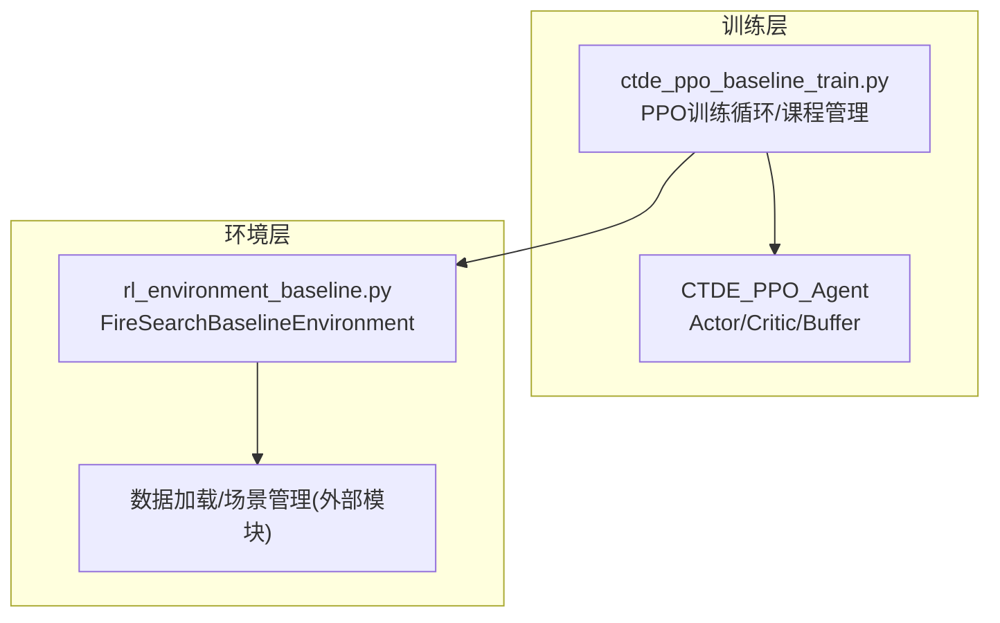
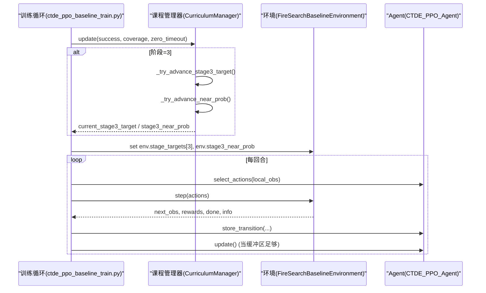
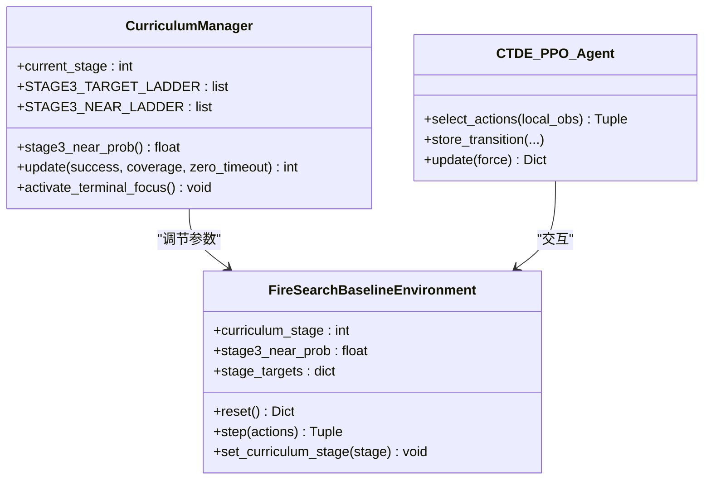
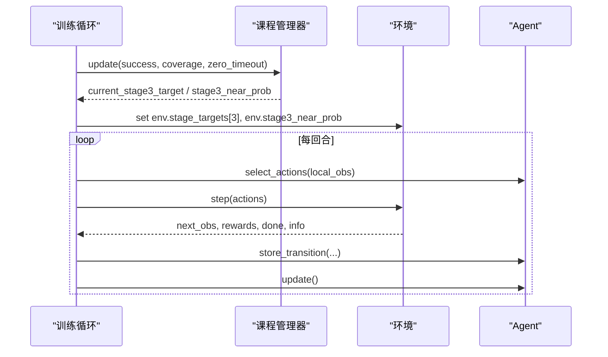
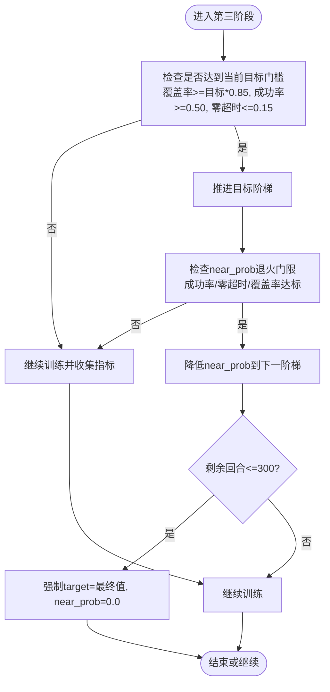
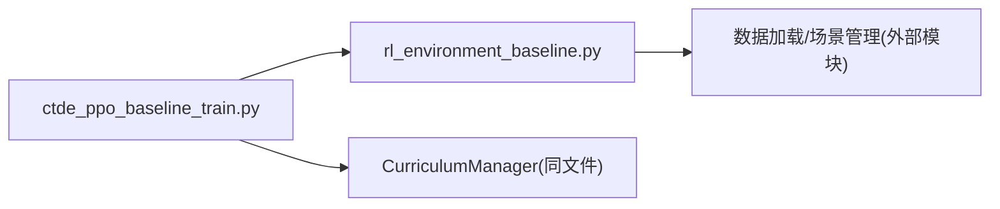

# 第三阶段：精确搜索训练

<cite>
**本文引用的文件**   
- [ctde_ppo_baseline_train.py](file://environment_variables/environment_variables/ctde_ppo_baseline_train.py)
- [rl_environment_baseline.py](file://environment_variables/environment_variables/rl_environment_baseline.py)
</cite>

## 目录
1. [引言](#引言)
2. [项目结构](#项目结构)
3. [核心组件](#核心组件)
4. [架构总览](#架构总览)
5. [详细组件分析](#详细组件分析)
6. [依赖关系分析](#依赖关系分析)
7. [性能与稳定性考量](#性能与稳定性考量)
8. [故障排查指南](#故障排查指南)
9. [结论](#结论)
10. [附录：高级调参与泛化验证](#附录高级调参与泛化验证)

## 引言
本技术文档聚焦于“第三阶段：精确搜索训练”的设计与实现，围绕以下目标展开：
- 解释近边界生成概率配置 stage3_near_prob=0.25 对训练行为的影响，包括随机性与确定性搜索的平衡。
- 深入分析严格约束机制的实现：距离范围扩大到 1~2.5 倍视野半径、更严格的无人机间距要求、更高的任务完成标准（stage3_target=0.60）。
- 阐述泛化能力提升策略：更广泛的初始位置分布、更强的探索压力、更接近真实场景的挑战设置。
- 对比第二阶段差异：奖励权重调整、惩罚力度增强、收敛标准提高。
- 提供第三阶段的高级调参技巧与泛化性能验证方法。

## 项目结构
本项目采用“环境 + 训练器”的双模块设计：
- 环境层：FireSearchBaselineEnvironment 负责多无人机火场边界搜索仿真、观测/全局状态构建、奖励计算、课程难度控制等。
- 训练层：CTDE-PPO 基线训练脚本负责 PPO 更新、课程管理器调度、日志记录、评估与可视化。

图表来源
- [ctde_ppo_baseline_train.py:1-120](file://environment_variables/environment_variables/ctde_ppo_baseline_train.py#L1-L120)
- [rl_environment_baseline.py:1-60](file://environment_variables/environment_variables/rl_environment_baseline.py#L1-L60)

章节来源
- [ctde_ppo_baseline_train.py:1-120](file://environment_variables/environment_variables/ctde_ppo_baseline_train.py#L1-L120)
- [rl_environment_baseline.py:1-60](file://environment_variables/environment_variables/rl_environment_baseline.py#L1-L60)

## 核心组件
- 课程管理器 CurriculumManager：维护阶段切换、目标阶梯、near_prob 退火、终端专注模式等。
- 环境 FireSearchBaselineEnvironment：实现近边界/远端生成、视野半径约束、无人机间距惩罚、超时惩罚、覆盖率与任务得分计算。
- CTDE-PPO 训练器：PPO 更新、KL自适应学习率、指标统计与保存。

章节来源
- [ctde_ppo_baseline_train.py:569-757](file://environment_variables/environment_variables/ctde_ppo_baseline_train.py#L569-L757)
- [rl_environment_baseline.py:21-120](file://environment_variables/environment_variables/rl_environment_baseline.py#L21-L120)
- [ctde_ppo_baseline_train.py:759-991](file://environment_variables/environment_variables/ctde_ppo_baseline_train.py#L759-L991)

## 架构总览
第三阶段的训练流程由课程管理器驱动，动态调节环境参数（如 near_prob、target），并在满足能力门槛时推进难度。

图表来源
- [ctde_ppo_baseline_train.py:1469-1600](file://environment_variables/environment_variables/ctde_ppo_baseline_train.py#L1469-L1600)
- [ctde_ppo_baseline_train.py:684-738](file://environment_variables/environment_variables/ctde_ppo_baseline_train.py#L684-L738)
- [rl_environment_baseline.py:362-436](file://environment_variables/environment_variables/rl_environment_baseline.py#L362-L436)

## 详细组件分析

### 近边界生成概率 stage3_near_prob=0.25 的作用与影响
- 作用机制
  - 在训练模式下，第三阶段以概率 stage3_near_prob 选择“近边界生成”，否则从远离火源的区域生成。该概率随课程退火逐步降低，最终趋于 0，促使智能体学会从更远位置进行精确搜索。
  - 近边界生成的采样范围在第三阶段被放宽到 1~2.5 倍视野半径，配合更严格的间距约束，迫使智能体在更大范围内进行精准定位与覆盖。
- 随机性与确定性的平衡
  - 较高的 near_prob 引入更多“靠近边界”的样本，有利于快速建立基础搜索策略；随着训练推进，near_prob 退火至更低值，增加“远距离搜索”的探索压力，提升鲁棒性。
  - 课程管理器将 near_prob 退火与目标进度绑定，确保不会超前于 target 的提升，避免过早失去探索信号。
- 关键实现路径
  - 默认初始值与归一化：[ctde_ppo_baseline_train.py:135-136](file://environment_variables/environment_variables/ctde_ppo_baseline_train.py#L135-L136)、[ctde_ppo_baseline_train.py:247-248](file://environment_variables/environment_variables/ctde_ppo_baseline_train.py#L247-L248)
  - 近边界/远端生成逻辑与距离范围：[rl_environment_baseline.py:362-436](file://environment_variables/environment_variables/rl_environment_baseline.py#L362-L436)
  - 课程退火与门控条件：[ctde_ppo_baseline_train.py:573-581](file://environment_variables/environment_variables/ctde_ppo_baseline_train.py#L573-L581)、[ctde_ppo_baseline_train.py:711-738](file://environment_variables/environment_variables/ctde_ppo_baseline_train.py#L711-L738)

章节来源
- [ctde_ppo_baseline_train.py:135-136](file://environment_variables/environment_variables/ctde_ppo_baseline_train.py#L135-L136)
- [ctde_ppo_baseline_train.py:247-248](file://environment_variables/environment_variables/ctde_ppo_baseline_train.py#L247-L248)
- [ctde_ppo_baseline_train.py:573-581](file://environment_variables/environment_variables/ctde_ppo_baseline_train.py#L573-L581)
- [ctde_ppo_baseline_train.py:711-738](file://environment_variables/environment_variables/ctde_ppo_baseline_train.py#L711-L738)
- [rl_environment_baseline.py:362-436](file://environment_variables/environment_variables/rl_environment_baseline.py#L362-L436)

### 严格约束机制的实现细节
- 距离范围扩大
  - 第三阶段近边界生成最小距离为 1×视野半径，最大距离为 2.5×视野半径，相比前两个阶段显著扩大搜索空间，强化远距离定位能力。
  - 参考实现：[rl_environment_baseline.py:386-394](file://environment_variables/environment_variables/rl_environment_baseline.py#L386-L394)
- 无人机间距要求更严格
  - 通过最小间距阈值 vision_radius*0.8 进行惩罚，避免多机聚集导致重复覆盖与效率下降。
  - 参考实现：[rl_environment_baseline.py:417-419](file://environment_variables/environment_variables/rl_environment_baseline.py#L417-L419)、[rl_environment_baseline.py:746-754](file://environment_variables/environment_variables/rl_environment_baseline.py#L746-L754)
- 更高任务完成标准
  - 第三阶段目标阶梯包含 0.20→0.35→0.50→0.60，且需同时满足覆盖率、成功率与零覆盖超时率的门限，才允许推进。
  - 参考实现：[ctde_ppo_baseline_train.py:604](file://environment_variables/environment_variables/ctde_ppo_baseline_train.py#L604)、[ctde_ppo_baseline_train.py:684-709](file://environment_variables/environment_variables/ctde_ppo_baseline_train.py#L684-L709)

章节来源
- [rl_environment_baseline.py:386-394](file://environment_variables/environment_variables/rl_environment_baseline.py#L386-L394)
- [rl_environment_baseline.py:417-419](file://environment_variables/environment_variables/rl_environment_baseline.py#L417-L419)
- [rl_environment_baseline.py:746-754](file://environment_variables/environment_variables/rl_environment_baseline.py#L746-L754)
- [ctde_ppo_baseline_train.py:604](file://environment_variables/environment_variables/ctde_ppo_baseline_train.py#L604)
- [ctde_ppo_baseline_train.py:684-709](file://environment_variables/environment_variables/ctde_ppo_baseline_train.py#L684-L709)

### 泛化能力提升策略
- 更广泛的初始位置分布
  - 课程管理器支持初始面积百分比的阶梯式提升，使智能体在不同起始条件下都能稳定执行任务。
  - 参考实现：[ctde_ppo_baseline_train.py:570-603](file://environment_variables/environment_variables/ctde_ppo_baseline_train.py#L570-L603)
- 更强的探索压力
  - 第三阶段增大步数惩罚与空闲惩罚，抑制原地停留与无效移动，鼓励持续探索。
  - 参考实现：[rl_environment_baseline.py:718-740](file://environment_variables/environment_variables/rl_environment_baseline.py#L718-L740)
- 接近真实场景的挑战设置
  - 使用不同观察/奖励配置（baseline/static_terrain/dynamic_front/risk_aware）与多种 reward_profile，增强模型对复杂环境的适应性。
  - 参考实现：[rl_environment_baseline.py:24-35](file://environment_variables/environment_variables/rl_environment_baseline.py#L24-L35)

章节来源
- [ctde_ppo_baseline_train.py:570-603](file://environment_variables/environment_variables/ctde_ppo_baseline_train.py#L570-L603)
- [rl_environment_baseline.py:718-740](file://environment_variables/environment_variables/rl_environment_baseline.py#L718-L740)
- [rl_environment_baseline.py:24-35](file://environment_variables/environment_variables/rl_environment_baseline.py#L24-L35)

### 与第二阶段的差异对比
- 奖励权重调整
  - 发现边界奖励在第三阶段降低（相对第二阶段），强调长期覆盖与效率而非短期发现。
  - 参考实现：[rl_environment_baseline.py:708-716](file://environment_variables/environment_variables/rl_environment_baseline.py#L708-L716)
- 惩罚力度增强
  - 步数惩罚与空闲惩罚在第三阶段更强，减少低效行为。
  - 参考实现：[rl_environment_baseline.py:718-740](file://environment_variables/environment_variables/rl_environment_baseline.py#L718-L740)
- 收敛标准提高
  - 第三阶段目标阶梯更高，且需要同时满足覆盖率、成功率与零覆盖超时率门限，确保稳健收敛。
  - 参考实现：[ctde_ppo_baseline_train.py:684-709](file://environment_variables/environment_variables/ctde_ppo_baseline_train.py#L684-L709)

章节来源
- [rl_environment_baseline.py:708-716](file://environment_variables/environment_variables/rl_environment_baseline.py#L708-L716)
- [rl_environment_baseline.py:718-740](file://environment_variables/environment_variables/rl_environment_baseline.py#L718-L740)
- [ctde_ppo_baseline_train.py:684-709](file://environment_variables/environment_variables/ctde_ppo_baseline_train.py#L684-L709)

### 类图：课程管理与环境交互

图表来源
- [ctde_ppo_baseline_train.py:569-757](file://environment_variables/environment_variables/ctde_ppo_baseline_train.py#L569-L757)
- [rl_environment_baseline.py:21-120](file://environment_variables/environment_variables/rl_environment_baseline.py#L21-L120)
- [ctde_ppo_baseline_train.py:759-991](file://environment_variables/environment_variables/ctde_ppo_baseline_train.py#L759-L991)

### 序列图：第三阶段训练主循环

图表来源
- [ctde_ppo_baseline_train.py:1469-1600](file://environment_variables/environment_variables/ctde_ppo_baseline_train.py#L1469-L1600)
- [ctde_ppo_baseline_train.py:684-738](file://environment_variables/environment_variables/ctde_ppo_baseline_train.py#L684-L738)
- [rl_environment_baseline.py:362-436](file://environment_variables/environment_variables/rl_environment_baseline.py#L362-L436)

### 流程图：near_prob 退火与目标推进

图表来源
- [ctde_ppo_baseline_train.py:684-738](file://environment_variables/environment_variables/ctde_ppo_baseline_train.py#L684-L738)
- [ctde_ppo_baseline_train.py:753-757](file://environment_variables/environment_variables/ctde_ppo_baseline_train.py#L753-L757)

## 依赖关系分析
- 训练脚本与环境模块解耦清晰：训练脚本仅通过接口调用环境 reset/step/set_curriculum_stage 等方法，便于替换环境与奖励配置。
- 课程管理器集中控制难度曲线，避免硬编码在环境中，提升可维护性与可扩展性。
- 潜在耦合点：训练循环中频繁同步 env.stage3_near_prob 与 env.stage_targets[3]，需注意一致性与时序问题。

图表来源
- [ctde_ppo_baseline_train.py:1469-1600](file://environment_variables/environment_variables/ctde_ppo_baseline_train.py#L1469-L1600)
- [rl_environment_baseline.py:159-207](file://environment_variables/environment_variables/rl_environment_baseline.py#L159-L207)

章节来源
- [ctde_ppo_baseline_train.py:1469-1600](file://environment_variables/environment_variables/ctde_ppo_baseline_train.py#L1469-L1600)
- [rl_environment_baseline.py:159-207](file://environment_variables/environment_variables/rl_environment_baseline.py#L159-L207)

## 性能与稳定性考量
- KL自适应学习率：根据近似KL误差动态调整actor学习率，有助于稳定训练与避免策略崩溃。
- 梯度裁剪与批量大小：max_grad_norm与mini_batch_size保障更新稳定性。
- 终端专注模式：最后若干回合强制使用最终目标与near_prob=0，确保模型在严苛条件下收敛。

章节来源
- [ctde_ppo_baseline_train.py:828-847](file://environment_variables/environment_variables/ctde_ppo_baseline_train.py#L828-L847)
- [ctde_ppo_baseline_train.py:889-991](file://environment_variables/environment_variables/ctde_ppo_baseline_train.py#L889-L991)
- [ctde_ppo_baseline_train.py:753-757](file://environment_variables/environment_variables/ctde_ppo_baseline_train.py#L753-L757)

## 故障排查指南
- 常见问题
  - near_prob未变化：检查课程管理器是否处于第三阶段且满足退进门限。
  - 目标不推进：确认覆盖率、成功率与零超时率是否同时达标。
  - 训练不稳定：关注KL与clip_fraction，必要时调整KL自适应参数或batch大小。
- 诊断要点
  - 查看训练日志中的“[curriculum] env.stage3_near_prob -> ...”与“[stage3 curriculum] target ...”输出，确认课程推进。
  - 监控平均覆盖率、成功率与零超时率趋势，判断是否需要调整门限或目标阶梯。

章节来源
- [ctde_ppo_baseline_train.py:1580-1583](file://environment_variables/environment_variables/ctde_ppo_baseline_train.py#L1580-L1583)
- [ctde_ppo_baseline_train.py:684-709](file://environment_variables/environment_variables/ctde_ppo_baseline_train.py#L684-L709)

## 结论
第三阶段通过扩大近边界生成距离范围、加强无人机间距约束、提高任务完成标准以及渐进式降低 near_prob，有效提升了智能体的精确搜索能力与泛化性能。课程管理器与环境的解耦设计使得难度曲线可控、可调试，终端专注模式进一步保障了最终收敛质量。

## 附录：高级调参与泛化验证
- 高级调参技巧
  - 调整 STAGE3_TARGET_LADDER 与 STAGE3_NEAR_GATES，匹配具体场景的难度与资源限制。
  - 微调 near_prob 退火速率（STAGE3_NEAR_MIN_EPS）与门限（success_rate、zero_timeout_rate、coverage），平衡探索与利用。
  - 在终端专注阶段启用 final target 与 near_prob=0，加速最终收敛。
- 泛化性能验证方法
  - 在 generalization/stress 划分上进行多场景评估，统计任务得分、覆盖率、成功率与平均步数。
  - 对比不同 observation/reward profile 下的表现，确保模型对复杂环境的鲁棒性。
  - 使用滚动窗口与尾部统计评估稳定性，结合 KL 与 clip_fraction 监控训练健康度。

章节来源
- [ctde_ppo_baseline_train.py:573-581](file://environment_variables/environment_variables/ctde_ppo_baseline_train.py#L573-L581)
- [ctde_ppo_baseline_train.py:753-757](file://environment_variables/environment_variables/ctde_ppo_baseline_train.py#L753-L757)
- [rl_environment_baseline.py:24-35](file://environment_variables/environment_variables/rl_environment_baseline.py#L24-L35)