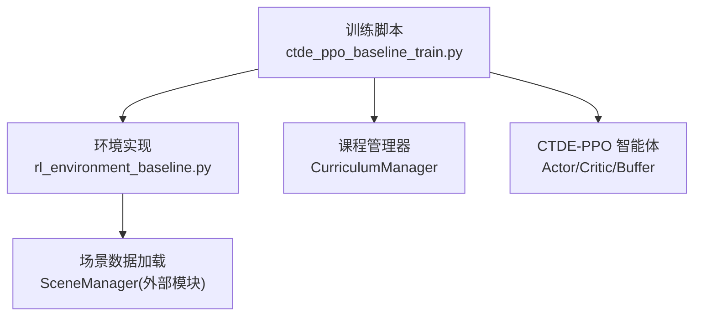
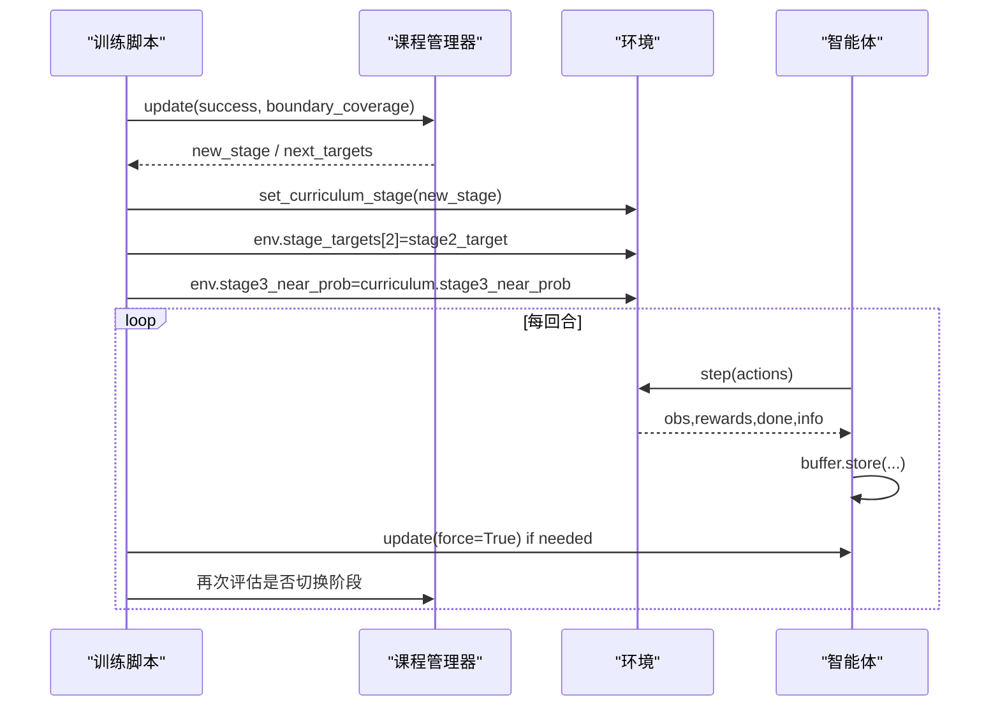
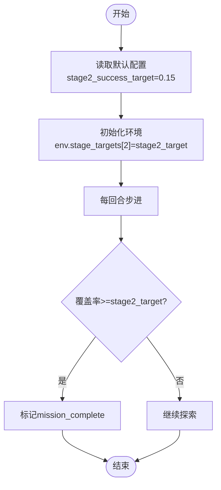
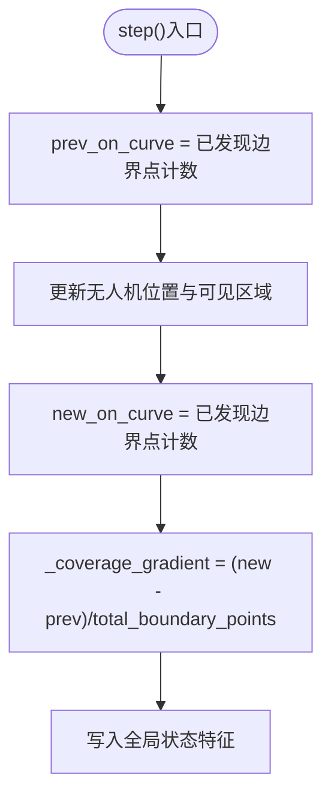
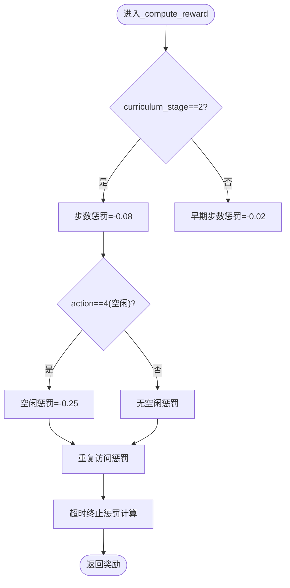
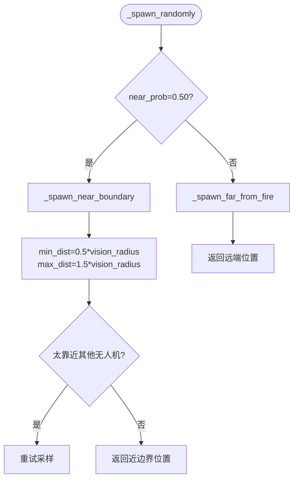
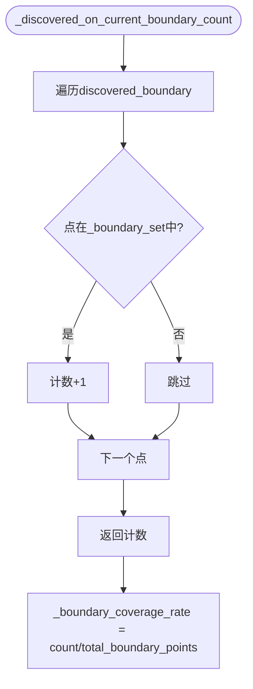
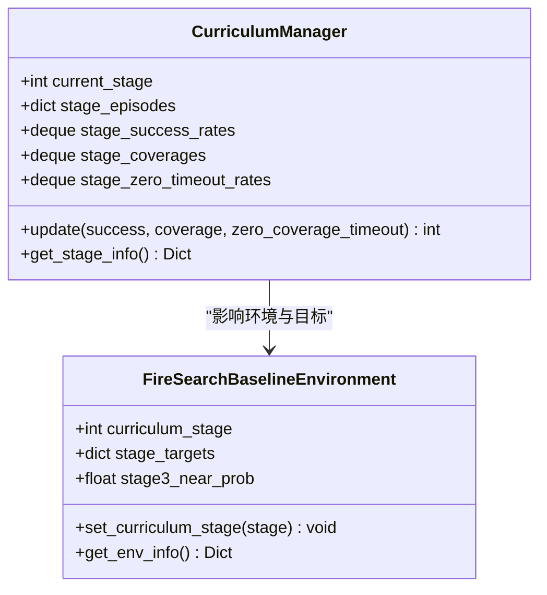
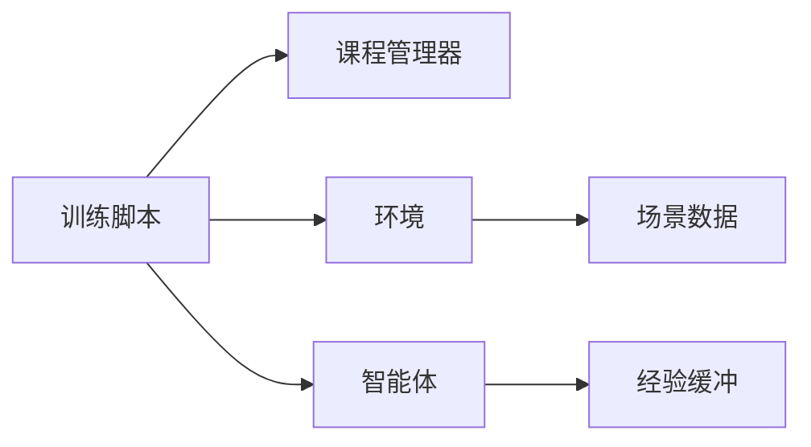

# 第二阶段：边界发现训练

<cite>
**本文引用的文件**   
- [ctde_ppo_baseline_train.py](file://environment_variables/environment_variables/ctde_ppo_baseline_train.py)
- [rl_environment_baseline.py](file://environment_variables/environment_variables/rl_environment_baseline.py)
</cite>

## 目录
1. [引言](#引言)
2. [项目结构](#项目结构)
3. [核心组件](#核心组件)
4. [架构总览](#架构总览)
5. [详细组件分析](#详细组件分析)
6. [依赖关系分析](#依赖关系分析)
7. [性能与监控指标](#性能与监控指标)
8. [故障排查指南](#故障排查指南)
9. [结论](#结论)

## 引言
本技术文档聚焦“第二阶段边界发现训练”的关键机制，围绕以下目标展开：
- 目标覆盖率设定机制：解释 stage2_target=0.15 的阈值来源、阶段切换条件与覆盖率梯度跟踪。
- 惩罚机制调整策略：说明步数惩罚提升至 -0.08、空闲动作惩罚提升至 -0.25，以及超时终止惩罚的计算方式。
- 难度过渡策略：阐述近边界生成概率降至 50%、距离范围扩展至 0.5~1.5 倍视野半径、无人机间距约束等实现细节。
- 边界覆盖率精确计算：明确已发现边界点计数与总边界点归一化的方法。
- 第二阶段训练监控指标与评估标准：给出关键日志字段与质量评估要点。

## 项目结构
本项目采用“训练脚本 + 环境实现”的双模块组织方式：
- 训练脚本负责课程管理、PPO 更新、日志记录与模型评估。
- 环境实现封装多无人机火场边界搜索任务的状态转移、奖励计算、观测输出与阶段控制。

图表来源
- [ctde_ppo_baseline_train.py:1-120](file://environment_variables/environment_variables/ctde_ppo_baseline_train.py#L1-L120)
- [rl_environment_baseline.py:1-120](file://environment_variables/environment_variables/rl_environment_baseline.py#L1-L120)

章节来源
- [ctde_ppo_baseline_train.py:1-120](file://environment_variables/environment_variables/ctde_ppo_baseline_train.py#L1-L120)
- [rl_environment_baseline.py:1-120](file://environment_variables/environment_variables/rl_environment_baseline.py#L1-L120)

## 核心组件
- 课程管理器（CurriculumManager）：维护阶段切换、目标覆盖率阶梯、近边界生成概率退火与能力门槛。
- 环境（FireSearchBaselineEnvironment）：提供状态空间、动作空间、奖励函数、覆盖率计算、阶段目标判定与难度参数。
- 智能体（CTDE_PPO_Agent）：基于 Actor-Critic 的多智能体策略网络与经验回放缓冲。
- 训练循环：按回合推进、统计指标、触发课程更新与模型更新。

章节来源
- [ctde_ppo_baseline_train.py:569-752](file://environment_variables/environment_variables/ctde_ppo_baseline_train.py#L569-L752)
- [rl_environment_baseline.py:21-120](file://environment_variables/environment_variables/rl_environment_baseline.py#L21-L120)
- [ctde_ppo_baseline_train.py:759-800](file://environment_variables/environment_variables/ctde_ppo_baseline_train.py#L759-L800)

## 架构总览
下图展示第二阶段训练的核心流程：训练循环驱动环境步进，环境根据当前阶段和目标覆盖率判定成功或超时；课程管理器依据成功率与覆盖率动态提升难度；训练脚本在必要时强制更新策略并同步环境参数。

图表来源
- [ctde_ppo_baseline_train.py:1350-1409](file://environment_variables/environment_variables/ctde_ppo_baseline_train.py#L1350-L1409)
- [rl_environment_baseline.py:842-992](file://environment_variables/environment_variables/rl_environment_baseline.py#L842-L992)

## 详细组件分析

### 目标覆盖率设定机制（stage2_target=0.15）
- 默认配置来源：训练脚本默认配置中设置 stage2_success_target=0.15，该值作为第二阶段的目标覆盖率阈值。
- 环境接收与使用：环境初始化时通过 stage2_target 参数写入 stage_targets[2]；在阶段判定逻辑中，当覆盖率达到该阈值即视为任务完成。
- 课程管理器联动：训练脚本在阶段切换时将 env.stage_targets[2] 设置为 curriculum 提供的目标值；若未显式覆盖，则沿用默认 0.15。

图表来源
- [ctde_ppo_baseline_train.py:98-158](file://environment_variables/environment_variables/ctde_ppo_baseline_train.py#L98-L158)
- [rl_environment_baseline.py:49-87](file://environment_variables/environment_variables/rl_environment_baseline.py#L49-L87)
- [rl_environment_baseline.py:824-840](file://environment_variables/environment_variables/rl_environment_baseline.py#L824-L840)

章节来源
- [ctde_ppo_baseline_train.py:98-158](file://environment_variables/environment_variables/ctde_ppo_baseline_train.py#L98-L158)
- [rl_environment_baseline.py:49-87](file://environment_variables/environment_variables/rl_environment_baseline.py#L49-L87)
- [rl_environment_baseline.py:824-840](file://environment_variables/environment_variables/rl_environment_baseline.py#L824-L840)

### 覆盖率梯度跟踪
- 梯度定义：每步结束后，环境计算新发现的边界点数与总边界点的差值，再除以总边界点数量得到覆盖率梯度。
- 用途：作为全局状态的一部分提供给智能体，帮助其感知近期进展趋势。

图表来源
- [rl_environment_baseline.py:923-926](file://environment_variables/environment_variables/rl_environment_baseline.py#L923-L926)
- [rl_environment_baseline.py:633-653](file://environment_variables/environment_variables/rl_environment_baseline.py#L633-L653)

章节来源
- [rl_environment_baseline.py:923-926](file://environment_variables/environment_variables/rl_environment_baseline.py#L923-L926)
- [rl_environment_baseline.py:633-653](file://environment_variables/environment_variables/rl_environment_baseline.py#L633-L653)

### 惩罚机制调整策略
- 步数惩罚：第二阶段将每步基础惩罚从 -0.02 提升至 -0.08，以鼓励更快达成目标。
- 空闲动作惩罚：第二阶段空闲动作（不动）惩罚从 -0.10 提升至 -0.25，抑制原地停留。
- 重复访问惩罚：对已访问单元进行轻微负奖励，避免无意义重复。
- 超时终止惩罚：当达到最大步数且未完成目标时，施加与覆盖率缺口相关的惩罚；若零覆盖率超时，额外增加固定惩罚。

图表来源
- [rl_environment_baseline.py:718-740](file://environment_variables/environment_variables/rl_environment_baseline.py#L718-L740)
- [rl_environment_baseline.py:800-806](file://environment_variables/environment_variables/rl_environment_baseline.py#L800-L806)
- [rl_environment_baseline.py:241-252](file://environment_variables/environment_variables/rl_environment_baseline.py#L241-L252)

章节来源
- [rl_environment_baseline.py:718-740](file://environment_variables/environment_variables/rl_environment_baseline.py#L718-L740)
- [rl_environment_baseline.py:800-806](file://environment_variables/environment_variables/rl_environment_baseline.py#L800-L806)
- [rl_environment_baseline.py:241-252](file://environment_variables/environment_variables/rl_environment_baseline.py#L241-L252)

### 难度过渡策略（第二阶段）
- 近边界生成概率：第二阶段将 near spawn 概率降低到 50%，迫使智能体在更远距离探索。
- 距离范围扩展：近边界生成的最小/最大距离分别设为 0.5 和 1.5 倍视野半径，扩大搜索空间。
- 无人机间距约束：近边界生成时检查与其他无人机的最小间距，防止扎堆。

图表来源
- [rl_environment_baseline.py:373-377](file://environment_variables/environment_variables/rl_environment_baseline.py#L373-L377)
- [rl_environment_baseline.py:379-415](file://environment_variables/environment_variables/rl_environment_baseline.py#L379-L415)
- [rl_environment_baseline.py:417-419](file://environment_variables/environment_variables/rl_environment_baseline.py#L417-L419)

章节来源
- [rl_environment_baseline.py:373-377](file://environment_variables/environment_variables/rl_environment_baseline.py#L373-L377)
- [rl_environment_baseline.py:379-415](file://environment_variables/environment_variables/rl_environment_baseline.py#L379-L415)
- [rl_environment_baseline.py:417-419](file://environment_variables/environment_variables/rl_environment_baseline.py#L417-L419)

### 边界覆盖率精确计算方法
- 已发现边界点计数：遍历 discovered_boundary 集合，统计其中属于当前边界点集 _boundary_set 的数量。
- 总边界点归一化：使用 total_boundary_points 作为分母，确保覆盖率在 [0,1] 区间内。
- 动态更新：每 20 步检测一次真实边界变化，更新 boundary_points 与 total_boundary_points，并刷新确认掩码。

图表来源
- [rl_environment_baseline.py:253-257](file://environment_variables/environment_variables/rl_environment_baseline.py#L253-L257)
- [rl_environment_baseline.py:927-941](file://environment_variables/environment_variables/rl_environment_baseline.py#L927-L941)

章节来源
- [rl_environment_baseline.py:253-257](file://environment_variables/environment_variables/rl_environment_baseline.py#L253-L257)
- [rl_environment_baseline.py:927-941](file://environment_variables/environment_variables/rl_environment_baseline.py#L927-L941)

### 课程管理与阶段切换（第二阶段）
- 阶段切换条件：综合成功率、覆盖率、零覆盖率超时率与最少回合数，满足能力门槛后自动推进到下一阶段。
- 第二阶段目标：使用 stage2_success_target 作为覆盖率阈值；同时记录本阶段成功率与覆盖率用于日志与可视化。
- 第三阶段准备：为后续难度提升预留 near_prob 退火与 target 阶梯。

图表来源
- [ctde_ppo_baseline_train.py:569-752](file://environment_variables/environment_variables/ctde_ppo_baseline_train.py#L569-L752)
- [rl_environment_baseline.py:994-1018](file://environment_variables/environment_variables/rl_environment_baseline.py#L994-L1018)

章节来源
- [ctde_ppo_baseline_train.py:569-752](file://environment_variables/environment_variables/ctde_ppo_baseline_train.py#L569-L752)
- [rl_environment_baseline.py:994-1018](file://environment_variables/environment_variables/rl_environment_baseline.py#L994-L1018)

## 依赖关系分析
- 训练脚本与环境：训练脚本通过环境变量接口设置阶段与目标，环境内部根据阶段执行不同奖励与难度策略。
- 课程管理器与训练循环：课程管理器在训练循环中被周期性调用，决定是否需要切换阶段与更新目标。
- 智能体与缓冲区：智能体收集轨迹并在满足批次大小时进行 PPO 更新。

图表来源
- [ctde_ppo_baseline_train.py:1350-1409](file://environment_variables/environment_variables/ctde_ppo_baseline_train.py#L1350-L1409)
- [rl_environment_baseline.py:842-992](file://environment_variables/environment_variables/rl_environment_baseline.py#L842-L992)

章节来源
- [ctde_ppo_baseline_train.py:1350-1409](file://environment_variables/environment_variables/ctde_ppo_baseline_train.py#L1350-L1409)
- [rl_environment_baseline.py:842-992](file://environment_variables/environment_variables/rl_environment_baseline.py#L842-L992)

## 性能与监控指标
- 关键日志字段：
  - 覆盖率（boundary_coverage）：反映已发现边界点占总边界点的比例。
  - 成功率（success）：是否达到阶段目标覆盖率。
  - 任务得分（task_score）：结合覆盖率、成功率与效率的综合评分。
  - 超时率（timeout_rate）与零覆盖超时率（zero_coverage_timeout_rate）：衡量失败情况。
  - KL 散度与 clip 分数：反映策略更新的稳定性。
- 质量评估：
  - 收敛效率：到达质量阈值的步数与更新次数。
  - 奖励稳定性：尾部区间的奖励与任务得分方差。
  - KL 稳定性：平均 KL、超调率与裁剪比例。

章节来源
- [ctde_ppo_baseline_train.py:295-306](file://environment_variables/environment_variables/ctde_ppo_baseline_train.py#L295-L306)
- [ctde_ppo_baseline_train.py:358-433](file://environment_variables/environment_variables/ctde_ppo_baseline_train.py#L358-L433)
- [rl_environment_baseline.py:966-992](file://environment_variables/environment_variables/rl_environment_baseline.py#L966-L992)

## 故障排查指南
- 覆盖率不增长：
  - 检查 near spawn 概率与距离范围是否合理，避免过近导致局部最优。
  - 确认总边界点是否正确更新，避免因边界检测频率过低导致分母不变。
- 超时惩罚过高：
  - 核对 stage2_target 是否被正确设置，避免阈值过高导致频繁超时。
  - 检查空闲惩罚与步数惩罚是否过大，导致策略过于保守。
- 阶段无法切换：
  - 查看成功率与覆盖率是否达到课程管理器的门槛，必要时调整最小回合数或阈值。

章节来源
- [rl_environment_baseline.py:373-419](file://environment_variables/environment_variables/rl_environment_baseline.py#L373-L419)
- [rl_environment_baseline.py:241-252](file://environment_variables/environment_variables/rl_environment_baseline.py#L241-L252)
- [ctde_ppo_baseline_train.py:569-752](file://environment_variables/environment_variables/ctde_ppo_baseline_train.py#L569-L752)

## 结论
第二阶段边界发现训练通过明确的覆盖率目标（stage2_target=0.15）、严格的惩罚机制与渐进的难度过渡，促使智能体在更大范围内高效探索并快速达成目标。覆盖率梯度的引入增强了策略对近期进展的感知能力，而课程管理器确保了训练过程的自适应性与鲁棒性。配合完善的监控指标与质量评估体系，可有效指导训练迭代与问题定位。