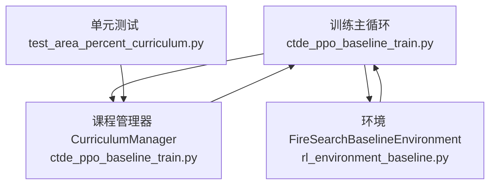
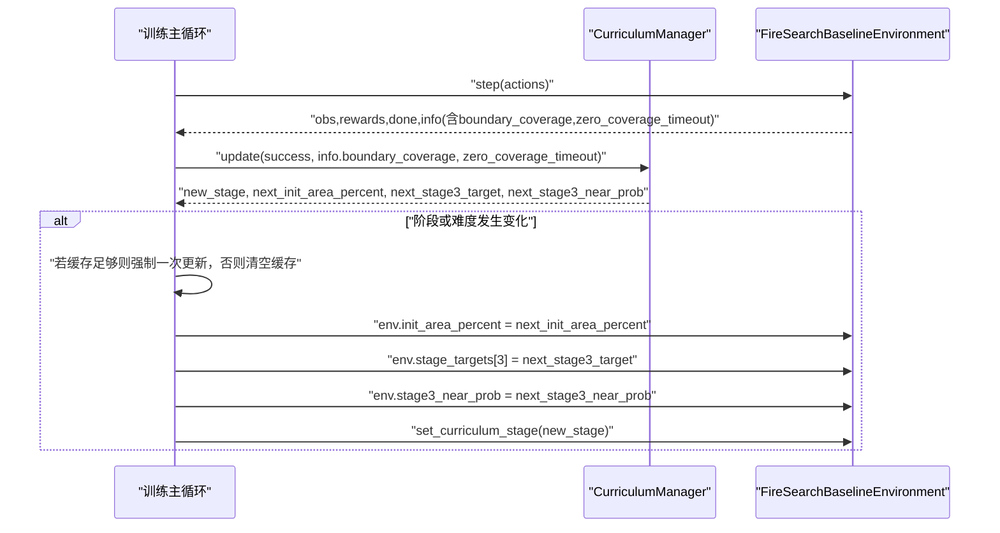
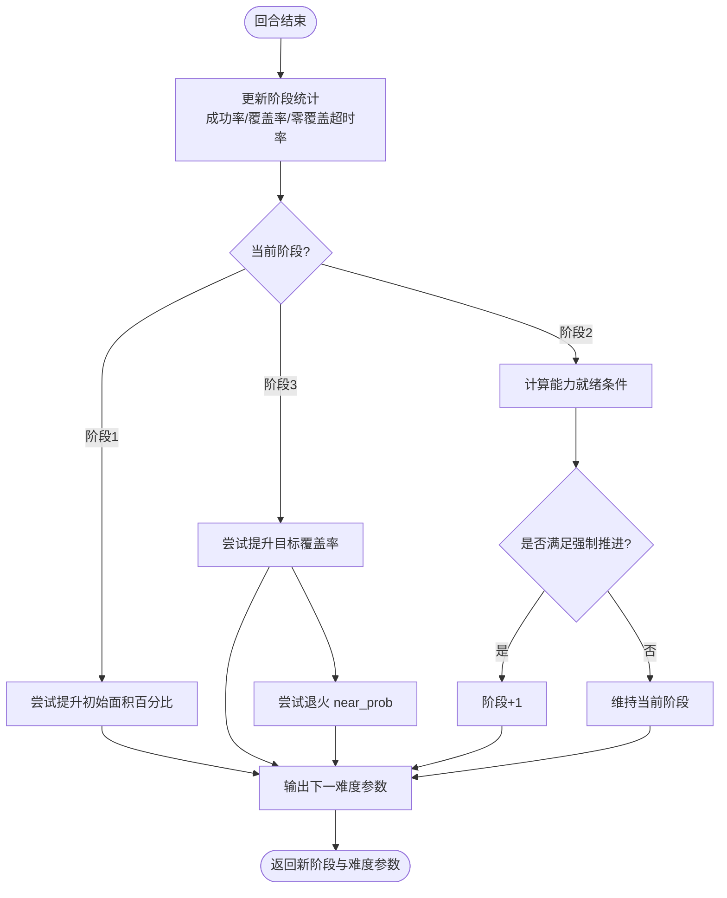
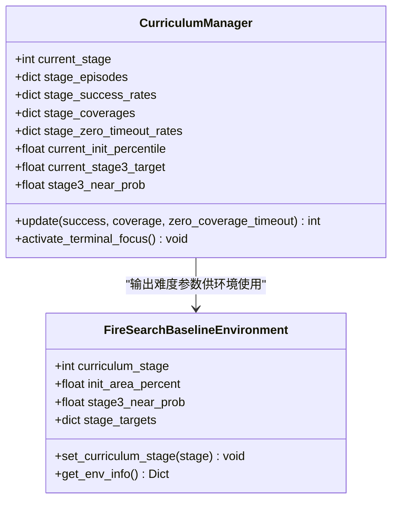

# 课程阶段切换机制

<cite>
**本文引用的文件**   
- [ctde_ppo_baseline_train.py](file://environment_variables/environment_variables/ctde_ppo_baseline_train.py)
- [rl_environment_baseline.py](file://environment_variables/environment_variables/rl_environment_baseline.py)
- [test_area_percent_curriculum.py](file://environment_variables/environment_variables/test_area_percent_curriculum.py)
</cite>

## 目录
1. [简介](#简介)
2. [项目结构](#项目结构)
3. [核心组件](#核心组件)
4. [架构总览](#架构总览)
5. [详细组件分析](#详细组件分析)
6. [依赖关系分析](#依赖关系分析)
7. [性能与稳定性考量](#性能与稳定性考量)
8. [故障排查指南](#故障排查指南)
9. [结论](#结论)
10. [附录：最佳实践与常见问题](#附录最佳实践与常见问题)

## 简介
本技术文档聚焦于“课程学习阶段切换机制”，围绕自动判断逻辑、手动干预方式、状态保持策略以及平滑过渡技术展开。系统通过多指标（成功率、覆盖率、零覆盖超时率、回合数）驱动的阶段升级，结合难度参数（初始面积百分比、目标覆盖率、近边界生成概率）的渐进调整，实现从易到难的训练路径。同时提供直接设置阶段、动态切换接口与调试模式下的控制能力，确保在阶段切换时模型权重继承、优化器状态恢复与训练日志连续性。

## 项目结构
与课程阶段切换相关的关键代码位于以下两个文件中：
- 训练主循环与课程管理器：ctde_ppo_baseline_train.py
- 环境基类与阶段影响的行为/奖励/终止条件：rl_environment_baseline.py
- 单元测试验证阶段行为：test_area_percent_curriculum.py

图表来源
- [ctde_ppo_baseline_train.py:569-752](file://environment_variables/environment_variables/ctde_ppo_baseline_train.py#L569-L752)
- [rl_environment_baseline.py:21-1027](file://environment_variables/environment_variables/rl_environment_baseline.py#L21-L1027)
- [test_area_percent_curriculum.py:130-169](file://environment_variables/environment_variables/test_area_percent_curriculum.py#L130-L169)

章节来源
- [ctde_ppo_baseline_train.py:569-752](file://environment_variables/environment_variables/ctde_ppo_baseline_train.py#L569-L752)
- [rl_environment_baseline.py:21-1027](file://environment_variables/environment_variables/rl_environment_baseline.py#L21-L1027)
- [test_area_percent_curriculum.py:130-169](file://environment_variables/environment_variables/test_area_percent_curriculum.py#L130-L169)

## 核心组件
- 课程管理器 CurriculumManager：维护当前阶段、各阶段统计（成功率、覆盖率、零覆盖超时率）、回合计数，并基于阈值与最小/最大回合数进行阶段升级；同时管理难度参数（初始面积百分比阶梯、第三阶段目标覆盖率阶梯、近边界生成概率退火）。
- 环境 FireSearchBaselineEnvironment：根据 curriculum_stage 决定终止条件、奖励系数、近边界生成概率等；提供 set_curriculum_stage 用于手动切换阶段。
- 训练主循环：每回合结束后调用 curriculum.update(success, coverage, zero_coverage_timeout)，并根据返回的新阶段与难度变化执行必要的更新与环境参数同步。

章节来源
- [ctde_ppo_baseline_train.py:569-752](file://environment_variables/environment_variables/ctde_ppo_baseline_train.py#L569-L752)
- [rl_environment_baseline.py:21-1027](file://environment_variables/environment_variables/rl_environment_baseline.py#L21-L1027)

## 架构总览
下图展示了训练主循环、课程管理器与环境之间的交互流程，包括自动阶段判定、难度参数更新与状态同步。

图表来源
- [ctde_ppo_baseline_train.py:1554-1581](file://environment_variables/environment_variables/ctde_ppo_baseline_train.py#L1554-L1581)
- [rl_environment_baseline.py:994-996](file://environment_variables/environment_variables/rl_environment_baseline.py#L994-L996)

## 详细组件分析

### 自动阶段判定逻辑
- 统计窗口：每个阶段维护最近若干回合的成功率、覆盖率、零覆盖超时率的滑动平均。
- 能力就绪条件：
  - 回合数达到最小值
  - 成功率超过阶段阈值
  - 平均覆盖率不低于最低要求
  - 零覆盖超时率不高于上限
- 强制推进条件（仅第一阶段）：当回合数达到最大值且满足覆盖率与零覆盖超时率约束时，允许提前进入下一阶段。
- 第三阶段内部难度调节：
  - 目标覆盖率阶梯式提升，需满足覆盖率、成功率与零覆盖超时率门槛。
  - 近边界生成概率按能力门控阶梯式退火，且不得超前于目标进度。

图表来源
- [ctde_ppo_baseline_train.py:621-738](file://environment_variables/environment_variables/ctde_ppo_baseline_train.py#L621-L738)

章节来源
- [ctde_ppo_baseline_train.py:621-738](file://environment_variables/environment_variables/ctde_ppo_baseline_train.py#L621-L738)

### 手动干预机制
- 直接设置阶段：通过环境的 set_curriculum_stage(stage) 方法可立即将环境切换到指定阶段，影响后续回合的终止条件、奖励系数与近边界生成概率。
- 动态阶段切换API：训练主循环在检测到 new_stage != env.curriculum_stage 时调用 set_curriculum_stage(new_stage)，完成阶段切换。
- 调试模式下的阶段控制：可通过外部脚本或测试用例直接构造 CurriculumManager 并设置 current_stage，以验证特定阶段的参数暴露与行为一致性。

章节来源
- [rl_environment_baseline.py:994-996](file://environment_variables/environment_variables/rl_environment_baseline.py#L994-L996)
- [ctde_ppo_baseline_train.py:1554-1581](file://environment_variables/environment_variables/ctde_ppo_baseline_train.py#L1554-L1581)
- [test_area_percent_curriculum.py:130-169](file://environment_variables/environment_variables/test_area_percent_curriculum.py#L130-L169)

### 阶段切换时的状态保持策略
- 模型权重继承：阶段切换不重置模型权重，Agent 继续在当前权重上训练。
- 优化器状态恢复：切换前若缓存数据充足，会进行一次强制更新，确保优化器状态与最新策略一致；若不足则清空缓存以避免污染新阶段的学习。
- 训练日志连续性：每回合记录 stage、init_area_percent、stage3_target、stage3_near_prob 等关键指标，保证阶段切换前后日志连续可追溯。

章节来源
- [ctde_ppo_baseline_train.py:1554-1581](file://environment_variables/environment_variables/ctde_ppo_baseline_train.py#L1554-L1581)
- [ctde_ppo_baseline_train.py:1523-1552](file://environment_variables/environment_variables/ctde_ppo_baseline_train.py#L1523-L1552)

### 不同阶段间的平滑过渡技术
- 参数渐变：
  - 初始面积百分比阶梯式提升（PERCENTILE_LADDER），依据第一阶段成功率与最少回合数推进。
  - 第三阶段目标覆盖率阶梯式提升（STAGE3_TARGET_LADDER），依据覆盖率、成功率与零覆盖超时率门控推进。
- 奖励函数插值：
  - 阶段不同导致终止惩罚与终端奖励不同，随阶段提高对未达目标的惩罚更严格，成功效率奖励更显著。
- 探索策略渐进调整：
  - 近边界生成概率（near_prob）在第三阶段按能力门控阶梯式退火，逐步降低近边界采样比例，鼓励更远探索。

章节来源
- [ctde_ppo_baseline_train.py:569-752](file://environment_variables/environment_variables/ctde_ppo_baseline_train.py#L569-L752)
- [rl_environment_baseline.py:824-992](file://environment_variables/environment_variables/rl_environment_baseline.py#L824-L992)

## 依赖关系分析
- CurriculumManager 依赖 numpy 进行滑动平均与统计计算，并通过属性与内部索引管理难度参数。
- 训练主循环依赖 CurriculumManager 的 update 返回值来同步环境难度参数与阶段。
- 环境依赖 curriculum_stage 来决定终止条件、奖励系数与近边界生成概率。

图表来源
- [ctde_ppo_baseline_train.py:569-752](file://environment_variables/environment_variables/ctde_ppo_baseline_train.py#L569-L752)
- [rl_environment_baseline.py:21-1027](file://environment_variables/environment_variables/rl_environment_baseline.py#L21-L1027)

章节来源
- [ctde_ppo_baseline_train.py:569-752](file://environment_variables/environment_variables/ctde_ppo_baseline_train.py#L569-L752)
- [rl_environment_baseline.py:21-1027](file://environment_variables/environment_variables/rl_environment_baseline.py#L21-L1027)

## 性能与稳定性考量
- 滑动窗口大小：阶段统计使用固定长度队列，避免长尾样本影响阈值判断。
- 零覆盖超时率：作为重要质量指标，防止模型在早期陷入无效搜索。
- 强制推进保护：仅在满足覆盖率与零覆盖超时率约束时允许提前推进，避免过早增加难度导致退化。
- 近边界退火门控：确保 near_prob 退火不超过目标进度，避免探索过度激进。

章节来源
- [ctde_ppo_baseline_train.py:621-738](file://environment_variables/environment_variables/ctde_ppo_baseline_train.py#L621-L738)

## 故障排查指南
- 阶段不升级：检查是否满足最小回合数、成功率阈值、覆盖率下限与零覆盖超时率上限；确认第一阶段是否达到最大回合数且满足强制推进条件。
- 难度参数未变化：确认 CurriculumManager 的内部索引是否已达上限；检查对应门控条件是否满足。
- 切换后行为异常：确认 set_curriculum_stage 是否被正确调用；核对环境中的 stage_targets 与 stage3_near_prob 是否已同步。
- 日志断点：查看 training_log 中 stage、init_area_percent、stage3_target、stage3_near_prob 字段是否连续记录。

章节来源
- [ctde_ppo_baseline_train.py:1523-1581](file://environment_variables/environment_variables/ctde_ppo_baseline_train.py#L1523-L1581)
- [rl_environment_baseline.py:994-996](file://environment_variables/environment_variables/rl_environment_baseline.py#L994-L996)

## 结论
该课程阶段切换机制通过多维指标与门控条件实现稳健的自动升级，并结合难度参数的阶梯式调整与近边界退火，达成从易到难的平滑过渡。手动干预接口与调试支持为实验与排错提供了便利。整体设计在保证稳定性的同时兼顾了可扩展性与可观测性。

## 附录：最佳实践与常见问题

### 最佳实践建议
- 合理配置阶段阈值与回合数：根据任务复杂度调整 stage_thresholds、stage_min_episodes、stage_max_episodes。
- 监控零覆盖超时率：将其作为关键质量指标，避免模型在低覆盖率下长期停滞。
- 分步调参：先稳定第一阶段成功率与覆盖率，再逐步提升第三阶段目标与退火速率。
- 利用强制推进：在第一阶段遇到瓶颈时可启用强制推进，但需确保覆盖率与零覆盖超时率达标。

### 常见问题解决方案
- 问题：第三阶段目标无法提升
  - 解决：检查覆盖率是否达到目标的一定比例、成功率是否≥0.50、零覆盖超时率是否≤0.15。
- 问题：near_prob 不退火
  - 解决：确认 near_prob 退火索引未超前于目标索引，且满足成功率、零覆盖超时率与覆盖率门控。
- 问题：切换阶段后奖励分布突变
  - 解决：理解不同阶段的终止惩罚与终端奖励差异，必要时调整 reward_profile 或阶段目标。

章节来源
- [ctde_ppo_baseline_train.py:684-738](file://environment_variables/environment_variables/ctde_ppo_baseline_train.py#L684-L738)
- [rl_environment_baseline.py:824-992](file://environment_variables/environment_variables/rl_environment_baseline.py#L824-L992)