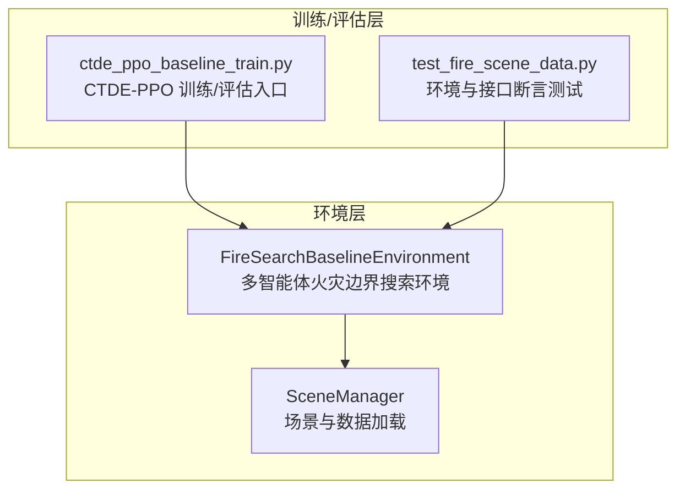
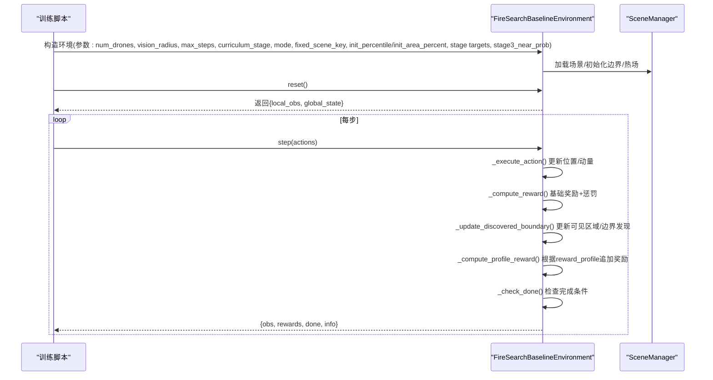
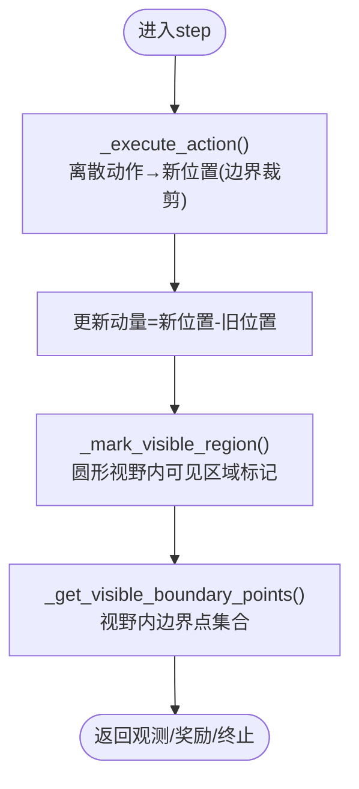
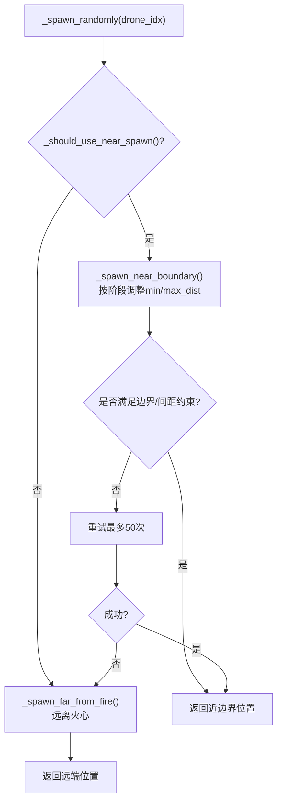
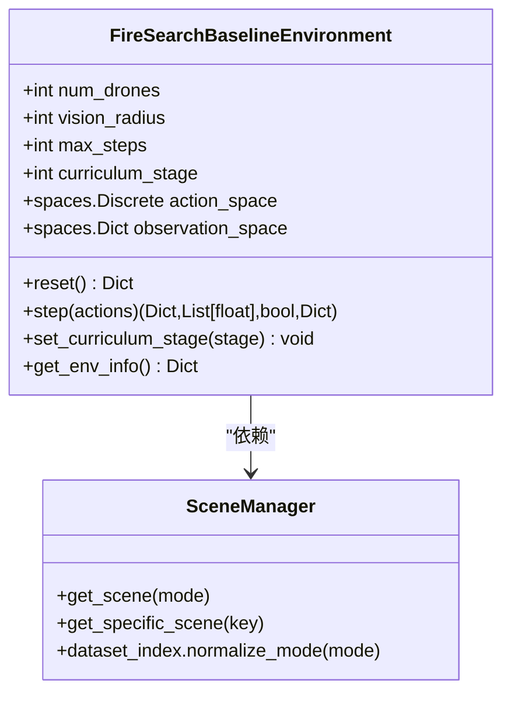

# 多无人机协同搜索

<cite>
**本文引用的文件**
- [rl_environment_baseline.py](file://environment_variables/environment_variables/rl_environment_baseline.py)
- [ctde_ppo_baseline_train.py](file://environment_variables/environment_variables/ctde_ppo_baseline_train.py)
- [test_fire_scene_data.py](file://environment_variables/environment_variables/test_fire_scene_data.py)
</cite>

## 目录
1. [简介](#简介)
2. [项目结构](#项目结构)
3. [核心组件](#核心组件)
4. [架构总览](#架构总览)
5. [详细组件分析](#详细组件分析)
6. [依赖关系分析](#依赖关系分析)
7. [性能考虑](#性能考虑)
8. [故障排查指南](#故障排查指南)
9. [结论](#结论)
10. [附录：配置与使用示例](#附录配置与使用示例)

## 简介
本技术文档围绕“多无人机协同搜索”功能，聚焦于分布式协作机制、任务分配策略与冲突避免算法，并深入解析 FireSearchBaselineEnvironment 类在多智能体环境中的实现细节。文档涵盖无人机位置管理、电池状态跟踪、动量系统、视野范围控制、随机生成策略（近边界与远端生成的概率分布及课程学习阶段的影响）、无人机间碰撞检测与间距约束机制，并提供可操作的配置示例与调试建议。

## 项目结构
本项目采用基于 Gymnasium 的强化学习环境设计，核心环境类为 FireSearchBaselineEnvironment，位于 environment_variables/environment_variables/rl_environment_baseline.py。训练脚本 ctde_ppo_baseline_train.py 负责加载环境并进行评估或训练流程；测试用例 test_fire_scene_data.py 验证观测维度、动作空间与基本行为。

图表来源
- [rl_environment_baseline.py:1-1027](file://environment_variables/environment_variables/rl_environment_baseline.py#L1-L1027)
- [ctde_ppo_baseline_train.py:1564-1589](file://environment_variables/environment_variables/ctde_ppo_baseline_train.py#L1564-L1589)
- [test_fire_scene_data.py:142-208](file://environment_variables/environment_variables/test_fire_scene_data.py#L142-L208)

章节来源
- [rl_environment_baseline.py:1-1027](file://environment_variables/environment_variables/rl_environment_baseline.py#L1-L1027)
- [ctde_ppo_baseline_train.py:1564-1589](file://environment_variables/environment_variables/ctde_ppo_baseline_train.py#L1564-L1589)
- [test_fire_scene_data.py:142-208](file://environment_variables/environment_variables/test_fire_scene_data.py#L142-L208)

## 核心组件
- FireSearchBaselineEnvironment：提供多无人机离散动作空间（上/下/左/右/静止），局部观测与全局状态输出，支持多种观测/奖励配置，内置课程学习与随机生成策略。
- SceneManager：负责场景加载、边界点初始化、热场计算等数据准备。
- 训练脚本：在评估阶段按课程阶段创建环境实例，执行确定性策略推理并统计指标。

章节来源
- [rl_environment_baseline.py:21-158](file://environment_variables/environment_variables/rl_environment_baseline.py#L21-L158)
- [ctde_ppo_baseline_train.py:1564-1589](file://environment_variables/environment_variables/ctde_ppo_baseline_train.py#L1564-L1589)

## 架构总览
下图展示从训练脚本到环境的调用序列，以及环境内部的关键处理步骤（动作执行、奖励计算、状态更新、终止判定）。

图表来源
- [ctde_ppo_baseline_train.py:1564-1589](file://environment_variables/environment_variables/ctde_ppo_baseline_train.py#L1564-L1589)
- [rl_environment_baseline.py:841-992](file://environment_variables/environment_variables/rl_environment_baseline.py#L841-L992)

## 详细组件分析

### 多智能体协作与通信协议
- 协作模式：去中心化局部观测 + 集中式全局状态（CTDE）。每个无人机仅接收自身 local_obs，但训练器可通过 global_state 进行集中式价值网络或策略网络输入。
- 通信协议：代码中未实现显式的无人机间消息传递（如广播/点对点通信）。协作通过全局状态聚合信息（覆盖率、队形中心/散布、平均/最小电量、距火距离、步长进度、已访问密度、课程阶段、风场/高程均值、低电量标志、无人机数量、覆盖梯度、未探索密度）间接实现。
- 任务分配策略：无显式任务分配器。任务由奖励函数引导（边界发现、覆盖率增量、预边界区域探索、重复惩罚、空闲惩罚、同伴接近惩罚、终端奖励/超时惩罚），并通过课程阶段调节权重与目标阈值。

章节来源
- [rl_environment_baseline.py:108-131](file://environment_variables/environment_variables/rl_environment_baseline.py#L108-L131)
- [rl_environment_baseline.py:633-658](file://environment_variables/environment_variables/rl_environment_baseline.py#L633-L658)
- [rl_environment_baseline.py:692-767](file://environment_variables/environment_variables/rl_environment_baseline.py#L692-L767)
- [rl_environment_baseline.py:769-806](file://environment_variables/environment_variables/rl_environment_baseline.py#L769-L806)

### 无人机位置管理与动量系统
- 位置管理：每步对每个无人机执行离散动作映射（上下左右/静止），并裁剪至网格边界。
- 动量系统：记录上一时刻到新位置的位移向量作为动量，用于观测特征（便于模型感知运动方向与惯性）。
- 视野范围控制：以 vision_radius 定义圆形视野窗口，用于标记可见区域、统计新可见面积、计算热信号与边界点可见性。

图表来源
- [rl_environment_baseline.py:660-669](file://environment_variables/environment_variables/rl_environment_baseline.py#L660-L669)
- [rl_environment_baseline.py:269-276](file://environment_variables/environment_variables/rl_environment_baseline.py#L269-L276)
- [rl_environment_baseline.py:306-318](file://environment_variables/environment_variables/rl_environment_baseline.py#L306-L318)

章节来源
- [rl_environment_baseline.py:660-669](file://environment_variables/environment_variables/rl_environment_baseline.py#L660-L669)
- [rl_environment_baseline.py:269-276](file://environment_variables/environment_variables/rl_environment_baseline.py#L269-L276)
- [rl_environment_baseline.py:306-318](file://environment_variables/environment_variables/rl_environment_baseline.py#L306-L318)

### 电池状态跟踪与能耗模型
- 初始电量：max_battery = max_steps * 2.0。
- 移动能耗：若发生位移，则根据风向影响计算额外能耗；否则静止时消耗较小固定值。
- 终止条件：任一无人机电量耗尽即触发结束。

章节来源
- [rl_environment_baseline.py:133-137](file://environment_variables/environment_variables/rl_environment_baseline.py#L133-L137)
- [rl_environment_baseline.py:866-872](file://environment_variables/environment_variables/rl_environment_baseline.py#L866-L872)
- [rl_environment_baseline.py:838-840](file://environment_variables/environment_variables/rl_environment_baseline.py#L838-L840)

### 随机生成策略与课程学习阶段
- 生成策略选择：训练模式下，依据课程阶段决定“近边界生成”的概率分布：
  - 阶段1：较高概率靠近边界（便于快速发现边界）
  - 阶段2：中等概率
  - 阶段3：由 stage3_near_prob 控制
- 近边界生成：在边界点周围按角度和半径均匀采样，确保在网格边界内且满足与现有无人机的最小间距。
- 远端生成：在远离火场质心的区域随机采样，保证与火心距离大于一定阈值。
- 课程学习影响：不同阶段的近边界生成半径范围与成功率不同，从而逐步提升探索难度与目标覆盖率要求。

图表来源
- [rl_environment_baseline.py:362-377](file://environment_variables/environment_variables/rl_environment_baseline.py#L362-L377)
- [rl_environment_baseline.py:379-415](file://environment_variables/environment_variables/rl_environment_baseline.py#L379-L415)
- [rl_environment_baseline.py:421-436](file://environment_variables/environment_variables/rl_environment_baseline.py#L421-L436)

章节来源
- [rl_environment_baseline.py:362-377](file://environment_variables/environment_variables/rl_environment_baseline.py#L362-L377)
- [rl_environment_baseline.py:379-415](file://environment_variables/environment_variables/rl_environment_baseline.py#L379-L415)
- [rl_environment_baseline.py:421-436](file://environment_variables/environment_variables/rl_environment_baseline.py#L421-L436)

### 碰撞检测与间距约束机制
- 生成阶段间距约束：在生成候选位置时，检查与已有无人机的欧氏距离是否小于 min_spacing（约为 vision_radius * 0.8），不满足则拒绝并重试。
- 运行阶段惩罚：若新位置与同伴距离小于同一阈值，则施加负奖励，鼓励分散以避免聚集。
- 注意：该机制为软约束（通过惩罚引导），并非硬排斥（允许极近距离但代价高）。

章节来源
- [rl_environment_baseline.py:417-419](file://environment_variables/environment_variables/rl_environment_baseline.py#L417-L419)
- [rl_environment_baseline.py:746-754](file://environment_variables/environment_variables/rl_environment_baseline.py#L746-L754)

### 观测与全局状态
- 局部观测：包含位置归一化、电量比例、强度/地形/风场/坡度归一化特征、热梯度、动量、相机方向等，维度随 observation_profile 变化（baseline/static_terrain/dynamic_front/risk_aware）。
- 全局状态：汇总团队覆盖率、平均/最小电量、队形中心/散布、距火平均距离、步长进度、已访问密度、课程阶段、风场/高程均值、低电量标志、无人机数量、覆盖梯度、未探索密度等。

章节来源
- [rl_environment_baseline.py:24-29](file://environment_variables/environment_variables/rl_environment_baseline.py#L24-L29)
- [rl_environment_baseline.py:565-658](file://environment_variables/environment_variables/rl_environment_baseline.py#L565-L658)
- [test_fire_scene_data.py:158-189](file://environment_variables/environment_variables/test_fire_scene_data.py#L158-L189)

### 奖励设计与任务分配引导
- 基础奖励：边界发现奖励（随阶段递减）、步数惩罚、重复区域惩罚、空闲惩罚、同伴接近惩罚。
- 覆盖率增量奖励：新发现的边界点数按比例加权并裁剪上限。
- 预边界区域探索奖励：在未检测到边界前，基于新可见面积给予弱引导。
- 配置化奖励：front_detection/severity_weighted/exploration_balanced 等 profile 提供差异化奖励组合。
- 终端奖励/超时惩罚：根据完成率与阶段目标动态计算。

章节来源
- [rl_environment_baseline.py:692-767](file://environment_variables/environment_variables/rl_environment_baseline.py#L692-L767)
- [rl_environment_baseline.py:769-806](file://environment_variables/environment_variables/rl_environment_baseline.py#L769-L806)
- [rl_environment_baseline.py:231-251](file://environment_variables/environment_variables/rl_environment_baseline.py#L231-L251)

## 依赖关系分析
- 环境与环境管理器：FireSearchBaselineEnvironment 依赖 SceneManager 进行场景加载与边界/热场计算。
- 训练脚本与环境：训练脚本在评估阶段按课程阶段构建环境实例，传入关键参数（num_drones、vision_radius、max_steps、curriculum_stage、mode、fixed_scene_key、init_percentile/init_area_percent、stage targets、stage3_near_prob）。
- 测试与接口：测试用例断言观测维度、全局状态维度、动作空间与基本 step 行为。

图表来源
- [rl_environment_baseline.py:21-158](file://environment_variables/environment_variables/rl_environment_baseline.py#L21-L158)
- [rl_environment_baseline.py:159-207](file://environment_variables/environment_variables/rl_environment_baseline.py#L159-L207)

章节来源
- [rl_environment_baseline.py:21-158](file://environment_variables/environment_variables/rl_environment_baseline.py#L21-L158)
- [rl_environment_baseline.py:159-207](file://environment_variables/environment_variables/rl_environment_baseline.py#L159-L207)
- [ctde_ppo_baseline_train.py:1564-1589](file://environment_variables/environment_variables/ctde_ppo_baseline_train.py#L1564-L1589)
- [test_fire_scene_data.py:142-208](file://environment_variables/environment_variables/test_fire_scene_data.py#L142-L208)

## 性能考虑
- 视野窗口切片：使用圆形掩码与 numpy 切片减少全图扫描开销。
- 缓存严重度地图：_severity_map_cache 避免重复计算。
- 边界更新频率：每隔若干步更新边界点与热场，降低高频计算成本。
- 奖励分解与统计：仅在必要时累积 episode 级分解，避免频繁字典操作。
- 建议：
  - 增大 vision_radius 会显著增加视野切片与统计开销，需权衡感知能力与计算成本。
  - 合理设置 stage3_near_prob 与课程阶段目标，避免过难导致收敛缓慢。
  - 使用 get_env_info 监控 grid_size、total_boundary_points、max_steps、max_battery、local/global 维度等，辅助调参。

[本节为通用指导，无需具体文件引用]

## 故障排查指南
- 观测维度不一致：确认 observation_profile 与预期一致，参考测试断言中的期望维度。
- 动作空间错误：确认 Discrete 空间大小为 5（上下左右/静止）。
- 生成失败或卡住：检查 boundary_points 是否为空、margin 与 min/max_dist 设置是否合理、是否存在过多重复尝试。
- 碰撞惩罚过高：检查 vision_radius 与 min_spacing 比例，适当调整以避免过度聚集惩罚。
- 电池过早耗尽：检查 wind_effect 与移动能耗系数，必要时提高 max_steps 或降低能耗权重。
- 课程阶段切换无效：确认 set_curriculum_stage 被正确调用，并在训练循环中更新。

章节来源
- [test_fire_scene_data.py:142-208](file://environment_variables/environment_variables/test_fire_scene_data.py#L142-L208)
- [rl_environment_baseline.py:379-415](file://environment_variables/environment_variables/rl_environment_baseline.py#L379-L415)
- [rl_environment_baseline.py:838-840](file://environment_variables/environment_variables/rl_environment_baseline.py#L838-L840)
- [rl_environment_baseline.py:994-996](file://environment_variables/environment_variables/rl_environment_baseline.py#L994-L996)

## 结论
本环境通过 CTDE 框架实现了多无人机协同搜索任务，利用课程学习与随机生成策略逐步提升任务难度，并通过奖励函数与软约束引导无人机在边界附近高效探索、避免聚集。尽管未实现显式通信协议，但全局状态提供了必要的团队级信息，便于集中式训练与评估。整体设计兼顾可扩展性与可解释性，适合进一步集成更复杂的通信与任务分配模块。

[本节为总结，无需具体文件引用]

## 附录：配置与使用示例
以下示例展示如何配置多无人机环境、设置观测维度与动作空间，并在评估阶段执行确定性策略。

- 环境构造参数说明（节选）：
  - data_dir：数据集根目录
  - num_drones：无人机数量
  - vision_radius：视野半径（单元格）
  - max_steps：最大步数
  - use_metadata_uav_params：是否使用元数据中的传感器半径与最大步数
  - observation_profile：观测配置（baseline/static_terrain/dynamic_front/risk_aware）
  - reward_profile：奖励配置（boundary_coverage/front_detection/severity_weighted/exploration_balanced）
  - curriculum_stage：课程阶段（1/2/3）
  - mode：模式（train/val/test）
  - fixed_scene_key：固定场景键（可选）
  - scene_keys：指定场景键列表（可选）
  - init_percentile/init_area_percent：初始边界百分比或面积百分比
  - stage2_target/stage3_target：阶段2/3的目标覆盖率
  - stage3_near_prob：阶段3的近边界生成概率

- 训练脚本评估片段（节选）：
  - 在评估循环中，按课程阶段创建环境实例，传入上述参数，执行确定性策略并累计奖励与步数。

- 测试断言要点（节选）：
  - 验证 local_obs 与 global_state 的形状与维度
  - 验证 step 返回的 rewards 长度等于无人机数量
  - 验证 done 为布尔类型
  - 验证 info 中包含 scene_key 与 observation_profile 等字段

章节来源
- [rl_environment_baseline.py:49-158](file://environment_variables/environment_variables/rl_environment_baseline.py#L49-L158)
- [ctde_ppo_baseline_train.py:1564-1589](file://environment_variables/environment_variables/ctde_ppo_baseline_train.py#L1564-L1589)
- [test_fire_scene_data.py:142-208](file://environment_variables/environment_variables/test_fire_scene_data.py#L142-L208)