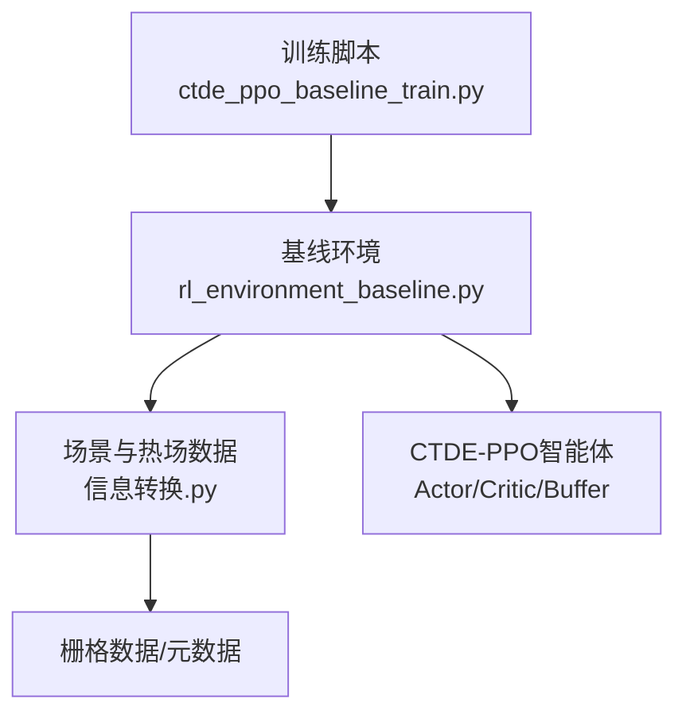
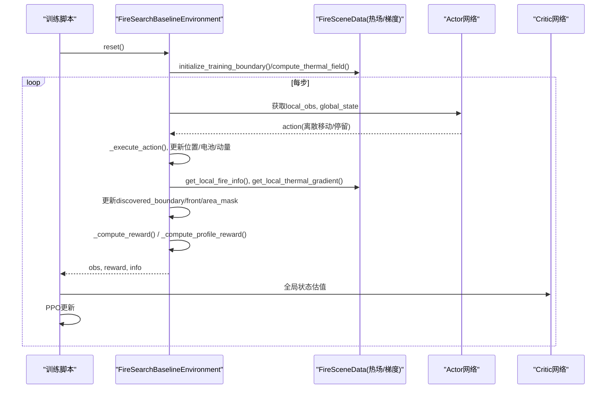
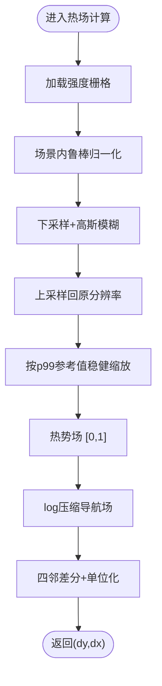
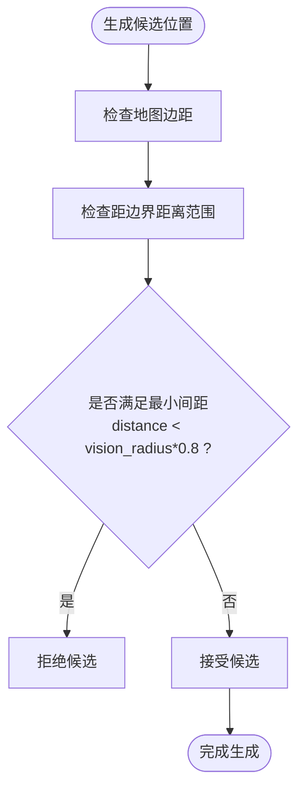
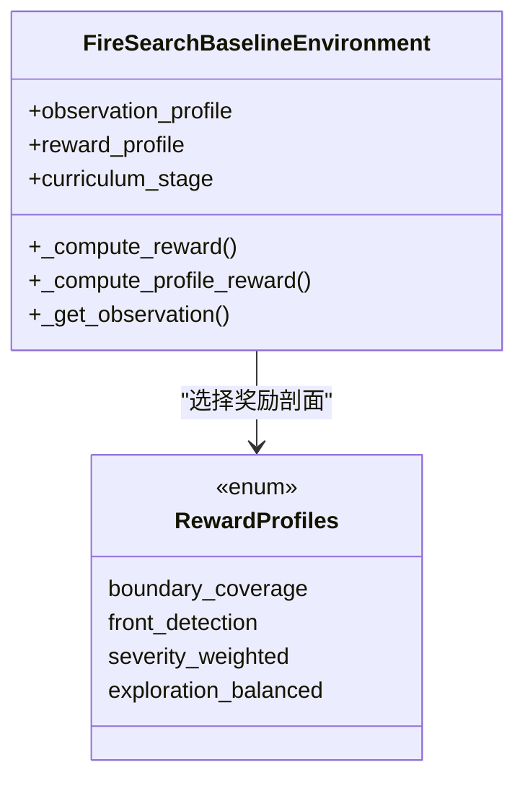
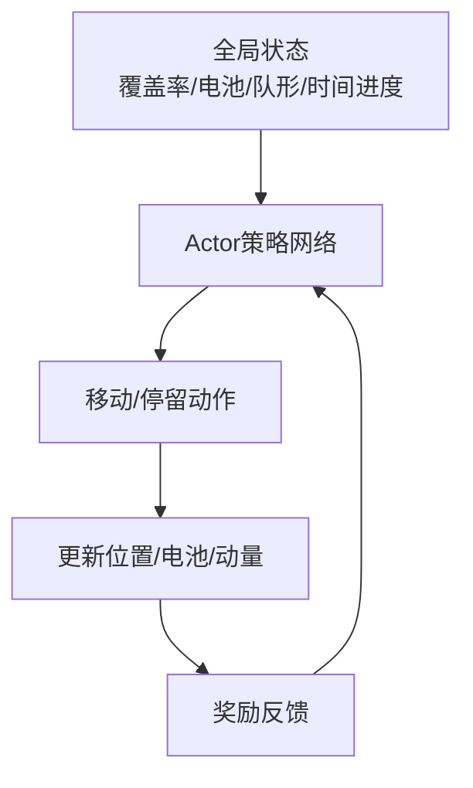
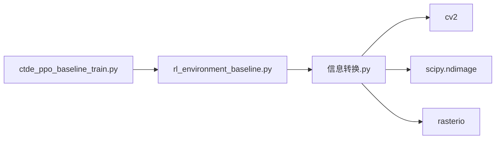
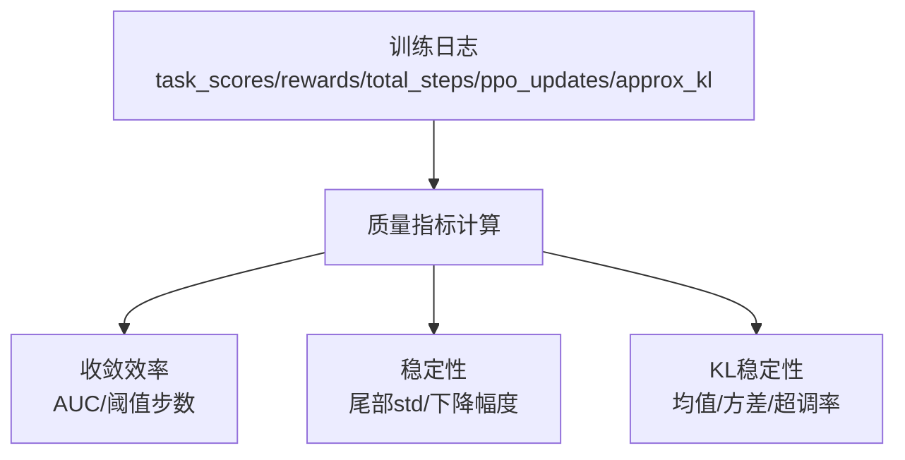

# 任务分配策略

<cite>
**本文引用的文件**   
- [ctde_ppo_baseline_train.py](file://environment_variables/environment_variables/ctde_ppo_baseline_train.py)
- [rl_environment_baseline.py](file://environment_variables/environment_variables/rl_environment_baseline.py)
- [信息转换.py](file://environment_variables/environment_variables/信息转换.py)
</cite>

## 目录
1. [引言](#引言)
2. [项目结构](#项目结构)
3. [核心组件](#核心组件)
4. [架构总览](#架构总览)
5. [详细组件分析](#详细组件分析)
6. [依赖关系分析](#依赖关系分析)
7. [性能与效率评估](#性能与效率评估)
8. [故障排查指南](#故障排查指南)
9. [结论](#结论)
10. [附录：配置与调优示例路径](#附录配置与调优示例路径)

## 引言
本技术文档围绕多无人机在火场边界搜索场景中的“任务分配策略”展开，重点解释以下方面：
- 基于热势梯度的动态任务分配算法：热场梯度计算、方向引导机制
- 冲突避免机制：最小间距约束（vision_radius * 0.8）与视觉半径内的冲突检测
- 任务优先级排序策略：边界覆盖优先、前沿探测优先、区域探索优先等场景下的分配逻辑
- 负载均衡机制：基于电池电量的任务重分配和基于覆盖率的动态调整
- 参数配置与权重调整的具体代码位置
- 任务分配效率评估指标与调优建议

该仓库采用CTDE-PPO训练框架，环境层提供局部观测与全局状态，数据层负责热场构建与梯度计算。任务分配并非显式集中式调度器，而是通过奖励函数、观察特征与环境交互隐式驱动各无人机的行为选择，从而实现“去中心化决策 + 全局目标对齐”的任务分配效果。

## 项目结构
- 训练脚本：定义默认训练配置、课程学习阶段、质量评估指标等
- 环境实现：封装多无人机环境、动作执行、奖励计算、观测构造、冲突检测与生成策略
- 数据与热场：加载栅格数据、构建热势场与导航场、计算热梯度、提取火场边界与前沿

图表来源
- [ctde_ppo_baseline_train.py:98-158](file://environment_variables/environment_variables/ctde_ppo_baseline_train.py#L98-L158)
- [rl_environment_baseline.py:21-157](file://environment_variables/environment_variables/rl_environment_baseline.py#L21-L157)
- [信息转换.py:219-322](file://environment_variables/environment_variables/信息转换.py#L219-L322)

章节来源
- [ctde_ppo_baseline_train.py:98-158](file://environment_variables/environment_variables/ctde_ppo_baseline_train.py#L98-L158)
- [rl_environment_baseline.py:21-157](file://environment_variables/environment_variables/rl_environment_baseline.py#L21-L157)
- [信息转换.py:219-322](file://environment_variables/environment_variables/信息转换.py#L219-L322)

## 核心组件
- 训练配置与课程管理：控制无人机数量、视野半径、最大步数、奖励剖面、KL自适应等；课程管理器按成功率、覆盖率、零超时率推进阶段与难度
- 环境层：维护多机位置、电池、动量、已发现边界/前沿/面积掩码；提供圆形视野窗口、可见性统计、边界/前沿更新、奖励分解
- 数据层：从数据集索引加载场景，归一化强度/地形/风场，构建热势场与导航场，计算热梯度，提取t=0或按面积百分比的初始边界点

章节来源
- [ctde_ppo_baseline_train.py:98-158](file://environment_variables/environment_variables/ctde_ppo_baseline_train.py#L98-L158)
- [ctde_ppo_baseline_train.py:569-751](file://environment_variables/environment_variables/ctde_ppo_baseline_train.py#L569-L751)
- [rl_environment_baseline.py:21-157](file://environment_variables/environment_variables/rl_environment_baseline.py#L21-L157)
- [信息转换.py:219-322](file://environment_variables/environment_variables/信息转换.py#L219-L322)

## 架构总览
下图展示训练循环中关键模块的交互：训练脚本调用环境，环境读取场景并计算热场与梯度，智能体根据局部观测与全局状态输出动作，环境更新状态并返回奖励与诊断信息。

图表来源
- [ctde_ppo_baseline_train.py:759-800](file://environment_variables/environment_variables/ctde_ppo_baseline_train.py#L759-L800)
- [rl_environment_baseline.py:565-658](file://environment_variables/environment_variables/rl_environment_baseline.py#L565-L658)
- [信息转换.py:759-819](file://environment_variables/environment_variables/信息转换.py#L759-L819)
- [信息转换.py:933-970](file://environment_variables/environment_variables/信息转换.py#L933-L970)

## 详细组件分析

### 热势梯度与方向引导机制
- 热势场构建：对火区强度进行场景内鲁棒归一化，下采样+高斯模糊后上采样，再以99百分位参考值做稳健缩放，得到[0,1]的热势场；同时构建log压缩的导航场用于梯度计算，避免高值区梯度消失
- 梯度计算：在导航场上以四邻差分求dy/dx，再单位化得到方向向量；当当前位置热值低于阈值时返回零向量，避免噪声干扰
- 方向引导：将热梯度作为观测特征输入到Actor，使无人机在未见边界时沿热势上升方向探索，形成“热势梯度引导”的动态任务分配倾向

图表来源
- [信息转换.py:759-819](file://environment_variables/environment_variables/信息转换.py#L759-L819)
- [信息转换.py:933-970](file://environment_variables/environment_variables/信息转换.py#L933-L970)

章节来源
- [信息转换.py:759-819](file://environment_variables/environment_variables/信息转换.py#L759-L819)
- [信息转换.py:933-970](file://environment_variables/environment_variables/信息转换.py#L933-L970)
- [rl_environment_baseline.py:565-658](file://environment_variables/environment_variables/rl_environment_baseline.py#L565-L658)

### 冲突避免机制
- 最小间距约束：在生成近边界起点时，使用min_spacing = vision_radius * 0.8检查与其他无人机的距离，若小于该阈值则拒绝该候选位置
- 视觉半径内冲突检测：在执行动作后的奖励计算中，若新位置与任一其他无人机距离小于vision_radius * 0.8，则施加惩罚，抑制靠近行为
- 边界附近安全生成：近边界生成的半径范围随课程阶段变化，但始终受最小间距与安全边距约束，确保初始分布不重叠

图表来源
- [rl_environment_baseline.py:379-415](file://environment_variables/environment_variables/rl_environment_baseline.py#L379-L415)
- [rl_environment_baseline.py:417-419](file://environment_variables/environment_variables/rl_environment_baseline.py#L417-L419)
- [rl_environment_baseline.py:746-754](file://environment_variables/environment_variables/rl_environment_baseline.py#L746-L754)

章节来源
- [rl_environment_baseline.py:379-415](file://environment_variables/environment_variables/rl_environment_baseline.py#L379-L415)
- [rl_environment_baseline.py:417-419](file://environment_variables/environment_variables/rl_environment_baseline.py#L417-L419)
- [rl_environment_baseline.py:746-754](file://environment_variables/environment_variables/rl_environment_baseline.py#L746-L754)

### 任务优先级排序策略
任务优先级由奖励剖面与课程阶段共同决定，体现为不同场景下的“软分配”倾向：
- 边界覆盖优先：reward_profile="boundary_coverage"时，对首次发现边界点给予显著奖励，并在未覆盖阶段引入“预边界区域奖励”，鼓励向边界靠拢
- 前沿探测优先：reward_profile="front_detection"时，对新增前沿点按比例奖励，推动无人机主动追踪活跃前沿
- 区域探索优先：reward_profile="exploration_balanced"时，对新见面积按视场比例奖励，促进均匀覆盖
- 严重度加权：reward_profile="severity_weighted"时，结合局部严重度均值与最大值，引导向高风险区域

图表来源
- [rl_environment_baseline.py:30-47](file://environment_variables/environment_variables/rl_environment_baseline.py#L30-L47)
- [rl_environment_baseline.py:769-800](file://environment_variables/environment_variables/rl_environment_baseline.py#L769-L800)

章节来源
- [rl_environment_baseline.py:30-47](file://environment_variables/environment_variables/rl_environment_baseline.py#L30-L47)
- [rl_environment_baseline.py:769-800](file://environment_variables/environment_variables/rl_environment_baseline.py#L769-L800)

### 负载均衡机制
- 电池电量感知：全局状态包含平均/最低电池比率及低电量标志位，Actor可据此调整行为（如减少长距离移动、增加停留）
- 覆盖率动态调整：全局状态包含当前覆盖率、未覆盖密度、团队中心与分散度，配合课程阶段目标，促使无人机在覆盖率不足时扩大搜索范围
- 课程退火：课程管理器逐步提高目标覆盖率与“近边界生成概率”退火，间接实现负载从易到难的动态转移

图表来源
- [rl_environment_baseline.py:614-658](file://environment_variables/environment_variables/rl_environment_baseline.py#L614-L658)
- [ctde_ppo_baseline_train.py:569-751](file://environment_variables/environment_variables/ctde_ppo_baseline_train.py#L569-L751)

章节来源
- [rl_environment_baseline.py:614-658](file://environment_variables/environment_variables/rl_environment_baseline.py#L614-L658)
- [ctde_ppo_baseline_train.py:569-751](file://environment_variables/environment_variables/ctde_ppo_baseline_train.py#L569-L751)

## 依赖关系分析
- 训练脚本依赖环境类与数据模块；环境类依赖数据模块提供的热场、梯度、边界与前沿信息
- 数据模块内部依赖rasterio/scipy/cv2进行栅格读写、形态学操作与图像滤波
- 课程管理与质量评估指标位于训练脚本中，影响训练流程与模型保存策略

图表来源
- [ctde_ppo_baseline_train.py:30-37](file://environment_variables/environment_variables/ctde_ppo_baseline_train.py#L30-L37)
- [rl_environment_baseline.py:17-19](file://environment_variables/environment_variables/rl_environment_baseline.py#L17-L19)
- [信息转换.py:9-13](file://environment_variables/environment_variables/信息转换.py#L9-L13)

章节来源
- [ctde_ppo_baseline_train.py:30-37](file://environment_variables/environment_variables/ctde_ppo_baseline_train.py#L30-L37)
- [rl_environment_baseline.py:17-19](file://environment_variables/environment_variables/rl_environment_baseline.py#L17-L19)
- [信息转换.py:9-13](file://environment_variables/environment_variables/信息转换.py#L9-L13)

## 性能与效率评估
- 收敛效率：通过任务得分曲线与步数AUC衡量；首次达到阈值所需步数/更新次数
- 稳定性：尾部奖励与任务得分标准差、滚动均值下降幅度
- KL稳定性：近似KL均值/方差、超调率、裁剪分数均值/方差、学习率范围
- 任务评分公式：综合覆盖率、成功与否与长度效率，反映任务分配的整体有效性

图表来源
- [ctde_ppo_baseline_train.py:358-433](file://environment_variables/environment_variables/ctde_ppo_baseline_train.py#L358-L433)
- [ctde_ppo_baseline_train.py:295-306](file://environment_variables/environment_variables/ctde_ppo_baseline_train.py#L295-L306)

章节来源
- [ctde_ppo_baseline_train.py:358-433](file://environment_variables/environment_variables/ctde_ppo_baseline_train.py#L358-L433)
- [ctde_ppo_baseline_train.py:295-306](file://environment_variables/environment_variables/ctde_ppo_baseline_train.py#L295-L306)

## 故障排查指南
- 热场健康诊断：检查饱和比例、高热区零梯度比例、非零比例与分位数，确认热场语义层正常
- 场景有效性：验证t=0边界点是否为空、初始化面积百分比是否产生有效边界
- 冲突与重复：若频繁触发近距离惩罚，需增大最小间距或调整生成半径范围
- 课程阶段停滞：检查成功率、覆盖率与零超时率是否达到门槛，必要时放宽强制推进条件

章节来源
- [信息转换.py:972-1012](file://environment_variables/environment_variables/信息转换.py#L972-L1012)
- [信息转换.py:1329-1416](file://environment_variables/environment_variables/信息转换.py#L1329-L1416)
- [rl_environment_baseline.py:746-754](file://environment_variables/environment_variables/rl_environment_baseline.py#L746-L754)

## 结论
本方案通过热势梯度引导与多源奖励剖面，实现了去中心化的多无人机任务分配。冲突避免通过最小间距与视觉半径内惩罚双重保障，课程学习驱动任务优先级从边界覆盖逐步过渡到前沿探测与区域探索。全局状态中的电池与覆盖率信息为负载均衡提供了基础信号。整体评估指标覆盖了收敛效率、稳定性与KL控制，便于系统调参与部署优化。

## 附录：配置与调优示例路径
- 配置任务分配相关参数（无人机数量、视野半径、最大步数、奖励剖面、课程目标等）
  - [ctde_ppo_baseline_train.py:98-158](file://environment_variables/environment_variables/ctde_ppo_baseline_train.py#L98-L158)
  - [ctde_ppo_baseline_train.py:161-281](file://environment_variables/environment_variables/ctde_ppo_baseline_train.py#L161-L281)
- 设置冲突阈值与生成策略（最小间距、近边界生成范围）
  - [rl_environment_baseline.py:379-415](file://environment_variables/environment_variables/rl_environment_baseline.py#L379-L415)
  - [rl_environment_baseline.py:417-419](file://environment_variables/environment_variables/rl_environment_baseline.py#L417-L419)
- 调整分配权重（奖励剖面与权重系数）
  - [rl_environment_baseline.py:92-99](file://environment_variables/environment_variables/rl_environment_baseline.py#L92-L99)
  - [rl_environment_baseline.py:769-800](file://environment_variables/environment_variables/rl_environment_baseline.py#L769-L800)
- 热场与梯度参数（高斯模糊sigma、log压缩alpha、稳健归一化p99）
  - [信息转换.py:759-819](file://environment_variables/environment_variables/信息转换.py#L759-L819)
  - [信息转换.py:933-970](file://environment_variables/environment_variables/信息转换.py#L933-L970)
- 任务分配效率评估指标与质量门限
  - [ctde_ppo_baseline_train.py:358-433](file://environment_variables/environment_variables/ctde_ppo_baseline_train.py#L358-L433)
  - [ctde_ppo_baseline_train.py:295-306](file://environment_variables/environment_variables/ctde_ppo_baseline_train.py#L295-L306)