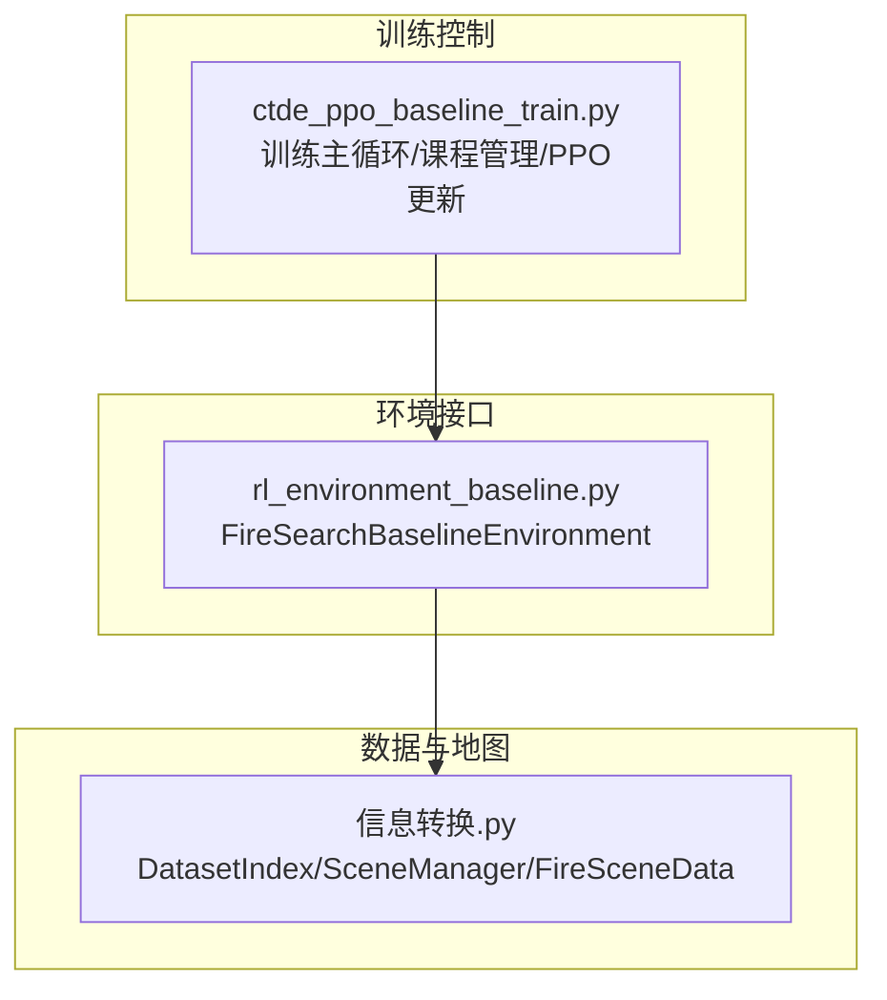
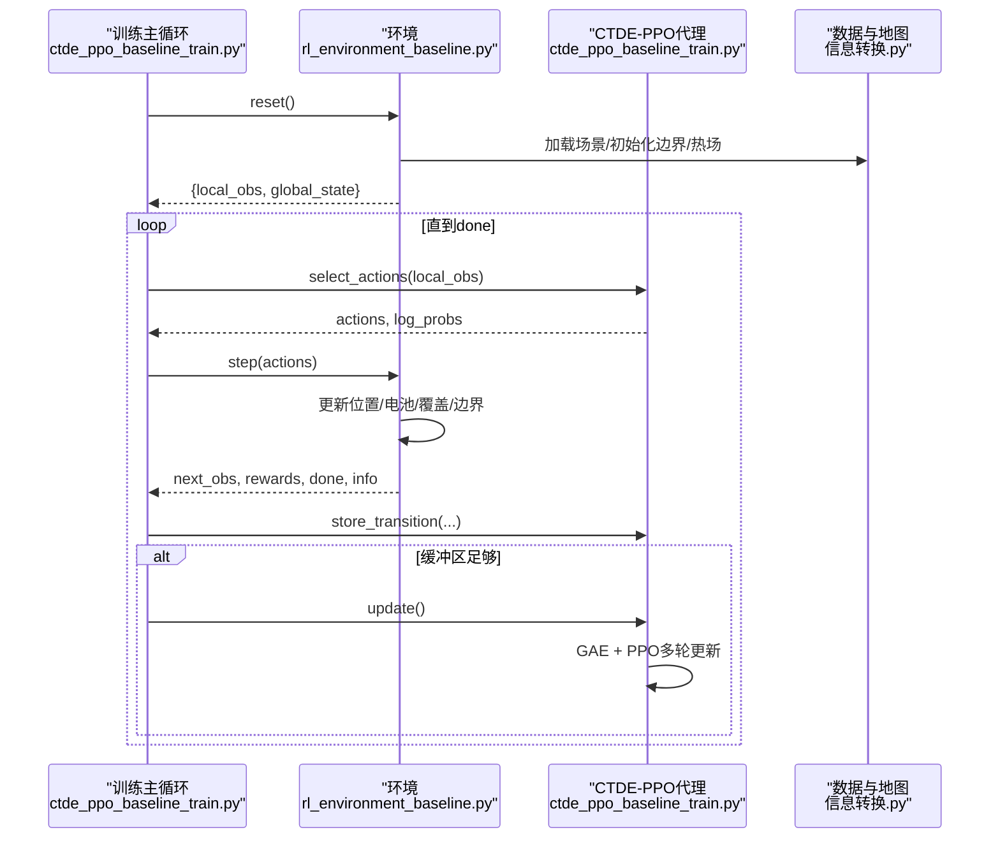
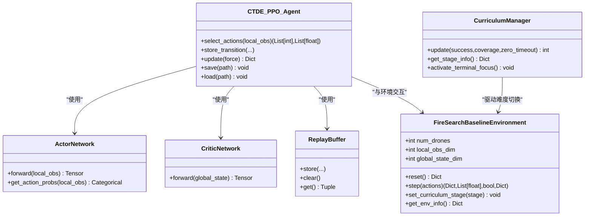
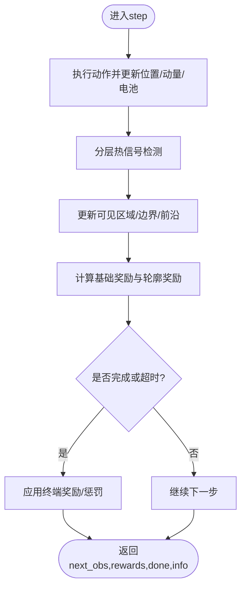
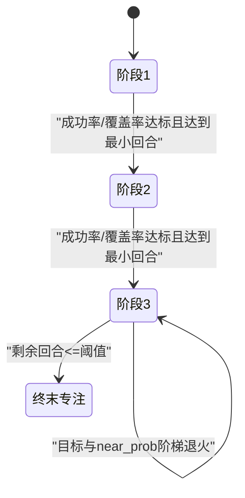
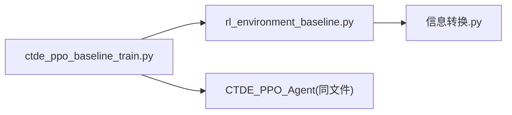

# 分布式决策框架

<cite>
**本文引用的文件**   
- [ctde_ppo_baseline_train.py](file://environment_variables/environment_variables/ctde_ppo_baseline_train.py)
- [rl_environment_baseline.py](file://environment_variables/environment_variables/rl_environment_baseline.py)
- [信息转换.py](file://environment_variables/environment_variables/信息转换.py)
</cite>

## 目录
1. [简介](#简介)
2. [项目结构](#项目结构)
3. [核心组件](#核心组件)
4. [架构总览](#架构总览)
5. [详细组件分析](#详细组件分析)
6. [依赖关系分析](#依赖关系分析)
7. [性能与扩展性](#性能与扩展性)
8. [故障排查指南](#故障排查指南)
9. [结论](#结论)
10. [附录：使用示例与最佳实践](#附录使用示例与最佳实践)

## 简介
本技术文档围绕“集中式训练、去中心化执行”（CTDE）的分布式多智能体决策框架展开，聚焦于以下目标：
- 解释CTDE模式在代码中的实现细节：集中式训练时全局状态共享、去中心化执行时仅用局部观测。
- 梳理完整决策循环：观测获取、动作选择、状态更新、奖励计算。
- 阐述多智能体协调机制：信息共享策略、决策同步、冲突解决。
- 说明分布式环境下的可扩展性设计：支持2架或多架无人机的动态配置。
- 提供初始化、参数配置与性能监控的实践指引。
- 给出容错处理与性能优化建议。

## 项目结构
仓库中与分布式决策相关的核心代码位于 environment_variables/environment_variables 目录下，关键文件如下：
- ctde_ppo_baseline_train.py：CTDE-PPO基线训练脚本，包含课程学习管理、PPO更新、评估与可视化调用等。
- rl_environment_baseline.py：Gymnasium风格的多无人机火场边界搜索环境，定义观测空间、全局状态、动作空间、奖励函数与步进逻辑。
- 信息转换.py：场景数据索引与加载、栅格/矢量数据处理、热场与边界检测等底层数据工具。

图表来源
- [ctde_ppo_baseline_train.py:1277-1600](file://environment_variables/environment_variables/ctde_ppo_baseline_train.py#L1277-L1600)
- [rl_environment_baseline.py:21-158](file://environment_variables/environment_variables/rl_environment_baseline.py#L21-L158)
- [信息转换.py:20-122](file://environment_variables/environment_variables/信息转换.py#L20-L122)

章节来源
- [ctde_ppo_baseline_train.py:1277-1600](file://environment_variables/environment_variables/ctde_ppo_baseline_train.py#L1277-L1600)
- [rl_environment_baseline.py:21-158](file://environment_variables/environment_variables/rl_environment_baseline.py#L21-L158)
- [信息转换.py:20-122](file://environment_variables/environment_variables/信息转换.py#L20-L122)

## 核心组件
- FireSearchBaselineEnvironment：实现多智能体环境的reset/step接口，维护每架无人机的局部观测与团队全局状态，负责动作执行、电池消耗、边界发现、覆盖率统计与终止判定。
- CTDE_PPO_Agent：实现Actor-Critic网络、经验回放、GAE优势估计与PPO多轮小批量更新；支持KL自适应学习率。
- CurriculumManager：三阶段课程学习，自动调整初始位置分布难度、目标成功率与近界生成概率，并支持终末专注阶段。
- DatasetIndex/SceneManager/FireSceneData：负责数据集索引、场景加载、边界初始化、热势场计算与动态边界更新。

章节来源
- [rl_environment_baseline.py:21-158](file://environment_variables/environment_variables/rl_environment_baseline.py#L21-L158)
- [ctde_ppo_baseline_train.py:569-757](file://environment_variables/environment_variables/ctde_ppo_baseline_train.py#L569-L757)
- [ctde_ppo_baseline_train.py:758-1014](file://environment_variables/environment_variables/ctde_ppo_baseline_train.py#L758-L1014)
- [信息转换.py:20-122](file://environment_variables/environment_variables/信息转换.py#L20-L122)

## 架构总览
下图展示了CTDE训练流程中各模块的交互关系与控制流。

图表来源
- [ctde_ppo_baseline_train.py:1469-1600](file://environment_variables/environment_variables/ctde_ppo_baseline_train.py#L1469-L1600)
- [rl_environment_baseline.py:842-992](file://environment_variables/environment_variables/rl_environment_baseline.py#L842-L992)
- [信息转换.py:451-520](file://environment_variables/environment_variables/信息转换.py#L451-L520)

## 详细组件分析

### CTDE模式与观测/状态设计
- 局部观测（per-agent）：每架无人机基于自身位置、电池、地形风场、热梯度、动量、相机方向等特征构建向量，维度由observation_profile决定。
- 全局状态（team-level）：汇总覆盖率、平均/最低电量、团队质心与分散度、距火中心距离、步数进度、已访问比例、课程阶段、风速/高程均值、低电量指示、无人机数量、覆盖率梯度与未探索密度等。
- 训练时Critic使用全局状态进行价值估计；执行时Actor仅依赖局部观测，满足去中心化部署需求。

图表来源
- [rl_environment_baseline.py:21-158](file://environment_variables/environment_variables/rl_environment_baseline.py#L21-L158)
- [ctde_ppo_baseline_train.py:460-535](file://environment_variables/environment_variables/ctde_ppo_baseline_train.py#L460-L535)
- [ctde_ppo_baseline_train.py:537-567](file://environment_variables/environment_variables/ctde_ppo_baseline_train.py#L537-L567)
- [ctde_ppo_baseline_train.py:758-1014](file://environment_variables/environment_variables/ctde_ppo_baseline_train.py#L758-L1014)
- [ctde_ppo_baseline_train.py:569-757](file://environment_variables/environment_variables/ctde_ppo_baseline_train.py#L569-L757)

章节来源
- [rl_environment_baseline.py:565-658](file://environment_variables/environment_variables/rl_environment_baseline.py#L565-L658)
- [ctde_ppo_baseline_train.py:460-535](file://environment_variables/environment_variables/ctde_ppo_baseline_train.py#L460-L535)
- [ctde_ppo_baseline_train.py:504-535](file://environment_variables/environment_variables/ctde_ppo_baseline_train.py#L504-L535)

### 决策流程（观测→动作→状态→奖励）
- 观测获取：环境根据当前无人机位置、传感器半径与地图数据构造每个智能体的局部观测，同时聚合团队级全局状态。
- 动作选择：Actor对每个智能体的局部观测输出离散动作分布，采样得到动作序列。
- 状态更新：环境按动作移动无人机，考虑风向影响与电池消耗，更新已访问区域、可见边界点与前沿面。
- 奖励计算：组合发现边界、覆盖率增量、探索引导、重复惩罚、空闲惩罚、队内间距惩罚、终端奖励/超时惩罚等。

图表来源
- [rl_environment_baseline.py:842-992](file://environment_variables/environment_variables/rl_environment_baseline.py#L842-L992)
- [rl_environment_baseline.py:692-806](file://environment_variables/environment_variables/rl_environment_baseline.py#L692-L806)
- [rl_environment_baseline.py:808-841](file://environment_variables/environment_variables/rl_environment_baseline.py#L808-L841)

章节来源
- [rl_environment_baseline.py:842-992](file://environment_variables/environment_variables/rl_environment_baseline.py#L842-L992)
- [rl_environment_baseline.py:692-806](file://environment_variables/environment_variables/rl_environment_baseline.py#L692-L806)

### 多智能体协调机制
- 信息共享策略：训练时Critic接收全局状态（覆盖率、团队质心、分散度、平均/最低电量、距火距离、步数进度等），用于稳定价值估计；执行时不依赖全局状态。
- 决策同步机制：每步统一为所有无人机采样动作，随后环境并行推进，保证时间步对齐。
- 冲突解决协议：通过队内间距惩罚避免无人机过于聚集；重复访问与空闲行为施加负奖励以鼓励探索与前进；终端阶段按任务成功与否分配团队共享的终端奖励/惩罚。

章节来源
- [rl_environment_baseline.py:565-658](file://environment_variables/environment_variables/rl_environment_baseline.py#L565-L658)
- [rl_environment_baseline.py:746-755](file://environment_variables/environment_variables/rl_environment_baseline.py#L746-L755)
- [rl_environment_baseline.py:948-962](file://environment_variables/environment_variables/rl_environment_baseline.py#L948-L962)

### 课程学习与难度调度
- 三阶段课程：阶段1快速建立基础能力（少量边界发现即结束），阶段2提升覆盖率目标，阶段3进一步逼近最终目标成功率。
- 难度调节：逐步提高初始位置百分位（远离火区）、降低近界生成概率、提升目标阈值；最后N回合强制进入“终末专注”，锁定最终难度。
- 环境同步：当课程阶段或难度变化时，立即同步到环境参数，并在必要时触发一次强制更新以保证策略适应新难度。

图表来源
- [ctde_ppo_baseline_train.py:569-757](file://environment_variables/environment_variables/ctde_ppo_baseline_train.py#L569-L757)
- [ctde_ppo_baseline_train.py:1469-1600](file://environment_variables/environment_variables/ctde_ppo_baseline_train.py#L1469-L1600)

章节来源
- [ctde_ppo_baseline_train.py:569-757](file://environment_variables/environment_variables/ctde_ppo_baseline_train.py#L569-L757)
- [ctde_ppo_baseline_train.py:1469-1600](file://environment_variables/environment_variables/ctde_ppo_baseline_train.py#L1469-L1600)

### PPO更新与KL自适应
- 优势估计：基于团队平均奖励与Critic全局价值估计，采用GAE计算优势与回报。
- 多轮小批量更新：对缓冲区内样本打乱并按mini-batch迭代，分别更新Critic与Actor，记录近似KL与裁剪比例。
- KL自适应学习率：根据KL指数滑动平均与目标KL动态调整Actor学习率，防止策略退化。

章节来源
- [ctde_ppo_baseline_train.py:867-991](file://environment_variables/environment_variables/ctde_ppo_baseline_train.py#L867-L991)

### 数据与地图管线
- 数据集索引：通过dataset_index.json组织train/validation/generalization/stress划分，支持别名归一化与路径解析。
- 场景加载：SceneManager按模式随机或固定选取场景，初始化t=0边界、计算热势场、缓存严重度图。
- 动态边界：每隔若干步重新检测边界并更新热力场，确保环境随仿真时间演化。

章节来源
- [信息转换.py:20-122](file://environment_variables/environment_variables/信息转换.py#L20-L122)
- [rl_environment_baseline.py:159-207](file://environment_variables/environment_variables/rl_environment_baseline.py#L159-L207)
- [rl_environment_baseline.py:927-941](file://environment_variables/environment_variables/rl_environment_baseline.py#L927-L941)

## 依赖关系分析
- 训练脚本依赖环境与数据模块，并通过课程管理器驱动环境难度。
- 环境依赖数据模块提供的场景与栅格/矢量数据，内部维护状态机与奖励逻辑。
- 代理模块依赖PyTorch张量运算与分布采样，独立于具体环境实现。

图表来源
- [ctde_ppo_baseline_train.py:1277-1600](file://environment_variables/environment_variables/ctde_ppo_baseline_train.py#L1277-L1600)
- [rl_environment_baseline.py:21-158](file://environment_variables/environment_variables/rl_environment_baseline.py#L21-L158)
- [信息转换.py:20-122](file://environment_variables/environment_variables/信息转换.py#L20-L122)

章节来源
- [ctde_ppo_baseline_train.py:1277-1600](file://environment_variables/environment_variables/ctde_ppo_baseline_train.py#L1277-L1600)
- [rl_environment_variables/rl_environment_baseline.py:21-158](file://environment_variables/environment_variables/rl_environment_baseline.py#L21-L158)
- [信息转换.py:20-122](file://environment_variables/environment_variables/信息转换.py#L20-L122)

## 性能与扩展性
- 批大小与子批次：默认batch_size较大，按mini_batch_size切分以提升吞吐；可根据GPU显存调整。
- 设备选择：自动检测CUDA可用性，优先使用GPU；可手动指定设备。
- 数值稳定性：LayerNorm与正交初始化、梯度裁剪、KL自适应学习率共同保障训练稳定。
- 可扩展至多无人机：num_drones参数控制智能体数量；全局状态中包含无人机数量与团队统计量，便于策略泛化。
- 动态场景规模：支持不同地图尺寸与传感器半径，通过use_metadata_uav_params可从元数据读取场景特定参数。

章节来源
- [ctde_ppo_baseline_train.py:801-822](file://environment_variables/environment_variables/ctde_ppo_baseline_train.py#L801-L822)
- [ctde_ppo_baseline_train.py:867-991](file://environment_variables/environment_variables/ctde_ppo_baseline_train.py#L867-L991)
- [rl_environment_baseline.py:49-107](file://environment_variables/environment_variables/rl_environment_baseline.py#L49-L107)

## 故障排查指南
- 热健康检查失败：训练前会收集各场景的热健康指标，若超过阈值将抛出异常，需检查数据质量或调整初始化难度。
- 课程阶段无法推进：检查成功率、覆盖率与零覆盖超时率是否达到门槛；必要时调整stage_min_episodes或阈值。
- 训练不稳定：观察approx_kl与clip_fraction，若KL过大则启用KL自适应或降低actor_lr；适当增大max_grad_norm或减小entropy_coef。
- 内存不足：减小batch_size或mini_batch_size，减少ppo_epochs或缩短max_steps。

章节来源
- [ctde_ppo_baseline_train.py:1250-1276](file://environment_variables/environment_variables/ctde_ppo_baseline_train.py#L1250-L1276)
- [ctde_ppo_baseline_train.py:1277-1315](file://environment_variables/environment_variables/ctde_ppo_baseline_train.py#L1277-L1315)
- [ctde_ppo_baseline_train.py:867-991](file://environment_variables/environment_variables/ctde_ppo_baseline_train.py#L867-L991)

## 结论
该框架以CTDE为核心，实现了“训练时全局信息辅助、执行时仅用局部观测”的分布式多智能体决策范式。通过课程学习、KL自适应与稳健的奖励设计，系统在多无人机协同探测火场边界的任务上具备良好的收敛性与鲁棒性。数据管线与场景动态更新保证了仿真环境的真实性与多样性，为后续扩展到更大规模集群与更复杂任务奠定基础。

## 附录：使用示例与最佳实践
- 初始化多无人机环境
  - 设置num_drones为期望的无人机数量（如2）。
  - 选择observation_profile与reward_profile，确保维度匹配。
  - 可选use_metadata_uav_params从场景元数据读取sensor_radius_cells与max_steps。
- 配置分布式参数
  - actor_lr/critic_lr、gamma/gae_lambda、clip_epsilon、entropy_coef/value_coef、max_grad_norm、ppo_epochs、batch_size。
  - lr_adapt_mode设为kl以启用KL自适应；target_kl、actor_lr_min/max、kl_ema_beta、kl_lr_alpha配合调参。
- 监控决策性能
  - 关注滚动奖励、覆盖率、成功率、任务得分、超时率与零覆盖超时率。
  - 记录approx_kl、clip_fraction、actor_lr变化，评估策略稳定性。
  - 使用训练日志与生成的图表进行诊断。
- 容错与健壮性
  - 利用热健康检查提前发现数据问题。
  - 课程阶段切换时触发强制更新，避免策略滞后。
  - 终端阶段锁定最终难度，提升最终性能上限。
- 性能优化建议
  - 合理设置batch_size与mini_batch_size，平衡吞吐与显存占用。
  - 使用LayerNorm与梯度裁剪提升稳定性。
  - 根据KL反馈动态调整学习率，避免策略崩溃。
  - 针对大规模场景，适当增加max_steps或调整vision_radius。

章节来源
- [ctde_ppo_baseline_train.py:98-158](file://environment_variables/environment_variables/ctde_ppo_baseline_train.py#L98-L158)
- [ctde_ppo_baseline_train.py:1277-1600](file://environment_variables/environment_variables/ctde_ppo_baseline_train.py#L1277-L1600)
- [rl_environment_baseline.py:49-107](file://environment_variables/environment_variables/rl_environment_baseline.py#L49-L107)