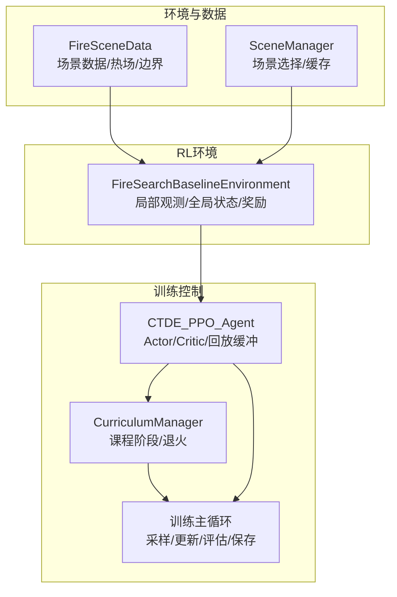
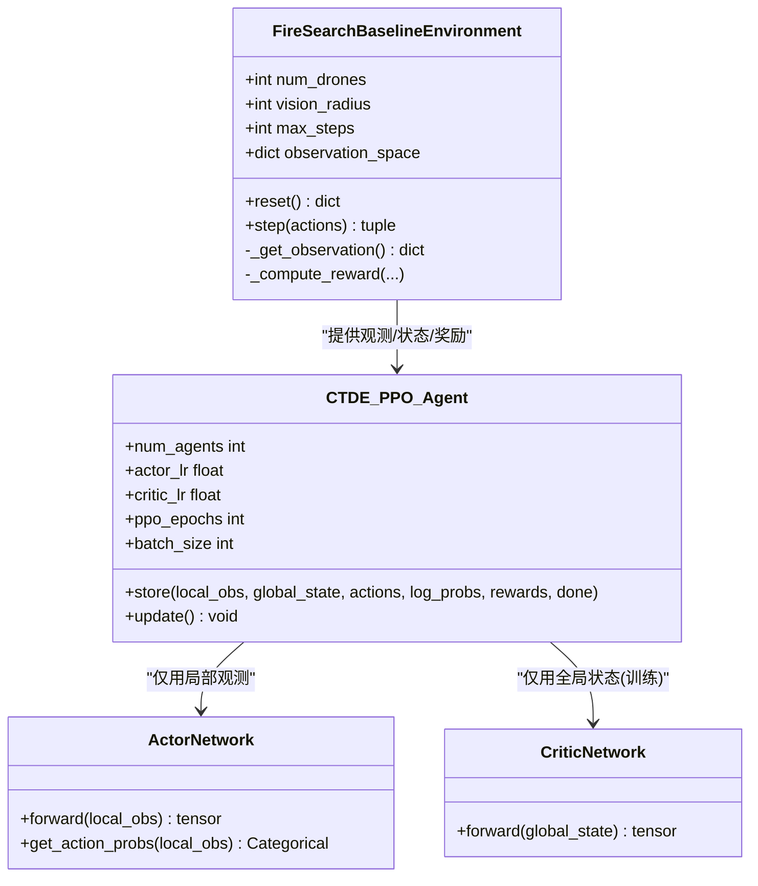
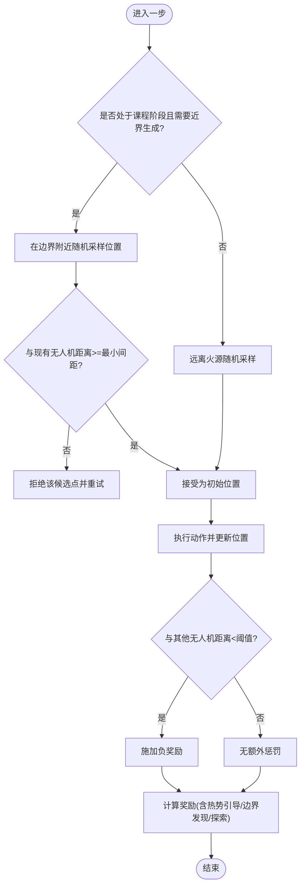
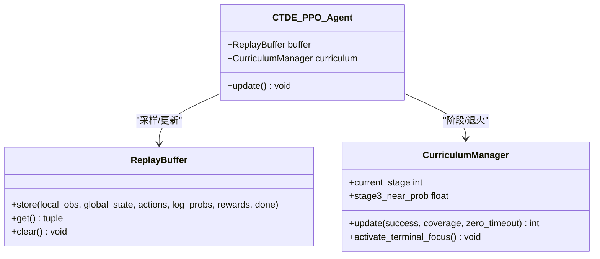
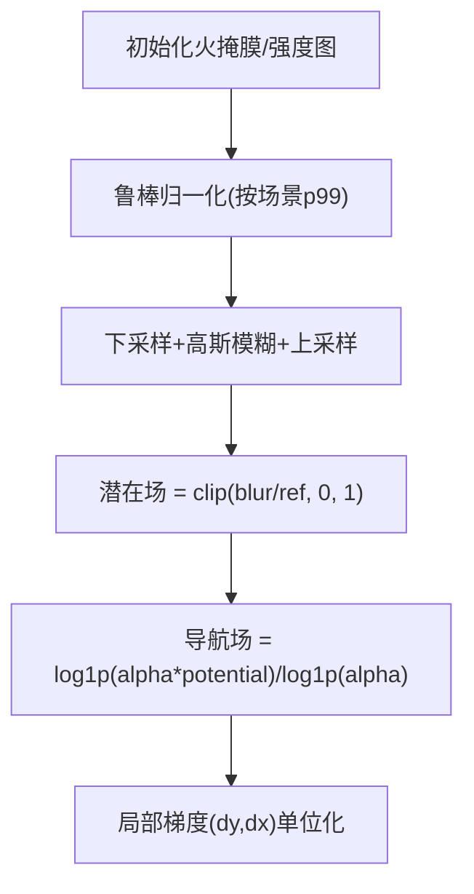
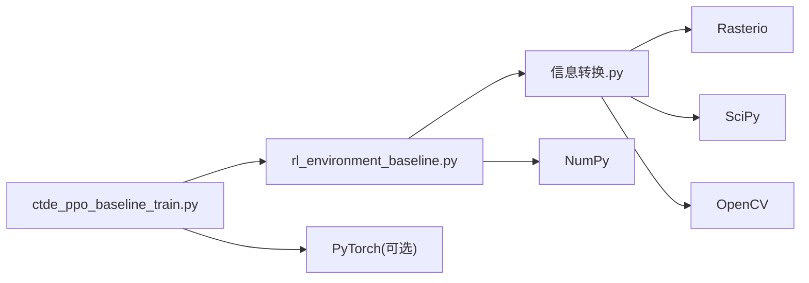

# 无人机协同机制

<cite>
**本文引用的文件**   
- [ctde_ppo_baseline_train.py](file://environment_variables/environment_variables/ctde_ppo_baseline_train.py)
- [rl_environment_baseline.py](file://environment_variables/environment_variables/rl_environment_baseline.py)
- [信息转换.py](file://environment_variables/environment_variables/信息转换.py)
- [requirements.txt](file://environment_variables/requirements.txt)
</cite>

## 目录
1. [引言](#引言)
2. [项目结构](#项目结构)
3. [核心组件](#核心组件)
4. [架构总览](#架构总览)
5. [详细组件分析](#详细组件分析)
6. [依赖关系分析](#依赖关系分析)
7. [性能与可扩展性](#性能与可扩展性)
8. [故障排查指南](#故障排查指南)
9. [结论](#结论)
10. [附录：配置与使用示例路径](#附录配置与使用示例路径)

## 引言
本技术文档面向多无人机协同搜索任务，围绕以下目标展开：
- 通信协议设计：明确局部观测与全局状态的分离架构，解释训练期集中式信息与执行期去中心化决策的边界。
- 任务分配策略：阐述基于热势梯度的动态引导与冲突避免机制（最小间距约束、视觉半径内惩罚）。
- 碰撞检测系统：说明最小间距约束与视觉半径内的冲突解决逻辑。
- 分布式决策框架：给出CTDE（集中式训练、去中心化执行）的实现细节与数据流。
- 实践指导：提供环境配置、协作参数设置与协同性能监控的路径指引，并给出优化建议与调试技巧。

## 项目结构
仓库以“基线环境 + CTDE-PPO训练脚本 + 场景数据加载”为核心组织方式：
- 环境与数据层：封装FARSITE场景数据加载、归一化、热场构建、边界提取等能力。
- 训练与控制层：实现CTDE-PPO算法、课程学习、日志与评估流程。
- 输出与产物：训练日志、指标曲线、模型权重与评估结果。



图表来源
- [rl_environment_baseline.py:21-158](file://environment_variables/environment_variables/rl_environment_baseline.py#L21-L158)
- [信息转换.py:219-322](file://environment_variables/environment_variables/信息转换.py#L219-L322)
- [ctde_ppo_baseline_train.py:759-800](file://environment_variables/environment_variables/ctde_ppo_baseline_train.py#L759-L800)

章节来源
- [rl_environment_baseline.py:21-158](file://environment_variables/environment_variables/rl_environment_baseline.py#L21-L158)
- [信息转换.py:219-322](file://environment_variables/environment_variables/信息转换.py#L219-L322)
- [ctde_ppo_baseline_train.py:98-158](file://environment_variables/environment_variables/ctde_ppo_baseline_train.py#L98-L158)

## 核心组件
- FireSceneData：负责场景栅格数据加载、风场/地形/强度等特征归一化、t=0或按面积百分位初始化火边界、构建热势场与导航场、计算局部热梯度与邻域统计。
- SceneManager：按train/validation/generalization/stress划分随机选取场景，并提供共享缓存避免重复IO与重算。
- FireSearchBaselineEnvironment：Gymnasium风格的多无人机环境，维护局部观测与全局状态、动作执行、可见区域标记、边界覆盖率、奖励分解与终止条件。
- CTDE_PPO_Agent：包含Actor（仅用局部观测）、Critic（仅用全局状态）、PPO超参、KL自适应学习率、回放缓冲与训练步骤。
- CurriculumManager：三阶段课程学习，控制初始火面积百分比、近界生成概率与目标成功率阶梯提升。

章节来源
- [信息转换.py:219-322](file://environment_variables/environment_variables/信息转换.py#L219-L322)
- [信息转换.py:759-820](file://environment_variables/environment_variables/信息转换.py#L759-L820)
- [信息转换.py:821-900](file://environment_variables/environment_variables/信息转换.py#L821-L900)
- [信息转换.py:933-970](file://environment_variables/environment_variables/信息转换.py#L933-L970)
- [信息转换.py:1282-1327](file://environment_variables/environment_variables/信息转换.py#L1282-L1327)
- [rl_environment_baseline.py:21-158](file://environment_variables/environment_variables/rl_environment_baseline.py#L21-L158)
- [ctde_ppo_baseline_train.py:759-800](file://environment_variables/environment_variables/ctde_ppo_baseline_train.py#L759-L800)
- [ctde_ppo_baseline_train.py:569-758](file://environment_variables/environment_variables/ctde_ppo_baseline_train.py#L569-L758)

## 架构总览
下图展示CTDE模式下的数据流与职责边界：训练期Critic可访问全局状态，执行期Agent仅依据局部观测输出动作；环境负责将局部观测与全局状态解耦输出，并在内部完成热势梯度、边界覆盖与冲突惩罚等计算。

```mermaid
sequenceDiagram
participant Env as "FireSearchBaselineEnvironment"
participant Agent as "CTDE_PPO_Agent"
participant Actor as "ActorNetwork(局部观测)"
participant Critic as "CriticNetwork(全局状态)"
participant Data as "FireSceneData/SceneManager"
loop 每步交互
Env->>Data : 读取场景/热场/边界/风场
Env-->>Agent : 返回{local_obs, global_state}
Agent->>Actor : 输入local_obs
Actor-->>Agent : 离散动作a_i
Agent->>Env : 批量动作[a_1..a_N]
Env->>Env : 执行动作/更新位置/可见区域/边界发现
Env->>Env : 计算奖励(含冲突惩罚/热势引导)
Env-->>Agent : 奖励r_i, done, info
Agent->>Critic : 输入global_state(训练期)
Critic-->>Agent : 价值估计V(s)
Agent->>Agent : PPO更新(Actor/Critic/回放缓冲)
end
```

图表来源
- [rl_environment_baseline.py:565-658](file://environment_variables/environment_variables/rl_environment_baseline.py#L565-L658)
- [ctde_ppo_baseline_train.py:460-535](file://environment_variables/environment_variables/ctde_ppo_baseline_train.py#L460-L535)
- [ctde_ppo_baseline_train.py:537-567](file://environment_variables/environment_variables/ctde_ppo_baseline_train.py#L537-L567)

## 详细组件分析

### 通信协议与观测/状态分离
- 局部观测（per-drone）：包含自身坐标、电池、局部热力特征、风向风速、DEM坡度、热势梯度方向、动量、相机指向等，维度随observation_profile变化。
- 全局状态（centralized）：包含覆盖率、平均/最低电量、团队质心与散布、距火平均距离、时间进度、已访问比例、课程阶段、平均风/高程、已发现边界占比、低电量指示、无人机数量、覆盖率梯度、未探索密度等。
- 训练期：Critic接收全局状态用于价值估计；执行期：Actor仅接收局部观测进行推理，满足CTDE假设。



图表来源
- [rl_environment_baseline.py:21-158](file://environment_variables/environment_variables/rl_environment_baseline.py#L21-L158)
- [ctde_ppo_baseline_train.py:460-535](file://environment_variables/environment_variables/ctde_ppo_baseline_train.py#L460-L535)
- [ctde_ppo_baseline_train.py:537-567](file://environment_variables/environment_variables/ctde_ppo_baseline_train.py#L537-L567)

章节来源
- [rl_environment_baseline.py:565-658](file://environment_variables/environment_variables/rl_environment_baseline.py#L565-L658)
- [ctde_ppo_baseline_train.py:460-535](file://environment_variables/environment_variables/ctde_ppo_baseline_train.py#L460-L535)

### 任务分配策略：热势梯度引导与冲突避免
- 热势梯度引导：通过log压缩的导航场计算局部梯度，作为弱引导信号，鼓励向高热力区域移动；在尚未发现边界时，对热势增量给予正向奖励。
- 动态任务分配：并非显式中心式分配器，而是通过“热势梯度+覆盖率反馈+课程退火”形成隐式分工：靠近边界的无人机更易获得边界发现奖励，远离者被热势梯度吸引。
- 冲突避免机制：
  - 最小间距约束：在生成初始位置时拒绝与已有无人机过近的候选点。
  - 视觉半径内惩罚：若相邻无人机距离小于阈值（与vision_radius相关），施加负奖励，抑制聚集。



图表来源
- [rl_environment_baseline.py:362-436](file://environment_variables/environment_variables/rl_environment_baseline.py#L362-L436)
- [rl_environment_baseline.py:746-767](file://environment_variables/environment_variables/rl_environment_baseline.py#L746-L767)
- [信息转换.py:933-970](file://environment_variables/environment_variables/信息转换.py#L933-L970)

章节来源
- [rl_environment_baseline.py:362-436](file://environment_variables/environment_variables/rl_environment_baseline.py#L362-L436)
- [rl_environment_baseline.py:746-767](file://environment_variables/environment_variables/rl_environment_baseline.py#L746-L767)
- [信息转换.py:933-970](file://environment_variables/environment_variables/信息转换.py#L933-L970)

### 碰撞检测系统：最小间距与视觉半径
- 最小间距约束：在初始化阶段，若候选位置与任一已有无人机距离小于“vision_radius×0.8”，则拒绝该位置，避免初始重叠。
- 视觉半径内冲突解决：在执行后，若新位置与任何同伴距离小于“vision_radius×0.8”，施加负奖励，促使智能体自发分散。
- 该机制不引入硬约束或强制避让轨迹，而是通过强化学习的奖励塑形实现软约束，利于端到端学习。

章节来源
- [rl_environment_baseline.py:417-419](file://environment_variables/environment_variables/rl_environment_baseline.py#L417-L419)
- [rl_environment_baseline.py:746-754](file://environment_variables/environment_variables/rl_environment_baseline.py#L746-L754)

### 分布式决策框架：CTDE实现细节
- Actor网络：仅以局部观测为输入，输出离散动作分布；Critic网络：仅以全局状态为输入，输出标量价值。
- 回放缓冲：存储每步的(local_obs, global_state, action, log_prob, reward, done)，支持PPO小批量更新。
- KL自适应学习率：根据近似KL散度与目标KL调整Actor学习率，稳定训练。
- 课程管理：分阶段推进初始火面积百分比、近界生成概率与目标成功率，逐步提高难度。



图表来源
- [ctde_ppo_baseline_train.py:537-567](file://environment_variables/environment_variables/ctde_ppo_baseline_train.py#L537-L567)
- [ctde_ppo_baseline_train.py:569-758](file://environment_variables/environment_variables/ctde_ppo_baseline_train.py#L569-L758)
- [ctde_ppo_baseline_train.py:759-800](file://environment_variables/environment_variables/ctde_ppo_baseline_train.py#L759-L800)

章节来源
- [ctde_ppo_baseline_train.py:537-567](file://environment_variables/environment_variables/ctde_ppo_baseline_train.py#L537-L567)
- [ctde_ppo_baseline_train.py:569-758](file://environment_variables/environment_variables/ctde_ppo_baseline_train.py#L569-L758)
- [ctde_ppo_baseline_train.py:759-800](file://environment_variables/environment_variables/ctde_ppo_baseline_train.py#L759-L800)

### 热势场与梯度计算
- 热势场构建：对火掩膜与强度图做鲁棒归一化、下采样+高斯模糊、上采样回原分辨率，再以99%分位数参考值进行缩放并裁剪至[0,1]。
- 导航场：对热势场进行log压缩，增强高值区梯度，便于梯度计算。
- 局部梯度：在导航场上采用中心差分计算dy/dx并单位化，得到热势梯度方向，供观测与奖励引导使用。



图表来源
- [信息转换.py:759-820](file://environment_variables/environment_variables/信息转换.py#L759-L820)
- [信息转换.py:933-970](file://environment_variables/environment_variables/信息转换.py#L933-L970)

章节来源
- [信息转换.py:759-820](file://environment_variables/environment_variables/信息转换.py#L759-L820)
- [信息转换.py:933-970](file://environment_variables/environment_variables/信息转换.py#L933-L970)

## 依赖关系分析
- 外部依赖：numpy、rasterio、matplotlib、scipy、opencv-python；可选torch、stable-baselines3、tensorboard。
- 模块耦合：
  - 训练脚本依赖环境与数据模块，并通过类名导入。
  - 环境依赖数据模块提供的场景、热场、边界与风场。
  - 课程管理与训练主循环共同驱动环境参数与学习率策略。



图表来源
- [ctde_ppo_baseline_train.py:30-34](file://environment_variables/environment_variables/ctde_ppo_baseline_train.py#L30-L34)
- [rl_environment_baseline.py:17-19](file://environment_variables/environment_variables/rl_environment_baseline.py#L17-L19)
- [requirements.txt:1-13](file://environment_variables/requirements.txt#L1-L13)

章节来源
- [requirements.txt:1-13](file://environment_variables/requirements.txt#L1-L13)
- [ctde_ppo_baseline_train.py:30-34](file://environment_variables/environment_variables/ctde_ppo_baseline_train.py#L30-L34)
- [rl_environment_baseline.py:17-19](file://environment_variables/environment_variables/rl_environment_baseline.py#L17-L19)

## 性能与可扩展性
- 场景缓存：SceneManager跨实例共享场景对象，减少重复IO与归一化计算，适合大规模评估。
- 热势场计算：先下采样再模糊，降低计算量；log压缩导航场提升梯度稳定性。
- 课程学习：渐进式增加难度，有助于收敛效率与稳定性。
- 可扩展点：
  - 观测profile扩展：可在环境中添加新的静态/动态特征分支。
  - 奖励profile扩展：支持前沿探测、严重度加权、平衡探索等多种奖励组合。
  - 通信扩展：可在全局状态中注入更多队形/通信拓扑信息，但需保持执行期不可见。

[本节为通用讨论，不直接分析具体文件]

## 故障排查指南
- 场景无效/空边界：当t=0或指定面积百分位的火边界为空时，会抛出异常；应检查数据集索引、栅格路径与元数据完整性。
- 热场健康诊断：可通过诊断函数检查饱和比例、高热区零梯度比例等指标，确保热势语义层正常。
- 训练日志定位：查看控制台日志中的初始化信息、课程阶段切换、KL与clip分数、成功率与覆盖率趋势，辅助定位学习率或奖励设计问题。

章节来源
- [信息转换.py:1329-1416](file://environment_variables/environment_variables/信息转换.py#L1329-L1416)
- [信息转换.py:972-1012](file://environment_variables/environment_variables/信息转换.py#L972-L1012)
- [ctde_ppo_baseline_train.py:237-248](file://environment_variables/environment_variables/ctde_ppo_baseline_train.py#L237-L248)

## 结论
本项目实现了基于CTDE的多无人机协同搜索基线：通过局部观测与全局状态分离、热势梯度引导与冲突惩罚、以及课程学习，使无人机在复杂火场环境中具备高效探索与边界覆盖能力。工程层面提供了完整的数据加载、场景管理与训练评估管线，具备良好的可扩展性与可复现性。

[本节为总结，不直接分析具体文件]

## 附录：配置与使用示例路径
- 多无人机环境配置与协作参数
  - 环境初始化与参数校验：[rl_environment_baseline.py:49-158](file://environment_variables/environment_variables/rl_environment_baseline.py#L49-L158)
  - 默认训练配置与键值校验：[ctde_ppo_baseline_train.py:98-158](file://environment_variables/environment_variables/ctde_ppo_baseline_train.py#L98-L158)
  - 观测/奖励profile维度与枚举：[rl_environment_baseline.py:24-47](file://environment_variables/environment_variables/rl_environment_baseline.py#L24-L47)
- 监控协同性能
  - 训练日志输出与指标字段：[ctde_ppo_baseline_train.py:237-248](file://environment_variables/environment_variables/ctde_ppo_baseline_train.py#L237-L248)
  - 质量指标与收敛效率计算：[ctde_ppo_baseline_train.py:358-433](file://environment_variables/environment_variables/ctde_ppo_baseline_train.py#L358-L433)
- 热势梯度与冲突避免
  - 热势场与导航场构建：[信息转换.py:759-820](file://environment_variables/environment_variables/信息转换.py#L759-L820)
  - 局部梯度计算：[信息转换.py:933-970](file://environment_variables/environment_variables/信息转换.py#L933-L970)
  - 冲突惩罚与最小间距：[rl_environment_baseline.py:417-419](file://environment_variables/environment_variables/rl_environment_baseline.py#L417-L419), [rl_environment_baseline.py:746-754](file://environment_variables/environment_variables/rl_environment_baseline.py#L746-L754)
- 依赖与环境
  - 依赖清单：[requirements.txt:1-13](file://environment_variables/requirements.txt#L1-L13)