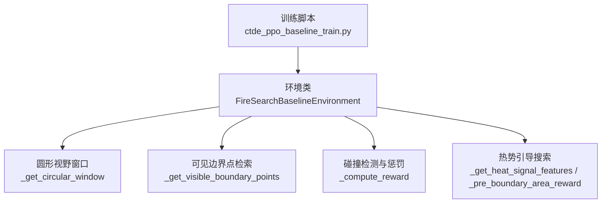
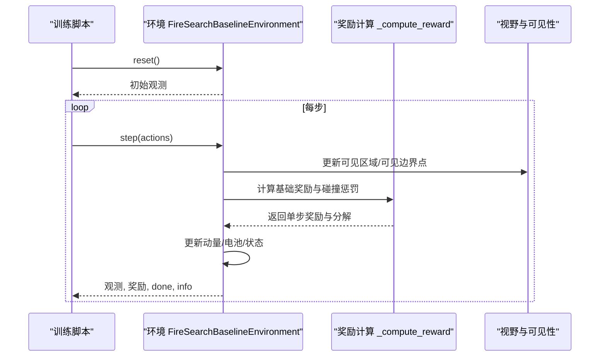
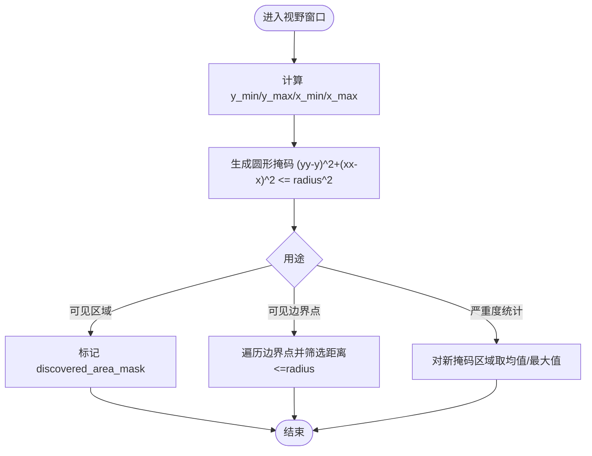
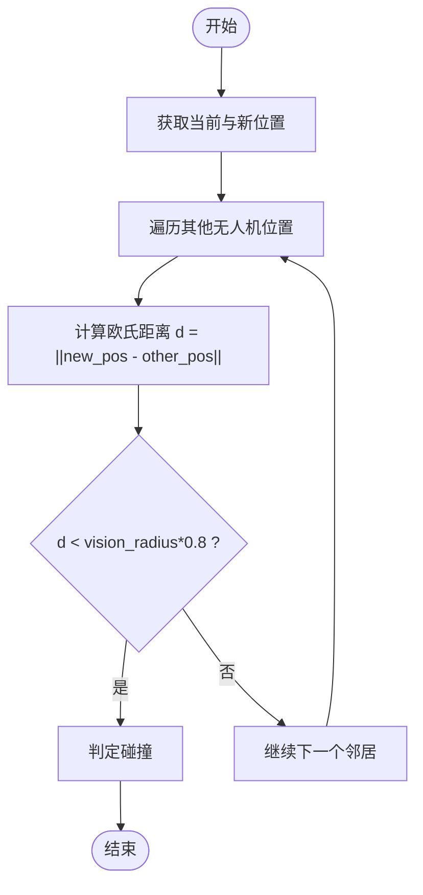
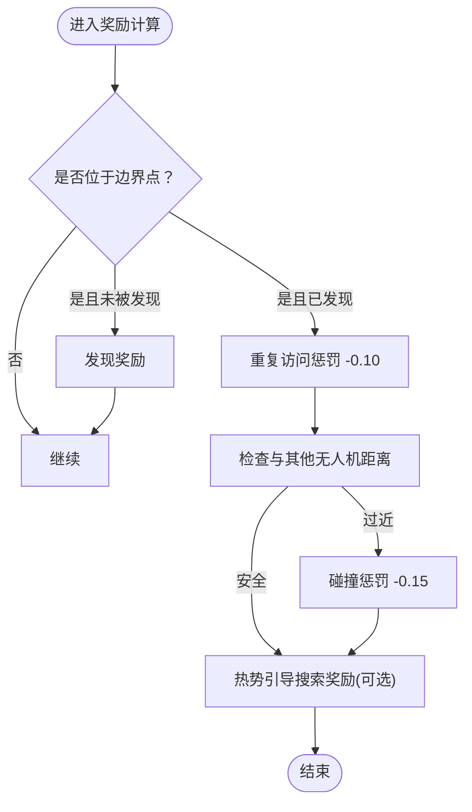
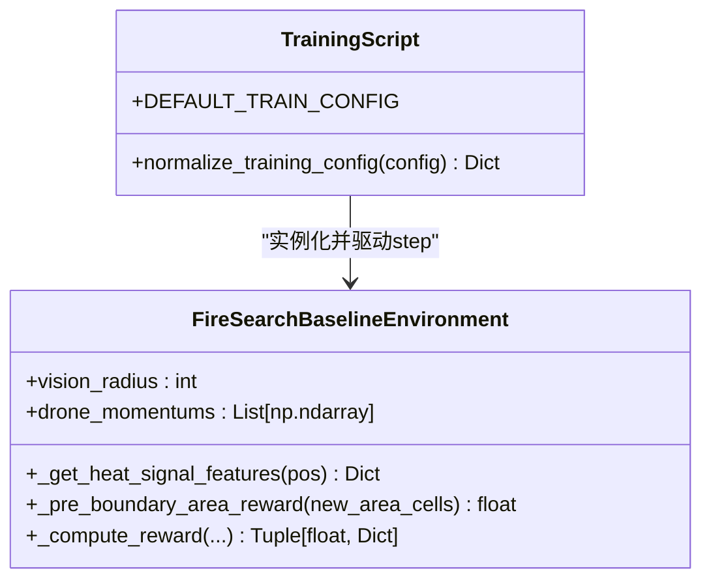
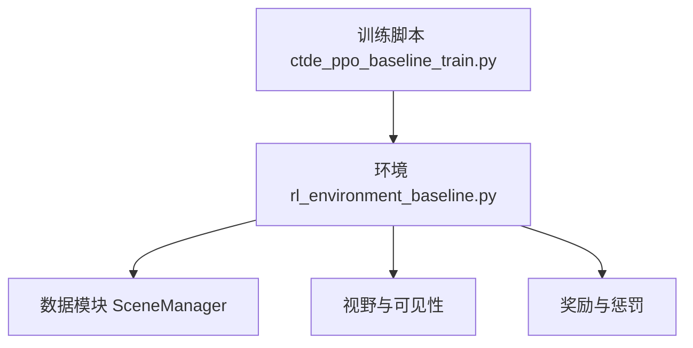

# 碰撞检测系统

<cite>
**本文引用的文件**   
- [ctde_ppo_baseline_train.py](file://environment_variables/environment_variables/ctde_ppo_baseline_train.py)
- [rl_environment_baseline.py](file://environment_variables/environment_variables/rl_environment_baseline.py)
</cite>

## 目录
1. [简介](#简介)
2. [项目结构](#项目结构)
3. [核心组件](#核心组件)
4. [架构总览](#架构总览)
5. [详细组件分析](#详细组件分析)
6. [依赖关系分析](#依赖关系分析)
7. [性能考量](#性能考量)
8. [故障排查指南](#故障排查指南)
9. [结论](#结论)
10. [附录](#附录)

## 简介
本技术文档聚焦于无人机多机协同火场边界搜索环境中的“碰撞检测与避免”子系统。围绕以下目标展开：
- 碰撞检测算法实现原理：欧几里得距离计算、圆形视野模型
- 最小间距约束机制：默认安全距离 vision_radius * 0.8 及可配置碰撞阈值
- 碰撞惩罚机制：碰撞惩罚奖励 -0.15，重复访问惩罚 -0.10
- 碰撞避免策略：基于动量的方向调整、基于热力场的路径规划
- 参数配置示例：如何设置碰撞检测参数、安全距离与惩罚权重
- 碰撞事件统计分析与碰撞率优化建议

## 项目结构
本项目包含训练脚本与环境定义两个关键模块：
- 训练脚本负责加载环境、组织训练循环、记录指标与日志
- 环境定义了观测空间、动作空间、视野模型、碰撞检测与奖励函数等

图表来源
- [ctde_ppo_baseline_train.py:98-158](file://environment_variables/environment_variables/ctde_ppo_baseline_train.py#L98-L158)
- [rl_environment_baseline.py:21-108](file://environment_variables/environment_variables/rl_environment_baseline.py#L21-L108)
- [rl_environment_baseline.py:259-267](file://environment_variables/environment_variables/rl_environment_baseline.py#L259-L267)
- [rl_environment_baseline.py:306-318](file://environment_variables/environment_variables/rl_environment_baseline.py#L306-L318)
- [rl_environment_baseline.py:692-767](file://environment_variables/environment_variables/rl_environment_baseline.py#L692-L767)
- [rl_environment_baseline.py:671-690](file://environment_variables/environment_variables/rl_environment_baseline.py#L671-L690)

章节来源
- [ctde_ppo_baseline_train.py:98-158](file://environment_variables/environment_variables/ctde_ppo_baseline_train.py#L98-L158)
- [rl_environment_baseline.py:21-108](file://environment_variables/environment_variables/rl_environment_baseline.py#L21-L108)

## 核心组件
- 圆形视野模型：以无人机当前位置为中心、半径为 vision_radius 的圆内区域作为局部感知范围，用于标记可见区域、统计新发现面积、筛选可见边界点等
- 碰撞检测：使用欧几里得距离判断当前无人机与其他无人机的相对位置是否小于安全阈值（默认 vision_radius * 0.8）
- 碰撞惩罚：当检测到碰撞时，施加 -0.15 的惩罚；对重复访问同一边界点施加 -0.10 的惩罚
- 避免策略：
  - 基于动量：将移动方向向量记录为动量并纳入观测，便于智能体学习惯性保持或转向
  - 基于热力场：在未发现边界前，依据热势增量给予弱引导奖励，鼓励向高热量区域探索

章节来源
- [rl_environment_baseline.py:259-267](file://environment_variables/environment_variables/rl_environment_baseline.py#L259-L267)
- [rl_environment_baseline.py:306-318](file://environment_variables/environment_variables/rl_environment_baseline.py#L306-L318)
- [rl_environment_baseline.py:417-419](file://environment_variables/environment_variables/rl_environment_baseline.py#L417-L419)
- [rl_environment_baseline.py:746-754](file://environment_variables/environment_variables/rl_environment_baseline.py#L746-L754)
- [rl_environment_baseline.py:742-744](file://environment_variables/environment_variables/rl_environment_baseline.py#L742-L744)
- [rl_environment_baseline.py:581-601](file://environment_variables/environment_variables/rl_environment_baseline.py#L581-L601)
- [rl_environment_baseline.py:756-766](file://environment_variables/environment_variables/rl_environment_baseline.py#L756-L766)

## 架构总览
下图展示了从训练脚本到环境内部的关键调用链，突出碰撞检测与避免在 step 流程中的位置。

图表来源
- [ctde_ppo_baseline_train.py:1146-1147](file://environment_variables/environment_variables/ctde_ppo_baseline_train.py#L1146-L1147)
- [ctde_ppo_baseline_train.py:1340](file://environment_variables/environment_variables/ctde_ppo_baseline_train.py#L1340)
- [rl_environment_baseline.py:842-992](file://environment_variables/environment_variables/rl_environment_baseline.py#L842-L992)
- [rl_environment_baseline.py:692-767](file://environment_variables/environment_variables/rl_environment_baseline.py#L692-L767)
- [rl_environment_baseline.py:259-267](file://environment_variables/environment_variables/rl_environment_baseline.py#L259-L267)
- [rl_environment_baseline.py:306-318](file://environment_variables/environment_variables/rl_environment_baseline.py#L306-L318)

## 详细组件分析

### 圆形视野模型与可见性
- 圆形视野窗口通过中心坐标 (y, x) 与半径 vision_radius 生成局部掩码，仅考虑圆内像素
- 利用该掩码进行：
  - 可见区域标记与新增可见面积计数
  - 可见边界点筛选（基于欧氏距离平方比较）
  - 新可见区域的严重度统计（用于特定奖励曲线）

图表来源
- [rl_environment_baseline.py:259-267](file://environment_variables/environment_variables/rl_environment_baseline.py#L259-L267)
- [rl_environment_baseline.py:269-276](file://environment_variables/environment_variables/rl_environment_baseline.py#L269-L276)
- [rl_environment_baseline.py:306-318](file://environment_variables/environment_variables/rl_environment_baseline.py#L306-L318)
- [rl_environment_baseline.py:277-288](file://environment_variables/environment_variables/rl_environment_baseline.py#L277-L288)

章节来源
- [rl_environment_baseline.py:259-267](file://environment_variables/environment_variables/rl_environment_baseline.py#L259-L267)
- [rl_environment_baseline.py:269-276](file://environment_variables/environment_variables/rl_environment_baseline.py#L269-L276)
- [rl_environment_baseline.py:306-318](file://environment_variables/environment_variables/rl_environment_baseline.py#L306-L318)
- [rl_environment_baseline.py:277-288](file://environment_variables/environment_variables/rl_environment_baseline.py#L277-L288)

### 碰撞检测与最小间距约束
- 最小间距阈值：默认使用 vision_radius * 0.8 作为安全距离
- 检测方式：对每个其他无人机，计算欧几里得距离，若小于安全距离则判定为碰撞
- 应用位置：
  - 随机近界生成时预检查，避免初始位置过近
  - 每步移动后再次检查，触发碰撞惩罚

图表来源
- [rl_environment_baseline.py:417-419](file://environment_variables/environment_variables/rl_environment_baseline.py#L417-L419)
- [rl_environment_baseline.py:746-754](file://environment_variables/environment_variables/rl_environment_baseline.py#L746-L754)

章节来源
- [rl_environment_baseline.py:417-419](file://environment_variables/environment_variables/rl_environment_baseline.py#L417-L419)
- [rl_environment_baseline.py:746-754](file://environment_variables/environment_variables/rl_environment_baseline.py#L746-L754)

### 碰撞惩罚与重复访问惩罚
- 碰撞惩罚：-0.15（每步一旦检测到与任一邻居过近即触发）
- 重复访问边界点惩罚：-0.10（当已发现的边界点再次被访问时）
- 这些惩罚均计入 reward_breakdown 的 r_penalty 项，便于统计分析

图表来源
- [rl_environment_baseline.py:742-744](file://environment_variables/environment_variables/rl_environment_baseline.py#L742-L744)
- [rl_environment_baseline.py:746-754](file://environment_variables/environment_variables/rl_environment_baseline.py#L746-L754)
- [rl_environment_baseline.py:756-766](file://environment_variables/environment_variables/rl_environment_baseline.py#L756-L766)

章节来源
- [rl_environment_baseline.py:742-744](file://environment_variables/environment_variables/rl_environment_baseline.py#L742-L744)
- [rl_environment_baseline.py:746-754](file://environment_variables/environment_variables/rl_environment_baseline.py#L746-L754)
- [rl_environment_baseline.py:756-766](file://environment_variables/environment_variables/rl_environment_baseline.py#L756-L766)

### 碰撞避免策略
- 基于动量的方向调整：
  - 每步记录移动方向向量作为动量，并纳入本地观测（mom_y, mom_x），使智能体能学习惯性保持或平滑转向
- 基于热力场的路径规划：
  - 在尚未发现任何边界点时，根据当前位置与上一位置的热势差 delta 给予弱引导奖励，鼓励向高热量区域探索
  - 热信号分层判定：视野内真实火点数 > 0 或当前热势 >= 0.50 即视为有热信号

图表来源
- [rl_environment_baseline.py:581-601](file://environment_variables/environment_variables/rl_environment_baseline.py#L581-L601)
- [rl_environment_baseline.py:671-690](file://environment_variables/environment_variables/rl_environment_baseline.py#L671-L690)
- [rl_environment_baseline.py:756-766](file://environment_variables/environment_variables/rl_environment_baseline.py#L756-L766)
- [ctde_ppo_baseline_train.py:98-158](file://environment_variables/environment_variables/ctde_ppo_baseline_train.py#L98-L158)

章节来源
- [rl_environment_baseline.py:581-601](file://environment_variables/environment_variables/rl_environment_baseline.py#L581-L601)
- [rl_environment_baseline.py:671-690](file://environment_variables/environment_variables/rl_environment_baseline.py#L671-L690)
- [rl_environment_baseline.py:756-766](file://environment_variables/environment_variables/rl_environment_baseline.py#L756-L766)
- [ctde_ppo_baseline_train.py:98-158](file://environment_variables/environment_variables/ctde_ppo_baseline_train.py#L98-L158)

### 参数配置与示例
- 配置入口：训练脚本的 DEFAULT_TRAIN_CONFIG 中包含 vision_radius 等关键参数
- 归一化处理：normalize_training_config 确保 vision_radius 为正整数，并在构造环境时传入
- 环境侧生效：环境初始化接收 vision_radius，并在多处用于视野窗口与安全距离计算
- 建议配置要点：
  - 合理设置 vision_radius 以平衡感知范围与计算开销
  - 安全距离默认采用 vision_radius * 0.8，可根据场景密度调优
  - 碰撞惩罚与重复访问惩罚可在 _compute_reward 中按需求调整权重

章节来源
- [ctde_ppo_baseline_train.py:103-108](file://environment_variables/environment_variables/ctde_ppo_baseline_train.py#L103-L108)
- [ctde_ppo_baseline_train.py:186-188](file://environment_variables/environment_variables/ctde_ppo_baseline_train.py#L186-L188)
- [ctde_ppo_baseline_train.py:1146-1147](file://environment_variables/environment_variables/ctde_ppo_baseline_train.py#L1146-L1147)
- [ctde_ppo_baseline_train.py:1340](file://environment_variables/environment_variables/ctde_ppo_baseline_train.py#L1340)
- [rl_environment_baseline.py:49-77](file://environment_variables/environment_variables/rl_environment_baseline.py#L49-L77)
- [rl_environment_baseline.py:259-267](file://environment_variables/environment_variables/rl_environment_baseline.py#L259-L267)
- [rl_environment_baseline.py:417-419](file://environment_variables/environment_variables/rl_environment_baseline.py#L417-L419)
- [rl_environment_baseline.py:746-754](file://environment_variables/environment_variables/rl_environment_baseline.py#L746-L754)

## 依赖关系分析
- 训练脚本依赖环境类，传递 vision_radius 等配置
- 环境内部依赖数据模块（SceneManager）提供场景与热力场信息
- 碰撞检测与避免逻辑集中在环境类的 step 与奖励计算中

图表来源
- [ctde_ppo_baseline_train.py:30-36](file://environment_variables/environment_variables/ctde_ppo_baseline_train.py#L30-36)
- [rl_environment_baseline.py:17-18](file://environment_variables/environment_variables/rl_environment_baseline.py#L17-18)
- [rl_environment_baseline.py:259-267](file://environment_variables/environment_variables/rl_environment_baseline.py#L259-L267)
- [rl_environment_baseline.py:692-767](file://environment_variables/environment_variables/rl_environment_baseline.py#L692-L767)

章节来源
- [ctde_ppo_baseline_train.py:30-36](file://environment_variables/environment_variables/ctde_ppo_baseline_train.py#L30-36)
- [rl_environment_baseline.py:17-18](file://environment_variables/environment_variables/rl_environment_baseline.py#L17-18)
- [rl_environment_baseline.py:259-267](file://environment_variables/environment_variables/rl_environment_baseline.py#L259-L267)
- [rl_environment_baseline.py:692-767](file://environment_variables/environment_variables/rl_environment_baseline.py#L692-L767)

## 性能考量
- 视野窗口计算采用向量化掩码，时间复杂度与视野面积成正比，适合网格地图
- 碰撞检测为 O(N) 邻居扫描，N 为无人机数量；在多机密集场景下需关注步长与 N 的影响
- 热势与边界点更新周期性刷新（每若干步），降低每步计算压力
- 建议：
  - 合理设置 vision_radius，避免过大导致视野计算开销上升
  - 在大规模多机场景中，可考虑空间索引或分块加速碰撞检测
  - 控制每步动作集大小与移动步长，减少不必要的频繁碰撞判定

[本节为通用指导，不直接分析具体文件]

## 故障排查指南
- 现象：碰撞惩罚频繁出现
  - 检查 vision_radius 是否过小导致安全距离过窄
  - 检查 spawn_near_boundary 的 min_dist/max_dist 范围是否过于集中
  - 查看 reward_breakdown 中 r_penalty 的构成，确认是否为重复访问或碰撞导致
- 现象：智能体难以避开碰撞
  - 确认动量特征已正确写入观测（mom_y, mom_x）
  - 检查热势引导是否在未发现边界阶段有效（delta > 0 时给予搜索奖励）
- 现象：训练不稳定或收敛慢
  - 调整碰撞惩罚与重复访问惩罚权重，避免过度惩罚抑制探索
  - 结合课程阶段目标与 near_prob 退火，逐步提升难度

章节来源
- [rl_environment_baseline.py:417-419](file://environment_variables/environment_variables/rl_environment_baseline.py#L417-L419)
- [rl_environment_baseline.py:742-744](file://environment_variables/environment_variables/rl_environment_baseline.py#L742-L744)
- [rl_environment_baseline.py:746-754](file://environment_variables/environment_variables/rl_environment_baseline.py#L746-L754)
- [rl_environment_baseline.py:581-601](file://environment_variables/environment_variables/rl_environment_baseline.py#L581-L601)
- [rl_environment_baseline.py:756-766](file://environment_variables/environment_variables/rl_environment_baseline.py#L756-L766)

## 结论
本系统通过圆形视野模型与欧几里得距离实现了高效的碰撞检测，并以 vision_radius * 0.8 作为默认安全距离，配合 -0.15 的碰撞惩罚与 -0.10 的重复访问惩罚，形成明确的负反馈信号。同时，基于动量的方向调整与热力场引导的弱奖励，帮助智能体在复杂环境中学习避障与探索策略。通过合理的参数配置与课程式训练，可有效降低碰撞率并提升任务完成效率。

[本节为总结性内容，不直接分析具体文件]

## 附录
- 关键参数说明
  - vision_radius：视野半径，影响可见区域与安全距离
  - 安全距离：默认 vision_radius * 0.8，可按场景密度调整
  - 碰撞惩罚：-0.15，建议在多机密集场景适当增大
  - 重复访问惩罚：-0.10，用于抑制原地打转
  - 动量特征：mom_y, mom_x，用于平滑转向与惯性保持
  - 热势引导：在未发现边界阶段，依据热势增量给予弱奖励

章节来源
- [ctde_ppo_baseline_train.py:103-108](file://environment_variables/environment_variables/ctde_ppo_baseline_train.py#L103-L108)
- [rl_environment_baseline.py:259-267](file://environment_variables/environment_variables/rl_environment_baseline.py#L259-L267)
- [rl_environment_baseline.py:417-419](file://environment_variables/environment_variables/rl_environment_baseline.py#L417-L419)
- [rl_environment_baseline.py:742-744](file://environment_variables/environment_variables/rl_environment_baseline.py#L742-L744)
- [rl_environment_baseline.py:746-754](file://environment_variables/environment_variables/rl_environment_baseline.py#L746-L754)
- [rl_environment_baseline.py:581-601](file://environment_variables/environment_variables/rl_environment_baseline.py#L581-L601)
- [rl_environment_baseline.py:756-766](file://environment_variables/environment_variables/rl_environment_baseline.py#L756-L766)