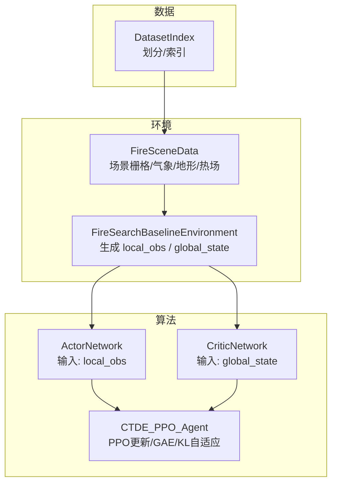
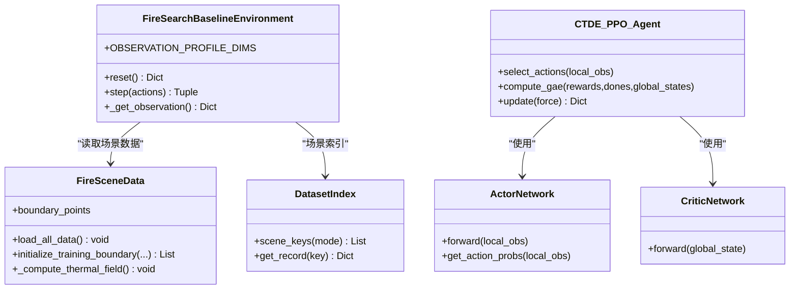

# 通信协议设计

<cite>
**本文引用的文件**   
- [ctde_ppo_baseline_train.py](file://environment_variables/environment_variables/ctde_ppo_baseline_train.py)
- [rl_environment_baseline.py](file://environment_variables/environment_variables/rl_environment_baseline.py)
- [信息转换.py](file://environment_variables/environment_variables/信息转换.py)
- [test_fire_scene_data.py](file://environment_variables/environment_variables/test_fire_scene_data.py)
</cite>

## 目录
1. [引言](#引言)
2. [项目结构](#项目结构)
3. [核心组件](#核心组件)
4. [架构总览](#架构总览)
5. [详细组件分析](#详细组件分析)
6. [依赖关系分析](#依赖关系分析)
7. [性能与一致性考虑](#性能与一致性考虑)
8. [故障排查指南](#故障排查指南)
9. [结论](#结论)
10. [附录：观测配置与监控示例](#附录观测配置与监控示例)

## 引言
本技术文档围绕CTDE（集中式训练、去中心化执行）架构下的无人机通信协议与信息流进行系统化说明。重点包括：
- 局部观测与全局状态的分离设计及其在CTDE中的作用
- 每架无人机的17维局部观测向量构成（位置、电池、热信号、地形等）
- 全局状态向量的19维设计（团队覆盖率、平均电量、质心、分布范围等协同信息）
- 通信频率与数据同步机制（在仿真环境中如何保持状态一致性）
- 不同观测配置文件（baseline、static_terrain、dynamic_front、risk_aware）的配置方法
- 通信延迟处理与数据丢失恢复策略建议

## 项目结构
本项目采用“环境+算法”的清晰分层：
- 环境层：提供多无人机火灾边界搜索任务，输出局部观测与全局状态
- 算法层：CTDE-PPO，Actor使用局部观测，Critic使用全局状态
- 数据层：场景数据加载、归一化、热场计算等



图表来源
- [rl_environment_baseline.py:21-131](file://environment_variables/environment_variables/rl_environment_baseline.py#L21-L131)
- [ctde_ppo_baseline_train.py:460-534](file://environment_variables/environment_variables/ctde_ppo_baseline_train.py#L460-L534)
- [ctde_ppo_baseline_train.py:759-821](file://environment_variables/environment_variables/ctde_ppo_baseline_train.py#L759-L821)
- [信息转换.py:219-322](file://environment_variables/environment_variables/信息转换.py#L219-L322)

章节来源
- [rl_environment_baseline.py:21-131](file://environment_variables/environment_variables/rl_environment_baseline.py#L21-L131)
- [ctde_ppo_baseline_train.py:460-534](file://environment_variables/environment_variables/ctde_ppo_baseline_train.py#L460-L534)
- [信息转换.py:219-322](file://environment_variables/environment_variables/信息转换.py#L219-L322)

## 核心组件
- FireSearchBaselineEnvironment：定义Gymnasium接口，维护多无人机状态，构造17维local_obs与19维global_state
- CTDE_PPO_Agent：包含Actor（基于local_obs）、Critic（基于global_state），实现PPO采样、GAE优势估计与KL自适应学习率
- FireSceneData：加载FARSITE场景栅格、静态地形、风场，计算热势场与边界点集合，为观测与奖励提供基础数据

章节来源
- [rl_environment_baseline.py:21-131](file://environment_variables/environment_variables/rl_environment_baseline.py#L21-L131)
- [ctde_ppo_baseline_train.py:759-821](file://environment_variables/environment_variables/ctde_ppo_baseline_train.py#L759-L821)
- [信息转换.py:219-322](file://environment_variables/environment_variables/信息转换.py#L219-L322)

## 架构总览
CTDE通信协议的核心在于“观测/状态”的解耦：
- 分布式执行阶段：每架无人机仅依据自身17维local_obs独立决策
- 集中式训练阶段：Critic接收19维global_state以评估团队价值，驱动协作学习

```mermaid
sequenceDiagram
participant Env as "环境"
participant Agent as "CTDE_PPO_Agent"
participant Actor as "ActorNetwork"
participant Critic as "CriticNetwork"
Env->>Agent : "step(actions)"
Agent->>Env : "获取 next_obs(local_obs, global_state)"
Agent->>Actor : "select_actions(local_obs)"
Actor-->>Agent : "actions, log_probs"
Agent->>Critic : "compute_gae(global_states)"
Critic-->>Agent : "values"
Agent->>Agent : "PPO更新(actor/critic)"
Agent-->>Env : "返回rewards, done, info"
```

图表来源
- [ctde_ppo_baseline_train.py:849-991](file://environment_variables/environment_variables/ctde_ppo_baseline_train.py#L849-L991)
- [rl_environment_baseline.py:565-658](file://environment_variables/environment_variables/rl_environment_baseline.py#L565-L658)

## 详细组件分析

### 局部观测向量（17维）
每架无人机的17维local_obs由以下字段组成（按顺序）：
1. 归一化Y坐标
2. 归一化X坐标
3. 归一化电池电量
4. 当前格点强度归一化值
5. 视野内火点数占比
6. 距地图中心距离（归一化）
7. 风速归一化
8. 风向sin
9. 风向cos
10. 高程DEM归一化
11. 坡度归一化
12. 热梯度Y分量
13. 热梯度X分量
14. 动量Y分量
15. 动量X分量
16. 最近火源方向Y（相对视距归一化）
17. 最近火源方向X（相对视距归一化）

该向量用于Actor网络输入，保证每架无人机在去中心化执行时具备足够的局部态势感知能力。

章节来源
- [rl_environment_baseline.py:584-611](file://environment_variables/environment_variables/rl_environment_baseline.py#L584-L611)
- [test_fire_scene_data.py:150](file://environment_variables/environment_variables/test_fire_scene_data.py#L150)

### 全局状态向量（19维）
全局状态用于Critic评估团队价值，包含如下协同信息（按顺序）：
1. 当前边界覆盖率
2. 平均电池电量（归一化）
3. 最小电池电量（归一化）
4. 团队质心Y（归一化）
5. 团队质心X（归一化）
6. 团队分布标准差Y（归一化）
7. 团队分布标准差X（归一化）
8. 到火区质心的平均距离（归一化）
9. 步数进度（当前步/最大步）
10. 已访问单元格密度
11. 课程阶段进度（stage/3）
12. 平均风速（归一化）
13. 平均高程（归一化）
14. 已发现边界特征（已发现边界点/总边界点）
15. 低电量无人机标志（是否存在低于阈值）
16. 无人机数量
17. 占位项（固定0）
18. 覆盖率梯度
19. 未覆盖密度（1 - 覆盖率）

该向量使Critic能够理解团队整体态势，指导协作策略学习。

章节来源
- [rl_environment_baseline.py:633-653](file://environment_variables/environment_variables/rl_environment_baseline.py#L633-L653)
- [test_fire_scene_data.py:151](file://environment_variables/environment_variables/test_fire_scene_data.py#L151)

### 观测配置文件（profiles）
系统支持多种观测配置，通过observation_profile参数切换：
- baseline：17维local_obs + 19维global_state
- static_terrain：扩展静态地形特征（坡向、燃料模型、冠层覆盖/高度/基高/体密度等）
- dynamic_front：动态前沿特征（火/前沿密度、边界密度、强度统计、最近火距离等）
- risk_aware：风险感知特征（局部严重度均值/最大值等）

注意：测试断言中显示baseline为17维；环境类常量声明中baseline为19维，实际应以运行时断言为准。

章节来源
- [rl_environment_baseline.py:24-29](file://environment_variables/environment_variables/rl_environment_baseline.py#L24-L29)
- [test_fire_scene_data.py:158-186](file://environment_variables/environment_variables/test_fire_scene_data.py#L158-L186)

### 通信频率与数据同步机制
- 通信频率：在仿真环境中，每个时间步环境统一生成并返回一次global_state，供Critic使用；Actor在每个时间步根据local_obs选择动作。因此，全局状态同步频率等于环境步进频率。
- 数据一致性：由于global_state由环境在同一帧内集中计算并广播给所有智能体（训练阶段），不存在跨进程异步通信，故天然保持一致性。
- 分布式部署建议：若将Critic迁移至中央服务器，需确保global_state在每步以相同顺序和格式下发，并在客户端侧做时间戳校验与丢包重传（见后文）。

章节来源
- [rl_environment_baseline.py:565-658](file://environment_variables/environment_variables/rl_environment_baseline.py#L565-L658)
- [ctde_ppo_baseline_train.py:867-887](file://environment_variables/environment_variables/ctde_ppo_baseline_train.py#L867-L887)

### 通信延迟处理与数据丢失恢复策略
- 延迟容忍：在分布式部署中，建议使用带时间戳的global_state版本序列，客户端缓存最近N帧，优先使用最新可用帧；对Actor推理可忽略轻微延迟。
- 丢包恢复：引入ACK/NACK机制，服务端周期性广播增量global_state；客户端检测到缺失帧时请求补发或回退到上一有效帧。
- 一致性保障：对关键指标（如覆盖率、质心）增加校验和或哈希摘要，客户端比对后丢弃异常帧。
- 容错降级：当长时间无法收到global_state时，Critic可退化到仅用历史均值或默认值，避免训练崩溃。

[本节为通用工程建议，不直接分析具体代码文件]

## 依赖关系分析
- 环境与环境数据：FireSearchBaselineEnvironment依赖FireSceneData提供的栅格、风场、地形与热场
- 算法与环境：CTDE_PPO_Agent从环境获取local_obs与global_state，分别输入Actor与Critic
- 数据集索引：DatasetIndex管理场景划分与路径解析



图表来源
- [rl_environment_baseline.py:21-131](file://environment_variables/environment_variables/rl_environment_baseline.py#L21-L131)
- [信息转换.py:219-322](file://environment_variables/environment_variables/信息转换.py#L219-L322)
- [ctde_ppo_baseline_train.py:460-534](file://environment_variables/environment_variables/ctde_ppo_baseline_train.py#L460-L534)
- [ctde_ppo_baseline_train.py:759-821](file://environment_variables/environment_variables/ctde_ppo_baseline_train.py#L759-L821)

章节来源
- [rl_environment_baseline.py:21-131](file://environment_variables/environment_variables/rl_environment_baseline.py#L21-L131)
- [信息转换.py:219-322](file://environment_variables/environment_variables/信息转换.py#L219-L322)
- [ctde_ppo_baseline_train.py:460-534](file://environment_variables/environment_variables/ctde_ppo_baseline_train.py#L460-L534)
- [ctde_ppo_baseline_train.py:759-821](file://environment_variables/environment_variables/ctde_ppo_baseline_train.py#L759-L821)

## 性能与一致性考虑
- 观测维度控制：baseline为17维，兼顾信息量与计算开销；其他profile按需扩展
- 全局状态压缩：19维已涵盖关键协同信息，避免冗余传输
- 批处理与GPU加速：Actor/Critic前向与PPO更新均批量执行，提升吞吐
- 稳定性：KL自适应学习率与梯度裁剪有助于稳定训练

章节来源
- [ctde_ppo_baseline_train.py:889-991](file://environment_variables/environment_variables/ctde_ppo_baseline_train.py#L889-L991)
- [ctde_ppo_baseline_train.py:823-847](file://environment_variables/environment_variables/ctde_ppo_baseline_train.py#L823-L847)

## 故障排查指南
- 观测维度不一致：检查observation_profile与测试断言是否匹配；确认环境初始化日志中的local/global维度
- 场景数据缺失：确认dataset_index.json与场景路径正确，必要栅格存在
- 训练不稳定：调整KL目标、clip_epsilon、entropy_coef；观察approx_kl与clip_fraction指标

章节来源
- [test_fire_scene_data.py:158-186](file://environment_variables/environment_variables/test_fire_scene_data.py#L158-L186)
- [ctde_ppo_baseline_train.py:889-991](file://environment_variables/environment_variables/ctde_ppo_baseline_train.py#L889-L991)

## 结论
本通信协议以CTDE为核心，通过严格的“局部观测/全局状态”分离，既保证了分布式执行的可行性，又实现了集中式训练的协作优化。17维local_obs与19维global_state的设计在信息完备性与通信开销之间取得平衡。建议在真实分布式部署中引入时间戳、ACK/NACK与降级策略，以应对延迟与丢包。

## 附录：观测配置与监控示例
- 配置baseline观测（17维local_obs）
  - 设置observation_profile="baseline"
  - 验证local_obs形状为(17,)，global_state形状为(19,)
- 配置static_terrain/dynamic_front/risk_aware观测
  - 分别设置对应profile名称，环境会拼接相应特征
- 监控通信性能（训练阶段）
  - 记录每步global_state长度与内容摘要（覆盖率、质心、平均电量）
  - 统计Critic输入的平均范数与方差，检测异常漂移
- 延迟与丢包模拟（离线评估）
  - 在回放global_state时随机丢弃或延迟若干帧，评估策略鲁棒性

章节来源
- [rl_environment_baseline.py:24-29](file://environment_variables/environment_variables/rl_environment_baseline.py#L24-L29)
- [test_fire_scene_data.py:158-186](file://environment_variables/environment_variables/test_fire_scene_data.py#L158-L186)