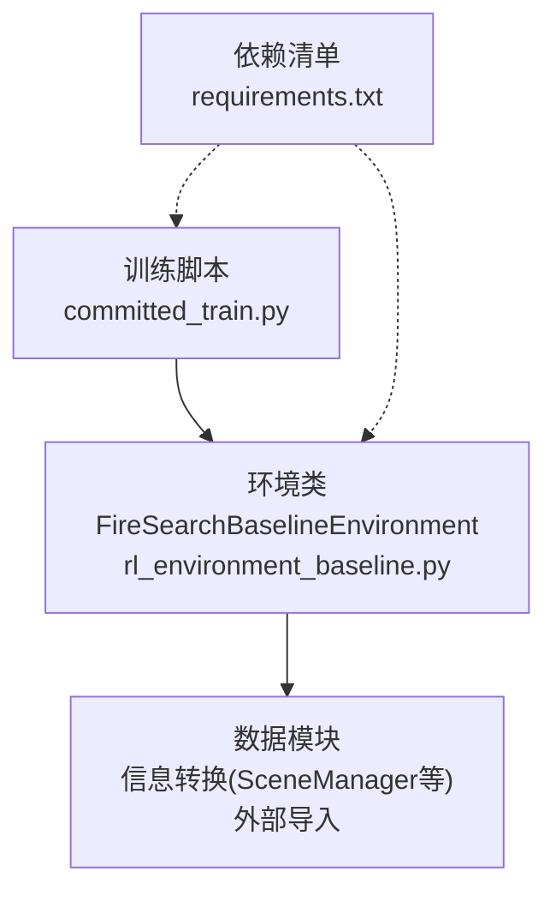
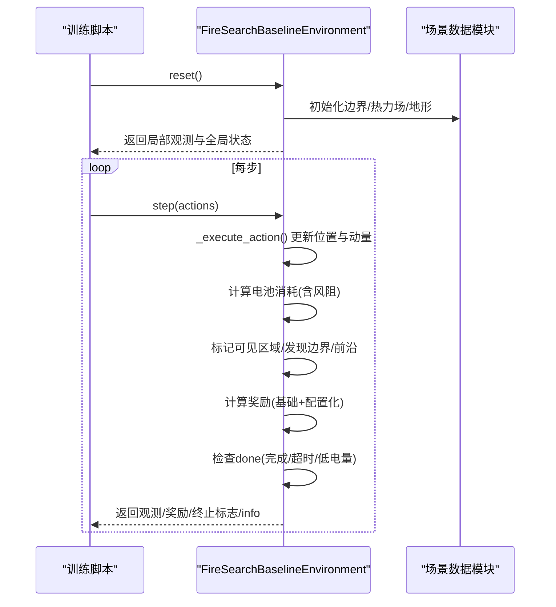
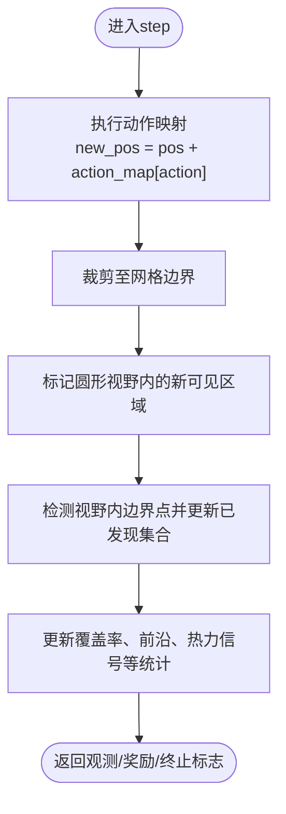
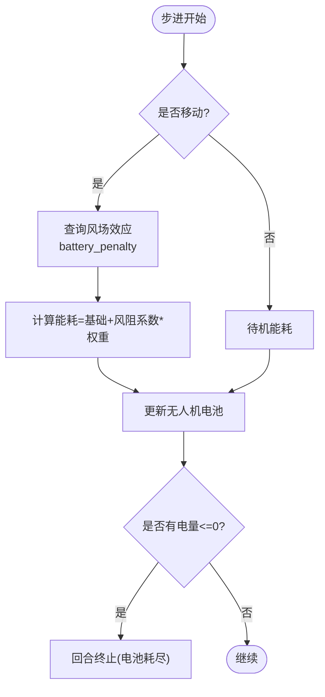
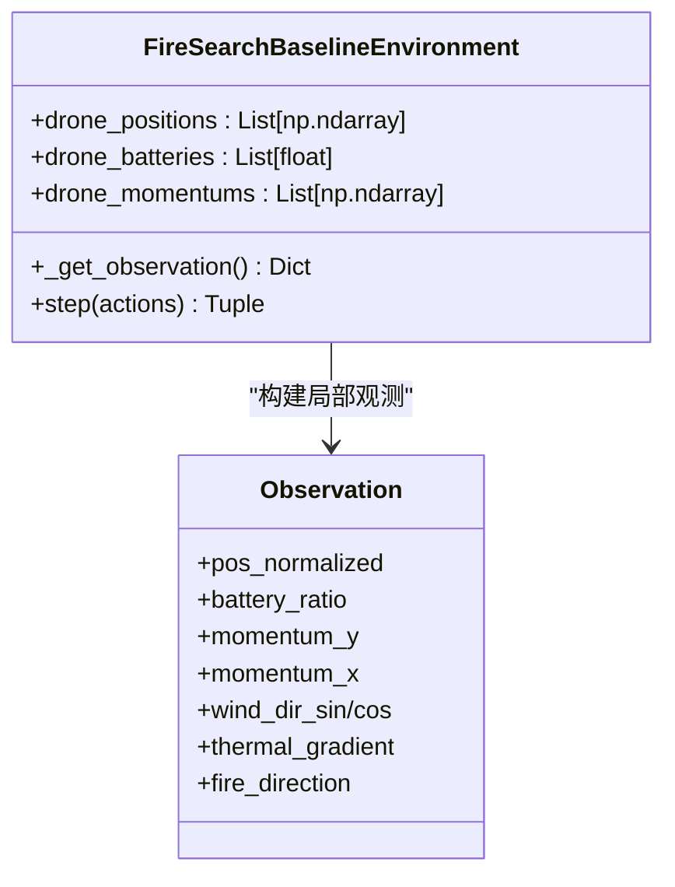
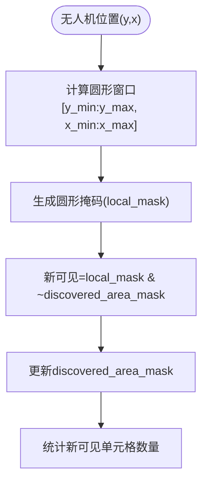
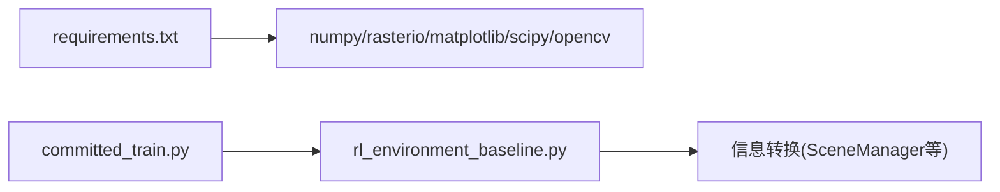

# 无人机状态管理

<cite>
**本文引用的文件**   
- [rl_environment_baseline.py](file://environment_variables/environment_variables/rl_environment_baseline.py)
- [committed_train.py](file://committed_train.py)
- [requirements.txt](file://environment_variables/requirements.txt)
</cite>

## 目录
1. [简介](#简介)
2. [项目结构](#项目结构)
3. [核心组件](#核心组件)
4. [架构总览](#架构总览)
5. [详细组件分析](#详细组件分析)
6. [依赖关系分析](#依赖关系分析)
7. [性能考量](#性能考量)
8. [故障诊断指南](#故障诊断指南)
9. [结论](#结论)
10. [附录：使用示例与调参建议](#附录使用示例与调参建议)

## 简介
本技术文档围绕仓库中的“多机火场边界搜索”环境，系统化阐述无人机状态管理的实现机制，重点覆盖以下方面：
- 位置跟踪与网格坐标系统、边界处理
- 电池状态管理与电量消耗模型、低电量预警
- 动量系统的实现（惯性保持、方向平滑、能量优化）
- 视野范围控制（圆形视野计算、遮挡处理、动态调整）
- 如何获取与更新无人机状态、监控电池使用、调优视野参数
- 状态同步优化建议与故障诊断方法

该环境采用离散网格移动、圆形传感器视野、基于热势与边界的奖励设计，并通过课程学习逐步提升任务难度。

## 项目结构
与无人机状态管理直接相关的核心代码位于环境定义文件中，训练脚本负责加载环境与配置。关键文件如下：
- 环境与环境交互逻辑：rl_environment_baseline.py
- 训练主循环与配置归一化：committed_train.py
- 依赖清单：requirements.txt

图表来源
- [rl_environment_baseline.py:1-120](file://environment_variables/environment_variables/rl_environment_baseline.py#L1-L120)
- [committed_train.py:1-160](file://committed_train.py#L1-L160)
- [requirements.txt:1-13](file://environment_variables/requirements.txt#L1-L13)

章节来源
- [rl_environment_baseline.py:1-120](file://environment_variables/environment_variables/rl_environment_baseline.py#L1-L120)
- [committed_train.py:1-160](file://committed_train.py#L1-L160)
- [requirements.txt:1-13](file://environment_variables/requirements.txt#L1-L13)

## 核心组件
- FireSearchBaselineEnvironment：封装了网格地图、无人机状态（位置、电池、动量）、视野与观测、动作执行、奖励计算、终止条件、全局状态构造等。
- 训练脚本：提供默认配置、参数校验、PPO智能体与回放缓冲等，驱动环境运行并记录指标。

章节来源
- [rl_environment_baseline.py:21-158](file://environment_variables/environment_variables/rl_environment_baseline.py#L21-L158)
- [committed_train.py:92-152](file://committed_train.py#L92-L152)

## 架构总览
下图展示了从训练脚本到环境的调用流程，以及环境内部的关键状态流转。

图表来源
- [rl_environment_baseline.py:331-361](file://environment_variables/environment_variables/rl_environment_baseline.py#L331-L361)
- [rl_environment_baseline.py:660-669](file://environment_variables/environment_variables/rl_environment_baseline.py#L660-L669)
- [rl_environment_baseline.py:842-992](file://environment_variables/environment_variables/rl_environment_baseline.py#L842-L992)

## 详细组件分析

### 位置跟踪与网格坐标系统
- 坐标系与网格
  - 网格尺寸由场景数据决定，位置以二维整数坐标表示，行动空间为上下左右与静止五种离散动作。
  - 动作映射将离散动作转换为位移向量，并通过裁剪确保不越界。
- 边界处理
  - 通过圆形视野窗口在网格上生成掩码，仅对圆内单元格进行可见性判定与统计。
  - 边界点集合用于覆盖率计算；当无人机进入视野时，将对应边界点加入已发现集合，并更新确认掩码。
- 可视化与统计
  - 维护已访问单元集合、最近移动轨迹窗口，用于探索奖励与重复惩罚。
  - 团队质心与散布用于全局状态表征。

图表来源
- [rl_environment_baseline.py:660-669](file://environment_variables/environment_variables/rl_environment_baseline.py#L660-L669)
- [rl_environment_baseline.py:259-276](file://environment_variables/environment_variables/rl_environment_baseline.py#L259-L276)
- [rl_environment_baseline.py:808-823](file://environment_variables/environment_variables/rl_environment_baseline.py#L808-L823)

章节来源
- [rl_environment_baseline.py:660-669](file://environment_variables/environment_variables/rl_environment_baseline.py#L660-L669)
- [rl_environment_baseline.py:259-276](file://environment_variables/environment_variables/rl_environment_baseline.py#L259-L276)
- [rl_environment_baseline.py:808-823](file://environment_variables/environment_variables/rl_environment_baseline.py#L808-L823)

### 电池状态管理系统
- 初始容量与上限
  - 最大电池容量按最大步数线性设定，随场景或元数据参数可能动态调整。
- 消耗模型
  - 若发生移动，基础能耗为固定值，叠加风阻带来的额外惩罚系数；静止时也有较小待机能耗。
  - 风阻影响来自环境数据的风场效应函数，根据当前位置与移动方向计算。
- 低电量预警与终止
  - 全局状态包含“是否存在任意无人机低于阈值”的布尔特征，便于策略感知风险。
  - 当任一无人机电量耗尽时，回合终止并施加终端惩罚。

图表来源
- [rl_environment_baseline.py:133-137](file://environment_variables/environment_variables/rl_environment_baseline.py#L133-L137)
- [rl_environment_baseline.py:866-872](file://environment_variables/environment_variables/rl_environment_baseline.py#L866-L872)
- [rl_environment_baseline.py:838-840](file://environment_variables/environment_variables/rl_environment_baseline.py#L838-L840)
- [rl_environment_baseline.py:648](file://environment_variables/environment_variables/rl_environment_baseline.py#L648)

章节来源
- [rl_environment_baseline.py:133-137](file://environment_variables/environment_variables/rl_environment_baseline.py#L133-L137)
- [rl_environment_baseline.py:866-872](file://environment_variables/environment_variables/rl_environment_baseline.py#L866-L872)
- [rl_environment_baseline.py:838-840](file://environment_variables/environment_variables/rl_environment_baseline.py#L838-L840)
- [rl_environment_baseline.py:648](file://environment_variables/environment_variables/rl_environment_baseline.py#L648)

### 动量系统（惯性保持、方向平滑、能量优化）
- 惯性保持
  - 每步将当前位移向量作为动量保存，供观测输入，使策略能感知历史运动趋势。
- 方向平滑
  - 动量特征参与局部观测，有助于策略输出更连贯的移动方向，减少频繁转向导致的额外能耗。
- 能量优化
  - 结合风阻能耗模型，策略可学会顺风向移动以降低能耗；同时避免原地徘徊以减少待机能耗。

图表来源
- [rl_environment_baseline.py:135-137](file://environment_variables/environment_variables/rl_environment_baseline.py#L135-L137)
- [rl_environment_baseline.py:581-602](file://environment_variables/environment_variables/rl_environment_baseline.py#L581-L602)
- [rl_environment_baseline.py:861-864](file://environment_variables/environment_variables/rl_environment_baseline.py#L861-L864)

章节来源
- [rl_environment_baseline.py:135-137](file://environment_variables/environment_variables/rl_environment_baseline.py#L135-L137)
- [rl_environment_baseline.py:581-602](file://environment_variables/environment_variables/rl_environment_baseline.py#L581-L602)
- [rl_environment_baseline.py:861-864](file://environment_variables/environment_variables/rl_environment_baseline.py#L861-L864)

### 视野范围控制机制
- 圆形视野计算
  - 以无人机为中心，半径为视野半径，在网格上生成圆形掩码，仅考虑圆内像素。
- 遮挡处理
  - 使用已发现区域掩码与圆形掩码的差集统计“新可见区域”，避免重复计数。
- 动态调整
  - 视野半径可由配置或场景元数据动态设置，影响观测维度与奖励增益。

图表来源
- [rl_environment_baseline.py:259-276](file://environment_variables/environment_variables/rl_environment_baseline.py#L259-L276)
- [rl_environment_baseline.py:808-819](file://environment_variables/environment_variables/rl_environment_baseline.py#L808-L819)

章节来源
- [rl_environment_baseline.py:259-276](file://environment_variables/environment_variables/rl_environment_baseline.py#L259-L276)
- [rl_environment_baseline.py:808-819](file://environment_variables/environment_variables/rl_environment_baseline.py#L808-L819)

### 全局状态与观测构造
- 局部观测
  - 包含位置归一化、电池比率、热强度、风向风速、坡度高程、热梯度、动量、相机指向等特征，并可扩展静态地形与动态前沿特征。
- 全局状态
  - 聚合覆盖率、平均/最低电池、团队质心与散布、距火中心距离、时间进度、未探索密度、阶段信息等，供集中式评估网络使用。

章节来源
- [rl_environment_baseline.py:565-658](file://environment_variables/environment_variables/rl_environment_baseline.py#L565-L658)

### 训练与配置
- 默认配置
  - 训练脚本提供大量超参数，包括无人机数量、视野半径、最大步数、观察/奖励配置、学习率、KL自适应、批量大小等。
- 配置归一化与校验
  - 对输入配置进行类型转换、范围约束与合法性校验，确保环境稳定运行。

章节来源
- [committed_train.py:92-152](file://committed_train.py#L92-L152)
- [committed_train.py:155-275](file://committed_train.py#L155-L275)

## 依赖关系分析
- 运行时依赖
  - numpy、rasterio、matplotlib、scipy、opencv-python 为核心依赖；可选强化学习依赖被注释。
- 模块耦合
  - 环境依赖外部数据模块（信息转换），用于场景加载、边界探测、热力场与风场计算。
  - 训练脚本依赖环境接口，驱动reset/step循环并记录指标。

图表来源
- [requirements.txt:1-13](file://environment_variables/requirements.txt#L1-L13)
- [rl_environment_baseline.py:17-19](file://environment_variables/environment_variables/rl_environment_baseline.py#L17-L19)
- [committed_train.py:30-35](file://committed_train.py#L30-L35)

章节来源
- [requirements.txt:1-13](file://environment_variables/requirements.txt#L1-L13)
- [rl_environment_baseline.py:17-19](file://environment_variables/environment_variables/rl_environment_baseline.py#L17-L19)
- [committed_train.py:30-35](file://committed_train.py#L30-L35)

## 性能考量
- 视野计算复杂度
  - 圆形窗口与掩码运算在局部补丁上进行，复杂度与视野面积成正比；可通过合理设置视野半径平衡精度与效率。
- 边界刷新频率
  - 每隔若干步更新一次边界与热力场，降低高频重算开销。
- 内存与数据结构
  - 使用集合与布尔掩码存储已发现区域，避免重复计算；最近轨迹窗口限制长度，防止无限增长。
- 并行与向量化
  - 利用NumPy向量化操作加速统计与掩码计算；避免逐像素Python循环。

[本节为通用指导，无需特定文件引用]

## 故障诊断指南
- 常见问题定位
  - 视野过小导致无法发现边界：检查视野半径配置与场景元数据覆盖。
  - 电池过快耗尽：关注风阻系数与移动策略，适当增加待机能耗惩罚或调整奖励权重。
  - 覆盖率停滞：检查课程阶段目标与超时惩罚，必要时放宽探索奖励或提高边界发现奖励。
- 诊断信息
  - info字段包含覆盖率、首次热信号步、首次边界步、超时标志、零覆盖率超时、出生模式、奖励分解等，可用于回溯分析。
- 日志与复现
  - 训练脚本支持控制台双写日志，便于离线分析；固定场景键可复现实验。

章节来源
- [rl_environment_baseline.py:966-992](file://environment_variables/environment_variables/rl_environment_baseline.py#L966-L992)
- [committed_train.py:41-90](file://committed_train.py#L41-L90)

## 结论
该无人机状态管理系统在离散网格环境中实现了稳健的位置跟踪、电池管理、动量建模与圆形视野控制。通过分层奖励与课程学习，系统在探索与目标导向之间取得良好平衡。面向工程落地，建议重点关注视野半径与风阻能耗参数的调优，并结合info指标进行持续诊断与迭代。

[本节为总结性内容，无需特定文件引用]

## 附录：使用示例与调参建议

- 获取与更新无人机状态
  - 重置环境后，读取返回的局部观测与全局状态；每步传入动作列表，得到新的观测、奖励、终止标志与info。
  - 参考路径：
    - [rl_environment_baseline.py:331-361](file://environment_variables/environment_variables/rl_environment_baseline.py#L331-L361)
    - [rl_environment_baseline.py:842-992](file://environment_variables/environment_variables/rl_environment_baseline.py#L842-L992)

- 监控电池使用
  - 全局状态包含平均/最低电池比率与低电量指示；info中提供终止原因与步骤计数。
  - 参考路径：
    - [rl_environment_baseline.py:613-653](file://environment_variables/environment_variables/rl_environment_baseline.py#L613-L653)
    - [rl_environment_baseline.py:966-992](file://environment_variables/environment_variables/rl_environment_baseline.py#L966-L992)

- 调优视野参数
  - 通过配置项vision_radius或启用use_metadata_uav_params以场景元数据为准；注意其对观测维度与奖励增益的影响。
  - 参考路径：
    - [rl_environment_baseline.py:72-76](file://environment_variables/environment_variables/rl_environment_baseline.py#L72-L76)
    - [rl_environment_baseline.py:198-207](file://environment_variables/environment_variables/rl_environment_baseline.py#L198-L207)
    - [committed_train.py:92-152](file://committed_train.py#L92-L152)

- 状态同步优化建议
  - 降低边界刷新频率或仅在关键步更新热力场，减少CPU/GPU负载。
  - 缓存严重度图与热力场，避免重复计算。
  - 使用向量化掩码运算替代显式循环，提升吞吐。

- 故障诊断方法
  - 依据info中的first_heat_step、first_boundary_step、timeout、zero_coverage_timeout等指标判断策略行为。
  - 对比不同视野半径与风阻系数下的覆盖率曲线与电池消耗曲线，定位瓶颈。

章节来源
- [rl_environment_baseline.py:331-361](file://environment_variables/environment_variables/rl_environment_baseline.py#L331-L361)
- [rl_environment_baseline.py:842-992](file://environment_variables/environment_variables/rl_environment_baseline.py#L842-L992)
- [rl_environment_baseline.py:613-653](file://environment_variables/environment_variables/rl_environment_baseline.py#L613-L653)
- [rl_environment_baseline.py:198-207](file://environment_variables/environment_variables/rl_environment_baseline.py#L198-L207)
- [committed_train.py:92-152](file://committed_train.py#L92-L152)