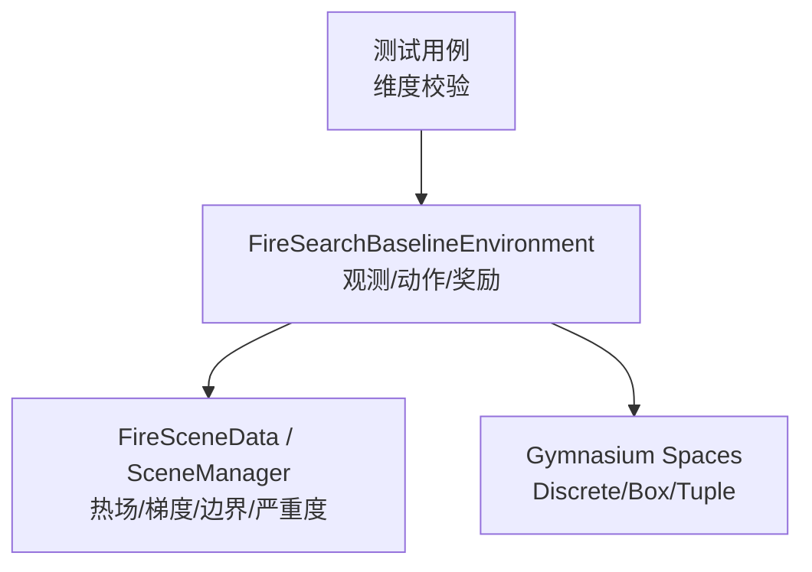
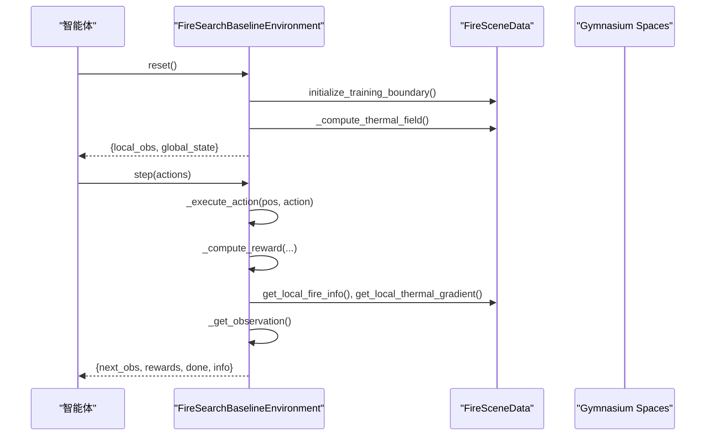
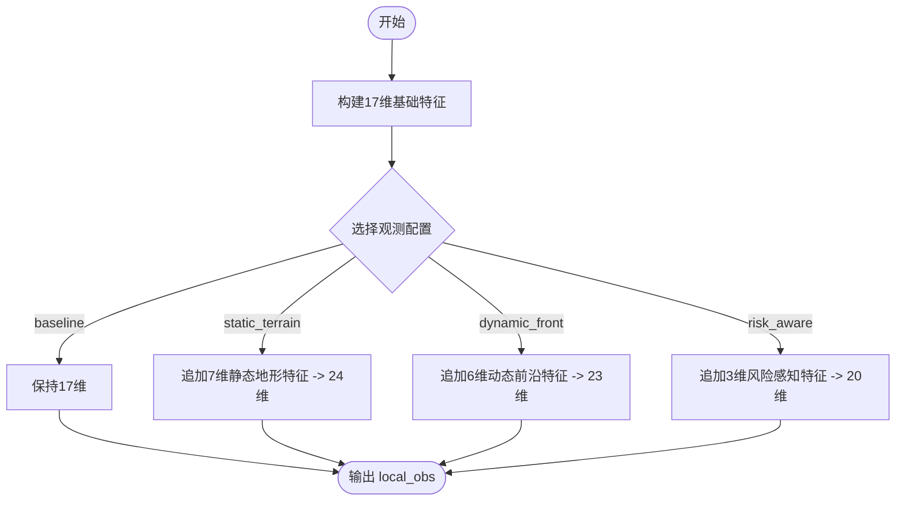
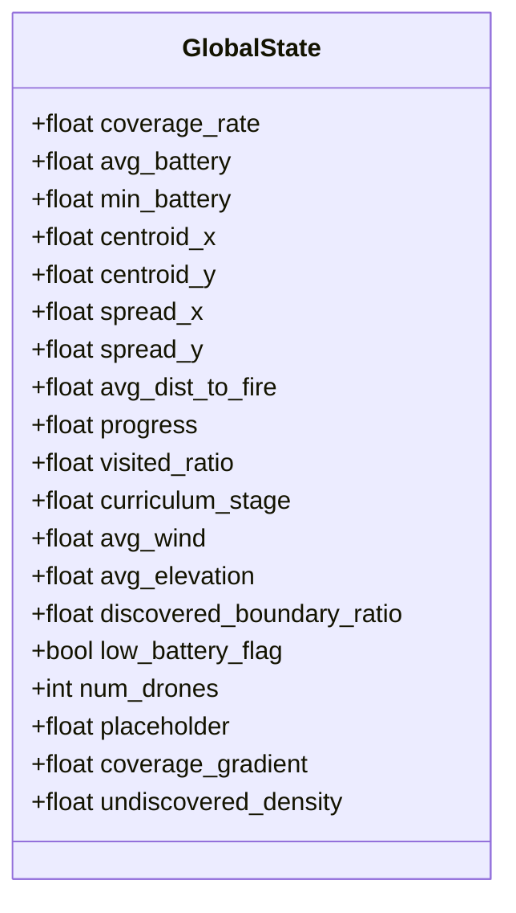
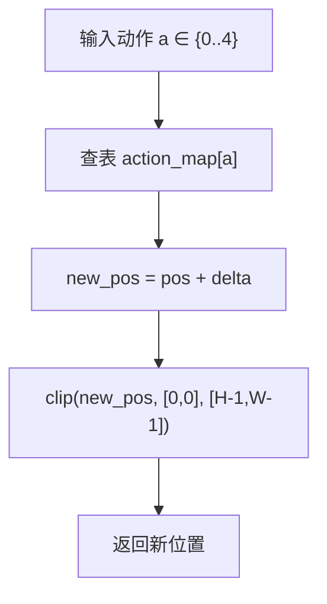
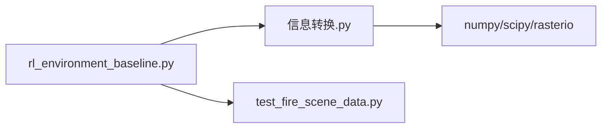

# 观测空间与动作空间

<cite>
**本文引用的文件**   
- [rl_environment_baseline.py](file://environment_variables/environment_variables/rl_environment_baseline.py)
- [信息转换.py](file://environment_variables/environment_variables/信息转换.py)
- [test_fire_scene_data.py](file://environment_variables/environment_variables/test_fire_scene_data.py)
</cite>

## 目录
1. [简介](#简介)
2. [项目结构](#项目结构)
3. [核心组件](#核心组件)
4. [架构总览](#架构总览)
5. [详细组件分析](#详细组件分析)
6. [依赖关系分析](#依赖关系分析)
7. [性能考量](#性能考量)
8. [故障排查指南](#故障排查指南)
9. [结论](#结论)
10. [附录](#附录)

## 简介
本技术文档聚焦于“观测空间与动作空间系统”，面向多无人机火场边界搜索任务。文档深入解释：
- 局部观测向量设计：17维基础特征与扩展观测配置（static_terrain、dynamic_front、risk_aware）
- 全局状态向量构成：团队信息、环境统计与进度指标
- 动作空间的离散化设计：5个基本方向与移动语义
- 不同观测配置模式的特征组合与维度
- 构建观测向量、定义动作映射与验证空间维度的具体示例路径
- 观测特征优化建议与动作空间扩展方法

## 项目结构
围绕观测与动作的核心实现位于环境类与数据模块中：
- 环境类负责观测构造、动作执行、奖励计算与全局状态汇总
- 数据模块提供热场、梯度、边界点、严重度等底层特征

图表来源
- [rl_environment_baseline.py:21-131](file://environment_variables/environment_variables/rl_environment_baseline.py#L21-L131)
- [信息转换.py:773-916](file://environment_variables/environment_variables/信息转换.py#L773-L916)
- [test_fire_scene_data.py:158-189](file://environment_variables/environment_variables/test_fire_scene_data.py#L158-L189)

章节来源
- [rl_environment_baseline.py:21-131](file://environment_variables/environment_variables/rl_environment_baseline.py#L21-L131)
- [test_fire_scene_data.py:158-189](file://environment_variables/environment_variables/test_fire_scene_data.py#L158-L189)

## 核心组件
- 观测空间
  - 局部观测 local_obs：每架无人机一个向量，维度由 observation_profile 决定
  - 全局状态 global_state：固定19维，描述团队与环境统计
- 动作空间
  - 离散动作 Discrete(5)，包含上、下、左、右、静止
- 观测配置模式
  - baseline：17维基础特征
  - static_terrain：+7维静态地形特征，共24维
  - dynamic_front：+6维动态前沿特征，共23维
  - risk_aware：+3维风险感知特征，共20维

章节来源
- [rl_environment_baseline.py:24-29](file://environment_variables/environment_variables/rl_environment_baseline.py#L24-L29)
- [rl_environment_baseline.py:89-131](file://environment_variables/environment_variables/rl_environment_baseline.py#L89-L131)
- [test_fire_scene_data.py:158-189](file://environment_variables/environment_variables/test_fire_scene_data.py#L158-L189)

## 架构总览
下图展示了从环境初始化到单步交互的完整流程，包括观测构建、动作执行与全局状态生成。

图表来源
- [rl_environment_baseline.py:331-360](file://environment_variables/environment_variables/rl_environment_baseline.py#L331-L360)
- [rl_environment_baseline.py:565-658](file://environment_variables/environment_variables/rl_environment_baseline.py#L565-L658)
- [rl_environment_baseline.py:660-669](file://environment_variables/environment_variables/rl_environment_baseline.py#L660-L669)
- [信息转换.py:773-916](file://environment_variables/environment_variables/信息转换.py#L773-L916)

## 详细组件分析

### 局部观测向量设计（17维基础特征）
基础观测由以下17个浮点特征组成（已归一化或标准化）：
- 位置归一化：pos_x/grid_h, pos_y/grid_w
- 电量归一化：battery/max_battery
- 强度归一化：intensity_norm
- 视野内火点数密度：fire_count/local_area
- 距地图中心距离归一化：dist_to_center
- 风速归一化：wind_speed_norm
- 风向角编码：wind_dir_sin, wind_dir_cos
- 高程归一化：dem_norm
- 坡度归一化：slope_norm
- 热梯度分量：grad_y, grad_x
- 上一时刻动量：mom_y, mom_x
- 相机指向（朝向火源）归一化：cam_dir_y/radius, cam_dir_x/radius

这些特征在每架无人机的每个时间步被组装为长度为17的向量，作为 baseline 模式的观测。

章节来源
- [rl_environment_baseline.py:584-602](file://environment_variables/environment_variables/rl_environment_baseline.py#L584-L602)
- [rl_environment_baseline.py:438-490](file://environment_variables/environment_variables/rl_environment_baseline.py#L438-L490)

### 扩展观测配置模式
根据 observation_profile 的不同，在17维基础上追加不同特征集：
- static_terrain：追加7维静态地形特征（坡向sin/cos、燃料模型、冠层覆盖、冠层高、冠层底高、冠层体积密度），总计24维
- dynamic_front：追加6维动态前沿特征（火占比、前沿占比、边界点密度、平均强度、最大强度、最近火距离），总计23维
- risk_aware：追加3维风险感知特征（当前严重度、邻域平均严重度、邻域最大严重度），总计20维

图表来源
- [rl_environment_baseline.py:603-611](file://environment_variables/environment_variables/rl_environment_baseline.py#L603-L611)
- [rl_environment_baseline.py:521-563](file://environment_variables/environment_variables/rl_environment_baseline.py#L521-L563)
- [test_fire_scene_data.py:158-189](file://environment_variables/environment_variables/test_fire_scene_data.py#L158-L189)

章节来源
- [rl_environment_baseline.py:521-563](file://environment_variables/environment_variables/rl_environment_baseline.py#L521-L563)
- [test_fire_scene_data.py:158-189](file://environment_variables/environment_variables/test_fire_scene_data.py#L158-L189)

### 全局状态向量构成（19维）
全局状态用于集中式训练或评估，包含团队与环境统计：
- 覆盖率：current_coverage_rate
- 电池统计：avg_battery, min_battery
- 团队质心：team_centroid_x/grid_w, team_centroid_y/grid_h
- 团队分散度：team_spread_x/grid_w, team_spread_y/grid_h
- 距火中心平均距离归一化：avg_dist_to_fire
- 进度指标：step_count/max_steps
- 访问面积比例：visited_cells/(grid_h*grid_w)
- 课程阶段归一化：curriculum_stage/3.0
- 环境统计：平均风速归一化、平均高程归一化
- 边界发现比例：discovered_boundary_feature
- 低电量指示：any(b < 0.2*max_battery)
- 无人机数量：num_drones
- 预留占位：0.0
- 覆盖率梯度：_coverage_gradient
- 未探索密度：undiscovered_density

图表来源
- [rl_environment_baseline.py:633-653](file://environment_variables/environment_variables/rl_environment_baseline.py#L633-L653)

章节来源
- [rl_environment_baseline.py:633-653](file://environment_variables/environment_variables/rl_environment_baseline.py#L633-L653)

### 动作空间离散化设计与移动语义
动作空间为 Discrete(5)，映射如下：
- 0：向上移动（y+1）
- 1：向下移动（y-1）
- 2：向左移动（x-1）
- 3：向右移动（x+1）
- 4：静止不动

执行时会将新位置裁剪到网格边界内，避免越界。

图表来源
- [rl_environment_baseline.py:660-669](file://environment_variables/environment_variables/rl_environment_baseline.py#L660-L669)

章节来源
- [rl_environment_baseline.py:660-669](file://environment_variables/environment_variables/rl_environment_baseline.py#L660-L669)

### 代码示例与验证路径
- 构建观测向量
  - 参考路径：[rl_environment_baseline.py:565-658](file://environment_variables/environment_variables/rl_environment_baseline.py#L565-L658)
- 定义动作映射
  - 参考路径：[rl_environment_baseline.py:660-669](file://environment_variables/environment_variables/rl_environment_baseline.py#L660-L669)
- 验证空间维度
  - 默认 baseline 维度：local_obs=17, global_state=19
  - 各 profile 维度：baseline=17, static_terrain=24, dynamic_front=23, risk_aware=20
  - 参考路径：[test_fire_scene_data.py:158-189](file://environment_variables/environment_variables/test_fire_scene_data.py#L158-L189)

章节来源
- [rl_environment_baseline.py:565-658](file://environment_variables/environment_variables/rl_environment_baseline.py#L565-L658)
- [rl_environment_baseline.py:660-669](file://environment_variables/environment_variables/rl_environment_baseline.py#L660-L669)
- [test_fire_scene_data.py:158-189](file://environment_variables/environment_variables/test_fire_scene_data.py#L158-L189)

## 依赖关系分析
- 环境类依赖数据模块提供的热场、梯度、边界点、严重度等
- 观测构造依赖基础特征提取与 profile 特定特征拼接
- 动作执行仅依赖网格尺寸与动作映射表

图表来源
- [rl_environment_baseline.py:21-131](file://environment_variables/environment_variables/rl_environment_baseline.py#L21-L131)
- [信息转换.py:773-916](file://environment_variables/environment_variables/信息转换.py#L773-L916)
- [test_fire_scene_data.py:1-262](file://environment_variables/environment_variables/test_fire_scene_data.py#L1-L262)

章节来源
- [rl_environment_baseline.py:21-131](file://environment_variables/environment_variables/rl_environment_baseline.py#L21-L131)
- [信息转换.py:773-916](file://environment_variables/environment_variables/信息转换.py#L773-L916)
- [test_fire_scene_data.py:1-262](file://environment_variables/environment_variables/test_fire_scene_data.py#L1-L262)

## 性能考量
- 观测特征计算涉及局部窗口切片与统计，注意缓存与向量化
- 热场与严重度图可缓存以减少重复计算
- 全局状态聚合使用均值/方差等批量操作，避免逐单元循环
- 动作执行仅为常数时间查找与裁剪，开销极低

[本节为通用指导，不直接分析具体文件]

## 故障排查指南
- 维度不一致
  - 现象：obs["local_obs"][i].shape 不等于预期
  - 排查：确认 observation_profile 与对应维度映射；检查是否误用旧版本输出目录中的脚本
  - 参考路径：[test_fire_scene_data.py:158-189](file://environment_variables/environment_variables/test_fire_scene_data.py#L158-L189)
- 越界移动
  - 现象：新位置超出网格范围
  - 排查：确认 _execute_action 的 clip 逻辑生效
  - 参考路径：[rl_environment_baseline.py:660-669](file://environment_variables/environment_variables/rl_environment_baseline.py#L660-L669)
- 特征越界或未归一化
  - 现象：intensity/dem/slope/wind 特征不在[0,1]
  - 排查：检查 _base_cell_features 的归一化与裁剪
  - 参考路径：[rl_environment_baseline.py:438-490](file://environment_variables/environment_variables/rl_environment_baseline.py#L438-L490)

章节来源
- [test_fire_scene_data.py:158-189](file://environment_variables/environment_variables/test_fire_scene_data.py#L158-L189)
- [rl_environment_baseline.py:660-669](file://environment_variables/environment_variables/rl_environment_baseline.py#L660-L669)
- [rl_environment_baseline.py:438-490](file://environment_variables/environment_variables/rl_environment_baseline.py#L438-L490)

## 结论
该观测与动作系统设计清晰、可扩展：
- 17维基础观测覆盖位置、电量、环境、热力梯度与运动学信息
- 三种扩展 profile 分别强化静态地形、动态前沿与风险感知能力
- 全局状态提供团队与环境层面的稳定信号，利于集中式学习
- 5动作离散空间简洁有效，便于策略网络建模
- 通过测试用例可快速验证维度一致性与行为正确性

[本节为总结，不直接分析具体文件]

## 附录

### 观测特征优化建议
- 特征归一化与裁剪：确保所有数值型特征处于稳定区间，避免梯度爆炸
- 时序平滑：对噪声较大的特征（如瞬时风速）引入滑动平均
- 稀疏性控制：对动态前沿特征进行阈值过滤，减少无效信号
- 特征重要性筛选：基于策略网络的注意力权重或消融实验剔除冗余特征

[本节为通用指导，不直接分析具体文件]

### 动作空间扩展方法
- 对角移动：增加四个对角方向，形成8邻域移动
- 变步长：支持短/长步长或多步跳跃，结合惩罚项防止过度激进
- 转向动作：在连续角度空间中引入旋转，适用于更灵活的传感器扫描
- 能量管理动作：插入待机/回收动作，配合电池约束优化续航

[本节为通用指导，不直接分析具体文件]