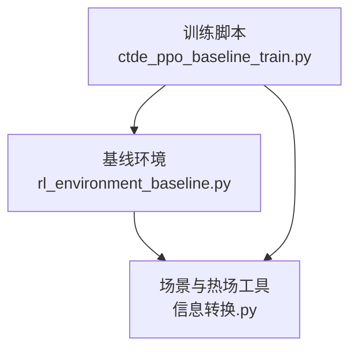
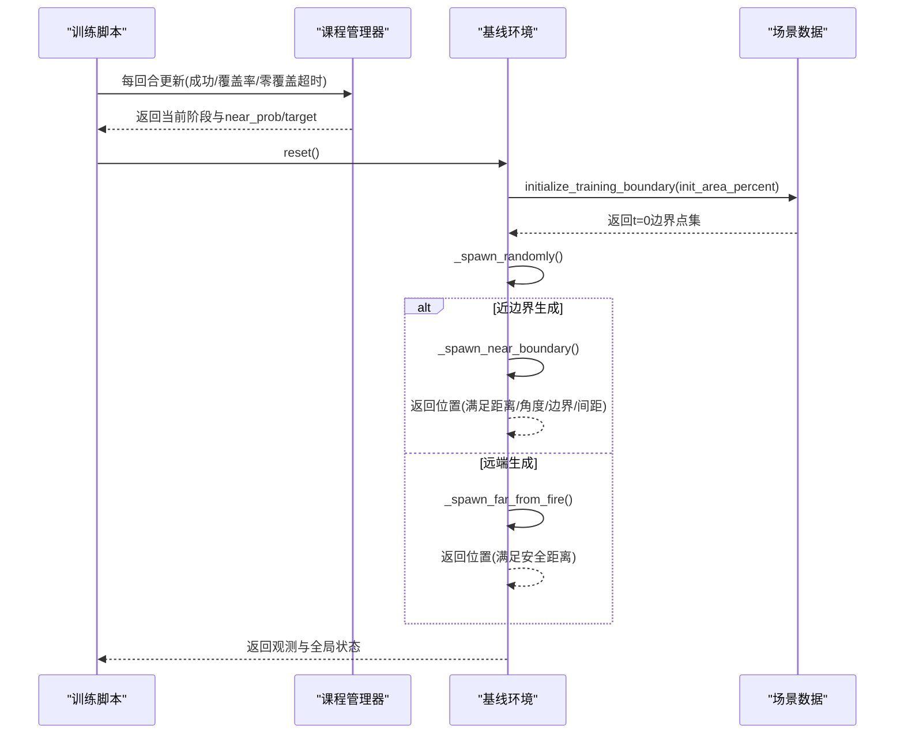
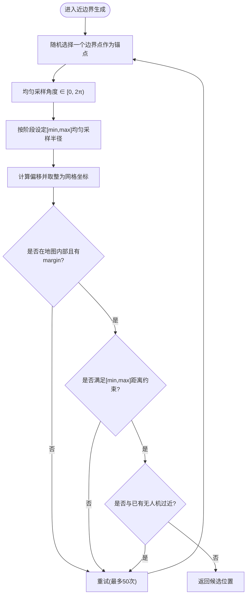
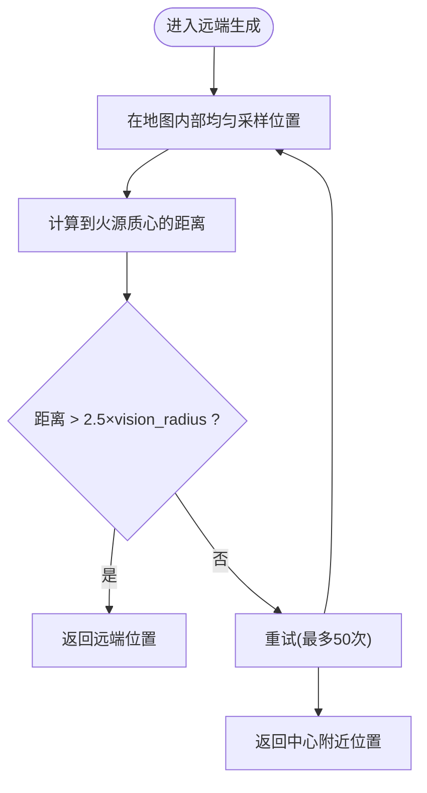
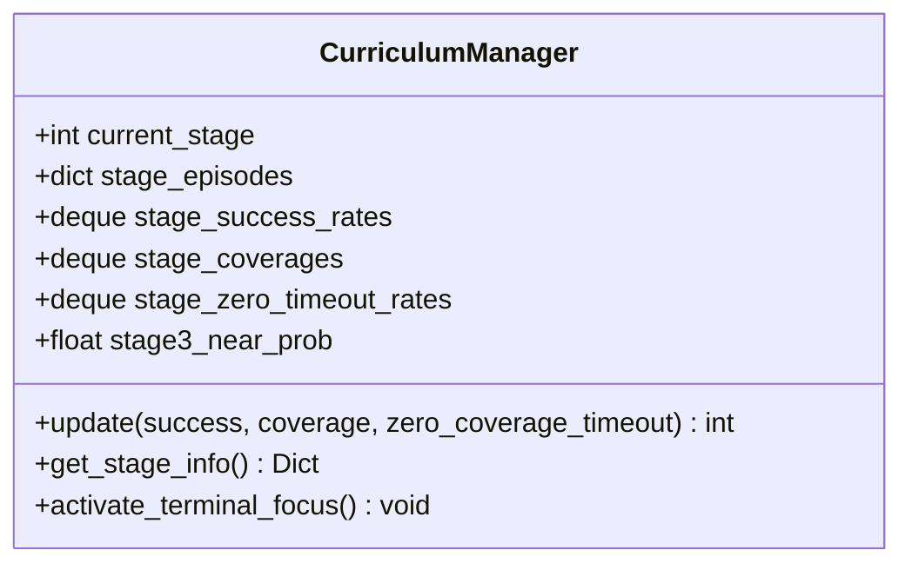
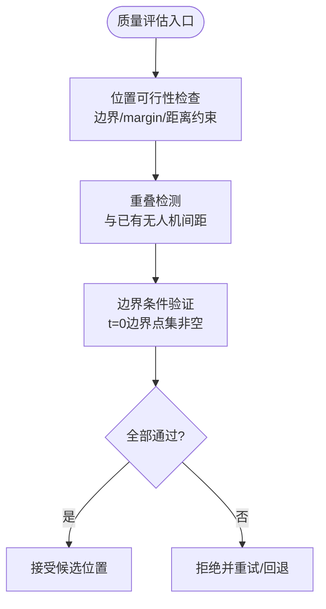
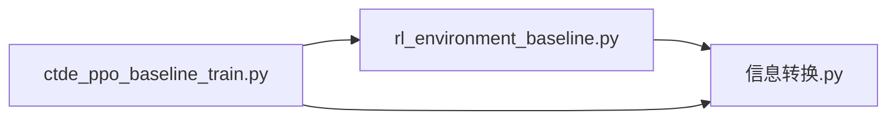

# 随机生成策略

<cite>
**本文引用的文件**   
- [ctde_ppo_baseline_train.py](file://environment_variables/environment_variables/ctde_ppo_baseline_train.py)
- [rl_environment_baseline.py](file://environment_variables/environment_variables/rl_environment_baseline.py)
- [信息转换.py](file://environment_variables/environment_variables/信息转换.py)
</cite>

## 目录
1. [简介](#简介)
2. [项目结构](#项目结构)
3. [核心组件](#核心组件)
4. [架构总览](#架构总览)
5. [详细组件分析](#详细组件分析)
6. [依赖关系分析](#依赖关系分析)
7. [性能与稳定性考量](#性能与稳定性考量)
8. [故障排查指南](#故障排查指南)
9. [结论](#结论)
10. [附录：配置与调优示例路径](#附录配置与调优示例路径)

## 简介
本技术文档围绕“随机生成策略系统”展开，聚焦以下目标：
- 近边界生成算法：距离约束、角度分布与边界点选择策略
- 远端生成机制：远离火源中心的概率分布与安全区域定义
- 课程学习阶段对生成策略的影响：不同阶段的生成概率调整与难度渐进
- 生成质量评估：位置可行性检查、重叠检测与边界条件验证
- 配置与调优：如何设置参数、调节概率分布与监控效果
- 优化建议与测试方法

## 项目结构
与随机生成策略直接相关的代码集中在三个模块中：
- 训练脚本与课程管理器：负责课程阶段切换、near_prob退火与目标进度控制
- 环境类：实现无人机初始位置生成（近边界/远端）、观测与奖励计算
- 场景数据与热场工具：负责边界点提取、热势场构建与诊断

图表来源
- [ctde_ppo_baseline_train.py:569-757](file://environment_variables/environment_variables/ctde_ppo_baseline_train.py#L569-L757)
- [rl_environment_baseline.py:362-436](file://environment_variables/environment_variables/rl_environment_baseline.py#L362-L436)
- [信息转换.py:698-887](file://environment_variables/environment_variables/信息转换.py#L698-L887)

章节来源
- [ctde_ppo_baseline_train.py:98-158](file://environment_variables/environment_variables/ctde_ppo_baseline_train.py#L98-L158)
- [rl_environment_baseline.py:21-157](file://environment_variables/environment_variables/rl_environment_baseline.py#L21-L157)
- [信息转换.py:219-322](file://environment_variables/environment_variables/信息转换.py#L219-L322)

## 核心组件
- 课程管理器（CurriculumManager）
  - 维护阶段1/2/3的推进条件、成功率阈值、覆盖率门槛与零覆盖超时率上限
  - 在阶段3内执行“能力绑定阶梯式退火”，逐步降低近边界生成概率 near_prob，同时提升目标覆盖率
- 基线环境（FireSearchBaselineEnvironment）
  - 根据当前课程阶段与 near_prob 决定使用“近边界生成”或“远端生成”
  - 近边界生成：从 t=0 边界点集合中选择候选点，施加距离约束与角度均匀分布，并做边界与间距校验
  - 远端生成：在地图范围内采样，要求距火源中心足够远，作为安全区域
- 场景数据（FireSceneData / SceneManager）
  - 基于时间步或面积百分比选择初始火场，提取边界点集
  - 构建热势场与导航梯度，用于引导搜索与质量诊断

章节来源
- [ctde_ppo_baseline_train.py:569-757](file://environment_variables/environment_variables/ctde_ppo_baseline_train.py#L569-L757)
- [rl_environment_baseline.py:362-436](file://environment_variables/environment_variables/rl_environment_baseline.py#L362-L436)
- [信息转换.py:698-887](file://environment_variables/environment_variables/信息转换.py#L698-L887)

## 架构总览
下图展示了训练循环、课程管理与环境生成的交互流程。

图表来源
- [ctde_ppo_baseline_train.py:621-738](file://environment_variables/environment_variables/ctde_ppo_baseline_train.py#L621-L738)
- [rl_environment_baseline.py:331-436](file://environment_variables/environment_variables/rl_environment_baseline.py#L331-L436)
- [信息转换.py:698-887](file://environment_variables/environment_variables/信息转换.py#L698-L887)

## 详细组件分析

### 近边界生成算法
- 边界点选择策略
  - 从 t=0 边界点集中随机选取一个候选点作为锚点
  - 以该锚点为中心，按均匀角度分布采样方向向量
  - 在给定最小/最大距离区间内采样半径，得到偏移量并取整为网格坐标
- 距离约束
  - 阶段1：min_dist≈0，max_dist≈0.5×vision_radius
  - 阶段2：min_dist≈0.5×vision_radius，max_dist≈1.5×vision_radius
  - 阶段3：min_dist≈1.0×vision_radius，max_dist≈2.5×vision_radius
- 角度分布
  - 角度在[0, 2π]上均匀采样，保证各向同性的探索
- 边界与间距校验
  - 位置需位于地图内部且保留margin
  - 与已有无人机位置的最小间距≥0.8×vision_radius，避免碰撞/重叠
  - 若多次尝试失败则回退到远端生成

图表来源
- [rl_environment_baseline.py:379-415](file://environment_variables/environment_variables/rl_environment_baseline.py#L379-L415)

章节来源
- [rl_environment_baseline.py:379-415](file://environment_variables/environment_variables/rl_environment_baseline.py#L379-L415)

### 远端生成机制
- 安全区域定义
  - 以火源质心为参考，要求候选位置到质心的欧氏距离大于2.5×vision_radius
  - 位置需在地图内部且保留margin
- 概率分布
  - 在满足安全距离的区域内进行均匀采样；若多次尝试未命中，则返回中心附近的安全位置
- 触发条件
  - 当不满足近边界生成概率时，或近边界生成失败，将采用远端生成

图表来源
- [rl_environment_baseline.py:421-436](file://environment_variables/environment_variables/rl_environment_baseline.py#L421-L436)

章节来源
- [rl_environment_baseline.py:421-436](file://environment_variables/environment_variables/rl_environment_baseline.py#L421-L436)

### 课程学习阶段对生成策略的影响
- 阶段划分与推进条件
  - 阶段1：提高探索与基础发现能力，成功率阈值较低，允许较大近边界概率
  - 阶段2：提升覆盖率与成功率门槛，适度降低近边界概率
  - 阶段3：引入“能力绑定阶梯式退火”，near_prob从较高值逐步降至0，同时提升目标覆盖率
- near_prob退火逻辑
  - 仅在阶段3生效，且退火进度不超过目标进度
  - 每次退火需要满足最低回合数与能力门限（成功率、零覆盖超时率、覆盖率）
- 目标进度推进
  - 依据平均覆盖率、成功率与零覆盖超时率综合判断，达到门限后提升下一阶段目标

图表来源
- [ctde_ppo_baseline_train.py:569-757](file://environment_variables/environment_variables/ctde_ppo_baseline_train.py#L569-L757)

章节来源
- [ctde_ppo_baseline_train.py:569-757](file://environment_variables/environment_variables/ctde_ppo_baseline_train.py#L569-L757)

### 生成质量评估
- 位置可行性检查
  - 边界与margin检查：确保位置在地图内部且留有安全边距
  - 距离约束检查：近边界生成需满足[min,max]距离范围
  - 间距检查：与已有无人机保持最小间距，避免重叠
- 重叠检测
  - 通过计算候选位置与所有已存在无人机位置的欧氏距离，判断是否小于0.8×vision_radius
- 边界条件验证
  - 场景初始化时验证t=0边界点集非空；若为空则抛出无效场景异常
  - 支持按面积百分比选择初始火场，并记录实际面积比例与截断时间

图表来源
- [rl_environment_baseline.py:379-415](file://environment_variables/environment_variables/rl_environment_baseline.py#L379-L415)
- [信息转换.py:698-721](file://environment_variables/environment_variables/信息转换.py#L698-L721)

章节来源
- [rl_environment_baseline.py:379-415](file://environment_variables/environment_variables/rl_environment_baseline.py#L379-L415)
- [信息转换.py:698-721](file://environment_variables/environment_variables/信息转换.py#L698-L721)

## 依赖关系分析
- 训练脚本依赖环境类与环境提供的观测/奖励接口
- 环境类依赖场景数据模块获取边界点集、热势场与局部热力梯度
- 课程管理器由训练脚本驱动，影响环境的near_prob与目标进度

图表来源
- [ctde_ppo_baseline_train.py:30-36](file://environment_variables/environment_variables/ctde_ppo_baseline_train.py#L30-L36)
- [rl_environment_baseline.py:17-18](file://environment_variables/environment_variables/rl_environment_baseline.py#L17-L18)
- [信息转换.py:219-322](file://environment_variables/environment_variables/信息转换.py#L219-L322)

章节来源
- [ctde_ppo_baseline_train.py:30-36](file://environment_variables/environment_variables/ctde_ppo_baseline_train.py#L30-L36)
- [rl_environment_baseline.py:17-18](file://environment_variables/environment_variables/rl_environment_baseline.py#L17-L18)
- [信息转换.py:219-322](file://environment_variables/environment_variables/信息转换.py#L219-L322)

## 性能与稳定性考量
- 生成效率
  - 近边界生成最多尝试50次，避免长时间阻塞；失败时快速回退到远端生成
  - 远端生成同样限制尝试次数，并在必要时返回中心附近的安全位置
- 数值稳定性
  - 热势场采用鲁棒归一化与log压缩导航场，避免高值区梯度消失
  - 边界点提取使用二值腐蚀操作，稳定提取活跃前沿
- 课程学习稳定性
  - 阶段推进依赖滑动窗口统计与多指标门限，防止过早推进导致不稳定
  - near_prob退火受目标进度约束，避免过度激进导致成功率骤降

章节来源
- [信息转换.py:759-819](file://environment_variables/environment_variables/信息转换.py#L759-L819)
- [ctde_ppo_baseline_train.py:684-738](file://environment_variables/environment_variables/ctde_ppo_baseline_train.py#L684-L738)

## 故障排查指南
- 场景无效
  - 若t=0边界点集为空，会抛出无效场景异常；应检查数据集完整性与时间步映射
- 热场健康
  - 使用热场健康诊断函数检查饱和比例、高热区零梯度比例等指标，确保语义层正常
- 生成失败
  - 若近边界生成频繁失败，检查vision_radius、margin与min/max距离设置是否合理
  - 若远端生成无法找到安全位置，检查火源质心与地图尺寸是否匹配

章节来源
- [信息转换.py:684-696](file://environment_variables/environment_variables/信息转换.py#L684-L696)
- [信息转换.py:972-1012](file://environment_variables/environment_variables/信息转换.py#L972-L1012)
- [rl_environment_baseline.py:379-436](file://environment_variables/environment_variables/rl_environment_baseline.py#L379-L436)

## 结论
本系统通过课程学习与分层生成策略，实现了从易到难的边界搜索任务训练。近边界生成强调距离与角度约束，结合边界与间距校验保障可行性；远端生成提供安全区域探索，避免靠近火源中心的风险。课程管理器在阶段3实施能力绑定的near_prob退火，配合严格的目标推进条件，使模型逐步适应更高难度的场景。整体设计兼顾了生成效率、数值稳定性与可解释性，便于后续扩展与调优。

## 附录：配置与调优示例路径
- 训练配置默认值与归一化
  - 查看默认训练配置键名与取值范围，了解near_prob、成功率目标、KL自适应等关键参数
  - 参考路径：[ctde_ppo_baseline_train.py:98-158](file://environment_variables/environment_variables/ctde_ppo_baseline_train.py#L98-L158)
- 课程阶段与near_prob退火
  - 查看阶段推进条件、near_prob阶梯退火与目标进度控制
  - 参考路径：[ctde_ppo_baseline_train.py:569-757](file://environment_variables/environment_variables/ctde_ppo_baseline_train.py#L569-L757)
- 环境生成逻辑
  - 查看近边界与远端生成实现、距离与角度约束、间距与边界检查
  - 参考路径：[rl_environment_baseline.py:362-436](file://environment_variables/environment_variables/rl_environment_baseline.py#L362-L436)
- 场景边界与热场
  - 查看按面积百分比选择初始火场、边界点提取与热势场构建
  - 参考路径：[信息转换.py:698-887](file://environment_variables/environment_variables/信息转换.py#L698-L887)
- 热场健康诊断
  - 查看诊断指标与阈值，辅助定位热场问题
  - 参考路径：[信息转换.py:972-1012](file://environment_variables/environment_variables/信息转换.py#L972-L1012)