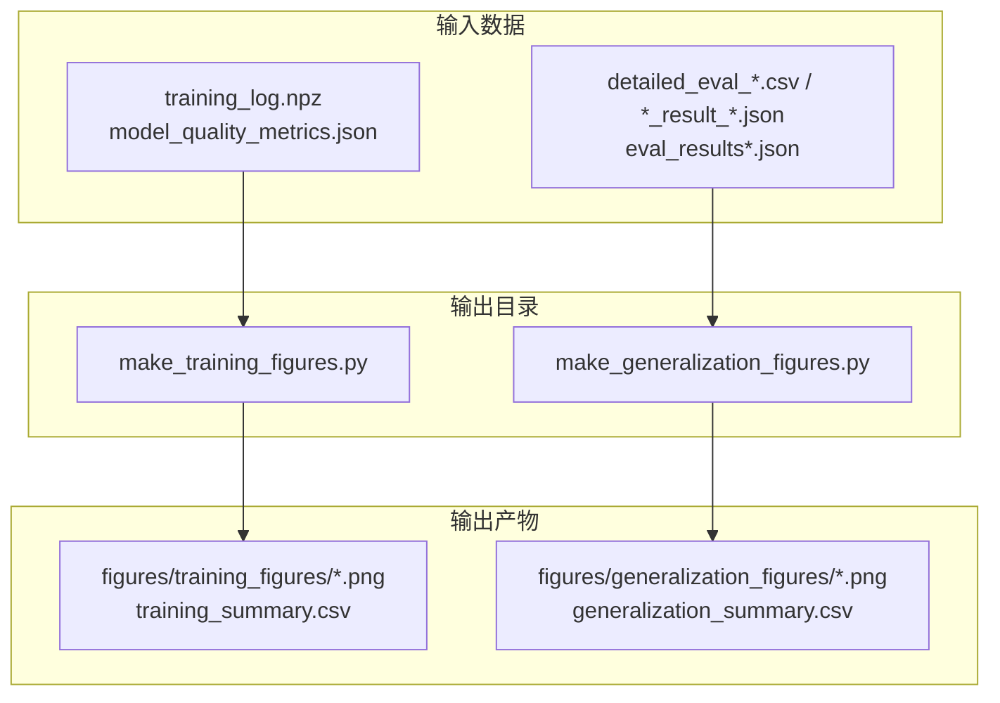
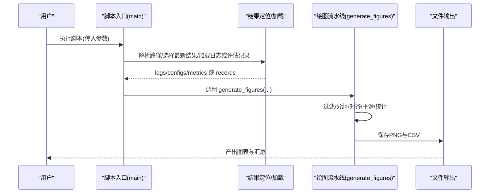
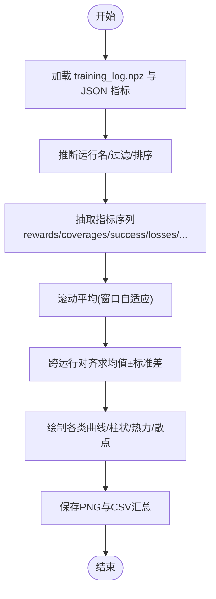
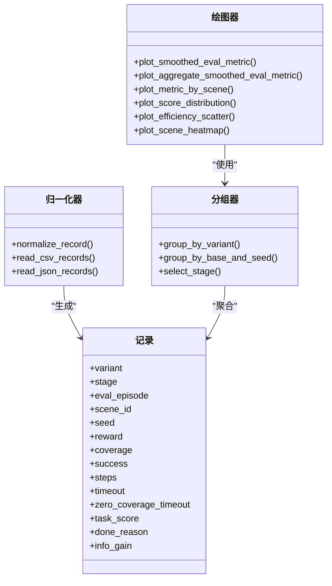
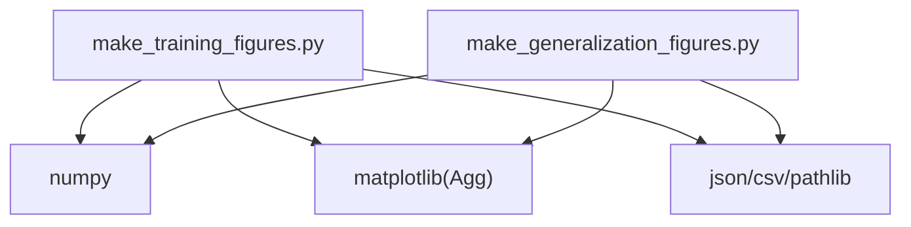

# 可视化图表生成

<cite>
**本文引用的文件**   
- [make_training_figures.py](file://environment_variables/environment_variables/outputs/make_training_figures.py)
- [make_generalization_figures.py](file://environment_variables/environment_variables/outputs/make_generalization_figures.py)
</cite>

## 目录
1. [简介](#简介)
2. [项目结构](#项目结构)
3. [核心组件](#核心组件)
4. [架构总览](#架构总览)
5. [详细组件分析](#详细组件分析)
6. [依赖关系分析](#依赖关系分析)
7. [性能与质量优化](#性能与质量优化)
8. [故障排查指南](#故障排查指南)
9. [结论](#结论)
10. [附录：参数与使用示例](#附录参数与使用示例)

## 简介
本技术文档面向“可视化图表生成系统”，聚焦训练曲线绘制引擎与泛化评估图表生成机制。内容涵盖：
- 学习曲线、损失函数曲线、奖励分布与收敛性分析的可视化实现
- 对比分析图表的生成机制（多算法性能对比、超参数敏感性、消融实验）
- 统计摘要图表（箱线图、热力图、散点图等）的自动生成
- 图表样式定制系统（颜色方案、字体设置、布局配置、导出格式）
- 交互式图表集成方法与Web界面展示建议
- 脚本参数配置、批量处理与自动化报告生成
- 图表质量优化与渲染性能调优最佳实践

## 项目结构
仓库中与可视化相关的核心脚本位于 outputs 目录下，分别负责：
- 训练结果图表生成：从保存的训练日志中自动提取指标并输出系列PNG与汇总CSV
- 泛化评估图表生成：从已保存的评估记录（CSV/JSON）中按阶段聚合并输出系列PNG与汇总CSV

**图示来源** 
- [make_training_figures.py:1-1323](file://environment_variables/environment_variables/outputs/make_training_figures.py#L1-L1323)
- [make_generalization_figures.py:1-998](file://environment_variables/environment_variables/outputs/make_generalization_figures.py#L1-L998)

**章节来源**
- [make_training_figures.py:1-1323](file://environment_variables/environment_variables/outputs/make_training_figures.py#L1-L1323)
- [make_generalization_figures.py:1-998](file://environment_variables/environment_variables/outputs/make_generalization_figures.py#L1-L998)

## 核心组件
- 训练图表生成器
  - 读取 training_log.npz 与 model_quality_metrics.json
  - 支持单运行与按种子聚合（mean ± std）两种模式
  - 输出训练相关曲线、诊断图、质量摘要与汇总CSV
- 泛化图表生成器
  - 读取多种评估记录格式（CSV/JSON），统一归一化为结构化记录
  - 支持按阶段筛选、按变体/种子分组、场景维度聚合
  - 输出泛化曲线、场景热力图、分布与效率散点图及汇总CSV

关键能力要点：
- 平滑与对齐：滚动平均窗口自适应长度；跨运行对齐后计算均值与标准差
- 标签与配色：内置方法名到显示标签与颜色的映射，保证多图一致性
- 稳健IO：Agg后端无头渲染；自动创建输出目录；清理旧图避免污染

**章节来源**
- [make_training_figures.py:79-98](file://environment_variables/environment_variables/outputs/make_training_figures.py#L79-L98)
- [make_training_figures.py:225-249](file://environment_variables/environment_variables/outputs/make_training_figures.py#L225-L249)
- [make_training_figures.py:1208-1262](file://environment_variables/environment_variables/outputs/make_training_figures.py#L1208-L1262)
- [make_generalization_figures.py:75-94](file://environment_variables/environment_variables/outputs/make_generalization_figures.py#L75-L94)
- [make_generalization_figures.py:295-358](file://environment_variables/environment_variables/outputs/make_generalization_figures.py#L295-L358)
- [make_generalization_figures.py:882-940](file://environment_variables/environment_variables/outputs/make_generalization_figures.py#L882-L940)

## 架构总览
训练与泛化两条管线共享相似的数据流：解析输入 → 归一化/对齐 → 统计聚合 → 绘图 → 持久化。

**图示来源** 
- [make_training_figures.py:1287-1323](file://environment_variables/environment_variables/outputs/make_training_figures.py#L1287-L1323)
- [make_generalization_figures.py:966-998](file://environment_variables/environment_variables/outputs/make_generalization_figures.py#L966-L998)

## 详细组件分析

### 训练曲线绘制引擎
- 数据源
  - training_log.npz：包含 episodes/rewards/coverages/success/lengths/actor_loss/critic_loss/entropy/approx_kl/clip_fraction/actor_lr/kl_lr_action/total_steps/ppo_updates/done_reasons/stage/scene_ids/task_scores 等键
  - model_quality_metrics.json：收敛效率、稳定性等高层指标
- 核心流程
  - 收集与去重：遍历 logs 目录与通配符，去重后按固定顺序排序
  - 运行名推断：根据文件名/目录名/配置文件 variant_name 推断运行名，支持 _seedN 后缀
  - 指标抽取：values_for_metric 将不同键映射为统一数值序列；task_score 由覆盖率、成功率、步长综合计算
  - 平滑与对齐：rolling_mean + effective_window；aligned_mean_std 对多条序列对齐求均值与标准差
  - 绘图：plot_smoothed_metric / plot_aggregate_metric / plot_task_score / plot_loss_curves / plot_ppo_diagnostics / plot_learning_rate / plot_timeout_rates / plot_progress_budget / plot_scene_training / plot_stage_curve / plot_done_reasons 等
  - 汇总：write_summary_csv 输出 last window 与质量指标
- 典型图表
  - 学习曲线：奖励、任务得分、边界覆盖率、成功率、步数
  - 损失曲线：Actor/Critic Loss
  - 诊断曲线：PPO KL、Clip Fraction、Actor LR 与动作计数
  - 进度预算：环境步数、PPO更新次数
  - 课程阶段：stage 步进变化
  - 终止原因：堆叠百分比柱状图
  - 场景维度：按 scene_id 聚合的覆盖率/任务得分
  - 质量摘要：AUC、阈值步数、尾部方差、KL超调率

**图示来源** 
- [make_training_figures.py:225-249](file://environment_variables/environment_variables/outputs/make_training_figures.py#L225-L249)
- [make_training_figures.py:355-363](file://environment_variables/environment_variables/outputs/make_training_figures.py#L355-L363)
- [make_training_figures.py:308-316](file://environment_variables/environment_variables/outputs/make_training_figures.py#L308-L316)
- [make_training_figures.py:1208-1262](file://environment_variables/environment_variables/outputs/make_training_figures.py#L1208-L1262)

**章节来源**
- [make_training_figures.py:118-140](file://environment_variables/environment_variables/outputs/make_training_figures.py#L118-L140)
- [make_training_figures.py:192-222](file://environment_variables/environment_variables/outputs/make_training_figures.py#L192-L222)
- [make_training_figures.py:338-346](file://environment_variables/environment_variables/outputs/make_training_figures.py#L338-L346)
- [make_training_figures.py:366-381](file://environment_variables/environment_variables/outputs/make_training_figures.py#L366-L381)
- [make_training_figures.py:582-632](file://environment_variables/environment_variables/outputs/make_training_figures.py#L582-L632)
- [make_training_figures.py:755-786](file://environment_variables/environment_variables/outputs/make_training_figures.py#L755-L786)
- [make_training_figures.py:807-849](file://environment_variables/environment_variables/outputs/make_training_figures.py#L807-L849)
- [make_training_figures.py:852-903](file://environment_variables/environment_variables/outputs/make_training_figures.py#L852-L903)
- [make_training_figures.py:906-938](file://environment_variables/environment_variables/outputs/make_training_figures.py#L906-L938)
- [make_training_figures.py:941-969](file://environment_variables/environment_variables/outputs/make_training_figures.py#L941-L969)
- [make_training_figures.py:972-1024](file://environment_variables/environment_variables/outputs/make_training_figures.py#L972-L1024)
- [make_training_figures.py:1027-1089](file://environment_variables/environment_variables/outputs/make_training_figures.py#L1027-L1089)
- [make_training_figures.py:1146-1198](file://environment_variables/environment_variables/outputs/make_training_figures.py#L1146-L1198)
- [make_training_figures.py:1208-1262](file://environment_variables/environment_variables/outputs/make_training_figures.py#L1208-L1262)

### 泛化评估图表生成机制
- 数据源
  - CSV：detailed_eval_*.csv 等
  - JSON：*_result_*.json、eval_results*.json、generalization_results*.json 等
- 数据归一化
  - normalize_record 将字段名差异统一为 variant/stage/episode/scene_id/seed/reward/coverage/success/steps/timeout/zero_coverage_timeout/task_score/done_reason/info_gain
  - read_csv_records / read_json_records 适配多种嵌套结构
- 分组与聚合
  - group_by_variant / group_by_base_and_seed 支持按变体与种子聚合
  - select_stage 按阶段筛选
  - aligned_mean_std / rolling_mean 用于曲线平滑与跨运行统计
- 图表类型
  - 平滑曲线：任务得分、奖励、覆盖率、成功率、步数
  - 场景维度：按 scene_id 聚合的柱状图
  - 分布与效率：箱线图（任务得分）、散点图（步骤 vs 覆盖率，气泡大小=任务得分）
  - 热力图：变体 × 场景的任务得分矩阵
  - 汇总：各指标均值/方差与CSV表

**图示来源** 
- [make_generalization_figures.py:256-292](file://environment_variables/environment_variables/outputs/make_generalization_figures.py#L256-L292)
- [make_generalization_figures.py:295-358](file://environment_variables/environment_variables/outputs/make_generalization_figures.py#L295-L358)
- [make_generalization_figures.py:393-411](file://environment_variables/environment_variables/outputs/make_generalization_figures.py#L393-L411)
- [make_generalization_figures.py:448-526](file://environment_variables/environment_variables/outputs/make_generalization_figures.py#L448-L526)
- [make_generalization_figures.py:537-628](file://environment_variables/environment_variables/outputs/make_generalization_figures.py#L537-L628)
- [make_generalization_figures.py:752-804](file://environment_variables/environment_variables/outputs/make_generalization_figures.py#L752-L804)
- [make_generalization_figures.py:807-838](file://environment_variables/environment_variables/outputs/make_generalization_figures.py#L807-L838)

**章节来源**
- [make_generalization_figures.py:169-195](file://environment_variables/environment_variables/outputs/make_generalization_figures.py#L169-L195)
- [make_generalization_figures.py:256-292](file://environment_variables/environment_variables/outputs/make_generalization_figures.py#L256-L292)
- [make_generalization_figures.py:345-358](file://environment_variables/environment_variables/outputs/make_generalization_figures.py#L345-L358)
- [make_generalization_figures.py:370-376](file://environment_variables/environment_variables/outputs/make_generalization_figures.py#L370-L376)
- [make_generalization_figures.py:393-411](file://environment_variables/environment_variables/outputs/make_generalization_figures.py#L393-L411)
- [make_generalization_figures.py:414-422](file://environment_variables/environment_variables/outputs/make_generalization_figures.py#L414-L422)
- [make_generalization_figures.py:431-439](file://environment_variables/environment_variables/outputs/make_generalization_figures.py#L431-L439)
- [make_generalization_figures.py:448-526](file://environment_variables/environment_variables/outputs/make_generalization_figures.py#L448-L526)
- [make_generalization_figures.py:537-628](file://environment_variables/environment_variables/outputs/make_generalization_figures.py#L537-L628)
- [make_generalization_figures.py:752-804](file://environment_variables/environment_variables/outputs/make_generalization_figures.py#L752-L804)
- [make_generalization_figures.py:807-838](file://environment_variables/environment_variables/outputs/make_generalization_figures.py#L807-L838)
- [make_generalization_figures.py:841-873](file://environment_variables/environment_variables/outputs/make_generalization_figures.py#L841-L873)
- [make_generalization_figures.py:882-940](file://environment_variables/environment_variables/outputs/make_generalization_figures.py#L882-L940)

### 对比分析与消融实验
- 多算法性能对比
  - 通过 RUN_ORDER/LABELS/COLORS 保持多图一致性与可读性
  - aggregate_seeds=True 时，按方法名聚合多个 seed 的运行，绘制 mean ± std
- 超参数敏感性
  - 以 actor_lr、kl_lr_action 等序列刻画学习率策略变化；结合 KL 诊断观察稳定性
- 消融实验
  - 通过 run_filter 筛选特定变体（如 No_SDF、No_Infotaxis、Vanilla_CTDE_PPO）进行对比

**章节来源**
- [make_training_figures.py:41-69](file://environment_variables/environment_variables/outputs/make_training_figures.py#L41-L69)
- [make_training_figures.py:1265-1284](file://environment_variables/environment_variables/outputs/make_training_figures.py#L1265-L1284)
- [make_generalization_figures.py:37-65](file://environment_variables/environment_variables/outputs/make_generalization_figures.py#L37-L65)
- [make_generalization_figures.py:943-963](file://environment_variables/environment_variables/outputs/make_generalization_figures.py#L943-L963)

### 统计摘要图表
- 箱线图：任务得分分布（泛化）
- 热力图：变体 × 场景的任务得分矩阵
- 散点图：步骤 vs 覆盖率，气泡大小映射任务得分
- 三维散点图：当前未直接实现；可通过扩展 scatter 增加第三维（例如用颜色或分面）

**章节来源**
- [make_generalization_figures.py:752-804](file://environment_variables/environment_variables/outputs/make_generalization_figures.py#L752-L804)
- [make_generalization_figures.py:807-838](file://environment_variables/environment_variables/outputs/make_generalization_figures.py#L807-L838)

### 图表样式定制系统
- 字体与网格：统一设置 sans-serif 字体族、网格透明度与线型、关闭顶部/右侧边框
- DPI与布局：默认 figure.dpi=120，savefig.bbox="tight"，可命令行覆盖 --dpi
- 颜色与标签：集中维护 COLORS/LABELS/RUN_ORDER，确保多图一致
- 导出格式：PNG（Agg后端），CSV 汇总便于二次加工

**章节来源**
- [make_training_figures.py:79-98](file://environment_variables/environment_variables/outputs/make_training_figures.py#L79-L98)
- [make_generalization_figures.py:75-94](file://environment_variables/environment_variables/outputs/make_generalization_figures.py#L75-L94)
- [make_training_figures.py:1265-1284](file://environment_variables/environment_variables/outputs/make_training_figures.py#L1265-L1284)
- [make_generalization_figures.py:943-963](file://environment_variables/environment_variables/outputs/make_generalization_figures.py#L943-L963)

### 交互式图表与Web展示方案
- 当前实现为离线批处理（Agg后端），不直接提供交互
- 建议方案
  - 将 PNG/CSV 作为静态资源，配合前端库（Plotly/D3/ECharts）构建交互页面
  - 使用 Streamlit/FastAPI 封装脚本，提供参数表单与在线渲染
  - 将汇总CSV导入数据库，供仪表盘查询与下钻

[本节为概念性说明，不涉及具体代码文件]

## 依赖关系分析
- 外部依赖
  - matplotlib（Agg后端）
  - numpy（数组运算、卷积平滑）
  - json/csv/pathlib（I/O）
- 内部耦合
  - 训练与泛化两个脚本相互独立，但共享一致的命名约定与输出目录结构
  - 两者均通过命令行参数控制输出目录、窗口大小、DPI、过滤条件与是否聚合种子

**图示来源** 
- [make_training_figures.py:17-32](file://environment_variables/environment_variables/outputs/make_training_figures.py#L17-L32)
- [make_generalization_figures.py:16-31](file://environment_variables/environment_variables/outputs/make_generalization_figures.py#L16-L31)

**章节来源**
- [make_training_figures.py:17-32](file://environment_variables/environment_variables/outputs/make_training_figures.py#L17-L32)
- [make_generalization_figures.py:16-31](file://environment_variables/environment_variables/outputs/make_generalization_figures.py#L16-L31)

## 性能与质量优化
- 渲染性能
  - Agg后端无GUI开销，适合服务器批量出图
  - 合理设置 DPI（默认300可降为150~200提升速度）
  - 减少不必要的子图数量，合并指标面板
- 数据处理
  - 使用有效窗口 effective_window 自适应长度，避免过长窗口导致信息丢失
  - 对齐前裁剪至最短序列长度，降低内存占用
- 输出管理
  - clean_previous_outputs 清理旧图，避免磁盘膨胀
  - 汇总CSV便于后续自动化报告与版本归档

**章节来源**
- [make_training_figures.py:1201-1206](file://environment_variables/environment_variables/outputs/make_training_figures.py#L1201-L1206)
- [make_generalization_figures.py:875-879](file://environment_variables/environment_variables/outputs/make_generalization_figures.py#L875-L879)
- [make_training_figures.py:302-316](file://environment_variables/environment_variables/outputs/make_training_figures.py#L302-L316)
- [make_generalization_figures.py:425-439](file://environment_variables/environment_variables/outputs/make_generalization_figures.py#L425-L439)

## 故障排查指南
- 找不到训练日志
  - 现象：抛出“未找到保存的训练日志”错误
  - 排查：确认 outputs 下存在 training_log.npz 或 logs/training_log.npz；检查 --results-dir 指向是否正确
- 找不到泛化数据
  - 现象：抛出“未找到保存的泛化数据”错误
  - 排查：确认存在 detailed_eval_*.csv 或 *_result_*.json 等；检查 stage 是否存在
- 运行名过滤无匹配
  - 现象：抛出“无匹配运行”错误
  - 排查：调整 --run-filter 文本，确保与运行名片段匹配
- 缺失键值
  - 现象：KeyError 提示缺少键
  - 排查：确认日志中包含对应键（如 actor_loss、approx_kl、actor_lr 等）

**章节来源**
- [make_training_figures.py:147-154](file://environment_variables/environment_variables/outputs/make_training_figures.py#L147-L154)
- [make_training_figures.py:270-277](file://environment_variables/environment_variables/outputs/make_training_figures.py#L270-L277)
- [make_generalization_figures.py:213-224](file://environment_variables/environment_variables/outputs/make_generalization_figures.py#L213-L224)
- [make_generalization_figures.py:345-358](file://environment_variables/environment_variables/outputs/make_generalization_figures.py#L345-L358)

## 结论
该可视化系统围绕训练与泛化两大主线，提供了从原始日志到高质量图表的一站式生成能力。其设计强调：
- 数据归一化与稳健聚合（对齐、平滑、均值±标准差）
- 一致的视觉语言（标签、颜色、布局）
- 可扩展的图表模板（曲线、柱状、热力、散点、箱线）
- 批处理友好（Agg后端、CLI参数、自动清理）

在现有基础上，可进一步引入交互式前端与更丰富的统计图表（如雷达图、三维散点），以满足更广泛的汇报与探索需求。

[本节为总结性内容，不涉及具体代码文件]

## 附录：参数与使用示例
- 训练图表脚本
  - 常用参数
    - --results-dir/--comparison-dir：结果根目录
    - --out-dir：输出图片目录
    - --window：移动平均窗口
    - --dpi：图像分辨率
    - --max-steps：最大步数（影响Y轴上限）
    - --run-filter：运行名过滤
    - --aggregate-seeds：按方法聚合多颗种子
  - 示例
    - python make_training_figures.py --results-dir outputs/lr_comparison_xxx --window 100 --dpi 300 --aggregate-seeds
- 泛化图表脚本
  - 常用参数
    - --results-dir/--comparison-dir：结果根目录
    - --out-dir：输出图片目录
    - --window：移动平均窗口
    - --dpi：图像分辨率
    - --stage：指定阶段（默认最高阶段）
    - --max-steps：最大步数
    - --run-filter：运行名过滤
    - --aggregate-seeds：按方法聚合多颗种子
  - 示例
    - python make_generalization_figures.py --results-dir outputs/lr_comparison_xxx --stage 3 --window 10 --dpi 300

**章节来源**
- [make_training_figures.py:1265-1284](file://environment_variables/environment_variables/outputs/make_training_figures.py#L1265-L1284)
- [make_generalization_figures.py:943-963](file://environment_variables/environment_variables/outputs/make_generalization_figures.py#L943-L963)