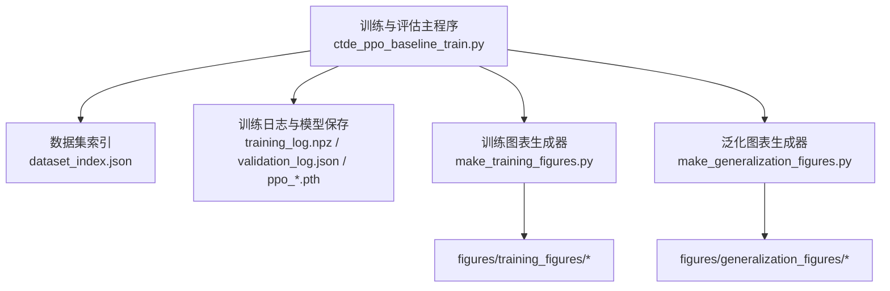
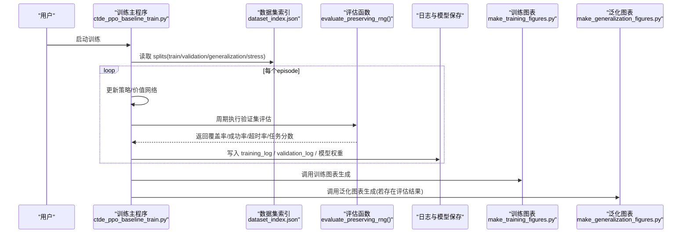
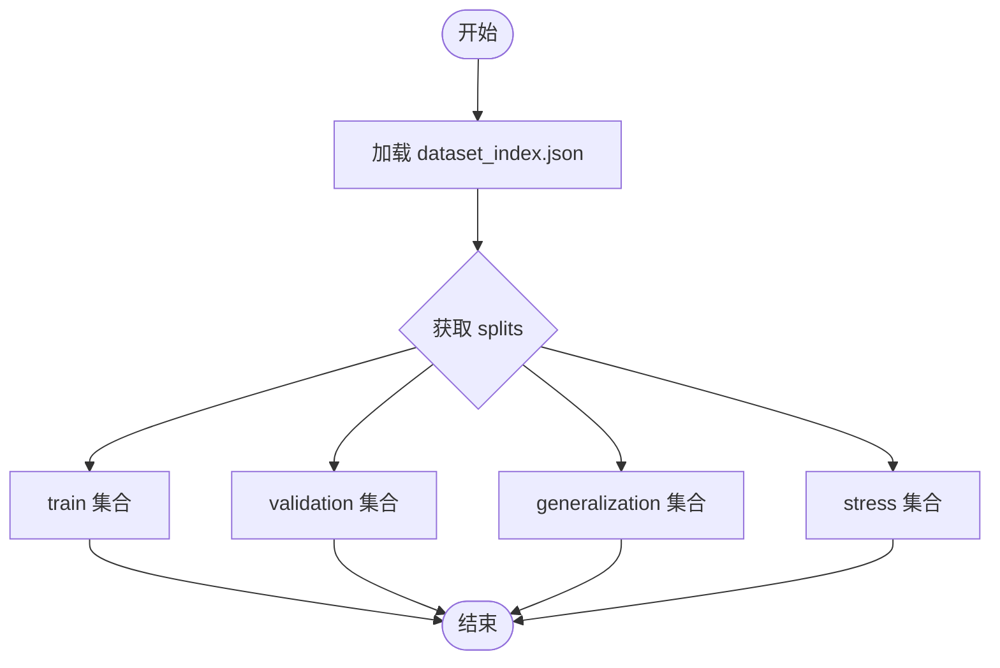
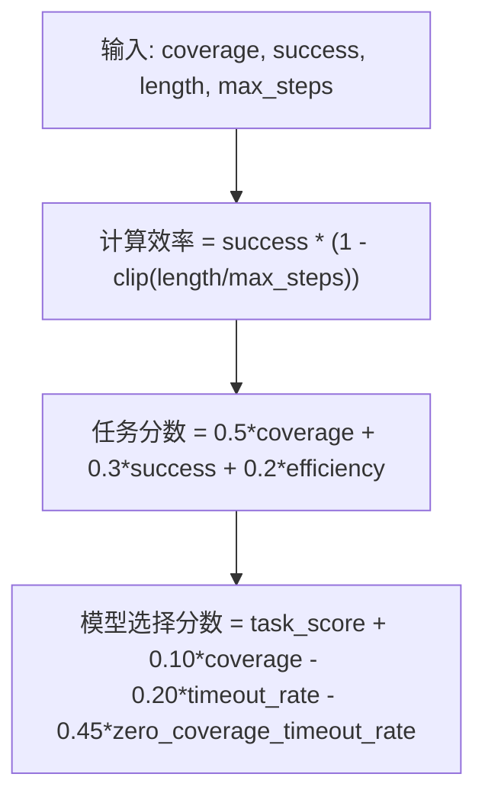
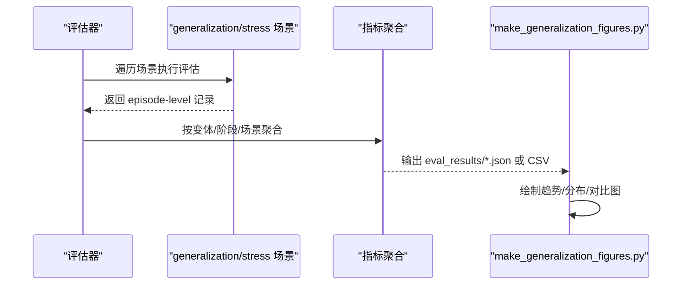
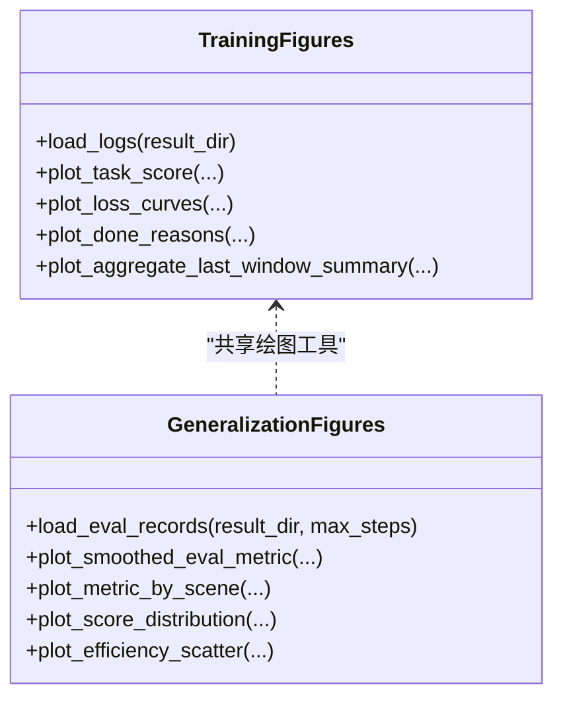
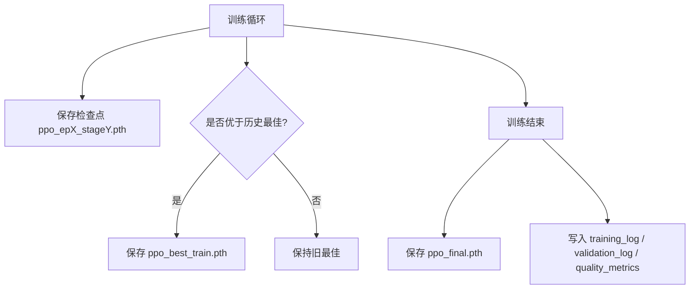
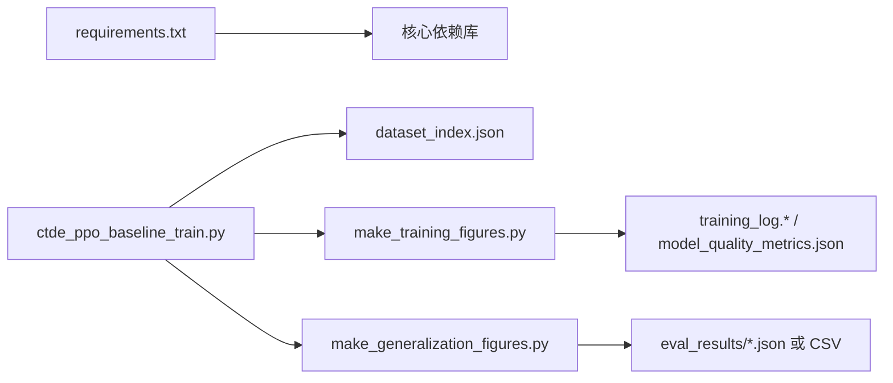

# 完整评估体系

<cite>
**本文引用的文件**   
- [ctde_ppo_baseline_train.py](file://environment_variables/environment_variables/ctde_ppo_baseline_train.py)
- [dataset_index.json](file://environment_variables/environment_variables/dataset/dataset_index.json)
- [make_training_figures.py](file://environment_variables/environment_variables/outputs/make_training_figures.py)
- [make_generalization_figures.py](file://environment_variables/environment_variables/outputs/make_generalization_figures.py)
- [requirements.txt](file://environment_variables/requirements.txt)
- [test_training_selection_score.py](file://environment_variables/environment_variables/test_training_selection_score.py)
</cite>

## 目录
1. [引言](#引言)
2. [项目结构](#项目结构)
3. [核心组件](#核心组件)
4. [架构总览](#架构总览)
5. [详细组件分析](#详细组件分析)
6. [依赖关系分析](#依赖关系分析)
7. [性能考量](#性能考量)
8. [故障排查指南](#故障排查指南)
9. [结论](#结论)
10. [附录](#附录)

## 引言
本技术文档围绕“完整评估体系”展开，系统阐述验证集测试框架、泛化能力评估方法、性能指标体系、可视化图表生成系统与实验结果管理。目标读者包括算法工程师与项目管理者，既提供代码级细节，也给出可操作的实践建议。

## 项目结构
仓库采用“训练脚本 + 数据索引 + 可视化脚本 + 输出产物”的分层组织方式：
- 训练与评估主流程位于 environment_variables/environment_variables/ctde_ppo_baseline_train.py
- 数据集划分与场景清单由 environment_variables/environment_variables/dataset/dataset_index.json 维护
- 训练曲线与对比分析由 outputs/make_training_figures.py 生成
- 泛化评估图表由 outputs/make_generalization_figures.py 生成
- 依赖声明在 environment_variables/requirements.txt

图示来源
- [ctde_ppo_baseline_train.py:1053-1087](file://environment_variables/environment_variables/ctde_ppo_baseline_train.py#L1053-L1087)
- [make_training_figures.py:143-176](file://environment_variables/environment_variables/outputs/make_training_figures.py#L143-L176)
- [make_generalization_figures.py:213-245](file://environment_variables/environment_variables/outputs/make_generalization_figures.py#L213-L245)

章节来源
- [ctde_ppo_baseline_train.py:1053-1087](file://environment_variables/environment_variables/ctde_ppo_baseline_train.py#L1053-L1087)
- [make_training_figures.py:143-176](file://environment_variables/environment_variables/outputs/make_training_figures.py#L143-L176)
- [make_generalization_figures.py:213-245](file://environment_variables/environment_variables/outputs/make_generalization_figures.py#L213-L245)

## 核心组件
- 验证集测试框架：基于 dataset_index.json 的 split 字段进行 train/validation/generalization/stress 四分割；训练过程中周期性对 validation 集合执行 evaluate_preserving_rng，并记录多指标序列。
- 评估指标计算：任务分数由覆盖率、成功率、步长效率加权合成；模型选择分数进一步引入超时率与零覆盖超时率以抑制不稳定解。
- 泛化能力评估：针对 generalization 与 stress 两个独立集合进行跨场景与压力测试，统计成功率、覆盖率、超时率、任务分数等。
- 可视化图表系统：训练阶段通过 make_training_figures.py 绘制任务分数、成功率、覆盖率、超时率、KL损失、完成原因分布等；泛化阶段通过 make_generalization_figures.py 汇总各变体在各场景上的表现。
- 实验结果管理：每轮保存 ppo_epX_stageY.pth 检查点与最佳/最终模型；同时持久化 training_log.json/.npz、validation_log.json/.npz、model_quality_metrics.json 等结构化日志。

章节来源
- [dataset_index.json:34-88](file://environment_variables/environment_variables/dataset/dataset_index.json#L34-L88)
- [ctde_ppo_baseline_train.py:295-305](file://environment_variables/environment_variables/ctde_ppo_baseline_train.py#L295-L305)
- [ctde_ppo_baseline_train.py:1647-1697](file://environment_variables/environment_variables/ctde_ppo_baseline_train.py#L1647-L1697)
- [make_training_figures.py:366-381](file://environment_variables/environment_variables/outputs/make_training_figures.py#L366-L381)
- [make_generalization_figures.py:156-159](file://environment_variables/environment_variables/outputs/make_generalization_figures.py#L156-L159)

## 架构总览
下图展示从数据索引到训练、评估、可视化的端到端流程。

图示来源
- [ctde_ppo_baseline_train.py:1053-1087](file://environment_variables/environment_variables/ctde_ppo_baseline_train.py#L1053-L1087)
- [ctde_ppo_baseline_train.py:1647-1697](file://environment_variables/environment_variables/ctde_ppo_baseline_train.py#L1647-L1697)
- [make_training_figures.py:143-176](file://environment_variables/environment_variables/outputs/make_training_figures.py#L143-L176)
- [make_generalization_figures.py:213-245](file://environment_variables/environment_variables/outputs/make_generalization_figures.py#L213-L245)

## 详细组件分析

### 数据集划分策略
- 四分割定义：train、validation、generalization、stress 四个集合，分别对应不同区域与场景编号，便于控制变量与跨域评估。
- 场景元数据：每个 scene_key 包含路径映射、栅格字段、矢量与输入配置、风场参数、火灾统计信息等，确保环境一致性。
- 扩展方式：新增场景只需在 dataset_index.json 中注册，并在相应 split 列表中添加 scene_key。

图示来源
- [dataset_index.json:34-88](file://environment_variables/environment_variables/dataset/dataset_index.json#L34-L88)

章节来源
- [dataset_index.json:34-88](file://environment_variables/environment_variables/dataset/dataset_index.json#L34-L88)

### 评估指标计算与结果统计分析
- 任务分数（Task Score）：综合覆盖率（Coverage）、成功率（Success）、步长效率（Efficiency），其中效率项惩罚过长回合。
- 模型选择分数（Validation Model Score）：在任务分数基础上加入覆盖率正向激励与两类超时率负向惩罚，用于稳定模型选择。
- 验证日志字段：包含每回合的训练/验证任务分数、覆盖率、成功率、平均长度、超时率、零覆盖超时率、泛化差距与是否最佳标记。

图示来源
- [ctde_ppo_baseline_train.py:295-305](file://environment_variables/environment_variables/ctde_ppo_baseline_train.py#L295-L305)

章节来源
- [ctde_ppo_baseline_train.py:295-305](file://environment_variables/environment_variables/ctde_ppo_baseline_train.py#L295-L305)
- [ctde_ppo_baseline_train.py:1647-1697](file://environment_variables/environment_variables/ctde_ppo_baseline_train.py#L1647-L1697)
- [test_training_selection_score.py:1-28](file://environment_variables/environment_variables/test_training_selection_score.py#L1-L28)

### 泛化能力评估方法
- 跨场景测试：在 generalization 集合上运行评估，按场景聚合覆盖率、成功率、任务分数等指标，观察分布与稳定性。
- 压力测试：在 stress 集合上评估极端或高难度场景，关注超时率与零覆盖超时率，检验鲁棒性。
- 图表支持：make_generalization_figures.py 支持多种输入格式（CSV/JSON），自动识别变体名称与阶段，绘制平滑曲线、场景柱状图、箱线图与散点图。

图示来源
- [make_generalization_figures.py:169-199](file://environment_variables/environment_variables/outputs/make_generalization_figures.py#L169-L199)
- [make_generalization_figures.py:213-245](file://environment_variables/environment_variables/outputs/make_generalization_figures.py#L213-L245)

章节来源
- [make_generalization_figures.py:156-159](file://environment_variables/environment_variables/outputs/make_generalization_figures.py#L156-L159)
- [make_generalization_figures.py:169-199](file://environment_variables/environment_variables/outputs/make_generalization_figures.py#L169-L199)
- [make_generalization_figures.py:213-245](file://environment_variables/environment_variables/outputs/make_generalization_figures.py#L213-L245)

### 性能指标体系
- 成功率（Success Rate）：任务完成的回合比例。
- 覆盖率（Coverage）：边界或目标区域被覆盖的比例。
- 超时率（Timeout Rate）：达到最大步数限制的回合比例。
- 零覆盖超时率（Zero Coverage Timeout Rate）：未覆盖任何目标且超时的比例，作为强惩罚项。
- 任务分数（Task Score）：综合上述指标的加权得分，用于排序与比较。
- 训练阶段指标：奖励、KL 损失、Actor/Critic 损失、完成原因分布等，辅助诊断训练动态。

章节来源
- [make_training_figures.py:366-381](file://environment_variables/environment_variables/outputs/make_training_figures.py#L366-L381)
- [ctde_ppo_baseline_train.py:1647-1697](file://environment_variables/environment_variables/ctde_ppo_baseline_train.py#L1647-L1697)

### 可视化图表生成系统
- 训练图表（make_training_figures.py）：
  - 自动发现最新训练日志与质量指标 JSON。
  - 支持多变体对比、滚动窗口平滑、均值±标准差填充、阶段切换曲线、完成原因堆叠柱状图、损失曲线等。
  - 输出目录默认 figures/training_figures。
- 泛化图表（make_generalization_figures.py）：
  - 支持多种评估结果文件格式，自动推断变体名与阶段。
  - 输出平滑曲线、按场景分组柱状图、箱线图、散点图（步骤 vs 覆盖率，气泡大小表示任务分数）。
  - 输出目录默认 figures/generalization_figures。

图示来源
- [make_training_figures.py:225-249](file://environment_variables/environment_variables/outputs/make_training_figures.py#L225-L249)
- [make_training_figures.py:366-381](file://environment_variables/environment_variables/outputs/make_training_figures.py#L366-L381)
- [make_generalization_figures.py:345-358](file://environment_variables/environment_variables/outputs/make_generalization_figures.py#L345-L358)
- [make_generalization_figures.py:448-483](file://environment_variables/environment_variables/outputs/make_generalization_figures.py#L448-L483)

章节来源
- [make_training_figures.py:143-176](file://environment_variables/environment_variables/outputs/make_training_figures.py#L143-L176)
- [make_training_figures.py:225-249](file://environment_variables/environment_variables/outputs/make_training_figures.py#L225-L249)
- [make_training_figures.py:366-381](file://environment_variables/environment_variables/outputs/make_training_figures.py#L366-L381)
- [make_generalization_figures.py:169-199](file://environment_variables/environment_variables/outputs/make_generalization_figures.py#L169-L199)
- [make_generalization_figures.py:345-358](file://environment_variables/environment_variables/outputs/make_generalization_figures.py#L345-L358)

### 实验结果管理
- 模型保存：
  - 定期保存检查点 ppo_ep{episode}_stage{stage}.pth。
  - 根据最近窗口任务分数或验证选择分数保存最佳模型 ppo_best_train.pth。
  - 训练结束时保存最终模型 ppo_final.pth。
- 日志记录：
  - training_log.json/.npz：训练过程指标序列。
  - validation_log.json/.npz：验证期指标序列与泛化差距。
  - model_quality_metrics.json：收敛效率、AUC、阈值步数、尾部稳定性、KL 过冲率等质量摘要。
- 版本控制建议：
  - 使用时间戳目录区分实验批次。
  - 将 config.json 与关键脚本快照保存在同一结果目录下，便于复现。

图示来源
- [ctde_ppo_baseline_train.py:1647-1697](file://environment_variables/environment_variables/ctde_ppo_baseline_train.py#L1647-L1697)

章节来源
- [ctde_ppo_baseline_train.py:1647-1697](file://environment_variables/environment_variables/ctde_ppo_baseline_train.py#L1647-L1697)

## 依赖关系分析
- 核心依赖：numpy、rasterio、matplotlib、scipy、opencv-python。
- 可选依赖：stable-baselines3、torch、tensorboard（当前未启用）。
- 模块耦合：
  - 训练主程序依赖 dataset_index.json 进行数据切分。
  - 训练主程序调用 make_training_figures.py 与 make_generalization_figures.py 生成图表。
  - 图表脚本仅消费已保存的日志与评估结果，不触发新评估。

图示来源
- [requirements.txt:1-13](file://environment_variables/requirements.txt#L1-L13)
- [ctde_ppo_baseline_train.py:1053-1087](file://environment_variables/environment_variables/ctde_ppo_baseline_train.py#L1053-L1087)
- [make_training_figures.py:143-176](file://environment_variables/environment_variables/outputs/make_training_figures.py#L143-L176)
- [make_generalization_figures.py:213-245](file://environment_variables/environment_variables/outputs/make_generalization_figures.py#L213-L245)

章节来源
- [requirements.txt:1-13](file://environment_variables/requirements.txt#L1-L13)
- [ctde_ppo_baseline_train.py:1053-1087](file://environment_variables/environment_variables/ctde_ppo_baseline_train.py#L1053-L1087)

## 性能考量
- 指标平滑：训练图表使用滚动窗口均值与标准差填充，有助于降低噪声并突出趋势。
- 对齐聚合：多随机种子下按最小长度对齐后求均值与标准差，避免长度不一致导致的偏差。
- 任务分数设计：通过效率项抑制超长回合，鼓励高效探索；模型选择分数对超时与零覆盖施加更强惩罚，提升稳定性。
- I/O 优化：训练与验证日志以 npz 与 json 双格式保存，兼顾可读性与加载速度。

[本节为通用指导，无需特定文件引用]

## 故障排查指南
- 找不到训练日志：
  - 现象：训练图表脚本报错“未找到保存的训练日志”。
  - 处理：确认结果目录中存在 logs/training_log.npz 或 training_log_*.npz；检查 resolve_results_dir 逻辑是否正确解析相对路径。
- 无泛化数据：
  - 现象：泛化图表脚本报错“未找到保存的泛化数据”。
  - 处理：确保评估结果以 eval_results.json、detailed_eval_*.csv 或 _result_*.json 形式保存；检查文件名匹配模式。
- 指标缺失：
  - 现象：某些指标为空数组。
  - 处理：检查 values_for_metric 映射键是否存在于日志；必要时补充 key 或在日志中补齐字段。
- 模型选择异常：
  - 现象：高任务分数但高超时率的模型被选中。
  - 处理：调整模型选择分数权重，强化对超时与零覆盖超时率的惩罚；参考单元测试用例验证行为。

章节来源
- [make_training_figures.py:143-176](file://environment_variables/environment_variables/outputs/make_training_figures.py#L143-L176)
- [make_generalization_figures.py:213-245](file://environment_variables/environment_variables/outputs/make_generalization_figures.py#L213-L245)
- [make_training_figures.py:366-381](file://environment_variables/environment_variables/outputs/make_training_figures.py#L366-L381)
- [test_training_selection_score.py:1-28](file://environment_variables/environment_variables/test_training_selection_score.py#L1-L28)

## 结论
该评估体系以清晰的数据集划分为基础，构建了涵盖成功率、覆盖率、超时率与任务分数的多维指标，并通过模型选择分数引导稳定学习。训练与泛化两套可视化脚本提供了丰富的对比与诊断视图，配合完善的日志与模型保存机制，形成闭环的实验管理与复现实验流程。建议在后续迭代中持续完善自定义指标扩展与自动化报告生成。

[本节为总结，无需特定文件引用]

## 附录

### 评估脚本使用指南
- 训练图表生成：
  - 入口：make_training_figures.py
  - 典型用法：指定 --results-dir 指向包含 logs/training_log.npz 的结果目录；可选 --window、--dpi、--max-steps、--out-dir、--run-filter、--aggregate-seeds。
  - 输出：figures/training_figures 下的各类曲线与汇总图。
- 泛化图表生成：
  - 入口：make_generalization_figures.py
  - 典型用法：指定 --results-dir 指向包含评估结果的目录；脚本会自动扫描多种命名模式的评估文件。
  - 输出：figures/generalization_figures 下的趋势、分布与对比图。

章节来源
- [ctde_ppo_baseline_train.py:1053-1087](file://environment_variables/environment_variables/ctde_ppo_baseline_train.py#L1053-L1087)
- [make_training_figures.py:143-176](file://environment_variables/environment_variables/outputs/make_training_figures.py#L143-L176)
- [make_generalization_figures.py:213-245](file://environment_variables/environment_variables/outputs/make_generalization_figures.py#L213-L245)

### 自定义评估指标扩展方法
- 在训练日志中新增字段：
  - 在训练主程序中计算并追加新的指标序列至 training_log 与 validation_log。
  - 同步更新 model_quality_metrics.json 中的质量摘要。
- 在训练图表中支持新指标：
  - 在 values_for_metric 中增加键映射，使 plot_* 函数能读取新指标。
  - 如需特殊变换（如百分比转换），在 values_for_metric 内统一处理。
- 在泛化图表中支持新指标：
  - 在 normalize_record 中解析并标准化新字段。
  - 在 plot_* 函数中增加对新指标的聚合与可视化逻辑。
- 验证行为：
  - 编写单元测试覆盖新指标的计算与筛选逻辑，确保与模型选择分数一致。

章节来源
- [ctde_ppo_baseline_train.py:1647-1697](file://environment_variables/environment_variables/ctde_ppo_baseline_train.py#L1647-L1697)
- [make_training_figures.py:366-381](file://environment_variables/environment_variables/outputs/make_training_figures.py#L366-L381)
- [make_generalization_figures.py:256-292](file://environment_variables/environment_variables/outputs/make_generalization_figures.py#L256-L292)
- [test_training_selection_score.py:1-28](file://environment_variables/environment_variables/test_training_selection_score.py#L1-L28)