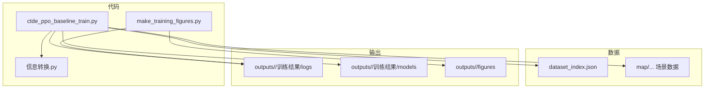
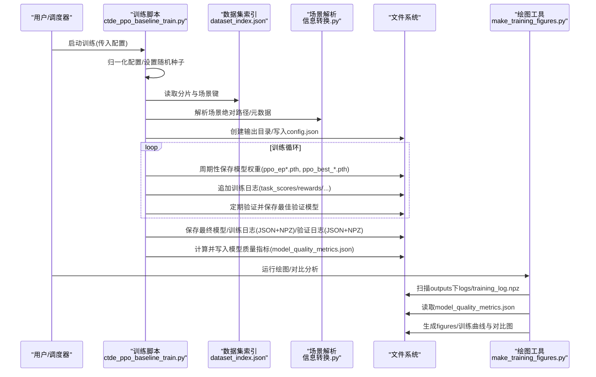
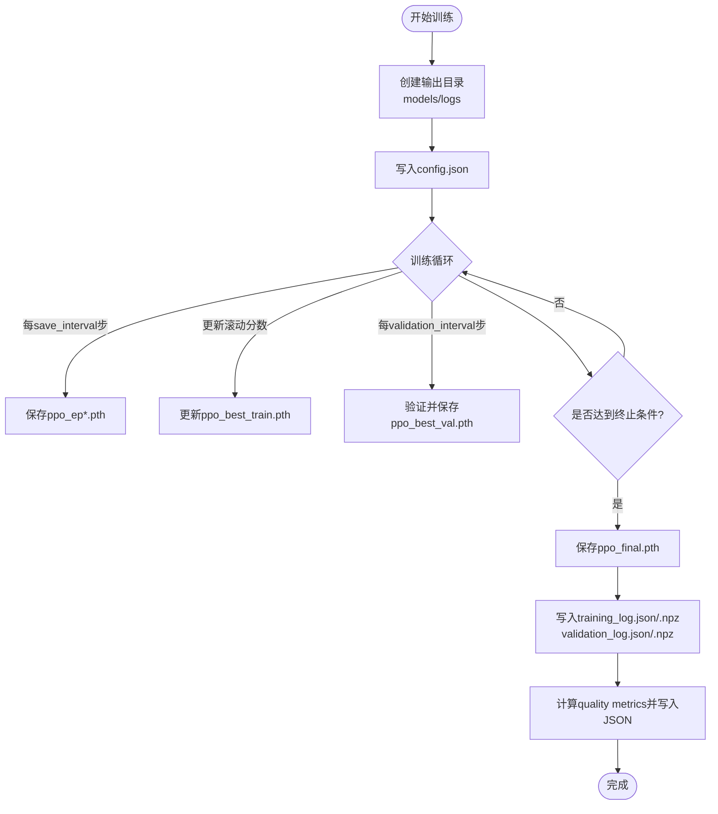
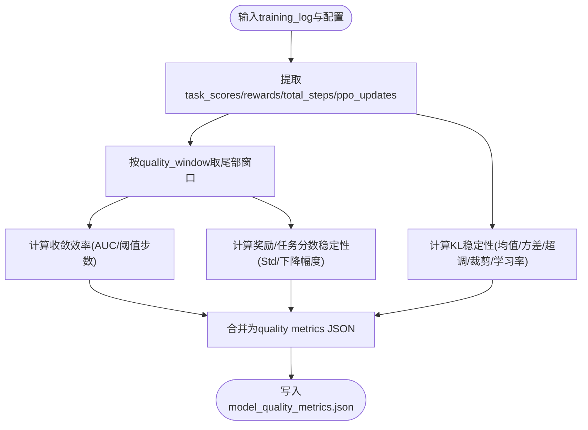
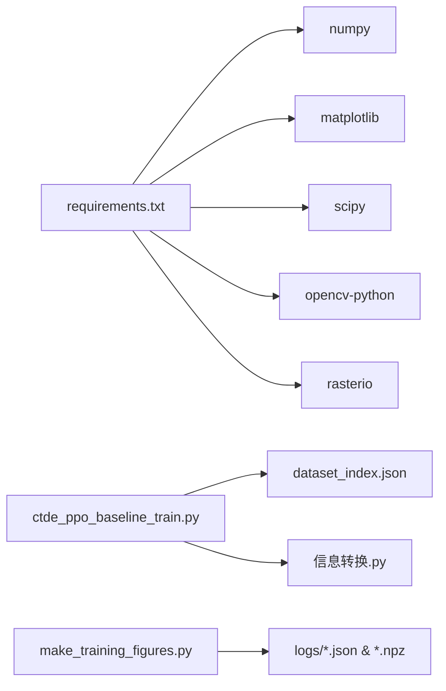

# 实验结果管理

<cite>
**本文引用的文件**   
- [ctde_ppo_baseline_train.py](file://environment_variables/environment_variables/ctde_ppo_baseline_train.py)
- [make_training_figures.py](file://environment_variables/environment_variables/outputs/make_training_figures.py)
- [dataset_index.json](file://environment_variables/environment_variables/dataset/dataset_index.json)
- [信息转换.py](file://environment_variables/environment_variables/信息转换.py)
- [requirements.txt](file://environment_variables/requirements.txt)
</cite>

## 目录
1. [简介](#简介)
2. [项目结构](#项目结构)
3. [核心组件](#核心组件)
4. [架构总览](#架构总览)
5. [详细组件分析](#详细组件分析)
6. [依赖关系分析](#依赖关系分析)
7. [性能考量](#性能考量)
8. [故障排查指南](#故障排查指南)
9. [结论](#结论)
10. [附录](#附录)

## 简介
本技术文档面向“实验结果管理系统”，围绕模型保存机制、日志记录系统、实验配置与可复现性、结果目录组织、质量评估指标计算与存储、结果查询与分析工具，以及数据备份迁移清理策略进行系统化说明。该系统以强化学习训练脚本为核心，结合数据集索引与场景元数据，形成从训练到归档的完整闭环，支持多变体对比、趋势分析与最佳模型选择。

## 项目结构
仓库采用“环境/脚本 + 数据 + 输出”的分层组织方式：
- environment_variables/environment_variables：训练主脚本、绘图与汇总工具、数据索引与场景解析模块
- environment_variables/environment_variables/dataset：数据集索引（含分片、路径映射、栅格字段定义）
- environment_variables/environment_variables/outputs：按时间戳或对比任务划分的实验输出根目录，内部包含训练结果、日志、图表等
- map：FARSITE 场景数据（训练/验证/泛化/压力测试），每个场景包含输入、栅格、矢量、报告与元数据

图示来源
- [ctde_ppo_baseline_train.py:1268-1315](file://environment_variables/environment_variables/ctde_ppo_baseline_train.py#L1268-L1315)
- [make_training_figures.py:108-176](file://environment_variables/environment_variables/outputs/make_training_figures.py#L108-L176)
- [dataset_index.json:1-33](file://environment_variables/environment_variables/dataset/dataset_index.json#L1-L33)

章节来源
- [ctde_ppo_baseline_train.py:1-200](file://environment_variables/environment_variables/ctde_ppo_baseline_train.py#L1-L200)
- [make_training_figures.py:1-200](file://environment_variables/environment_variables/outputs/make_training_figures.py#L1-L200)
- [dataset_index.json:1-33](file://environment_variables/environment_variables/dataset/dataset_index.json#L1-L33)

## 核心组件
- 训练与结果落盘：负责创建输出目录、写入配置、保存模型权重、记录训练与验证日志、生成质量指标与可视化
- 数据集索引与场景解析：提供场景键、分片划分、栅格/矢量/输入/报告路径解析与绝对路径展开
- 结果查询与绘图：自动发现最近一次或指定结果目录，加载日志与指标，绘制训练曲线与对比图
- 控制台日志重定向：将标准输出与错误输出同时写入文件，便于离线回溯

章节来源
- [ctde_ppo_baseline_train.py:1268-1315](file://environment_variables/environment_variables/ctde_ppo_baseline_train.py#L1268-L1315)
- [ctde_ppo_baseline_train.py:1647-1697](file://environment_variables/environment_variables/ctde_ppo_baseline_train.py#L1647-L1697)
- [ctde_ppo_baseline_train.py:358-385](file://environment_variables/environment_variables/ctde_ppo_baseline_train.py#L358-L385)
- [make_training_figures.py:108-176](file://environment_variables/environment_variables/outputs/make_training_figures.py#L108-L176)
- [信息转换.py:101-134](file://environment_variables/environment_variables/信息转换.py#L101-L134)

## 架构总览
下图展示了从训练入口到结果落盘、再到可视化的端到端流程。

图示来源
- [ctde_ppo_baseline_train.py:1268-1315](file://environment_variables/environment_variables/ctde_ppo_baseline_train.py#L1268-L1315)
- [ctde_ppo_baseline_train.py:1647-1697](file://environment_variables/environment_variables/ctde_ppo_baseline_train.py#L1647-L1697)
- [make_training_figures.py:108-176](file://environment_variables/environment_variables/outputs/make_training_figures.py#L108-L176)

## 详细组件分析

### 模型保存机制（权重、元数据、版本控制与归档）
- 权重文件命名与位置
  - 周期快照：ppo_ep{episode}_stage{curriculum.current_stage}.pth
  - 训练最优：ppo_best_train.pth（基于滚动任务分数）
  - 验证最优：ppo_best_val.pth（基于验证集指标）
  - 最终模型：ppo_final.pth
  - 存放目录：outputs/<experiment>/训练结果/models
- 元数据记录
  - 每次训练在输出根目录写入 config.json，固化参数版本
  - 训练前构建 dataset_preflight.json，记录数据集索引版本、分片计数、热场健康检查限制与失败项
  - 训练结束写入 training_log.json 与 validation_log.json（同时保存 npz 二进制副本）
- 版本控制与归档策略
  - 通过 outputs 下按时间戳命名的子目录隔离不同实验；对比任务使用 lr_comparison_<timestamp> 聚合多个变体
  - 每个变体独立目录，内含 models/logs/figures，便于归档与迁移
  - 质量指标 model_quality_metrics.json 作为模型质量的“轻量摘要”，便于跨实验比较

图示来源
- [ctde_ppo_baseline_train.py:1647-1697](file://environment_variables/environment_variables/ctde_ppo_baseline_train.py#L1647-L1697)
- [ctde_ppo_baseline_train.py:1268-1315](file://environment_variables/environment_variables/ctde_ppo_baseline_train.py#L1268-L1315)

章节来源
- [ctde_ppo_baseline_train.py:1647-1697](file://environment_variables/environment_variables/ctde_ppo_baseline_train.py#L1647-L1697)
- [ctde_ppo_baseline_train.py:1268-1315](file://environment_variables/environment_variables/ctde_ppo_baseline_train.py#L1268-L1315)

### 日志记录系统（训练过程、调试、性能指标与错误追踪）
- 控制台日志重定向
  - 通过 TeeStream 将 stdout/stderr 同时写入 train_console_log.txt，确保终端与文件一致
- 结构化日志
  - training_log.json/.npz：任务分数、奖励、总步数、PPO更新次数、覆盖率、成功率、超时率等时序指标
  - validation_log.json/.npz：验证集均值指标与泛化差距序列
  - dataset_preflight.json：边界校验统计与热场健康检查记录/失败清单
- 错误追踪
  - 控制台日志保留异常堆栈与关键断言信息
  - 热场健康检查失败项会显式记录，便于快速定位问题场景

章节来源
- [ctde_ppo_baseline_train.py:47-96](file://environment_variables/environment_variables/ctde_ppo_baseline_train.py#L47-L96)
- [ctde_ppo_baseline_train.py:1268-1315](file://environment_variables/environment_variables/ctde_ppo_baseline_train.py#L1268-L1315)
- [ctde_ppo_baseline_train.py:1647-1697](file://environment_variables/environment_variables/ctde_ppo_baseline_train.py#L1647-L1697)

### 实验配置文件管理（参数版本控制、环境快照与可复现性）
- 参数版本控制
  - normalize_training_config 对默认配置进行合并与类型归一化，保证参数一致性
  - config.json 持久化最终生效的配置，包括 observation_profile、reward_profile、norm_params_source、seed 等
- 环境快照与可复现性
  - 固定随机种子 set_seed(config["seed"])
  - 记录 dataset_index_version 与 scene_split_counts，锁定数据版本与分片规模
  - 记录观测/奖励配置维度与无人机参数来源，确保环境行为一致

章节来源
- [ctde_ppo_baseline_train.py:98-200](file://environment_variables/environment_variables/ctde_ppo_baseline_train.py#L98-L200)
- [ctde_ppo_baseline_train.py:1118-1153](file://environment_variables/environment_variables/ctde_ppo_baseline_train.py#L1118-L1153)
- [ctde_ppo_baseline_train.py:1268-1315](file://environment_variables/environment_variables/ctde_ppo_baseline_train.py#L1268-L1315)
- [dataset_index.json:1-33](file://environment_variables/environment_variables/dataset/dataset_index.json#L1-L33)

### 结果目录组织结构（时间戳命名、层次化存储与索引维护）
- 时间戳命名
  - 单实验：outputs/<YYYYMMDD_HHMMSS>/训练结果
  - 对比任务：outputs/lr_comparison_<YYYYMMDD_HHMMSS>/训练结果/<variant>_seed<seed>
- 层次化存储
  - 训练结果/
    - logs：training_log.json/.npz、validation_log.json/.npz、model_quality_metrics.json、generalization_eval.json 等
    - models：各阶段权重与最佳模型
    - figures：训练曲线与对比图
- 索引维护
  - make_training_figures.py 自动扫描 outputs 下的 training_log.npz，推断运行名称与顺序，并读取对应 quality metrics 与配置

章节来源
- [make_training_figures.py:108-176](file://environment_variables/environment_variables/outputs/make_training_figures.py#L108-L176)
- [make_training_figures.py:218-247](file://environment_variables/environment_variables/outputs/make_training_figures.py#L218-L247)

### 模型质量评估指标（收敛效率、稳定性与泛化评分）
- 收敛效率
  - 基于 total_steps 与 task_scores 的曲线下面积（AUC）与到达阈值所需步数/更新次数
- 稳定性
  - 尾部窗口内 reward/task_score 的标准差、平均/最大性能下降幅度
  - KL 稳定性：KL 均值/方差、超调率、裁剪比例均值/方差、自适应学习率统计
- 泛化性能
  - 训练-验证差距序列 generalization_gap，以及 final/generalization_eval 中的覆盖率、成功率、超时率等

图示来源
- [ctde_ppo_baseline_train.py:358-385](file://environment_variables/environment_variables/ctde_ppo_baseline_train.py#L358-L385)
- [ctde_ppo_baseline_train.py:1647-1697](file://environment_variables/environment_variables/ctde_ppo_baseline_train.py#L1647-L1697)

章节来源
- [ctde_ppo_baseline_train.py:358-385](file://environment_variables/environment_variables/ctde_ppo_baseline_train.py#L358-L385)
- [ctde_ppo_baseline_train.py:1647-1697](file://environment_variables/environment_variables/ctde_ppo_baseline_train.py#L1647-L1697)

### 结果查询与分析工具（历史对比、趋势分析与最佳模型选择）
- 自动发现最新结果
  - find_latest_results 根据 training_log.npz 修改时间选择最新结果目录
- 多变体对比
  - collect_training_logs 递归收集 logs/training_log.npz，去重后按 RUN_ORDER 排序
  - load_logs 并行加载日志、配置与质量指标，统一命名避免冲突
- 指标提取与绘图
  - values_for_metric 将原始日志映射为标准指标（任务分数、覆盖率、成功率、超时率、步数等）
  - 输出至 figures/training_figures，便于横向对比与趋势分析
- 最佳模型选择
  - 基于 best_model_paths 中 ppo_best_val.pth 与 ppo_best_train.pth 的路径，结合 eval_summary 与 generalization_eval 进行综合判断

章节来源
- [make_training_figures.py:108-176](file://environment_variables/environment_variables/outputs/make_training_figures.py#L108-L176)
- [make_training_figures.py:218-247](file://environment_variables/environment_variables/outputs/make_training_figures.py#L218-L247)
- [make_training_figures.py:366-381](file://environment_variables/environment_variables/outputs/make_training_figures.py#L366-L381)
- [ctde_ppo_baseline_train.py:1191-1217](file://environment_variables/environment_variables/ctde_ppo_baseline_train.py#L1191-L1217)

### 数据集与场景元数据（路径解析与版本约束）
- 数据集索引
  - dataset_index.json 定义 schema、splits、raster_files 与 scenes 列表，包含 area_id/scenario_id/difficulty 与 wind/fire_statistics 等元数据
- 场景解析
  - 信息转换.py 将相对路径展开为绝对路径，提供 scene_dir、scene_index 等方法，供训练与诊断使用

章节来源
- [dataset_index.json:1-33](file://environment_variables/environment_variables/dataset/dataset_index.json#L1-L33)
- [信息转换.py:101-134](file://environment_variables/environment_variables/信息转换.py#L101-L134)

## 依赖关系分析
- 运行时依赖
  - numpy、matplotlib、scipy、opencv-python、rasterio 等用于数据处理与可视化
  - torch 用于模型训练与保存（可选依赖注释中列出）
- 模块耦合
  - 训练脚本依赖数据集索引与场景解析模块
  - 绘图工具仅依赖日志与指标文件，与训练实现解耦

图示来源
- [requirements.txt:1-13](file://environment_variables/requirements.txt#L1-L13)
- [ctde_ppo_baseline_train.py:1268-1315](file://environment_variables/environment_variables/ctde_ppo_baseline_train.py#L1268-L1315)
- [make_training_figures.py:108-176](file://environment_variables/environment_variables/outputs/make_training_figures.py#L108-L176)

章节来源
- [requirements.txt:1-13](file://environment_variables/requirements.txt#L1-L13)

## 性能考量
- I/O 优化
  - 训练日志同时保存 JSON 与 NPZ，兼顾可读性与高效加载
  - 模型保存间隔 save_interval 与验证间隔 validation_interval 可调，平衡磁盘占用与恢复粒度
- 内存与缓存
  - 对比任务结束后释放显存 torch.cuda.empty_cache()，降低长时间运行的内存压力
- 绘图性能
  - 使用 Agg 后端无头渲染，适合批量生成图表

[本节为通用指导，不直接分析具体文件]

## 故障排查指南
- 控制台日志缺失
  - 确认 setup_console_tee 已调用且输出路径存在
- 找不到训练日志
  - 使用 make_training_figures.py 的 resolve_results_dir 逻辑，检查 outputs 下是否存在 training_log.npz
- 热场健康检查失败
  - 查看 dataset_preflight.json 中 thermal_health.failures，定位超限场景与指标
- 模型未更新
  - 检查 save_interval 与 best 判定逻辑，确认滚动分数与验证指标是否触发更新

章节来源
- [ctde_ppo_baseline_train.py:47-96](file://environment_variables/environment_variables/ctde_ppo_baseline_train.py#L47-L96)
- [ctde_ppo_baseline_train.py:1268-1315](file://environment_variables/environment_variables/ctde_ppo_baseline_train.py#L1268-L1315)
- [make_training_figures.py:147-176](file://environment_variables/environment_variables/outputs/make_training_figures.py#L147-L176)

## 结论
该实验结果管理系统以“配置即事实、日志即证据、指标即决策依据”为原则，实现了从训练到归档的全链路可追溯。通过严格的时间戳与层次化目录、完善的元数据与质量指标、以及便捷的查询与绘图工具，显著提升了实验的可复现性与可比性。建议在生产环境中进一步引入对象存储与版本化标签，以支撑更大规模的实验管理与协作。

[本节为总结性内容，不直接分析具体文件]

## 附录

### 常用操作速查
- 启动训练
  - 参考训练脚本入口与默认配置，按需覆盖 data_dir、train_split、eval_split、seed 等
- 生成训练图表
  - 运行 make_training_figures.py，自动定位最新结果并输出 figures
- 对比多变体
  - 使用对比任务入口，生成 lr_comparison_summary.json，并通过 scratch.py 或自定义脚本读取 variants 进行筛选

章节来源
- [ctde_ppo_baseline_train.py:98-200](file://environment_variables/environment_variables/ctde_ppo_baseline_train.py#L98-L200)
- [make_training_figures.py:108-176](file://environment_variables/environment_variables/outputs/make_training_figures.py#L108-L176)