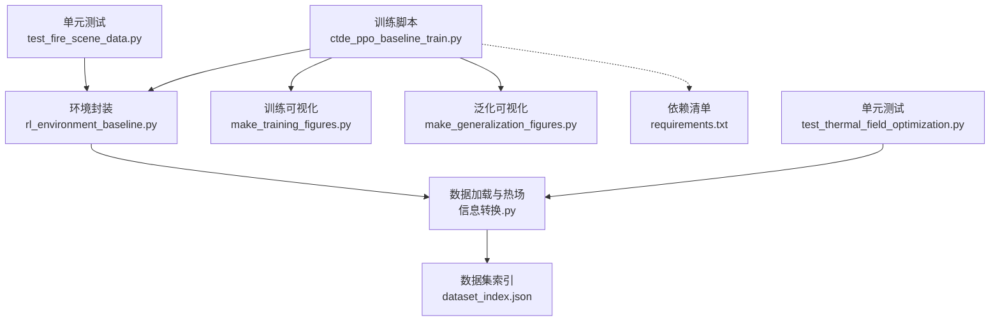
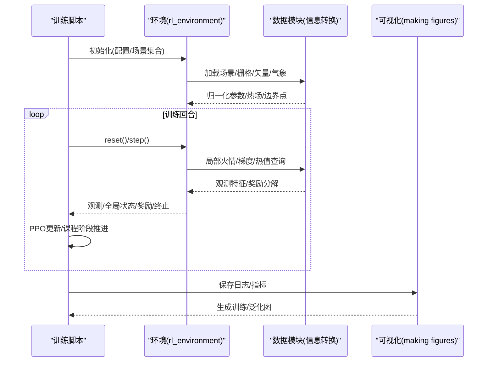
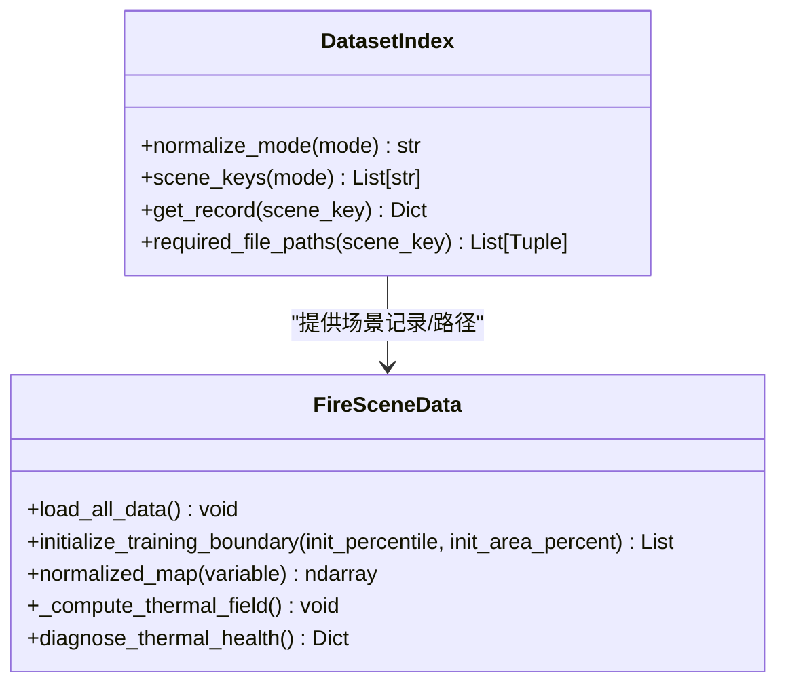
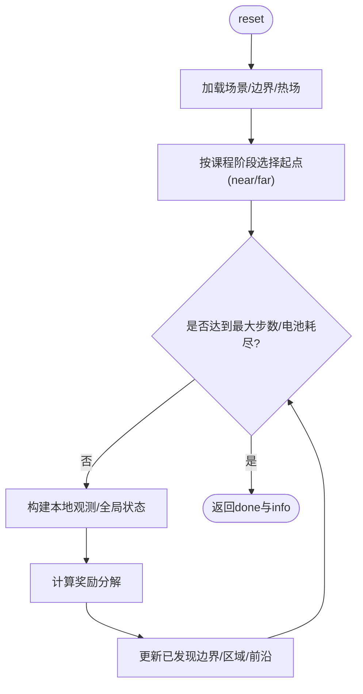
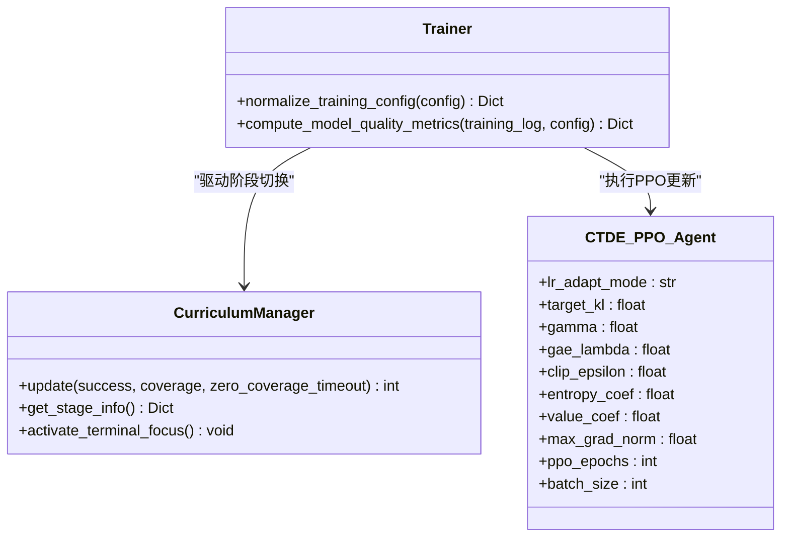
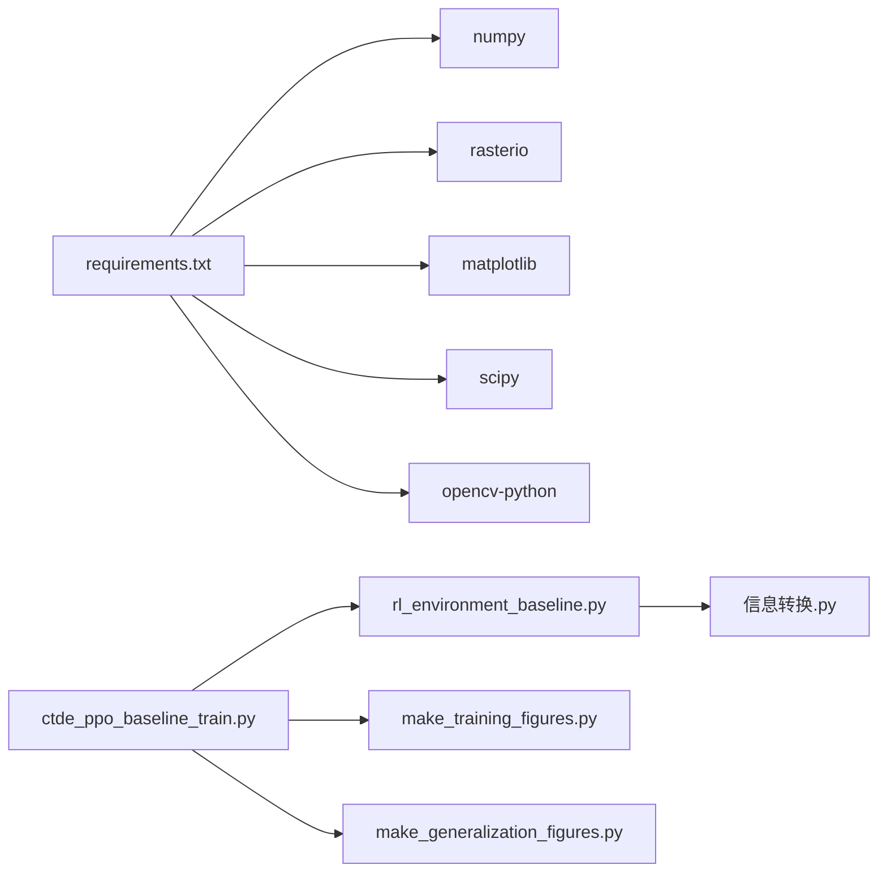
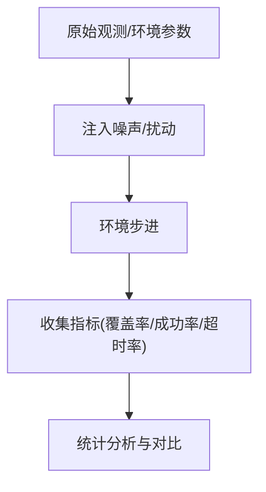

# 泛化能力评估

<cite>
**本文引用的文件**   
- [ctde_ppo_baseline_train.py](file://environment_variables/environment_variables/ctde_ppo_baseline_train.py)
- [rl_environment_baseline.py](file://environment_variables/environment_variables/rl_environment_baseline.py)
- [信息转换.py](file://environment_variables/environment_variables/信息转换.py)
- [dataset_index.json](file://environment_variables/environment_variables/dataset/dataset_index.json)
- [make_generalization_figures.py](file://environment_variables/environment_variables/outputs/make_generalization_figures.py)
- [make_training_figures.py](file://environment_variables/environment_variables/outputs/make_training_figures.py)
- [requirements.txt](file://environment_variables/requirements.txt)
- [test_fire_scene_data.py](file://environment_variables/environment_variables/test_fire_scene_data.py)
- [test_thermal_field_optimization.py](file://environment_variables/environment_variables/test_thermal_field_optimization.py)
</cite>

## 目录
1. [引言](#引言)
2. [项目结构](#项目结构)
3. [核心组件](#核心组件)
4. [架构总览](#架构总览)
5. [详细组件分析](#详细组件分析)
6. [依赖关系分析](#依赖关系分析)
7. [性能与压力测试](#性能与压力测试)
8. [鲁棒性与不确定性验证](#鲁棒性与不确定性验证)
9. [泛化指标体系与对比方法](#泛化指标体系与对比方法)
10. [使用指南与自定义测试用例](#使用指南与自定义测试用例)
11. [故障排查](#故障排查)
12. [结论](#结论)

## 引言
本技术文档面向“泛化能力评估系统”，围绕跨场景泛化、鲁棒性验证与压力测试三大主题，系统化阐述设计原理、实现要点与使用方法。系统基于CTDE-PPO多智能体基线训练脚本、Gymnasium环境封装、FARSITE火灾场景数据加载与热场计算模块，以及训练/泛化可视化脚本，形成从数据到训练、评估、可视化的完整闭环。

## 项目结构
仓库以“训练脚本 + 环境 + 数据加载 + 可视化”分层组织：
- 训练与评估入口：CTDE-PPO基线训练脚本（含课程学习、质量度量、最终评估流程）
- 环境层：Gymnasium环境，提供观测/奖励/终止逻辑与多种观测/奖励配置
- 数据层：数据集索引与场景数据加载（栅格、矢量、气象、报告等），并构建归一化参数与热场
- 可视化层：训练曲线与泛化结果图生成器
- 测试与依赖：单元测试与依赖清单

图表来源
- [ctde_ppo_baseline_train.py:1-120](file://environment_variables/environment_variables/ctde_ppo_baseline_train.py#L1-L120)
- [rl_environment_baseline.py:1-120](file://environment_variables/environment_variables/rl_environment_baseline.py#L1-L120)
- [信息转换.py:1-120](file://environment_variables/environment_variables/信息转换.py#L1-L120)
- [dataset_index.json:45-83](file://environment_variables/environment_variables/dataset/dataset_index.json#L45-L83)
- [make_training_figures.py:1-60](file://environment_variables/environment_variables/outputs/make_training_figures.py#L1-L60)
- [make_generalization_figures.py:1-60](file://environment_variables/environment_variables/outputs/make_generalization_figures.py#L1-L60)
- [requirements.txt:1-13](file://environment_variables/requirements.txt#L1-L13)

章节来源
- [ctde_ppo_baseline_train.py:1-120](file://environment_variables/environment_variables/ctde_ppo_baseline_train.py#L1-L120)
- [rl_environment_baseline.py:1-120](file://environment_variables/environment_variables/rl_environment_baseline.py#L1-L120)
- [信息转换.py:1-120](file://environment_variables/environment_variables/信息转换.py#L1-L120)
- [dataset_index.json:45-83](file://environment_variables/environment_variables/dataset/dataset_index.json#L45-L83)
- [make_training_figures.py:1-60](file://environment_variables/environment_variables/outputs/make_training_figures.py#L1-L60)
- [make_generalization_figures.py:1-60](file://environment_variables/environment_variables/outputs/make_generalization_figures.py#L1-L60)
- [requirements.txt:1-13](file://environment_variables/requirements.txt#L1-L13)

## 核心组件
- CTDE-PPO基线训练与评估
  - 支持固定/自适应学习率、KL约束、PPO更新、课程阶段管理、模型质量度量、最终多集合评估（验证/泛化/压力）
- Gymnasium环境
  - 多无人机边界搜索任务；可切换观测/奖励配置；支持近/远起点的课程化分布
- 数据与热场
  - 统一读取FARSITE栅格/矢量/输入/报告；派生归一化参数；构建热力势场用于引导探索
- 可视化
  - 训练曲线聚合与质量摘要；泛化记录汇总、按场景/变体绘图

章节来源
- [ctde_ppo_baseline_train.py:98-282](file://environment_variables/environment_variables/ctde_ppo_baseline_train.py#L98-L282)
- [ctde_ppo_baseline_train.py:569-758](file://environment_variables/environment_variables/ctde_ppo_baseline_train.py#L569-L758)
- [ctde_ppo_baseline_train.py:759-800](file://environment_variables/environment_variables/ctde_ppo_baseline_train.py#L759-L800)
- [rl_environment_baseline.py:21-158](file://environment_variables/environment_variables/rl_environment_baseline.py#L21-L158)
- [信息转换.py:219-323](file://environment_variables/environment_variables/信息转换.py#L219-L323)
- [make_training_figures.py:384-428](file://environment_variables/environment_variables/outputs/make_training_figures.py#L384-L428)
- [make_generalization_figures.py:448-526](file://environment_variables/environment_variables/outputs/make_generalization_figures.py#L448-L526)

## 架构总览
下图展示训练与评估的数据与控制流：训练脚本驱动环境交互，环境通过数据模块加载场景与热场；评估阶段对多个集合（验证/泛化/压力）进行统计与可视化。

图表来源
- [ctde_ppo_baseline_train.py:1-120](file://environment_variables/environment_variables/ctde_ppo_baseline_train.py#L1-L120)
- [rl_environment_baseline.py:159-207](file://environment_variables/environment_variables/rl_environment_baseline.py#L159-L207)
- [信息转换.py:639-683](file://environment_variables/environment_variables/信息转换.py#L639-L683)
- [make_training_figures.py:118-176](file://environment_variables/environment_variables/outputs/make_training_figures.py#L118-L176)
- [make_generalization_figures.py:169-245](file://environment_variables/environment_variables/outputs/make_generalization_figures.py#L169-L245)

## 详细组件分析

### 数据与热场模块（信息转换.py）
- 数据集索引
  - 模式别名映射（train/validation/generalization/stress/test/eval）
  - 场景键解析、绝对路径推导、必需文件校验
- 场景数据加载
  - 静态地图多波段加载、核心/扩展栅格校验、风场字段构造、归一化参数派生
- 热场语义重建
  - 基于火掩膜与强度归一化、下采样+高斯模糊、上采样、稳健参考值与导航场构造

图表来源
- [信息转换.py:20-196](file://environment_variables/environment_variables/信息转换.py#L20-L196)
- [信息转换.py:219-323](file://environment_variables/environment_variables/信息转换.py#L219-L323)
- [信息转换.py:639-683](file://environment_variables/environment_variables/信息转换.py#L639-L683)
- [信息转换.py:759-800](file://environment_variables/environment_variables/信息转换.py#L759-L800)

章节来源
- [信息转换.py:20-196](file://environment_variables/environment_variables/信息转换.py#L20-L196)
- [信息转换.py:219-323](file://environment_variables/environment_variables/信息转换.py#L219-L323)
- [信息转换.py:639-683](file://environment_variables/environment_variables/信息转换.py#L639-L683)
- [信息转换.py:759-800](file://environment_variables/environment_variables/信息转换.py#L759-L800)

### 环境封装（rl_environment_baseline.py）
- 观测/奖励配置
  - 观测轮廓：baseline/static_terrain/dynamic_front/risk_aware
  - 奖励轮廓：boundary_coverage/front_detection/severity_weighted/exploration_balanced
- 课程化起点分布
  - 根据阶段选择near/far起点概率，增强泛化与稳定性
- 奖励与终止
  - 覆盖增量、前沿探测、严重度加权、探索平衡；超时惩罚与零覆盖额外惩罚

图表来源
- [rl_environment_baseline.py:159-207](file://environment_variables/environment_variables/rl_environment_baseline.py#L159-L207)
- [rl_environment_baseline.py:362-436](file://environment_variables/environment_variables/rl_environment_baseline.py#L362-L436)
- [rl_environment_baseline.py:692-767](file://environment_variables/environment_variables/rl_environment_baseline.py#L692-L767)

章节来源
- [rl_environment_baseline.py:21-158](file://environment_variables/environment_variables/rl_environment_baseline.py#L21-L158)
- [rl_environment_baseline.py:362-436](file://environment_variables/environment_variables/rl_environment_baseline.py#L362-L436)
- [rl_environment_baseline.py:692-767](file://environment_variables/environment_variables/rl_environment_baseline.py#L692-L767)

### 训练与课程管理（ctde_ppo_baseline_train.py）
- 配置规范化
  - 严格类型/范围校验，默认值合并，观察/奖励轮廓合法性检查
- 课程管理器
  - 三阶段：面积百分位阶梯、目标成功率阶梯、near_prob退火；能力门控与强制推进
- 质量度量
  - 收敛效率（AUC、阈值步数）、奖励稳定性（尾部方差、均值下降）、KL稳定性（均值/方差/超调率）
- 最终评估
  - 在validation/generalization/stress三个集合上进行统计与出图

图表来源
- [ctde_ppo_baseline_train.py:98-282](file://environment_variables/environment_variables/ctde_ppo_baseline_train.py#L98-L282)
- [ctde_ppo_baseline_train.py:569-758](file://environment_variables/environment_variables/ctde_ppo_baseline_train.py#L569-L758)
- [ctde_ppo_baseline_train.py:759-800](file://environment_variables/environment_variables/ctde_ppo_baseline_train.py#L759-L800)

章节来源
- [ctde_ppo_baseline_train.py:98-282](file://environment_variables/environment_variables/ctde_ppo_baseline_train.py#L98-L282)
- [ctde_ppo_baseline_train.py:569-758](file://environment_variables/environment_variables/ctde_ppo_baseline_train.py#L569-L758)
- [ctde_ppo_baseline_train.py:759-800](file://environment_variables/environment_variables/ctde_ppo_baseline_train.py#L759-L800)

### 可视化与指标汇总
- 训练可视化
  - 多运行对齐平均/标准差、最后窗口汇总、KL/损失曲线、课程阶段过渡
- 泛化可视化
  - 自动扫描CSV/JSON记录，按变体/种子分组，绘制平滑曲线、按场景柱状图、完成原因分布、箱线图与散点图

章节来源
- [make_training_figures.py:384-428](file://environment_variables/environment_variables/outputs/make_training_figures.py#L384-L428)
- [make_training_figures.py:486-535](file://environment_variables/environment_variables/outputs/make_training_figures.py#L486-L535)
- [make_generalization_figures.py:448-526](file://environment_variables/environment_variables/outputs/make_generalization_figures.py#L448-L526)
- [make_generalization_figures.py:537-628](file://environment_variables/environment_variables/outputs/make_generalization_figures.py#L537-L628)
- [make_generalization_figures.py:675-749](file://environment_variables/environment_variables/outputs/make_generalization_figures.py#L675-L749)

## 依赖关系分析
- 外部依赖
  - numpy、rasterio、matplotlib、scipy、opencv-python（可选RL依赖被注释）
- 内部依赖
  - 训练脚本依赖环境与数据模块
  - 环境依赖数据模块的栅格/矢量/气象/报告
  - 可视化脚本依赖训练/评估输出产物

图表来源
- [requirements.txt:1-13](file://environment_variables/requirements.txt#L1-L13)
- [ctde_ppo_baseline_train.py:1-40](file://environment_variables/environment_variables/ctde_ppo_baseline_train.py#L1-L40)
- [rl_environment_baseline.py:1-20](file://environment_variables/environment_variables/rl_environment_baseline.py#L1-L20)
- [make_training_figures.py:1-40](file://environment_variables/environment_variables/outputs/make_training_figures.py#L1-L40)
- [make_generalization_figures.py:1-40](file://environment_variables/environment_variables/outputs/make_generalization_figures.py#L1-L40)

章节来源
- [requirements.txt:1-13](file://environment_variables/requirements.txt#L1-L13)
- [ctde_ppo_baseline_train.py:1-40](file://environment_variables/environment_variables/ctde_ppo_baseline_train.py#L1-L40)
- [rl_environment_baseline.py:1-20](file://environment_variables/environment_variables/rl_environment_baseline.py#L1-L20)
- [make_training_figures.py:1-40](file://environment_variables/environment_variables/outputs/make_training_figures.py#L1-L40)
- [make_generalization_figures.py:1-40](file://environment_variables/environment_variables/outputs/make_generalization_figures.py#L1-L40)

## 性能与压力测试
- 大规模集群与长时间运行
  - 通过stress集合场景与较长episode上限进行压力评估；建议结合资源监控（CPU/GPU/内存）与断点续跑策略
- 资源消耗监控
  - 建议在训练循环中周期性记录GPU显存、进程RSS、I/O吞吐；将指标写入日志以便后续可视化
- 稳定性保障
  - 随机种子多组重复（comparison_seeds）；课程阶段强制推进避免卡死；KL自适应控制策略更新幅度

章节来源
- [ctde_ppo_baseline_train.py:146-158](file://environment_variables/environment_variables/ctde_ppo_baseline_train.py#L146-L158)
- [ctde_ppo_baseline_train.py:284-293](file://environment_variables/environment_variables/ctde_ppo_baseline_train.py#L284-L293)
- [ctde_ppo_baseline_train.py:569-758](file://environment_variables/environment_variables/ctde_ppo_baseline_train.py#L569-L758)

## 鲁棒性与不确定性验证
- 参数扰动测试
  - 在评估时注入不同vision_radius/max_steps/传感器半径等参数，检验策略迁移性
- 传感器噪声注入
  - 在观测特征中加入高斯噪声或截断异常值，评估策略对观测扰动的容忍度
- 环境不确定性模拟
  - 利用热场健康诊断与归一化参数的稳健性，确保极端强度/地形/风场下的数值稳定

[本节为概念性说明，不直接分析具体文件，故无“章节来源”]

## 泛化指标体系与对比方法
- 指标体系
  - 跨场景平均性能：各场景任务分数/覆盖率/成功率的均值
  - 最坏情况性能：最低场景得分或最高超时率
  - 性能方差分析：按场景/种子维度的方差与置信区间
- 对比分析方法
  - 基线算法对比：固定LR vs KL自适应LR等变体
  - 消融实验：关闭SDF/Infotaxis等模块，比较性能变化
  - 统计显著性检验：多种子重复后采用t检验或Mann-Whitney U检验（可在可视化脚本基础上扩展）

章节来源
- [make_generalization_figures.py:675-749](file://environment_variables/environment_variables/outputs/make_generalization_figures.py#L675-L749)
- [make_training_figures.py:538-579](file://environment_variables/environment_variables/outputs/make_training_figures.py#L538-L579)

## 使用指南与自定义测试用例
- 快速开始
  - 安装依赖：pip install -r environment_variables/requirements.txt
  - 准备数据：确保dataset_index.json与对应场景文件存在
  - 训练：运行CTDE-PPO基线训练脚本，指定数据目录、集合划分与输出路径
  - 评估：训练完成后自动在validation/generalization/stress集合评估并保存结果
  - 可视化：分别运行训练/泛化可视化脚本，自动生成图表
- 自定义测试用例
  - 场景数据加载与形状一致性：参考现有单元测试，新增场景键与栅格路径校验
  - 热场健康诊断：构造不同火掩膜，验证热场范围、梯度可用性与饱和比例
  - 环境接口契约：验证观测/奖励维度、步级行为与info字段完整性

章节来源
- [requirements.txt:1-13](file://environment_variables/requirements.txt#L1-L13)
- [test_fire_scene_data.py:28-157](file://environment_variables/environment_variables/test_fire_scene_data.py#L28-L157)
- [test_thermal_field_optimization.py:25-66](file://environment_variables/environment_variables/test_thermal_field_optimization.py#L25-L66)

## 故障排查
- 常见错误
  - 数据集索引缺失或路径错误：检查dataset_index.json与source_root
  - 栅格形状不一致：确保static_map与各raster一致
  - 风场字段缺失：回退到weather_stream解析或metadata中的风场估计
  - 热场未初始化：确保fire_binary_map已设置后再计算热场
- 定位方法
  - 查看训练控制台日志与model_quality_metrics.json
  - 使用单元测试复现问题，逐步缩小范围

章节来源
- [信息转换.py:32-87](file://environment_variables/environment_variables/信息转换.py#L32-L87)
- [信息转换.py:525-533](file://environment_variables/environment_variables/信息转换.py#L525-L533)
- [信息转换.py:639-683](file://environment_variables/environment_variables/信息转换.py#L639-L683)
- [信息转换.py:759-800](file://environment_variables/environment_variables/信息转换.py#L759-L800)

## 结论
本系统以CTDE-PPO为核心，结合课程学习与稳健热场构建，提供了从训练到泛化评估的一体化方案。通过多集合评估、可视化与单元测试，能够系统衡量跨场景泛化、鲁棒性与压力表现。建议在实际部署中补充资源监控与统计显著性检验，进一步提升评估的可信度与可解释性。