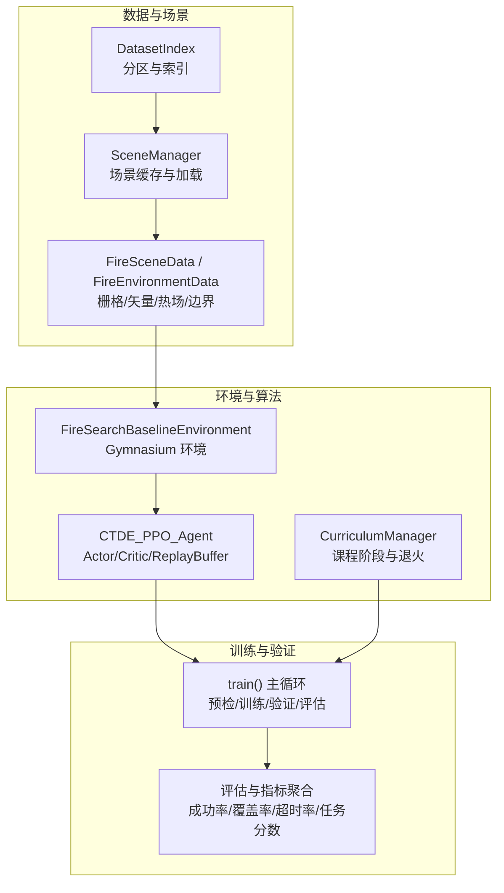
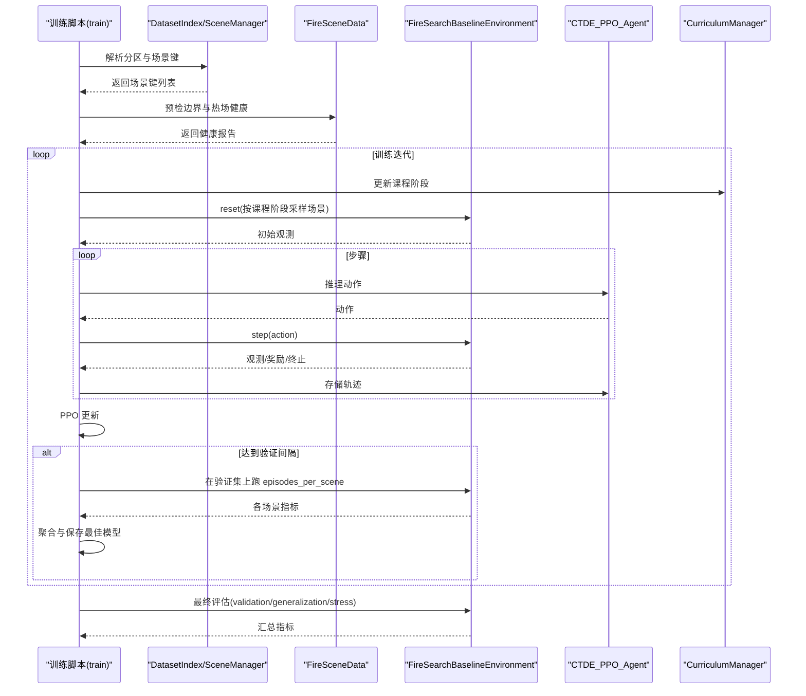
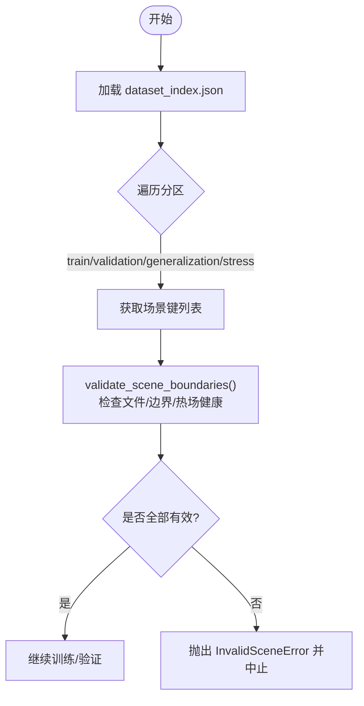
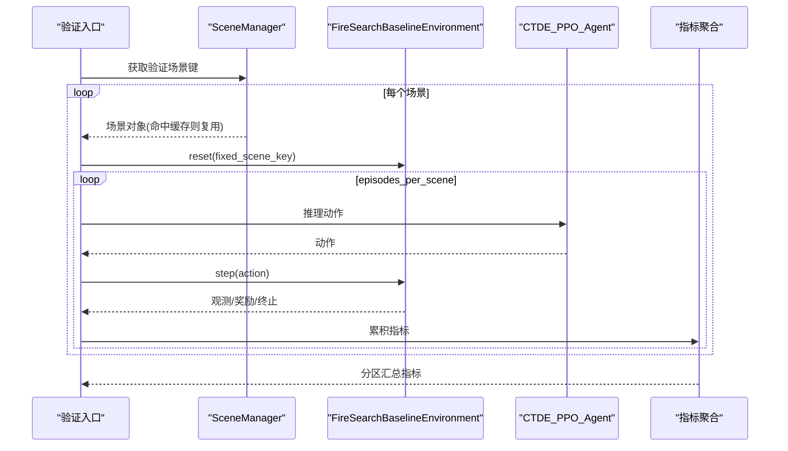
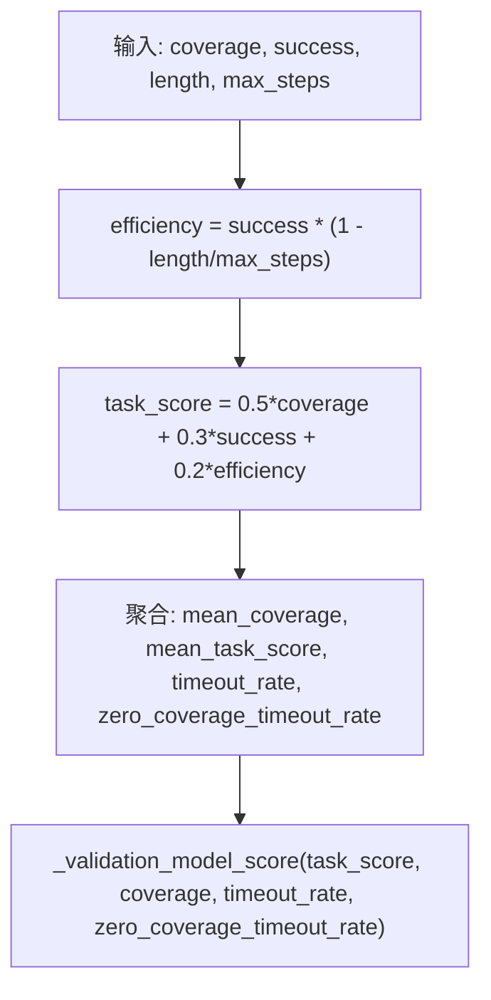
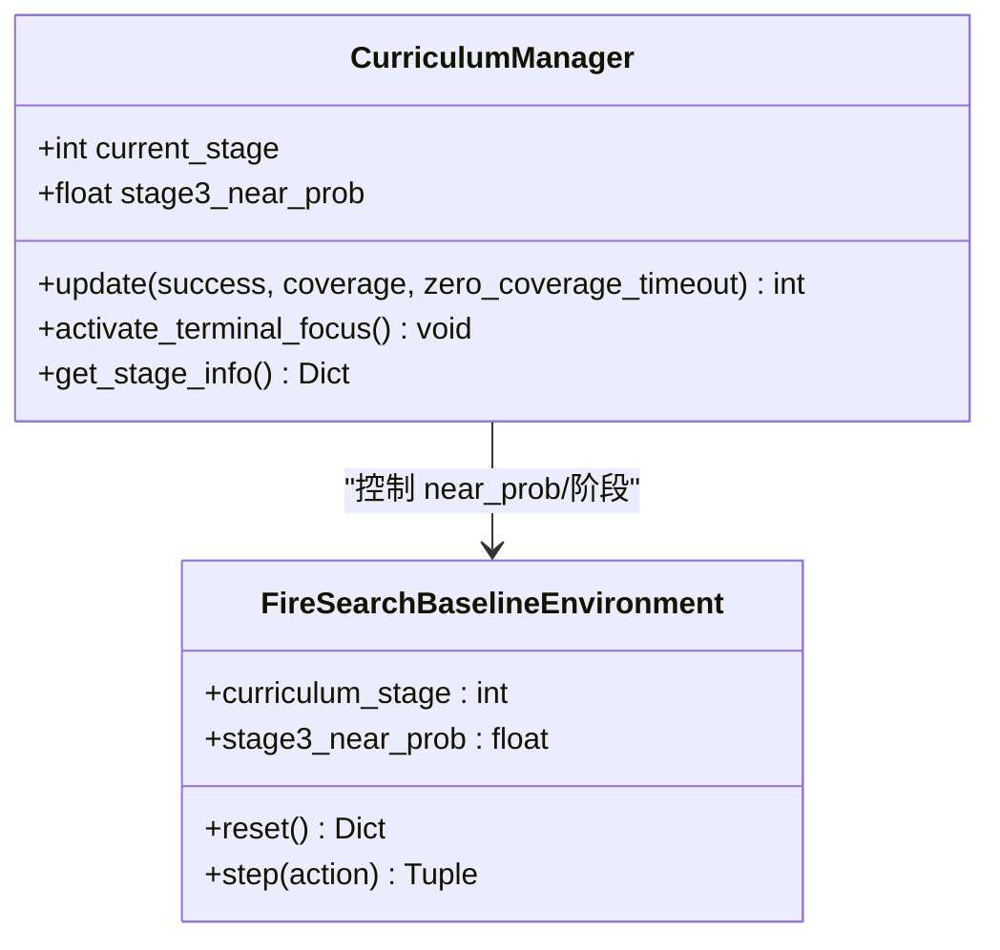
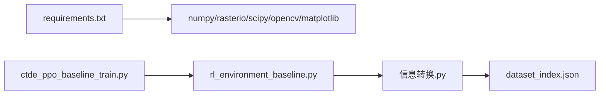

# 验证集测试框架

<cite>
**本文引用的文件**   
- [ctde_ppo_baseline_train.py](file://environment_variables/environment_variables/ctde_ppo_baseline_train.py)
- [rl_environment_baseline.py](file://environment_variables/environment_variables/rl_environment_baseline.py)
- [信息转换.py](file://environment_variables/environment_variables/信息转换.py)
- [dataset_index.json](file://environment_variables/environment_variables/dataset/dataset_index.json)
- [requirements.txt](file://environment_variables/requirements.txt)
</cite>

## 目录
1. [简介](#简介)
2. [项目结构](#项目结构)
3. [核心组件](#核心组件)
4. [架构总览](#架构总览)
5. [详细组件分析](#详细组件分析)
6. [依赖关系分析](#依赖关系分析)
7. [性能与内存管理](#性能与内存管理)
8. [使用方法与扩展指南](#使用方法与扩展指南)
9. [故障诊断与常见问题](#故障诊断与常见问题)
10. [结论](#结论)

## 简介
本技术文档面向“验证集测试框架”，围绕数据集划分策略、验证流程实现机制、评估指标定义与计算、多场景批量测试的并行与内存管理，以及脚本使用与自定义场景扩展进行系统化说明。该框架以 FARSITE 火灾场景数据为基础，通过统一的索引与场景管理器加载训练/验证/泛化/压力四类数据集，并在训练过程中周期性对验证集进行评估，最终输出跨分区的综合评测结果。

## 项目结构
仓库中与验证框架直接相关的代码与数据组织如下：
- 环境与环境数据层
  - 信息转换.py：提供 DatasetIndex、FireSceneData/FireEnvironmentData、SceneManager 等核心数据与场景管理能力，负责栅格/矢量读取、归一化、边界提取、热场构建、健康诊断等。
  - rl_environment_baseline.py：基于 Gymnasium 的多无人机火边界搜索基线环境，封装观测、动作、奖励与终止条件。
- 训练与验证控制层
  - ctde_ppo_baseline_train.py：CTDE-PPO 基线训练脚本，包含配置归一化、课程学习、训练循环、周期验证、模型选择与最终评估（validation/generalization/stress）。
- 数据索引与分区
  - dataset_index.json：维护 train/validation/generalization/stress 四个分区的场景键列表及元数据映射。
- 依赖清单
  - requirements.txt：列出运行所需的核心依赖。

图表来源
- [信息转换.py:1282-1326](file://environment_variables/environment_variables/信息转换.py#L1282-L1326)
- [rl_environment_baseline.py:21-158](file://environment_variables/environment_variables/rl_environment_baseline.py#L21-L158)
- [ctde_ppo_baseline_train.py:1278-1315](file://environment_variables/environment_variables/ctde_ppo_baseline_train.py#L1278-L1315)

章节来源
- [信息转换.py:1-800](file://environment_variables/environment_variables/信息转换.py#L1-L800)
- [信息转换.py:800-1426](file://environment_variables/environment_variables/信息转换.py#L800-L1426)
- [rl_environment_baseline.py:1-800](file://environment_variables/environment_variables/rl_environment_baseline.py#L1-L800)
- [ctde_ppo_baseline_train.py:1-800](file://environment_variables/environment_variables/ctde_ppo_baseline_train.py#L1-L800)
- [ctde_ppo_baseline_train.py:1268-1315](file://environment_variables/environment_variables/ctde_ppo_baseline_train.py#L1268-L1315)
- [dataset_index.json:45-83](file://environment_variables/environment_variables/dataset/dataset_index.json#L45-L83)
- [requirements.txt:1-13](file://environment_variables/requirements.txt#L1-L13)

## 核心组件
- 数据集索引与分区
  - DatasetIndex：从 dataset_index.json 加载 splits 与 scenes 记录，支持模式别名（如 test/eval → generalization），并提供 scene_keys(mode)、get_record(scene_key) 等方法。
  - SceneManager：按 split 随机或指定选取场景，并维护跨实例共享的场景缓存，避免重复 IO 与重算。
- 场景数据与预处理
  - FireSceneData/FireEnvironmentData：加载静态地图与动态栅格，派生风场、归一化参数；根据时间步或面积百分比初始化 t=0 边界；构建 per-scene 鲁棒热势场与导航场；提供局部热力梯度、严重度图、邻域统计等工具。
  - validate_scene_boundaries：在训练前对所有分区场景执行完整性与健康性检查，确保 t=0 与 init_area% 边界有效。
- 强化学习环境
  - FireSearchBaselineEnvironment：封装多无人机离散动作空间、局部/全局观测、奖励分解、边界覆盖判定、近/远起点的课程化生成、终止与惩罚逻辑。
- 训练与验证控制
  - CTDE_PPO_Agent：Actor/Critic 网络、KL 自适应学习率、PPO 更新、经验回放缓冲。
  - CurriculumManager：三阶段课程学习，结合成功率、覆盖率、零覆盖超时率与 near_prob 退火门限，驱动难度提升。
  - train()：完成预检、热场健康校验、训练循环、周期验证、最佳模型保存与最终评估（validation/generalization/stress）。

章节来源
- [信息转换.py:20-196](file://environment_variables/environment_variables/信息转换.py#L20-L196)
- [信息转换.py:219-800](file://environment_variables/environment_variables/信息转换.py#L219-L800)
- [信息转换.py:800-1426](file://environment_variables/environment_variables/信息转换.py#L800-L1426)
- [rl_environment_baseline.py:21-158](file://environment_variables/environment_variables/rl_environment_baseline.py#L21-L158)
- [ctde_ppo_baseline_train.py:569-758](file://environment_variables/environment_variables/ctde_ppo_baseline_train.py#L569-L758)
- [ctde_ppo_baseline_train.py:759-800](file://environment_variables/environment_variables/ctde_ppo_baseline_train.py#L759-L800)
- [ctde_ppo_baseline_train.py:1278-1315](file://environment_variables/environment_variables/ctde_ppo_baseline_train.py#L1278-L1315)

## 架构总览
下图展示训练与验证的整体数据与控制流：训练脚本在启动时进行数据集预检与热场健康检查，随后进入训练循环；每隔若干更新执行一次验证，收集各场景指标并聚合；训练结束后对 validation/generalization/stress 三个分区进行最终评估。

图表来源
- [ctde_ppo_baseline_train.py:1278-1315](file://environment_variables/environment_variables/ctde_ppo_baseline_train.py#L1278-L1315)
- [信息转换.py:1282-1326](file://environment_variables/environment_variables/信息转换.py#L1282-L1326)
- [rl_environment_baseline.py:21-158](file://environment_variables/environment_variables/rl_environment_baseline.py#L21-L158)

## 详细组件分析

### 数据集划分策略
- 分区定义
  - train：用于模型训练。
  - validation：用于训练过程中的周期验证与模型选择。
  - generalization：用于泛化能力评估。
  - stress：用于压力测试（更大规模/更极端场景）。
- 场景键来源
  - 由 dataset_index.json 中的 splits 字段维护，每个分区对应一组 scene_key。
- 初始化边界与面积百分比
  - 支持两种初始化方式：t=0 全边界或按 init_area_percent 截断到一定比例，便于课程学习与稳定性控制。
- 预检与健康检查
  - 训练前调用 validate_scene_boundaries 遍历所有分区场景，检查必要文件存在性与边界有效性；同时采集热场健康指标，防止语义层异常影响训练。

图表来源
- [信息转换.py:1329-1416](file://environment_variables/environment_variables/信息转换.py#L1329-L1416)
- [dataset_index.json:45-83](file://environment_variables/environment_variables/dataset/dataset_index.json#L45-L83)

章节来源
- [信息转换.py:1329-1416](file://environment_variables/environment_variables/信息转换.py#L1329-L1416)
- [dataset_index.json:45-83](file://environment_variables/environment_variables/dataset/dataset_index.json#L45-L83)

### 验证流程的实现机制
- 模型加载与场景遍历
  - 训练脚本在固定间隔触发验证，按配置为每个验证场景运行 episodes_per_scene 条轨迹。
  - 场景通过 SceneManager.get_specific_scene 获取，内部使用共享缓存避免重复 IO 与重算。
- 指标计算与结果聚合
  - 每条轨迹记录 reward、coverage、success、length、timeout、zero_coverage_timeout、task_score、done_reason。
  - 按场景与分区聚合得到 mean_coverage、mean_task_score、timeout_rate、zero_coverage_timeout_rate 等。
  - 使用 _validation_model_score 作为模型选择依据，综合考虑任务分数、覆盖率与超时惩罚。
- 最终评估
  - 训练结束后对 final_eval_splits=["validation","generalization","stress"] 分别评估，统一输出对比结果。

图表来源
- [ctde_ppo_baseline_train.py:1278-1315](file://environment_variables/environment_variables/ctde_ppo_baseline_train.py#L1278-L1315)
- [信息转换.py:1282-1326](file://environment_variables/environment_variables/信息转换.py#L1282-L1326)
- [rl_environment_baseline.py:21-158](file://environment_variables/environment_variables/rl_environment_baseline.py#L21-L158)

章节来源
- [ctde_ppo_baseline_train.py:1278-1315](file://environment_variables/environment_variables/ctde_ppo_baseline_train.py#L1278-L1315)
- [信息转换.py:1282-1326](file://environment_variables/environment_variables/信息转换.py#L1282-L1326)

### 评估指标计算方法
- 成功率 success
  - 定义为在 max_steps 内达到目标覆盖率阈值的轨迹比例。阈值由课程阶段与 stage_targets 决定。
- 覆盖率 coverage
  - 当前边界点中被发现的比率：discovered_boundary ∩ boundary_set 的大小除以 total_boundary_points。
- 超时率 timeout_rate
  - 达到 max_steps 仍未成功的轨迹比例。
- 零覆盖超时率 zero_coverage_timeout_rate
  - 既超时又未获得任何边界覆盖的轨迹比例，用于惩罚完全无效探索。
- 任务分数 task_score
  - 加权组合：0.5×coverage + 0.3×success + 0.2×efficiency，其中 efficiency = success × (1 − length/max_steps)。
- 模型选择评分 _validation_model_score
  - 以 mean_task_score 为主，辅以覆盖率正向项与超时/零覆盖超时负向项，用于保存最佳验证模型。

图表来源
- [ctde_ppo_baseline_train.py:295-306](file://environment_variables/environment_variables/ctde_ppo_baseline_train.py#L295-L306)
- [rl_environment_baseline.py:231-258](file://environment_variables/environment_variables/rl_environment_baseline.py#L231-L258)

章节来源
- [ctde_ppo_baseline_train.py:295-306](file://environment_variables/environment_variables/ctde_ppo_baseline_train.py#L295-L306)
- [rl_environment_baseline.py:231-258](file://environment_variables/environment_variables/rl_environment_baseline.py#L231-L258)

### 多场景批量测试的并行处理与内存管理
- 并行处理
  - 当前代码未显式使用多线程或多进程进行批量验证；验证在主线程中顺序遍历场景与轨迹。若需并行，可在外层对场景进行批调度，但需注意 Gym 环境非线程安全与状态隔离。
- 内存管理策略
  - SceneManager 使用类级共享缓存 _shared_scene_cache，避免 evaluate() 每次创建新环境时重复读盘与重算归一化参数和初始边界，显著降低 I/O 与内存碎片。
  - 场景对象在进程生命周期内常驻，建议合理设置 episodes_per_scene 与 batch_size，避免长时间持有过多中间张量。
  - 建议在大规模评估后主动释放不需要的缓存条目或重启进程，防止内存泄漏。

章节来源
- [信息转换.py:1282-1326](file://environment_variables/environment_variables/信息转换.py#L1282-L1326)

### 课程学习与场景生成
- 课程阶段
  - Stage1：低难度，near_prob 较高，鼓励早期探索；init_area_percent 逐步提升。
  - Stage2：中等难度，near_prob 下降，要求更高的覆盖率与更低超时率。
  - Stage3：高难度，near_prob 进一步退火至接近 0，目标覆盖率逐步提高，严格约束零覆盖超时率。
- 退火与门限
  - 基于滑动窗口成功率、覆盖率与零覆盖超时率判断是否推进阶段或退火 near_prob。
  - 最后阶段可激活 terminal_focus，强制切换到最终目标与 near_prob=0，用于最终评估。

图表来源
- [ctde_ppo_baseline_train.py:569-758](file://environment_variables/environment_variables/ctde_ppo_baseline_train.py#L569-L758)
- [rl_environment_baseline.py:362-436](file://environment_variables/environment_variables/rl_environment_baseline.py#L362-L436)

章节来源
- [ctde_ppo_baseline_train.py:569-758](file://environment_variables/environment_variables/ctde_ppo_baseline_train.py#L569-L758)
- [rl_environment_baseline.py:362-436](file://environment_variables/environment_variables/rl_environment_baseline.py#L362-L436)

## 依赖关系分析
- 外部依赖
  - numpy、rasterio、matplotlib、scipy、opencv-python 为核心依赖；可选 RL 依赖（stable-baselines3、torch、tensorboard）被注释，实际训练使用 PyTorch 原生实现。
- 模块耦合
  - 训练脚本依赖环境与环境数据模块；环境依赖 SceneManager 与 FireSceneData；SceneManager 依赖 DatasetIndex。
  - 热场健康检查与边界预检在训练开始前执行，形成强前置依赖。

图表来源
- [requirements.txt:1-13](file://environment_variables/requirements.txt#L1-L13)
- [ctde_ppo_baseline_train.py:1-800](file://environment_variables/environment_variables/ctde_ppo_baseline_train.py#L1-L800)
- [rl_environment_baseline.py:1-800](file://environment_variables/environment_variables/rl_environment_baseline.py#L1-L800)
- [信息转换.py:1-800](file://environment_variables/environment_variables/信息转换.py#L1-L800)
- [dataset_index.json:45-83](file://environment_variables/environment_variables/dataset/dataset_index.json#L45-L83)

章节来源
- [requirements.txt:1-13](file://environment_variables/requirements.txt#L1-L13)
- [ctde_ppo_baseline_train.py:1-800](file://environment_variables/environment_variables/ctde_ppo_baseline_train.py#L1-L800)
- [rl_environment_baseline.py:1-800](file://environment_variables/environment_variables/rl_environment_baseline.py#L1-L800)
- [信息转换.py:1-800](file://environment_variables/environment_variables/信息转换.py#L1-L800)
- [dataset_index.json:45-83](file://environment_variables/environment_variables/dataset/dataset_index.json#L45-L83)

## 性能与内存管理
- I/O 优化
  - SceneManager 共享缓存避免重复加载场景与重算归一化参数，减少磁盘访问与 CPU 开销。
- 数值计算
  - 热场构建采用降采样+高斯模糊+反插值，再按 p99 鲁棒归一化，兼顾平滑与稳定性。
- 内存占用
  - 大栅格与多通道静态地图会占用较多内存；建议评估时限制并发场景数，必要时分批释放缓存。
- 训练稳定性
  - KL 自适应学习率与质量监控（收敛效率、奖励稳定性、KL 稳定性）有助于避免发散与过拟合。

[本节为通用指导，无需具体文件引用]

## 使用方法与扩展指南
- 基本用法
  - 安装依赖：参考 requirements.txt。
  - 准备数据：确保 dataset_index.json 正确指向 source_root 与各场景路径，且各场景包含 metadata、static_map、rasters、vectors、inputs、reports 等必需文件。
  - 启动训练与验证：运行 ctde_ppo_baseline_train.py，默认会在训练过程中周期性验证，并在结束后对 validation/generalization/stress 进行最终评估。
- 关键配置项
  - 分区与场景：train_split、eval_split、final_eval_splits、train_scene_keys、eval_scene_keys。
  - 验证频率与样本量：validation_interval、validation_episodes_per_scene、final_eval_episodes_per_scene。
  - 课程学习：init_percentile/init_area_percent、stage2_target、stage3_target、stage3_near_prob。
  - 模型选择：save_best_by_validation、quality_score_threshold、quality_window、quality_tail_fraction、quality_target_kl。
- 自定义验证场景
  - 在 dataset_index.json 中添加新场景键与元数据，并确保路径与格式符合 FireSceneData 要求。
  - 如需覆盖某分区场景集合，可通过 scene_keys_by_split 传入特定键列表，或在运行时通过配置项指定。
  - 新增观察/奖励配置需在 FireSearchBaselineEnvironment.OBSERVATION_PROFILE_DIMS 与 REWARD_PROFILES 中注册。

章节来源
- [ctde_ppo_baseline_train.py:98-158](file://environment_variables/environment_variables/ctde_ppo_baseline_train.py#L98-L158)
- [ctde_ppo_baseline_train.py:161-281](file://environment_variables/environment_variables/ctde_ppo_baseline_train.py#L161-L281)
- [信息转换.py:1282-1326](file://environment_variables/environment_variables/信息转换.py#L1282-L1326)
- [rl_environment_baseline.py:24-35](file://environment_variables/environment_variables/rl_environment_baseline.py#L24-L35)

## 故障诊断与常见问题
- 场景缺失或路径错误
  - 现象：预检时报 FileNotFoundError 或 InvalidSceneError。
  - 排查：核对 dataset_index.json 中 scene_dir、metadata、static_map、rasters、vectors、inputs、reports 的路径是否正确；确认 source_root 相对路径解析无误。
- 边界为空
  - 现象：t=0 或 init_area% 边界点数为 0。
  - 排查：检查 intensity/time 栅格是否存在与形状一致；调整 fire_threshold 或 init_area_percent；查看 last_init_area_stats 与实际面积百分比。
- 热场健康异常
  - 现象：sat_ratio/high_ratio/zero_grad_in_high_ratio 超出阈值。
  - 排查：确认 intensity 数据范围与归一化参数；检查高斯模糊与 p99 归一化过程；必要时调整 alpha 或 sigma。
- 验证指标不稳定
  - 现象：成功率/覆盖率波动较大。
  - 排查：增加 episodes_per_scene；检查课程阶段门限与 near_prob 退火；关注 KL 与 clip_fraction 稳定性。
- 内存不足
  - 现象：OOM 或频繁 GC。
  - 排查：减少并发场景数；关闭不必要的日志与绘图；定期清理缓存或重启进程。

章节来源
- [信息转换.py:1329-1416](file://environment_variables/environment_variables/信息转换.py#L1329-L1416)
- [信息转换.py:972-1012](file://environment_variables/environment_variables/信息转换.py#L972-L1012)
- [ctde_ppo_baseline_train.py:358-433](file://environment_variables/environment_variables/ctde_ppo_baseline_train.py#L358-L433)

## 结论
本验证集测试框架以统一的数据索引与场景管理为基础，结合课程学习与严格的预检/健康检查，实现了稳健的训练与验证流程。通过明确的指标定义与聚合方法，能够在 validation/generalization/stress 三类分区上进行一致的评估与对比。配合共享缓存与合理的内存管理策略，框架具备良好的可扩展性与工程可用性。后续可根据业务需求扩展新的观察/奖励配置、并行验证策略与可视化报告。