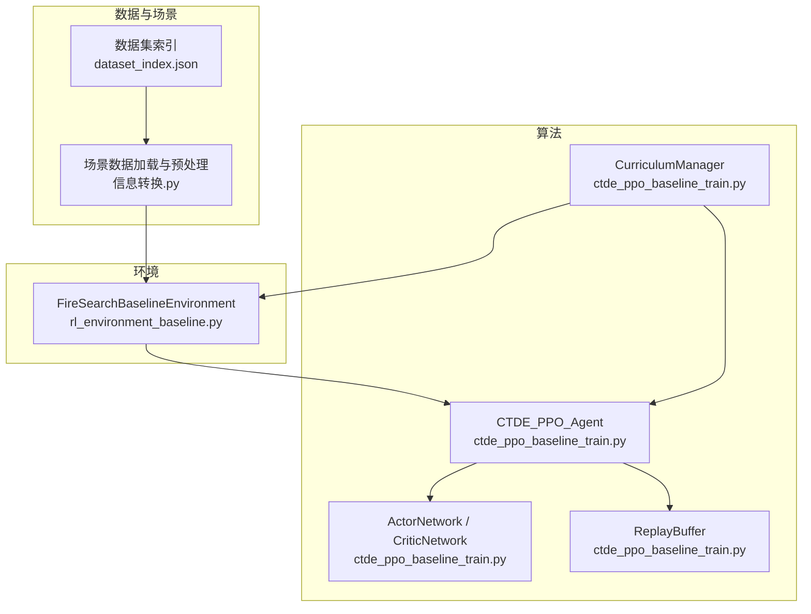
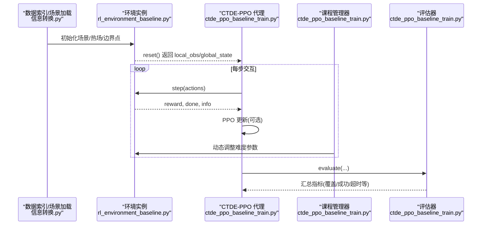
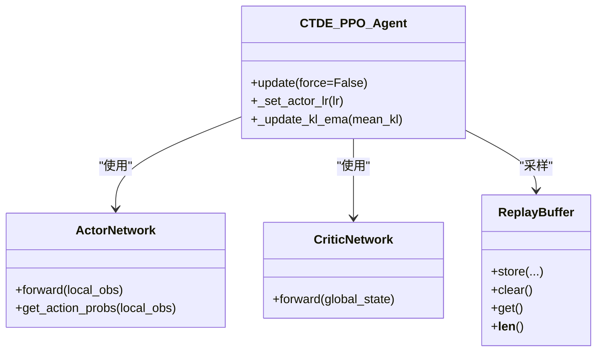
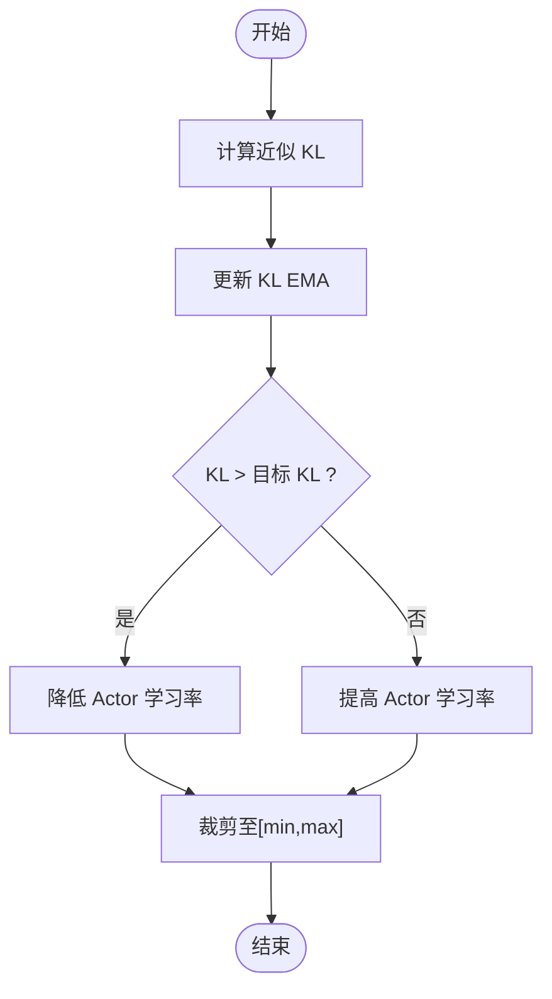
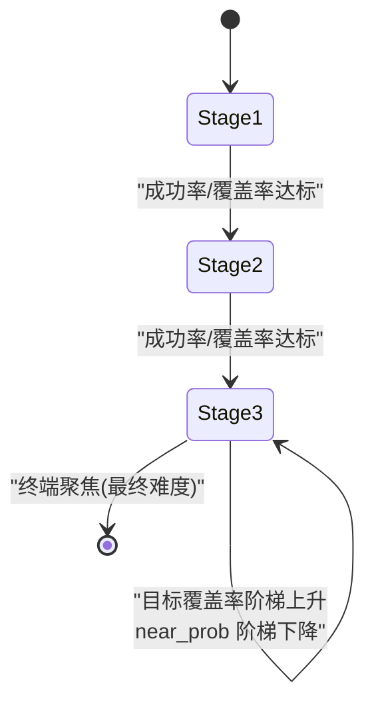
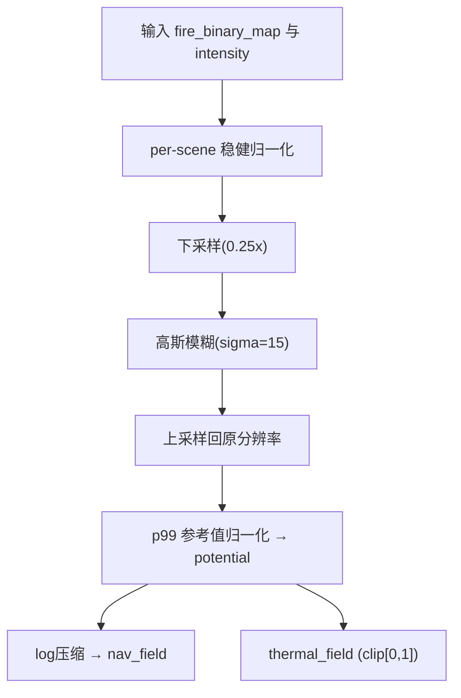
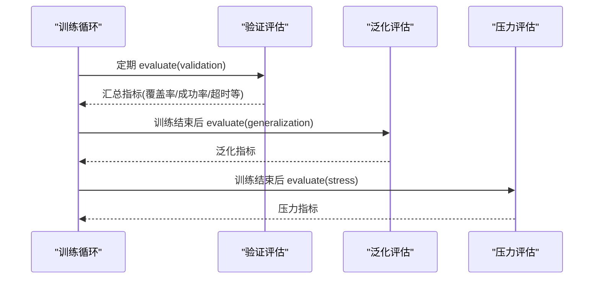
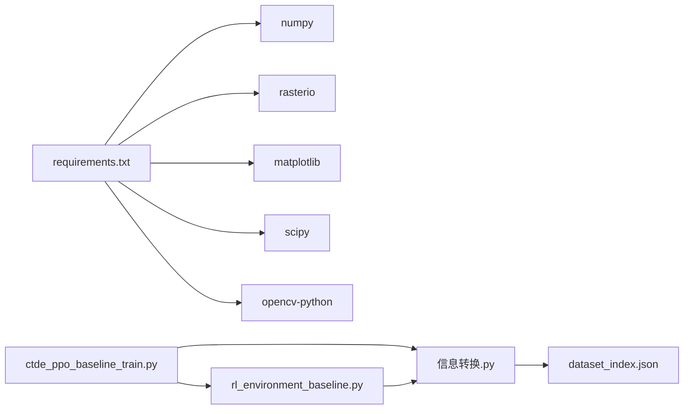

# 核心功能特性

<cite>
**本文引用的文件列表**
- [ctde_ppo_baseline_train.py](file://environment_variables/environment_variables/ctde_ppo_baseline_train.py)
- [rl_environment_baseline.py](file://environment_variables/environment_variables/rl_environment_baseline.py)
- [信息转换.py](file://environment_variables/environment_variables/信息转换.py)
- [requirements.txt](file://environment_variables/requirements.txt)
- [dataset_index.json](file://environment_variables/environment_variables/dataset/dataset_index.json)
</cite>

## 目录
1. [简介](#简介)
2. [项目结构](#项目结构)
3. [核心组件](#核心组件)
4. [架构总览](#架构总览)
5. [详细组件分析](#详细组件分析)
6. [依赖关系分析](#依赖关系分析)
7. [性能考量](#性能考量)
8. [故障排查指南](#故障排查指南)
9. [结论](#结论)
10. [附录](#附录)

## 简介
本项目面向多无人机协同火场边界搜索任务，提供一套端到端的强化学习训练与评估系统。核心能力包括：
- 分布式协作机制与通信协议（CTDE-PPO）
- 自适应学习率调整（基于KL散度）
- 三阶段课程学习框架（难度渐进、技能积累、泛化提升）
- 热场优化计算（高斯模糊近似、性能与内存优化）
- 完整评估体系（验证集测试、泛化能力评估、压力测试场景）

本说明聚焦技术实现要点、配置选项与使用示例，帮助读者快速理解并应用各特性。

## 项目结构
仓库采用“环境+算法+数据”分层组织：
- 环境与数据层：Gymnasium 环境封装、FARSITE 场景数据加载与预处理、热场重建
- 算法层：CTDE-PPO 基线训练脚本、Actor/Critic 网络、ReplayBuffer、课程管理器
- 配置与输出：默认训练配置、日志与图表输出、数据集索引

图示来源
- [ctde_ppo_baseline_train.py:1-120](file://environment_variables/environment_variables/ctde_ppo_baseline_train.py#L1-L120)
- [rl_environment_baseline.py:1-120](file://environment_variables/environment_variables/rl_environment_baseline.py#L1-L120)
- [信息转换.py:219-322](file://environment_variables/environment_variables/信息转换.py#L219-L322)
- [dataset_index.json:45-83](file://environment_variables/environment_variables/dataset/dataset_index.json#L45-L83)

章节来源
- [ctde_ppo_baseline_train.py:98-158](file://environment_variables/environment_variables/ctde_ppo_baseline_train.py#L98-L158)
- [rl_environment_baseline.py:21-158](file://environment_variables/environment_variables/rl_environment_baseline.py#L21-L158)
- [信息转换.py:219-322](file://environment_variables/environment_variables/信息转换.py#L219-L322)
- [dataset_index.json:45-83](file://environment_variables/environment_variables/dataset/dataset_index.json#L45-L83)

## 核心组件
- FireSearchBaselineEnvironment：定义多智能体观测/全局状态空间、动作空间、奖励函数、课程参数与场景初始化
- CTDE_PPO_Agent：集中式训练去中心化执行策略，含 Actor/Critic 网络、PPO 更新、KL 自适应学习率
- CurriculumManager：三阶段课程管理，控制初始火区面积百分比、目标覆盖率与近界生成概率
- 信息转换模块：场景数据加载、归一化、热场重建与导航场构建
- 数据集索引：划分 train/validation/generalization/stress 四类场景集合

章节来源
- [rl_environment_baseline.py:21-158](file://environment_variables/environment_variables/rl_environment_baseline.py#L21-L158)
- [ctde_ppo_baseline_train.py:460-535](file://environment_variables/environment_variables/ctde_ppo_baseline_train.py#L460-L535)
- [ctde_ppo_baseline_train.py:569-758](file://environment_variables/environment_variables/ctde_ppo_baseline_train.py#L569-L758)
- [信息转换.py:219-322](file://environment_variables/environment_variables/信息转换.py#L219-L322)
- [dataset_index.json:45-83](file://environment_variables/environment_variables/dataset/dataset_index.json#L45-L83)

## 架构总览
下图展示从数据到训练再到评估的端到端流程，以及关键模块间的调用关系。

图示来源
- [ctde_ppo_baseline_train.py:1523-1581](file://environment_variables/environment_variables/ctde_ppo_baseline_train.py#L1523-L1581)
- [rl_environment_baseline.py:331-361](file://environment_variables/environment_variables/rl_environment_baseline.py#L331-L361)
- [信息转换.py:684-721](file://environment_variables/environment_variables/信息转换.py#L684-L721)

## 详细组件分析

### 多无人机协同搜索与分布式协作机制
- 分布式协作设计
  - 每个无人机拥有局部观测向量（位置、电池、地形、风场、热梯度、动量、相机方向等），用于独立决策
  - 全局状态包含团队覆盖率、平均/最低电量、队形中心与分散度、距火平均距离、时间进度、已访问密度、课程阶段、风/高程均值、边界发现比例、低电量指示、无人机数量、覆盖率梯度与未探索密度等
- 通信协议
  - 训练阶段通过全局状态进行集中式价值估计（Critic），推理阶段仅依赖局部观测（Actor）
  - 无显式消息传递，协作通过共享全局状态在训练中隐式学习
- 任务分配策略
  - 通过奖励函数引导：边界发现奖励、前沿探测奖励、严重性加权奖励、探索平衡奖励；同时施加空闲惩罚、重复区域惩罚、越界/重叠惩罚
  - 课程学习驱动不同阶段的探索与利用权衡

章节来源
- [rl_environment_baseline.py:565-658](file://environment_variables/environment_variables/rl_environment_baseline.py#L565-L658)
- [rl_environment_baseline.py:692-767](file://environment_variables/environment_variables/rl_environment_baseline.py#L692-L697)
- [rl_environment_baseline.py:769-800](file://environment_variables/environment_variables/rl_environment_baseline.py#L769-L800)

### CTDE-PPO 算法实现（集中式训练去中心化执行）
- 设计理念与技术优势
  - 集中式训练：Critic 使用全局状态估计价值，利于协调多智能体行为
  - 去中心化执行：Actor 仅依赖局部观测，便于部署到真实无人机
  - PPO 稳定更新：裁剪比率、熵正则、价值损失系数、最大梯度范数
- 关键实现要点
  - ActorNetwork：多层全连接 + LayerNorm + 残差连接 + 正交初始化
  - CriticNetwork：多层全连接 + LayerNorm + 正交初始化
  - ReplayBuffer：存储轨迹片段供 PPO 多轮更新
  - KL 自适应学习率：根据近似 KL 与目标 KL 动态调节 Actor 学习率

图示来源
- [ctde_ppo_baseline_train.py:460-535](file://environment_variables/environment_variables/ctde_ppo_baseline_train.py#L460-L535)
- [ctde_ppo_baseline_train.py:537-567](file://environment_variables/environment_variables/ctde_ppo_baseline_train.py#L537-L567)
- [ctde_ppo_baseline_train.py:759-834](file://environment_variables/environment_variables/ctde_ppo_baseline_train.py#L759-L834)

章节来源
- [ctde_ppo_baseline_train.py:460-535](file://environment_variables/environment_variables/ctde_ppo_baseline_train.py#L460-L535)
- [ctde_ppo_baseline_train.py:537-567](file://environment_variables/environment_variables/ctde_ppo_baseline_train.py#L537-L567)
- [ctde_ppo_baseline_train.py:759-834](file://environment_variables/environment_variables/ctde_ppo_baseline_train.py#L759-L834)

### 自适应学习率调整机制（KL 散度）
- KL 散度计算与 EMA 平滑
  - 记录每次更新的近似 KL，维护指数移动平均以稳定趋势判断
- 动态调节策略
  - 当 KL 超过目标阈值时降低 Actor 学习率，反之适度提高，限制在最小/最大范围内
- 收敛优化效果
  - 通过跟踪 clip_fraction、actor_lr 序列与 KL 稳定性指标，辅助诊断训练质量

图示来源
- [ctde_ppo_baseline_train.py:783-834](file://environment_variables/environment_variables/ctde_ppo_baseline_train.py#L783-L834)
- [ctde_ppo_baseline_train.py:1523-1581](file://environment_variables/environment_variables/ctde_ppo_baseline_train.py#L1523-L1581)

章节来源
- [ctde_ppo_baseline_train.py:783-834](file://environment_variables/environment_variables/ctde_ppo_baseline_train.py#L783-L834)
- [ctde_ppo_baseline_train.py:1523-1581](file://environment_variables/environment_variables/ctde_ppo_baseline_train.py#L1523-L1581)

### 三阶段课程学习框架
- 阶段划分与难度渐进
  - 阶段1：小初始火区面积百分比，鼓励基础探索与边界发现
  - 阶段2：扩大初始火区，引入更严格的超时惩罚与成功率门槛
  - 阶段3：进一步提升目标覆盖率，逐步退火近界生成概率（near_prob）
- 技能积累过程
  - 基于成功率、覆盖率、零覆盖率超时率的滑动窗口统计，达到门槛后自动升级
  - 阶段3内目标覆盖率阶梯上升，near_prob 按能力门限阶梯下降，且不超过目标进度
- 泛化能力提升
  - 最终阶段强制切换到最终难度（terminal focus），确保模型具备强泛化能力

图示来源
- [ctde_ppo_baseline_train.py:569-758](file://environment_variables/environment_variables/ctde_ppo_baseline_train.py#L569-L758)
- [ctde_ppo_baseline_train.py:1523-1581](file://environment_variables/environment_variables/ctde_ppo_baseline_train.py#L1523-L1581)

章节来源
- [ctde_ppo_baseline_train.py:569-758](file://environment_variables/environment_variables/ctde_ppo_baseline_train.py#L569-L758)
- [ctde_ppo_baseline_train.py:1523-1581](file://environment_variables/environment_variables/ctde_ppo_baseline_train.py#L1523-L1581)

### 热场优化计算（高斯模糊近似）
- 语义重建链路
  - 源信号：fire_mask × clip(intensity/intensity_ref, 0, 1)
  - 下采样 + 高斯模糊：sigma=15，truncate=4.0
  - 上采样回原分辨率，稳健归一化：取正值 p99 作为参考值，potential = clip(blur/ref, 0, 1)
  - 导航场：log1p(alpha * potential)/log1p(alpha)，alpha=20.0，用于梯度计算
- 性能与内存优化
  - 先下采样再模糊，显著减少计算量
  - 结果上采样回原分辨率，保持与网格一致的空间对齐
  - 输出 thermal_field 与 _nav_field 缓存，避免重复计算

图示来源
- [信息转换.py:759-819](file://environment_variables/environment_variables/信息转换.py#L759-L819)

章节来源
- [信息转换.py:759-819](file://environment_variables/environment_variables/信息转换.py#L759-L819)

### 完整评估体系
- 验证集测试
  - 在 validation 分割上进行周期性评估，保存最佳模型
- 泛化能力评估
  - 在 generalization 分割上评估，衡量跨场景迁移能力
- 压力测试场景
  - 在 stress 分割上评估，检验极端条件下的鲁棒性
- 指标与选择
  - 任务得分由覆盖率、成功率、长度效率组合而成
  - 模型选择分数综合考虑任务得分、覆盖率、超时率与零覆盖率超时率

图示来源
- [ctde_ppo_baseline_train.py:1155-1201](file://environment_variables/environment_variables/ctde_ppo_baseline_train.py#L1155-L1201)
- [ctde_ppo_baseline_train.py:1815-1860](file://environment_variables/environment_variables/ctde_ppo_baseline_train.py#L1815-L1860)
- [dataset_index.json:45-83](file://environment_variables/environment_variables/dataset/dataset_index.json#L45-L83)

章节来源
- [ctde_ppo_baseline_train.py:1155-1201](file://environment_variables/environment_variables/ctde_ppo_baseline_train.py#L1155-L1201)
- [ctde_ppo_baseline_train.py:1815-1860](file://environment_variables/environment_variables/ctde_ppo_baseline_train.py#L1815-L1860)
- [dataset_index.json:45-83](file://environment_variables/environment_variables/dataset/dataset_index.json#L45-L83)

## 依赖关系分析
- 外部依赖
  - numpy、rasterio、matplotlib、scipy、opencv-python
  - 可选深度学习依赖（torch、stable-baselines3、tensorboard）在 requirements 中注释
- 内部依赖
  - 训练脚本依赖 Gymnasium 环境、信息转换模块与 PyTorch 网络
  - 环境依赖 SceneManager 与 FireSceneData 进行场景加载与热场重建
  - 数据集索引负责划分与路径解析

图示来源
- [requirements.txt:1-13](file://environment_variables/requirements.txt#L1-L13)
- [ctde_ppo_baseline_train.py:1-35](file://environment_variables/environment_variables/ctde_ppo_baseline_train.py#L1-L35)
- [rl_environment_baseline.py:1-20](file://environment_variables/environment_variables/rl_environment_baseline.py#L1-L20)
- [信息转换.py:1-14](file://environment_variables/environment_variables/信息转换.py#L1-L14)
- [dataset_index.json:45-83](file://environment_variables/environment_variables/dataset/dataset_index.json#L45-L83)

章节来源
- [requirements.txt:1-13](file://environment_variables/requirements.txt#L1-L13)
- [ctde_ppo_baseline_train.py:1-35](file://environment_variables/environment_variables/ctde_ppo_baseline_train.py#L1-L35)
- [rl_environment_baseline.py:1-20](file://environment_variables/environment_variables/rl_environment_baseline.py#L1-L20)
- [信息转换.py:1-14](file://environment_variables/environment_variables/信息转换.py#L1-L14)
- [dataset_index.json:45-83](file://environment_variables/environment_variables/dataset/dataset_index.json#L45-L83)

## 性能考量
- 热场优化
  - 下采样+高斯模糊显著降低计算复杂度，上采样保证空间一致性
  - 稳健归一化避免异常值影响，log 压缩增强梯度稳定性
- 训练稳定性
  - PPO 裁剪与 KL 自适应学习率共同保障策略更新幅度可控
  - 课程学习分阶段提升难度，有助于收敛与泛化
- 资源使用
  - 通过 ReplayBuffer 批量更新，减少频繁权重同步开销
  - 设备自动选择（CUDA/CPU），便于在不同硬件上运行

## 故障排查指南
- 常见错误与定位
  - 场景无效或边界为空：检查 dataset_index.json 与 scene metadata，确认 t=0 边界存在
  - 栅格形状不匹配：核对 static_map 与各 rasters 的形状一致性
  - 缺失强度图导致热场计算失败：确认 intensity 栅格存在且非空
- 调试建议
  - 启用控制台 Tee 日志，统一捕获 stdout/stderr
  - 观察 KL 序列、clip_fraction、actor_lr 曲线，判断学习率是否合理
  - 查看课程阶段切换日志，确认难度推进是否符合预期

章节来源
- [ctde_ppo_baseline_train.py:47-96](file://environment_variables/environment_variables/ctde_ppo_baseline_train.py#L47-L96)
- [信息转换.py:684-721](file://environment_variables/environment_variables/信息转换.py#L684-L721)
- [信息转换.py:759-819](file://environment_variables/environment_variables/信息转换.py#L759-L819)

## 结论
本项目在多无人机协同搜索任务中，通过 CTDE-PPO 实现了集中式训练与去中心化执行的结合，辅以 KL 自适应学习率与三阶段课程学习，有效提升了训练稳定性与泛化能力。热场优化计算在高斯模糊近似与稳健归一化的支持下，兼顾性能与内存占用。完整的评估体系覆盖验证、泛化与压力测试，为模型选择与对比提供了可靠依据。

## 附录

### 配置选项与使用示例
- 默认训练配置键（部分）
  - data_dir、train_split、eval_split、num_drones、vision_radius、max_steps
  - observation_profile、reward_profile、norm_params_source、init_percentile、init_area_percent
  - total_episodes、actor_lr、critic_lr、lr_adapt_mode、target_kl、actor_lr_min、actor_lr_max、kl_ema_beta、kl_lr_alpha
  - gamma、gae_lambda、clip_epsilon、entropy_coef、value_coef、max_grad_norm、ppo_epochs、batch_size
  - save_interval、log_interval、seed、comparison_seeds
  - stage2_success_target、stage3_success_target、stage3_near_prob
  - validation_split、validation_interval、validation_episodes_per_scene、save_best_by_validation
  - eval_scene_keys、eval_episodes_per_scene、eval_stages、eval_seed_stride、eval_after_train
  - final_eval_splits、final_eval_episodes_per_scene、evaluate_best_val_after_train
  - quality_score_threshold、quality_window、quality_tail_fraction、quality_target_kl
  - plot_after_train、figure_window、figure_dpi、output_root_dir、output_subdir
- 使用示例（命令行/脚本入口）
  - 通过训练脚本传入配置字典或命令行参数，指定数据目录、场景分割、无人机数量、学习率模式等
  - 训练过程中会输出控制台日志与训练结果目录，包含图表与评估摘要
- 典型工作流
  - 准备 dataset_index.json 与场景数据
  - 设置训练配置（如 lr_adapt_mode="kl"、target_kl=0.010）
  - 启动训练，监控 KL 与课程阶段变化
  - 训练结束后执行验证/泛化/压力评估，比较不同配置的性能

章节来源
- [ctde_ppo_baseline_train.py:98-158](file://environment_variables/environment_variables/ctde_ppo_baseline_train.py#L98-L158)
- [ctde_ppo_baseline_train.py:161-281](file://environment_variables/environment_variables/ctde_ppo_baseline_train.py#L161-L281)
- [ctde_ppo_baseline_train.py:1155-1201](file://environment_variables/environment_variables/ctde_ppo_baseline_train.py#L1155-L1201)
- [ctde_ppo_baseline_train.py:1815-1860](file://environment_variables/environment_variables/ctde_ppo_baseline_train.py#L1815-L1860)