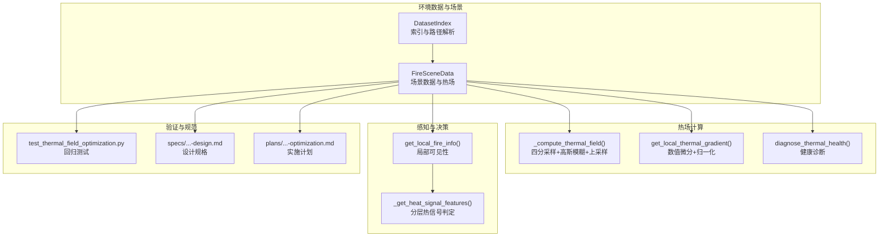
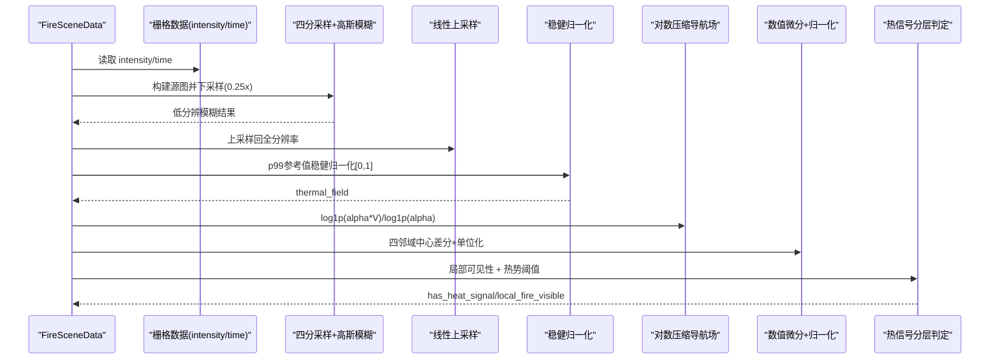
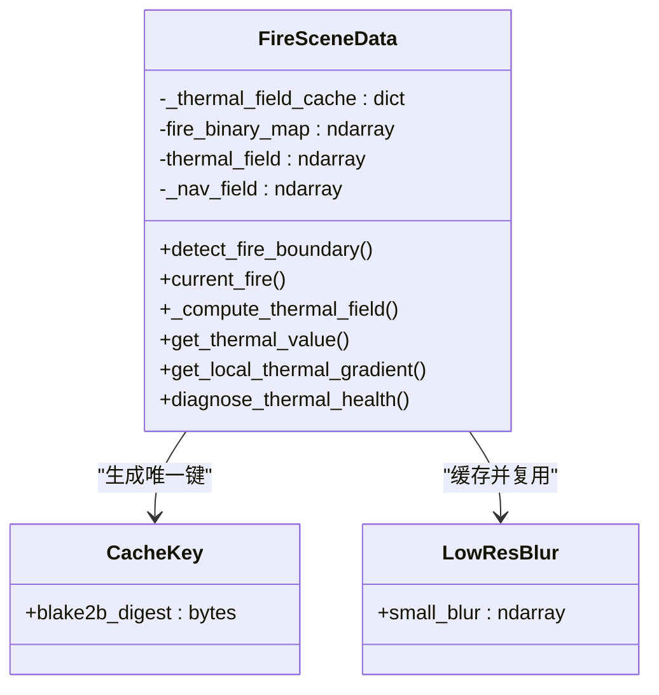
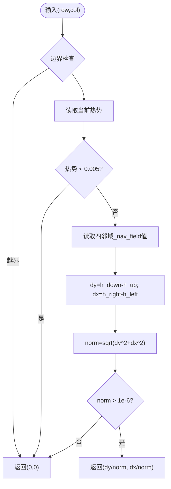
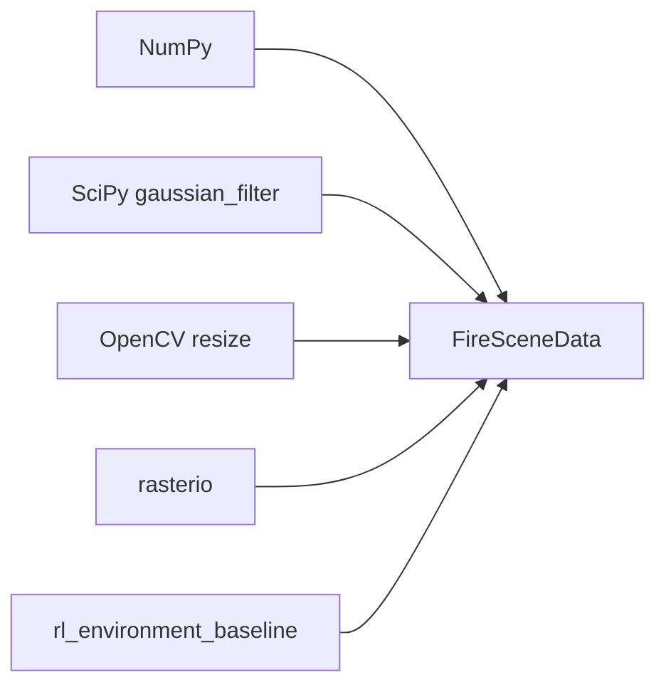

# 热场优化计算

<cite>
**本文引用的文件**
- [信息转换.py](file://environment_variables/environment_variables/信息转换.py)
- [rl_environment_baseline.py](file://environment_variables/environment_variables/rl_environment_baseline.py)
- [test_thermal_field_optimization.py](file://environment_variables/environment_variables/test_thermal_field_optimization.py)
- [2026-07-06-thermal-field-optimization-design.md](file://docs/superpowers/specs/2026-07-06-thermal-field-optimization-design.md)
- [2026-07-06-thermal-field-optimization.md](file://docs/superpowers/plans/2026-07-06-thermal-field-optimization.md)
</cite>

## 目录
1. [引言](#引言)
2. [项目结构](#项目结构)
3. [核心组件](#核心组件)
4. [架构总览](#架构总览)
5. [详细组件分析](#详细组件分析)
6. [依赖关系分析](#依赖关系分析)
7. [性能考量](#性能考量)
8. [故障排查指南](#故障排查指南)
9. [结论](#结论)
10. [附录](#附录)

## 引言
本技术文档围绕“热场优化计算系统”展开，聚焦以下关键主题：四分之一分辨率高斯模糊近似算法的数学原理与实现细节（卷积核设计、边界处理、内存优化）、热势值计算方法（温度场插值、距离加权、时间衰减模型）、热场缓存机制（策略、失效更新、内存管理）、热梯度计算算法（数值微分与方向向量归一化）、热信号分层判定系统（局部可见性检测、传感器阈值、综合判断逻辑），以及性能基准与优化建议（复杂度分析与并行化方案）。文档内容严格基于仓库中的源码与设计/计划文档进行提炼与归纳。

## 项目结构
本项目在环境变量模块中实现了火场数据加载、热场重建、梯度计算、热信号判定等核心功能；同时包含针对热场优化的回归测试与规格/计划文档，用于约束输出形状、范围与精度指标。

图表来源
- [信息转换.py:219-322](file://environment_variables/environment_variables/信息转换.py#L219-L322)
- [信息转换.py:759-819](file://environment_variables/environment_variables/信息转换.py#L759-L819)
- [信息转换.py:933-970](file://environment_variables/environment_variables/信息转换.py#L933-L970)
- [信息转换.py:972-1012](file://environment_variables/environment_variables/信息转换.py#L972-L1012)
- [信息转换.py:1070-1123](file://environment_variables/environment_variables/信息转换.py#L1070-L1123)
- [rl_environment_baseline.py:671-690](file://environment_variables/environment_variables/rl_environment_baseline.py#L671-L690)
- [test_thermal_field_optimization.py:1-70](file://environment_variables/environment_variables/test_thermal_field_optimization.py#L1-L70)
- [2026-07-06-thermal-field-optimization-design.md:1-29](file://docs/superpowers/specs/2026-07-06-thermal-field-optimization-design.md#L1-L29)
- [2026-07-06-thermal-field-optimization.md:1-142](file://docs/superpowers/plans/2026-07-06-thermal-field-optimization.md#L1-L142)

章节来源
- [信息转换.py:219-322](file://environment_variables/environment_variables/信息转换.py#L219-L322)
- [2026-07-06-thermal-field-optimization-design.md:1-29](file://docs/superpowers/specs/2026-07-06-thermal-field-optimization-design.md#L1-L29)
- [2026-07-06-thermal-field-optimization.md:1-142](file://docs/superpowers/plans/2026-07-06-thermal-field-optimization.md#L1-L142)

## 核心组件
- FireSceneData：负责场景数据加载、栅格读取、标准化参数推导、边界提取、热场重建、梯度计算、局部邻域与风场效应等。
- 热场重建流程：四分采样→高斯模糊→线性上采样→稳健归一化→对数压缩导航场。
- 热梯度计算：基于对数压缩导航场的中心差分与单位向量归一化。
- 热信号分层判定：结合局部可见性与热势阈值的多层布尔组合。
- 健康诊断：统计饱和比例、非零比例、高热区零梯度比例等指标。

章节来源
- [信息转换.py:759-819](file://environment_variables/environment_variables/信息转换.py#L759-L819)
- [信息转换.py:933-970](file://environment_variables/environment_variables/信息转换.py#L933-L970)
- [信息转换.py:972-1012](file://environment_variables/environment_variables/信息转换.py#L972-L1012)
- [rl_environment_baseline.py:671-690](file://environment_variables/environment_variables/rl_environment_baseline.py#L671-L690)

## 架构总览
下图展示了从原始强度栅格到热势场、再到梯度与热信号判定的端到端流程。

图表来源
- [信息转换.py:759-819](file://environment_variables/environment_variables/信息转换.py#L759-L819)
- [信息转换.py:933-970](file://environment_variables/environment_variables/信息转换.py#L933-L970)
- [信息转换.py:1070-1123](file://environment_variables/environment_variables/信息转换.py#L1070-L1123)
- [rl_environment_baseline.py:671-690](file://environment_variables/environment_variables/rl_environment_baseline.py#L671-L690)

## 详细组件分析

### 四分之一分辨率高斯模糊近似算法
- 数学原理
  - 目标：以较低分辨率近似全分辨率高斯平滑，降低计算量并保持视觉与下游任务可接受的误差。
  - 步骤：将源图按空间因子0.25下采样，使用标准差σ=15、截断truncate=4.0的高斯核进行卷积，再线性插值回原分辨率。
  - 边界处理：OpenCV resize采用INTER_AREA（下采样）与INTER_LINEAR（上采样），内部边界通过插值自然过渡；后续clip保证非负。
  - 稳健归一化：对正像素取99百分位作为参考ref，避免极端值影响；最终热势钳制在[0,1]。
  - 导航场：对热势做对数压缩，缓解高值区梯度消失问题。
- 实现要点
  - 下采样与上采样分别调用resize，sigma与truncate保持与全分辨率版本相近的等效扩散尺度。
  - 使用np.percentile(p99)进行场景内稳健缩放，确保不同场景间语义一致。
  - 生成_nav_field供梯度计算使用，提升数值稳定性。
- 复杂度与内存
  - 计算复杂度近似为O((H/4)*(W/4)*K^2)，相比全分辨率显著下降；内存占用亦随分辨率平方级减少。
  - 上采样后得到与原图同形的thermal_field与_nav_field，便于下游直接访问。

图表来源
- [信息转换.py:759-819](file://environment_variables/environment_variables/信息转换.py#L759-L819)

章节来源
- [信息转换.py:759-819](file://environment_variables/environment_variables/信息转换.py#L759-L819)
- [2026-07-06-thermal-field-optimization-design.md:1-29](file://docs/superpowers/specs/2026-07-06-thermal-field-optimization-design.md#L1-L29)
- [2026-07-06-thermal-field-optimization.md:41-83](file://docs/superpowers/plans/2026-07-06-thermal-field-optimization.md#L41-L83)

### 热势值计算方法
- 温度场插值
  - 由四分模糊结果经线性插值恢复至全分辨率，形成连续的热势表面。
- 距离加权
  - 当前实现未显式引入距离加权项；热势的空间平滑主要由高斯核完成。
- 时间衰减模型
  - 热场重建本身不直接包含时间衰减；但边界选择支持按时间步推进或按面积百分比截取，间接体现时间演化。
- 数值特性
  - 通过p99稳健归一化和对数压缩导航场，避免饱和与梯度消失，有利于后续梯度与奖励计算。

章节来源
- [信息转换.py:759-819](file://environment_variables/environment_variables/信息转换.py#L759-L819)
- [信息转换.py:821-887](file://environment_variables/environment_variables/信息转换.py#L821-L887)

### 热场缓存机制
- 设计目标
  - 避免重复计算相同火场掩码对应的高斯模糊结果，显著提升冷启动与重复状态下的性能。
- 缓存键策略
  - 使用BLAKE2b对打包的二进制火场掩码进行摘要，区分位置不同的等数量掩码，避免碰撞。
- 缓存对象
  - 缓存低分辨率模糊结果而非全分辨率输出，进一步节省内存与拷贝开销。
- 失效与更新
  - 当fire_binary_map变化时，重新计算并写入缓存；否则命中即复用。
- 内存管理
  - 仅保留小尺寸模糊结果，按需上采样；配合clip与float32类型控制内存峰值。

图表来源
- [信息转换.py:759-819](file://environment_variables/environment_variables/信息转换.py#L759-L819)
- [2026-07-06-thermal-field-optimization-design.md:1-29](file://docs/superpowers/specs/2026-07-06-thermal-field-optimization-design.md#L1-L29)
- [2026-07-06-thermal-field-optimization.md:41-83](file://docs/superpowers/plans/2026-07-06-thermal-field-optimization.md#L41-L83)

章节来源
- [2026-07-06-thermal-field-optimization-design.md:1-29](file://docs/superpowers/specs/2026-07-06-thermal-field-optimization-design.md#L1-L29)
- [2026-07-06-thermal-field-optimization.md:41-83](file://docs/superpowers/plans/2026-07-06-thermal-field-optimization.md#L41-L83)

### 热梯度计算算法
- 数值微分方法
  - 基于_nav_field的四邻域中心差分：dy=h_down-h_up，dx=h_right-h_left。
  - 边界处理：越界时使用自身值填充，避免异常。
- 方向向量归一化
  - 计算范数norm=sqrt(dy^2+dx^2)，若大于阈值则返回单位向量(dy/norm,dx/norm)，否则返回零向量。
- 数值稳定性
  - 使用对数压缩导航场，避免高值区梯度接近零导致的数值不稳定。
  - 设置最小热势阈值，低于阈值直接返回零梯度，减少无意义计算。

图表来源
- [信息转换.py:933-970](file://environment_variables/environment_variables/信息转换.py#L933-L970)

章节来源
- [信息转换.py:933-970](file://environment_variables/environment_variables/信息转换.py#L933-L970)

### 热信号分层判定系统
- 局部可见性检测
  - 获取以当前位置为中心、半径为vision_radius的圆形邻域，统计真实火点数量与边界点数。
- 传感器信号阈值
  - 若当前位置热势≥0.50，视为传感器触发。
- 综合判断逻辑
  - has_heat_signal = local_fire_visible OR thermal_sensor_signal，提供鲁棒的信号指示。
- 应用
  - 在奖励函数与观测特征中使用该分层信号，引导搜索与探索行为。

图表来源
- [信息转换.py:1070-1123](file://environment_variables/environment_variables/信息转换.py#L1070-L1123)
- [rl_environment_baseline.py:671-690](file://environment_variables/environment_variables/rl_environment_baseline.py#L671-L690)

章节来源
- [信息转换.py:1070-1123](file://environment_variables/environment_variables/信息转换.py#L1070-L1123)
- [rl_environment_baseline.py:671-690](file://environment_variables/environment_variables/rl_environment_baseline.py#L671-L690)

### 健康诊断与质量保障
- 诊断指标
  - 饱和比例、高热区比例、非零比例、高热区零梯度比例、热势分位数、字段极值等。
- 用途
  - 训练前自检，确保热场语义层正常，避免梯度消失或过度饱和导致的学习退化。

章节来源
- [信息转换.py:972-1012](file://environment_variables/environment_variables/信息转换.py#L972-L1012)
- [test_thermal_field_optimization.py:53-66](file://environment_variables/environment_variables/test_thermal_field_optimization.py#L53-L66)

## 依赖关系分析
- 外部库
  - NumPy：数组运算、百分位、裁剪、广播等。
  - SciPy gaussian_filter：高斯卷积核实现。
  - OpenCV cv2.resize：高效下/上采样。
  - rasterio：栅格读写与元数据解析。
- 内部耦合
  - FireSceneData聚合了数据加载、热场重建、梯度计算、邻域查询与风场效应等功能，职责集中但清晰。
  - 上层RL环境通过env_data接口访问热势与局部火信息，解耦良好。

图表来源
- [信息转换.py:1-14](file://environment_variables/environment_variables/信息转换.py#L1-L14)
- [rl_environment_baseline.py:671-690](file://environment_variables/environment_variables/rl_environment_baseline.py#L671-L690)

章节来源
- [信息转换.py:1-14](file://environment_variables/environment_variables/信息转换.py#L1-L14)
- [rl_environment_baseline.py:671-690](file://environment_variables/environment_variables/rl_environment_baseline.py#L671-L690)

## 性能考量
- 计算复杂度
  - 四分采样使高斯卷积的计算量降至约1/16；上采样与归一化为线性扫描，整体复杂度显著降低。
- 内存占用
  - 缓存低分辨率模糊结果，避免存储全分辨率中间态；float32与clip减少溢出风险。
- 基准与验收
  - 设计规格要求：MAE≤0.5，阈值分歧≤0.2%，冷启动加速≥20x；计划文档给出对比基线与运行命令。
- 优化建议
  - 批量化：对多场景批量执行热场重建，利用向量化与共享内核。
  - 并行化：对独立场景使用进程池或多线程（注意GIL与I/O瓶颈）。
  - 预分配：重用临时缓冲区，减少频繁分配。
  - 自适应sigma：根据地图分辨率动态调整sigma，保持物理一致性。
  - 缓存淘汰：LRU或容量上限，防止长会话内存膨胀。

章节来源
- [2026-07-06-thermal-field-optimization-design.md:15-24](file://docs/superpowers/specs/2026-07-06-thermal-field-optimization-design.md#L15-L24)
- [2026-07-06-thermal-field-optimization.md:115-125](file://docs/superpowers/plans/2026-07-06-thermal-field-optimization.md#L115-L125)

## 故障排查指南
- 常见错误
  - 缺少intensity或fire_binary_map未初始化：会抛出运行时错误，需检查数据加载与边界初始化流程。
  - 栅格形状不一致：静态地图与其他栅格shape不匹配将报错，需核对坐标系统与重采样。
  - 热场为空或饱和过高：检查p99参考值与alpha参数，确认normalize与clip逻辑。
- 诊断工具
  - diagnose_thermal_health：输出饱和比例、零梯度比例、分位数等，帮助定位问题。
  - 单元测试：覆盖输出范围、形状、不同掩码产生不同场、无饱和与健康诊断通过。

章节来源
- [信息转换.py:759-781](file://environment_variables/environment_variables/信息转换.py#L759-L781)
- [信息转换.py:972-1012](file://environment_variables/environment_variables/信息转换.py#L972-L1012)
- [test_thermal_field_optimization.py:26-66](file://environment_variables/environment_variables/test_thermal_field_optimization.py#L26-L66)

## 结论
本系统通过四分之一分辨率高斯模糊近似、稳健归一化与对数压缩导航场，构建了稳定且高效的熱势场；结合分层热信号判定与梯度计算，为无人机搜索与边界发现提供了可靠的感知与引导。缓存机制在保证正确性的前提下显著提升了性能。测试与规格文档确保了数值精度与工程可用性。未来可在并行化、自适应参数与缓存策略方面进一步优化。

## 附录
- 术语
  - 热势：经归一化的空间连续热强度表示，取值[0,1]。
  - 导航场：对热势的对数压缩形式，用于改善梯度数值稳定性。
  - 分层热信号：由局部可见性与传感器阈值组合得到的布尔信号。