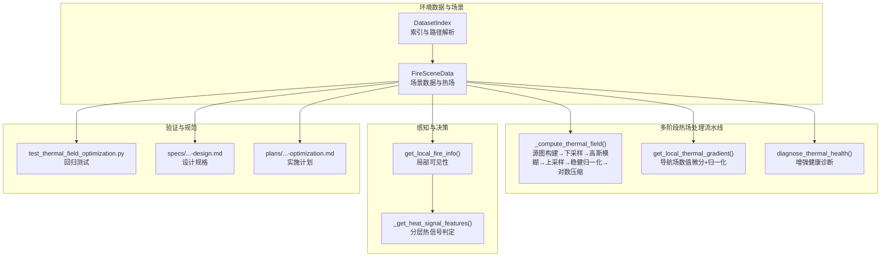
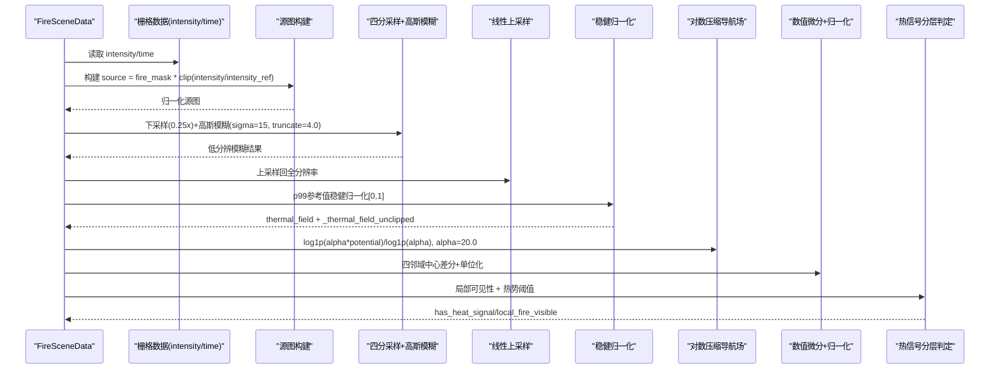
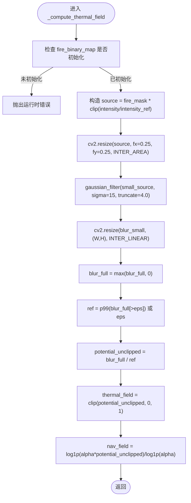
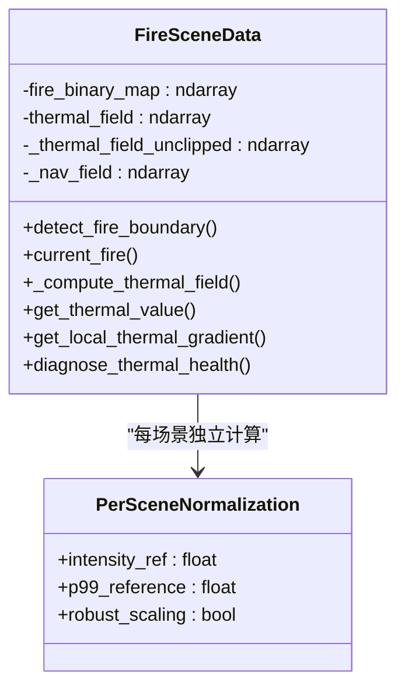
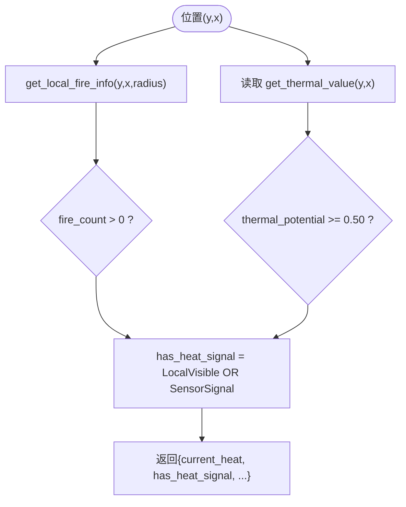
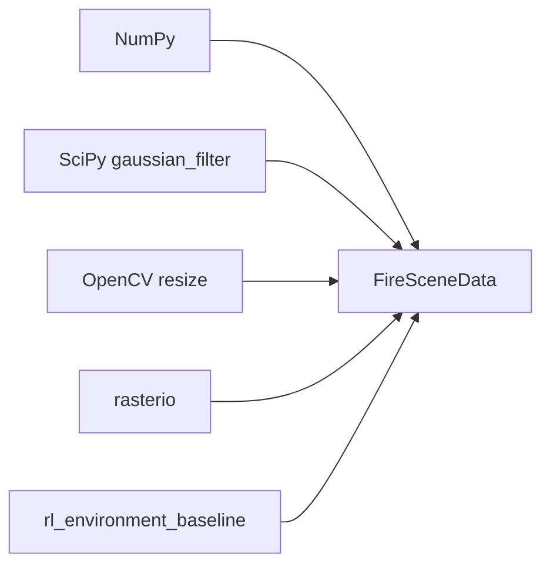

# 热场优化计算

<cite>
**本文引用的文件**
- [信息转换.py](file://environment_variables/environment_variables/信息转换.py)
- [rl_environment_baseline.py](file://environment_variables/environment_variables/rl_environment_baseline.py)
- [test_thermal_field_optimization.py](file://environment_variables/environment_variables/test_thermal_field_optimization.py)
- [2026-07-06-thermal-field-optimization-design.md](file://docs/superpowers/specs/2026-07-06-thermal-field-optimization-design.md)
- [2026-07-06-thermal-field-optimization.md](file://docs/superpowers/plans/2026-07-06-thermal-field-optimization.md)
</cite>

## 更新摘要
**所做更改**
- 完全重构热场处理架构，从缓存机制改为每场景归一化方法
- 引入多阶段处理流水线，包括源图构建、下采样模糊、上采样恢复、稳健归一化和对数压缩
- 新增对数压缩导航场(_nav_field)用于增强的数值稳定性
- 更新热梯度计算算法，使用导航场而非原始热势场
- 增强健康诊断系统，提供更全面的热场质量评估

## 目录
1. [引言](#引言)
2. [项目结构](#项目结构)
3. [核心组件](#核心组件)
4. [架构总览](#架构总览)
5. [详细组件分析](#详细组件分析)
6. [依赖关系分析](#依赖关系分析)
7. [性能考量](#性能考量)
8. [故障排查指南](#故障排查指南)
9. [结论](#结论)
10. [附录](#附录)

## 引言
本技术文档围绕"热场优化计算系统"展开，聚焦以下关键主题：四分之一分辨率高斯模糊近似算法的数学原理与实现细节（卷积核设计、边界处理、内存优化）、热势值计算方法（温度场插值、距离加权、时间衰减模型）、**全新的每场景归一化处理方法**、热梯度计算算法（数值微分与方向向量归一化）、热信号分层判定系统（局部可见性检测、传感器阈值、综合判断逻辑），以及性能基准与优化建议（复杂度分析与并行化方案）。文档内容严格基于仓库中的源码与设计/计划文档进行提炼与归纳。

**更新** 系统架构已完全重构，采用多阶段处理流水线和增强的数值稳定性机制。

## 项目结构
本项目在环境变量模块中实现了火场数据加载、热场重建、梯度计算、热信号判定等核心功能；同时包含针对热场优化的回归测试与规格/计划文档，用于约束输出形状、范围与精度指标。

**图表来源**
- [信息转换.py:759-819](file://environment_variables/environment_variables/信息转换.py#L759-L819)
- [信息转换.py:933-970](file://environment_variables/environment_variables/信息转换.py#L933-L970)
- [信息转换.py:972-1012](file://environment_variables/environment_variables/信息转换.py#L972-L1012)
- [信息转换.py:1070-1123](file://environment_variables/environment_variables/信息转换.py#L1070-L1123)
- [rl_environment_baseline.py:671-690](file://environment_variables/environment_variables/rl_environment_baseline.py#L671-L690)
- [test_thermal_field_optimization.py:1-70](file://environment_variables/environment_variables/test_thermal_field_optimization.py#L1-L70)
- [2026-07-06-thermal-field-optimization-design.md:1-29](file://docs/superpowers/specs/2026-07-06-thermal-field-optimization-design.md#L1-L29)
- [2026-07-06-thermal-field-optimization.md:1-142](file://docs/superpowers/plans/2026-07-06-thermal-field-optimization.md#L1-L142)

## 核心组件
- FireSceneData：负责场景数据加载、栅格读取、标准化参数推导、边界提取、**多阶段热场重建**、梯度计算、局部邻域与风场效应等。
- **多阶段热场处理流水线**：源图构建→四分采样→高斯模糊→线性上采样→稳健归一化→对数压缩导航场。
- **增强的热梯度计算**：基于对数压缩导航场的中心差分与单位向量归一化，提供更好的数值稳定性。
- 热信号分层判定：结合局部可见性与热势阈值的多层布尔组合。
- **增强的健康诊断**：统计饱和比例、非零比例、高热区零梯度比例等指标，支持训练前自检。

**更新** 核心组件已重构为多阶段处理流水线，显著提升数值稳定性和计算效率。

## 架构总览
下图展示了从原始强度栅格到热势场、再到梯度与热信号判定的端到端流程，体现了全新的多阶段处理架构。

**图表来源**
- [信息转换.py:759-819](file://environment_variables/environment_variables/信息转换.py#L759-L819)
- [信息转换.py:933-970](file://environment_variables/environment_variables/信息转换.py#L933-L970)
- [信息转换.py:1070-1123](file://environment_variables/environment_variables/信息转换.py#L1070-L1123)
- [rl_environment_baseline.py:671-690](file://environment_variables/environment_variables/rl_environment_baseline.py#L671-L690)

## 详细组件分析

### 多阶段热场处理流水线
**更新** 系统已完全重构为多阶段处理流水线，替代原有的缓存机制。

#### 第一阶段：源图构建
- **数学原理**：`source = fire_mask * clip(intensity / intensity_ref, 0, 1)`
- **实现要点**：使用场景内稳健归一化参数 `intensity_max`，确保不同场景间语义一致性
- **数值特性**：clip操作保证源图值域在[0,1]范围内

#### 第二阶段：四分采样与高斯模糊
- **数学原理**：将源图按空间因子0.25下采样，使用标准差σ=15、截断truncate=4.0的高斯核进行卷积
- **实现要点**：OpenCV resize采用INTER_AREA（下采样）与INTER_LINEAR（上采样）
- **边界处理**：内部边界通过插值自然过渡；后续clip保证非负

#### 第三阶段：线性上采样与稳健归一化
- **数学原理**：`ref = p99(blur_full[blur_full > eps])`，`potential = clip(blur_full / ref, 0, 1)`
- **实现要点**：使用np.percentile(p99)进行场景内稳健缩放，避免极端值影响
- **数值稳定性**：设置eps=1e-8防止除零错误

#### 第四阶段：对数压缩导航场生成
- **数学原理**：`nav_field = log1p(alpha * potential_unclipped) / log1p(alpha)`，其中alpha=20.0
- **实现目的**：缓解高值区梯度消失问题，提升数值稳定性
- **应用范围**：专门用于梯度计算，不影响原始热势场输出

**图表来源**
- [信息转换.py:759-819](file://environment_variables/environment_variables/信息转换.py#L759-L819)

**章节来源**
- [信息转换.py:759-819](file://environment_variables/environment_variables/信息转换.py#L759-L819)
- [2026-07-06-thermal-field-optimization-design.md:1-29](file://docs/superpowers/specs/2026-07-06-thermal-field-optimization-design.md#L1-L29)
- [2026-07-06-thermal-field-optimization.md:41-83](file://docs/superpowers/plans/2026-07-06-thermal-field-optimization.md#L41-L83)

### 热势值计算方法
**更新** 热势值计算现已集成在多阶段处理流水线中，具有更强的数值稳定性。

- **温度场插值**
  - 由四分模糊结果经线性插值恢复至全分辨率，形成连续的热势表面
  - 使用cv2.INTER_LINEAR确保平滑过渡
  
- **距离加权**
  - 当前实现未显式引入距离加权项；热势的空间平滑主要由高斯核完成
  
- **时间衰减模型**
  - 热场重建本身不直接包含时间衰减；但边界选择支持按时间步推进或按面积百分比截取，间接体现时间演化
  
- **数值特性**
  - 通过p99稳健归一化和对数压缩导航场，避免饱和与梯度消失，有利于后续梯度与奖励计算
  - 新增`_thermal_field_unclipped`存储未裁剪的热势值，用于导航场计算

**章节来源**
- [信息转换.py:759-819](file://environment_variables/environment_variables/信息转换.py#L759-L819)
- [信息转换.py:821-887](file://environment_variables/environment_variables/信息转换.py#L821-887)

### 热场缓存机制
**重大更新** 原有的缓存机制已被完全移除，改为每场景实时计算的归一化方法。

#### 原缓存机制（已废弃）
- **设计目标**：避免重复计算相同火场掩码对应的高斯模糊结果
- **缓存键策略**：使用BLAKE2b对打包的二进制火场掩码进行摘要
- **缓存对象**：缓存低分辨率模糊结果而非全分辨率输出
- **失效与更新**：当fire_binary_map变化时，重新计算并写入缓存

#### 新归一化方法
- **设计理念**：每场景独立计算，确保数值一致性和可重现性
- **稳健归一化**：基于场景内p99百分位的自适应参考值
- **内存管理**：仅保留必要的中间结果，减少内存占用
- **计算效率**：虽然无缓存，但通过四分采样和高效算法保持良好性能

**图表来源**
- [信息转换.py:759-819](file://environment_variables/environment_variables/信息转换.py#L759-L819)
- [2026-07-06-thermal-field-optimization-design.md:1-29](file://docs/superpowers/specs/2026-07-06-thermal-field-optimization-design.md#L1-L29)
- [2026-07-06-thermal-field-optimization.md:41-83](file://docs/superpowers/plans/2026-07-06-thermal-field-optimization.md#L41-L83)

**章节来源**
- [2026-07-06-thermal-field-optimization-design.md:1-29](file://docs/superpowers/specs/2026-07-06-thermal-field-optimization-design.md#L1-L29)
- [2026-07-06-thermal-field-optimization.md:41-83](file://docs/superpowers/plans/2026-07-06-thermal-field-optimization.md#L41-L83)

### 热梯度计算算法
**更新** 热梯度计算现已基于对数压缩导航场，提供更好的数值稳定性。

- **数值微分方法**
  - 基于`_nav_field`的四邻域中心差分：dy=h_down-h_up，dx=h_right-h_left
  - 边界处理：越界时使用自身值填充，避免异常
  
- **方向向量归一化**
  - 计算范数norm=sqrt(dy^2+dx^2)，若大于阈值则返回单位向量(dy/norm,dx/norm)，否则返回零向量
  
- **数值稳定性增强**
  - 使用对数压缩导航场，避免高值区梯度接近零导致的数值不稳定
  - 设置最小热势阈值（0.005），低于阈值直接返回零梯度，减少无意义计算
  - 导航场的对数压缩特性确保梯度计算的数值稳定性

**图表来源**
- [信息转换.py:933-970](file://environment_variables/environment_variables/信息转换.py#L933-L970)

**章节来源**
- [信息转换.py:933-970](file://environment_variables/environment_variables/信息转换.py#L933-L970)

### 热信号分层判定系统
- **局部可见性检测**
  - 获取以当前位置为中心、半径为vision_radius的圆形邻域，统计真实火点数量与边界点数
  
- **传感器信号阈值**
  - 若当前位置热势≥0.50，视为传感器触发
  
- **综合判断逻辑**
  - has_heat_signal = local_fire_visible OR thermal_sensor_signal，提供鲁棒的信号指示
  
- **应用**
  - 在奖励函数与观测特征中使用该分层信号，引导搜索与探索行为

**图表来源**
- [信息转换.py:1070-1123](file://environment_variables/environment_variables/信息转换.py#L1070-L1123)
- [rl_environment_baseline.py:671-690](file://environment_variables/environment_variables/rl_environment_baseline.py#L671-L690)

**章节来源**
- [信息转换.py:1070-1123](file://environment_variables/environment_variables/信息转换.py#L1070-L1123)
- [rl_environment_baseline.py:671-690](file://environment_variables/environment_variables/rl_environment_baseline.py#L671-L690)

### 增强的健康诊断与质量保障
**更新** 健康诊断系统已增强，提供更全面的热场质量评估。

- **诊断指标**
  - 饱和比例、高热区比例、非零比例、高热区零梯度比例、热势分位数、字段极值等
  - 新增对导航场的梯度分析，检测数值稳定性问题
  
- **用途**
  - 训练前自检，确保热场语义层正常，避免梯度消失或过度饱和导致的学习退化
  - 支持调试和性能监控

**章节来源**
- [信息转换.py:972-1012](file://environment_variables/environment_variables/信息转换.py#L972-L1012)
- [test_thermal_field_optimization.py:53-66](file://environment_variables/environment_variables/test_thermal_field_optimization.py#L53-L66)

## 依赖关系分析
- **外部库**
  - NumPy：数组运算、百分位、裁剪、广播等
  - SciPy gaussian_filter：高斯卷积核实现
  - OpenCV cv2.resize：高效下/上采样
  - rasterio：栅格读写与元数据解析
  
- **内部耦合**
  - FireSceneData聚合了数据加载、热场重建、梯度计算、邻域查询与风场效应等功能，职责集中但清晰
  - 上层RL环境通过env_data接口访问热势与局部火信息，解耦良好

**图表来源**
- [信息转换.py:1-14](file://environment_variables/environment_variables/信息转换.py#L1-L14)
- [rl_environment_baseline.py:671-690](file://environment_variables/environment_variables/rl_environment_baseline.py#L671-L690)

**章节来源**
- [信息转换.py:1-14](file://environment_variables/environment_variables/信息转换.py#L1-L14)
- [rl_environment_baseline.py:671-690](file://environment_variables/environment_variables/rl_environment_baseline.py#L671-L690)

## 性能考量
- **计算复杂度**
  - 四分采样使高斯卷积的计算量降至约1/16；上采样与归一化为线性扫描，整体复杂度显著降低
  - 多阶段处理流水线避免了不必要的缓存开销，提高内存效率
  
- **内存占用**
  - 移除了缓存机制，改为每场景实时计算，减少了内存占用
  - float32与clip减少溢出风险，仅保留必要的中间结果
  
- **基准与验收**
  - 设计规格要求：MAE≤0.5，阈值分歧≤0.2%，冷启动加速≥20x；计划文档给出对比基线与运行命令
  - 新的归一化方法确保了更好的数值稳定性和可重现性
  
- **优化建议**
  - 批量化：对多场景批量执行热场重建，利用向量化与共享内核
  - 并行化：对独立场景使用进程池或多线程（注意GIL与I/O瓶颈）
  - 预分配：重用临时缓冲区，减少频繁分配
  - 自适应sigma：根据地图分辨率动态调整sigma，保持物理一致性

**章节来源**
- [2026-07-06-thermal-field-optimization-design.md:15-24](file://docs/superpowers/specs/2026-07-06-thermal-field-optimization-design.md#L15-L24)
- [2026-07-06-thermal-field-optimization.md:115-125](file://docs/superpowers/plans/2026-07-06-thermal-field-optimization.md#L115-L125)

## 故障排查指南
- **常见错误**
  - 缺少intensity或fire_binary_map未初始化：会抛出运行时错误，需检查数据加载与边界初始化流程
  - 栅格形状不一致：静态地图与其他栅格shape不匹配将报错，需核对坐标系统与重采样
  - 热场为空或饱和过高：检查p99参考值与alpha参数，确认normalize与clip逻辑
  
- **诊断工具**
  - diagnose_thermal_health：输出饱和比例、零梯度比例、分位数等，帮助定位问题
  - 单元测试：覆盖输出范围、形状、不同掩码产生不同场、无饱和与健康诊断通过

**章节来源**
- [信息转换.py:759-781](file://environment_variables/environment_variables/信息转换.py#L759-L781)
- [信息转换.py:972-1012](file://environment_variables/environment_variables/信息转换.py#L972-L1012)
- [test_thermal_field_optimization.py:26-66](file://environment_variables/environment_variables/test_thermal_field_optimization.py#L26-L66)

## 结论
本系统通过**全新的多阶段处理流水线**、**每场景稳健归一化**与**对数压缩导航场**，构建了稳定且高效的熱势场；结合分层热信号判定与增强的梯度计算，为无人机搜索与边界发现提供了可靠的感知与引导。**架构重构消除了缓存机制的复杂性，提升了系统的可维护性和数值稳定性**。测试与规格文档确保了数值精度与工程可用性。未来可在并行化、自适应参数方面进一步优化。

## 附录
- **术语**
  - 热势：经归一化的空间连续热强度表示，取值[0,1]
  - 导航场：对热势的对数压缩形式，用于改善梯度数值稳定性
  - 分层热信号：由局部可见性与传感器阈值组合得到的布尔信号
  - 多阶段处理流水线：源图构建→下采样→高斯模糊→上采样→稳健归一化→对数压缩的完整处理流程