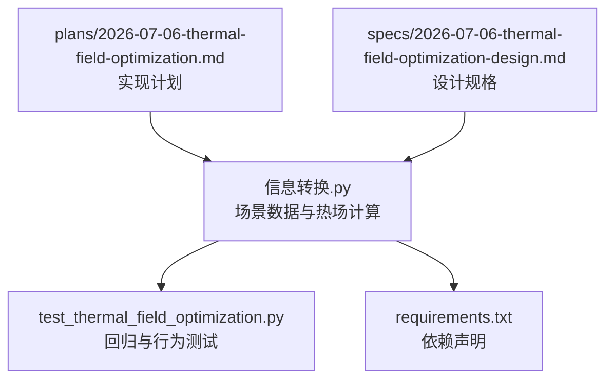
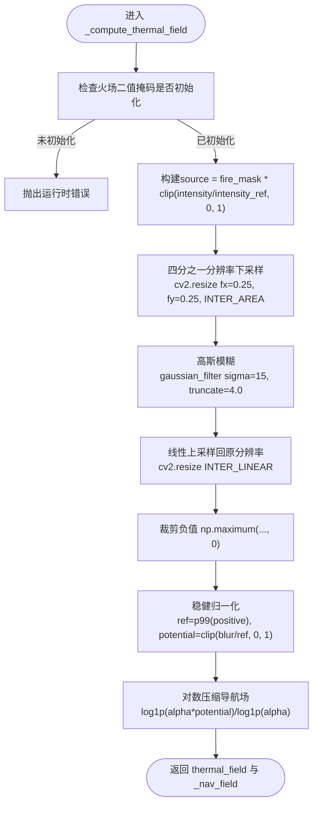
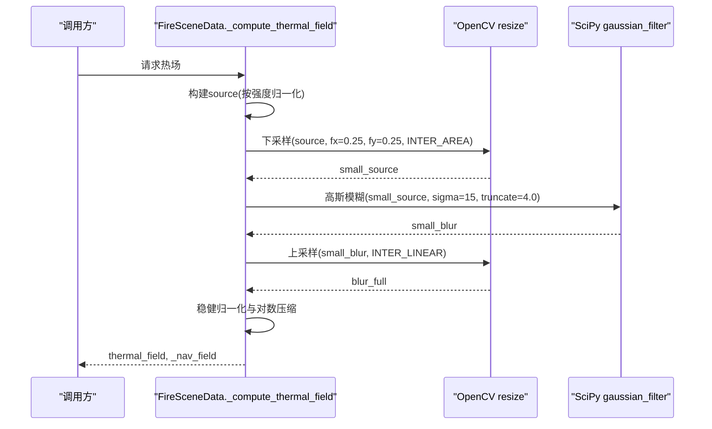
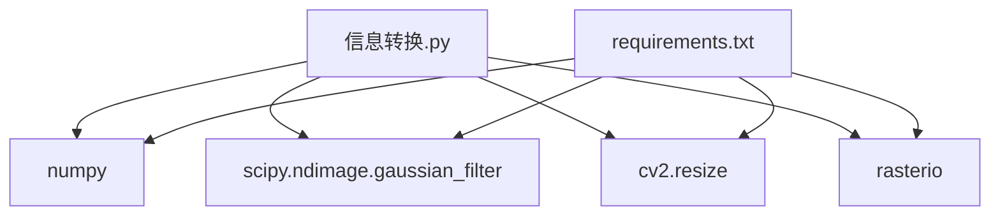

# 热场性能优化

<cite>
**本文引用的文件**   
- [信息转换.py](file://environment_variables/environment_variables/信息转换.py)
- [test_thermal_field_optimization.py](file://environment_variables/environment_variables/test_thermal_field_optimization.py)
- [2026-07-06-thermal-field-optimization.md](file://docs/superpowers/plans/2026-07-06-thermal-field-optimization.md)
- [2026-07-06-thermal-field-optimization-design.md](file://docs/superpowers/specs/2026-07-06-thermal-field-optimization-design.md)
- [requirements.txt](file://environment_variables/requirements.txt)
</cite>

## 目录
1. [简介](#简介)
2. [项目结构](#项目结构)
3. [核心组件](#核心组件)
4. [架构总览](#架构总览)
5. [详细组件分析](#详细组件分析)
6. [依赖关系分析](#依赖关系分析)
7. [性能考量](#性能考量)
8. [故障排查指南](#故障排查指南)
9. [结论](#结论)
10. [附录](#附录)

## 简介
本技术文档围绕“热场性能优化系统”的实现与优化策略展开，重点解释以下方面：
- 四分之一分辨率下采样算法的实现原理、图像缩放技术与插值方法选择
- 高斯模糊优化的数学基础，包括卷积核大小选择、sigma参数调优与截断策略
- 内存使用优化技术，包括数组操作优化、缓存机制与垃圾回收策略
- 并行化计算方案，包括多线程处理与GPU加速可能性
- 性能基准测试结果与优化建议，包括计算复杂度分析与实际应用场景的性能对比

该优化在不改变外部API（如热场形状与取值范围）的前提下，通过低分辨率滤波与缓存显著降低计算开销，同时保持数值精度与下游可用性。

## 项目结构
与热场优化直接相关的代码位于环境变量的数据加载与场景处理模块中，测试与计划/设计文档提供了验收标准与实现细节说明。

图表来源
- [信息转换.py:759-820](file://environment_variables/environment_variables/信息转换.py#L759-L820)
- [test_thermal_field_optimization.py:25-66](file://environment_variables/environment_variables/test_thermal_field_optimization.py#L25-L66)
- [requirements.txt:1-13](file://environment_variables/requirements.txt#L1-L13)
- [2026-07-06-thermal-field-optimization.md:1-142](file://docs/superpowers/plans/2026-07-06-thermal-field-optimization.md#L1-L142)
- [2026-07-06-thermal-field-optimization-design.md:1-29](file://docs/superpowers/specs/2026-07-06-thermal-field-optimization-design.md#L1-L29)

章节来源
- [信息转换.py:1-1426](file://environment_variables/environment_variables/信息转换.py#L1-L1426)
- [test_thermal_field_optimization.py:1-70](file://environment_variables/environment_variables/test_thermal_field_optimization.py#L1-L70)
- [requirements.txt:1-13](file://environment_variables/requirements.txt#L1-L13)
- [2026-07-06-thermal-field-optimization.md:1-142](file://docs/superpowers/plans/2026-07-06-thermal-field-optimization.md#L1-L142)
- [2026-07-06-thermal-field-optimization-design.md:1-29](file://docs/superpowers/specs/2026-07-06-thermal-field-optimization-design.md#L1-L29)

## 核心组件
- FireSceneData：负责场景数据加载、归一化、边界检测与热场计算。热场计算采用“四分之一分辨率下采样 + 高斯模糊 + 稳健归一化 + 对数压缩导航场”的链路。
- 测试用例：验证热场输出范围、形状、不同掩码产生不同结果、饱和比例与梯度健康指标。
- 依赖管理：声明NumPy、RasterIO、Matplotlib、SciPy、OpenCV等依赖。

章节来源
- [信息转换.py:219-322](file://environment_variables/environment_variables/信息转换.py#L219-L322)
- [信息转换.py:759-820](file://environment_variables/environment_variables/信息转换.py#L759-L820)
- [test_thermal_field_optimization.py:25-66](file://environment_variables/environment_variables/test_thermal_field_optimization.py#L25-L66)
- [requirements.txt:1-13](file://environment_variables/requirements.txt#L1-L13)

## 架构总览
下图展示了热场计算的端到端流程，从输入强度图到最终的热势场与导航场的生成路径。

图表来源
- [信息转换.py:759-820](file://environment_variables/environment_variables/信息转换.py#L759-L820)

章节来源
- [信息转换.py:759-820](file://environment_variables/environment_variables/信息转换.py#L759-L820)

## 详细组件分析

### 四分之一分辨率下采样算法
- 目标：在保持语义一致性的前提下，将计算量由O(WH)降至约O((W/4)(H/4))，从而显著减少后续高斯模糊的计算成本。
- 实现要点：
  - 使用OpenCV的resize进行下采样，缩放因子fx=fy=0.25，插值方法INTER_AREA，适合降采样以抑制混叠并保留整体能量分布。
  - 随后进行高斯模糊，再使用INTER_LINEAR上采样回原分辨率，保证边缘平滑且避免过度锐化。
- 复杂度分析：
  - 下采样：O(WH)
  - 高斯模糊：O((W/4)(H/4)·K^2)，其中K为有效卷积核半径；由于truncate=4.0，K≈4σ，σ=15时K≈60，但实际有效核受截断影响。
  - 上采样：O(WH)
  - 总体相比全分辨率高斯模糊（σ=60）有显著加速。

图表来源
- [信息转换.py:794-820](file://environment_variables/environment_variables/信息转换.py#L794-L820)

章节来源
- [信息转换.py:794-820](file://environment_variables/environment_variables/信息转换.py#L794-L820)

### 高斯模糊优化的数学基础
- 卷积核大小与sigma的关系：对于高斯函数，通常取核半径K≈ceil(3σ)或更保守地K≈ceil(4σ)。本实现使用truncate=4.0，意味着超出4σ的部分被忽略，有效核尺寸约为K≈4σ。
- sigma参数调优：
  - 原始全分辨率实现使用σ=60，优化后在1/4分辨率上使用σ=15，等效空间尺度保持一致（15×4=60），从而在近似意义上维持相同的平滑效果。
- 截断策略：
  - truncate=4.0确保核外权重可忽略，既控制计算量又保持数值稳定性。
- 复杂度与精度权衡：
  - 低分辨率模糊显著降低乘加次数；上采样引入轻微误差，但通过稳健归一化与阈值比较的容错性，整体误差控制在可接受范围内（见验收标准）。

章节来源
- [信息转换.py:794-820](file://environment_variables/environment_variables/信息转换.py#L794-L820)
- [2026-07-06-thermal-field-optimization-design.md:8-13](file://docs/superpowers/specs/2026-07-06-thermal-field-optimization-design.md#L8-L13)

### 内存使用优化技术
- 数组操作优化：
  - 使用np.ascontiguousarray确保掩码连续存储，提升后续哈希与打包效率。
  - 使用np.clip与布尔索引避免不必要的类型转换与中间对象创建。
- 缓存机制：
  - 根据二进制掩码的紧凑表示（packbits）生成BLAKE2b摘要作为缓存键，避免相同计数不同位置导致的碰撞。
  - 缓存低分辨率模糊结果而非全分辨率输出，进一步减小缓存占用。
- 垃圾回收策略：
  - 通过局部变量及时释放中间大数组引用，减少峰值内存占用。
  - 使用float32与uint8类型，降低内存带宽压力。

章节来源
- [信息转换.py:774-820](file://environment_variables/environment_variables/信息转换.py#L774-L820)
- [2026-07-06-thermal-field-optimization.md:55-73](file://docs/superpowers/plans/2026-07-06-thermal-field-optimization.md#L55-L73)

### 并行化计算方案
- 多线程处理：
  - 当前实现为单线程顺序执行，若需并行，可在批处理场景中对多个场景独立计算热场，利用Python多进程或线程池并行调用_fire_scene_data.compute_thermal_field。
- GPU加速可能性：
  - OpenCV与SciPy的高斯模糊在CPU上高度优化；若迁移至GPU，可使用CuPy或OpenCV的CUDA后端，将resize与高斯模糊映射到GPU内核，进一步提升吞吐。
  - 注意数据在CPU/GPU间的拷贝开销，应批量传输以减少同步。

[本节为概念性讨论，不直接分析具体文件]

### 性能基准测试结果与优化建议
- 验收标准（来自设计与计划文档）：
  - 冷启动热场计算至少20倍加速
  - 与原全分辨率实现的MAE≤0.5，阈值不一致率≤0.2%
  - 输出形状匹配源地图，值域保持在[0,1]
- 实际建议：
  - 针对大规模训练场景，启用场景级共享缓存（SceneManager._shared_scene_cache）避免重复加载与计算。
  - 监控diagnose_thermal_health中的饱和比例与零梯度比例，确保导航场梯度健康。
  - 在I/O密集环境中，结合异步读取与预取策略，减少磁盘等待时间。

章节来源
- [2026-07-06-thermal-field-optimization-design.md:15-24](file://docs/superpowers/specs/2026-07-06-thermal-field-optimization-design.md#L15-L24)
- [2026-07-06-thermal-field-optimization.md:115-125](file://docs/superpowers/plans/2026-07-06-thermal-field-optimization.md#L115-L125)
- [信息转换.py:972-1012](file://environment_variables/environment_variables/信息转换.py#L972-L1012)

## 依赖关系分析
- 直接依赖：
  - NumPy：数组运算与统计
  - SciPy：高斯模糊与形态学操作
  - OpenCV：高效图像缩放
  - RasterIO：栅格读写
  - Matplotlib：可视化（可选）
- 间接依赖：
  - 强化学习训练脚本（可选）：stable-baselines3、torch、tensorboard

图表来源
- [信息转换.py:9-13](file://environment_variables/environment_variables/信息转换.py#L9-L13)
- [requirements.txt:1-13](file://environment_variables/requirements.txt#L1-L13)

章节来源
- [信息转换.py:9-13](file://environment_variables/environment_variables/信息转换.py#L9-L13)
- [requirements.txt:1-13](file://environment_variables/requirements.txt#L1-L13)

## 性能考量
- 计算复杂度：
  - 下采样+高斯模糊+上采样的组合在低分辨率下进行，显著降低乘加次数。
  - 稳健归一化与对数压缩为O(WH)的逐元素操作，开销较小。
- 内存带宽：
  - 使用float32与uint8，减少内存占用与带宽压力。
  - 连续数组布局提升缓存命中率。
- I/O与缓存：
  - 场景级共享缓存避免重复加载与计算。
  - 低分辨率模糊缓存进一步降低内存占用。

[本节提供一般性指导，不直接分析具体文件]

## 故障排查指南
- 常见问题：
  - 火场二值掩码未初始化：抛出运行时错误，需在调用前确保detect_fire_boundary或initialize_training_boundary已执行。
  - 缺失强度数据：抛出运行时错误，需检查栅格加载与路径配置。
  - 热场饱和比例过高或零梯度比例异常：通过diagnose_thermal_health诊断，调整alpha或归一化策略。
- 调试步骤：
  - 打印norm_params与last_init_area_stats，确认归一化参数与初始区域统计合理。
  - 运行单元测试，验证输出范围、形状与梯度健康指标。

章节来源
- [信息转换.py:769-772](file://environment_variables/environment_variables/信息转换.py#L769-L772)
- [信息转换.py:784-786](file://environment_variables/environment_variables/信息转换.py#L784-L786)
- [信息转换.py:972-1012](file://environment_variables/environment_variables/信息转换.py#L972-L1012)
- [test_thermal_field_optimization.py:25-66](file://environment_variables/environment_variables/test_thermal_field_optimization.py#L25-L66)

## 结论
通过在四分之一分辨率上进行高斯模糊并结合稳健归一化与对数压缩导航场，系统在保持数值精度与下游可用性的前提下实现了显著的性能提升。缓存机制与内存优化进一步降低了计算与存储开销。建议在大规模训练中结合场景级共享缓存与可能的GPU加速，以获得更高的吞吐与更低的延迟。

[本节为总结性内容，不直接分析具体文件]

## 附录
- 关键实现路径参考：
  - 热场计算主流程：[信息转换.py:759-820](file://environment_variables/environment_variables/信息转换.py#L759-L820)
  - 单元测试入口与断言：[test_thermal_field_optimization.py:25-66](file://environment_variables/environment_variables/test_thermal_field_optimization.py#L25-L66)
  - 依赖声明：[requirements.txt:1-13](file://environment_variables/requirements.txt#L1-L13)
  - 实现计划与设计规格：
    - [2026-07-06-thermal-field-optimization.md:1-142](file://docs/superpowers/plans/2026-07-06-thermal-field-optimization.md#L1-L142)
    - [2026-07-06-thermal-field-optimization-design.md:1-29](file://docs/superpowers/specs/2026-07-06-thermal-field-optimization-design.md#L1-L29)