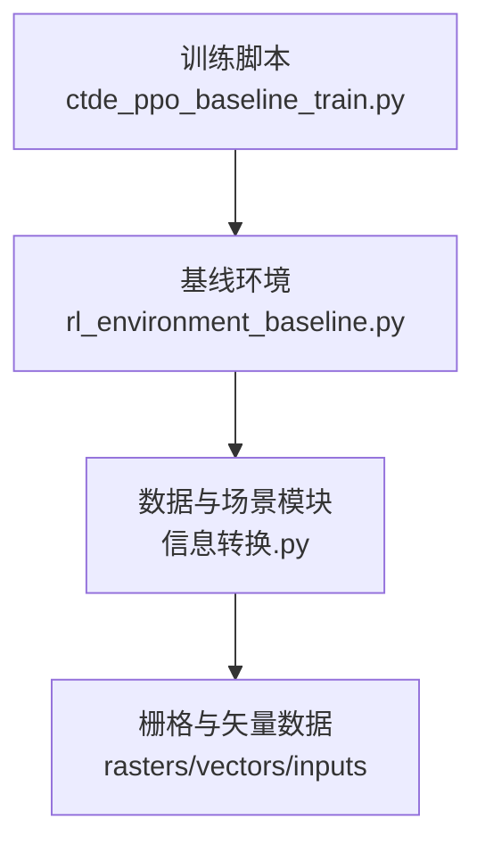
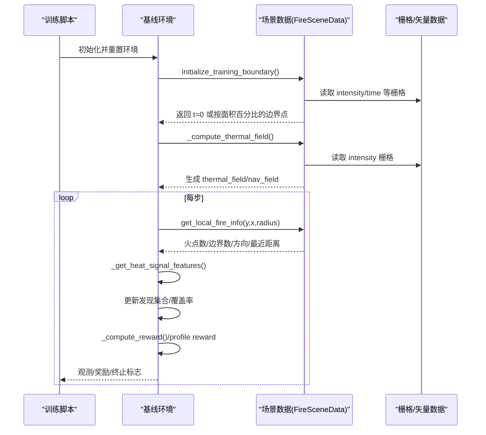
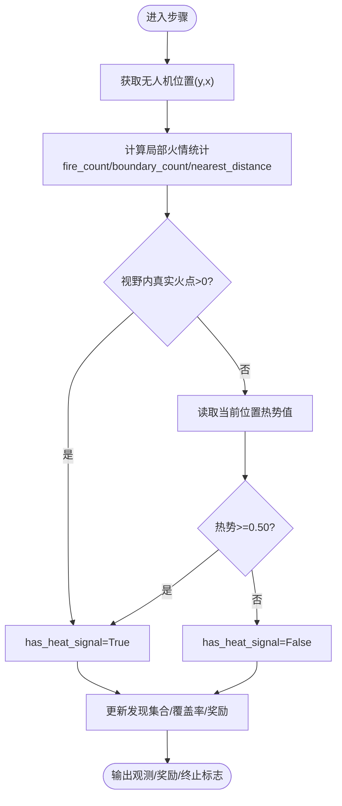
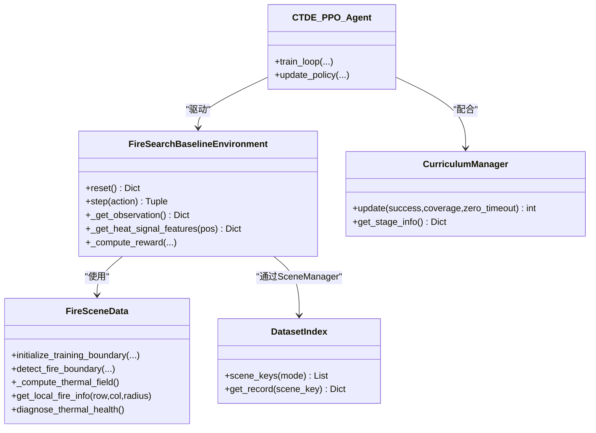

# 热信号分层判定系统

<cite>
**本文引用的文件**   
- [ctde_ppo_baseline_train.py](file://environment_variables/environment_variables/ctde_ppo_baseline_train.py)
- [rl_environment_baseline.py](file://environment_variables/environment_variables/rl_environment_baseline.py)
- [信息转换.py](file://environment_variables/environment_variables/信息转换.py)
</cite>

## 目录
1. [引言](#引言)
2. [项目结构](#项目结构)
3. [核心组件](#核心组件)
4. [架构总览](#架构总览)
5. [详细组件分析](#详细组件分析)
6. [依赖关系分析](#依赖关系分析)
7. [性能与鲁棒性](#性能与鲁棒性)
8. [故障排查指南](#故障排查指南)
9. [结论](#结论)
10. [附录：端到端流程示例](#附录端到端流程示例)

## 引言
本技术文档围绕“热信号分层判定系统”展开，聚焦于传感器可见性检测、热信号阈值策略、综合判断逻辑与误报过滤机制，并结合代码实现解释其在火灾前沿识别中的准确性与鲁棒性提升。系统通过多源栅格数据（强度、蔓延时间、地形、风场等）构建热势场，采用分层判定将“视野内真实火点”和“热势阈值”作为两级证据，结合梯度引导与课程学习，提高在噪声环境下的稳定性与可解释性。

## 项目结构
本项目包含训练脚本、基线环境与数据/场景处理模块：
- 训练脚本：负责CTDE-PPO训练循环、质量评估与课程管理
- 基线环境：封装Gymnasium接口，提供观测、奖励、动作与环境状态维护
- 数据与场景：加载FARSITE场景、计算边界、构建热势场与导航场、诊断健康度

图表来源
- [ctde_ppo_baseline_train.py:1-120](file://environment_variables/environment_variables/ctde_ppo_baseline_train.py#L1-L120)
- [rl_environment_baseline.py:1-120](file://environment_variables/environment_variables/rl_environment_baseline.py#L1-L120)
- [信息转换.py:219-323](file://environment_variables/environment_variables/信息转换.py#L219-L323)

章节来源
- [ctde_ppo_baseline_train.py:1-120](file://environment_variables/environment_variables/ctde_ppo_baseline_train.py#L1-L120)
- [rl_environment_baseline.py:1-120](file://environment_variables/environment_variables/rl_environment_baseline.py#L1-L120)
- [信息转换.py:219-323](file://environment_variables/environment_variables/信息转换.py#L219-L323)

## 核心组件
- 数据与场景层（信息转换.py）
  - 场景索引与路径解析
  - 栅格加载、归一化参数推导
  - 火边界提取、热势场与导航场构建
  - 局部火情统计、风向影响、健康诊断
- 环境层（rl_environment_baseline.py）
  - Gymnasium接口：reset/step
  - 观测构造（本地观测+全局状态）
  - 分层热信号判定与奖励设计
- 训练层（ctde_ppo_baseline_train.py）
  - CTDE-PPO智能体、回放缓冲、网络结构
  - 课程管理器（阶段推进、目标退火）
  - 模型质量指标与收敛效率度量

章节来源
- [信息转换.py:219-323](file://environment_variables/environment_variables/信息转换.py#L219-L323)
- [rl_environment_baseline.py:21-158](file://environment_variables/environment_variables/rl_environment_baseline.py#L21-L158)
- [ctde_ppo_baseline_train.py:460-535](file://environment_variables/environment_variables/ctde_ppo_baseline_train.py#L460-L535)

## 架构总览
下图展示从原始栅格到热信号分层的完整链路：数据加载→边界提取→热势场构建→局部统计→分层判定→决策与奖励。

图表来源
- [rl_environment_baseline.py:159-188](file://environment_variables/environment_variables/rl_environment_baseline.py#L159-L188)
- [信息转换.py:821-887](file://environment_variables/environment_variables/信息转换.py#L821-L887)
- [信息转换.py:759-819](file://environment_variables/environment_variables/信息转换.py#L759-L819)
- [rl_environment_baseline.py:671-690](file://environment_variables/environment_variables/rl_environment_baseline.py#L671-L690)

## 详细组件分析

### 传感器可见性检测机制
- 圆形视野窗口
  - 基于无人机位置与视觉半径构建圆形掩码，仅统计圆内像素，避免矩形裁剪带来的偏差。
- 距离衰减模型
  - 使用圆形掩码等价于对视野内像素进行均匀权重；同时通过“最近火点距离”特征为策略提供距离先验，便于在低热势区保持探索。
- 角度遮挡判断
  - 当前实现未引入DEM高程遮挡射线追踪；但通过“坡度/坡向/DEM归一化”等静态地形特征进入观测空间，间接帮助策略规避不利地形。
- 地形影响考虑
  - DEM、坡度、坡向、燃料模型、冠层覆盖/高度/密度等静态地形与植被特征被纳入观测，用于增强对复杂地形的鲁棒性。

章节来源
- [rl_environment_baseline.py:259-267](file://environment_variables/environment_variables/rl_environment_baseline.py#L259-L267)
- [rl_environment_baseline.py:521-532](file://environment_variables/environment_variables/rl_environment_baseline.py#L521-L532)
- [rl_environment_baseline.py:565-611](file://environment_variables/environment_variables/rl_environment_baseline.py#L565-L611)

### 热信号阈值设置策略
- 全局阈值
  - 火点二值化阈值来自场景归一化参数 fire_threshold，默认值为1.0，用于快速定位火区。
- 自适应阈值
  - 热势场采用“场景级稳健归一化”：以高斯模糊后的强度图在正样本上的第99百分位作为参考，再clip至[0,1]，使不同场景的热势语义一致。
- 动态阈值调节
  - 分层判定中，当视野内存在真实火点时直接触发“有热信号”，否则需要当前位置热势≥0.50才判定为有信号。该双轨机制在噪声下更稳健。

章节来源
- [信息转换.py:559-602](file://environment_variables/environment_variables/信息转换.py#L559-L602)
- [信息转换.py:759-819](file://environment_variables/environment_variables/信息转换.py#L759-L819)
- [rl_environment_baseline.py:671-690](file://environment_variables/environment_variables/rl_environment_baseline.py#L671-L690)

### 综合判断逻辑与误报过滤
- 多源信息融合
  - 本地观测融合：位置、电池、强度、风向、DEM/坡度、热梯度、相机朝向、动态前缘统计、风险严重度等。
  - 全局状态融合：覆盖率、平均/最低电量、团队质心与分散、距火平均距离、步数进度、已访问比例、课程阶段、平均风速/海拔、未发现密度等。
- 置信度评估
  - 通过“视野内真实火点计数”与“热势阈值”双重证据形成置信度；同时利用“最近火点距离”“边界计数”“平均/最大强度”辅助判别。
- 误报过滤机制
  - 仅在视野内统计（圆形掩码），避免边缘效应；
  - 热势场经高斯平滑与稳健归一化，抑制局部噪声；
  - 分层判定要求“真实火点或热势足够强”二者之一成立，降低单一指标波动导致的误报。

章节来源
- [rl_environment_baseline.py:565-658](file://environment_variables/environment_variables/rl_environment_baseline.py#L565-L658)
- [信息转换.py:1070-1123](file://environment_variables/environment_variables/信息转换.py#L1070-L1123)
- [信息转换.py:759-819](file://environment_variables/environment_variables/信息转换.py#L759-L819)

### 分层判定算法流程

图表来源
- [rl_environment_baseline.py:671-690](file://environment_variables/environment_variables/rl_environment_baseline.py#L671-L690)
- [信息转换.py:1070-1123](file://environment_variables/environment_variables/信息转换.py#L1070-L1123)

章节来源
- [rl_environment_baseline.py:671-690](file://environment_variables/environment_variables/rl_environment_baseline.py#L671-L690)

### 面向对象类关系图

图表来源
- [rl_environment_baseline.py:21-158](file://environment_variables/environment_variables/rl_environment_baseline.py#L21-L158)
- [信息转换.py:219-323](file://environment_variables/environment_variables/信息转换.py#L219-L323)
- [ctde_ppo_baseline_train.py:569-757](file://environment_variables/environment_variables/ctde_ppo_baseline_train.py#L569-L757)
- [ctde_ppo_baseline_train.py:759-800](file://environment_variables/environment_variables/ctde_ppo_baseline_train.py#L759-L800)

章节来源
- [rl_environment_baseline.py:21-158](file://environment_variables/environment_variables/rl_environment_baseline.py#L21-L158)
- [信息转换.py:219-323](file://environment_variables/environment_variables/信息转换.py#L219-L323)
- [ctde_ppo_baseline_train.py:569-757](file://environment_variables/environment_variables/ctde_ppo_baseline_train.py#L569-L757)
- [ctde_ppo_baseline_train.py:759-800](file://environment_variables/environment_variables/ctde_ppo_baseline_train.py#L759-L800)

## 依赖关系分析
- 训练脚本依赖环境接口，环境依赖场景数据模块；场景数据模块依赖栅格/矢量输入与元数据。
- 关键耦合点：
  - 环境对场景数据的调用集中在边界初始化、热势场计算、局部火情统计与健康诊断。
  - 训练脚本的课程管理与质量评估依赖环境的统计量（成功率、覆盖率、超时率）。

图表来源
- [ctde_ppo_baseline_train.py:1-120](file://environment_variables/environment_variables/ctde_ppo_baseline_train.py#L1-L120)
- [rl_environment_baseline.py:1-120](file://environment_variables/environment_variables/rl_environment_baseline.py#L1-L120)
- [信息转换.py:370-390](file://environment_variables/environment_variables/信息转换.py#L370-L390)

章节来源
- [ctde_ppo_baseline_train.py:1-120](file://environment_variables/environment_variables/ctde_ppo_baseline_train.py#L1-L120)
- [rl_environment_baseline.py:1-120](file://environment_variables/environment_variables/rl_environment_baseline.py#L1-L120)
- [信息转换.py:370-390](file://environment_variables/environment_variables/信息转换.py#L370-L390)

## 性能与鲁棒性
- 热势场稳健性
  - 高斯模糊与p99参考值归一化有效抑制局部噪声与极端值，保证跨场景一致性。
- 分层判定的优势
  - “真实火点优先”确保在可见区域内的高置信度；“热势阈值”在不可见区域提供弱引导，减少漏检。
- 梯度引导
  - 基于log压缩的导航场计算局部梯度，避免高值区梯度消失，利于早期搜索。
- 课程学习
  - 三阶段课程逐步提升难度（初始面积百分比、near_prob退火、目标覆盖率），提升收敛速度与最终性能。

章节来源
- [信息转换.py:759-819](file://environment_variables/environment_variables/信息转换.py#L759-L819)
- [信息转换.py:933-970](file://environment_variables/environment_variables/信息转换.py#L933-L970)
- [ctde_ppo_baseline_train.py:569-757](file://environment_variables/environment_variables/ctde_ppo_baseline_train.py#L569-L757)

## 故障排查指南
- 热场健康诊断
  - 检查饱和比例、高热区零梯度比例、非零比例与分位数，确认热势场语义正常。
- 常见错误
  - 栅格缺失或形状不匹配：需核对static_map与各raster尺寸一致。
  - 风场形状不一致：检查wind_speed与wind_direction是否对齐网格。
  - 无效场景：t=0边界为空时应停止训练而非回退到终态边界。
- 建议操作
  - 运行诊断函数，若sat_ratio过高或zero_grad_in_high_ratio异常，检查强度栅格与归一化参数。
  - 若边界点为空，检查time栅格与阈值配置。

章节来源
- [信息转换.py:972-1012](file://environment_variables/environment_variables/信息转换.py#L972-L1012)
- [信息转换.py:639-682](file://environment_variables/environment_variables/信息转换.py#L639-L682)
- [信息转换.py:684-696](file://environment_variables/environment_variables/信息转换.py#L684-L696)

## 结论
本系统通过“真实火点可见性+热势阈值”的分层判定，结合稳健热势场与梯度引导，显著提升了火灾前沿识别的准确性与鲁棒性。课程学习与多源观测融合进一步增强了在噪声与复杂地形下的稳定性。建议在部署前执行热场健康诊断，并根据场景调整fire_threshold与near_prob退火策略。

## 附录：端到端流程示例
以下以“单步检测”为例，展示从原始观测到分类决策的关键路径（以源码路径代替具体代码内容）：
- 场景初始化与边界选择
  - [initialize_training_boundary:698-721](file://environment_variables/environment_variables/信息转换.py#L698-L721)
  - [detect_fire_boundary:821-887](file://environment_variables/environment_variables/信息转换.py#L821-L887)
- 热势场构建
  - [_compute_thermal_field:759-819](file://environment_variables/environment_variables/信息转换.py#L759-L819)
- 环境观测与分层判定
  - [_get_heat_signal_features:671-690](file://environment_variables/environment_variables/rl_environment_baseline.py#L671-L690)
  - [get_local_fire_info:1070-1123](file://environment_variables/environment_variables/信息转换.py#L1070-L1123)
- 奖励与终止
  - [_compute_reward:692-767](file://environment_variables/environment_variables/rl_environment_baseline.py#L692-L767)
  - [_timeout_terminal_penalty:241-251](file://environment_variables/environment_variables/rl_environment_baseline.py#L241-L251)

章节来源
- [信息转换.py:698-721](file://environment_variables/environment_variables/信息转换.py#L698-L721)
- [信息转换.py:821-887](file://environment_variables/environment_variables/信息转换.py#L821-L887)
- [信息转换.py:759-819](file://environment_variables/environment_variables/信息转换.py#L759-L819)
- [rl_environment_baseline.py:671-690](file://environment_variables/environment_variables/rl_environment_baseline.py#L671-L690)
- [rl_environment_baseline.py:692-767](file://environment_variables/environment_variables/rl_environment_baseline.py#L692-L767)
- [rl_environment_baseline.py:241-251](file://environment_variables/environment_variables/rl_environment_baseline.py#L241-L251)