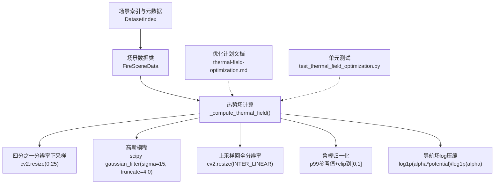
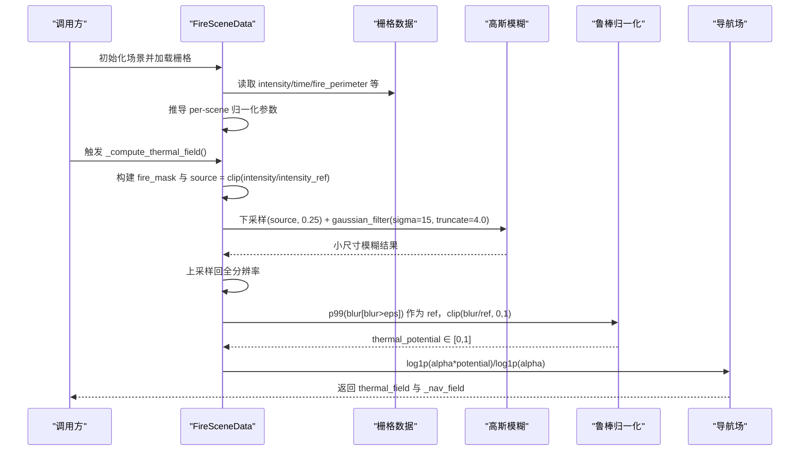
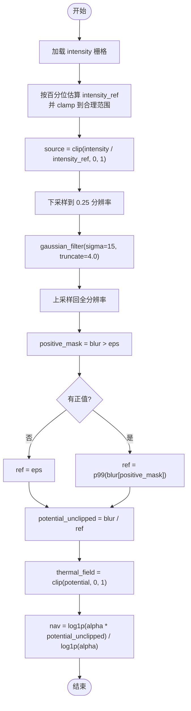
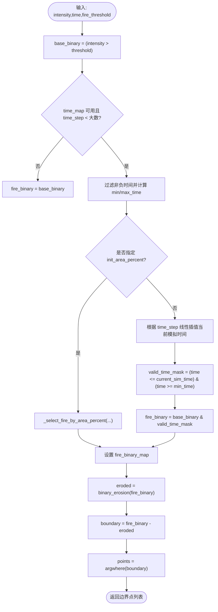
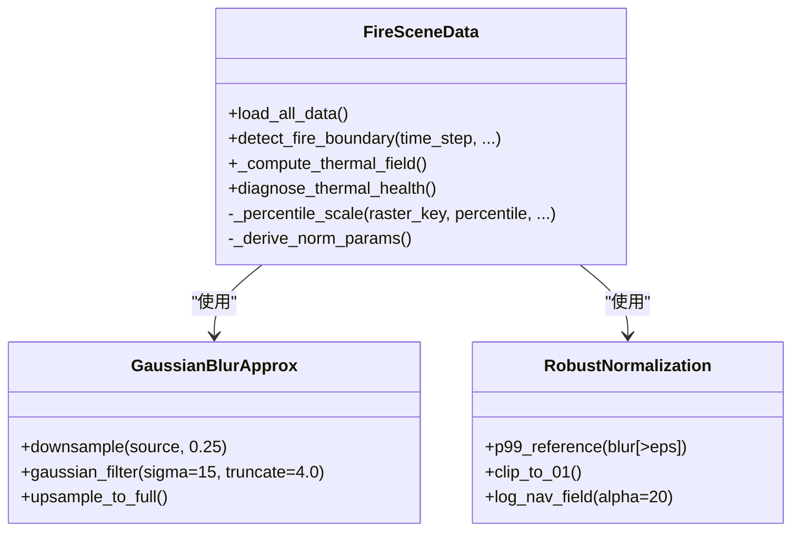
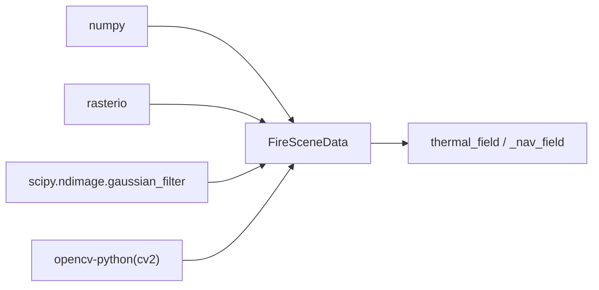

# 热势值计算系统

<cite>
**本文引用的文件**   
- [信息转换.py](file://environment_variables/environment_variables/信息转换.py)
- [2026-07-06-thermal-field-optimization.md](file://docs/superpowers/plans/2026-07-06-thermal-field-optimization.md)
- [test_thermal_field_optimization.py](file://environment_variables/environment_variables/test_thermal_field_optimization.py)
</cite>

## 目录
1. [简介](#简介)
2. [项目结构](#项目结构)
3. [核心组件](#核心组件)
4. [架构总览](#架构总览)
5. [详细组件分析](#详细组件分析)
6. [依赖关系分析](#依赖关系分析)
7. [性能与数值稳定性](#性能与数值稳定性)
8. [故障排查指南](#故障排查指南)
9. [结论](#结论)
10. [附录：端到端流程示例路径](#附录端到端流程示例路径)

## 简介
本技术文档围绕“热势值计算系统”的实现与原理展开，重点解释以下方面：
- 基于四分之一分辨率高斯模糊近似的热势值计算方法
- 强度图归一化策略、边界掩码处理与数值稳定性保证
- 每场景鲁棒归一化流程（强度参考值、百分位数统计、动态范围调整）
- 高斯模糊卷积核设计（sigma、截断因子、边界效应）
- 完整计算流程的代码级路径指引（数据预处理、模糊运算、后处理）
- 热势值在[0,1]范围的语义含义及其在强化学习中的作用

## 项目结构
与热势值计算直接相关的代码集中在环境数据模块中，包含场景加载、栅格归一化、火场边界提取、热势场构建与诊断等。优化计划文档说明了低分辨率模糊与缓存策略的演进。测试用例覆盖了输出范围、不同掩码产生不同结果以及梯度健康检查。

图表来源
- [信息转换.py:759-819](file://environment_variables/environment_variables/信息转换.py#L759-L819)
- [2026-07-06-thermal-field-optimization.md:41-73](file://docs/superpowers/plans/2026-07-06-thermal-field-optimization.md#L41-L73)
- [test_thermal_field_optimization.py:25-66](file://environment_variables/environment_variables/test_thermal_field_optimization.py#L25-L66)

章节来源
- [信息转换.py:219-322](file://environment_variables/environment_variables/信息转换.py#L219-L322)
- [信息转换.py:759-819](file://environment_variables/environment_variables/信息转换.py#L759-L819)
- [2026-07-06-thermal-field-optimization.md:1-142](file://docs/superpowers/plans/2026-07-06-thermal-field-optimization.md#L1-L142)
- [test_thermal_field_optimization.py:1-70](file://environment_variables/environment_variables/test_thermal_field_optimization.py#L1-L70)

## 核心组件
- 场景索引与记录解析：负责从数据集索引加载场景元数据、栅格路径与静态地图，并校验必需文件存在性。
- 场景数据类：封装栅格读取、风场与地形字段构造、归一化参数推导、火场边界检测、热势场计算与健康诊断。
- 热势场计算：以四分之一的分辨率进行高斯模糊近似，再上采样回原分辨率；采用每场景鲁棒归一化将结果映射至[0,1]；同时生成用于梯度的对数压缩导航场。
- 诊断与测试：提供热场健康指标与单元测试，确保输出范围、梯度可用性与不同掩码的可区分性。

章节来源
- [信息转换.py:20-196](file://environment_variables/environment_variables/信息转换.py#L20-L196)
- [信息转换.py:219-322](file://environment_variables/environment_variables/信息转换.py#L219-L322)
- [信息转换.py:759-819](file://environment_variables/environment_variables/信息转换.py#L759-L819)
- [信息转换.py:972-1012](file://environment_variables/environment_variables/信息转换.py#L972-L1012)
- [test_thermal_field_optimization.py:25-66](file://environment_variables/environment_variables/test_thermal_field_optimization.py#L25-L66)

## 架构总览
下图展示了热势值计算的端到端流程，包括数据准备、归一化、模糊、上采样、鲁棒归一化与导航场生成。

图表来源
- [信息转换.py:759-819](file://environment_variables/environment_variables/信息转换.py#L759-L819)
- [信息转换.py:559-602](file://environment_variables/environment_variables/信息转换.py#L559-L602)

## 详细组件分析

### 每场景鲁棒归一化流程
- 强度参考值计算：使用场景内 intensity 的正值样本，按百分位（默认99%）估计 scale，并通过 clamp_range 限制上下界，避免极端值影响。
- 动态范围调整：将 intensity 除以 intensity_ref 并裁剪到[0,1]，得到 source 强度图。
- 百分位数统计：在模糊后的正区域上取99分位数作为 ref，进一步将 blur_full 归一化为 potential ∈ [0,1]。
- 数值稳定性：引入 eps 防止除零；对负值做 max(..., 0) 处理；对 ref 做下限保护。

图表来源
- [信息转换.py:759-819](file://environment_variables/environment_variables/信息转换.py#L759-L819)
- [信息转换.py:543-557](file://environment_variables/environment_variables/信息转换.py#LL543-L557)

章节来源
- [信息转换.py:543-602](file://environment_variables/environment_variables/信息转换.py#L543-L602)
- [信息转换.py:759-819](file://environment_variables/environment_variables/信息转换.py#L759-L819)

### 边界掩码处理与火场边界选择
- 初始边界：支持基于时间步或面积百分比选择 t=0 的火场掩码，通过时间阈值或分区选择目标单元格数量，得到 fire_binary_map。
- 活跃前沿：对 fire_binary_map 执行形态学腐蚀，差集得到边界像素集合，供后续可视化与评估使用。
- 边界有效性：若 t=0 无有效边界，则标记场景无效并抛出异常，阻止训练继续。

图表来源
- [信息转换.py:821-887](file://environment_variables/environment_variables/信息转换.py#L821-L887)
- [信息转换.py:723-757](file://environment_variables/environment_variables/信息转换.py#L723-L757)

章节来源
- [信息转换.py:684-721](file://environment_variables/environment_variables/信息转换.py#L684-L721)
- [信息转换.py:723-757](file://environment_variables/environment_variables/信息转换.py#L723-L757)
- [信息转换.py:821-887](file://environment_variables/environment_variables/信息转换.py#L821-L887)

### 高斯模糊卷积核设计与边界效应
- 四分之一分辨率近似：先 downsample 到 0.25 分辨率，再进行高斯模糊，最后 upsample 回原分辨率，显著降低计算量并保持空间平滑特性。
- sigma 与截断因子：sigma=15，truncate=4.0，控制核的有效半径与能量集中程度，兼顾精度与速度。
- 边界效应：上采样采用线性插值；对负值进行钳制；鲁棒归一化中的 eps 与 p99 参考值共同抑制边缘噪声与极值影响。

图表来源
- [信息转换.py:759-819](file://environment_variables/environment_variables/信息转换.py#L759-L819)
- [信息转换.py:543-602](file://environment_variables/environment_variables/信息转换.py#L543-L602)

章节来源
- [信息转换.py:759-819](file://environment_variables/environment_variables/信息转换.py#L759-L819)
- [2026-07-06-thermal-field-optimization.md:41-73](file://docs/superpowers/plans/2026-07-06-thermal-field-optimization.md#L41-L73)

### 热势值的语义含义与在强化学习中的作用
- 语义含义：thermal_field ∈ [0,1] 表示每个网格的热势强度，0 表示无热影响，1 表示该场景下的相对最高热势。
- 导航场：_nav_field 是对 potential 的对数压缩版本，保留梯度信息，避免在高热区出现梯度消失。
- 强化学习作用：
  - 状态特征：thermal_norm 作为状态特征之一，帮助智能体感知危险区域。
  - 奖励塑造：可结合热力分布设计惩罚项，引导智能体远离高热区。
  - 梯度友好：log 压缩导航场为局部梯度计算提供更稳定的信号。

章节来源
- [信息转换.py:815-819](file://environment_variables/environment_variables/信息转换.py#L815-L819)
- [信息转换.py:933-970](file://environment_variables/environment_variables/信息转换.py#L933-L970)
- [信息转换.py:1187-1234](file://environment_variables/environment_variables/信息转换.py#L1187-L1234)

## 依赖关系分析
- 外部库：numpy、rasterio、scipy.ndimage.gaussian_filter、opencv-python(cv2)。
- 内部依赖：场景索引与元数据 → 场景数据类 → 热势场计算 → 诊断与访问接口。

图表来源
- [信息转换.py:1-14](file://environment_variables/environment_variables/信息转换.py#L1-L14)
- [信息转换.py:759-819](file://environment_variables/environment_variables/信息转换.py#L759-L819)

章节来源
- [信息转换.py:1-14](file://environment_variables/environment_variables/信息转换.py#L1-L14)
- [信息转换.py:759-819](file://environment_variables/environment_variables/信息转换.py#L759-L819)

## 性能与数值稳定性
- 性能优化：四分之一分辨率模糊显著减少计算量；计划文档指出在保持输出契约的前提下，实现快速近似与缓存策略。
- 数值稳定性：eps 防除零、p99 参考值抗极值、clamp_range 约束强度参考值范围、负值钳制与 clip 到[0,1]保障输出稳定。
- 梯度可用性：log 压缩导航场缓解高热区梯度饱和问题，诊断工具量化零梯度比例。

章节来源
- [2026-07-06-thermal-field-optimization.md:41-73](file://docs/superpowers/plans/2026-07-06-thermal-field-optimization.md#L41-L73)
- [信息转换.py:759-819](file://environment_variables/environment_variables/信息转换.py#L759-L819)
- [信息转换.py:972-1012](file://environment_variables/environment_variables/信息转换.py#L972-L1012)

## 故障排查指南
- 场景无效：t=0 边界为空时抛出 InvalidSceneError，需检查 metadata、rasters 与矢量文件完整性。
- 缺失栅格：required_file_paths 校验失败会提示具体缺失文件路径。
- 形状不匹配：静态地图与各栅格 shape 不一致会报错，需统一分辨率与投影。
- 热场健康：使用 diagnose_thermal_health 检查饱和比例、非零比例与高热区零梯度比例，必要时调整 alpha 或归一化参数。

章节来源
- [信息转换.py:136-196](file://environment_variables/environment_variables/信息转换.py#L136-L196)
- [信息转换.py:525-533](file://environment_variables/environment_variables/信息转换.py#L525-L533)
- [信息转换.py:972-1012](file://environment_variables/environment_variables/信息转换.py#L972-L1012)

## 结论
该系统通过“四分之一分辨率高斯模糊近似 + 每场景鲁棒归一化 + 对数压缩导航场”的组合，实现了高效、稳定且梯度友好的热势值计算。其输出在[0,1]范围内具有明确的物理语义，可直接用于强化学习的状态表征与奖励设计。单元测试与健康诊断保障了数值正确性与训练稳定性。

## 附录：端到端流程示例路径
以下为关键步骤对应的源码位置，便于读者对照实现细节：
- 场景加载与归一化参数推导
  - [信息转换.py:639-682](file://environment_variables/environment_variables/信息转换.py#L639-L682)
  - [信息转换.py:559-602](file://environment_variables/environment_variables/信息转换.py#L559-L602)
- 火场边界选择与掩码构建
  - [信息转换.py:723-757](file://environment_variables/environment_variables/信息转换.py#L723-L757)
  - [信息转换.py:821-887](file://environment_variables/environment_variables/信息转换.py#L821-L887)
- 热势场计算（四分之一分辨率模糊、鲁棒归一化、导航场）
  - [信息转换.py:759-819](file://environment_variables/environment_variables/信息转换.py#L759-L819)
- 热场健康诊断
  - [信息转换.py:972-1012](file://environment_variables/environment_variables/信息转换.py#L972-L1012)
- 单元测试覆盖要点
  - [test_thermal_field_optimization.py:25-66](file://environment_variables/environment_variables/test_thermal_field_optimization.py#L25-L66)
- 优化计划与低分辨率模糊策略
  - [2026-07-06-thermal-field-optimization.md:41-73](file://docs/superpowers/plans/2026-07-06-thermal-field-optimization.md#L41-L73)