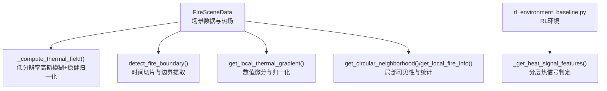
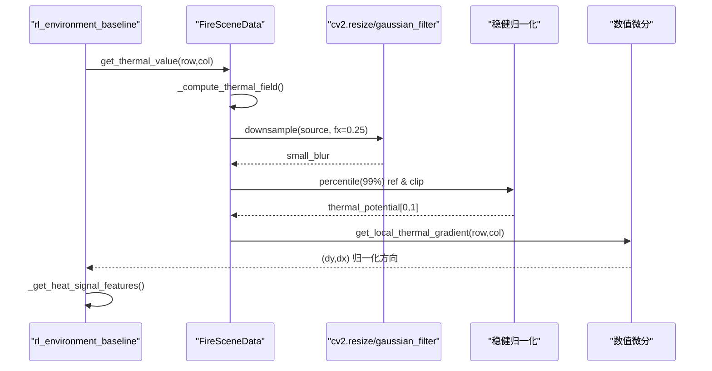
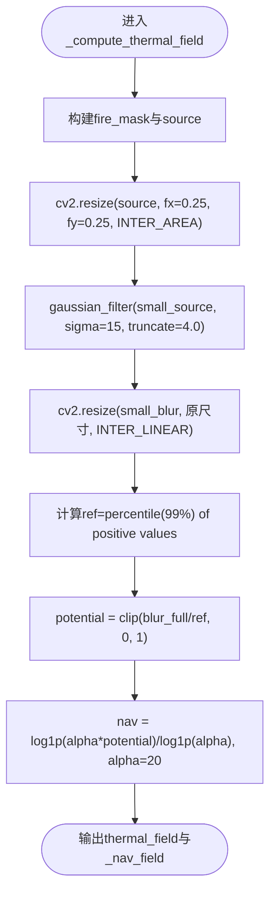
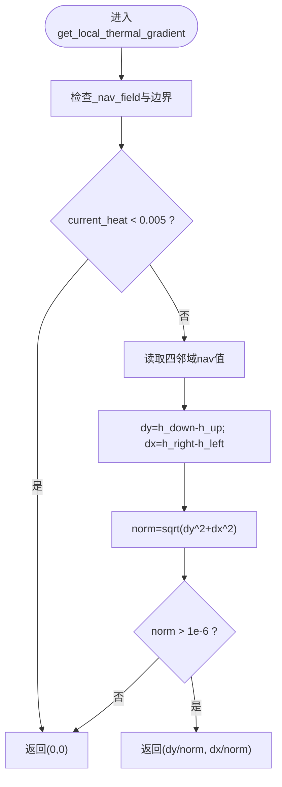
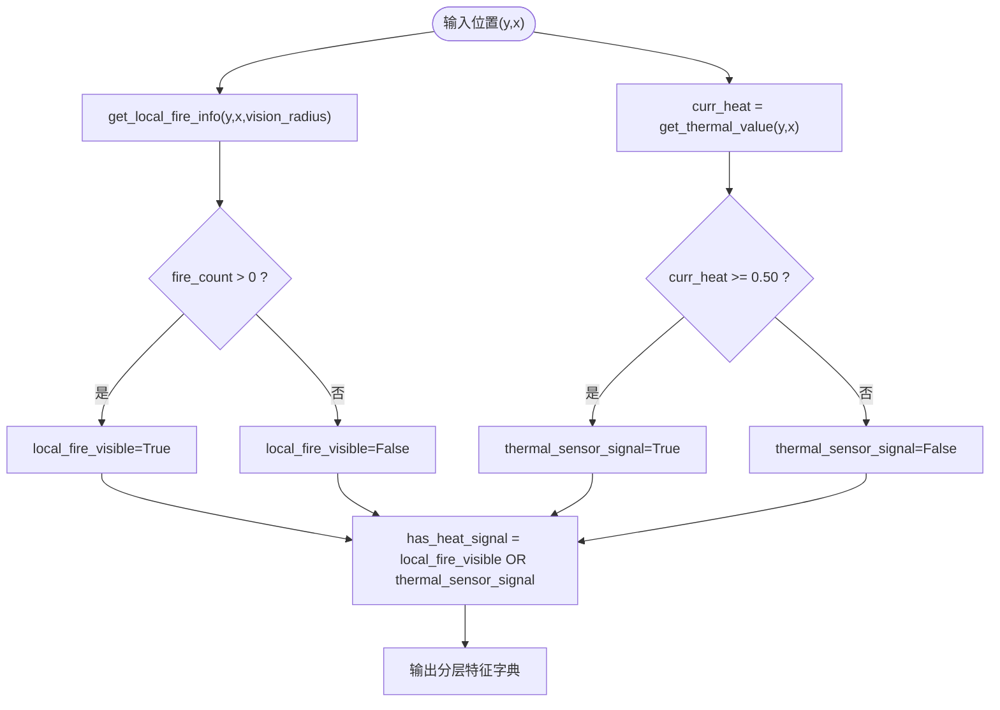
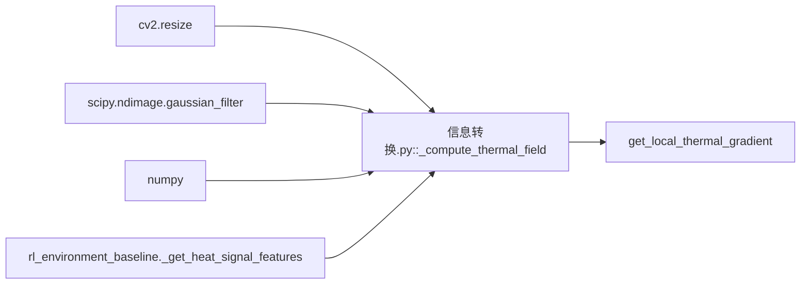

# 热场算法核心

<cite>
**本文引用的文件**   
- [信息转换.py](file://environment_variables/environment_variables/信息转换.py)
- [rl_environment_baseline.py](file://environment_variables/environment_variables/rl_environment_baseline.py)
- [2026-07-06-thermal-field-optimization.md](file://docs/superpowers/plans/2026-07-06-thermal-field-optimization.md)
</cite>

## 目录
1. [引言](#引言)
2. [项目结构](#项目结构)
3. [核心组件](#核心组件)
4. [架构总览](#架构总览)
5. [详细组件分析](#详细组件分析)
6. [依赖关系分析](#依赖关系分析)
7. [性能考量](#性能考量)
8. [故障排查指南](#故障排查指南)
9. [结论](#结论)
10. [附录](#附录)

## 引言
本技术文档聚焦于“热场算法核心”，围绕以下关键主题展开：
- 四分之一分辨率高斯模糊近似算法的数学原理、卷积核设计、边界处理策略与内存优化
- 热势值计算流程，包括强度归一化、距离加权（通过低分辨率平滑实现）和时间衰减（基于时间掩码）
- 热梯度计算算法，包括数值微分实现与方向向量归一化
- 热信号分层判定系统，包括局部可见性检测、传感器阈值设置与综合判断逻辑
- 代码级示例路径与参数配置建议，以及性能调优要点

## 项目结构
与热场算法直接相关的核心实现位于环境数据模块中，主要包含：
- 场景数据加载与标准化
- 火场边界提取与时间切片
- 热势场重建（低分辨率高斯模糊 + 稳健归一化）
- 导航势场（对数压缩）与梯度计算
- 局部邻域特征与热信号分层判定

图表来源
- [信息转换.py:759-819](file://environment_variables/environment_variables/信息转换.py#L759-L819)
- [信息转换.py:821-887](file://environment_variables/environment_variables/信息转换.py#L821-L887)
- [信息转换.py:933-970](file://environment_variables/environment_variables/信息转换.py#L933-L970)
- [rl_environment_baseline.py:671-690](file://environment_variables/environment_variables/rl_environment_baseline.py#L671-L690)

章节来源
- [信息转换.py:219-322](file://environment_variables/environment_variables/信息转换.py#L219-L322)
- [信息转换.py:759-819](file://environment_variables/environment_variables/信息转换.py#L759-L819)
- [信息转换.py:821-887](file://environment_variables/environment_variables/信息转换.py#L821-L887)
- [信息转换.py:933-970](file://environment_variables/environment_variables/信息转换.py#L933-L970)
- [rl_environment_baseline.py:671-690](file://environment_variables/environment_variables/rl_environment_baseline.py#L671-L690)

## 核心组件
- FireSceneData：负责场景栅格数据加载、标准化、火场边界提取、热势场重建、梯度计算与局部邻域特征。
- rl_environment_baseline._get_heat_signal_features：在RL环境中进行热信号分层判定。
- 计划文档：记录了低分辨率滤波与缓存优化的实施步骤与依赖声明。

章节来源
- [信息转换.py:219-322](file://environment_variables/environment_variables/信息转换.py#L219-L322)
- [信息转换.py:759-819](file://environment_variables/environment_variables/信息转换.py#L759-L819)
- [信息转换.py:821-887](file://environment_variables/environment_variables/信息转换.py#L821-L887)
- [信息转换.py:933-970](file://environment_variables/environment_variables/信息转换.py#L933-L970)
- [rl_environment_baseline.py:671-690](file://environment_variables/environment_variables/rl_environment_baseline.py#L671-L690)
- [2026-07-06-thermal-field-optimization.md:41-111](file://docs/superpowers/plans/2026-07-06-thermal-field-optimization.md#L41-L111)

## 架构总览
下图展示了从原始栅格到热势场、再到梯度与热信号判定的整体流程。

图表来源
- [信息转换.py:759-819](file://environment_variables/environment_variables/信息转换.py#L759-L819)
- [信息转换.py:933-970](file://environment_variables/environment_variables/信息转换.py#L933-L970)
- [rl_environment_baseline.py:671-690](file://environment_variables/environment_variables/rl_environment_baseline.py#L671-L690)

## 详细组件分析

### 四分之一分辨率高斯模糊近似算法
该算法以“先降采样再高斯模糊，最后上采样”的方式近似全分辨率的高斯平滑，显著降低计算量并减少内存占用。

- 数学原理
  - 输入源：fire_mask × clip(intensity / intensity_ref, 0, 1)，将强度限制在[0,1]并按火区掩码置零非火区。
  - 降采样：使用INTER_AREA将图像缩小至原尺寸的1/4（fx=fy=0.25），得到small_source。
  - 高斯模糊：在small_source上应用gaussian_filter(sigma=15, truncate=4.0)。sigma控制平滑尺度；truncate控制核截断范围，兼顾精度与速度。
  - 上采样：使用INTER_LINEAR将small_blur放大回原尺寸，得到blur_full。
  - 稳健归一化：取blur_full正值的第99百分位作为参考ref，potential = clip(blur_full / ref, 0, 1)，得到热势场。
  - 导航势场：nav = log1p(alpha * potential) / log1p(alpha)，alpha=20，用于缓解高值区梯度消失。

- 卷积核设计与边界处理
  - 卷积核：标准高斯核，由sigma和truncate共同决定有效半径与权重分布。
  - 边界处理：scipy.ndimage.gaussian_filter默认采用反射边界（reflect），避免边缘突变；cv2.resize在降/上采样时分别采用AREA/LINEAR插值，保持整体能量与趋势稳定。

- 内存优化技术
  - 低分辨率计算：在1/4分辨率上进行高斯模糊，计算复杂度约为全分辨率的1/16。
  - 中间结果复用：仅缓存小图结果，上采样后裁剪为float32，减少峰值内存。
  - 稳健归一化：按场景独立计算ref，避免全局异常值影响。

- 代码示例路径
  - 低分辨率高斯模糊与稳健归一化：[信息转换.py:759-819](file://environment_variables/environment_variables/信息转换.py#L759-L819)
  - 依赖与优化计划说明：[2026-07-06-thermal-field-optimization.md:41-111](file://docs/superpowers/plans/2026-07-06-thermal-field-optimization.md#L41-L111)

图表来源
- [信息转换.py:759-819](file://environment_variables/environment_variables/信息转换.py#L759-L819)

章节来源
- [信息转换.py:759-819](file://environment_variables/environment_variables/信息转换.py#L759-L819)
- [2026-07-06-thermal-field-optimization.md:41-111](file://docs/superpowers/plans/2026-07-06-thermal-field-optimization.md#L41-L111)

### 热势值计算流程
- 温度场插值方法
  - 强度归一化：intensity_map / intensity_ref，其中intensity_ref来自场景稳健估计（如百分位数或max）。
  - 空间插值：降采样与上采样过程分别使用INTER_AREA与INTER_LINEAR，保证能量与趋势一致性。
- 距离加权模型
  - 通过低分辨率高斯模糊实现“距离加权”的空间扩散效应，sigma越大，扩散范围越广。
- 时间衰减函数
  - 基于time_map的时间掩码选择当前时刻的火区，从而引入时间维度的衰减与演化。

- 代码示例路径
  - 强度归一化与时间掩码：[信息转换.py:759-819](file://environment_variables/environment_variables/信息转换.py#L759-L819)、[信息转换.py:821-887](file://environment_variables/environment_variables/信息转换.py#L821-L887)

章节来源
- [信息转换.py:759-819](file://environment_variables/environment_variables/信息转换.py#L759-L819)
- [信息转换.py:821-887](file://environment_variables/environment_variables/信息转换.py#L821-L887)

### 热梯度计算算法
- 数值微分实现
  - 使用中心差分近似：dy = h_down - h_up，dx = h_right - h_left，其中h_*取自nav_field（对数压缩后的导航势场）。
  - 边界处理：越界位置回退到当前位置值，避免索引越界。
- 方向向量归一化处理
  - 计算norm = sqrt(dy^2 + dx^2)，若norm > 1e-6则返回(dy/norm, dx/norm)，否则返回(0,0)。
- 热力阈值过滤
  - 当当前位置热势值小于阈值（例如0.005）时，直接返回零梯度，避免噪声区域产生无效方向。

- 代码示例路径
  - 局部梯度计算与归一化：[信息转换.py:933-970](file://environment_variables/environment_variables/信息转换.py#L933-L970)

图表来源
- [信息转换.py:933-970](file://environment_variables/environment_variables/信息转换.py#L933-L970)

章节来源
- [信息转换.py:933-970](file://environment_variables/environment_variables/信息转换.py#L933-L970)

### 热信号分层判定系统
- 局部可见性检测机制
  - 通过get_circular_neighborhood获取圆形视野内的栅格视图，结合fire_binary_mask或intensity阈值生成local fire mask。
  - 统计fire_count、boundary_count、最近火点距离与火区质心方向等指标。
- 传感器信号阈值设置
  - 传感器信号：当前cell的thermal_potential >= 0.50视为有热信号。
- 综合判断逻辑
  - local_fire_visible：视野内真实火点数 > 0
  - thermal_sensor_signal：当前位置thermal_potential >= 0.50
  - has_heat_signal：以上任一为True

- 代码示例路径
  - 分层热信号判定：[rl_environment_baseline.py:671-690](file://environment_variables/environment_variables/rl_environment_baseline.py#L671-L690)
  - 局部邻域与火信息：[信息转换.py:1014-1123](file://environment_variables/environment_variables/信息转换.py#L1014-L1123)

图表来源
- [rl_environment_baseline.py:671-690](file://environment_variables/environment_variables/rl_environment_baseline.py#L671-L690)
- [信息转换.py:1014-1123](file://environment_variables/environment_variables/信息转换.py#L1014-L1123)

章节来源
- [rl_environment_baseline.py:671-690](file://environment_variables/environment_variables/rl_environment_baseline.py#L671-L690)
- [信息转换.py:1014-1123](file://environment_variables/environment_variables/信息转换.py#L1014-L1123)

## 依赖关系分析
- 外部库
  - cv2：用于resize（降采样/上采样）
  - scipy.ndimage：用于高斯模糊
  - numpy：数组运算与统计
- 内部依赖
  - FireSceneData提供热势场与梯度接口
  - rl_environment_baseline调用上述接口完成分层判定

图表来源
- [信息转换.py:759-819](file://environment_variables/environment_variables/信息转换.py#L759-L819)
- [信息转换.py:933-970](file://environment_variables/environment_variables/信息转换.py#L933-L970)
- [rl_environment_baseline.py:671-690](file://environment_variables/environment_variables/rl_environment_baseline.py#L671-L690)

章节来源
- [信息转换.py:759-819](file://environment_variables/environment_variables/信息转换.py#L759-L819)
- [信息转换.py:933-970](file://environment_variables/environment_variables/信息转换.py#L933-L970)
- [rl_environment_baseline.py:671-690](file://environment_variables/environment_variables/rl_environment_baseline.py#L671-L690)

## 性能考量
- 低分辨率计算：在1/4分辨率上进行高斯模糊，大幅降低计算量与内存占用。
- 稳健归一化：按场景独立计算ref，避免全局异常值导致的热势饱和。
- 梯度稳定性：对数压缩的nav_field缓解高值区梯度消失问题。
- 边界处理：反射边界与线性插值组合，减少边缘伪影。
- 缓存策略：根据计划文档，可考虑对低分辨率结果进行哈希缓存，进一步加速重复调用。

章节来源
- [信息转换.py:759-819](file://environment_variables/environment_variables/信息转换.py#L759-L819)
- [2026-07-06-thermal-field-optimization.md:41-111](file://docs/superpowers/plans/2026-07-06-thermal-field-optimization.md#L41-L111)

## 故障排查指南
- 热场健康诊断
  - 使用diagnose_thermal_health检查热场状态，包括饱和比例、高热区零梯度比例、分位数等指标。
- 常见问题定位
  - 无热场：检查fire_binary_map是否初始化成功
  - 零梯度过多：调整nav_field的alpha或检查高值区分布
  - 边界异常：确认边界处理与插值方式是否符合预期

- 代码示例路径
  - 健康诊断：[信息转换.py:972-1012](file://environment_variables/environment_variables/信息转换.py#L972-L1012)

章节来源
- [信息转换.py:972-1012](file://environment_variables/environment_variables/信息转换.py#L972-L1012)

## 结论
本方案通过“四分之一分辨率高斯模糊近似 + 稳健归一化 + 对数压缩导航势场”的组合，实现了高效且稳定的热势场重建与梯度计算。配合分层热信号判定系统，可在RL环境中提供鲁棒的感知与决策依据。建议在大规模场景中引入缓存策略与自适应参数调节，进一步提升性能与泛化能力。

## 附录
- 参数配置建议
  - sigma：根据地图尺度与火场扩散特性调整，通常10~20之间
  - truncate：控制核截断，推荐3~5
  - alpha：对数压缩系数，常用20左右
  - 热信号阈值：0.50作为传感器触发阈值
- 性能调优建议
  - 优先在低分辨率图上执行高斯模糊
  - 使用稳健归一化避免极端值影响
  - 对nav_field进行梯度诊断，确保高值区仍有可用梯度