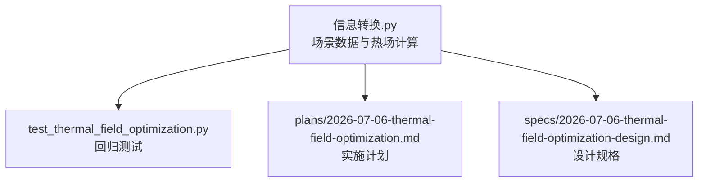
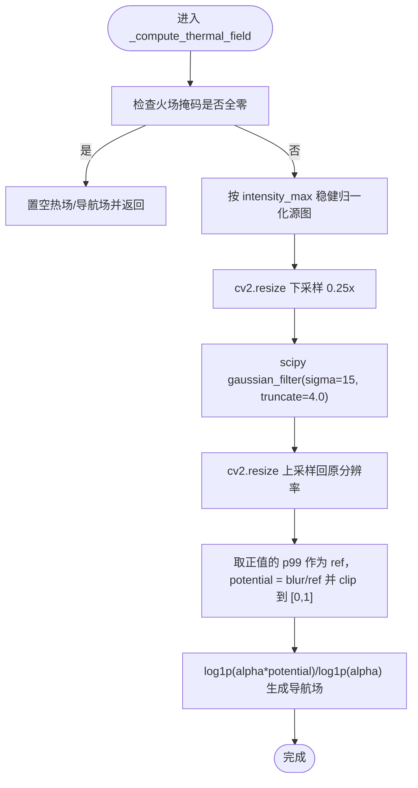
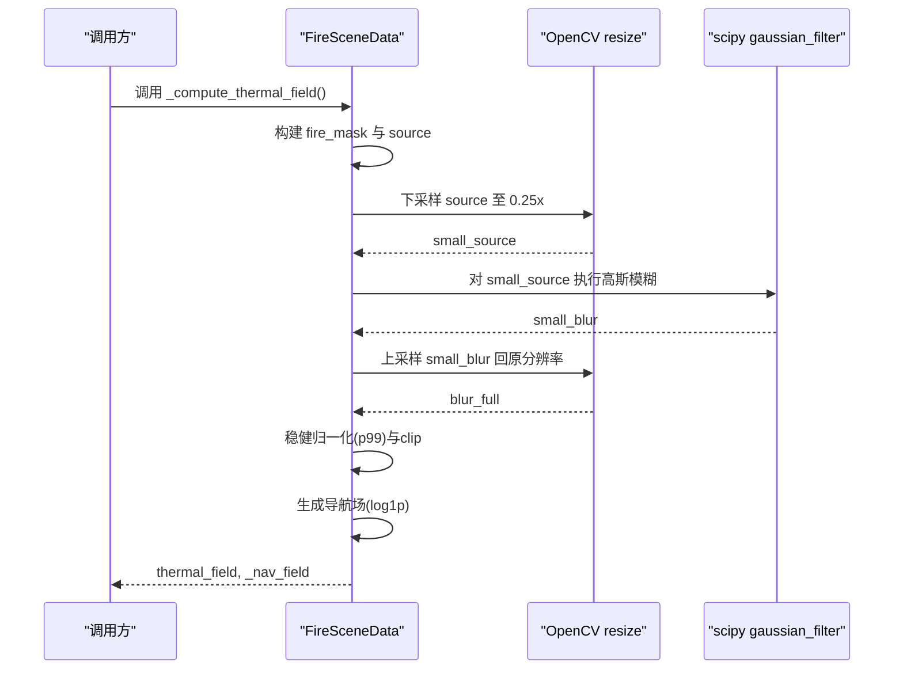
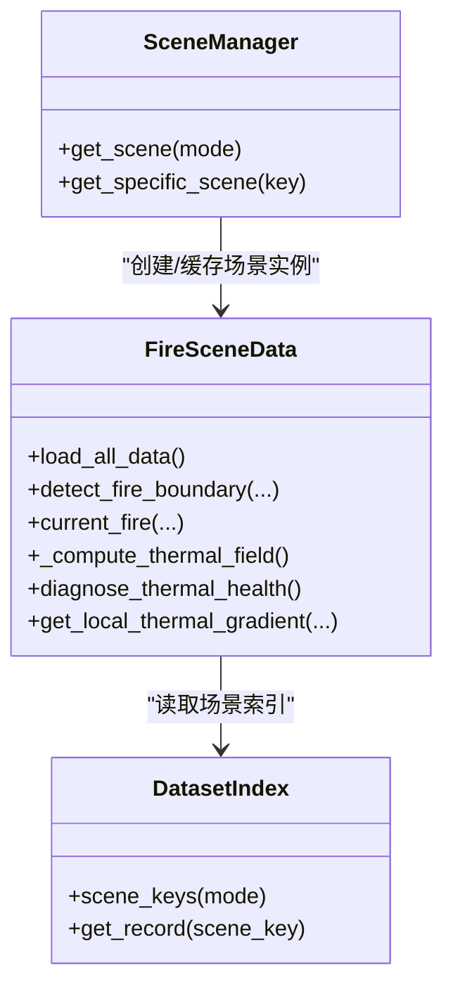

# 热场计算优化技术

<cite>
**本文引用的文件**   
- [信息转换.py](file://environment_variables/environment_variables/信息转换.py)
- [test_thermal_field_optimization.py](file://environment_variables/environment_variables/test_thermal_field_optimization.py)
- [2026-07-06-thermal-field-optimization.md](file://docs/superpowers/plans/2026-07-06-thermal-field-optimization.md)
- [2026-07-06-thermal-field-optimization-design.md](file://docs/superpowers/specs/2026-07-06-thermal-field-optimization-design.md)
</cite>

## 目录
1. [简介](#简介)
2. [项目结构](#项目结构)
3. [核心组件](#核心组件)
4. [架构总览](#架构总览)
5. [详细组件分析](#详细组件分析)
6. [依赖关系分析](#依赖关系分析)
7. [性能与复杂度分析](#性能与复杂度分析)
8. [内存与缓存优化策略](#内存与缓存优化策略)
9. [并行、SIMD与GPU加速建议](#并行simd与gpu加速建议)
10. [大规模地图场景下的适用性与效果](#大规模地图场景下的适用性与效果)
11. [故障排查指南](#故障排查指南)
12. [结论](#结论)

## 简介
本技术文档围绕“热场计算优化”展开，聚焦于在保持输出形状与语义不变的前提下，通过低分辨率滤波、稳健归一化与导航场对数压缩等策略，显著降低高斯模糊的计算成本，同时提升数值稳定性与梯度可用性。文档从系统架构、关键实现路径、数据流与算法复杂度入手，给出面向大规模栅格地图的内存布局、访问模式与缓存设计建议，并补充并行化、SIMD与GPU加速的落地方案与注意事项。

## 项目结构
与热场优化直接相关的代码位于环境变量的数据加载与处理模块中，包含：
- 场景数据类与热场计算主流程
- 单元测试用例用于回归验证
- 计划与设计文档定义优化目标与验收标准

图表来源
- [信息转换.py:759-820](file://environment_variables/environment_variables/信息转换.py#L759-L820)
- [test_thermal_field_optimization.py:25-66](file://environment_variables/environment_variables/test_thermal_field_optimization.py#L25-L66)
- [2026-07-06-thermal-field-optimization.md:1-142](file://docs/superpowers/plans/2026-07-06-thermal-field-optimization.md#L1-L142)
- [2026-07-06-thermal-field-optimization-design.md:1-29](file://docs/superpowers/specs/2026-07-06-thermal-field-optimization-design.md#L1-L29)

章节来源
- [信息转换.py:1-1426](file://environment_variables/environment_variables/信息转换.py#L1-L1426)
- [test_thermal_field_optimization.py:1-70](file://environment_variables/environment_variables/test_thermal_field_optimization.py#L1-L70)
- [2026-07-06-thermal-field-optimization.md:1-142](file://docs/superpowers/plans/2026-07-06-thermal-field-optimization.md#L1-L142)
- [2026-07-06-thermal-field-optimization-design.md:1-29](file://docs/superpowers/specs/2026-07-06-thermal-field-optimization-design.md#L1-L29)

## 核心组件
- FireSceneData：负责场景数据加载、边界检测、热场计算与诊断。热场计算采用“低分辨率高斯模糊 + 稳健归一化 + 对数压缩导航场”的新链路。
- 单元测试：构造合成掩码与强度图，断言热场形状、值域、不同掩码产生不同结果以及健康诊断指标。
- 计划与设计：明确以四分之一分辨率下采样、sigma=15、truncate=4.0、BLAKE2b掩码摘要作为缓存键、输出范围[0,1]等约束。

章节来源
- [信息转换.py:219-322](file://environment_variables/environment_variables/信息转换.py#L219-L322)
- [信息转换.py:759-820](file://environment_variables/environment_variables/信息转换.py#L759-L820)
- [test_thermal_field_optimization.py:25-66](file://environment_variables/environment_variables/test_thermal_field_optimization.py#L25-L66)
- [2026-07-06-thermal-field-optimization-design.md:1-29](file://docs/superpowers/specs/2026-07-06-thermal-field-optimization-design.md#L1-L29)

## 架构总览
下图展示热场计算的端到端流程：输入为二值火场掩码与强度栅格；先按场景进行稳健归一化，再下采样至1/4分辨率，执行高斯模糊后上采样回原分辨率，最后做稳健归一化得到热势场，并生成对数压缩的导航场供梯度使用。

图表来源
- [信息转换.py:759-820](file://environment_variables/environment_variables/信息转换.py#L759-L820)

章节来源
- [信息转换.py:759-820](file://environment_variables/environment_variables/信息转换.py#L759-L820)

## 详细组件分析

### 热场计算主流程（_compute_thermal_field）
- 输入校验：确保已初始化火场掩码；若为空则快速返回零场。
- 稳健归一化：基于场景级 intensity_max 将火区强度裁剪到[0,1]，避免极端值影响。
- 低分辨率滤波：先下采样至1/4分辨率，再以 sigma=15、truncate=4.0 的高斯核模糊，显著减少计算量。
- 上采样与稳健归一化：线性插值回原分辨率，取正值 p99 作为参考值，得到 potential 并裁剪到[0,1]。
- 导航场生成：对 potential 做 log1p 压缩，保留高值区的梯度信息，便于后续局部梯度计算。

图表来源
- [信息转换.py:759-820](file://environment_variables/environment_variables/信息转换.py#L759-L820)

章节来源
- [信息转换.py:759-820](file://environment_variables/environment_variables/信息转换.py#L759-L820)

### 边界检测与当前火场（detect_fire_boundary / current_fire）
- 根据时间步或面积百分比选择初始火场，结合时间栅格生成二值掩码。
- 形态学腐蚀提取活动前沿，记录边界点集合供训练与评估使用。
- current_fire 提供当前时刻的二值火场副本，保证外部修改不影响内部状态。

章节来源
- [信息转换.py:821-887](file://environment_variables/environment_variables/信息转换.py#L821-L887)
- [信息转换.py:892-896](file://environment_variables/environment_variables/信息转换.py#L892-L896)

### 局部邻域与热力梯度（get_circular_neighborhood / get_local_thermal_gradient）
- 圆形邻域切片：按半径截取二维视图，并按圆形掩码置零非邻域区域。
- 局部梯度：基于导航场的差分近似梯度，并对边界做边缘填充，避免越界。
- 梯度方向归一化：当范数足够大时返回单位向量，否则返回零向量，防止数值不稳定。

章节来源
- [信息转换.py:1014-1068](file://environment_variables/environment_variables/信息转换.py#L1014-L1068)
- [信息转换.py:933-970](file://environment_variables/environment_variables/信息转换.py#L933-L970)

### 健康诊断（diagnose_thermal_health）
- 统计饱和比例、高值比例、非零比例与潜在值分位数。
- 在高热区计算梯度范数，统计零梯度占比，辅助判断热场是否退化。

章节来源
- [信息转换.py:972-1012](file://environment_variables/environment_variables/信息转换.py#L972-L1012)

### 单元测试（ThermalFieldOptimizationTest）
- 构造最小场景：仅设置 fire_binary_map、intensity 与 norm_params，不调用磁盘IO。
- 断言输出形状与值域：thermal_field 与 _nav_field 形状一致且值域合理。
- 不同掩码产生不同热场：位置变化应导致结果差异。
- 健康诊断：饱和比例与高热区零梯度比例满足阈值。

章节来源
- [test_thermal_field_optimization.py:25-66](file://environment_variables/environment_variables/test_thermal_field_optimization.py#L25-L66)

## 依赖关系分析
- 第三方库：numpy、rasterio、scipy.ndimage.gaussian_filter、opencv-python(cv2)。
- 模块内依赖：FireSceneData 组合了 DatasetIndex、SceneManager 等工具类；热场计算依赖 cv2.resize 与 scipy 高斯模糊。

图表来源
- [信息转换.py:20-135](file://environment_variables/environment_variables/信息转换.py#L20-L135)
- [信息转换.py:1278-1327](file://environment_variables/environment_variables/信息转换.py#L1278-L1327)
- [信息转换.py:219-322](file://environment_variables/environment_variables/信息转换.py#L219-L322)

章节来源
- [信息转换.py:20-135](file://environment_variables/environment_variables/信息转换.py#L20-L135)
- [信息转换.py:1278-1327](file://environment_variables/environment_variables/信息转换.py#L1278-L1327)
- [信息转换.py:219-322](file://environment_variables/environment_variables/信息转换.py#L219-L322)

## 性能与复杂度分析
- 时间复杂度
  - 原始全分辨率高斯模糊：O(HW·K)，其中 K 为核大小相关常数项。
  - 新方案：先下采样至 H/4×W/4，再进行高斯模糊，随后上采样。整体计算量约为原来的约 1/16，配合稳健归一化与对数压缩，实际冷启动速度可显著提升（计划目标≥20x）。
- 空间复杂度
  - 新增小分辨率中间数组 small_source 与 small_blur，额外占用 O((H/4)(W/4)) 浮点内存。
  - 最终仍输出与原图同形的 thermal_field 与 _nav_field，不改变对外接口。
- 数值稳定性
  - 使用 p99 作为稳健参考值，避免极端峰值主导归一化。
  - 对数压缩导航场缓解高值区梯度消失问题。

章节来源
- [信息转换.py:759-820](file://environment_variables/environment_variables/信息转换.py#L759-L820)
- [2026-07-06-thermal-field-optimization.md:99-136](file://docs/superpowers/plans/2026-07-06-thermal-field-optimization.md#L99-L136)

## 内存与缓存优化策略
- 数组布局与访问模式
  - 使用 np.ascontiguousarray 确保掩码连续存储，利于 cv2.resize 与底层C/C++内核高效访问。
  - 优先行优先顺序遍历与切片，减少跨行跳跃带来的缓存未命中。
- 低分辨率缓存
  - 在小分辨率图上执行高斯模糊，显著降低访存压力与计算量。
  - 可按掩码摘要缓存 small_blur，避免重复计算相同掩码的热场（设计文档提出 BLAKE2b 掩码摘要作为键）。
- 内存池与复用
  - 对小分辨率数组进行重用，避免频繁分配释放导致的碎片化。
  - 对临时视图尽量就地操作，减少中间拷贝。
- 稳健归一化与截断
  - 使用 p99 参考值与 clip 控制值域，避免溢出与数值不稳定。
  - 对负值进行最大为零的处理，保证物理意义与数值稳定。

章节来源
- [信息转换.py:759-820](file://environment_variables/environment_variables/信息转换.py#L759-L820)
- [2026-07-06-thermal-field-optimization-design.md:1-29](file://docs/superpowers/specs/2026-07-06-thermal-field-optimization-design.md#L1-L29)

## 并行、SIMD与GPU加速建议
- 并行计算
  - 多场景批处理：对多个独立场景并行执行 load_all_data 与 _compute_thermal_field，利用进程池或线程池提高吞吐。
  - 网格分块：对超大地图切分为若干 tile，并行计算各 tile 的热场，注意边界重叠区域的平滑拼接。
- SIMD指令
  - NumPy 与 OpenCV 底层通常自动向量化；确保数组连续、类型统一（float32），避免对象数组与混合类型。
  - 谨慎使用 Python 层循环，尽量用向量化函数替代。
- GPU加速
  - 将高斯模糊与 resize 迁移到 CUDA/OpenCL 后端（如 cupy、torch.nn.functional 或 OpenCV CUDA 模块），可进一步降低延迟。
  - 注意主机-设备数据传输开销，适合批量或常驻数据的场景。

[本节为通用性能建议，不直接分析具体源码文件]

## 大规模地图场景下的适用性与效果
- 适用条件
  - 地图尺寸较大（例如数千×数千像素），全分辨率高斯模糊成为瓶颈。
  - 场景间掩码分布多样，但存在重复或相似掩码，适合引入缓存。
- 预期效果
  - 冷启动热场计算速度显著提升（计划目标≥20x）。
  - 输出形状与值域保持不变，下游API无需改动。
  - 数值误差控制在可接受范围内（MAE≤0.5，阈值分歧≤0.2%）。

章节来源
- [2026-07-06-thermal-field-optimization.md:99-136](file://docs/superpowers/plans/2026-07-06-thermal-field-optimization.md#L99-L136)
- [2026-07-06-thermal-field-optimization-design.md:15-24](file://docs/superpowers/specs/2026-07-06-thermal-field-optimization-design.md#L15-L24)

## 故障排查指南
- 常见错误
  - 缺少 intensity 数据：热场计算会抛出运行时异常，需检查数据集完整性。
  - 形状不匹配：wind 字段或其他栅格与静态地图形状不一致，会在加载阶段报错。
  - 无效场景：t=0 边界为空，触发 InvalidSceneError，需调整阈值或面积百分比。
- 诊断方法
  - 使用 diagnose_thermal_health 检查饱和比例、高值比例与零梯度占比。
  - 通过单元测试覆盖基本行为，确保不同掩码产生不同热场。
- 定位步骤
  - 确认 mask 非空且连续。
  - 检查 intensity_ref 与 robust normalization 的参考值是否合理。
  - 观察 small_blur 与 blur_full 的形状与数值范围。

章节来源
- [信息转换.py:759-820](file://environment_variables/environment_variables/信息转换.py#L759-L820)
- [信息转换.py:972-1012](file://environment_variables/environment_variables/信息转换.py#L972-L1012)
- [test_thermal_field_optimization.py:25-66](file://environment_variables/environment_variables/test_thermal_field_optimization.py#L25-L66)

## 结论
通过在低分辨率下进行高斯模糊并结合稳健归一化与对数压缩导航场，热场计算在保持输出契约的同时实现了显著的性能提升与数值稳定性改善。该方案适用于大规模栅格地图场景，具备较好的可扩展性，并可进一步结合并行化、SIMD与GPU加速以获得更高的吞吐与更低的延迟。建议在工程实践中引入掩码摘要缓存与批处理流水线，持续监控健康指标以确保热场质量。