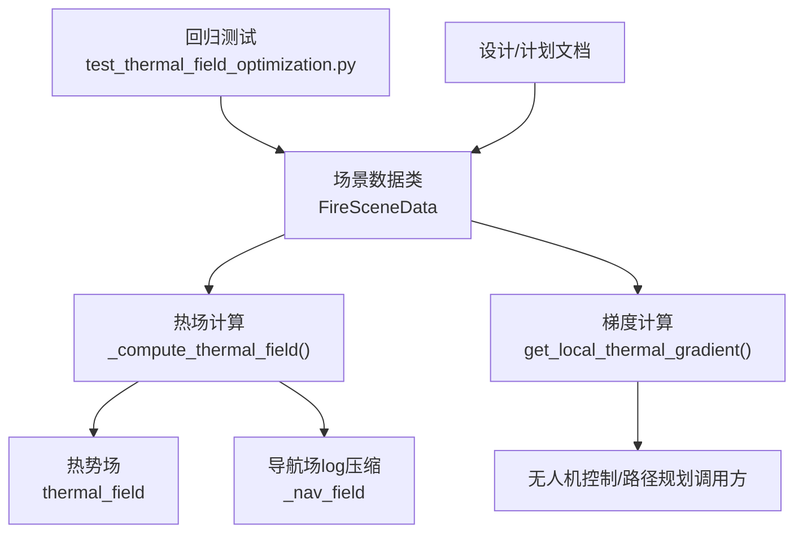
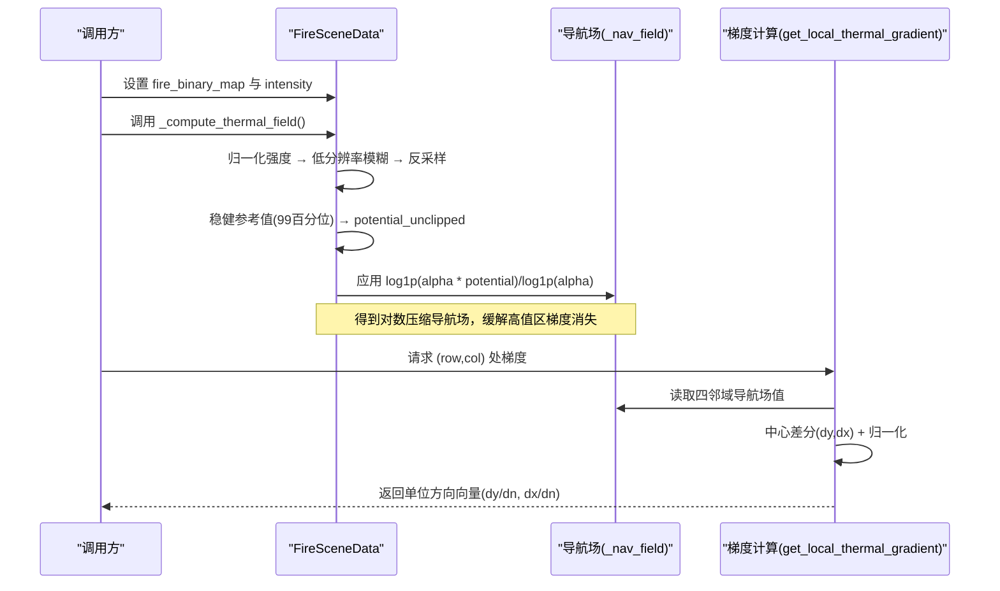
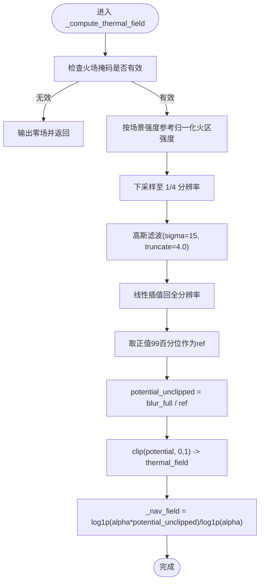
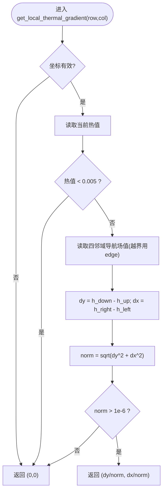
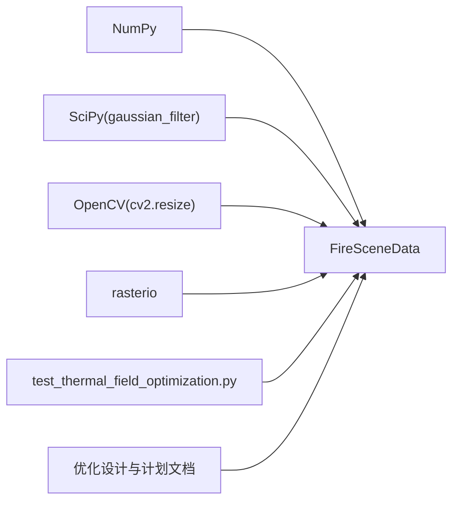

# 热梯度计算算法

<cite>
**本文引用的文件**   
- [信息转换.py](file://environment_variables/environment_variables/信息转换.py)
- [test_thermal_field_optimization.py](file://environment_variables/environment_variables/test_thermal_field_optimization.py)
- [2026-07-06-thermal-field-optimization-design.md](file://docs/superpowers/specs/2026-07-06-thermal-field-optimization-design.md)
- [2026-07-06-thermal-field-optimization.md](file://docs/superpowers/plans/2026-07-06-thermal-field-optimization.md)
</cite>

## 目录
1. [引言](#引言)
2. [项目结构](#项目结构)
3. [核心组件](#核心组件)
4. [架构总览](#架构总览)
5. [详细组件分析](#详细组件分析)
6. [依赖关系分析](#依赖关系分析)
7. [性能考量](#性能考量)
8. [故障排查指南](#故障排查指南)
9. [结论](#结论)
10. [附录](#附录)

## 引言
本技术文档聚焦于“热梯度计算算法”，围绕以下目标展开：
- 解释对数变换导航场的数学原理，包括 log1p 的作用与 alpha 参数调优策略。
- 详细说明热梯度向量的计算方法：数值微分实现、方向向量归一化与边界条件处理。
- 阐述梯度场在无人机路径规划中的应用：梯度下降搜索与局部最优避免机制。
- 提供具体代码示例路径，展示从热势值到导航场的转换公式与梯度计算实现。
- 解释梯度场如何指导无人机向高热力区域移动并避开已燃烧区域。

## 项目结构
与热梯度计算直接相关的核心实现位于环境数据模块中，包含场景加载、热场重建、导航场生成与梯度计算等逻辑；同时配套有回归测试与设计/实施计划文档，用于验证与优化热场计算流程。

图表来源
- [信息转换.py:759-819](file://environment_variables/environment_variables/信息转换.py#L759-L819)
- [信息转换.py:933-970](file://environment_variables/environment_variables/信息转换.py#L933-L970)
- [test_thermal_field_optimization.py:25-66](file://environment_variables/environment_variables/test_thermal_field_optimization.py#L25-L66)
- [2026-07-06-thermal-field-optimization-design.md:1-29](file://docs/superpowers/specs/2026-07-06-thermal-field-optimization-design.md#L1-L29)
- [2026-07-06-thermal-field-optimization.md:1-142](file://docs/superpowers/plans/2026-07-06-thermal-field-optimization.md#L1-L142)

章节来源
- [信息转换.py:759-819](file://environment_variables/environment_variables/信息转换.py#L759-L819)
- [信息转换.py:933-970](file://environment_variables/environment_variables/信息转换.py#L933-L970)
- [test_thermal_field_optimization.py:25-66](file://environment_variables/environment_variables/test_thermal_field_optimization.py#L25-L66)
- [2026-07-06-thermal-field-optimization-design.md:1-29](file://docs/superpowers/specs/2026-07-06-thermal-field-optimization-design.md#L1-L29)
- [2026-07-06-thermal-field-optimization.md:1-142](file://docs/superpowers/plans/2026-07-06-thermal-field-optimization.md#L1-L142)

## 核心组件
- FireSceneData：负责场景数据加载、热场重建、导航场生成与梯度计算。
- _compute_thermal_field：将火场强度图转换为热势场，并进一步构建对数压缩的导航场。
- get_local_thermal_gradient：基于导航场进行中心差分求梯度，并进行方向归一化与边界处理。
- diagnose_thermal_health：诊断热场质量（饱和比例、零梯度比例等），辅助训练前检查。

章节来源
- [信息转换.py:759-819](file://environment_variables/environment_variables/信息转换.py#L759-L819)
- [信息转换.py:933-970](file://environment_variables/environment_variables/信息转换.py#L933-L970)
- [信息转换.py:972-1012](file://environment_variables/environment_variables/信息转换.py#L972-L1012)

## 架构总览
下图展示了热场与导航场的生成流程以及梯度计算的调用关系。

图表来源
- [信息转换.py:759-819](file://environment_variables/environment_variables/信息转换.py#L759-L819)
- [信息转换.py:933-970](file://environment_variables/environment_variables/信息转换.py#L933-L970)

## 详细组件分析

### 热势场与导航场生成（含对数变换）
- 输入准备：以火场二值掩码为支撑，仅对火区内强度进行 per-scene 稳健归一化（除以场景级强度参考值）。
- 空间平滑：先下采样至原图的 1/4，再进行高斯滤波（sigma=15，truncate=4.0），再线性插值回全分辨率，兼顾精度与性能。
- 稳健归一化：取正值的 99 百分位作为参考 ref，potential = blur_full / ref，并将 potential 裁剪到 [0,1] 得到 thermal_field。
- 对数变换导航场：使用 log1p 构造 _nav_field = log1p(alpha * potential_unclipped) / log1p(alpha)，其中 alpha 默认 20.0。该变换在高值区提供更强的梯度信号，缓解饱和导致的梯度消失问题。

图表来源
- [信息转换.py:759-819](file://environment_variables/environment_variables/信息转换.py#L759-L819)

章节来源
- [信息转换.py:759-819](file://environment_variables/environment_variables/信息转换.py#L759-L819)
- [2026-07-06-thermal-field-optimization-design.md:1-29](file://docs/superpowers/specs/2026-07-06-thermal-field-optimization-design.md#L1-L29)
- [2026-07-06-thermal-field-optimization.md:1-142](file://docs/superpowers/plans/2026-07-06-thermal-field-optimization.md#L1-L142)

#### 对数变换与 alpha 调优
- log1p(x) = ln(1+x) 的优势：在 x 接近 0 时近似线性，在大值区增长缓慢，有助于保持梯度可导且避免饱和。
- 作用：将潜在热势 potential_unclipped 映射到导航场，使高热力区域的梯度不至于被截断或消失。
- alpha 调优策略：
  - 增大 alpha：增强高值区的拉伸效果，提升梯度幅度，但可能放大噪声；适合需要更强“爬坡”力的场景。
  - 减小 alpha：更温和的压缩，梯度更平缓，稳定性更好；适合噪声较大或需保守探索的场景。
  - 建议范围：从较小值（如 5~10）逐步上调至 20 左右，结合诊断指标（饱和比例、高热区零梯度比例）选择。

章节来源
- [信息转换.py:815-819](file://environment_variables/environment_variables/信息转换.py#L815-L819)

### 热梯度向量计算（数值微分、归一化与边界）
- 取值来源：梯度计算基于 _nav_field（对数压缩导航场），而非原始 thermal_field，以避免高值区梯度消失。
- 数值微分：采用中心差分，分别计算上下、左右邻域的差值 dy、dx。
- 边界处理：越界位置采用边缘填充（edge）策略，即取当前点自身值，保证函数稳定。
- 归一化：计算范数 norm = sqrt(dy^2 + dx^2)，若大于阈值则返回单位方向向量 (dy/norm, dx/norm)，否则返回零向量。
- 低热力屏蔽：当当前位置热值低于极小阈值时直接返回零向量，避免在无意义区域产生漂移。

图表来源
- [信息转换.py:933-970](file://environment_variables/environment_variables/信息转换.py#L933-L970)

章节来源
- [信息转换.py:933-970](file://environment_variables/environment_variables/信息转换.py#L933-L970)

### 无人机路径规划中的应用
- 梯度下降搜索：在每个时间步，无人机根据当前位置的梯度方向 (dy/dn, dx/dn) 更新航向，沿热势上升方向移动，从而趋向高热力区域。
- 避免已燃烧区域：由于热场仅在火区内部构造，非火区热值为 0，且梯度计算对低热值区域屏蔽，无人机不会主动进入已燃烧区域。
- 局部最优避免机制：
  - 对数变换导航场缓解了高值区梯度消失，减少陷入平坦峰顶的风险。
  - 可在上层策略中加入扰动或随机探索（例如小概率随机方向），配合梯度方向形成混合策略，跳出局部次优点。
  - 结合地形、风向等特征进行奖励或代价调节，引导无人机在安全区域内搜索。

章节来源
- [信息转换.py:933-970](file://environment_variables/environment_variables/信息转换.py#L933-L970)
- [信息转换.py:972-1012](file://environment_variables/environment_variables/信息转换.py#L972-L1012)

### 代码示例路径（不展示源码内容）
- 热势场与导航场生成：[信息转换.py:759-819](file://environment_variables/environment_variables/信息转换.py#L759-L819)
- 梯度计算实现：[信息转换.py:933-970](file://environment_variables/environment_variables/信息转换.py#L933-L970)
- 健康诊断（饱和比例、零梯度比例）：[信息转换.py:972-1012](file://environment_variables/environment_variables/信息转换.py#L972-L1012)
- 回归测试（形状、范围、不同掩码差异、无饱和与梯度存在）：[test_thermal_field_optimization.py:25-66](file://environment_variables/environment_variables/test_thermal_field_optimization.py#L25-L66)

章节来源
- [信息转换.py:759-819](file://environment_variables/environment_variables/信息转换.py#L759-L819)
- [信息转换.py:933-970](file://environment_variables/environment_variables/信息转换.py#L933-L970)
- [信息转换.py:972-1012](file://environment_variables/environment_variables/信息转换.py#L972-L1012)
- [test_thermal_field_optimization.py:25-66](file://environment_variables/environment_variables/test_thermal_field_optimization.py#L25-L66)

## 依赖关系分析
- 外部库：NumPy、SciPy（高斯滤波）、OpenCV（下采样/上采样）、rasterio（栅格读写）。
- 模块内依赖：FireSceneData 聚合了热场与导航场计算，并提供梯度接口供上层环境或控制器调用。
- 测试与文档：回归测试验证输出形状、范围与梯度存在性；设计与计划文档说明优化策略与验收标准。

图表来源
- [信息转换.py:1-14](file://environment_variables/environment_variables/信息转换.py#L1-L14)
- [test_thermal_field_optimization.py:1-23](file://environment_variables/environment_variables/test_thermal_field_optimization.py#L1-L23)
- [2026-07-06-thermal-field-optimization-design.md:1-29](file://docs/superpowers/specs/2026-07-06-thermal-field-optimization-design.md#L1-L29)
- [2026-07-06-thermal-field-optimization.md:1-142](file://docs/superpowers/plans/2026-07-06-thermal-field-optimization.md#L1-L142)

章节来源
- [信息转换.py:1-14](file://environment_variables/environment_variables/信息转换.py#L1-L14)
- [test_thermal_field_optimization.py:1-23](file://environment_variables/environment_variables/test_thermal_field_optimization.py#L1-L23)
- [2026-07-06-thermal-field-optimization-design.md:1-29](file://docs/superpowers/specs/2026-07-06-thermal-field-optimization-design.md#L1-L29)
- [2026-07-06-thermal-field-optimization.md:1-142](file://docs/superpowers/plans/2026-07-06-thermal-field-optimization.md#L1-L142)

## 性能考量
- 低分辨率滤波：先下采样至 1/4，再高斯滤波，最后上采样回原分辨率，显著降低计算量。
- 缓存策略：依据精确的二进制掩码哈希作为缓存键，避免相同掩码重复计算；不同位置的等计数掩码不再共享缓存项。
- 验收指标：冷启动热场计算至少 20 倍加速；与原全分辨率实现的 MAE ≤ 0.5，阈值不一致率 ≤ 0.2%。

章节来源
- [2026-07-06-thermal-field-optimization-design.md:1-29](file://docs/superpowers/specs/2026-07-06-thermal-field-optimization-design.md#L1-L29)
- [2026-07-06-thermal-field-optimization.md:1-142](file://docs/superpowers/plans/2026-07-06-thermal-field-optimization.md#L1-L142)

## 故障排查指南
- 常见错误：
  - 未初始化火场二值掩码：抛出运行时异常，提示无法计算热场。
  - 缺失强度数据：抛出运行时异常，提示缺少 intensity。
- 诊断指标：
  - 饱和比例：热场接近上限的比例，过高说明潜在值分布不合理或 alpha 过大。
  - 高热区零梯度比例：反映高热力区域是否存在梯度消失，应控制在较低水平。
  - 非零比例与分位数：评估热场覆盖与分布情况。
- 定位步骤：
  - 确认 fire_binary_map 与 intensity 已正确加载。
  - 运行健康诊断，检查各项指标是否在合理范围。
  - 调整 alpha 或 sigma 等参数，观察诊断指标变化。

章节来源
- [信息转换.py:759-819](file://environment_variables/environment_variables/信息转换.py#L759-L819)
- [信息转换.py:972-1012](file://environment_variables/environment_variables/信息转换.py#L972-L1012)

## 结论
通过对数变换导航场与稳健热势归一化，热梯度计算在保持语义一致性的同时显著提升了梯度质量与鲁棒性。低分辨率滤波与可靠缓存策略在保证精度的前提下大幅提高了计算效率。结合梯度下降搜索与适当的局部最优避免机制，该算法可有效指导无人机向高热力区域移动并避开已燃烧区域，适用于动态火场环境下的路径规划任务。

## 附录
- 关键方法路径：
  - 热场与导航场生成：[信息转换.py:759-819](file://environment_variables/environment_variables/信息转换.py#L759-L819)
  - 梯度计算：[信息转换.py:933-970](file://environment_variables/environment_variables/信息转换.py#L933-L970)
  - 健康诊断：[信息转换.py:972-1012](file://environment_variables/environment_variables/信息转换.py#L972-L1012)
  - 回归测试：[test_thermal_field_optimization.py:25-66](file://environment_variables/environment_variables/test_thermal_field_optimization.py#L25-L66)
- 优化设计与计划：
  - 设计文档：[2026-07-06-thermal-field-optimization-design.md:1-29](file://docs/superpowers/specs/2026-07-06-thermal-field-optimization-design.md#L1-L29)
  - 实施计划：[2026-07-06-thermal-field-optimization.md:1-142](file://docs/superpowers/plans/2026-07-06-thermal-field-optimization.md#L1-L142)