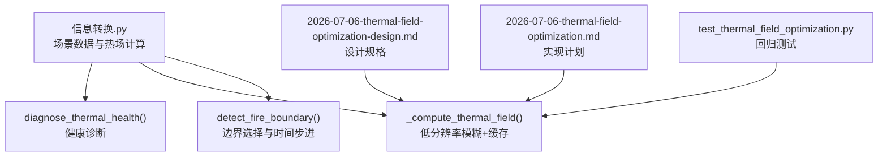
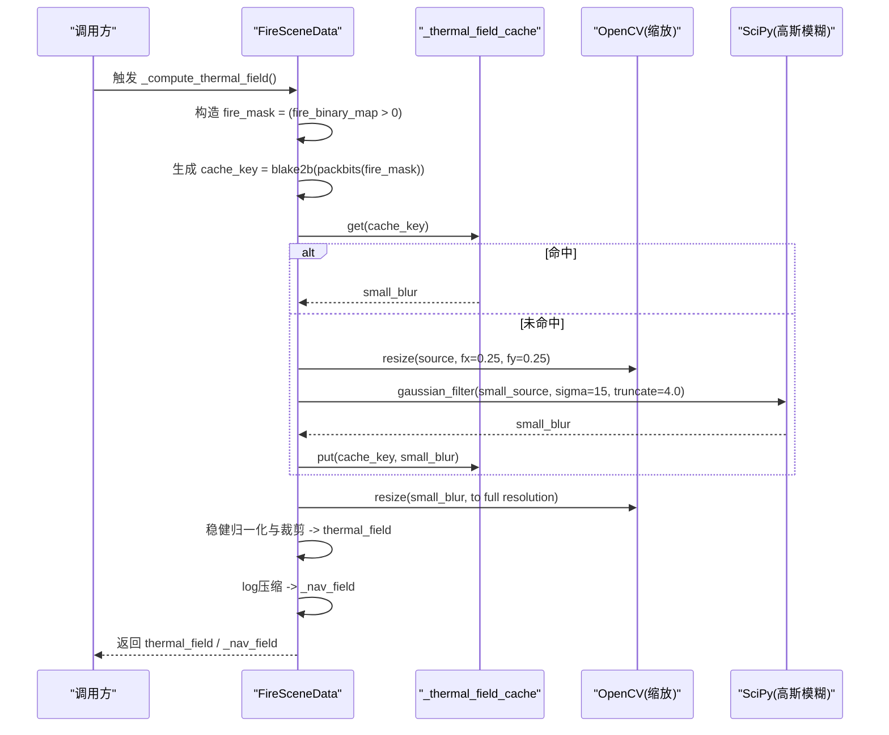
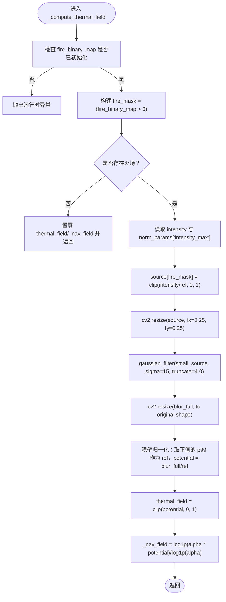
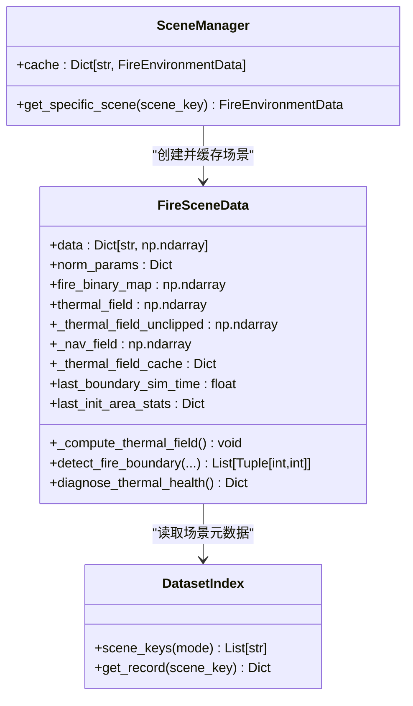
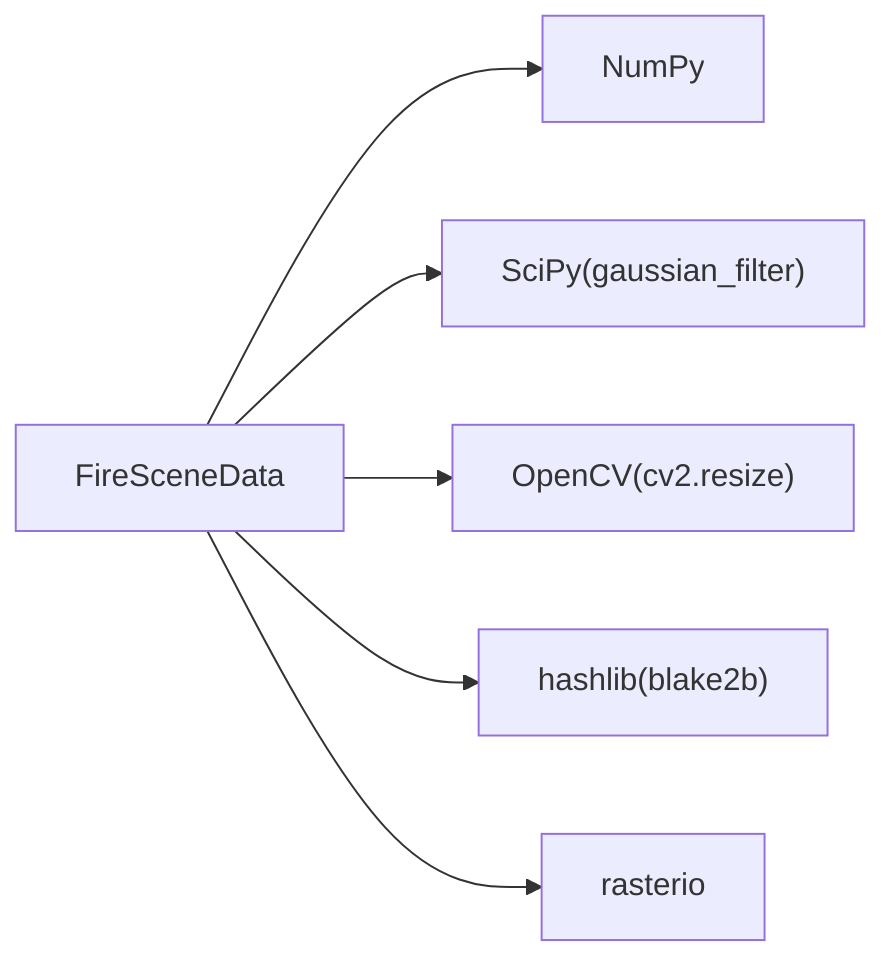

# 热场缓存机制

<cite>
**本文引用的文件**   
- [信息转换.py](file://environment_variables/environment_variables/信息转换.py)
- [2026-07-06-thermal-field-optimization-design.md](file://docs/superpowers/specs/2026-07-06-thermal-field-optimization-design.md)
- [2026-07-06-thermal-field-optimization.md](file://docs/superpowers/plans/2026-07-06-thermal-field-optimization.md)
- [test_thermal_field_optimization.py](file://environment_variables/environment_variables/test_thermal_field_optimization.py)
</cite>

## 目录
1. [简介](#简介)
2. [项目结构](#项目结构)
3. [核心组件](#核心组件)
4. [架构总览](#架构总览)
5. [详细组件分析](#详细组件分析)
6. [依赖关系分析](#依赖关系分析)
7. [性能考量](#性能考量)
8. [故障排查指南](#故障排查指南)
9. [结论](#结论)
10. [附录](#附录)

## 简介
本技术文档围绕“热场缓存机制”展开，聚焦以下目标：
- 缓存策略设计：缓存键生成规则、缓存失效与更新机制、内存管理策略
- 热场数据存储格式：数组结构、元数据管理与序列化方案
- 生命周期管理：初始化加载、动态更新、清理回收
- 性能优化：预加载策略、增量更新、并行计算支持
- 配置选项与监控指标：命中率统计、内存使用分析、健康诊断

该机制在保持对外输出形状与范围不变的前提下，通过低分辨率高斯模糊与缓存命中，显著降低热场计算开销。

## 项目结构
与热场缓存相关的代码主要位于环境数据模块中，包含场景数据加载、边界检测、热场计算与健康诊断等能力；同时配套有设计与计划文档以及回归测试用例。

图表来源
- [信息转换.py:758-820](file://environment_variables/environment_variables/信息转换.py#L758-L820)
- [信息转换.py:821-887](file://environment_variables/environment_variables/信息转换.py#L821-L887)
- [信息转换.py:971-1012](file://environment_variables/environment_variables/信息转换.py#L971-L1012)
- [2026-07-06-thermal-field-optimization-design.md:1-29](file://docs/superpowers/specs/2026-07-06-thermal-field-optimization-design.md#L1-L29)
- [2026-07-06-thermal-field-optimization.md:1-142](file://docs/superpowers/plans/2026-07-06-thermal-field-optimization.md#L1-L142)
- [test_thermal_field_optimization.py:1-70](file://environment_variables/environment_variables/test_thermal_field_optimization.py#L1-L70)

章节来源
- [信息转换.py:219-322](file://environment_variables/environment_variables/信息转换.py#L219-L322)
- [信息转换.py:758-820](file://environment_variables/environment_variables/信息转换.py#L758-L820)
- [信息转换.py:821-887](file://environment_variables/environment_variables/信息转换.py#L821-L887)
- [信息转换.py:971-1012](file://environment_variables/environment_variables/信息转换.py#L971-L1012)
- [2026-07-06-thermal-field-optimization-design.md:1-29](file://docs/superpowers/specs/2026-07-06-thermal-field-optimization-design.md#L1-L29)
- [2026-07-06-thermal-field-optimization.md:1-142](file://docs/superpowers/plans/2026-07-06-thermal-field-optimization.md#L1-L142)
- [test_thermal_field_optimization.py:1-70](file://environment_variables/environment_variables/test_thermal_field_optimization.py#L1-L70)

## 核心组件
- FireSceneData：场景数据载体，负责栅格加载、归一化参数推导、边界点检测、热场计算与健康诊断。
- _BoundaryPointsAccessor：边界点访问器，提供可迭代与索引语义。
- SceneManager：场景管理器，维护跨实例共享的场景缓存，避免重复读盘与重复计算。
- 热场缓存：基于二进制火场的精确哈希键，缓存低分辨率模糊结果，按需上采样回全分辨率。

章节来源
- [信息转换.py:199-218](file://environment_variables/environment_variables/信息转换.py#L199-L218)
- [信息转换.py:219-322](file://environment_variables/environment_variables/信息转换.py#L219-L322)
- [信息转换.py:1278-1326](file://environment_variables/environment_variables/信息转换.py#L1278-L1326)
- [信息转换.py:758-820](file://environment_variables/environment_variables/信息转换.py#L758-L820)

## 架构总览
下图展示了热场计算的关键流程：从火场二值掩码到缓存键生成、低分辨率模糊、上采样与最终热场输出，并附带导航场（log压缩）用于梯度计算。

图表来源
- [信息转换.py:758-820](file://environment_variables/environment_variables/信息转换.py#L758-L820)

## 详细组件分析

### 缓存键生成规则
- 输入：当前场景的火场二值掩码 fire_binary_map
- 步骤：
  - 将掩码转为连续内存块并二值化
  - 使用 packbits 打包为紧凑字节序列
  - 对字节序列计算 BLAKE2b 摘要（digest_size=16）作为缓存键
- 特性：
  - 区分相同数量但不同位置的火场掩码，避免碰撞导致的错误复用
  - 键长度固定且较小，利于字典查找与内存占用控制

章节来源
- [信息转换.py:758-776](file://environment_variables/environment_variables/信息转换.py#L758-L776)
- [2026-07-06-thermal-field-optimization-design.md:9-11](file://docs/superpowers/specs/2026-07-06-thermal-field-optimization-design.md#L9-L11)
- [2026-07-06-thermal-field-optimization.md:55-65](file://docs/superpowers/plans/2026-07-06-thermal-field-optimization.md#L55-L65)

### 缓存存储结构与序列化方案
- 存储位置：每个 FireSceneData 实例的 _thermal_field_cache 字典
- 键类型：BLAKE2b 摘要（bytes）
- 值类型：低分辨率模糊后的二维浮点数组（小尺寸）
- 序列化：当前实现以 Python 对象形式驻留内存，未显式持久化到磁盘
- 说明：
  - 缓存粒度为“低分辨率模糊结果”，而非全分辨率热场，节省内存与上采样开销
  - 若需跨进程或重启持久化，可在现有结构基础上增加 pickle/NumPy 序列化逻辑

章节来源
- [信息转换.py:758-820](file://environment_variables/environment_variables/信息转换.py#L758-L820)
- [2026-07-06-thermal-field-optimization-design.md:9-11](file://docs/superpowers/specs/2026-07-06-thermal-field-optimization-design.md#L9-L11)

### 缓存失效与更新机制
- 失效条件：当 fire_binary_map 发生变化时，新的掩码产生新的缓存键，旧键对应的条目不会被自动删除
- 更新路径：每次 _compute_thermal_field 都会根据当前掩码重新计算键并尝试命中；未命中则计算并写入缓存
- 建议改进：
  - 引入 LRU/LFU 淘汰策略，限制最大条目数，防止长期运行下缓存膨胀
  - 在场景切换或掩码重置时主动清理对应键，减少无用条目累积

章节来源
- [信息转换.py:758-820](file://environment_variables/environment_variables/信息转换.py#L758-L820)

### 内存管理策略
- 当前策略：按场景实例持有 _thermal_field_cache，不设置上限
- 风险：长时间训练或大量场景切换可能导致缓存持续增长
- 建议：
  - 添加 maxsize 与淘汰策略（如最近最少使用）
  - 暴露清理接口，供外部在需要时释放特定键或清空缓存
  - 结合 SceneManager 的共享场景缓存，统一生命周期管理

章节来源
- [信息转换.py:1278-1326](file://environment_variables/environment_variables/信息转换.py#L1278-L1326)
- [信息转换.py:758-820](file://environment_variables/environment_variables/信息转换.py#L758-L820)

### 热场数据存储格式
- 字段：
  - thermal_field：全分辨率热势场，值域经稳健归一化后裁剪至 [0, 1]
  - _thermal_field_unclipped：未裁剪的热势值，便于诊断与调试
  - _nav_field：log 压缩后的导航场，用于梯度计算，缓解高值区梯度消失
- 形状：与源栅格一致（height, width）
- 数据类型：float32

章节来源
- [信息转换.py:758-820](file://environment_variables/environment_variables/信息转换.py#L758-L820)

### 热场计算流程（算法级）

图表来源
- [信息转换.py:758-820](file://environment_variables/environment_variables/信息转换.py#L758-L820)

章节来源
- [信息转换.py:758-820](file://environment_variables/environment_variables/信息转换.py#L758-L820)

### 边界检测与动态更新
- detect_fire_boundary：根据强度阈值与时间步长选择火场掩码，支持按面积百分比选取初始边界
- 内部状态：
  - last_boundary_sim_time：记录当前模拟时间
  - last_init_area_stats：记录初始面积统计（总火点数、实际百分比、截断时间等）
- 与热场联动：边界更新会改变 fire_binary_map，从而在下一次热场计算时产生新缓存键

章节来源
- [信息转换.py:821-887](file://environment_variables/environment_variables/信息转换.py#L821-L887)

### 健康诊断与监控指标
- diagnose_thermal_health：输出热场健康报告，包括饱和比例、高值比例、非零比例、高热区零梯度比例、分位数统计等
- 用途：训练前校验热场语义层是否正常，辅助定位数值问题

章节来源
- [信息转换.py:971-1012](file://environment_variables/environment_variables/信息转换.py#L971-L1012)

### 类关系图

图表来源
- [信息转换.py:219-322](file://environment_variables/environment_variables/信息转换.py#L219-L322)
- [信息转换.py:1278-1326](file://environment_variables/environment_variables/信息转换.py#L1278-L1326)
- [信息转换.py:20-135](file://environment_variables/environment_variables/信息转换.py#L20-L135)

## 依赖关系分析
- 直接依赖：
  - NumPy：数组操作、统计与距离变换
  - SciPy：高斯滤波（gaussian_filter）
  - OpenCV：图像缩放（resize），用于低分辨率处理与上采样
  - hashlib：BLAKE2b 摘要生成
- 间接依赖：
  - rasterio：栅格读写与坐标变换
  - cv2：OpenCV 绑定

图表来源
- [信息转换.py:1-14](file://environment_variables/environment_variables/信息转换.py#L1-L14)
- [信息转换.py:758-820](file://environment_variables/environment_variables/信息转换.py#L758-L820)

章节来源
- [信息转换.py:1-14](file://environment_variables/environment_variables/信息转换.py#L1-L14)
- [信息转换.py:758-820](file://environment_variables/environment_variables/信息转换.py#L758-L820)

## 性能考量
- 低分辨率模糊：将空间维度缩小至 1/4，sigma 从 60 调整到 15，保持 truncate=4.0，近似误差受控
- 缓存命中：相同掩码仅执行一次高斯模糊，后续直接上采样，显著降低冷启动开销
- 上采样成本：OpenCV 线性插值上采样开销远小于全分辨率高斯滤波
- 基准要求（设计规格）：
  - 冷启动热场计算至少 20x 加速
  - 与原全分辨率实现的 MAE ≤ 0.5，阈值不一致率 ≤ 0.2%
- 潜在瓶颈：
  - 缓存键生成（packbits + blake2b）在极高频次调用下可能成为热点
  - 大场景下小数组频繁分配与上采样仍有一定开销

章节来源
- [2026-07-06-thermal-field-optimization-design.md:15-24](file://docs/superpowers/specs/2026-07-06-thermal-field-optimization-design.md#L15-L24)
- [2026-07-06-thermal-field-optimization.md:115-125](file://docs/superpowers/plans/2026-07-06-thermal-field-optimization.md#L115-L125)

## 故障排查指南
- 常见错误：
  - 未初始化火场掩码：抛出运行时异常，需在调用热场计算前确保 detect_fire_boundary 已执行
  - 缺少强度数据：抛出运行时异常，需确认 intensity 栅格存在且正确加载
- 诊断方法：
  - 使用 diagnose_thermal_health 检查饱和比例、高值比例、非零比例与高热区零梯度比例
  - 对比不同掩码产生的热场是否不同，验证缓存键区分度
- 回归测试：
  - test_thermal_field_optimization.py 覆盖输出范围、形状、不同掩码差异与健康诊断

章节来源
- [信息转换.py:758-776](file://environment_variables/environment_variables/信息转换.py#L758-L776)
- [信息转换.py:971-1012](file://environment_variables/environment_variables/信息转换.py#L971-L1012)
- [test_thermal_field_optimization.py:25-66](file://environment_variables/environment_variables/test_thermal_field_optimization.py#L25-L66)

## 结论
该热场缓存机制通过低分辨率模糊与精确掩码哈希键，实现了在不改变对外 API 的前提下的高性能热场计算。配合健康诊断与回归测试，保证了数值稳定性与正确性。建议在工程实践中引入 LRU/LFU 淘汰策略与显式清理接口，以进一步改善内存占用与长期运行的健壮性。

## 附录

### 配置选项与监控指标
- 配置项（来自场景归一化参数）：
  - intensity_max、length_max、speedRate_max、spread_direction_max、heat_per_unit_area_max、crown_fire_max
  - dem_min/dem_max、slope_max、wind_speed_max、fire_threshold
- 监控指标（健康诊断输出）：
  - sat_ratio：饱和比例
  - high_ratio：高值比例
  - nonzero_ratio：非零比例
  - zero_grad_in_high_ratio：高热区零梯度比例
  - potential_q50/q90/q99：热势分位数
  - field_min/field_max：热场最小/最大值

章节来源
- [信息转换.py:559-602](file://environment_variables/environment_variables/信息转换.py#L559-L602)
- [信息转换.py:971-1012](file://environment_variables/environment_variables/信息转换.py#L971-L1012)