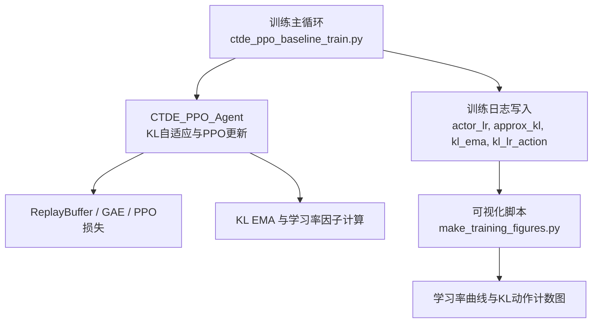
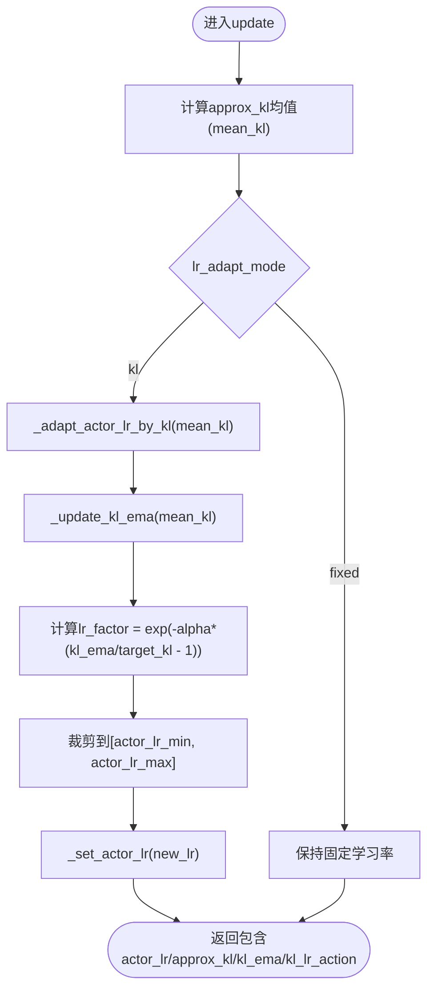
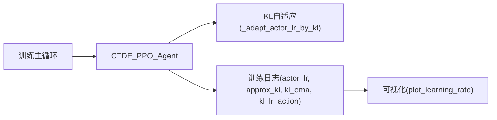

# 自适应学习率调整

<cite>
**本文引用的文件**   
- [ctde_ppo_baseline_train.py](file://environment_variables/environment_variables/ctde_ppo_baseline_train.py)
- [make_training_figures.py](file://environment_variables/environment_variables/outputs/make_training_figures.py)
</cite>

## 目录
1. [简介](#简介)
2. [项目结构](#项目结构)
3. [核心组件](#核心组件)
4. [架构总览](#架构总览)
5. [详细组件分析](#详细组件分析)
6. [依赖关系分析](#依赖关系分析)
7. [性能与稳定性考量](#性能与稳定性考量)
8. [故障排除指南](#故障排除指南)
9. [结论](#结论)
10. [附录：配置项与监控字段](#附录配置项与监控字段)

## 简介
本技术文档聚焦于“基于KL散度的自适应学习率调整机制”，系统阐述其原理、实现细节、对比策略（固定学习率 vs KL散度学习率）、学习率衰减策略、监控与可视化，以及调优最佳实践与常见问题排查。该机制在CTDE-PPO训练流程中通过近似KL散度估计动态调节Actor网络的学习率，以稳定策略更新并提升收敛质量。

## 项目结构
围绕自适应学习率的核心代码位于训练脚本与图表生成脚本中：
- 训练主循环与Agent类：负责采样、GAE计算、PPO更新、KL统计与学习率自适应。
- 可视化脚本：读取训练日志中的学习率序列与KL动作计数，生成学习率曲线与动作分布图。



图示来源
- [ctde_ppo_baseline_train.py:759-991](file://environment_variables/environment_variables/ctde_ppo_baseline_train.py#L759-L991)
- [ctde_ppo_baseline_train.py:1278-1600](file://environment_variables/environment_variables/ctde_ppo_baseline_train.py#L1278-L1600)
- [make_training_figures.py:852-903](file://environment_variables/environment_variables/outputs/make_training_figures.py#L852-L903)

章节来源
- [ctde_ppo_baseline_train.py:759-991](file://environment_variables/environment_variables/ctde_ppo_baseline_train.py#L759-L991)
- [ctde_ppo_baseline_train.py:1278-1600](file://environment_variables/environment_variables/ctde_ppo_baseline_train.py#L1278-L1600)
- [make_training_figures.py:852-903](file://environment_variables/environment_variables/outputs/make_training_figures.py#L852-L903)

## 核心组件
- CTDE_PPO_Agent
  - 维护Actor/Critic网络与优化器；支持两种学习率策略：固定与KL自适应。
  - 关键方法：
    - _set_actor_lr：将目标学习率裁剪到[min,max]后应用到优化器参数组。
    - _update_kl_ema：指数移动平均更新KL值，用于平滑噪声。
    - _adapt_actor_lr_by_kl：根据当前KL EMA相对target的偏离程度，按指数因子更新学习率。
    - update：执行PPO多轮mini-batch更新，统计approx_kl、clip_fraction等指标，并在KL模式下触发学习率自适应。
- 训练主循环
  - 记录每回合的actor_lr、approx_kl、kl_ema、kl_lr_action等指标到训练日志。
  - 周期性打印KL相关诊断信息，辅助调试。
- 可视化
  - plot_learning_rate：绘制actor_lr随回合变化曲线（对数纵轴），并汇总kl_lr_action计数（up/down/keep/fixed）。

章节来源
- [ctde_ppo_baseline_train.py:823-847](file://environment_variables/environment_variables/ctde_ppo_baseline_train.py#L823-L847)
- [ctde_ppo_baseline_train.py:828-834](file://environment_variables/environment_variables/ctde_ppo_baseline_train.py#L828-L834)
- [ctde_ppo_baseline_train.py:836-847](file://environment_variables/environment_variables/ctde_ppo_baseline_train.py#L836-L847)
- [ctde_ppo_baseline_train.py:889-991](file://environment_variables/environment_variables/ctde_ppo_baseline_train.py#L889-L991)
- [ctde_ppo_baseline_train.py:1538-1546](file://environment_variables/environment_variables/ctde_ppo_baseline_train.py#L1538-L1546)
- [make_training_figures.py:852-903](file://environment_variables/environment_variables/outputs/make_training_figures.py#L852-L903)

## 架构总览
下图展示KL自适应学习率的端到端流程：从PPO更新中估算近似KL，经EMA平滑后计算学习率因子，最终裁剪并应用至Actor优化器。

```mermaid
sequenceDiagram
participant Loop as "训练主循环"
participant Agent as "CTDE_PPO_Agent.update"
participant KL as "_adapt_actor_lr_by_kl"
participant EMA as "_update_kl_ema"
participant Opt as "Actor优化器"
Loop->>Agent : 收集轨迹并执行PPO多轮更新
Agent->>Agent : 计算approx_kl(均值)
alt lr_adapt_mode == "kl"
Agent->>KL : 传入mean_kl
KL->>EMA : 更新KL EMA
EMA-->>KL : 返回kl_ema
KL->>KL : 计算lr_factor = exp(-alpha*(kl_ema/target_kl - 1))
KL->>Opt : 设置新学习率(裁剪到[min,max])
Opt-->>Agent : 返回当前actor_lr
else fixed
Agent->>EMA : 仅更新KL EMA(不改变学习率)
Agent-->>Loop : 返回kl_lr_action="fixed"
end
Agent-->>Loop : 返回包含actor_lr/approx_kl/kl_ema/kl_lr_action的字典
```

图示来源
- [ctde_ppo_baseline_train.py:889-991](file://environment_variables/environment_variables/ctde_ppo_baseline_train.py#L889-L991)
- [ctde_ppo_baseline_train.py:828-847](file://environment_variables/environment_variables/ctde_ppo_baseline_train.py#L828-L847)

## 详细组件分析

### 基于KL散度的动态学习率调节
- 近似KL计算
  - 在PPO更新过程中，使用新旧策略的对数概率比ratio与log_ratio构造近似KL估计，取mini-batch均值作为本轮mean_kl。
- KL指数移动平均
  - 采用指数滑动平均对mean_kl进行平滑，超参为kl_ema_beta，避免单步噪声导致学习率剧烈波动。
- 学习率因子与更新规则
  - 学习率因子由指数函数决定：lr_factor = exp(-alpha * (kl_ema / target_kl - 1))。当kl_ema > target_kl时，因子小于1，学习率下降；反之则上升。
  - 新学习率被裁剪到[actor_lr_min, actor_lr_max]区间，防止过大或过小。
- 收敛判断逻辑
  - 通过比较mean_kl与target_kl的偏离程度间接判断策略更新的“信任域”是否被突破；若长期高于阈值，学习率自动降低以抑制过激更新。
- 关键实现位置
  - 近似KL统计与PPO更新：见update方法内部。
  - KL EMA与自适应：见_update_kl_ema与_adapt_actor_lr_by_kl。



图示来源
- [ctde_ppo_baseline_train.py:889-991](file://environment_variables/environment_variables/ctde_ppo_baseline_train.py#L889-L991)
- [ctde_ppo_baseline_train.py:828-847](file://environment_variables/environment_variables/ctde_ppo_baseline_train.py#L828-L847)

章节来源
- [ctde_ppo_baseline_train.py:889-991](file://environment_variables/environment_variables/ctde_ppo_baseline_train.py#L889-L991)
- [ctde_ppo_baseline_train.py:828-847](file://environment_variables/environment_variables/ctde_ppo_baseline_train.py#L828-L847)

### 固定学习率与KL散度学习率对比
- 固定学习率（fixed）
  - 优点：简单稳定，易于复现实验；适合小规模任务或需要强基线的场景。
  - 缺点：缺乏对策略更新幅度的反馈控制，可能在高KL阶段不稳定。
  - 适用场景：快速验证、数据量小、环境噪声低。
- KL散度学习率（kl）
  - 优点：依据策略更新的信任域动态调节，有助于稳定训练、减少发散风险。
  - 缺点：需合理设置target_kl与alpha，否则可能出现学习率震荡或过度保守。
  - 适用场景：复杂策略空间、易出现大更新幅度的任务。
- 行为差异
  - 在KL模式下，kl_lr_action会记录每次更新的动作类型（up/down/keep），便于分析学习率变化趋势。
  - 在固定模式下，kl_lr_action恒为“fixed”。

章节来源
- [ctde_ppo_baseline_train.py:836-847](file://environment_variables/environment_variables/ctde_ppo_baseline_train.py#L836-L847)
- [ctde_ppo_baseline_train.py:974-979](file://environment_variables/environment_variables/ctde_ppo_baseline_train.py#L974-L979)
- [make_training_figures.py:852-903](file://environment_variables/environment_variables/outputs/make_training_figures.py#L852-L903)

### 学习率衰减策略
- 本项目未内置传统的时间步衰减（如指数衰减、余弦退火）作为独立调度器；学习率变化主要由KL自适应驱动。
- 可结合外部调度器扩展：
  - 指数衰减：在每个epoch或固定步数乘以衰减系数。
  - 余弦退火：按周期函数平滑降低学习率。
  - 建议：若引入时间衰减，应与KL自适应叠加或选择其一，避免相互干扰。

说明：本节为通用指导，不涉及具体代码片段。

### 学习率监控与日志记录
- 训练日志关键字段
  - actor_lr：当前Actor学习率（对数尺度绘图更直观）。
  - approx_kl：本轮PPO更新的近似KL均值。
  - kl_ema：KL的指数移动平均值。
  - kl_lr_action：KL模式下的学习率动作类型（up/down/keep/fixed）。
  - clip_fraction：被截断的比例，反映策略更新的受限程度。
- 可视化
  - plot_learning_rate：绘制actor_lr随回合的变化曲线，并统计kl_lr_action的分布，帮助识别学习率是否频繁上下震荡或长期不变。
- 典型用法
  - 在训练结束后调用可视化脚本，输出学习率曲线与KL动作计数图，便于对比不同seed或不同lr_adapt_mode的效果。

章节来源
- [ctde_ppo_baseline_train.py:1538-1546](file://environment_variables/environment_variables/ctde_ppo_baseline_train.py#L1538-L1546)
- [make_training_figures.py:852-903](file://environment_variables/environment_variables/outputs/make_training_figures.py#L852-L903)

## 依赖关系分析
- 模块耦合
  - 训练主循环依赖CTDE_PPO_Agent完成PPO更新与KL统计。
  - 可视化脚本依赖训练日志中的actor_lr与kl_lr_action字段。
- 外部依赖
  - PyTorch张量与优化器操作；numpy数值处理；matplotlib绘图。
- 潜在环路与边界
  - 无直接循环依赖；学习率自适应仅在KL模式下生效，避免与固定模式冲突。



图示来源
- [ctde_ppo_baseline_train.py:889-991](file://environment_variables/environment_variables/ctde_ppo_baseline_train.py#L889-L991)
- [ctde_ppo_baseline_train.py:1538-1546](file://environment_variables/environment_variables/ctde_ppo_baseline_train.py#L1538-L1546)
- [make_training_figures.py:852-903](file://environment_variables/environment_variables/outputs/make_training_figures.py#L852-L903)

章节来源
- [ctde_ppo_baseline_train.py:889-991](file://environment_variables/environment_variables/ctde_ppo_baseline_train.py#L889-L991)
- [ctde_ppo_baseline_train.py:1538-1546](file://environment_variables/environment_variables/ctde_ppo_baseline_train.py#L1538-L1546)
- [make_training_figures.py:852-903](file://environment_variables/environment_variables/outputs/make_training_figures.py#L852-L903)

## 性能与稳定性考量
- KL EMA平滑
  - kl_ema_beta越大，历史影响越强，学习率变化更平滑但响应更慢；较小则更敏感但可能抖动。
- 学习率裁剪
  - actor_lr_min/max确保学习率不会极端化，避免梯度爆炸或停滞。
- 近似KL与截断比例
  - clip_fraction高表示大量更新被截断，策略更新过于激进；配合KL自适应可降低风险。
- 批大小与更新频率
  - batch_size与ppo_epochs影响KL估计的方差与更新步数，进而影响自适应的稳定性。

说明：本节提供一般性指导，不涉及具体代码片段。

## 故障排除指南
- 学习率频繁上下震荡
  - 现象：kl_lr_action中up/down交替频繁。
  - 原因：target_kl过小或alpha过大导致对KL波动过度反应。
  - 解决：增大target_kl或减小kl_lr_alpha；适当增大kl_ema_beta以平滑。
- 学习率长期不变或过低
  - 现象：actor_lr接近下限且长期不动。
  - 原因：KL持续高于target_kl，或batch太小导致KL估计噪声大。
  - 解决：提高target_kl；增大batch_size或ppo_epochs；检查clip_fraction是否过高。
- 训练发散或不稳定
  - 现象：loss与KL剧烈波动，成功率下降。
  - 原因：策略更新过大，信任域被突破。
  - 解决：启用KL自适应；适度增大clip_epsilon；检查梯度裁剪max_grad_norm。
- 可视化缺失
  - 现象：plot_learning_rate返回False或未生成图。
  - 原因：日志中缺少actor_lr或kl_lr_action字段。
  - 解决：确认训练日志写入完整；检查训练主循环是否正确记录这些字段。

章节来源
- [ctde_ppo_baseline_train.py:836-847](file://environment_variables/environment_variables/ctde_ppo_baseline_train.py#L836-L847)
- [ctde_ppo_baseline_train.py:974-979](file://environment_variables/environment_variables/ctde_ppo_baseline_train.py#L974-L979)
- [make_training_figures.py:852-903](file://environment_variables/environment_variables/outputs/make_training_figures.py#L852-L903)

## 结论
基于KL散度的自适应学习率机制通过近似KL估计与指数移动平均，动态调节Actor学习率，有效缓解策略更新过大带来的不稳定问题。相比固定学习率，KL自适应在复杂环境中更具鲁棒性，但需合理配置target_kl、kl_lr_alpha与kl_ema_beta。配合完善的日志与可视化，可显著提升调试效率与调优效果。

## 附录：配置项与监控字段
- 关键配置项
  - lr_adapt_mode：固定(fixed)或KL自适应(kl)。
  - target_kl：目标KL阈值，控制学习率增减的基准。
  - actor_lr_min/actor_lr_max：学习率裁剪边界。
  - kl_ema_beta：KL EMA平滑系数。
  - kl_lr_alpha：学习率因子敏感度。
- 训练日志关键字段
  - actor_lr、critic_lr：当前学习率。
  - approx_kl、kl_ema：KL统计与平滑值。
  - kl_lr_action：KL模式下的学习率动作类型。
  - clip_fraction：策略更新被截断的比例。
  - total_steps、ppo_updates：训练进度指标。

章节来源
- [ctde_ppo_baseline_train.py:1278-1600](file://environment_variables/environment_variables/ctde_ppo_baseline_train.py#L1278-L1600)
- [ctde_ppo_baseline_train.py:1538-1546](file://environment_variables/environment_variables/ctde_ppo_baseline_train.py#L1538-L1546)