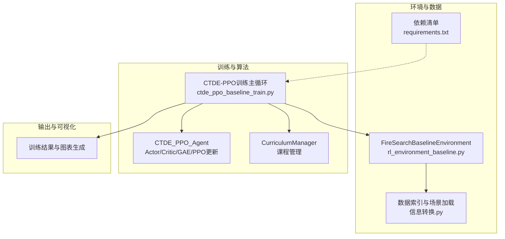
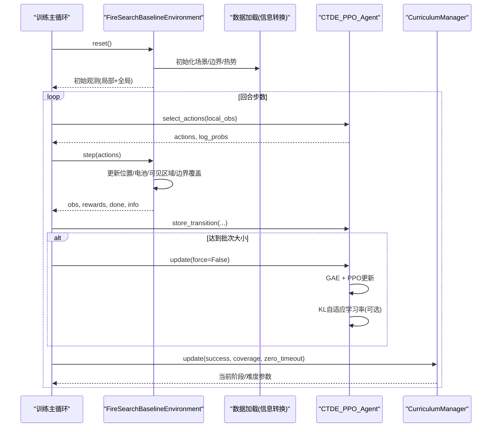
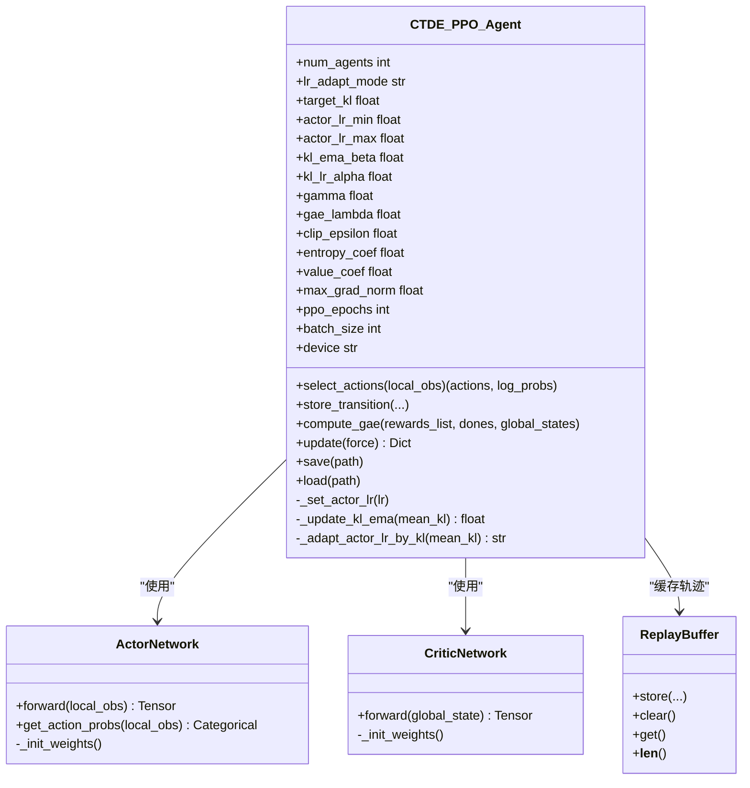
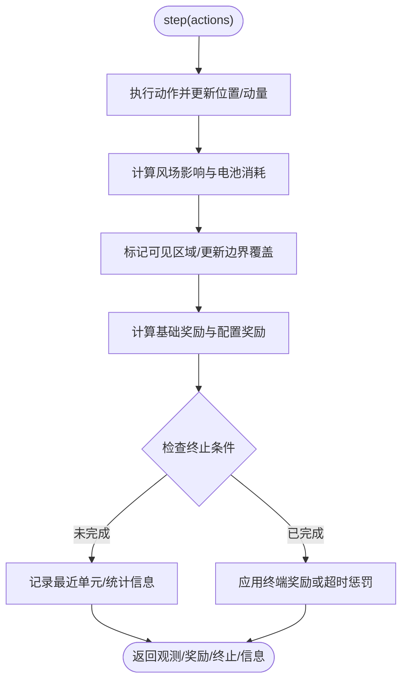
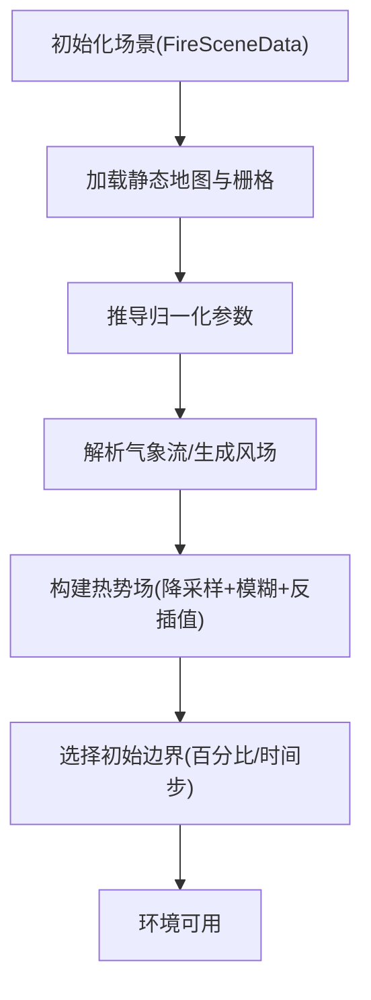
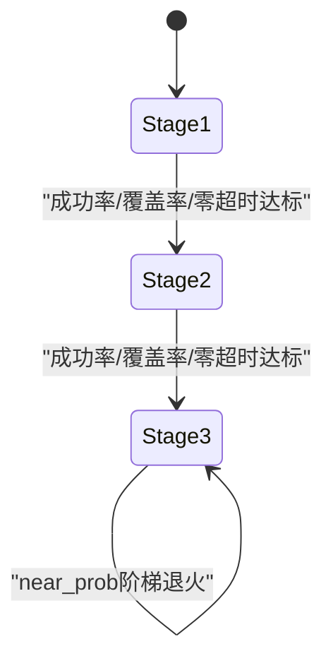
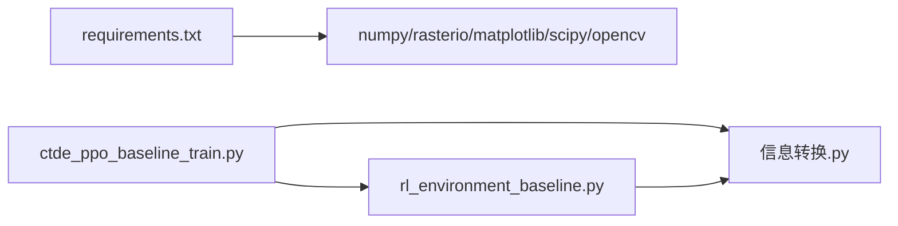

# 项目概述

<cite>
**本文引用的文件列表**
- [ctde_ppo_baseline_train.py](file://environment_variables/environment_variables/ctde_ppo_baseline_train.py)
- [rl_environment_baseline.py](file://environment_variables/environment_variables/rl_environment_baseline.py)
- [信息转换.py](file://environment_variables/environment_variables/信息转换.py)
- [requirements.txt](file://environment_variables/requirements.txt)
</cite>

## 目录
1. [简介](#简介)
2. [项目结构](#项目结构)
3. [核心组件](#核心组件)
4. [架构总览](#架构总览)
5. [详细组件分析](#详细组件分析)
6. [依赖关系分析](#依赖关系分析)
7. [性能与稳定性考量](#性能与稳定性考量)
8. [快速开始指南](#快速开始指南)
9. [故障排查](#故障排查)
10. [结论](#结论)

## 简介
本项目面向“自适应参数森林火灾搜索强化学习”，目标是在多无人机协同条件下，基于CTDE-PPO（集中训练、分散执行 + PPO）算法，在动态火场环境中高效完成火线边界发现与覆盖任务。项目的关键特色包括：
- 多无人机协同搜索：支持多智能体并行决策与环境交互，强调去中心化观测与集中式全局状态评估。
- CTDE-PPO实现：Actor-Critic网络分离，PPO裁剪策略更新，GAE优势估计，支持批量与子批次训练。
- 自适应学习率调整：提供固定与KL自适应两种模式，依据近似KL散度指数调节Actor学习率，提升训练稳定性。
- 课程学习与难度阶梯：按阶段推进成功率、覆盖率与零超时率门槛，逐步提高初始火场面积比例与近界生成概率，增强泛化能力。
- 热势引导与风险感知：构建场景级鲁棒热势场，结合地形、风场、强度等栅格数据，为探索与边界逼近提供弱引导信号。

本概述既为初学者提供概念性理解，也为有经验的开发者给出技术细节与使用指引。

## 项目结构
仓库以环境脚本与训练脚本为核心，辅以数据加载与可视化输出模块。主要目录与职责如下：
- environment_variables/environment_variables：包含基线环境、训练主循环、数据加载与绘图脚本。
- map：训练/验证/泛化/压力测试场景数据（栅格、矢量、报告等）。
- outputs：训练结果、图表与对比实验汇总。

图示来源
- [ctde_ppo_baseline_train.py:1-120](file://environment_variables/environment_variables/ctde_ppo_baseline_train.py#L1-L120)
- [rl_environment_baseline.py:1-120](file://environment_variables/environment_variables/rl_environment_baseline.py#L1-L120)
- [信息转换.py:1-120](file://environment_variables/environment_variables/信息转换.py#L1-L120)
- [requirements.txt:1-13](file://environment_variables/requirements.txt#L1-L13)

章节来源
- [ctde_ppo_baseline_train.py:1-120](file://environment_variables/environment_variables/ctde_ppo_baseline_train.py#L1-L120)
- [rl_environment_baseline.py:1-120](file://environment_variables/environment_variables/rl_environment_baseline.py#L1-L120)
- [信息转换.py:1-120](file://environment_variables/environment_variables/信息转换.py#L1-L120)
- [requirements.txt:1-13](file://environment_variables/requirements.txt#L1-L13)

## 核心组件
- FireSearchBaselineEnvironment：定义多无人机火场搜索的Gymnasium环境，提供局部观测与全局状态接口，内置多种观测/奖励配置、热势计算、边界检测与电池/风场影响模型。
- CTDE_PPO_Agent：实现Actor/Critic网络、经验回放缓冲、GAE优势估计、PPO裁剪更新、KL自适应学习率与保存/加载机制。
- CurriculumManager：管理三阶段课程学习，控制初始火场面积百分比、阶段目标成功率与近界生成概率，依据指标门限自动升级难度。
- 数据加载模块（信息转换.py）：负责数据集索引、场景元数据解析、栅格读取与归一化、热势场重建、边界点提取与时间步进更新。

章节来源
- [rl_environment_baseline.py:21-120](file://environment_variables/environment_variables/rl_environment_baseline.py#L21-L120)
- [ctde_ppo_baseline_train.py:748-880](file://environment_variables/environment_variables/ctde_ppo_baseline_train.py#L748-L880)
- [ctde_ppo_baseline_train.py:569-747](file://environment_variables/environment_variables/ctde_ppo_baseline_train.py#L569-L747)
- [信息转换.py:219-320](file://environment_variables/environment_variables/信息转换.py#L219-L320)

## 架构总览
系统采用“环境-算法-数据”三层解耦设计：
- 环境层：封装FARSITE场景数据与物理规则，暴露标准Gymnasium接口，支持多智能体动作与奖励分解。
- 算法层：CTDE-PPO Agent维护Actor/Critic网络与优化器，进行采样、GAE计算与PPO更新；CurriculumManager驱动训练难度演进。
- 数据层：DatasetIndex与FireSceneData负责场景索引、栅格加载、归一化与热势场重建，为环境提供稳定输入。

图示来源
- [ctde_ppo_baseline_train.py:1267-1400](file://environment_variables/environment_variables/ctde_ppo_baseline_train.py#L1267-L1400)
- [rl_environment_baseline.py:842-992](file://environment_variables/environment_variables/rl_environment_baseline.py#L842-L992)
- [ctde_ppo_baseline_train.py:879-981](file://environment_variables/environment_variables/ctde_ppo_baseline_train.py#L879-L981)
- [ctde_ppo_baseline_train.py:569-747](file://environment_variables/environment_variables/ctde_ppo_baseline_train.py#L569-L747)

## 详细组件分析

### 组件A：CTDE-PPO Agent与自适应学习率
- Actor网络：多层全连接+LayerNorm+残差连接，输出离散动作分布。
- Critic网络：多层全连接+LayerNorm，输出全局状态价值。
- 经验缓冲：存储局部观测、全局状态、动作、对数概率、奖励与终止标志。
- GAE与PPO更新：优势标准化，裁剪代理目标，熵正则，梯度裁剪。
- KL自适应学习率：根据近似KL的指数函数调节Actor学习率，限制上下界，支持固定模式。

图示来源
- [ctde_ppo_baseline_train.py:460-535](file://environment_variables/environment_variables/ctde_ppo_baseline_train.py#L460-L535)
- [ctde_ppo_baseline_train.py:537-567](file://environment_variables/environment_variables/ctde_ppo_baseline_train.py#L537-L567)
- [ctde_ppo_baseline_train.py:748-880](file://environment_variables/environment_variables/ctde_ppo_baseline_train.py#L748-L880)
- [ctde_ppo_baseline_train.py:879-981](file://environment_variables/environment_variables/ctde_ppo_baseline_train.py#L879-L981)

章节来源
- [ctde_ppo_baseline_train.py:460-535](file://environment_variables/environment_variables/ctde_ppo_baseline_train.py#L460-L535)
- [ctde_ppo_baseline_train.py:537-567](file://environment_variables/environment_variables/ctde_ppo_baseline_train.py#L537-L567)
- [ctde_ppo_baseline_train.py:748-880](file://environment_variables/environment_variables/ctde_ppo_baseline_train.py#L748-L880)
- [ctde_ppo_baseline_train.py:879-981](file://environment_variables/environment_variables/ctde_ppo_baseline_train.py#L879-L981)

### 组件B：FireSearchBaselineEnvironment（多无人机环境）
- 观测空间：每个无人机局部观测向量（位置、电量、地形、风场、热梯度、相机方向等），以及团队全局状态（覆盖率、平均/最小电量、队形中心与散布、距火距离、步长进度、已访问密度、课程阶段等）。
- 动作空间：五维离散（上/下/左/右/静止），带边界约束。
- 奖励设计：边界发现奖励、覆盖率增量奖励、预边界区域探索奖励、重复惩罚、空闲惩罚、同伴接近惩罚、终端奖励/超时惩罚等，支持多种奖励配置。
- 动态更新：每若干步重新检测火线边界并更新热势场，保证环境随仿真时间演化。
- 课程阶段：不同阶段的目标覆盖率与超时惩罚不同，支持近界/远界随机生成策略。

图示来源
- [rl_environment_baseline.py:842-992](file://environment_variables/environment_variables/rl_environment_baseline.py#L842-L992)
- [rl_environment_baseline.py:692-806](file://environment_variables/environment_variables/rl_environment_baseline.py#L692-L806)
- [rl_environment_baseline.py:824-841](file://environment_variables/environment_variables/rl_environment_baseline.py#L824-L841)

章节来源
- [rl_environment_baseline.py:21-120](file://environment_variables/environment_variables/rl_environment_baseline.py#L21-L120)
- [rl_environment_baseline.py:692-806](file://environment_variables/environment_variables/rl_environment_baseline.py#L692-L806)
- [rl_environment_baseline.py:842-992](file://environment_variables/environment_variables/rl_environment_baseline.py#L842-L992)

### 组件C：数据加载与热势场重建（信息转换.py）
- DatasetIndex：管理数据集索引与场景键映射，支持train/validation/generalization/stress划分。
- FireSceneData：加载静态地图与核心栅格，推导归一化参数，解析气象流文件，构建风场与地形特征。
- 热势场重建：基于火掩码与强度栅格，经降采样+高斯模糊+反插值，得到[0,1]热势图与导航场，用于弱引导探索。
- 边界点选择：支持按时间步或初始面积百分比选择t=0边界，确保训练起始场景有效。

图示来源
- [信息转换.py:219-320](file://environment_variables/environment_variables/信息转换.py#L219-L320)
- [信息转换.py:639-683](file://environment_variables/environment_variables/信息转换.py#L639-L683)
- [信息转换.py:759-800](file://environment_variables/environment_variables/信息转换.py#L759-L800)
- [信息转换.py:698-721](file://environment_variables/environment_variables/信息转换.py#L698-L721)

章节来源
- [信息转换.py:219-320](file://environment_variables/environment_variables/信息转换.py#L219-L320)
- [信息转换.py:639-683](file://environment_variables/environment_variables/信息转换.py#L639-L683)
- [信息转换.py:759-800](file://environment_variables/environment_variables/信息转换.py#L759-L800)
- [信息转换.py:698-721](file://environment_variables/environment_variables/信息转换.py#L698-L721)

### 组件D：课程管理与难度阶梯（CurriculumManager）
- 阶段1：低成功率门槛，逐步提升初始火场面积百分比。
- 阶段2：提高成功率与覆盖率门槛，降低零超时率阈值。
- 阶段3：进一步提升目标覆盖率，同时阶梯式退火近界生成概率，绑定能力门限（成功率、零超时率、覆盖率）。

图示来源
- [ctde_ppo_baseline_train.py:569-747](file://environment_variables/environment_variables/ctde_ppo_baseline_train.py#L569-L747)

章节来源
- [ctde_ppo_baseline_train.py:569-747](file://environment_variables/environment_variables/ctde_ppo_baseline_train.py#L569-L747)

## 依赖关系分析
- 外部依赖：numpy、rasterio、matplotlib、scipy、opencv-python；强化学习相关依赖（torch、stable-baselines3、tensorboard）为可选。
- 内部依赖：训练脚本依赖环境与数据模块；环境依赖数据模块；数据模块独立于算法层。

图示来源
- [requirements.txt:1-13](file://environment_variables/requirements.txt#L1-L13)
- [ctde_ppo_baseline_train.py:1-40](file://environment_variables/environment_variables/ctde_ppo_baseline_train.py#L1-L40)
- [rl_environment_baseline.py:1-20](file://environment_variables/environment_variables/rl_environment_baseline.py#L1-L20)
- [信息转换.py:1-20](file://environment_variables/environment_variables/信息转换.py#L1-L20)

章节来源
- [requirements.txt:1-13](file://environment_variables/requirements.txt#L1-L13)
- [ctde_ppo_baseline_train.py:1-40](file://environment_variables/environment_variables/ctde_ppo_baseline_train.py#L1-L40)
- [rl_environment_baseline.py:1-20](file://environment_variables/environment_variables/rl_environment_baseline.py#L1-L20)
- [信息转换.py:1-20](file://environment_variables/environment_variables/信息转换.py#L1-L20)

## 性能与稳定性考量
- 批处理与子批次：通过minibatch_size与mini_batch_size平衡内存与收敛速度。
- 优势标准化与梯度裁剪：减少方差与梯度爆炸风险。
- KL自适应学习率：指数调节Actor学习率，避免策略突变，提升训练稳定性。
- 课程学习：渐进式难度提升，降低早期探索成本，加速收敛。
- 热势场与风场建模：提供更丰富的环境反馈，有助于在多无人机协作中形成互补探索。

## 快速开始指南
- 环境搭建
  - 安装Python虚拟环境并激活。
  - 安装依赖：pip install -r environment_variables/requirements.txt
- 准备数据
  - 将map下的训练/验证/泛化/压力场景放置到dataset目录，并确保dataset_index.json存在且路径正确。
- 运行训练
  - 进入environment_variables/environment_variables目录。
  - 执行训练脚本（默认使用baseline配置）：python ctde_ppo_baseline_train.py
  - 可通过命令行参数或配置文件覆盖默认训练参数（如num_drones、vision_radius、total_episodes、lr_adapt_mode等）。
- 基本使用示例
  - 直接运行环境自检：python rl_environment_baseline.py
  - 查看训练日志与图表：outputs目录下自动生成训练与泛化评估图表。

章节来源
- [requirements.txt:1-13](file://environment_variables/requirements.txt#L1-L13)
- [ctde_ppo_baseline_train.py:98-158](file://environment_variables/environment_variables/ctde_ppo_baseline_train.py#L98-L158)
- [rl_environment_baseline.py:1021-1027](file://environment_variables/environment_variables/rl_environment_baseline.py#L1021-L1027)

## 故障排查
- 场景无效或缺失
  - 现象：初始化时报InvalidSceneError或找不到栅格/矢量文件。
  - 排查：确认scene_key与metadata.json、static_map、rasters、vectors、inputs路径正确；检查dataset_index.json的source_root与相对路径。
- 形状不匹配
  - 现象：栅格shape与static_map不一致导致RuntimeError。
  - 排查：统一所有栅格分辨率与尺寸，确保wind字段与静态地图一致。
- 训练不稳定或发散
  - 现象：KL过大、策略崩溃或奖励剧烈波动。
  - 排查：启用KL自适应学习率（lr_adapt_mode="kl"），调小clip_epsilon或增大max_grad_norm；检查课程阶段是否过早推进。
- 资源不足
  - 现象：OOM或GPU显存不足。
  - 排查：减小batch_size或mini_batch_size；关闭不必要的可视化；使用CPU训练验证逻辑。

章节来源
- [信息转换.py:684-721](file://environment_variables/environment_variables/信息转换.py#L684-L721)
- [信息转换.py:525-533](file://environment_variables/environment_variables/信息转换.py#L525-L533)
- [ctde_ppo_baseline_train.py:879-981](file://environment_variables/environment_variables/ctde_ppo_baseline_train.py#L879-L981)

## 结论
本项目围绕多无人机协同森林火灾搜索任务，构建了完整的CTDE-PPO训练管线与动态环境，实现了自适应学习率与课程学习两大关键技术。通过热势场与风场建模，系统在复杂地形与动态火场中具备更强的探索与边界覆盖能力。对于初学者，建议从基线配置入手，逐步调整课程阶段与学习率策略；对于资深开发者，可进一步扩展观测/奖励配置、引入更精细的热力/风险感知特征，并结合分布式训练提升效率。