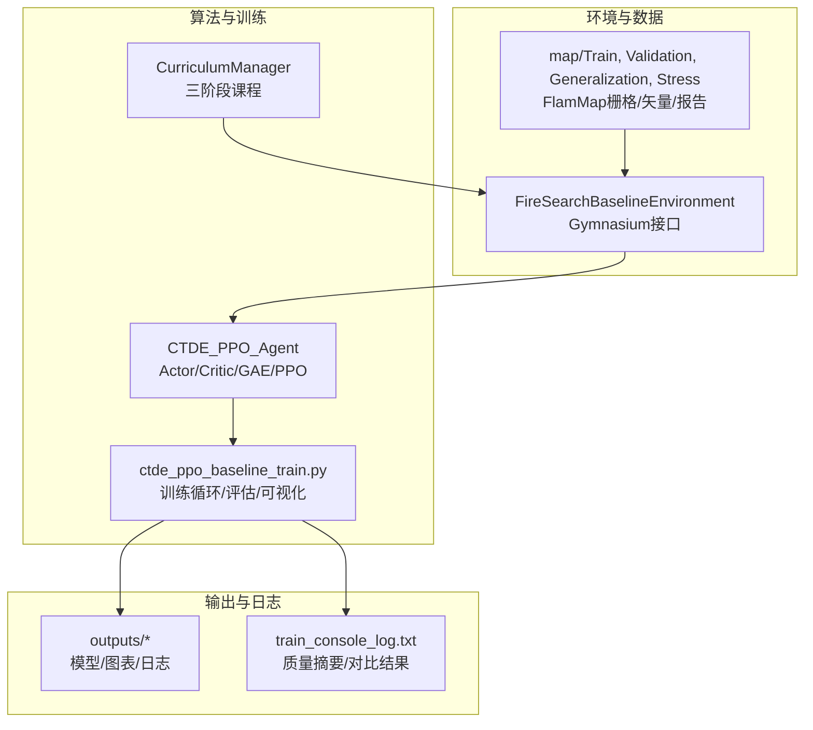
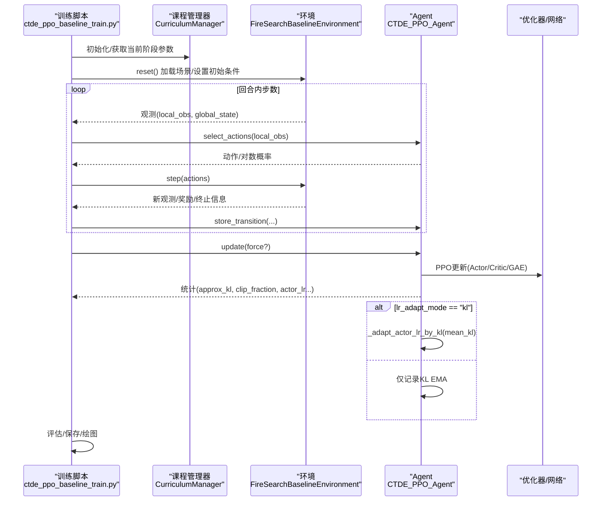
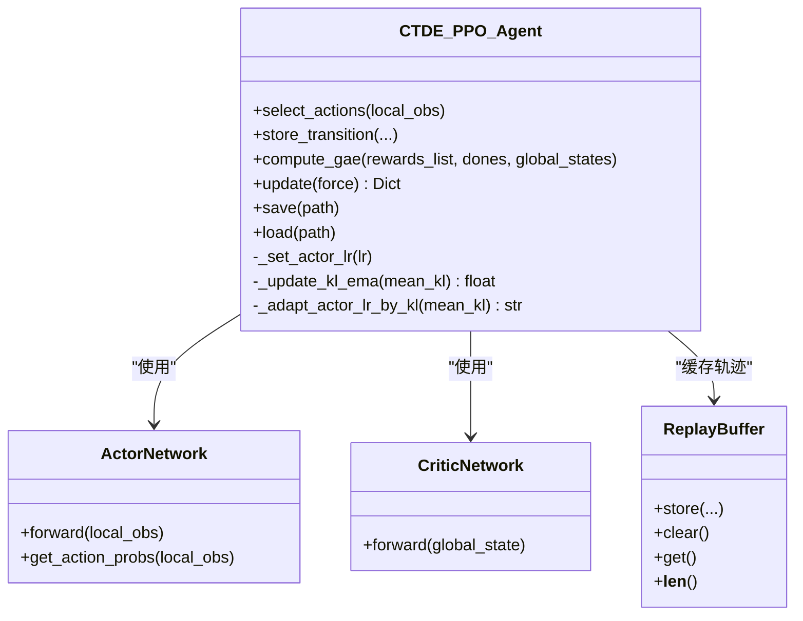
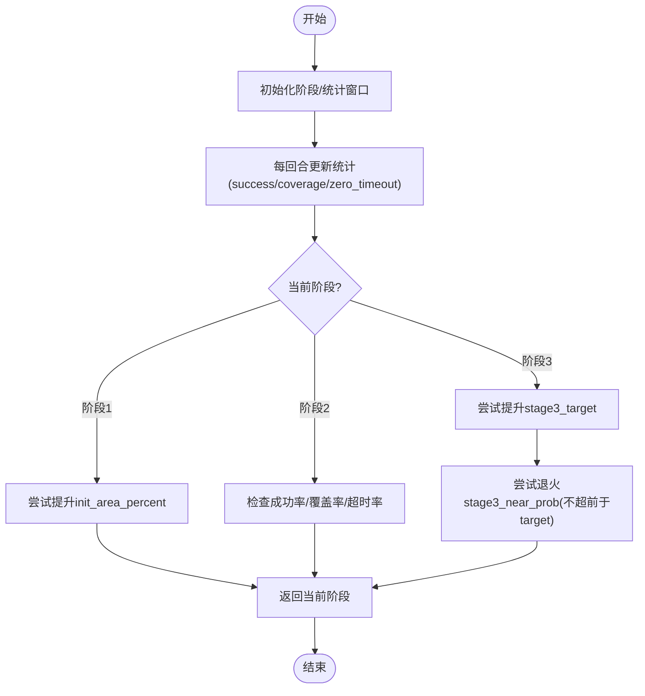
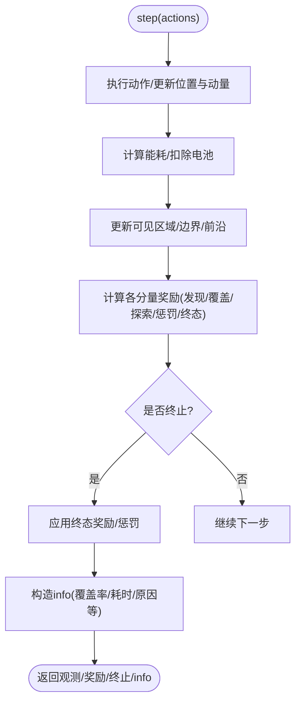
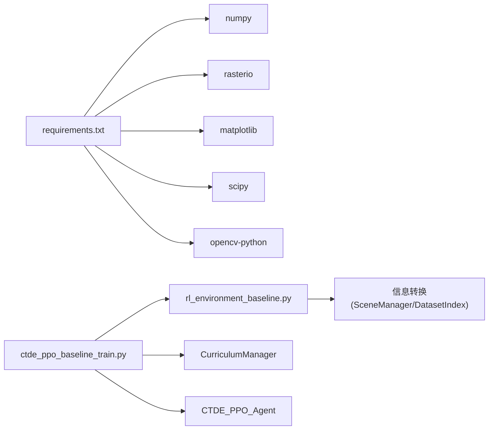

# 项目背景与目标

<cite>
**本文引用的文件**   
- [ctde_ppo_baseline_train.py](file://environment_variables/environment_variables/ctde_ppo_baseline_train.py)
- [rl_environment_baseline.py](file://environment_variables/environment_variables/rl_environment_baseline.py)
- [requirements.txt](file://environment_variables/requirements.txt)
- [train_console_log.txt（示例）](file://environment_variables/environment_variables/outputs/lr_comparison_20260709_095438/训练结果/Fixed_LR_CTDE_PPO_seed42/train_console_log.txt)
</cite>

## 目录
1. [引言](#引言)
2. [项目结构](#项目结构)
3. [核心组件](#核心组件)
4. [架构总览](#架构总览)
5. [详细组件分析](#详细组件分析)
6. [依赖关系分析](#依赖关系分析)
7. [性能考量](#性能考量)
8. [故障排查指南](#故障排查指南)
9. [结论](#结论)
10. [附录](#附录)

## 引言
森林火灾应急响应中，多无人机协同搜索是快速定位火线边界、评估蔓延态势、辅助指挥决策的关键环节。传统方法通常依赖固定规则或离线规划，难以应对复杂地形、动态风场与火势演化带来的强不确定性；同时，现场实时决策对延迟和鲁棒性要求极高。本项目面向“自适应参数调整的智能系统”，以强化学习为核心，构建CTDE-PPO基线算法与课程学习机制，结合自适应学习率策略，提升在多变场景下的搜索效率与成功率。

技术动机：
- CTDE-PPO优势：通过集中式训练与分布式执行，兼顾多智能体协作与在线部署的可行性；PPO的裁剪目标与KL约束有助于稳定更新。
- 课程学习的必要性：从易到难逐步提升任务难度（初始区域比例、目标覆盖率、近界生成概率），加速收敛并提高泛化能力。
- 自适应学习率的创新点：基于近似KL散度的指数型调节，使策略在网络更新过程中保持稳定的分布偏移，避免过拟合或震荡。

应用价值：
- 为一线消防提供可解释、可复现实验的训练管线与评估体系，支撑不同地图与气象条件下的策略迁移。
- 通过对比固定学习率与KL自适应学习率的结果，量化自适应机制在稳定性与最终性能上的收益，为工程落地提供依据。

[本节不直接分析具体代码文件]

## 项目结构
仓库围绕“环境+算法+训练”组织，关键路径如下：
- environment_variables/environment_variables：包含CTDE-PPO训练脚本与基线环境实现
- map：按训练/验证/泛化/压力测试划分的FlamMap场景数据
- outputs：多次实验的输出、图表与日志

图示来源
- [ctde_ppo_baseline_train.py:1-1200](file://environment_variables/environment_variables/ctde_ppo_baseline_train.py#L1-L1200)
- [rl_environment_baseline.py:1-1027](file://environment_variables/environment_variables/rl_environment_baseline.py#L1-L1027)

章节来源
- [ctde_ppo_baseline_train.py:1-200](file://environment_variables/environment_variables/ctde_ppo_baseline_train.py#L1-L200)
- [rl_environment_baseline.py:1-120](file://environment_variables/environment_variables/rl_environment_baseline.py#L1-L120)

## 核心组件
- FireSearchBaselineEnvironment：定义多无人机火场搜索的Gymnasium环境，支持多种观测配置与奖励剖面，内置动态火线检测、热势场、风向影响与电池消耗等要素。
- CTDE_PPO_Agent：实现Actor-Critic网络、GAE优势估计、PPO裁剪更新与可选的KL自适应学习率策略。
- CurriculumManager：管理三阶段课程学习，包括初始区域比例阶梯、目标覆盖率阶梯与近界生成概率退火，并在最后阶段进行聚焦评估。
- 训练主循环：负责数据集选择、训练/验证/泛化/压力测试评估、模型保存、图表生成与质量指标计算。

章节来源
- [rl_environment_baseline.py:21-120](file://environment_variables/environment_variables/rl_environment_baseline.py#L21-L120)
- [ctde_ppo_baseline_train.py:568-758](file://environment_variables/environment_variables/ctde_ppo_baseline_train.py#L568-L758)
- [ctde_ppo_baseline_train.py:759-1014](file://environment_variables/environment_variables/ctde_ppo_baseline_train.py#L759-L1014)

## 架构总览
下图展示训练期端到端流程：训练脚本驱动环境与环境管理器，Agent采样动作并收集轨迹，PPO更新后根据KL散度自适应调整学习率，随后进入评估与可视化。

图示来源
- [ctde_ppo_baseline_train.py:1085-1114](file://environment_variables/environment_variables/ctde_ppo_baseline_train.py#L1085-L1114)
- [ctde_ppo_baseline_train.py:889-991](file://environment_variables/environment_variables/ctde_ppo_baseline_train.py#L889-L991)
- [rl_environment_baseline.py:842-992](file://environment_variables/environment_variables/rl_environment_baseline.py#L842-L992)

## 详细组件分析

### 组件一：CTDE-PPO Agent与自适应学习率
- Actor/Critic网络：采用多层全连接+LayerNorm+残差连接，Actor输出离散动作概率，Critic输出全局状态价值。
- GAE与PPO更新：对团队平均奖励计算优势与回报，使用裁剪目标与熵正则，梯度裁剪防止不稳定。
- KL自适应学习率：维护近似KL的指数移动平均，按指数因子调节actor学习率，限制在[min,max]区间，避免策略分布剧烈偏移。

图示来源
- [ctde_ppo_baseline_train.py:460-535](file://environment_variables/environment_variables/ctde_ppo_baseline_train.py#L460-L535)
- [ctde_ppo_baseline_train.py:537-567](file://environment_variables/environment_variables/ctde_ppo_baseline_train.py#L537-L567)
- [ctde_ppo_baseline_train.py:759-1014](file://environment_variables/environment_variables/ctde_ppo_baseline_train.py#L759-L1014)

章节来源
- [ctde_ppo_baseline_train.py:759-1014](file://environment_variables/environment_variables/ctde_ppo_baseline_train.py#L759-L1014)

### 组件二：课程学习管理器
- 三阶段设计：
  - 阶段1：低门槛探索，鼓励发现少量边界点，逐步提升初始区域比例。
  - 阶段2：提高覆盖率目标，降低零覆盖超时容忍度。
  - 阶段3：进一步提升目标覆盖率，并对近界生成概率进行能力绑定退火，确保不超前于目标进度。
- 能力门控：以成功率、零覆盖超时率与覆盖率作为门槛，满足最小回合数后推进。
- 终端聚焦：在最后若干回合强制切换到最终目标与near_prob=0，用于严格评估。

图示来源
- [ctde_ppo_baseline_train.py:568-758](file://environment_variables/environment_variables/ctde_ppo_baseline_train.py#L568-L758)

章节来源
- [ctde_ppo_baseline_train.py:568-758](file://environment_variables/environment_variables/ctde_ppo_baseline_train.py#L568-L758)

### 组件三：基线环境与任务建模
- 观测与全局状态：
  - 本地观测包含位置、电量、局部火情特征、风场、DEM/坡度、热梯度、动量、相机方向等，支持baseline/static_terrain/dynamic_front/risk_aware四种配置。
  - 全局状态聚合队伍覆盖率、平均/最低电量、队形中心与分散、距火距离、时间步占比、已访问密度、课程阶段、风速/高程均值、边界确认特征、低电量指示、无人机数量、覆盖率梯度与未覆盖密度等。
- 动作与物理：
  - 离散动作集（上下左右静止），考虑风向对能耗的影响与电池衰减。
- 奖励设计：
  - 基础奖励：发现边界点、探索新区域、惩罚重复与空闲、惩罚靠近队友。
  - 预边界引导：在未检测到边界时，依据热势增量给予弱引导。
  - 终态奖励/惩罚：成功完成提前终止并给予效率加成；超时/电量耗尽施加惩罚。
- 动态火线：每隔若干步重新检测火线边界并更新热力场，保证环境随时间演化。

图示来源
- [rl_environment_baseline.py:842-992](file://environment_variables/environment_variables/rl_environment_baseline.py#L842-L992)
- [rl_environment_baseline.py:692-806](file://environment_variables/environment_variables/rl_environment_baseline.py#L692-L806)

章节来源
- [rl_environment_baseline.py:21-120](file://environment_variables/environment_variables/rl_environment_baseline.py#L21-L120)
- [rl_environment_baseline.py:842-992](file://environment_variables/environment_variables/rl_environment_baseline.py#L842-L992)

## 依赖关系分析
- 运行依赖：numpy、rasterio、matplotlib、scipy、opencv-python；强化学习相关依赖（torch、stable-baselines3、tensorboard）为可选。
- 模块耦合：
  - 训练脚本依赖环境类与数据模块，课程管理器与Agent共同驱动训练循环。
  - 环境依赖场景管理器与FlamMap数据，读取栅格/矢量/报告并计算热势场与边界。
- 外部集成点：
  - Gymnasium接口便于与其他RL框架对接。
  - 输出目录结构统一，便于自动化评估与可视化。

图示来源
- [requirements.txt:1-13](file://environment_variables/requirements.txt#L1-L13)
- [ctde_ppo_baseline_train.py:1-40](file://environment_variables/environment_variables/ctde_ppo_baseline_train.py#L1-L40)
- [rl_environment_baseline.py:1-20](file://environment_variables/environment_variables/rl_environment_baseline.py#L1-L20)

章节来源
- [requirements.txt:1-13](file://environment_variables/requirements.txt#L1-L13)
- [ctde_ppo_baseline_train.py:1-40](file://environment_variables/environment_variables/ctde_ppo_baseline_train.py#L1-L40)
- [rl_environment_baseline.py:1-20](file://environment_variables/environment_variables/rl_environment_baseline.py#L1-L20)

## 性能考量
- 训练稳定性：PPO裁剪与KL约束配合自适应学习率，可有效控制策略分布偏移，减少震荡。
- 课程学习：分阶段提升难度，缩短前期探索成本，提高后期目标达成率。
- 评估指标：除任务得分外，还关注尾部分布标准差、KL超限率、AUC等，综合衡量收敛效率与稳定性。
- 资源利用：批量大小与mini-batch规模可调，设备自动选择GPU/CPU，便于在不同硬件上运行。

[本节提供通用指导，不直接分析具体代码文件]

## 故障排查指南
- 训练日志缺失或路径错误：检查输出目录与源码快照复制逻辑，确保训练脚本能写入控制台日志与模型文件。
- 学习率异常：若lr_adapt_mode为kl，需关注approx_kl与kl_ema，必要时调整target_kl、kl_lr_alpha与lr_min/max范围。
- 课程阶段无法推进：检查成功率、覆盖率与零覆盖超时率是否达到门限，以及最小回合数是否满足。
- 环境维度不匹配：确认observation_profile与reward_profile在允许集合内，且与网络输入维度一致。
- 对比结果解读：参考训练日志中的质量摘要与对比条目，比较固定学习率与KL自适应学习率在AUC、尾部分布标准差、KL超限率与泛化/压力测试结果上的差异。

章节来源
- [ctde_ppo_baseline_train.py:1016-1045](file://environment_variables/environment_variables/ctde_ppo_baseline_train.py#L1016-L1045)
- [train_console_log.txt（示例）:1048-1058](file://environment_variables/environment_variables/outputs/lr_comparison_20260709_095438/训练结果/Fixed_LR_CTDE_PPO_seed42/train_console_log.txt#L1048-L1058)

## 结论
本项目以CTDE-PPO为基线，结合课程学习与KL自适应学习率，构建了面向森林火灾多无人机协同搜索的可复现实验平台。通过严格的阶段推进与多维评估指标，系统在复杂动态环境中展现出更稳健的学习过程与更高的任务成功率。未来可在更多地形与气象条件下扩展场景库，进一步验证策略的泛化性与鲁棒性，推动其在实际应急指挥中的应用。

[本节为总结性内容，不直接分析具体代码文件]

## 附录
- 典型训练输出字段说明（来自训练日志）：
  - 质量摘要：AUC、尾部分布标准差、KL超限率
  - 对比变体：Fixed_LR_CTDE_PPO与KL_LR_CTDE_PPO在各指标上的表现
  - 评估结果：泛化与压力测试的任务得分与成功率

章节来源
- [train_console_log.txt（示例）:878-880](file://environment_variables/environment_variables/outputs/lr_comparison_20260709_095438/训练结果/Fixed_LR_CTDE_PPO_seed42/train_console_log.txt#L878-L880)